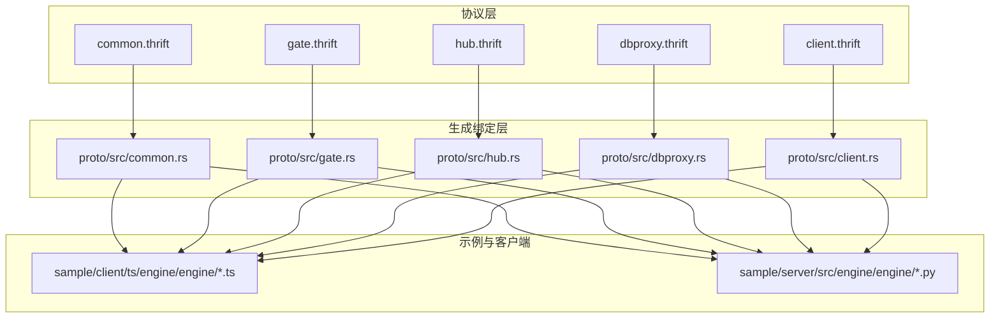
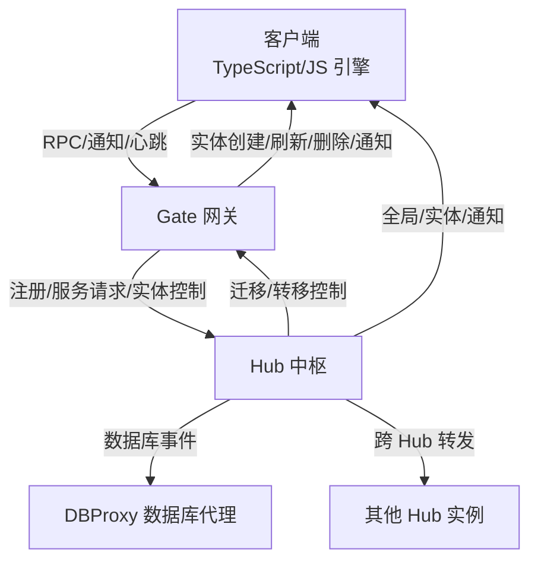
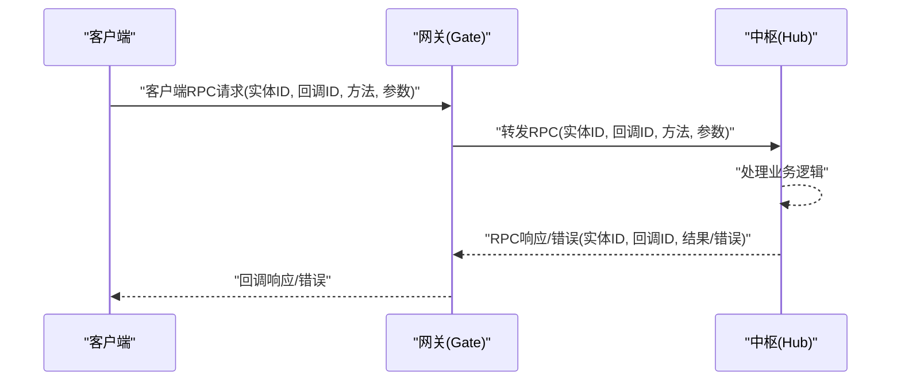
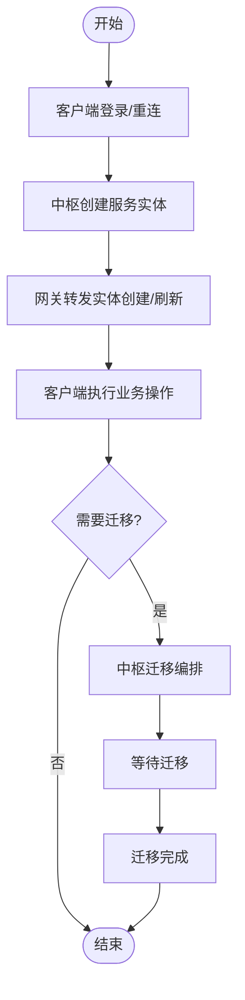
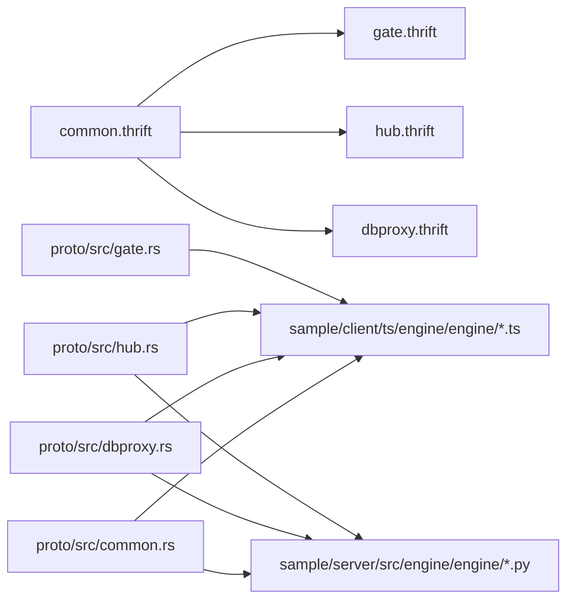

# API 参考

<cite>
**本文引用的文件**
- [crates/proto/proto/common.thrift](file://crates/proto/proto/common.thrift)
- [crates/proto/proto/client.thrift](file://crates/proto/proto/client.thrift)
- [crates/proto/proto/gate.thrift](file://crates/proto/proto/gate.thrift)
- [crates/proto/proto/hub.thrift](file://crates/proto/proto/hub.thrift)
- [crates/proto/proto/dbproxy.thrift](file://crates/proto/proto/dbproxy.thrift)
- [crates/proto/src/common.rs](file://crates/proto/src/common.rs)
- [crates/proto/src/client.rs](file://crates/proto/src/client.rs)
- [crates/proto/src/gate.rs](file://crates/proto/src/gate.rs)
- [crates/proto/src/hub.rs](file://crates/proto/src/hub.rs)
- [crates/proto/src/dbproxy.rs](file://crates/proto/src/dbproxy.rs)
- [sample/client/ts/engine/engine/player.ts](file://sample/client/ts/engine/engine/player.ts)
- [sample/client/ts/engine/engine/base_entity.ts](file://sample/client/ts/engine/engine/base_entity.ts)
- [sample/client/ts/engine/engine/session.ts](file://sample/client/ts/engine/engine/session.ts)
- [sample/server/src/engine/engine/base_entity.py](file://sample/server/src/engine/engine/base_entity.py)
- [sample/server/src/engine/engine/session.py](file://sample/server/src/engine/engine/session.py)
</cite>

## 目录
1. [简介](#简介)
2. [项目结构](#项目结构)
3. [核心组件](#核心组件)
4. [架构总览](#架构总览)
5. [详细组件分析](#详细组件分析)
6. [依赖关系分析](#依赖关系分析)
7. [性能考虑](#性能考虑)
8. [故障排查指南](#故障排查指南)
9. [结论](#结论)
10. [附录](#附录)

## 简介
本参考文档面向 geese 框架的 API 使用者与集成开发者，系统化梳理以下内容：
- Thrift RPC 接口定义与使用：包括客户端到网关（Gate）、网关到中枢（Hub）、中枢到数据库代理（DBProxy）以及中枢内部 Hub-to-Hub 的消息协议。
- 消息协议规范：消息体结构、字段定义、编码规则与序列化约定。
- 实体管理 API：实体创建、刷新、删除、迁移与主从控制。
- 会话管理、连接控制与权限验证流程。
- 版本兼容性、废弃接口与迁移指南。

本文件以仓库中的 Thrift 定义与生成的 Rust 绑定为权威来源，并结合 TypeScript/Python 示例工程展示典型调用模式与回调处理。

## 项目结构
geese 采用分层与模块化的组织方式：
- 协议层：crates/proto/proto 下的 *.thrift 文件定义了跨进程通信的消息结构与 RPC 调用契约。
- 生成绑定层：crates/proto/src/*.rs 对应各模块的 Rust 绑定，便于在 Rust 服务中直接使用 Thrift 结构。
- 示例与客户端：sample/client/ts 与 sample/server 提供前端 TypeScript 与后端 Python 的使用示例，展示实体、会话与 RPC 回调的典型实现。

图表来源
- [crates/proto/proto/common.thrift](file://crates/proto/proto/common.thrift)
- [crates/proto/proto/gate.thrift](file://crates/proto/proto/gate.thrift)
- [crates/proto/proto/hub.thrift](file://crates/proto/proto/hub.thrift)
- [crates/proto/proto/dbproxy.thrift](file://crates/proto/proto/dbproxy.thrift)
- [crates/proto/proto/client.thrift](file://crates/proto/proto/client.thrift)
- [crates/proto/src/common.rs](file://crates/proto/src/common.rs)
- [crates/proto/src/gate.rs](file://crates/proto/src/gate.rs)
- [crates/proto/src/hub.rs](file://crates/proto/src/hub.rs)
- [crates/proto/src/dbproxy.rs](file://crates/proto/src/dbproxy.rs)
- [crates/proto/src/client.rs](file://crates/proto/src/client.rs)
- [sample/client/ts/engine/engine/player.ts](file://sample/client/ts/engine/engine/player.ts)
- [sample/server/src/engine/engine/base_entity.py](file://sample/server/src/engine/engine/base_entity.py)

章节来源
- [crates/proto/proto/common.thrift](file://crates/proto/proto/common.thrift)
- [crates/proto/proto/gate.thrift](file://crates/proto/proto/gate.thrift)
- [crates/proto/proto/hub.thrift](file://crates/proto/proto/hub.thrift)
- [crates/proto/proto/dbproxy.thrift](file://crates/proto/proto/dbproxy.thrift)
- [crates/proto/proto/client.thrift](file://crates/proto/proto/client.thrift)

## 核心组件
本节聚焦于三大核心子系统及其职责：
- Gate（网关）：负责与客户端建立连接、转发 RPC/通知、心跳、迁移与踢人等控制消息。
- Hub（中枢）：负责实体生命周期管理、服务路由、跨 Hub 消息转发、迁移编排与数据库回调。
- DBProxy（数据库代理）：负责统一的数据库 CRUD 事件与回调，屏蔽具体存储细节。

章节来源
- [crates/proto/proto/gate.thrift](file://crates/proto/proto/gate.thrift)
- [crates/proto/proto/hub.thrift](file://crates/proto/proto/hub.thrift)
- [crates/proto/proto/dbproxy.thrift](file://crates/proto/proto/dbproxy.thrift)

## 架构总览
下图展示了客户端、Gate、Hub、DBProxy 之间的交互关系与消息流向。

图表来源
- [crates/proto/proto/gate.thrift](file://crates/proto/proto/gate.thrift)
- [crates/proto/proto/hub.thrift](file://crates/proto/proto/hub.thrift)
- [crates/proto/proto/dbproxy.thrift](file://crates/proto/proto/dbproxy.thrift)
- [crates/proto/proto/client.thrift](file://crates/proto/proto/client.thrift)

## 详细组件分析

### 通用消息与编码规范
- 通用消息结构
  - 字段：方法名、二进制参数包
  - 用途：承载 RPC 请求/响应/通知的统一载体
- RPC 响应与错误
  - 字段：实体 ID、回调 ID、二进制结果/错误数据
  - 用途：服务端对客户端请求的异步回包
- Redis 消息桥接
  - 字段：服务器名、二进制消息
  - 用途：跨服务广播或队列消息的封装
- 服务器注册
  - 字段：名称、类型
  - 回调：注册成功后的名称确认

章节来源
- [crates/proto/proto/common.thrift](file://crates/proto/proto/common.thrift)

### 客户端到网关（Gate）接口
- 登录与重连
  - 登录：携带 SDK 标识与参数包
  - 重连：携带账号标识与参数包
- 服务请求
  - 字段：服务名、参数包
- RPC/通知/心跳
  - RPC：实体 ID、回调 ID、消息体
  - 通知：实体 ID、消息体
  - 心跳：空结构
- 网关侧下行消息
  - 实体创建/刷新/删除
  - 连接 ID 通知
  - 踢人通知
  - 转移完成
  - RPC/通知/全局消息
  - 心跳

章节来源
- [crates/proto/proto/gate.thrift](file://crates/proto/proto/gate.thrift)
- [crates/proto/proto/client.thrift](file://crates/proto/proto/client.thrift)

### 网关到中枢（Hub）接口
- 客户端接入与断开
  - 登录/重连：网关名、网关地址、连接 ID、SDK 标识/账号标识、参数包
  - 断开：连接 ID
  - 转移消息结束：连接 ID、是否踢人
- 实体迁移控制
  - 实体控制：实体 ID、是否主实体、是否重连、目标网关名/连接 ID
  - 等待迁移/迁移完成：实体 ID
- 客户端服务请求
  - 请求：服务名、网关信息、连接 ID、参数包
  - 扩展：多网关请求聚合
- RPC/通知/全局消息
  - 客户端 RPC：连接 ID、实体 ID、回调 ID、消息体
  - 回包：响应/错误
  - 通知：实体 ID、消息体
- 服务器注册
  - 注册：名称、类型
  - 回调：名称确认

章节来源
- [crates/proto/proto/gate.thrift](file://crates/proto/proto/gate.thrift)
- [crates/proto/proto/hub.thrift](file://crates/proto/proto/hub.thrift)

### 中枢到中枢（Hub-to-Hub）接口
- 服务实体查询与创建
  - 查询：服务名
  - 创建：是否迁移、服务名、实体 ID、实体类型、参数包
- 跨 Hub RPC/通知
  - RPC：实体 ID、回调 ID、消息体
  - 回包：响应/错误
  - 通知：实体 ID、消息体
- 实体迁移编排
  - 等待迁移：实体 ID
  - 迁移：服务名、实体 ID、实体类型、主网关名/主连接 ID、候选网关/中枢列表、参数包
  - 创建迁移实体：中枢名、实体 ID
  - 迁移完成：中枢名、实体 ID
- 扩展请求转发
  - 多源请求聚合：服务名、请求信息列表（含网关名/主机/连接 ID/参数包）

章节来源
- [crates/proto/proto/hub.thrift](file://crates/proto/proto/hub.thrift)

### 数据库代理（DBProxy）接口
- 事件类型
  - 注册 Hub：Hub 名称
  - 获取 GUID：数据库、集合、回调 ID
  - 创建对象：数据库、集合、回调 ID、对象信息
  - 更新对象：数据库、集合、回调 ID、查询条件、更新信息、是否 upsert
  - 条件修改：数据库、集合、回调 ID、查询条件、更新信息、是否返回新文档、是否 upsert
  - 删除对象：数据库、集合、回调 ID、查询条件
  - 查询对象：数据库、集合、回调 ID、查询条件、偏移、限制、排序、方向
  - 查询计数：数据库、集合、回调 ID、查询条件
- 回调类型
  - GUID 回调：回调 ID、GUID
  - 对象操作回包：创建/更新/删除/条件修改/计数/查询结果/查询结束

章节来源
- [crates/proto/proto/dbproxy.thrift](file://crates/proto/proto/dbproxy.thrift)

### 客户端实体与会话模型（示例）
- 基类实体
  - 字段：实体类型、实体 ID
- 玩家实体
  - 字段：请求回调 ID、请求回调映射、通知回调映射、回调映射
  - 方法：注册请求/通知回调、发起 RPC 请求、处理响应/错误、发送通知
- 会话
  - 字段：来源标识
  - 用途：承载上下文与连接状态

章节来源
- [sample/client/ts/engine/engine/base_entity.ts](file://sample/client/ts/engine/engine/base_entity.ts)
- [sample/client/ts/engine/engine/player.ts](file://sample/client/ts/engine/engine/player.ts)
- [sample/client/ts/engine/engine/session.ts](file://sample/client/ts/engine/engine/session.ts)
- [sample/server/src/engine/engine/base_entity.py](file://sample/server/src/engine/engine/base_entity.py)
- [sample/server/src/engine/engine/session.py](file://sample/server/src/engine/engine/session.py)

### RPC 调用时序（客户端 → 网关 → 中枢）

图表来源
- [crates/proto/proto/gate.thrift](file://crates/proto/proto/gate.thrift)
- [crates/proto/proto/hub.thrift](file://crates/proto/proto/hub.thrift)
- [crates/proto/proto/client.thrift](file://crates/proto/proto/client.thrift)

### 实体生命周期与迁移流程

图表来源
- [crates/proto/proto/hub.thrift](file://crates/proto/proto/hub.thrift)
- [crates/proto/proto/gate.thrift](file://crates/proto/proto/gate.thrift)
- [crates/proto/proto/client.thrift](file://crates/proto/proto/client.thrift)

## 依赖关系分析
- 协议依赖
  - gate.thrift、hub.thrift、dbproxy.thrift 均复用 common.thrift 的通用消息与注册结构。
- 生成绑定
  - 各模块的 Rust 绑定文件对应 Thrift 定义，提供类型安全的消息编解码与序列化支持。
- 示例依赖
  - TypeScript 客户端通过生成的协议模块与上下文进行 RPC/通知收发；Python 服务端通过引擎基类进行日志与实体管理。

图表来源
- [crates/proto/proto/common.thrift](file://crates/proto/proto/common.thrift)
- [crates/proto/proto/gate.thrift](file://crates/proto/proto/gate.thrift)
- [crates/proto/proto/hub.thrift](file://crates/proto/proto/hub.thrift)
- [crates/proto/proto/dbproxy.thrift](file://crates/proto/proto/dbproxy.thrift)
- [crates/proto/src/gate.rs](file://crates/proto/src/gate.rs)
- [crates/proto/src/hub.rs](file://crates/proto/src/hub.rs)
- [crates/proto/src/dbproxy.rs](file://crates/proto/src/dbproxy.rs)
- [crates/proto/src/common.rs](file://crates/proto/src/common.rs)
- [sample/client/ts/engine/engine/player.ts](file://sample/client/ts/engine/engine/player.ts)
- [sample/server/src/engine/engine/base_entity.py](file://sample/server/src/engine/engine/base_entity.py)

## 性能考虑
- 序列化与传输
  - Thrift 二进制消息体（binary argvs）建议配合高效压缩策略（如 zlib/snappy）在高延迟网络中降低带宽占用。
- 回调去抖与批处理
  - 高频通知可合并批处理，减少网关与中枢的转发压力。
- 迁移窗口管理
  - 迁移前预留“消息结束”窗口，避免迁移过程中丢失关键消息。
- 日志与追踪
  - 建议在实体基类中统一注入 trace/debug/info/warn/error 日志方法，便于定位性能瓶颈与异常路径。

## 故障排查指南
- 常见问题
  - 回调未触发：检查客户端是否正确注册请求/通知回调，确认回调 ID 递增与匹配。
  - 实体未刷新：确认中枢已下发“实体刷新”消息，且客户端上下文已更新实体状态。
  - 迁移失败：核对“等待迁移/迁移完成”消息链路，确保网关与中枢状态一致。
  - 数据库写入失败：检查 DBProxy 回调是否返回失败，必要时启用 upsert 并重试。
- 日志与追踪
  - 服务端实体基类提供统一日志方法，便于按实体类型与 ID 进行过滤与检索。

章节来源
- [sample/server/src/engine/engine/base_entity.py](file://sample/server/src/engine/engine/base_entity.py)
- [crates/proto/proto/hub.thrift](file://crates/proto/proto/hub.thrift)
- [crates/proto/proto/dbproxy.thrift](file://crates/proto/proto/dbproxy.thrift)

## 结论
本文档基于仓库内的 Thrift 定义与生成绑定，系统化梳理了 geese 的 RPC 接口、消息协议与实体管理机制，并结合示例工程展示了客户端与服务端的典型用法。建议在实际集成中：
- 严格遵循消息字段与编码规范；
- 在客户端妥善管理回调映射与实体状态；
- 在服务端通过统一的日志与实体基类提升可观测性；
- 在迁移与跨 Hub 场景中，确保消息顺序与完整性。

## 附录

### 版本兼容性与迁移指南
- 兼容性原则
  - 新增字段建议保持向后兼容，避免破坏既有解析。
  - 删除字段请保留别名或在版本升级时明确标注弃用。
- 迁移步骤
  - 协议升级：先在测试环境部署新 Thrift 定义与生成绑定。
  - 客户端适配：更新协议模块与回调处理逻辑。
  - 服务端适配：更新 Hub/Gate/DBProxy 的处理分支，兼容旧字段。
  - 切流与回滚：逐步切流并准备回滚方案。
- 废弃接口
  - 若某字段/结构被标记为废弃，请尽快替换为新字段/结构，并在后续版本移除。

### API 使用清单（示例）
- 客户端
  - 注册请求回调：注册方法到回调映射，接收 RPC 请求时调用回调。
  - 发起 RPC 请求：生成回调 ID，调用上下文发送 RPC。
  - 处理响应/错误：根据回调 ID 查找并执行回调，随后清理映射。
  - 发送通知：指定实体 ID 与方法名，发送通知。
- 服务端
  - 实体基类：提供日志方法，便于输出实体维度的运行时信息。
  - 会话基类：保存来源标识，便于连接与会话管理。

章节来源
- [sample/client/ts/engine/engine/player.ts](file://sample/client/ts/engine/engine/player.ts)
- [sample/client/ts/engine/engine/base_entity.ts](file://sample/client/ts/engine/engine/base_entity.ts)
- [sample/client/ts/engine/engine/session.ts](file://sample/client/ts/engine/engine/session.ts)
- [sample/server/src/engine/engine/base_entity.py](file://sample/server/src/engine/engine/base_entity.py)
- [sample/server/src/engine/engine/session.py](file://sample/server/src/engine/engine/session.py)