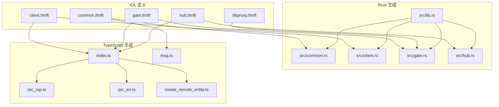
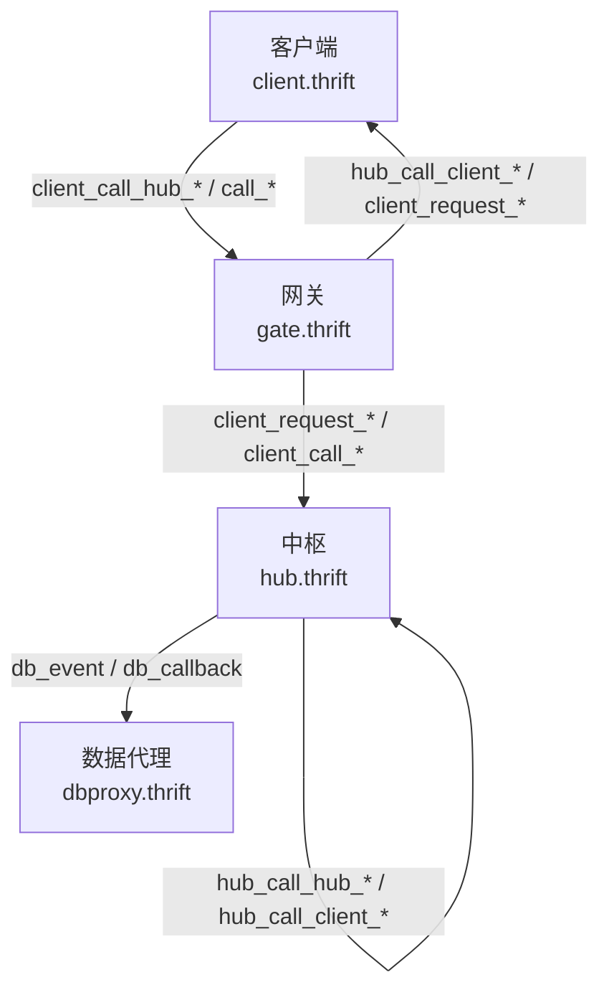
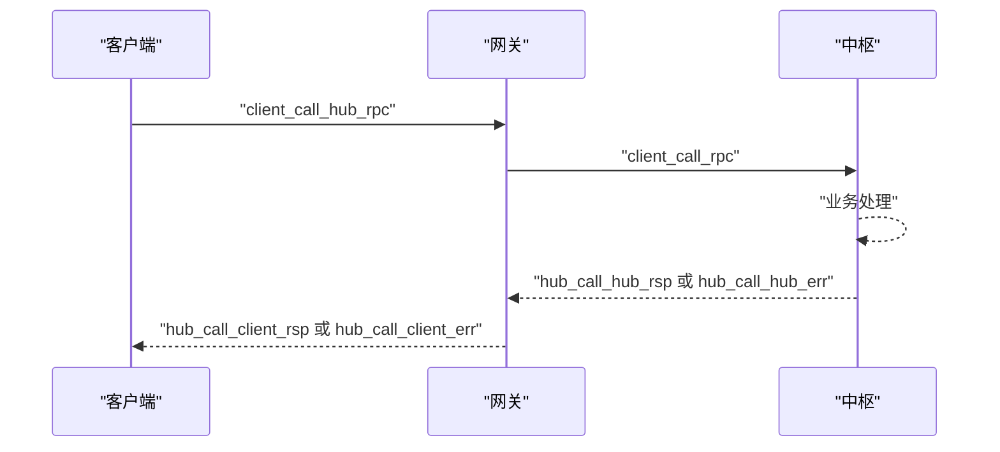
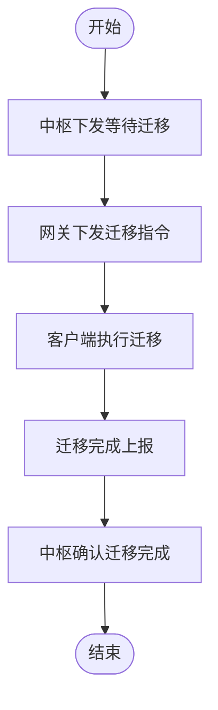
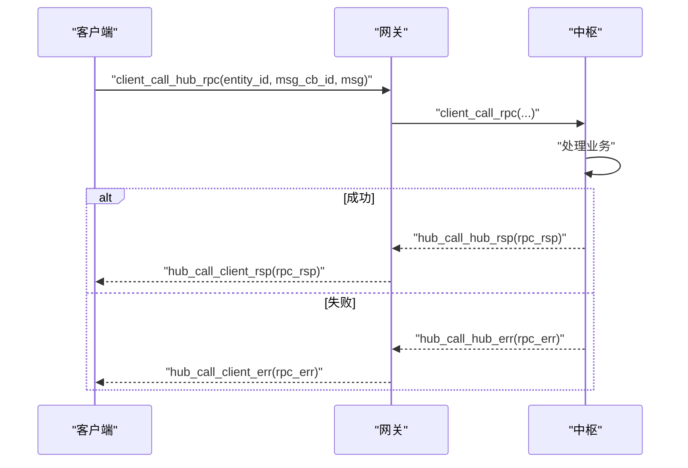
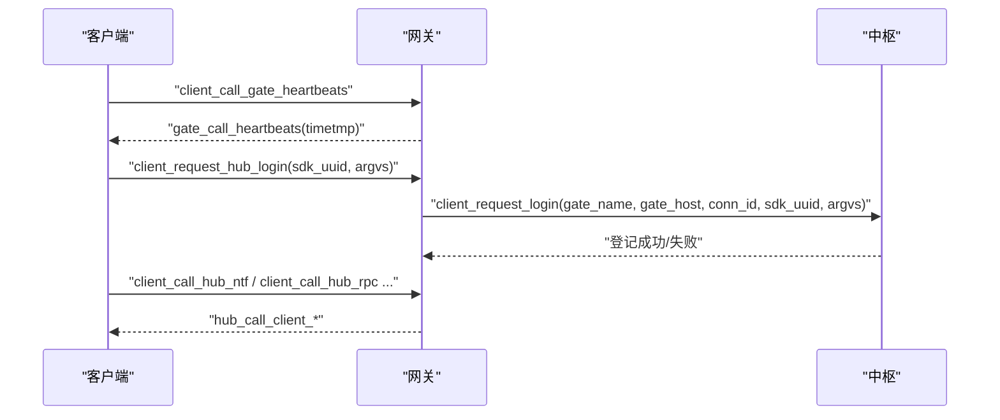
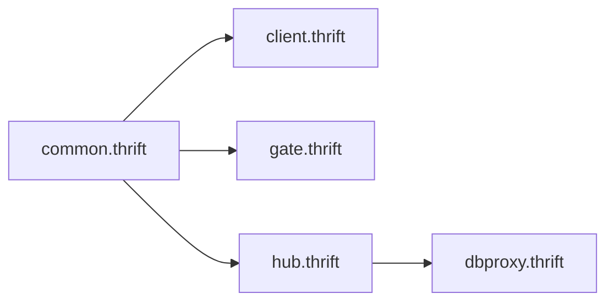

# 协议规范

<cite>
**本文引用的文件**
- [crates/proto/proto/common.thrift](file://crates/proto/proto/common.thrift)
- [crates/proto/proto/client.thrift](file://crates/proto/proto/client.thrift)
- [crates/proto/proto/gate.thrift](file://crates/proto/proto/gate.thrift)
- [crates/proto/proto/hub.thrift](file://crates/proto/proto/hub.thrift)
- [crates/proto/proto/dbproxy.thrift](file://crates/proto/proto/dbproxy.thrift)
- [crates/proto/src/common.rs](file://crates/proto/src/common.rs)
- [crates/proto/src/client.rs](file://crates/proto/src/client.rs)
- [crates/proto/src/gate.rs](file://crates/proto/src/gate.rs)
- [crates/proto/src/hub.rs](file://crates/proto/src/hub.rs)
- [crates/proto/src/lib.rs](file://crates/proto/src/lib.rs)
- [expand/ts/engine/proto/index.ts](file://expand/ts/engine/proto/index.ts)
- [expand/ts/engine/proto/msg.ts](file://expand/ts/engine/proto/msg.ts)
- [expand/ts/engine/proto/rpc_rsp.ts](file://expand/ts/engine/proto/rpc_rsp.ts)
- [expand/ts/engine/proto/rpc_err.ts](file://expand/ts/engine/proto/rpc_err.ts)
- [expand/ts/engine/proto/create_remote_entity.ts](file://expand/ts/engine/proto/create_remote_entity.ts)
</cite>

## 目录
1. [引言](#引言)
2. [项目结构](#项目结构)
3. [核心组件](#核心组件)
4. [架构总览](#架构总览)
5. [详细组件分析](#详细组件分析)
6. [依赖关系分析](#依赖关系分析)
7. [性能与序列化](#性能与序列化)
8. [故障排查指南](#故障排查指南)
9. [结论](#结论)
10. [附录：消息与字段定义](#附录消息与字段定义)

## 引言
本规范面向 geese 通信协议，系统性地定义了基于 Thrift 的消息模型、消息路由、实体生命周期管理、RPC 请求/响应与回调、连接管理（握手、心跳、断线）、以及版本兼容与升级策略。文档同时给出 Rust 与 TypeScript 双端的序列化/反序列化实现要点，帮助协议实现者准确落地。

## 项目结构
geese 的协议以 Thrift IDL 定义为核心，生成多语言代码：
- Thrift IDL 位于 crates/proto/proto 下，按模块拆分：common、client、gate、hub、dbproxy。
- Rust 侧通过 crates/proto/src 将各模块映射为可序列化结构体，并实现 TSerializable。
- TypeScript 侧通过 expand/ts/engine/proto 生成对应类型与读写逻辑，用于前端或 Node 环境。

图示来源
- [crates/proto/proto/common.thrift:1-39](file://crates/proto/proto/common.thrift#L1-L39)
- [crates/proto/proto/client.thrift:1-112](file://crates/proto/proto/client.thrift#L1-L112)
- [crates/proto/proto/gate.thrift:1-225](file://crates/proto/proto/gate.thrift#L1-L225)
- [crates/proto/proto/hub.thrift:1-292](file://crates/proto/proto/hub.thrift#L1-L292)
- [crates/proto/proto/dbproxy.thrift:1-72](file://crates/proto/proto/dbproxy.thrift#L1-L72)
- [crates/proto/src/lib.rs:1-5](file://crates/proto/src/lib.rs#L1-L5)
- [expand/ts/engine/proto/index.ts:1-51](file://expand/ts/engine/proto/index.ts#L1-L51)

章节来源
- [crates/proto/proto/common.thrift:1-39](file://crates/proto/proto/common.thrift#L1-L39)
- [crates/proto/proto/client.thrift:1-112](file://crates/proto/proto/client.thrift#L1-L112)
- [crates/proto/proto/gate.thrift:1-225](file://crates/proto/proto/gate.thrift#L1-L225)
- [crates/proto/proto/hub.thrift:1-292](file://crates/proto/proto/hub.thrift#L1-L292)
- [crates/proto/proto/dbproxy.thrift:1-72](file://crates/proto/proto/dbproxy.thrift#L1-L72)
- [crates/proto/src/lib.rs:1-5](file://crates/proto/src/lib.rs#L1-L5)
- [expand/ts/engine/proto/index.ts:1-51](file://expand/ts/engine/proto/index.ts#L1-L51)

## 核心组件
- 消息与 RPC 基础
  - msg：方法名 + 二进制参数包
  - rpc_rsp / rpc_err：统一的 RPC 回包与错误包，携带实体标识与回调 ID
- 客户端侧消息
  - create_remote_entity / delete_remote_entity / refresh_entity：实体生命周期管理
  - call_rpc / call_rsp / call_err / call_ntf / call_global：RPC/通知/全局消息
  - ntf_conn_id / kick_off / transfer_complete / gate_call_heartbeats：连接与心跳相关
- 网关侧消息
  - hub_call_client_*：向客户端下发实体变更、RPC、通知、全局消息
  - client_request_* / client_call_*：客户端到网关的请求与 RPC
  - hub_call_kick_off_client / hub_call_transfer_client 等：踢人、迁移控制
- 中枢侧消息
  - client_request_* / client_call_*：客户端到中枢的请求与 RPC
  - hub_call_hub_*：中枢内服务间 RPC/通知/迁移
  - query_service_entity / create_service_entity：服务实体查询与创建
- 数据代理侧消息
  - db_event / db_callback：数据库 CRUD 事件与回包

章节来源
- [crates/proto/proto/common.thrift:2-39](file://crates/proto/proto/common.thrift#L2-L39)
- [crates/proto/proto/client.thrift:7-112](file://crates/proto/proto/client.thrift#L7-L112)
- [crates/proto/proto/gate.thrift:8-225](file://crates/proto/proto/gate.thrift#L8-L225)
- [crates/proto/proto/hub.thrift:6-292](file://crates/proto/proto/hub.thrift#L6-L292)
- [crates/proto/proto/dbproxy.thrift:1-72](file://crates/proto/proto/dbproxy.thrift#L1-L72)

## 架构总览
下图展示三层交互：客户端（Client）—网关（Gate）—中枢（Hub），以及中枢内部服务间交互与数据代理交互。

图示来源
- [crates/proto/proto/client.thrift:99-112](file://crates/proto/proto/client.thrift#L99-L112)
- [crates/proto/proto/gate.thrift:135-225](file://crates/proto/proto/gate.thrift#L135-L225)
- [crates/proto/proto/hub.thrift:216-242](file://crates/proto/proto/hub.thrift#L216-L242)
- [crates/proto/proto/dbproxy.thrift:62-72](file://crates/proto/proto/dbproxy.thrift#L62-L72)

## 详细组件分析

### 消息格式与字段类型
- 公共结构
  - msg：字符串方法名 + 字节流参数
  - rpc_rsp / rpc_err：字符串实体 ID + 64 位回调 ID + 字节流结果/错误
- 客户端侧
  - create_remote_entity：字符串实体 ID、类型、是否主控、字节流参数
  - delete_remote_entity：字符串实体 ID
  - refresh_entity：同 create_remote_entity（刷新）
  - call_rpc/call_ntf/call_global：目标 Hub 名称（客户端侧为 hub_call_client_* 的上游）、实体 ID、消息体
  - call_rsp/call_err：封装 rpc_rsp/rpc_err
  - ntf_conn_id：连接 ID
  - kick_off：提示信息
  - transfer_complete：迁移完成
  - gate_call_heartbeats：时间戳
- 网关侧
  - hub_call_client_create_remote_entity：是否迁移、连接列表、主连接、实体信息、字节流参数
  - hub_call_client_delete/remove/refresh：实体操作
  - hub_call_client_rpc/rsp/err/ntf/global：RPC/回包/错误/通知/全局
  - hub_call_kick_off_client/_complete、hub_call_transfer_client/_complete、hub_call_wait_migrate_entity/_migrate_entity_complete：踢人、迁移控制
- 中枢侧
  - client_request_login/reconnect/service：登录/重连/服务请求
  - client_call_rpc/rsp/err/ntf：客户端到中枢 RPC
  - hub_call_hub_*：中枢内 RPC/通知/等待迁移/迁移实体/迁移完成
  - query_service_entity/create_service_entity：服务实体查询与创建
- 数据代理侧
  - db_event：注册 Hub、获取 GUID、创建/更新/查找并修改/删除/查询对象、计数
  - db_callback：各类 CRUD 回包

章节来源
- [crates/proto/proto/common.thrift:2-39](file://crates/proto/proto/common.thrift#L2-L39)
- [crates/proto/proto/client.thrift:7-112](file://crates/proto/proto/client.thrift#L7-L112)
- [crates/proto/proto/gate.thrift:8-225](file://crates/proto/proto/gate.thrift#L8-L225)
- [crates/proto/proto/hub.thrift:6-292](file://crates/proto/proto/hub.thrift#L6-L292)
- [crates/proto/proto/dbproxy.thrift:1-72](file://crates/proto/proto/dbproxy.thrift#L1-L72)

### 消息路由机制
- 客户端到网关
  - 客户端发起：client_call_hub_rpc/rsp/err/ntf、client_call_gate_heartbeats
  - 网关转发：client_request_hub_login/reconnect/service
- 网关到客户端
  - 网关下发：hub_call_client_create/delete/refresh/rpc/rsp/err/ntf/global
  - 控制类：kick_off、transfer_client、wait_migrate_entity、migrate_entity_complete
- 中枢内路由
  - 客户端到中枢：client_call_rpc/rsp/err/ntf
  - 中枢到中枢：hub_call_hub_rpc/rsp/err/ntf、迁移相关消息
  - 中枢到数据代理：db_event；数据代理回包：db_callback

图示来源
- [crates/proto/proto/gate.thrift:182-200](file://crates/proto/proto/gate.thrift#L182-L200)
- [crates/proto/proto/hub.thrift:72-99](file://crates/proto/proto/hub.thrift#L72-L99)
- [crates/proto/proto/hub.thrift:151-169](file://crates/proto/proto/hub.thrift#L151-L169)

### 实体管理协议
- 创建/删除/刷新
  - 客户端侧：create_remote_entity / delete_remote_entity / refresh_entity
  - 网关侧：hub_call_client_create_remote_entity / hub_call_client_delete_remote_entity / hub_call_client_refresh_entity
  - 刷新支持迁移标志与主连接标识，便于跨节点同步
- 迁移流程
  - 中枢通知网关：hub_call_wait_migrate_entity
  - 网关通知客户端：hub_call_transfer_client（含新网关、新连接等）
  - 客户端迁移完成：hub_call_transfer_entity_complete
  - 中枢确认迁移：hub_call_migrate_entity_complete

图示来源
- [crates/proto/proto/hub.thrift:182-184](file://crates/proto/proto/hub.thrift#L182-L184)
- [crates/proto/proto/gate.thrift:104-110](file://crates/proto/proto/gate.thrift#L104-L110)
- [crates/proto/proto/gate.thrift:115-118](file://crates/proto/proto/gate.thrift#L115-L118)
- [crates/proto/proto/hub.thrift:211-214](file://crates/proto/proto/hub.thrift#L211-L214)

### RPC 调用协议
- 请求/响应模式
  - 客户端：client_call_hub_rpc（含实体 ID、回调 ID、消息体）
  - 网关：client_call_rpc（转发至中枢）
  - 中枢：client_call_rpc（业务处理后返回 hub_call_hub_rsp/err）
  - 网关：hub_call_client_rsp/err（回传客户端）
- 回调机制
  - 回调 ID 使用 64 位整型，确保跨进程/跨会话唯一性
  - 错误传播：rpc_err 同样携带实体 ID 与回调 ID，便于定位
- 通知与全局消息
  - call_ntf / hub_call_client_ntf：点对点通知
  - call_global / hub_call_client_global：广播式全局消息

图示来源
- [crates/proto/proto/client.thrift:182-186](file://crates/proto/proto/client.thrift#L182-L186)
- [crates/proto/proto/gate.thrift:48-52](file://crates/proto/proto/gate.thrift#L48-L52)
- [crates/proto/proto/hub.thrift:72-77](file://crates/proto/proto/hub.thrift#L72-L77)
- [crates/proto/proto/hub.thrift:160-162](file://crates/proto/proto/hub.thrift#L160-L162)

### 连接管理协议
- 握手
  - 客户端登录：client_request_hub_login（含 SDK UUID、参数）
  - 客户端重连：client_request_hub_reconnect（含账号）
  - 中枢登记：client_request_login/reconnect（含网关名称/地址/连接 ID）
- 心跳
  - 客户端：client_call_gate_heartbeats（空结构）
  - 网关：gate_call_heartbeats（带时间戳）
- 断线与踢人
  - 中枢通知网关踢人：hub_call_kick_off_client
  - 网关通知客户端：hub_call_kick_off_client（含提示信息）
  - 客户端收到踢人后清理状态，必要时触发重连

图示来源
- [crates/proto/proto/gate.thrift:213-214](file://crates/proto/proto/gate.thrift#L213-L214)
- [crates/proto/proto/gate.thrift:94-98](file://crates/proto/proto/gate.thrift#L94-L98)
- [crates/proto/proto/gate.thrift:158-161](file://crates/proto/proto/gate.thrift#L158-L161)
- [crates/proto/proto/hub.thrift:6-12](file://crates/proto/proto/hub.thrift#L6-L12)

### 版本兼容与升级策略
- 字段演进
  - 新增可选字段，保持向后兼容；旧版本客户端/服务端忽略未知字段
- 协议版本管理
  - Thrift 生成层不直接暴露“协议版本号”字段，建议在应用层通过消息头或服务发现携带版本信息
- 渐进式迁移
  - 对新增字段使用默认值；对新增消息类型，网关/中枢需判断是否支持，不支持则拒绝或降级
- 平滑升级
  - 优先在网关/中枢做兼容适配，避免客户端强制升级

[本节为通用指导，无需具体文件引用]

### 序列化与反序列化技术细节
- Rust 实现
  - 所有结构体实现 TSerializable，采用 read_from_in_protocol/write_to_out_protocol
  - 字段顺序与 ID 严格匹配 Thrift IDL；未知字段被跳过
  - 64 位整型字段使用 i64 写入/读取
- TypeScript 实现
  - 使用 thrift.TProtocol 的 write/read 方法
  - 二进制字段使用 Buffer；64 位整型使用 node-int64
  - 字段校验与跳过逻辑一致

章节来源
- [crates/proto/src/common.rs:48-96](file://crates/proto/src/common.rs#L48-L96)
- [crates/proto/src/common.rs:120-179](file://crates/proto/src/common.rs#L120-L179)
- [crates/proto/src/common.rs:203-262](file://crates/proto/src/common.rs#L203-L262)
- [crates/proto/src/client.rs:54-125](file://crates/proto/src/client.rs#L54-L125)
- [crates/proto/src/client.rs:454-525](file://crates/proto/src/client.rs#L454-L525)
- [crates/proto/src/gate.rs:58-161](file://crates/proto/src/gate.rs#L58-L161)
- [crates/proto/src/hub.rs:674-744](file://crates/proto/src/hub.rs#L674-L744)
- [expand/ts/engine/proto/msg.ts:23-38](file://expand/ts/engine/proto/msg.ts#L23-L38)
- [expand/ts/engine/proto/rpc_rsp.ts:34-51](file://expand/ts/engine/proto/rpc_rsp.ts#L34-L51)
- [expand/ts/engine/proto/rpc_err.ts:34-51](file://expand/ts/engine/proto/rpc_err.ts#L34-L51)

## 依赖关系分析
- 模块依赖
  - hub.thrift 依赖 common.thrift（msg、rpc_rsp、rpc_err）
  - gate.thrift 依赖 common.thrift
  - client.thrift 依赖 common.thrift
  - dbproxy.thrift 与 hub.thrift 通过 db_event/db_callback 交互
- Rust 导出
  - src/lib.rs 统一导出 common、client、gate、hub、dbproxy 子模块
- TypeScript 导出
  - index.ts 汇总所有消息类型，便于前端按需引入

图示来源
- [crates/proto/proto/common.thrift:1-39](file://crates/proto/proto/common.thrift#L1-L39)
- [crates/proto/proto/client.thrift:1-1](file://crates/proto/proto/client.thrift#L1-L1)
- [crates/proto/proto/gate.thrift:1-1](file://crates/proto/proto/gate.thrift#L1-L1)
- [crates/proto/proto/hub.thrift:1-1](file://crates/proto/proto/hub.thrift#L1-L1)
- [crates/proto/proto/dbproxy.thrift:1-1](file://crates/proto/proto/dbproxy.thrift#L1-L1)
- [crates/proto/src/lib.rs:1-5](file://crates/proto/src/lib.rs#L1-L5)
- [expand/ts/engine/proto/index.ts:7-51](file://expand/ts/engine/proto/index.ts#L7-L51)

章节来源
- [crates/proto/src/lib.rs:1-5](file://crates/proto/src/lib.rs#L1-L5)
- [expand/ts/engine/proto/index.ts:1-51](file://expand/ts/engine/proto/index.ts#L1-L51)

## 性能与序列化
- 编码方式
  - Thrift Binary 协议，紧凑二进制，适合高吞吐场景
- 字段类型选择
  - 高频字段使用 i64 作为回调 ID，确保跨平台一致性
  - 参数体统一使用 binary，便于上层自定义序列化（如 MessagePack、JSON）
- 优化建议
  - 合理裁剪消息体大小，避免冗余字段
  - 对高频通知采用批量/合并策略（由上层业务实现）

[本节为通用指导，无需具体文件引用]

## 故障排查指南
- 常见问题
  - 回调 ID 不匹配：检查 msg_cb_id 是否正确传递与回显
  - 实体不存在：refresh/create 失败时核对实体 ID 与 is_main 标识
  - 迁移未完成：确认 hub_call_wait_migrate_entity 与 hub_call_migrate_entity_complete 是否成对出现
  - 心跳异常：检查 client_call_gate_heartbeats 与 gate_call_heartbeats 时间戳
- 排查步骤
  - 核对消息字段 ID 与类型（Rust/TS 读写逻辑均严格校验）
  - 查看网关/中枢日志中的消息流转路径
  - 使用最小复现场景验证（单条 RPC/通知）

章节来源
- [crates/proto/src/common.rs:120-179](file://crates/proto/src/common.rs#L120-L179)
- [crates/proto/src/client.rs:454-525](file://crates/proto/src/client.rs#L454-L525)
- [crates/proto/src/gate.rs:58-161](file://crates/proto/src/gate.rs#L58-L161)
- [crates/proto/src/hub.rs:674-744](file://crates/proto/src/hub.rs#L674-L744)

## 结论
本规范以 Thrift IDL 为基础，结合 Rust 与 TypeScript 的序列化实现，给出了 geese 通信协议的完整消息模型、路由机制、实体管理、RPC 与连接管理的规范说明。遵循字段演进与版本兼容策略，可在不中断服务的前提下平滑升级。

[本节为总结，无需具体文件引用]

## 附录：消息与字段定义
- 公共
  - msg(method: string, argvs: binary)
  - rpc_rsp(entity_id: string, msg_cb_id: i64, argvs: binary)
  - rpc_err(entity_id: string, msg_cb_id: i64, argvs: binary)
- 客户端侧
  - create_remote_entity(entity_id: string, entity_type: string, is_main: bool, argvs: binary)
  - delete_remote_entity(entity_id: string)
  - refresh_entity(...)
  - call_rpc(hub_name: string, entity_id: string, msg_cb_id: i64, message: msg)
  - call_rsp(rsp: rpc_rsp)
  - call_err(err: rpc_err)
  - call_ntf(hub_name: string, entity_id: string, message: msg)
  - call_global(hub_name: string, message: msg)
  - ntf_conn_id(conn_id: string)
  - kick_off(prompt_info: string)
  - transfer_complete()
  - gate_call_heartbeats(timetmp: i64)
- 网关侧
  - hub_call_client_create_remote_entity(is_migrate: bool, conn_id: list<string>, main_conn_id: string, entity_id: string, entity_type: string, argvs: binary)
  - hub_call_client_delete_remote_entity(entity_id: string)
  - hub_call_client_remove_remote_entity(entity_id: string, conn_id: string)
  - hub_call_client_refresh_entity(is_migrate: bool, conn_id: string, is_main: bool, entity_id: string, entity_type: string, argvs: binary)
  - hub_call_client_rpc(entity_id: string, msg_cb_id: i64, message: msg)
  - hub_call_client_rsp(conn_id: string, rsp: rpc_rsp)
  - hub_call_client_err(conn_id: string, err: rpc_err)
  - hub_call_client_ntf(conn_id: string, entity_id: string, message: msg)
  - hub_call_client_global(message: msg)
  - hub_call_kick_off_client(conn_id: string, prompt_info: string)
  - hub_call_kick_off_client_complete(conn_id: string)
  - hub_call_transfer_client(conn_id: string, prompt_info: string, new_gate: string, new_conn_id: string, is_reconnect: bool)
  - hub_call_transfer_entity_complete(conn_id: string, entity_id: string)
  - hub_call_wait_migrate_entity(entity_id: string)
  - hub_call_migrate_entity_complete(hub_name: string, entity_id: string)
- 中枢侧
  - client_request_login(gate_name: string, gate_host: string, conn_id: string, sdk_uuid: string, argvs: binary)
  - client_request_reconnect(...)
  - client_request_service(service_name: string, gate_name: string, gate_host: string, conn_id: string, argvs: binary)
  - client_call_rpc(conn_id: string, entity_id: string, msg_cb_id: i64, message: msg)
  - client_call_rsp(rsp: rpc_rsp)
  - client_call_err(err: rpc_err)
  - client_call_ntf(entity_id: string, message: msg)
  - hub_call_hub_rpc(entity_id: string, msg_cb_id: i64, message: msg)
  - hub_call_hub_rsp(rsp: rpc_rsp)
  - hub_call_hub_err(err: rpc_err)
  - hub_call_hub_ntf(entity_id: string, message: msg)
  - hub_call_hub_wait_migrate_entity(entity_id: string)
  - hub_call_hub_migrate_entity(service_name: string, entity_id: string, entity_type: string, main_gate_name: string, main_conn_id: string, gates: list<string>, hubs: list<string>, argvs: binary)
  - hub_call_hub_create_migrate_entity(hub_name: string, entity_id: string)
  - hub_call_hub_migrate_entity_complete(hub_name: string, entity_id: string)
  - query_service_entity(service_name: string)
  - create_service_entity(is_migrate: bool, service_name: string, entity_id: string, entity_type: string, argvs: binary)
- 数据代理侧
  - db_event(reg_hub/get_guid/create_object/update_object/find_and_modify/remove_object/get_object_info/get_object_count)
  - db_callback(get_guid/create_object/updata_object/find_and_modify/remove_object/get_object_count/get_object_info/get_object_info_end)

章节来源
- [crates/proto/proto/common.thrift:2-39](file://crates/proto/proto/common.thrift#L2-L39)
- [crates/proto/proto/client.thrift:7-112](file://crates/proto/proto/client.thrift#L7-L112)
- [crates/proto/proto/gate.thrift:8-225](file://crates/proto/proto/gate.thrift#L8-L225)
- [crates/proto/proto/hub.thrift:6-292](file://crates/proto/proto/hub.thrift#L6-L292)
- [crates/proto/proto/dbproxy.thrift:1-72](file://crates/proto/proto/dbproxy.thrift#L1-L72)