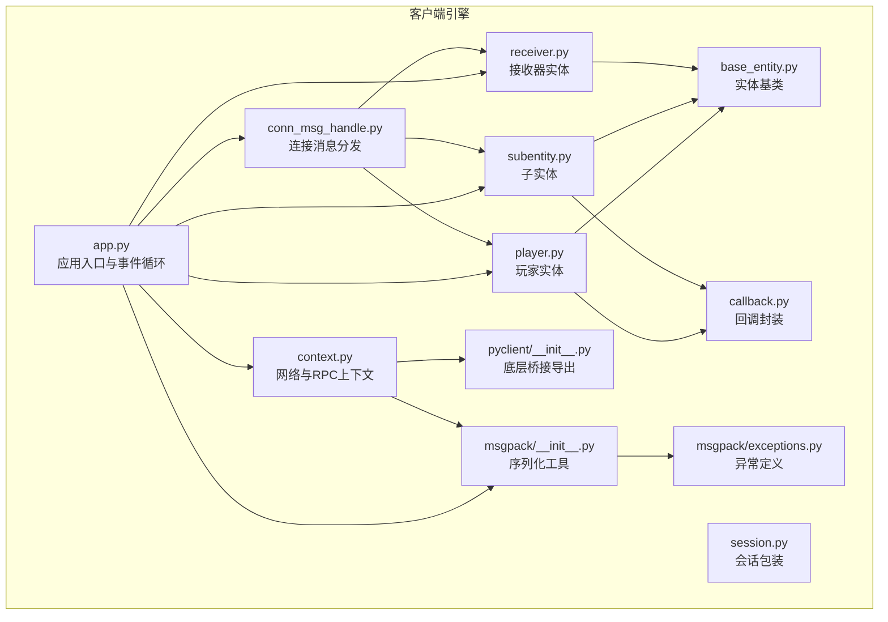
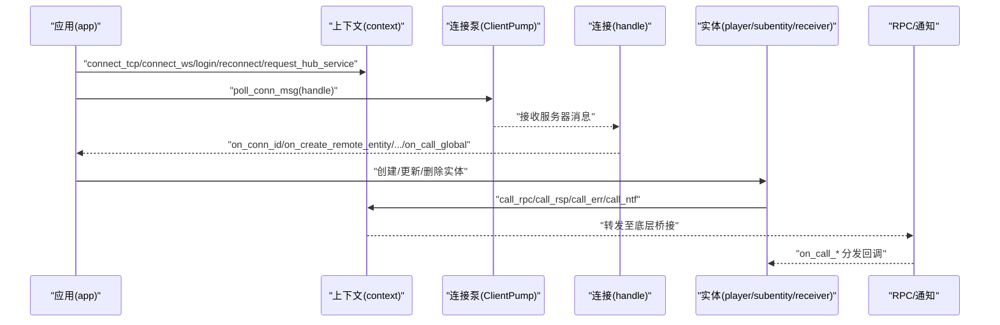
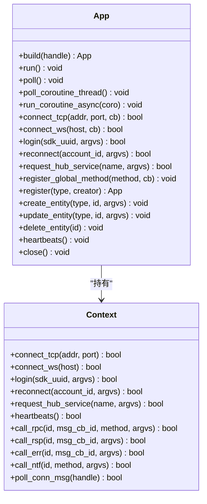
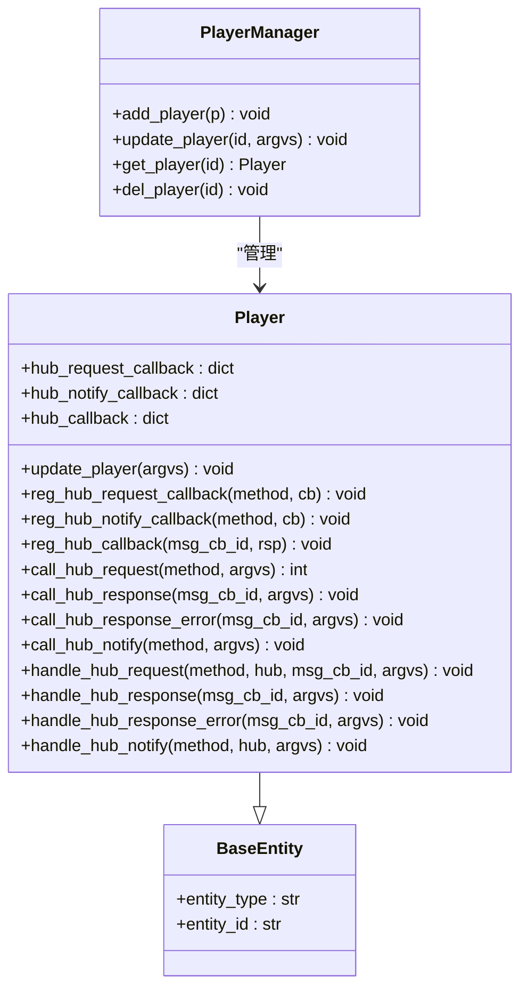
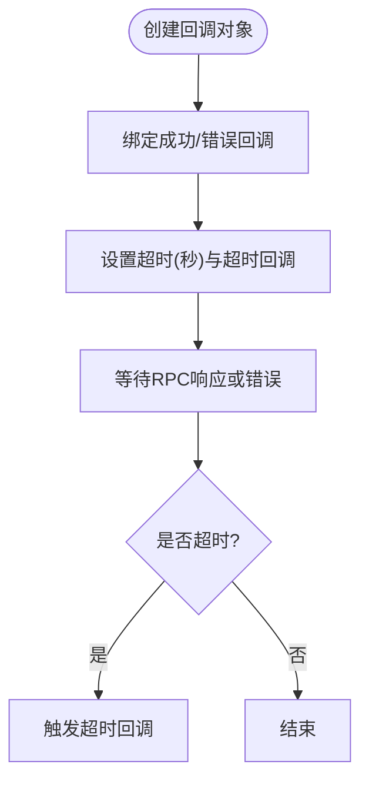
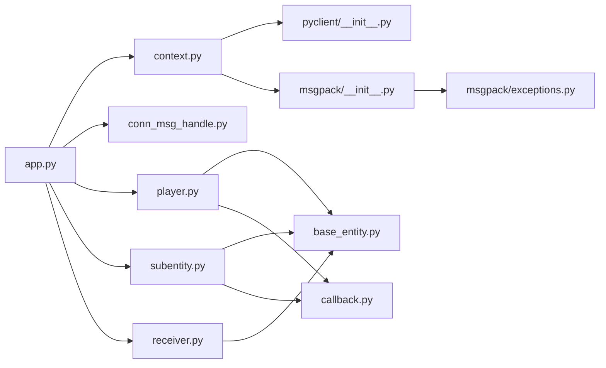

# Python 客户端 API

<cite>
**本文引用的文件**
- [client/engine/__init__.py](file://client/engine/__init__.py)
- [client/engine/app.py](file://client/engine/app.py)
- [client/engine/context.py](file://client/engine/context.py)
- [client/engine/session.py](file://client/engine/session.py)
- [client/engine/base_entity.py](file://client/engine/base_entity.py)
- [client/engine/player.py](file://client/engine/player.py)
- [client/engine/subentity.py](file://client/engine/subentity.py)
- [client/engine/receiver.py](file://client/engine/receiver.py)
- [client/engine/callback.py](file://client/engine/callback.py)
- [client/engine/conn_msg_handle.py](file://client/engine/conn_msg_handle.py)
- [client/engine/msgpack/__init__.py](file://client/engine/msgpack/__init__.py)
- [client/engine/msgpack/exceptions.py](file://client/engine/msgpack/exceptions.py)
- [client/engine/pyclient/__init__.py](file://client/engine/pyclient/__init__.py)
- [sample/client/py/app.py](file://sample/client/py/app.py)
- [sample/client/py/engine/common_cli.py](file://sample/client/py/engine/common_cli.py)
</cite>

## 目录
1. [简介](#简介)
2. [项目结构](#项目结构)
3. [核心组件](#核心组件)
4. [架构总览](#架构总览)
5. [详细组件分析](#详细组件分析)
6. [依赖分析](#依赖分析)
7. [性能考虑](#性能考虑)
8. [故障排查指南](#故障排查指南)
9. [结论](#结论)
10. [附录](#附录)

## 简介
本文件为 geese Python 客户端 SDK 的权威参考文档，覆盖应用框架、会话与上下文、实体管理（玩家、子实体、接收器）、消息编解码、回调与超时、连接建立与心跳、以及错误处理与异常管理。文档同时提供 Python 特性（装饰器、生成器、上下文管理器）在 SDK 中的使用建议与最佳实践，帮助开发者正确、高效地集成与扩展。

## 项目结构
客户端引擎位于 client/engine，核心模块包括应用入口、上下文、会话、实体基类与三大实体类型（玩家、子实体、接收器）、回调封装、连接消息处理器、以及消息包（msgpack）工具集。示例客户端位于 sample/client/py，展示如何注册实体、发起 RPC 调用、处理通知与全局方法。

图表来源
- [client/engine/app.py:1-157](file://client/engine/app.py#L1-L157)
- [client/engine/context.py:1-39](file://client/engine/context.py#L1-L39)
- [client/engine/session.py:1-7](file://client/engine/session.py#L1-L7)
- [client/engine/base_entity.py:1-6](file://client/engine/base_entity.py#L1-L6)
- [client/engine/player.py:1-108](file://client/engine/player.py#L1-L108)
- [client/engine/subentity.py:1-89](file://client/engine/subentity.py#L1-L89)
- [client/engine/receiver.py:1-48](file://client/engine/receiver.py#L1-L48)
- [client/engine/callback.py:1-23](file://client/engine/callback.py#L1-L23)
- [client/engine/conn_msg_handle.py:1-86](file://client/engine/conn_msg_handle.py#L1-L86)
- [client/engine/msgpack/__init__.py:1-58](file://client/engine/msgpack/__init__.py#L1-L58)
- [client/engine/msgpack/exceptions.py:1-49](file://client/engine/msgpack/exceptions.py#L1-L49)
- [client/engine/pyclient/__init__.py:1-5](file://client/engine/pyclient/__init__.py#L1-L5)

章节来源
- [client/engine/__init__.py:1-8](file://client/engine/__init__.py#L1-L8)
- [client/engine/app.py:1-157](file://client/engine/app.py#L1-L157)
- [client/engine/context.py:1-39](file://client/engine/context.py#L1-L39)
- [client/engine/msgpack/__init__.py:1-58](file://client/engine/msgpack/__init__.py#L1-L58)

## 核心组件
- 应用入口与事件循环：负责构建上下文、启动轮询线程、调度协程、驱动连接消息处理与心跳。
- 上下文：封装底层连接、登录、重连、服务请求、心跳、RPC 请求/响应/错误/通知等调用。
- 实体体系：玩家、子实体、接收器三类实体共享统一基类，均支持注册回调、发起 RPC、处理通知与错误。
- 回调封装：提供带超时的回调对象，支持成功与错误回调绑定，并可设置超时触发。
- 连接消息处理器：根据服务器推送的消息类型，分派到对应实体或全局方法处理。
- 消息编解码：基于 msgpack 的打包/解包工具，兼容纯 Python 与 C 扩展实现。
- 示例应用：演示连接、登录、注册实体、发起 RPC、处理通知与全局方法的完整流程。

章节来源
- [client/engine/app.py:40-157](file://client/engine/app.py#L40-L157)
- [client/engine/context.py:4-39](file://client/engine/context.py#L4-L39)
- [client/engine/player.py:9-108](file://client/engine/player.py#L9-L108)
- [client/engine/subentity.py:9-89](file://client/engine/subentity.py#L9-L89)
- [client/engine/receiver.py:7-48](file://client/engine/receiver.py#L7-L48)
- [client/engine/callback.py:5-23](file://client/engine/callback.py#L5-L23)
- [client/engine/conn_msg_handle.py:6-86](file://client/engine/conn_msg_handle.py#L6-L86)
- [client/engine/msgpack/__init__.py:13-58](file://client/engine/msgpack/__init__.py#L13-L58)
- [sample/client/py/app.py:1-71](file://sample/client/py/app.py#L1-L71)

## 架构总览
下图展示了 Python 客户端从应用层到底层桥接的整体交互路径，以及实体生命周期与消息流转的关键节点。

图表来源
- [client/engine/app.py:60-157](file://client/engine/app.py#L60-L157)
- [client/engine/context.py:8-39](file://client/engine/context.py#L8-L39)
- [client/engine/conn_msg_handle.py:7-86](file://client/engine/conn_msg_handle.py#L7-L86)
- [client/engine/player.py:68-88](file://client/engine/player.py#L68-L88)
- [client/engine/subentity.py:57-69](file://client/engine/subentity.py#L57-L69)
- [client/engine/receiver.py:20-28](file://client/engine/receiver.py#L20-L28)

## 详细组件分析

### 应用入口与事件循环（app）
- 职责
  - 构建上下文、连接消息处理器、实体管理器与协程事件循环。
  - 提供连接 TCP/WS、登录、重连、请求服务、注册实体、心跳、轮询与运行控制。
  - 将底层连接消息通过处理器分发给实体与全局方法。
- 关键接口
  - 构建与运行：build、run、poll、poll_coroutine_thread、run_coroutine_async、close
  - 连接与登录：connect_tcp、connect_ws、login、reconnect、request_hub_service
  - 全局方法注册：register_global_method、on_call_global
  - 实体生命周期：register、create_entity、update_entity、delete_entity
  - 心跳：heartbeats
- 并发模型
  - 后台线程驱动轮询；内部维护 asyncio 事件循环，通过线程安全方式提交协程任务。

图表来源
- [client/engine/app.py:40-157](file://client/engine/app.py#L40-L157)
- [client/engine/context.py:4-39](file://client/engine/context.py#L4-L39)

章节来源
- [client/engine/app.py:40-157](file://client/engine/app.py#L40-L157)

### 上下文（context）
- 职责
  - 对外暴露网络与 RPC 能力，屏蔽底层桥接细节。
  - 提供连接、登录、重连、服务请求、心跳、RPC 请求/响应/错误/通知等方法。
- 数据与行为
  - 维护底层 ClientContext 实例，所有方法最终委托到底层实现。
  - 提供 poll_conn_msg 用于驱动底层消息轮询。

章节来源
- [client/engine/context.py:4-39](file://client/engine/context.py#L4-L39)

### 会话（session）
- 职责
  - 包装底层连接标识，便于上层识别当前会话来源。
- 字段
  - source：字符串，表示会话来源标识。

章节来源
- [client/engine/session.py:3-7](file://client/engine/session.py#L3-L7)

### 实体基类（base_entity）
- 职责
  - 统一实体的类型与标识字段，作为玩家、子实体、接收器的基类。
- 字段
  - entity_type：实体类型字符串
  - entity_id：实体唯一标识

章节来源
- [client/engine/base_entity.py:3-6](file://client/engine/base_entity.py#L3-L6)

### 玩家实体（player）
- 职责
  - 表示主控角色，支持注册请求回调、通知回调、发起 RPC 请求、处理响应与错误、发送通知。
- 关键能力
  - 注册回调：reg_hub_request_callback、reg_hub_notify_callback、reg_hub_callback
  - 发起调用：call_hub_request（返回 msg_cb_id）、call_hub_response、call_hub_response_error、call_hub_notify
  - 处理回调：handle_hub_request、handle_hub_response、handle_hub_response_error、handle_hub_notify
  - 生命周期：由 app 注册与管理，支持按 entity_id 更新与删除。
- 错误处理
  - 未匹配的请求/响应/通知方法会输出提示信息，避免静默失败。

图表来源
- [client/engine/player.py:9-108](file://client/engine/player.py#L9-L108)

章节来源
- [client/engine/player.py:9-108](file://client/engine/player.py#L9-L108)

### 子实体（subentity）
- 职责
  - 表示非主控但可被玩家拥有或关联的实体，支持注册通知回调、发起 RPC 请求、处理响应与错误、发送通知。
- 关键能力
  - 注册回调：reg_hub_notify_callback、reg_hub_callback
  - 发起调用：call_hub_request（返回 msg_cb_id）、call_hub_notify
  - 处理回调：handle_hub_response、handle_hub_response_error、handle_hub_notify
  - 生命周期：由 app 注册与管理，支持按 entity_id 更新与删除。

章节来源
- [client/engine/subentity.py:9-89](file://client/engine/subentity.py#L9-L89)

### 接收器（receiver）
- 职责
  - 仅处理来自 Hub 的通知，不发起请求，适合被动监听场景。
- 关键能力
  - 注册回调：reg_hub_notify_callback
  - 处理回调：handle_hub_notify
  - 生命周期：由 app 注册与管理，支持按 entity_id 更新与删除。

章节来源
- [client/engine/receiver.py:7-48](file://client/engine/receiver.py#L7-L48)

### 回调封装（callback）
- 职责
  - 封装 RPC 响应与错误回调，支持超时定时器触发。
- 关键能力
  - callback(rsp_cb, err_cb)：绑定成功与错误回调
  - timeout(seconds, time_callback)：设置超时触发
  - 内部通过 Timer 实现超时逻辑，超时后若释放条件满足则触发回调。

图表来源
- [client/engine/callback.py:5-23](file://client/engine/callback.py#L5-L23)

章节来源
- [client/engine/callback.py:5-23](file://client/engine/callback.py#L5-L23)

### 连接消息处理器（conn_msg_handle）
- 职责
  - 将底层连接消息分发到 app 层，进而路由到具体实体或全局方法。
- 主要分发
  - on_conn_id：设置连接 ID 并回调上层
  - on_create_remote_entity / on_refresh_entity / on_delete_remote_entity：创建/刷新/删除实体
  - on_kick_off / on_transfer_complete：踢下线与迁移完成事件
  - on_call_rpc / on_call_rsp / on_call_err / on_call_ntf：请求/响应/错误/通知分发
  - on_call_global：全局方法分发

章节来源
- [client/engine/conn_msg_handle.py:6-86](file://client/engine/conn_msg_handle.py#L6-L86)

### 消息编解码（msgpack）
- 职责
  - 提供 pack/dump/dumps 与 unpack/loads 等常用接口，自动选择 C 扩展或纯 Python 实现。
- 异常
  - 定义了 UnpackException 及其子类（BufferFull、OutOfData、FormatError、StackError、ExtraData），以及 Pack 相关异常别名。

章节来源
- [client/engine/msgpack/__init__.py:13-58](file://client/engine/msgpack/__init__.py#L13-L58)
- [client/engine/msgpack/exceptions.py:1-49](file://client/engine/msgpack/exceptions.py#L1-L49)

### 底层桥接导出（pyclient）
- 职责
  - 导出底层 ClientContext 与 ClientPump，供 context 与 app 使用。

章节来源
- [client/engine/pyclient/__init__.py:1-5](file://client/engine/pyclient/__init__.py#L1-L5)

### 示例应用（sample/client/py/app.py）
- 职责
  - 展示如何继承 client_event_handle、注册实体类型、连接服务器、登录、请求服务、发起 RPC、处理通知与全局方法。
- 关键点
  - 自定义实体 Creator：在创建实体时绑定调用器并发起首次 RPC。
  - 回调链路：callBack 成功/错误回调 + timeout 超时处理。
  - 连接方式：支持 TCP 或 WS，示例中默认使用 WS。

章节来源
- [sample/client/py/app.py:1-71](file://sample/client/py/app.py#L1-L71)

## 依赖分析
- 模块内聚与耦合
  - app 作为中枢，聚合 context、conn_msg_handle、实体管理器与协程循环，耦合度较高但职责清晰。
  - player/subentity/receiver 共享 base_entity，降低重复代码，提升一致性。
  - callback 与实体解耦，通过 msg_cb_id 协同，便于扩展。
- 外部依赖
  - 底层桥接：pyclient（ClientContext、ClientPump）
  - 编解码：msgpack（C 扩展或 fallback）
  - 并发：asyncio、Timer、线程

图表来源
- [client/engine/app.py:40-157](file://client/engine/app.py#L40-L157)
- [client/engine/context.py:4-39](file://client/engine/context.py#L4-L39)
- [client/engine/conn_msg_handle.py:6-86](file://client/engine/conn_msg_handle.py#L6-L86)
- [client/engine/player.py:9-108](file://client/engine/player.py#L9-L108)
- [client/engine/subentity.py:9-89](file://client/engine/subentity.py#L9-L89)
- [client/engine/receiver.py:7-48](file://client/engine/receiver.py#L7-L48)
- [client/engine/callback.py:5-23](file://client/engine/callback.py#L5-L23)
- [client/engine/base_entity.py:3-6](file://client/engine/base_entity.py#L3-L6)
- [client/engine/msgpack/__init__.py:13-58](file://client/engine/msgpack/__init__.py#L13-L58)
- [client/engine/msgpack/exceptions.py:1-49](file://client/engine/msgpack/exceptions.py#L1-L49)
- [client/engine/pyclient/__init__.py:1-5](file://client/engine/pyclient/__init__.py#L1-L5)

## 性能考虑
- 轮询节流
  - app.poll 在每次轮询后进行时间差计算并睡眠，确保帧率稳定（约 30 FPS）。
- 协程调度
  - 通过 run_coroutine_threadsafe 将协程安全提交到 asyncio 事件循环，避免阻塞。
- 序列化开销
  - 优先使用 C 扩展实现的 msgpack，必要时回退到纯 Python，减少序列化/反序列化成本。
- 回调释放
  - callback 支持超时释放，避免长期挂起导致内存泄漏。

章节来源
- [client/engine/app.py:146-157](file://client/engine/app.py#L146-L157)
- [client/engine/callback.py:17-23](file://client/engine/callback.py#L17-L23)
- [client/engine/msgpack/__init__.py:13-19](file://client/engine/msgpack/__init__.py#L13-L19)

## 故障排查指南
- 连接问题
  - 检查 connect_tcp/connect_ws 返回值与回调是否触发；确认 on_conn_id 是否到达。
  - 若未收到 on_conn_id，检查网络与地址配置。
- 登录与重连
  - 确认 login/reconnect 参数编码正确（使用 dumps），并确保服务端允许该账号。
- 实体生命周期
  - 未匹配的实体类型不会被创建，检查 app.register 是否正确注册。
  - 刷新/删除消息需确保 entity_id 一致。
- RPC 回调未触发
  - 检查 msg_cb_id 是否正确传递与匹配；确认回调是否已注册。
  - 注意 handle_hub_response/handle_hub_response_error 的打印提示，定位未处理分支。
- 超时处理
  - 使用 callback.timeout 设置合理超时时间，避免长时间阻塞。
- 编解码异常
  - 捕获 msgpack.exceptions 中的异常类型，定位格式或数据问题。

章节来源
- [client/engine/conn_msg_handle.py:36-82](file://client/engine/conn_msg_handle.py#L36-L82)
- [client/engine/player.py:26-53](file://client/engine/player.py#L26-L53)
- [client/engine/subentity.py:31-45](file://client/engine/subentity.py#L31-L45)
- [client/engine/msgpack/exceptions.py:1-49](file://client/engine/msgpack/exceptions.py#L1-L49)

## 结论
geese Python 客户端以 app 为核心，结合 context、实体管理与消息处理器，形成清晰的事件驱动架构。通过统一的 RPC/通知模型与回调封装，开发者可以快速实现登录、服务请求、实体生命周期管理与全局方法处理。配合示例应用与完善的错误处理机制，能够满足大多数游戏客户端的网络通信需求。

## 附录

### Python 特性使用建议
- 装饰器
  - 使用 singleton 装饰器确保 app 单例，避免重复初始化。
- 生成器
  - 在需要批量创建实体或处理大量通知时，可结合生成器简化迭代。
- 上下文管理器
  - 建议在退出时调用 app.close，确保资源释放与线程安全停止。

章节来源
- [client/engine/app.py:30-37](file://client/engine/app.py#L30-L37)
- [client/engine/app.py:134-139](file://client/engine/app.py#L134-L139)

### API 一览（按模块）
- 应用（app）
  - 构建与运行：build、run、poll、poll_coroutine_thread、run_coroutine_async、close
  - 连接与登录：connect_tcp、connect_ws、login、reconnect、request_hub_service
  - 全局方法：register_global_method、on_call_global
  - 实体管理：register、create_entity、update_entity、delete_entity
  - 心跳：heartbeats
- 上下文（context）
  - connect_tcp、connect_ws、login、reconnect、request_hub_service、heartbeats
  - call_rpc、call_rsp、call_err、call_ntf、poll_conn_msg
- 玩家（player）
  - update_player 抽象方法、reg_hub_request_callback、reg_hub_notify_callback、reg_hub_callback
  - call_hub_request、call_hub_response、call_hub_response_error、call_hub_notify
  - handle_hub_request、handle_hub_response、handle_hub_response_error、handle_hub_notify
- 子实体（subentity）
  - update_subentity 抽象方法、reg_hub_notify_callback、reg_hub_callback
  - call_hub_request、call_hub_notify
  - handle_hub_response、handle_hub_response_error、handle_hub_notify
- 接收器（receiver）
  - update_receiver 抽象方法、reg_hub_notify_callback
  - handle_hub_notify
- 回调（callback）
  - callback(rsp_cb, err_cb)、timeout(seconds, time_cb)
- 连接消息处理器（conn_msg_handle）
  - on_conn_id、on_create_remote_entity、on_refresh_entity、on_delete_remote_entity
  - on_kick_off、on_transfer_complete
  - on_call_rpc、on_call_rsp、on_call_err、on_call_ntf、on_call_global
- 消息编解码（msgpack）
  - pack/dump/dumps、unpack/loads、异常类型

章节来源
- [client/engine/app.py:60-157](file://client/engine/app.py#L60-L157)
- [client/engine/context.py:8-39](file://client/engine/context.py#L8-L39)
- [client/engine/player.py:22-88](file://client/engine/player.py#L22-L88)
- [client/engine/subentity.py:21-69](file://client/engine/subentity.py#L21-L69)
- [client/engine/receiver.py:16-28](file://client/engine/receiver.py#L16-L28)
- [client/engine/callback.py:13-23](file://client/engine/callback.py#L13-L23)
- [client/engine/conn_msg_handle.py:7-86](file://client/engine/conn_msg_handle.py#L7-L86)
- [client/engine/msgpack/__init__.py:22-58](file://client/engine/msgpack/__init__.py#L22-L58)