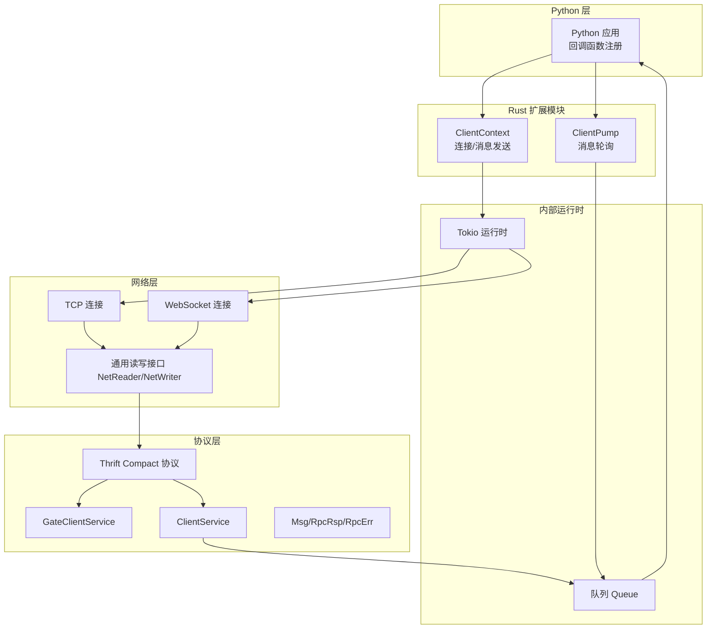
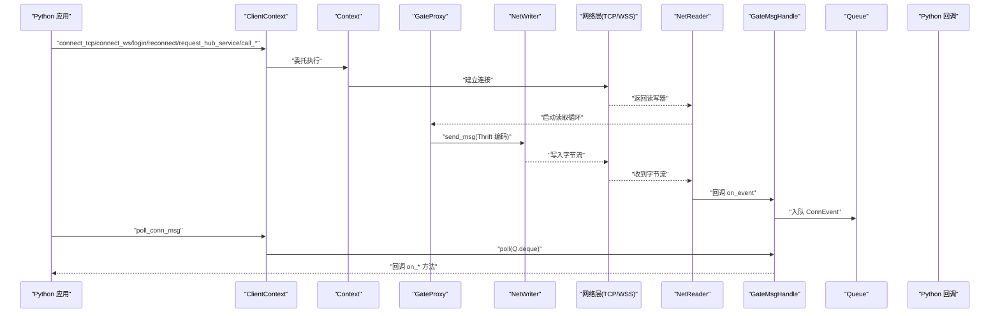
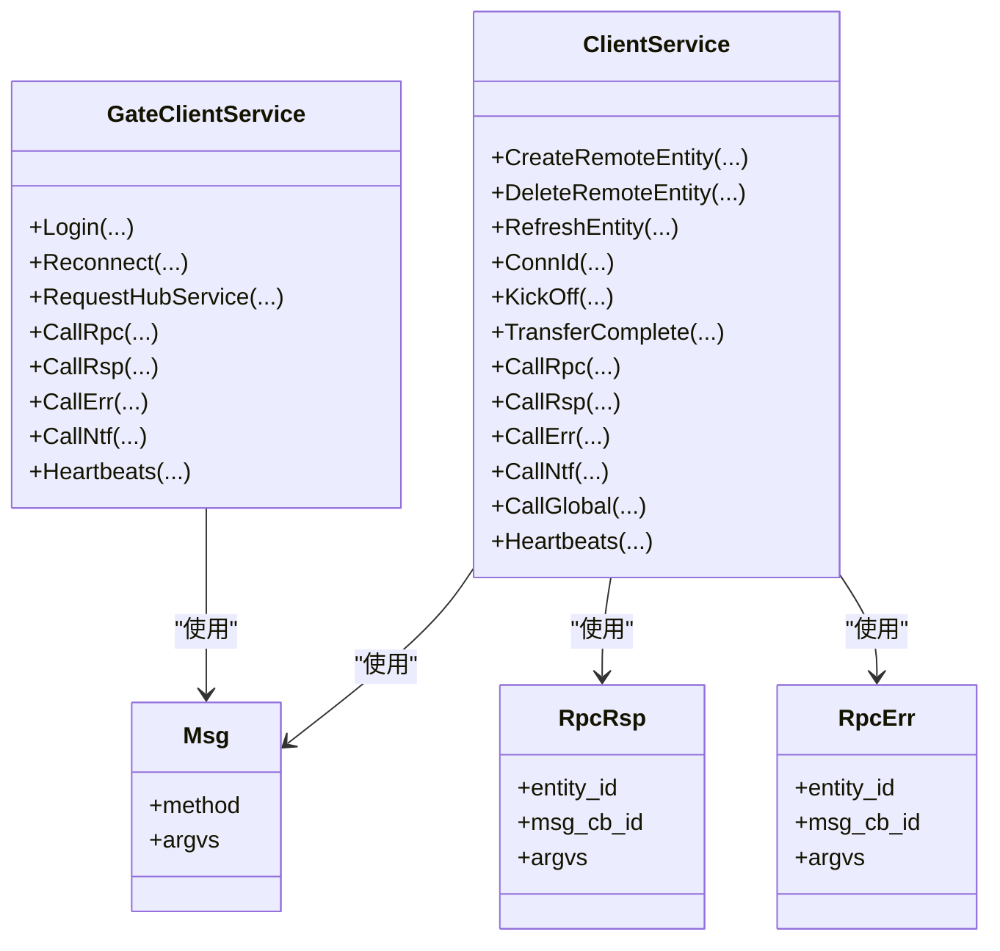
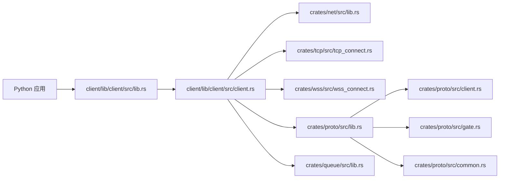

# Rust 客户端 API

<cite>
**本文引用的文件**
- [client/lib/client/src/lib.rs](file://client/lib/client/src/lib.rs)
- [client/lib/client/src/client.rs](file://client/lib/client/src/client.rs)
- [client/Cargo.toml](file://client/Cargo.toml)
- [crates/proto/src/lib.rs](file://crates/proto/src/lib.rs)
- [crates/proto/src/client.rs](file://crates/proto/src/client.rs)
- [crates/proto/src/gate.rs](file://crates/proto/src/gate.rs)
- [crates/proto/src/common.rs](file://crates/proto/src/common.rs)
- [crates/net/src/lib.rs](file://crates/net/src/lib.rs)
- [crates/tcp/src/lib.rs](file://crates/tcp/src/lib.rs)
- [crates/tcp/src/tcp_connect.rs](file://crates/tcp/src/tcp_connect.rs)
- [crates/wss/src/lib.rs](file://crates/wss/src/lib.rs)
- [crates/wss/src/wss_connect.rs](file://crates/wss/src/wss_connect.rs)
- [crates/queue/src/lib.rs](file://crates/queue/src/lib.rs)
</cite>

## 目录
1. [简介](#简介)
2. [项目结构](#项目结构)
3. [核心组件](#核心组件)
4. [架构总览](#架构总览)
5. [详细组件分析](#详细组件分析)
6. [依赖关系分析](#依赖关系分析)
7. [性能考量](#性能考量)
8. [故障排查指南](#故障排查指南)
9. [结论](#结论)
10. [附录](#附录)

## 简介
本文件为 geese Rust 客户端 SDK 的详细参考文档，面向 Rust 开发者，系统性梳理客户端应用框架、会话与连接管理、消息编解码、实体生命周期管理、回调分发与错误处理等核心能力。文档同时覆盖 Rust 异步运行时、所有权模型与内存安全在客户端中的使用方式，并提供接口调用规范、性能优化建议与最佳实践。

## 项目结构
客户端以“Rust 扩展模块”形式导出给 Python 调用，内部通过 Tokio 异步运行时驱动网络层，基于 Thrift Compact 协议进行消息编解码，通过队列与回调机制实现跨线程的消息分发。

图表来源
- [client/lib/client/src/lib.rs:27-94](file://client/lib/client/src/lib.rs#L27-L94)
- [client/lib/client/src/client.rs:282-356](file://client/lib/client/src/client.rs#L282-L356)
- [crates/net/src/lib.rs:8-23](file://crates/net/src/lib.rs#L8-L23)
- [crates/tcp/src/tcp_connect.rs:10-17](file://crates/tcp/src/tcp_connect.rs#L10-L17)
- [crates/wss/src/wss_connect.rs:11-33](file://crates/wss/src/wss_connect.rs#L11-L33)
- [crates/proto/src/client.rs:855-869](file://crates/proto/src/client.rs#L855-L869)
- [crates/proto/src/gate.rs:1-20](file://crates/proto/src/gate.rs#L1-L20)
- [crates/proto/src/common.rs:33-263](file://crates/proto/src/common.rs#L33-L263)
- [crates/queue/src/lib.rs:3-21](file://crates/queue/src/lib.rs#L3-L21)

章节来源
- [client/Cargo.toml:1-21](file://client/Cargo.toml#L1-L21)
- [client/lib/client/src/lib.rs:1-116](file://client/lib/client/src/lib.rs#L1-L116)
- [client/lib/client/src/client.rs:1-356](file://client/lib/client/src/client.rs#L1-L356)

## 核心组件
- ClientContext：对外暴露的 Python 友好接口，负责连接建立（TCP/WebSocket）、登录、重连、服务请求、RPC 请求/响应/错误/通知、心跳等。
- ClientPump：用于从内部队列轮询消息并回调 Python 回调函数。
- GateProxy/GateMsgHandle：封装网关代理与消息处理，负责 Thrift 消息序列化/反序列化、网络读取回调与事件入队。
- NetReader/NetWriter：抽象网络读写接口，统一 TCP/WSS 实现。
- Queue：无锁并发队列，承载跨线程消息传递。
- Proto 模块：自动生成的 Thrift 结构体与枚举，涵盖 Gate/Client/Common 等协议类型。

章节来源
- [client/lib/client/src/lib.rs:27-94](file://client/lib/client/src/lib.rs#L27-L94)
- [client/lib/client/src/client.rs:22-123](file://client/lib/client/src/client.rs#L22-L123)
- [crates/net/src/lib.rs:8-23](file://crates/net/src/lib.rs#L8-L23)
- [crates/queue/src/lib.rs:3-21](file://crates/queue/src/lib.rs#L3-L21)
- [crates/proto/src/lib.rs:1-5](file://crates/proto/src/lib.rs#L1-L5)

## 架构总览
下图展示从 Python 调用到网络层、协议层与消息分发的整体流程。

图表来源
- [client/lib/client/src/lib.rs:41-93](file://client/lib/client/src/lib.rs#L41-L93)
- [client/lib/client/src/client.rs:297-356](file://client/lib/client/src/client.rs#L297-L356)
- [crates/net/src/lib.rs:20-23](file://crates/net/src/lib.rs#L20-L23)
- [crates/proto/src/client.rs:855-869](file://crates/proto/src/client.rs#L855-L869)

## 详细组件分析

### ClientContext：连接与消息发送入口
- 提供连接方法：connect_tcp(host, port)、connect_ws(host)
- 提供业务方法：login(sdk_uuid, argvs)、reconnect(account_id, argvs)、request_hub_service(name, argvs)
- 提供 RPC 方法：call_rpc(entity_id, msg_cb_id, method, argvs)、call_rsp(entity_id, msg_cb_id, argvs)、call_err(entity_id, msg_cb_id, argvs)、call_ntf(entity_id, method, argvs)
- 心跳：heartbeats()

实现要点
- 内部持有 Context，通过互斥访问控制网络与消息处理状态。
- 发送消息时将 Rust 结构体序列化为 Thrift 字节流并通过 NetWriter 写入网络。

章节来源
- [client/lib/client/src/lib.rs:27-94](file://client/lib/client/src/lib.rs#L27-L94)
- [client/lib/client/src/client.rs:282-356](file://client/lib/client/src/client.rs#L282-L356)

### ClientPump：消息轮询与回调分发
- new(ctx)：从 ClientContext 获取消息处理句柄。
- poll_conn_msg(py_handle)：从内部队列取出事件并调用 Python 回调，如 on_conn_id、on_create_remote_entity、on_delete_remote_entity、on_refresh_entity、on_kick_off、on_transfer_complete、on_call_rpc、on_call_rsp、on_call_err、on_call_ntf、on_call_global、on_heartbeats。

实现要点
- 通过弱引用持有 GateProxy，避免循环引用。
- 将 Thrift 反序列化的 ClientService 分派到对应 Python 回调，参数中使用 PyBytes 传递二进制数据。

章节来源
- [client/lib/client/src/lib.rs:96-116](file://client/lib/client/src/lib.rs#L96-L116)
- [client/lib/client/src/client.rs:85-279](file://client/lib/client/src/client.rs#L85-L279)

### GateProxy/GateMsgHandle：网络与协议编解码
- GateProxy：持有 NetWriter 与消息处理句柄，负责 Thrift 编码与发送；维护 conn_id 并保存读取任务句柄。
- GateMsgHandle：队列化网络事件，支持 poll 出队并分发到 Python 回调。
- 反序列化：将字节流转为 ClientService 枚举，按分支调用回调。

复杂度与性能
- 编解码：Thrift Compact 协议，O(n) 时间与空间复杂度，n 为消息大小。
- 队列：入队/出队 O(1)，无锁并发队列，适合高吞吐场景。

章节来源
- [client/lib/client/src/client.rs:22-123](file://client/lib/client/src/client.rs#L22-L123)
- [client/lib/client/src/client.rs:85-279](file://client/lib/client/src/client.rs#L85-L279)
- [crates/proto/src/client.rs:855-869](file://crates/proto/src/client.rs#L855-L869)

### 网络层：NetReader/NetWriter 抽象
- NetReader：启动读取循环，回调 NetReaderCallback。
- NetReaderCallback：将字节流交给 GateMsgHandle 处理。
- NetPack：帧解析，支持长度前缀与粘包拆分。

章节来源
- [crates/net/src/lib.rs:8-75](file://crates/net/src/lib.rs#L8-L75)

### 连接实现：TCP 与 WebSocket
- TCP：通过 TcpConnect::connect(host: String) 建立连接，返回读写器。
- WSS：通过 WSSConnect::connect(host: String) 建立连接，返回读写器。
- 两者均实现 NetReader/NetWriter 接口，统一接入 GateProxy。

章节来源
- [crates/tcp/src/tcp_connect.rs:10-17](file://crates/tcp/src/tcp_connect.rs#L10-L17)
- [crates/wss/src/wss_connect.rs:11-33](file://crates/wss/src/wss_connect.rs#L11-L33)
- [crates/net/src/lib.rs:8-23](file://crates/net/src/lib.rs#L8-L23)

### 协议模型：GateClientService 与 ClientService
- GateClientService：客户端向网关发送的消息集合，包含 Login、Reconnect、RequestHubService、CallRpc、CallRsp、CallErr、CallNtf、Heartbeats 等。
- ClientService：网关向客户端推送的消息集合，包含 ConnId、CreateRemoteEntity、DeleteRemoteEntity、RefreshEntity、KickOff、TransferComplete、CallRpc、CallRsp、CallErr、CallNtf、CallGlobal、Heartbeats 等。
- 公共结构：Msg、RpcRsp、RpcErr。

图表来源
- [crates/proto/src/gate.rs:1-20](file://crates/proto/src/gate.rs#L1-L20)
- [crates/proto/src/client.rs:855-869](file://crates/proto/src/client.rs#L855-L869)
- [crates/proto/src/common.rs:33-263](file://crates/proto/src/common.rs#L33-L263)

章节来源
- [crates/proto/src/gate.rs:1-20](file://crates/proto/src/gate.rs#L1-L20)
- [crates/proto/src/client.rs:855-869](file://crates/proto/src/client.rs#L855-L869)
- [crates/proto/src/common.rs:33-263](file://crates/proto/src/common.rs#L33-L263)

### 队列与并发：Queue
- VecDeque 实现的队列，提供 enque/deque，满足多生产者/单消费者的消息分发需求。
- 在 GateMsgHandle 中作为事件容器，配合 poll 出队与 Python 回调。

章节来源
- [crates/queue/src/lib.rs:3-21](file://crates/queue/src/lib.rs#L3-L21)

## 依赖关系分析

图表来源
- [client/lib/client/src/lib.rs:1-25](file://client/lib/client/src/lib.rs#L1-L25)
- [client/lib/client/src/client.rs:1-27](file://client/lib/client/src/client.rs#L1-L27)
- [crates/proto/src/lib.rs:1-5](file://crates/proto/src/lib.rs#L1-L5)

章节来源
- [client/Cargo.toml:8-21](file://client/Cargo.toml#L8-L21)
- [client/lib/client/src/lib.rs:1-25](file://client/lib/client/src/lib.rs#L1-L25)
- [client/lib/client/src/client.rs:1-27](file://client/lib/client/src/client.rs#L1-L27)

## 性能考量
- 异步运行时：Context 内部持有独立 Tokio Runtime，避免阻塞主线程；发送消息时使用 block_on 包裹异步发送逻辑。
- 编解码：Thrift Compact 协议体积小、解析高效；NetPack 支持粘包拆分，减少上层负担。
- 并发模型：Queue 为无锁队列，降低锁竞争；弱引用 GateProxy 避免强引用导致的资源无法释放。
- 线程亲和：建议在 Python 层以单线程轮询 ClientPump.poll_conn_msg，避免回调竞争。

[本节为通用性能建议，不直接分析具体文件]

## 故障排查指南
常见问题与定位思路
- 连接失败
  - 检查 host/port 或 host URL 是否正确。
  - 查看连接日志输出，确认 connect_tcp/connect_ws 返回路径。
- 消息未到达
  - 确认已调用 send_msg 成功返回。
  - 检查 Thrift 编码是否正确，字段是否完整。
- 回调未触发
  - 确认已在 Python 层注册对应回调函数。
  - 确认 ClientPump.poll_conn_msg 已被周期性调用。
- 心跳异常
  - 检查 heartbeats 是否定期发送。
  - 观察 on_heartbeats 回调是否被触发。

章节来源
- [client/lib/client/src/client.rs:297-356](file://client/lib/client/src/client.rs#L297-L356)
- [client/lib/client/src/client.rs:124-279](file://client/lib/client/src/client.rs#L124-L279)

## 结论
geese Rust 客户端通过清晰的模块划分与严格的异步/所有权模型，提供了稳定可靠的网络通信与消息分发能力。开发者可通过 ClientContext 与 ClientPump 组合完成连接、登录、RPC 调用与实体生命周期管理，并借助 Thrift 协议与队列机制实现高性能与可维护性。

[本节为总结性内容，不直接分析具体文件]

## 附录

### API 调用规范与最佳实践
- 连接与初始化
  - 在 Python 层创建 ClientContext，随后调用 connect_tcp 或 connect_ws。
  - 初始化后创建 ClientPump，并在事件循环中调用 poll_conn_msg。
- 登录与重连
  - 使用 login 或 reconnect 传入必要的参数，确保 argvs 为合法的二进制序列。
- RPC 调用
  - call_rpc 携带 entity_id、msg_cb_id 与方法名及参数；call_rsp/call_err/call_ntf 对应响应/错误/通知。
- 实体管理
  - on_create_remote_entity/on_refresh_entity/on_delete_remote_entity 三类回调分别处理实体创建、刷新与删除。
- 错误处理
  - on_call_err 回调中读取错误信息；on_kick_off 表示被踢下线。
- 性能优化
  - 合理设置心跳间隔，避免频繁发送。
  - 在 Python 层批量处理回调，减少频繁切换上下文。

[本节为通用指导，不直接分析具体文件]