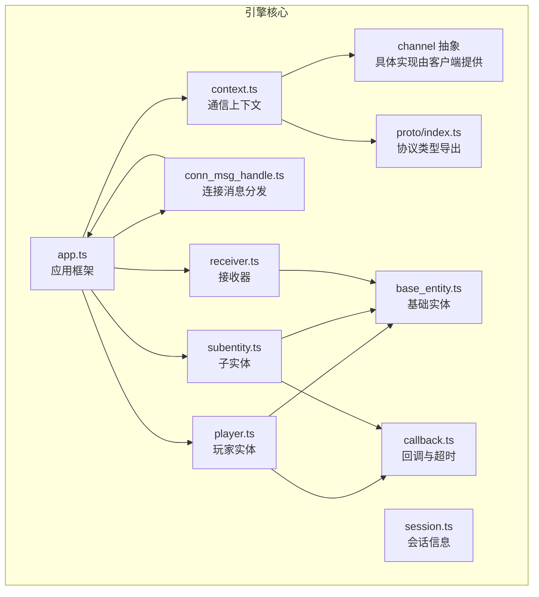
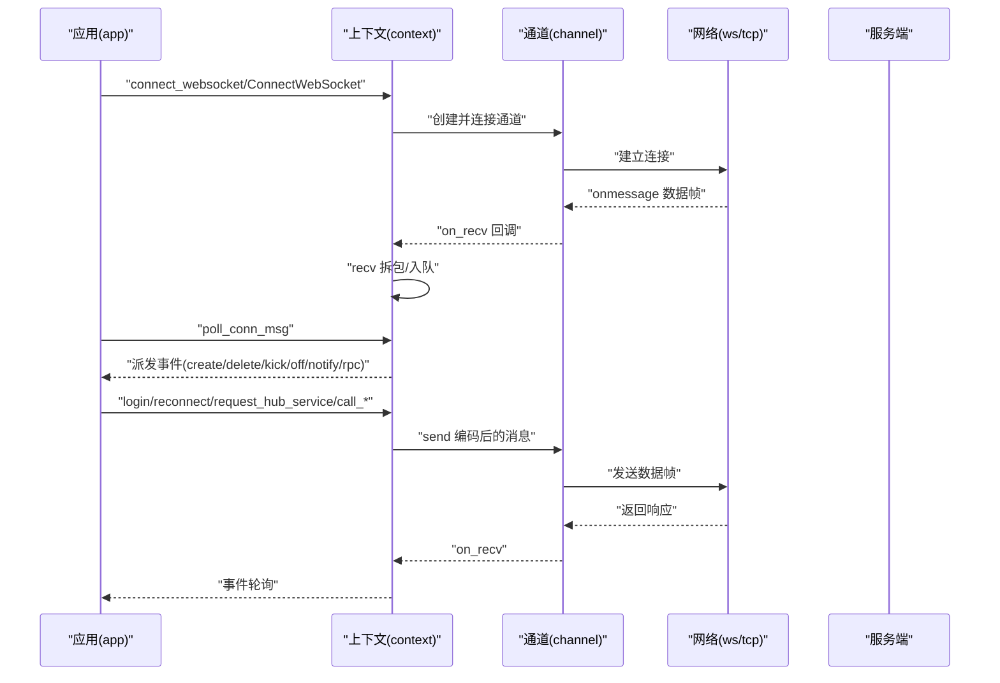
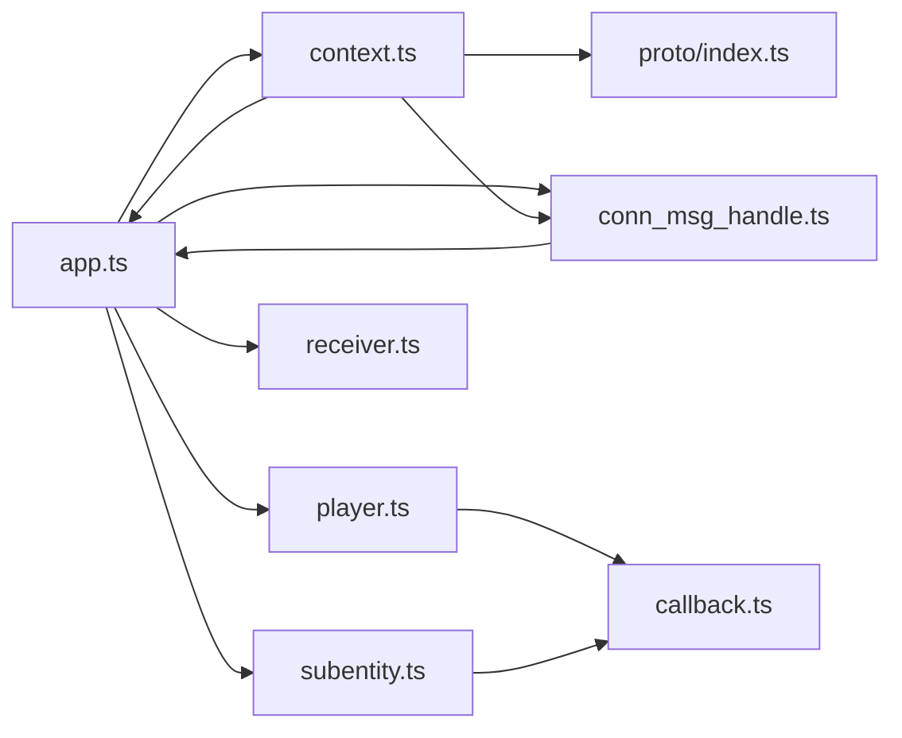

# TypeScript 客户端 API

<cite>
**本文引用的文件**
- [index.ts](file://expand/ts/engine/index.ts)
- [app.ts](file://expand/ts/engine/app.ts)
- [context.ts](file://expand/ts/engine/context.ts)
- [session.ts](file://expand/ts/engine/session.ts)
- [player.ts](file://expand/ts/engine/player.ts)
- [subentity.ts](file://expand/ts/engine/subentity.ts)
- [receiver.ts](file://expand/ts/engine/receiver.ts)
- [callback.ts](file://expand/ts/engine/callback.ts)
- [conn_msg_handle.ts](file://expand/ts/engine/conn_msg_handle.ts)
- [proto/index.ts](file://expand/ts/engine/proto/index.ts)
- [common_cli.ts](file://sample/client/ts/engine/common_cli.ts)
- [app.ts（示例）](file://sample/client/ts/app.ts)
- [package.json](file://sample/client/ts/package.json)
</cite>

## 目录
1. [简介](#简介)
2. [项目结构](#项目结构)
3. [核心组件](#核心组件)
4. [架构总览](#架构总览)
5. [详细组件分析](#详细组件分析)
6. [依赖关系分析](#依赖关系分析)
7. [性能与并发特性](#性能与并发特性)
8. [故障排查指南](#故障排查指南)
9. [结论](#结论)
10. [附录：类型与接口速查](#附录类型与接口速查)

## 简介
本文件为 geese TypeScript 客户端 SDK 的权威参考文档，覆盖应用框架、会话管理、上下文处理、实体生命周期管理、消息编解码与 RPC 调用等核心能力。文档面向 TypeScript 开发者，提供类型安全的接口定义、泛型使用建议、错误处理与性能优化实践，并通过示例展示如何在浏览器或 Node.js 环境中集成 WebSocket/TCP 通道，完成登录、服务请求、实体创建与更新、通知回调等典型流程。

## 项目结构
TypeScript 客户端位于 expand/ts/engine 下，核心模块包括：
- 应用入口与框架：app.ts
- 通信上下文：context.ts
- 通道抽象：channel（由具体实现类提供）
- 实体模型：base_entity.ts、player.ts、subentity.ts、receiver.ts
- 回调与超时：callback.ts
- 连接消息分发：conn_msg_handle.ts
- 协议与消息类型：proto/index.ts
- 示例与工具：sample/client/ts 下的示例工程



图表来源
- [app.ts:18-51](file://expand/ts/engine/app.ts#L18-L51)
- [context.ts:18-30](file://expand/ts/engine/context.ts#L18-L30)
- [player.ts:10-26](file://expand/ts/engine/player.ts#L10-L26)
- [subentity.ts:10-23](file://expand/ts/engine/subentity.ts#L10-L23)
- [receiver.ts:8-15](file://expand/ts/engine/receiver.ts#L8-L15)
- [callback.ts:7-20](file://expand/ts/engine/callback.ts#L7-L20)
- [conn_msg_handle.ts:9-17](file://expand/ts/engine/conn_msg_handle.ts#L9-L17)
- [base_entity.ts:7-14](file://expand/ts/engine/base_entity.ts#L7-L14)
- [session.ts:6-11](file://expand/ts/engine/session.ts#L6-L11)
- [proto/index.ts:1-51](file://expand/ts/engine/proto/index.ts#L1-L51)

章节来源
- [index.ts:1-9](file://expand/ts/engine/index.ts#L1-L9)
- [app.ts:18-51](file://expand/ts/engine/app.ts#L18-L51)
- [context.ts:18-30](file://expand/ts/engine/context.ts#L18-L30)

## 核心组件
- 应用框架 app：负责事件循环、连接管理、实体注册与生命周期、全局方法注册、心跳与运行控制。
- 通信上下文 context：封装协议编码/解码、消息发送、接收缓冲与拆包、事件队列与派发。
- 通道 channel：抽象网络通道，示例中通过 WebSocket 实现具体连接与收发。
- 实体体系：base_entity 基类；player 子类用于玩家主角色；subentity 子类用于附属实体；receiver 子类用于只接收通知的实体。
- 回调系统 callback：统一的请求回调与错误回调封装，支持超时触发。
- 连接消息分发 conn_msg_handle：将服务端推送的消息路由到对应实体或全局回调。
- 协议类型 proto：基于 Thrift 的自动生成类型，涵盖登录、RPC、通知、全局调用等消息。

章节来源
- [app.ts:18-159](file://expand/ts/engine/app.ts#L18-L159)
- [context.ts:18-270](file://expand/ts/engine/context.ts#L18-L270)
- [player.ts:10-102](file://expand/ts/engine/player.ts#L10-L102)
- [subentity.ts:10-76](file://expand/ts/engine/subentity.ts#L10-L76)
- [receiver.ts:8-28](file://expand/ts/engine/receiver.ts#L8-L28)
- [callback.ts:7-39](file://expand/ts/engine/callback.ts#L7-L39)
- [conn_msg_handle.ts:9-96](file://expand/ts/engine/conn_msg_handle.ts#L9-L96)
- [proto/index.ts:1-51](file://expand/ts/engine/proto/index.ts#L1-L51)

## 架构总览
下图展示了从应用层到网络层的整体交互路径，以及消息在客户端内部的流转。



图表来源
- [app.ts:65-159](file://expand/ts/engine/app.ts#L65-L159)
- [context.ts:32-269](file://expand/ts/engine/context.ts#L32-L269)
- [app.ts（示例）:134-146](file://sample/client/ts/app.ts#L134-L146)

## 详细组件分析

### 应用框架 app
- 角色与职责
  - 维护运行状态与事件循环，定时心跳。
  - 管理实体注册表，按类型创建/更新/删除实体。
  - 注册全局方法回调，处理来自服务端的全局调用。
  - 提供连接入口（WebSocket/TCP），委托给上下文。
- 关键接口
  - 构建与启动：build、run、poll、close
  - 连接：connect_websocket、connect_tcp
  - 登录与重连：login、reconnect
  - 服务请求：request_hub_service
  - 实体管理：register、create_entity、update_entity、delete_entity
  - 全局回调：register_global_method、on_call_global
  - 事件回调：on_kick_off、on_transfer_complete
- 设计要点
  - 心跳定时器与事件循环结合，确保消息及时处理。
  - 通过 Map 映射实体类型到构造器，便于扩展新实体类型。
  - 将全局方法回调存储于 Map，便于集中管理。

章节来源
- [app.ts:18-159](file://expand/ts/engine/app.ts#L18-L159)

### 通信上下文 context
- 角色与职责
  - 封装 Thrift 协议编码/解码，实现帧头长度字段与紧凑协议。
  - 维护接收缓冲区，按帧边界拆包并解析为 client_service 事件。
  - 提供登录、重连、服务请求、RPC 请求/响应/错误、通知等发送接口。
  - 轮询事件队列并派发到 conn_msg_handle。
- 关键接口
  - 发送：send、login、reconnect、request_hub_service、call_rpc、call_rsp、call_err、call_ntf、heartbeats
  - 接收：recv（内部）、poll_conn_msg（对外）
  - 抽象：ConnectWebSocket、ConnectTcp（由具体实现类提供）
- 设计要点
  - 使用 TBufferedTransport + TCompactProtocol 进行序列化。
  - 帧头 4 字节长度字段，避免粘包/半包。
  - 事件队列 evs 支持批量处理。

章节来源
- [context.ts:18-270](file://expand/ts/engine/context.ts#L18-L270)

### 通道 channel 与具体实现
- 抽象接口
  - connect、send、on_recv
- 示例实现（WebSocket）
  - WSChannel：封装 ws 客户端，处理 open/close/error，onmessage 中将 Buffer/ArrayBuffer 转换为 Uint8Array 并回调。
  - WSContext：继承 context，实现 ConnectWebSocket/ConnectTcp，绑定 on_recv 到 recv。
- 设计要点
  - channel 仅负责传输，不关心协议细节。
  - on_recv 回调必须保证线程安全，避免阻塞。

章节来源
- [app.ts（示例）:74-132](file://sample/client/ts/app.ts#L74-L132)

### 实体体系
- 基础实体 base_entity
  - 字段：EntityType、EntityID
- 玩家实体 player
  - 扩展 base_entity，维护 hub 请求回调、通知回调与响应回调映射。
  - 提供注册回调、发起 RPC 请求、响应/错误上报、通知发送等能力。
- 子实体 subentity
  - 类似 player，但更偏向附属对象，不直接参与登录流程。
- 接收器 receiver
  - 仅处理通知，不发起请求。
- 管理器
  - player_manager、subentity_manager、receiver_manager：以 Map 维护实体实例，提供增删改查。

```mermaid
classDiagram
class base_entity {
+string EntityType
+string EntityID
}
class player {
+number request_msg_cb_id
+Map~string,(hub,cbid,data)=>void~ hub_request_callback
+Map~string,(hub,data)=>void~ hub_notify_callback
+Map~number,callback~ hub_callback
+update_player(argvs)
+reg_hub_request_callback(...)
+reg_hub_notify_callback(...)
+call_hub_request(...)
+reg_hub_callback(...)
+call_hub_response(...)
+call_hub_response_error(...)
+call_hub_notify(...)
}
class subentity {
+number request_msg_cb_id
+Map~string,(source,data)=>void~ hub_notify_callback
+Map~number,callback~ hub_callback
+update_subentity(argvs)
+reg_hub_notify_callback(...)
+call_hub_request(...)
+reg_hub_callback(...)
+call_hub_notify(...)
}
class receiver {
+Map~string,(source,data)=>void~ hub_notify_callback
+update_receiver(argvs)
+reg_hub_notify_callback(...)
+handle_hub_notify(...)
}
class callback {
+callback(rsp_cb,err_cb)
+timeout(ms, cb)
}
player --|> base_entity
subentity --|> base_entity
receiver --|> base_entity
player --> callback : "使用"
subentity --> callback : "使用"
```

图表来源
- [base_entity.ts:7-14](file://expand/ts/engine/base_entity.ts#L7-L14)
- [player.ts:10-102](file://expand/ts/engine/player.ts#L10-L102)
- [subentity.ts:10-76](file://expand/ts/engine/subentity.ts#L10-L76)
- [receiver.ts:8-28](file://expand/ts/engine/receiver.ts#L8-L28)
- [callback.ts:7-39](file://expand/ts/engine/callback.ts#L7-L39)

章节来源
- [player.ts:10-102](file://expand/ts/engine/player.ts#L10-L102)
- [subentity.ts:10-76](file://expand/ts/engine/subentity.ts#L10-L76)
- [receiver.ts:8-28](file://expand/ts/engine/receiver.ts#L8-L28)
- [callback.ts:7-39](file://expand/ts/engine/callback.ts#L7-L39)

### 连接消息分发 conn_msg_handle
- 职责
  - 将服务端推送的事件（创建/删除实体、踢人、迁移完成、RPC/通知/全局调用）分发到对应实体或全局回调。
- 关键逻辑
  - on_create_remote_entity：解码参数后调用 app.create_entity
  - on_refresh_entity：解码参数后调用 app.update_entity
  - on_call_rpc/ntf/global：根据实体类型路由到 player/subentity/receiver
  - on_call_rsp/err：查找 player 或 subentity 的回调并执行
- 设计要点
  - 严格判空与类型检查，避免崩溃。
  - 优先匹配 player，其次 subentity，最后 receiver。

章节来源
- [conn_msg_handle.ts:9-96](file://expand/ts/engine/conn_msg_handle.ts#L9-L96)

### 协议与消息类型 proto
- 作用
  - 导出 Thrift 自动生成的类型，覆盖登录、重连、服务请求、RPC、通知、全局调用、心跳、实体变更等消息。
- 使用方式
  - 在 context.send 中写入 Thrift 结构，再通过通道发送。
  - 在 context.recv 中读取 client_service，入队等待 app.poll 处理。
- 注意事项
  - 方法名、字段名与服务端保持一致。
  - 参数需按协议进行二进制编码。

章节来源
- [proto/index.ts:1-51](file://expand/ts/engine/proto/index.ts#L1-L51)
- [context.ts:97-197](file://expand/ts/engine/context.ts#L97-L197)

### 示例工程与最佳实践
- 示例工程结构
  - app.ts：演示如何继承 client_event_handle、定义实体 Creator、实现 WSChannel/WSContext、启动应用与登录。
  - common_cli.ts：演示如何在 TS 中对自定义结构体进行 MsgPack 编解码与转换。
- 最佳实践
  - 使用 app.register 注册实体类型与构造器，避免硬编码。
  - 在实体中使用 callback.timeout 设置超时，防止悬挂请求。
  - 在 on_kick_off/on_transfer_complete 中清理资源并提示用户。
  - 对于复杂业务参数，采用 MsgPack 编码后再传入 context 层。

章节来源
- [app.ts（示例）:1-146](file://sample/client/ts/app.ts#L1-L146)
- [common_cli.ts:1-72](file://sample/client/ts/engine/common_cli.ts#L1-L72)

## 依赖关系分析
- 内部依赖
  - app 依赖 context、conn_msg_handle、player_manager、subentity_manager、receiver_manager
  - context 依赖 proto、conn_msg_handle、app
  - player/subentity/receiver 依赖 app 的管理器与 callback
  - conn_msg_handle 依赖 app 的实体管理与全局回调
- 外部依赖
  - @msgpack/msgpack：参数编码/解码
  - thrift 及 @creditkarma/thrift-typescript：协议生成与编解码
  - ws：WebSocket 客户端（示例）



图表来源
- [app.ts:18-51](file://expand/ts/engine/app.ts#L18-L51)
- [context.ts:14-16](file://expand/ts/engine/context.ts#L14-L16)
- [conn_msg_handle.ts:7-8](file://expand/ts/engine/conn_msg_handle.ts#L7-L8)
- [player.ts:6-8](file://expand/ts/engine/player.ts#L6-L8)
- [subentity.ts:6-8](file://expand/ts/engine/subentity.ts#L6-L8)
- [receiver.ts:6-7](file://expand/ts/engine/receiver.ts#L6-L7)
- [callback.ts:7-12](file://expand/ts/engine/callback.ts#L7-L12)

章节来源
- [package.json:1-15](file://sample/client/ts/package.json#L1-L15)

## 性能与并发特性
- 事件循环与心跳
  - app.poll 以固定间隔轮询，确保消息及时处理；context.heartbeats 定期发送心跳，维持连接活跃。
- 编解码与内存
  - 使用紧凑协议与缓冲区复用，减少 GC 压力；recv 采用增量拼接与偏移量，避免重复拷贝。
- 并发与线程
  - channel.on_recv 回调可能在任意线程触发，需确保回调内操作是幂等且可重入。
- 超时与资源回收
  - callback.timeout 提供超时机制，避免长期占用回调表；实体删除时应清理 Map 中的回调。

章节来源
- [app.ts:59-159](file://expand/ts/engine/app.ts#L59-L159)
- [context.ts:32-95](file://expand/ts/engine/context.ts#L32-L95)
- [callback.ts:27-39](file://expand/ts/engine/callback.ts#L27-L39)

## 故障排查指南
- 无法连接
  - 检查 WSContext.ConnectWebSocket 是否成功，确认 onopen/onerror 回调日志。
  - 确认服务端地址与端口正确。
- 登录失败
  - 检查 login 参数是否已通过 MsgPack 编码；确认 context.login 已被调用。
- RPC 无响应
  - 确认实体已注册 Creator；检查 msg_cb_id 是否递增且未泄漏；查看 callback.timeout 是否触发。
- 消息乱序或丢失
  - 检查 context.recv 拆包逻辑与 evs 队列；确保 poll_conn_msg 被持续调用。
- 踢人/迁移
  - 在 on_kick_off/on_transfer_complete 中清理实体与回调，避免悬挂引用。

章节来源
- [app.ts（示例）:74-132](file://sample/client/ts/app.ts#L74-L132)
- [conn_msg_handle.ts:30-96](file://expand/ts/engine/conn_msg_handle.ts#L30-L96)
- [context.ts:199-269](file://expand/ts/engine/context.ts#L199-L269)

## 结论
geese TypeScript 客户端以清晰的分层设计实现了从网络通道到实体生命周期的完整链路。通过抽象的 channel 与 context，开发者可以轻松适配不同传输协议；通过实体管理器与回调系统，能够安全地处理复杂的 RPC/通知场景。建议在实际项目中遵循示例中的模式，使用 app.register 统一管理实体类型，利用 callback.timeout 保障稳定性，并通过 proto 类型确保与服务端的协议一致性。

## 附录：类型与接口速查

- 应用框架
  - 类：app
  - 关键方法：build、connect_websocket、connect_tcp、login、reconnect、request_hub_service、register、run、poll、close
  - 事件：on_kick_off、on_transfer_complete、on_call_global
- 通信上下文
  - 抽象类：context
  - 关键方法：ConnectWebSocket、ConnectTcp、login、reconnect、request_hub_service、call_rpc、call_rsp、call_err、call_ntf、heartbeats、poll_conn_msg
- 通道
  - 抽象类：channel
  - 关键方法：connect、send、on_recv
  - 示例实现：WSChannel、WSContext
- 实体
  - 基类：base_entity（EntityType、EntityID）
  - 子类：player、subentity、receiver
  - 管理器：player_manager、subentity_manager、receiver_manager
- 回调
  - 类：callback（callback、timeout）
- 连接消息分发
  - 类：conn_msg_handle（on_create_remote_entity、on_refresh_entity、on_call_rpc/ntf/rsp/err/global、on_kick_off、on_transfer_complete）
- 协议类型
  - 导出：proto/index.ts（登录、RPC、通知、全局调用、心跳、实体变更等）

章节来源
- [app.ts:18-159](file://expand/ts/engine/app.ts#L18-L159)
- [context.ts:18-270](file://expand/ts/engine/context.ts#L18-L270)
- [player.ts:10-102](file://expand/ts/engine/player.ts#L10-L102)
- [subentity.ts:10-76](file://expand/ts/engine/subentity.ts#L10-L76)
- [receiver.ts:8-28](file://expand/ts/engine/receiver.ts#L8-L28)
- [callback.ts:7-39](file://expand/ts/engine/callback.ts#L7-L39)
- [conn_msg_handle.ts:9-96](file://expand/ts/engine/conn_msg_handle.ts#L9-L96)
- [proto/index.ts:1-51](file://expand/ts/engine/proto/index.ts#L1-L51)