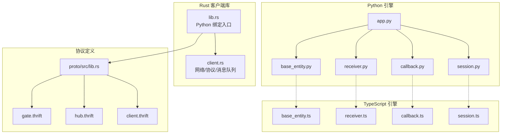
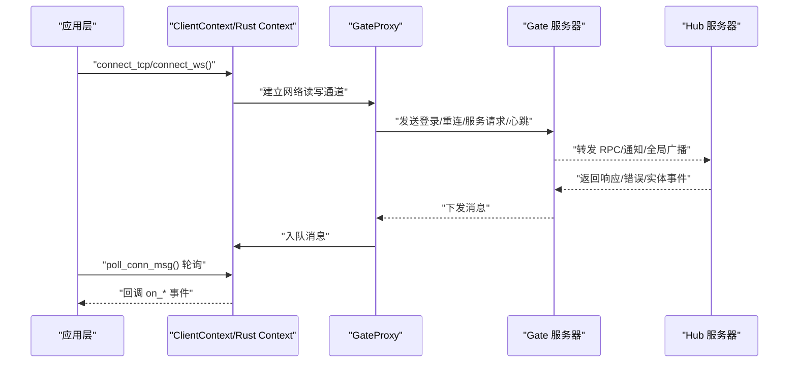
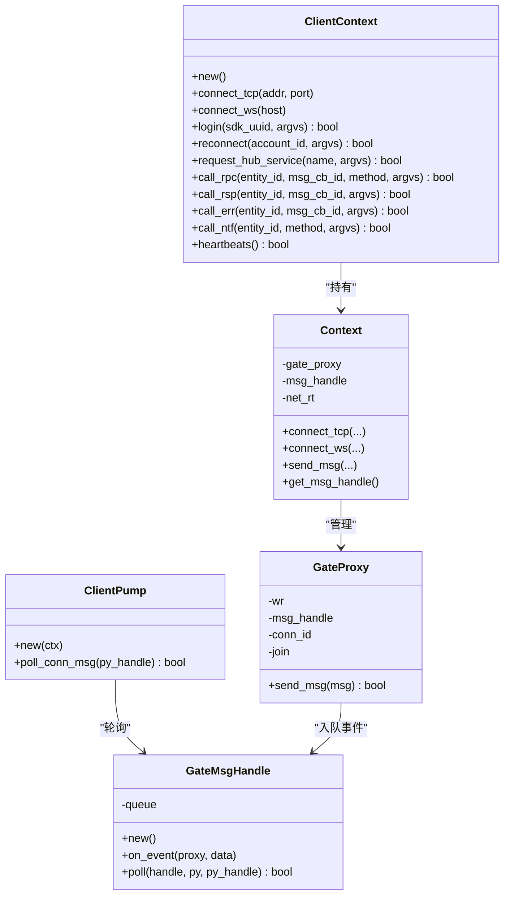
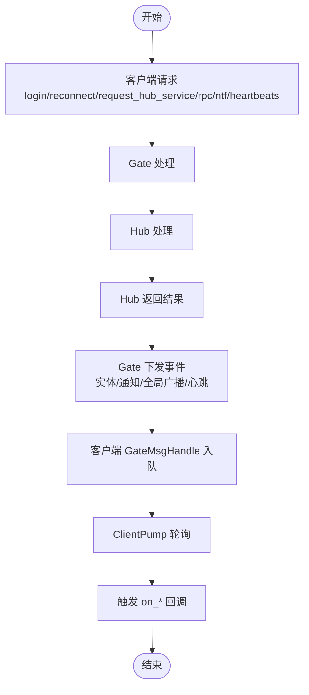
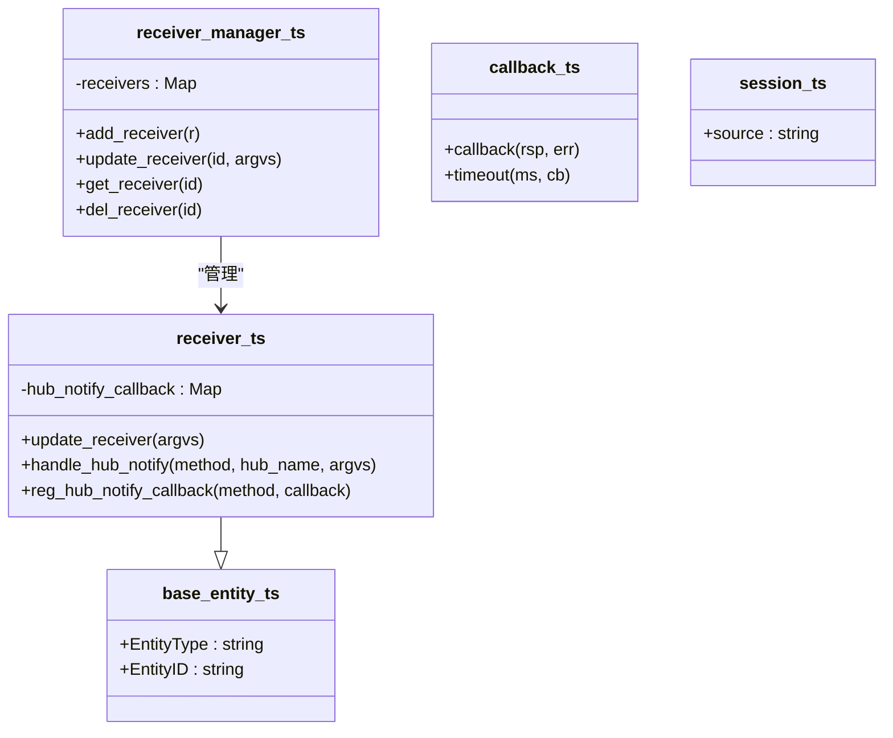
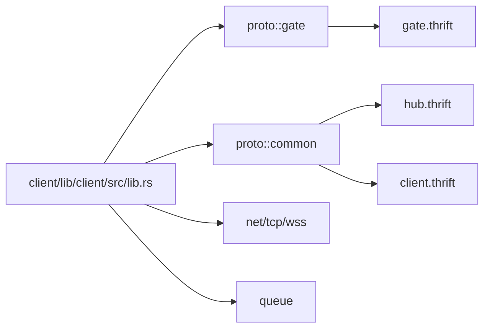

# 客户端 API

<cite>
**本文引用的文件**
- [lib.rs（Rust 客户端库入口）](file://client/lib/client/src/lib.rs)
- [client.rs（Rust 客户端核心实现）](file://client/lib/client/src/client.rs)
- [lib.rs（proto 模块入口）](file://crates/proto/src/lib.rs)
- [client.thrift（客户端侧消息定义）](file://crates/proto/proto/client.thrift)
- [gate.thrift（网关与客户端交互协议）](file://crates/proto/proto/gate.thrift)
- [hub.thrift（中枢与客户端交互协议）](file://crates/proto/proto/hub.thrift)
- [session.py（Python 会话封装）](file://client/engine/session.py)
- [session.ts（TypeScript 会话封装）](file://expand/ts/engine/session.ts)
- [base_entity.py（Python 基类实体）](file://client/engine/base_entity.py)
- [base_entity.ts（TypeScript 基类实体）](file://expand/ts/engine/base_entity.ts)
- [callback.py（Python 回调封装）](file://client/engine/callback.py)
- [callback.ts（TypeScript 回调封装）](file://expand/ts/engine/callback.ts)
- [receiver.py（Python 接收器与管理器）](file://client/engine/receiver.py)
- [receiver.ts（TypeScript 接收器与管理器）](file://expand/ts/engine/receiver.ts)
- [app.py（Python 示例应用）](file://sample/client/py/app.py)
</cite>

## 目录
1. [简介](#简介)
2. [项目结构](#项目结构)
3. [核心组件](#核心组件)
4. [架构总览](#架构总览)
5. [详细组件分析](#详细组件分析)
6. [依赖分析](#依赖分析)
7. [性能考虑](#性能考虑)
8. [故障排查指南](#故障排查指南)
9. [结论](#结论)
10. [附录：API 参考与示例](#附录api-参考与示例)

## 简介
本文件为 geese 客户端 API 的权威参考文档，覆盖 Rust、Python、TypeScript 三语言 SDK 的公共接口与使用规范。内容涵盖：
- 连接管理：TCP/WS 连接建立与关闭
- 会话控制：登录、重连、服务请求、心跳
- 消息收发：RPC 请求/响应/错误、通知、全局广播、实体生命周期事件
- 实体管理：实体创建、刷新、删除、迁移与主从切换
- 协议与错误码：基于 Thrift 的协议定义、错误码与异常处理
- 使用示例与最佳实践：结合示例工程给出调用流程与建议

## 项目结构
geese 客户端相关代码主要分布在以下模块：
- Rust 客户端库：client/lib/client，提供 Python 绑定与核心网络/协议逻辑
- 协议定义：crates/proto，包含 gate、hub、client、common 等 Thrift 定义
- Python 引擎与示例：client/engine 与 sample/client/py
- TypeScript 引擎与示例：expand/ts/engine 与 sample/client/ts



**图表来源**
- [lib.rs（Rust 客户端库入口）:1-116](file://client/lib/client/src/lib.rs#L1-L116)
- [client.rs（Rust 客户端核心实现）:1-356](file://client/lib/client/src/client.rs#L1-L356)
- [lib.rs（proto 模块入口）:1-5](file://crates/proto/src/lib.rs#L1-L5)
- [client.thrift（客户端侧消息定义）:1-112](file://crates/proto/proto/client.thrift#L1-L112)
- [gate.thrift（网关与客户端交互协议）:1-225](file://crates/proto/proto/gate.thrift#L1-L225)
- [hub.thrift（中枢与客户端交互协议）:1-292](file://crates/proto/proto/hub.thrift#L1-L292)
- [app.py（Python 示例应用）:1-71](file://sample/client/py/app.py#L1-L71)

**章节来源**
- [lib.rs（Rust 客户端库入口）:1-116](file://client/lib/client/src/lib.rs#L1-L116)
- [client.rs（Rust 客户端核心实现）:1-356](file://client/lib/client/src/client.rs#L1-L356)
- [lib.rs（proto 模块入口）:1-5](file://crates/proto/src/lib.rs#L1-L5)

## 核心组件
- Rust 客户端上下文与消息泵
  - ClientContext：提供连接、登录、重连、服务请求、RPC 发送、心跳等方法；内部持有 Context，负责网络线程与消息队列
  - ClientPump：轮询消息队列并将服务端事件回调到 Python 层
- Rust 核心运行时
  - GateProxy：封装网络写入与 Thrift 序列化发送
  - GateMsgHandle：接收反序列化后的消息并入队，供 ClientPump 轮询分发
  - Context：管理 GateProxy 生命周期、网络运行时、消息队列与连接状态
- 协议层
  - gate.thrift：定义客户端与网关之间的请求/响应消息类型
  - hub.thrift：定义客户端与中枢之间的实体与迁移、踢人、转移等消息类型
  - client.thrift：定义服务端下发给客户端的消息类型集合

**章节来源**
- [lib.rs（Rust 客户端库入口）:27-94](file://client/lib/client/src/lib.rs#L27-L94)
- [client.rs（Rust 客户端核心实现）:22-51](file://client/lib/client/src/client.rs#L22-L51)
- [client.rs（Rust 客户端核心实现）:85-123](file://client/lib/client/src/client.rs#L85-L123)
- [client.rs（Rust 客户端核心实现）:282-356](file://client/lib/client/src/client.rs#L282-L356)
- [gate.thrift（网关与客户端交互协议）:158-225](file://crates/proto/proto/gate.thrift#L158-L225)
- [hub.thrift（中枢与客户端交互协议）:6-242](file://crates/proto/proto/hub.thrift#L6-L242)
- [client.thrift（客户端侧消息定义）:99-112](file://crates/proto/proto/client.thrift#L99-L112)

## 架构总览
客户端通过 TCP 或 WebSocket 连接到 Gate 服务器，完成登录后进入会话阶段。客户端与 Gate 之间以 Thrift Compact 协议交换消息，Gate 再与 Hub 协作完成业务处理。客户端通过消息泵轮询处理来自服务端的实体事件、RPC 请求、通知、全局广播与心跳。



**图表来源**
- [lib.rs（Rust 客户端库入口）:41-93](file://client/lib/client/src/lib.rs#L41-L93)
- [client.rs（Rust 客户端核心实现）:297-338](file://client/lib/client/src/client.rs#L297-L338)
- [client.rs（Rust 客户端核心实现）:124-279](file://client/lib/client/src/client.rs#L124-L279)
- [gate.thrift（网关与客户端交互协议）:158-225](file://crates/proto/proto/gate.thrift#L158-L225)
- [hub.thrift（中枢与客户端交互协议）:216-242](file://crates/proto/proto/hub.thrift#L216-L242)
- [client.thrift（客户端侧消息定义）:99-112](file://crates/proto/proto/client.thrift#L99-L112)

## 详细组件分析

### Rust 客户端上下文与消息泵
- ClientContext
  - 连接：connect_tcp(host, port)、connect_ws(host)
  - 会话：login(sdk_uuid, argvs)、reconnect(account_id, argvs)、request_hub_service(name, argvs)、heartbeats()
  - RPC：call_rpc(entity_id, msg_cb_id, method, argvs)、call_rsp(entity_id, msg_cb_id, argvs)、call_err(entity_id, msg_cb_id, argvs)、call_ntf(entity_id, method, argvs)
  - 返回值：所有发送方法返回布尔值表示是否成功入队/发送
- ClientPump
  - poll_conn_msg(py_callback_obj)：轮询消息队列，触发 Python 回调 on_conn_id/on_create_remote_entity/.../on_call_* 等



**图表来源**
- [lib.rs（Rust 客户端库入口）:27-94](file://client/lib/client/src/lib.rs#L27-L94)
- [client.rs（Rust 客户端核心实现）:22-51](file://client/lib/client/src/client.rs#L22-L51)
- [client.rs（Rust 客户端核心实现）:85-123](file://client/lib/client/src/client.rs#L85-L123)
- [client.rs（Rust 客户端核心实现）:282-356](file://client/lib/client/src/client.rs#L282-L356)

**章节来源**
- [lib.rs（Rust 客户端库入口）:27-94](file://client/lib/client/src/lib.rs#L27-L94)
- [client.rs（Rust 客户端核心实现）:282-356](file://client/lib/client/src/client.rs#L282-L356)

### 协议与消息模型
- gate.thrift
  - 客户端请求：login、reconnect、request_hub_service、call_rpc/rsp/err/ntf、heartbeats
  - 网关下发：create_remote_entity、delete_remote_entity、refresh_entity、kick_off、transfer_complete、call_rpc/rsp/err/ntf/global、heartbeats
- hub.thrift
  - 中枢对客户端：client_request_login、client_request_reconnect、client_request_service、client_call_rpc/rsp/err/ntf、kick_off_client、client_disconnnect、transfer_entity_control、transfer_msg_end 等
  - 中枢内部：hub_call_hub_*、实体迁移与等待迁移等
- client.thrift
  - 客户端侧 union client_service，承载服务端下发的所有消息类型



**图表来源**
- [gate.thrift（网关与客户端交互协议）:158-225](file://crates/proto/proto/gate.thrift#L158-L225)
- [hub.thrift（中枢与客户端交互协议）:216-242](file://crates/proto/proto/hub.thrift#L216-L242)
- [client.thrift（客户端侧消息定义）:99-112](file://crates/proto/proto/client.thrift#L99-L112)
- [client.rs（Rust 客户端核心实现）:124-279](file://client/lib/client/src/client.rs#L124-L279)

**章节来源**
- [gate.thrift（网关与客户端交互协议）:1-225](file://crates/proto/proto/gate.thrift#L1-L225)
- [hub.thrift（中枢与客户端交互协议）:1-292](file://crates/proto/proto/hub.thrift#L1-L292)
- [client.thrift（客户端侧消息定义）:1-112](file://crates/proto/proto/client.thrift#L1-L112)

### Python 引擎与实体管理
- base_entity：实体基类，包含 entity_type 与 entity_id
- receiver：接收器抽象，维护 hub_notify_callback 映射，并提供注册与派发方法
- receiver_manager：集中管理实体接收器，支持增删查与批量更新
- callback：带超时的回调封装，支持成功/错误回调与定时清理
- session：会话封装，保存 source 字段
- 示例应用 app.py：展示连接、登录、子实体创建、RPC 调用与超时处理

```mermaid
classDiagram
class base_entity {
+entity_type : string
+entity_id : string
}
class receiver {
+hub_notify_callback : dict
+update_receiver(argvs)
+handle_hub_notify(method, hub_name, argvs)
+reg_hub_notify_callback(method, callback)
}
class receiver_manager {
+receivers : dict
+add_receiver(r)
+update_receiver(id, argvs)
+get_receiver(id)
+del_receiver(id)
}
class callback {
+callback(rsp, err)
+timeout(ms, cb)
}
class session {
+source : string
}
receiver --|> base_entity
receiver_manager --> receiver : "管理"
```

**图表来源**
- [base_entity.py（Python 基类实体）:1-6](file://client/engine/base_entity.py#L1-L6)
- [receiver.py（Python 接收器与管理器）:7-48](file://client/engine/receiver.py#L7-L48)
- [callback.py（Python 回调封装）:5-23](file://client/engine/callback.py#L5-L23)
- [session.py（Python 会话封装）:3-7](file://client/engine/session.py#L3-L7)

**章节来源**
- [base_entity.py（Python 基类实体）:1-6](file://client/engine/base_entity.py#L1-L6)
- [receiver.py（Python 接收器与管理器）:1-48](file://client/engine/receiver.py#L1-L48)
- [callback.py（Python 回调封装）:1-23](file://client/engine/callback.py#L1-L23)
- [session.py（Python 会话封装）:1-7](file://client/engine/session.py#L1-L7)
- [app.py（Python 示例应用）:1-71](file://sample/client/py/app.py#L1-L71)

### TypeScript 引擎与实体管理
- base_entity.ts：TypeScript 版本的实体基类
- receiver.ts：TypeScript 版本的接收器与管理器，使用 Map 存储回调
- callback.ts：TypeScript 版本的回调封装，支持超时
- session.ts：TypeScript 版本的会话封装



**图表来源**
- [base_entity.ts（TypeScript 基类实体）:7-15](file://expand/ts/engine/base_entity.ts#L7-L15)
- [receiver.ts（TypeScript 接收器与管理器）:8-56](file://expand/ts/engine/receiver.ts#L8-L56)
- [callback.ts（TypeScript 回调封装）:7-39](file://expand/ts/engine/callback.ts#L7-L39)
- [session.ts（TypeScript 会话封装）:6-12](file://expand/ts/engine/session.ts#L6-L12)

**章节来源**
- [base_entity.ts（TypeScript 基类实体）:1-15](file://expand/ts/engine/base_entity.ts#L1-L15)
- [receiver.ts（TypeScript 接收器与管理器）:1-56](file://expand/ts/engine/receiver.ts#L1-L56)
- [callback.ts（TypeScript 回调封装）:1-39](file://expand/ts/engine/callback.ts#L1-L39)
- [session.ts（TypeScript 会话封装）:1-12](file://expand/ts/engine/session.ts#L1-L12)

## 依赖分析
- Rust 客户端库依赖
  - proto::gate、proto::common：协议消息类型
  - net、tcp、wss：网络传输抽象
  - queue：消息队列
  - thrift：消息编解码
- 协议模块
  - gate.thrift、hub.thrift、client.thrift：定义客户端与服务端的完整消息契约
- Python/TypeScript 引擎
  - 与 Rust 客户端通过 Python 绑定交互，遵循 Thrift 协议



**图表来源**
- [lib.rs（Rust 客户端库入口）:5-21](file://client/lib/client/src/lib.rs#L5-L21)
- [lib.rs（proto 模块入口）:1-5](file://crates/proto/src/lib.rs#L1-L5)
- [gate.thrift（网关与客户端交互协议）:1-225](file://crates/proto/proto/gate.thrift#L1-L225)
- [hub.thrift（中枢与客户端交互协议）:1-292](file://crates/proto/proto/hub.thrift#L1-L292)
- [client.thrift（客户端侧消息定义）:1-112](file://crates/proto/proto/client.thrift#L1-L112)

**章节来源**
- [lib.rs（Rust 客户端库入口）:1-26](file://client/lib/client/src/lib.rs#L1-L26)
- [lib.rs（proto 模块入口）:1-5](file://crates/proto/src/lib.rs#L1-L5)

## 性能考虑
- 网络与序列化
  - 使用 Thrift Compact 协议，减少消息体积
  - 发送路径在异步运行时中进行，避免阻塞主线程
- 消息队列
  - GateMsgHandle 使用队列缓存事件，轮询分发，降低回调开销
- 超时与资源回收
  - 回调封装提供超时机制，防止资源泄漏
- 最佳实践
  - 合理设置心跳周期，避免频繁心跳造成带宽压力
  - 批量处理实体刷新与通知，减少回调次数
  - 在高并发场景下，确保回调处理函数轻量化

[本节为通用指导，无需具体文件分析]

## 故障排查指南
- 连接失败
  - 检查 connect_tcp/connect_ws 参数与目标可达性
  - 查看 Rust 端日志输出，确认连接建立与读写通道初始化
- 登录/重连失败
  - 确认 login/reconnect 参数正确，argvs 编码符合预期
  - 关注 on_kick_off 回调，确认是否被服务端踢下线
- RPC 调用无响应
  - 检查 msg_cb_id 是否匹配，确保 call_rsp/call_err 正确回传
  - 设置回调超时，避免长时间挂起
- 实体事件异常
  - on_create_remote_entity/on_refresh_entity/on_delete_remote_entity 回调参数校验
  - 注意实体迁移与转移过程中的状态一致性

**章节来源**
- [client.rs（Rust 客户端核心实现）:124-279](file://client/lib/client/src/client.rs#L124-L279)
- [callback.py（Python 回调封装）:17-23](file://client/engine/callback.py#L17-L23)
- [callback.ts（TypeScript 回调封装）:27-38](file://expand/ts/engine/callback.ts#L27-L38)

## 结论
geese 客户端 API 提供了统一的跨语言接口与完善的协议支持，覆盖连接、会话、消息与实体管理全链路。通过 Thrift 协议与 Rust 核心实现，客户端能够稳定地与 Gate/Hub 交互，并通过 Python/TypeScript 引擎快速构建业务逻辑。建议开发者结合示例工程与本参考文档，按需选择语言 SDK 并遵循超时与资源管理的最佳实践。

[本节为总结性内容，无需具体文件分析]

## 附录：API 参考与示例

### Rust 客户端 API（lib.rs）
- 类型与方法
  - ClientContext.new()：构造上下文
  - ClientContext.connect_tcp(addr, port)：建立 TCP 连接
  - ClientContext.connect_ws(host)：建立 WebSocket 连接
  - ClientContext.login(sdk_uuid, argvs)：发起登录
  - ClientContext.reconnect(account_id, argvs)：发起重连
  - ClientContext.request_hub_service(name, argvs)：请求服务
  - ClientContext.call_rpc(entity_id, msg_cb_id, method, argvs)：RPC 请求
  - ClientContext.call_rsp(entity_id, msg_cb_id, argvs)：RPC 响应
  - ClientContext.call_err(entity_id, msg_cb_id, argvs)：RPC 错误
  - ClientContext.call_ntf(entity_id, method, argvs)：通知
  - ClientContext.heartbeats()：发送心跳
  - ClientPump.new(ctx)：构造消息泵
  - ClientPump.poll_conn_msg(py_handle)：轮询并触发回调
- 回调（由服务端事件触发）
  - on_conn_id(conn_id)
  - on_create_remote_entity(entity_type, entity_id, argvs)
  - on_delete_remote_entity(entity_id)
  - on_refresh_entity(entity_type, entity_id, argvs)
  - on_kick_off(prompt_info)
  - on_transfer_complete()
  - on_call_rpc(hub_name, entity_id, msg_cb_id, method, argvs)
  - on_call_rsp(entity_id, msg_cb_id, argvs)
  - on_call_err(entity_id, msg_cb_id, argvs)
  - on_call_ntf(hub_name, entity_id, method, argvs)
  - on_call_global(method, argvs)

**章节来源**
- [lib.rs（Rust 客户端库入口）:27-94](file://client/lib/client/src/lib.rs#L27-L94)
- [client.rs（Rust 客户端核心实现）:124-279](file://client/lib/client/src/client.rs#L124-L279)

### Python 引擎 API
- base_entity：实体基类
- receiver：接收器抽象，提供回调注册与派发
- receiver_manager：实体接收器管理
- callback：带超时的回调封装
- session：会话封装
- 示例：app.py 展示连接、登录、子实体创建与 RPC 调用

**章节来源**
- [base_entity.py（Python 基类实体）:1-6](file://client/engine/base_entity.py#L1-L6)
- [receiver.py（Python 接收器与管理器）:1-48](file://client/engine/receiver.py#L1-L48)
- [callback.py（Python 回调封装）:1-23](file://client/engine/callback.py#L1-L23)
- [session.py（Python 会话封装）:1-7](file://client/engine/session.py#L1-L7)
- [app.py（Python 示例应用）:1-71](file://sample/client/py/app.py#L1-L71)

### TypeScript 引擎 API
- base_entity.ts：实体基类
- receiver.ts：接收器与管理器（Map）
- callback.ts：带超时的回调封装
- session.ts：会话封装
- 示例：与 Python 引擎对应的功能与用法一致

**章节来源**
- [base_entity.ts（TypeScript 基类实体）:1-15](file://expand/ts/engine/base_entity.ts#L1-L15)
- [receiver.ts（TypeScript 接收器与管理器）:1-56](file://expand/ts/engine/receiver.ts#L1-L56)
- [callback.ts（TypeScript 回调封装）:1-39](file://expand/ts/engine/callback.ts#L1-L39)
- [session.ts（TypeScript 会话封装）:1-12](file://expand/ts/engine/session.ts#L1-L12)

### 协议与错误码
- 协议类型
  - gate.thrift：客户端请求与服务端下发消息
  - hub.thrift：中枢与客户端交互消息
  - client.thrift：客户端侧消息集合
- 错误码与异常
  - RPC 错误：call_err 对应的错误信息通过 argvs 传递
  - 踢人：kick_off 提示信息通过 prompt_info 传递
  - 超时：callback 提供超时回调，避免资源泄漏

**章节来源**
- [gate.thrift（网关与客户端交互协议）:1-225](file://crates/proto/proto/gate.thrift#L1-L225)
- [hub.thrift（中枢与客户端交互协议）:1-292](file://crates/proto/proto/hub.thrift#L1-L292)
- [client.thrift（客户端侧消息定义）:1-112](file://crates/proto/proto/client.thrift#L1-L112)
- [callback.py（Python 回调封装）:1-23](file://client/engine/callback.py#L1-L23)
- [callback.ts（TypeScript 回调封装）:1-39](file://expand/ts/engine/callback.ts#L1-L39)

### 使用示例与最佳实践
- 连接与登录
  - 选择 TCP 或 WebSocket，建立连接后立即发起登录
  - 登录成功后注册实体创建器与回调
- RPC 调用
  - 为每个 RPC 请求设置 msg_cb_id，确保响应与错误能正确回传
  - 使用回调超时，避免长时间等待
- 实体管理
  - 订阅实体生命周期事件，及时创建/刷新/删除本地实体
  - 注意实体迁移与转移过程中的状态同步
- 心跳与断线重连
  - 定期发送心跳，保持会话活跃
  - 断线后根据服务端提示进行重连或迁移

**章节来源**
- [app.py（Python 示例应用）:1-71](file://sample/client/py/app.py#L1-L71)
- [client.rs（Rust 客户端核心实现）:297-338](file://client/lib/client/src/client.rs#L297-L338)
- [lib.rs（Rust 客户端库入口）:41-93](file://client/lib/client/src/lib.rs#L41-L93)