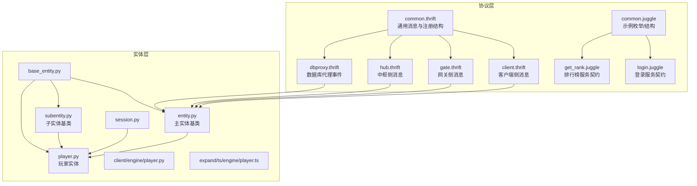
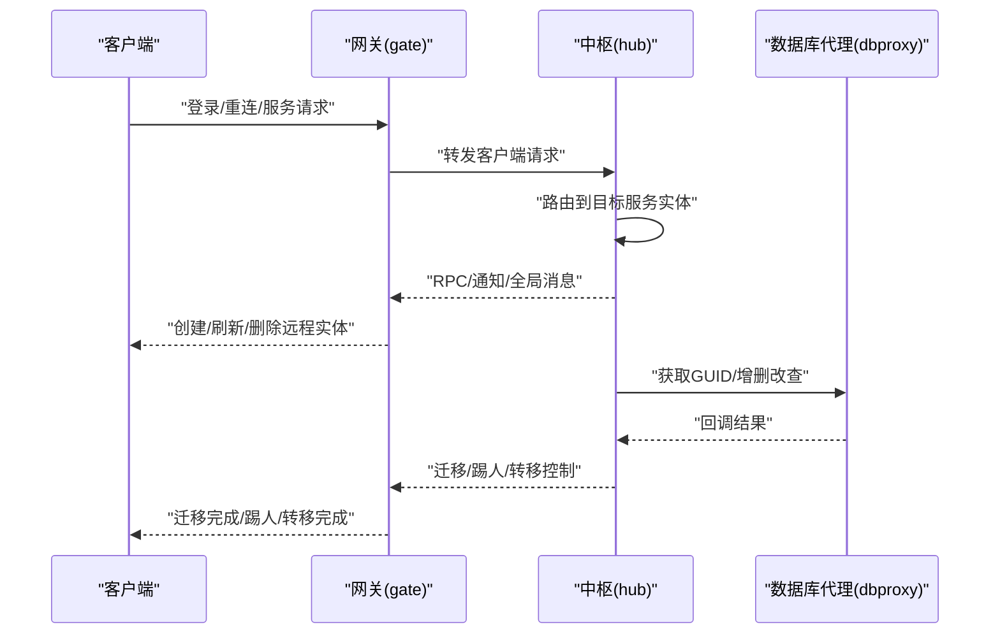
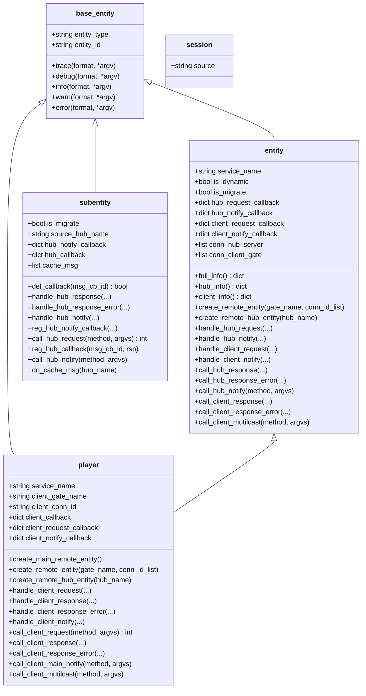
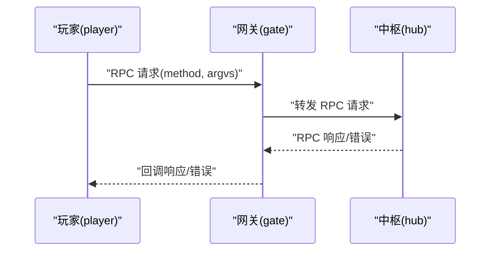
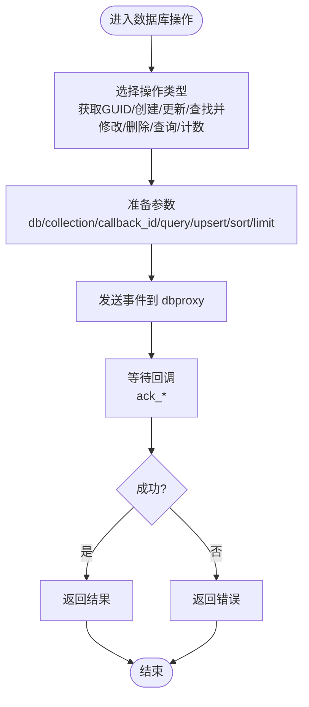
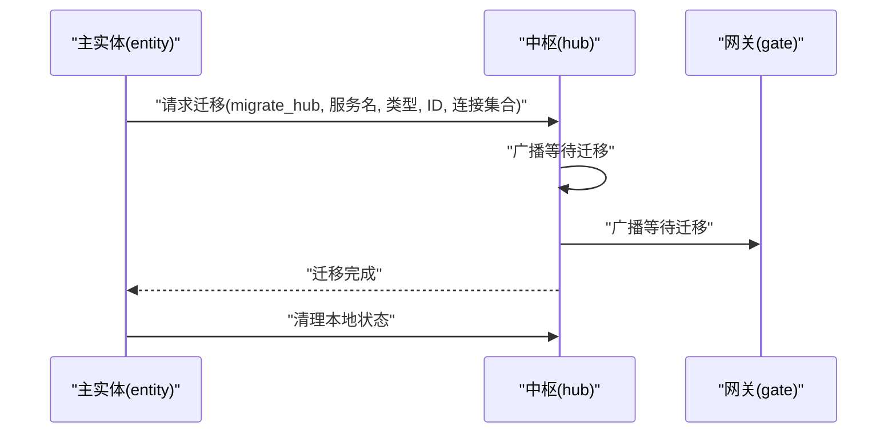
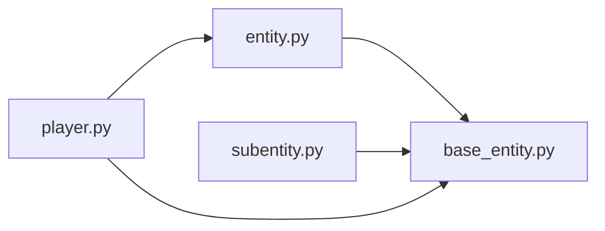

# 数据模型

<cite>
**本文引用的文件**
- [crates/proto/proto/common.thrift](file://crates/proto/proto/common.thrift)
- [crates/proto/proto/client.thrift](file://crates/proto/proto/client.thrift)
- [crates/proto/proto/gate.thrift](file://crates/proto/proto/gate.thrift)
- [crates/proto/proto/hub.thrift](file://crates/proto/proto/hub.thrift)
- [crates/proto/proto/dbproxy.thrift](file://crates/proto/proto/dbproxy.thrift)
- [sample/proto/proto/common/common.juggle](file://sample/proto/proto/common/common.juggle)
- [sample/proto/proto/client_call_hub/login.juggle](file://sample/proto/proto/client_call_hub/login.juggle)
- [sample/proto/proto/client_call_hub/get_rank.juggle](file://sample/proto/proto/client_call_hub/get_rank.juggle)
- [server/engine/base_entity.py](file://server/engine/base_entity.py)
- [server/engine/entity.py](file://server/engine/entity.py)
- [server/engine/subentity.py](file://server/engine/subentity.py)
- [server/engine/player.py](file://server/engine/player.py)
- [server/engine/session.py](file://server/engine/session.py)
- [client/engine/player.py](file://client/engine/player.py)
- [expand/ts/engine/player.ts](file://expand/ts/engine/player.ts)
</cite>

## 目录
1. [简介](#简介)
2. [项目结构](#项目结构)
3. [核心组件](#核心组件)
4. [架构总览](#架构总览)
5. [详细组件分析](#详细组件分析)
6. [依赖分析](#依赖分析)
7. [性能考虑](#性能考虑)
8. [故障排查指南](#故障排查指南)
9. [结论](#结论)
10. [附录](#附录)

## 简介
本文件为 geese 数据模型的权威参考文档，覆盖以下方面：
- 实体模型：主实体与子实体的继承关系、属性与职责边界
- 玩家数据模型：角色信息、状态数据、连接会话与进度保存
- 消息数据模型：RPC 请求/响应/错误、通知、全局广播、心跳与迁移控制消息
- 数据库模型：事件结构、回调约定、集合与查询模式
- 验证规则与约束：字段类型、必填性、取值范围与一致性校验
- 迁移与版本管理：实体迁移流程、跨节点一致性与回滚策略
- 使用指南：面向数据层开发者的建模与实现建议

## 项目结构
geese 的数据模型由“协议定义（Thrift/Juggle）+ 运行时实体类（Python/TypeScript/Rust）”共同构成：
- 协议层：定义跨进程/跨服务的消息结构与服务契约
- 实体层：在服务端/客户端分别实现实体抽象，承载业务状态与消息处理
- 数据层：通过 dbproxy 事件与回调完成持久化操作

图表来源
- [crates/proto/proto/common.thrift:1-39](file://crates/proto/proto/common.thrift#L1-L39)
- [crates/proto/proto/client.thrift:1-112](file://crates/proto/proto/client.thrift#L1-L112)
- [crates/proto/proto/gate.thrift:1-225](file://crates/proto/proto/gate.thrift#L1-L225)
- [crates/proto/proto/hub.thrift:1-292](file://crates/proto/proto/hub.thrift#L1-L292)
- [crates/proto/proto/dbproxy.thrift:1-72](file://crates/proto/proto/dbproxy.thrift#L1-L72)
- [sample/proto/proto/common/common.juggle:1-14](file://sample/proto/proto/common/common.juggle#L1-L14)
- [sample/proto/proto/client_call_hub/login.juggle:1-5](file://sample/proto/proto/client_call_hub/login.juggle#L1-L5)
- [sample/proto/proto/client_call_hub/get_rank.juggle:1-6](file://sample/proto/proto/client_call_hub/get_rank.juggle#L1-L6)
- [server/engine/base_entity.py:1-26](file://server/engine/base_entity.py#L1-L26)
- [server/engine/entity.py:1-194](file://server/engine/entity.py#L1-L194)
- [server/engine/subentity.py:1-98](file://server/engine/subentity.py#L1-L98)
- [server/engine/player.py:1-295](file://server/engine/player.py#L1-L295)
- [server/engine/session.py:1-7](file://server/engine/session.py#L1-L7)
- [client/engine/player.py:1-108](file://client/engine/player.py#L1-L108)
- [expand/ts/engine/player.ts:1-129](file://expand/ts/engine/player.ts#L1-L129)

章节来源
- [crates/proto/proto/common.thrift:1-39](file://crates/proto/proto/common.thrift#L1-L39)
- [crates/proto/proto/client.thrift:1-112](file://crates/proto/proto/client.thrift#L1-L112)
- [crates/proto/proto/gate.thrift:1-225](file://crates/proto/proto/gate.thrift#L1-L225)
- [crates/proto/proto/hub.thrift:1-292](file://crates/proto/proto/hub.thrift#L1-L292)
- [crates/proto/proto/dbproxy.thrift:1-72](file://crates/proto/proto/dbproxy.thrift#L1-L72)
- [sample/proto/proto/common/common.juggle:1-14](file://sample/proto/proto/common/common.juggle#L1-L14)
- [sample/proto/proto/client_call_hub/login.juggle:1-5](file://sample/proto/proto/client_call_hub/login.juggle#L1-L5)
- [sample/proto/proto/client_call_hub/get_rank.juggle:1-6](file://sample/proto/proto/client_call_hub/get_rank.juggle#L1-L6)
- [server/engine/base_entity.py:1-26](file://server/engine/base_entity.py#L1-L26)
- [server/engine/entity.py:1-194](file://server/engine/entity.py#L1-L194)
- [server/engine/subentity.py:1-98](file://server/engine/subentity.py#L1-L98)
- [server/engine/player.py:1-295](file://server/engine/player.py#L1-L295)
- [server/engine/session.py:1-7](file://server/engine/session.py#L1-L7)
- [client/engine/player.py:1-108](file://client/engine/player.py#L1-L108)
- [expand/ts/engine/player.ts:1-129](file://expand/ts/engine/player.ts#L1-L129)

## 核心组件
- 通用消息与注册
  - 通用消息结构：方法名与参数二进制包
  - RPC 响应/错误：携带实体标识与回调 ID
  - Redis 消息：服务器名与消息体
  - 服务器注册：名称与类型；注册回调：名称
- 客户端侧消息
  - 远程实体：创建/删除/刷新、连接 ID 通知、断线重连完成
  - RPC/通知/全局消息：从中枢到客户端的转发
  - 心跳：客户端向网关发送心跳
- 网关侧消息
  - 中枢到客户端：创建/删除/刷新远程实体、RPC/通知/全局消息、踢人/转移
  - 客户端到中枢：登录/重连/服务请求、RPC/通知/心跳
- 中枢侧消息
  - 客户端到中枢：登录/重连/服务请求、RPC/通知/心跳
  - 中枢到中枢：服务实体查询/创建、实体迁移控制与完成
  - 数据库回调：GUID 获取、对象创建/更新/查找并修改/删除、计数、分页读取
- 数据库代理事件
  - 注册中枢、获取 GUID、创建/更新/查找并修改/删除对象
  - 分页查询与计数
- 示例业务结构
  - 错误码：成功
  - 角色排行信息：角色名、实体 ID、排名
  - 客户端时间信息：实体 ID、时间戳
  - 登录服务：请求 SDK UUID，返回是否顶号
  - 排行榜服务：查询自身或区间排行，返回列表

章节来源
- [crates/proto/proto/common.thrift:1-39](file://crates/proto/proto/common.thrift#L1-L39)
- [crates/proto/proto/client.thrift:1-112](file://crates/proto/proto/client.thrift#L1-L112)
- [crates/proto/proto/gate.thrift:1-225](file://crates/proto/proto/gate.thrift#L1-L225)
- [crates/proto/proto/hub.thrift:1-292](file://crates/proto/proto/hub.thrift#L1-L292)
- [crates/proto/proto/dbproxy.thrift:1-72](file://crates/proto/proto/dbproxy.thrift#L1-L72)
- [sample/proto/proto/common/common.juggle:1-14](file://sample/proto/proto/common/common.juggle#L1-L14)
- [sample/proto/proto/client_call_hub/login.juggle:1-5](file://sample/proto/proto/client_call_hub/login.juggle#L1-L5)
- [sample/proto/proto/client_call_hub/get_rank.juggle:1-6](file://sample/proto/proto/client_call_hub/get_rank.juggle#L1-L6)

## 架构总览
下图展示消息在三段式（客户端—网关—中枢）与中枢内（Hub-to-Hub）的流转，以及数据库代理的交互。

图表来源
- [crates/proto/proto/gate.thrift:155-225](file://crates/proto/proto/gate.thrift#L155-L225)
- [crates/proto/proto/hub.thrift:1-242](file://crates/proto/proto/hub.thrift#L1-L242)
- [crates/proto/proto/dbproxy.thrift:1-72](file://crates/proto/proto/dbproxy.thrift#L1-L72)

## 详细组件分析

### 实体模型与继承关系
- 基类
  - base_entity：统一实体类型与实体 ID，并提供日志接口
- 主实体 entity
  - 责任：维护与中枢/客户端的连接列表，注册/处理 RPC/通知回调，创建/刷新/删除远程实体，动态迁移调度
  - 关键字段：服务名、是否动态、迁移状态、回调映射、连接集合
  - 关键方法：创建/刷新/删除远程实体、注册回调、RPC/通知调用、迁移流程
- 子实体 subentity
  - 责任：在非主实体场景下作为代理，缓存迁移期间的消息并在迁移完成后重放
  - 关键字段：是否迁移、源中枢名、回调映射、缓存消息队列
  - 关键方法：注册/处理响应/错误、注册/处理通知、迁移消息缓存与重放
- 玩家实体 player
  - 责任：扩展主实体以支持客户端连接上下文（网关名、连接 ID），提供客户端 RPC/通知能力与批量广播
  - 关键字段：客户端网关名/连接 ID、客户端回调映射、客户端连接集合
  - 关键方法：创建主远程实体、客户端 RPC/通知、批量广播、迁移流程
- 会话 session
  - 责任：承载会话来源标识（如连接 ID）
  - 字段：source

图表来源
- [server/engine/base_entity.py:1-26](file://server/engine/base_entity.py#L1-L26)
- [server/engine/entity.py:1-194](file://server/engine/entity.py#L1-L194)
- [server/engine/subentity.py:1-98](file://server/engine/subentity.py#L1-L98)
- [server/engine/player.py:1-295](file://server/engine/player.py#L1-L295)
- [server/engine/session.py:1-7](file://server/engine/session.py#L1-L7)

章节来源
- [server/engine/base_entity.py:1-26](file://server/engine/base_entity.py#L1-L26)
- [server/engine/entity.py:1-194](file://server/engine/entity.py#L1-L194)
- [server/engine/subentity.py:1-98](file://server/engine/subentity.py#L1-L98)
- [server/engine/player.py:1-295](file://server/engine/player.py#L1-L295)
- [server/engine/session.py:1-7](file://server/engine/session.py#L1-L7)

### 玩家数据模型
- 角色信息
  - 客户端侧：通过客户端 RPC/通知更新角色信息
  - 服务端侧：玩家实体维护 client_info()/hub_info()/full_info() 三套视图，用于不同传输场景
- 状态数据
  - 连接状态：客户端网关名与连接 ID，迁移期间的连接集合
  - 回调状态：消息回调 ID 映射，确保请求-响应配对
- 进度保存
  - 玩家实体参与迁移流程，迁移完成后清理保存管理器中的实体
  - 数据库代理事件提供对象增删改查与计数，配合持久化策略

章节来源
- [server/engine/player.py:1-295](file://server/engine/player.py#L1-L295)
- [crates/proto/proto/hub.thrift:244-292](file://crates/proto/proto/hub.thrift#L244-L292)
- [crates/proto/proto/dbproxy.thrift:1-72](file://crates/proto/proto/dbproxy.thrift#L1-L72)

### 消息数据模型
- RPC 参数与响应
  - 请求：实体 ID、回调 ID、消息体（方法名 + 参数二进制）
  - 响应/错误：实体 ID、回调 ID、参数二进制
- 通知与全局消息
  - 通知：可指定实体或广播至多个网关
  - 全局消息：向所有网关广播
- 心跳与迁移控制
  - 心跳：客户端定时发送
  - 迁移：等待迁移、迁移实体、迁移完成等控制消息
- 踢人与转移
  - 踢人：请求与完成通知
  - 转移：请求与完成通知，支持重连场景

图表来源
- [crates/proto/proto/client.thrift:54-73](file://crates/proto/proto/client.thrift#L54-L73)
- [crates/proto/proto/gate.thrift:48-68](file://crates/proto/proto/gate.thrift#L48-L68)
- [crates/proto/proto/hub.thrift:72-99](file://crates/proto/proto/hub.thrift#L72-L99)

章节来源
- [crates/proto/proto/common.thrift:1-39](file://crates/proto/proto/common.thrift#L1-L39)
- [crates/proto/proto/client.thrift:1-112](file://crates/proto/proto/client.thrift#L1-L112)
- [crates/proto/proto/gate.thrift:1-225](file://crates/proto/proto/gate.thrift#L1-L225)
- [crates/proto/proto/hub.thrift:1-292](file://crates/proto/proto/hub.thrift#L1-L292)

### 数据库模型
- 事件结构
  - 注册中枢、获取 GUID、创建对象、更新对象、查找并修改、删除对象、分页查询、计数
- 回调约定
  - 回调 ID 与结果一一对应，支持成功/失败/分页结束等语义
- 查询模式
  - 支持分页(skip/limit)、排序(sort/asc)、查询条件(binary)

图表来源
- [crates/proto/proto/dbproxy.thrift:1-72](file://crates/proto/proto/dbproxy.thrift#L1-L72)
- [crates/proto/proto/hub.thrift:244-292](file://crates/proto/proto/hub.thrift#L244-L292)

章节来源
- [crates/proto/proto/dbproxy.thrift:1-72](file://crates/proto/proto/dbproxy.thrift#L1-L72)
- [crates/proto/proto/hub.thrift:244-292](file://crates/proto/proto/hub.thrift#L244-L292)

### 验证规则与约束
- 字段类型与必填性
  - 所有结构体字段均声明类型与序号，遵循 Thrift/Juggle 约定
- 取值范围与一致性
  - 回调 ID 为整型，需保证唯一性与生命周期管理
  - 实体 ID 与连接 ID 为字符串，需保持全局唯一
- 业务约束
  - 登录服务要求 SDK UUID，返回是否顶号
  - 排行榜服务要求起止区间或实体 ID，返回角色排行信息
  - 迁移流程中，等待迁移与迁移完成消息必须成对出现

章节来源
- [sample/proto/proto/client_call_hub/login.juggle:1-5](file://sample/proto/proto/client_call_hub/login.juggle#L1-L5)
- [sample/proto/proto/client_call_hub/get_rank.juggle:1-6](file://sample/proto/proto/client_call_hub/get_rank.juggle#L1-L6)
- [crates/proto/proto/hub.thrift:180-215](file://crates/proto/proto/hub.thrift#L180-L215)

### 迁移与版本管理策略
- 动态迁移
  - 主实体/玩家实体在空闲检测后按概率触发迁移尝试
  - 迁移前向关联的中枢/网关广播“等待迁移”，迁移完成后广播“迁移完成”
- 子实体迁移
  - 子实体在迁移期间缓存消息，迁移完成后重放到新的源中枢
- 版本管理
  - 结构体字段有序号，新增字段应向后扩展，避免破坏兼容
  - 回调 ID 与消息体采用二进制编码，升级时需保证序列化/反序列化兼容

图表来源
- [server/engine/entity.py:64-84](file://server/engine/entity.py#L64-L84)
- [crates/proto/proto/hub.thrift:180-215](file://crates/proto/proto/hub.thrift#L180-L215)

章节来源
- [server/engine/entity.py:1-194](file://server/engine/entity.py#L1-L194)
- [server/engine/subentity.py:1-98](file://server/engine/subentity.py#L1-L98)
- [crates/proto/proto/hub.thrift:180-242](file://crates/proto/proto/hub.thrift#L180-L242)

## 依赖分析
- 组件耦合
  - 实体类依赖应用上下文进行消息转发与状态管理
  - 子实体依赖主实体的迁移状态与回调映射
- 外部依赖
  - Thrift/Juggle 协议定义跨语言/跨进程通信契约
  - 数据库代理负责持久化事件与回调

图表来源
- [server/engine/entity.py:1-194](file://server/engine/entity.py#L1-L194)
- [server/engine/subentity.py:1-98](file://server/engine/subentity.py#L1-L98)
- [server/engine/player.py:1-295](file://server/engine/player.py#L1-L295)
- [server/engine/base_entity.py:1-26](file://server/engine/base_entity.py#L1-L26)

章节来源
- [server/engine/entity.py:1-194](file://server/engine/entity.py#L1-L194)
- [server/engine/subentity.py:1-98](file://server/engine/subentity.py#L1-L98)
- [server/engine/player.py:1-295](file://server/engine/player.py#L1-L295)
- [server/engine/base_entity.py:1-26](file://server/engine/base_entity.py#L1-L26)

## 性能考虑
- 消息编解码
  - 使用二进制参数包，减少序列化开销
- 广播与多播
  - 客户端多播时遍历连接集合，建议按需裁剪连接列表
- 迁移策略
  - 动态迁移按概率触发，降低峰值压力
- 数据库操作
  - 分页查询与计数结合，避免一次性加载大结果集

## 故障排查指南
- 回调未匹配
  - 确认回调 ID 是否正确传递与释放
- 未处理方法
  - 检查实体回调注册是否完整
- 迁移异常
  - 确认“等待迁移”与“迁移完成”消息成对到达
- 数据库回调失败
  - 校验回调 ID 与事件参数一致性

章节来源
- [server/engine/entity.py:98-110](file://server/engine/entity.py#L98-L110)
- [server/engine/player.py:149-183](file://server/engine/player.py#L149-L183)
- [server/engine/subentity.py:31-52](file://server/engine/subentity.py#L31-L52)

## 结论
本文档系统梳理了 geese 的数据模型：从协议层的结构定义，到运行时实体的职责划分，再到数据库代理的事件与回调约定。通过明确的验证规则、迁移策略与使用指南，可帮助数据层开发者高效构建稳定可靠的业务数据层。

## 附录
- 示例业务结构
  - 错误码：成功
  - 角色排行信息：角色名、实体 ID、排名
  - 客户端时间信息：实体 ID、时间戳
  - 登录服务：请求 SDK UUID，返回是否顶号
  - 排行榜服务：查询自身或区间排行，返回列表

章节来源
- [sample/proto/proto/common/common.juggle:1-14](file://sample/proto/proto/common/common.juggle#L1-L14)
- [sample/proto/proto/client_call_hub/login.juggle:1-5](file://sample/proto/proto/client_call_hub/login.juggle#L1-L5)
- [sample/proto/proto/client_call_hub/get_rank.juggle:1-6](file://sample/proto/proto/client_call_hub/get_rank.juggle#L1-L6)