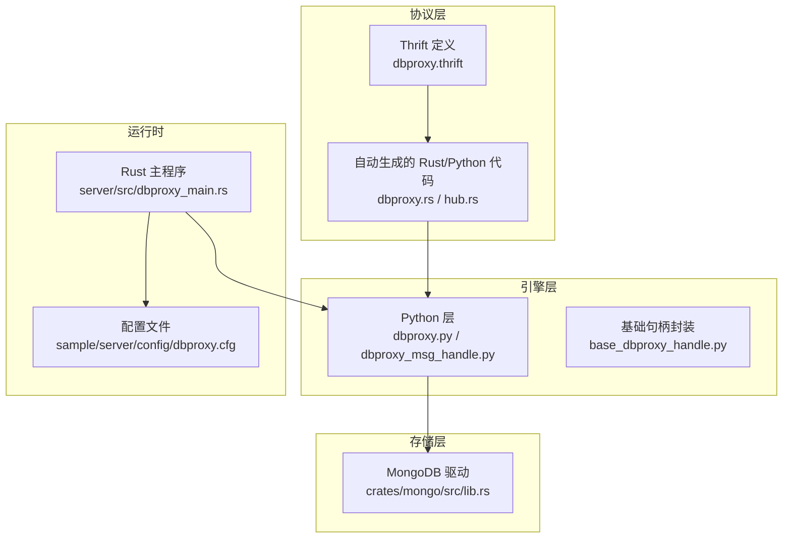
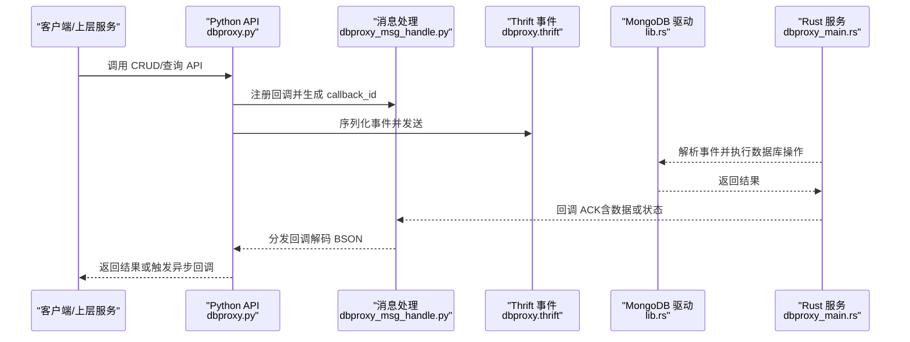
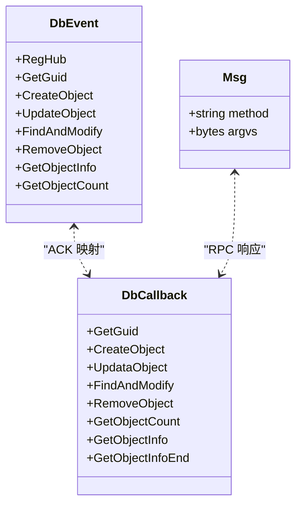
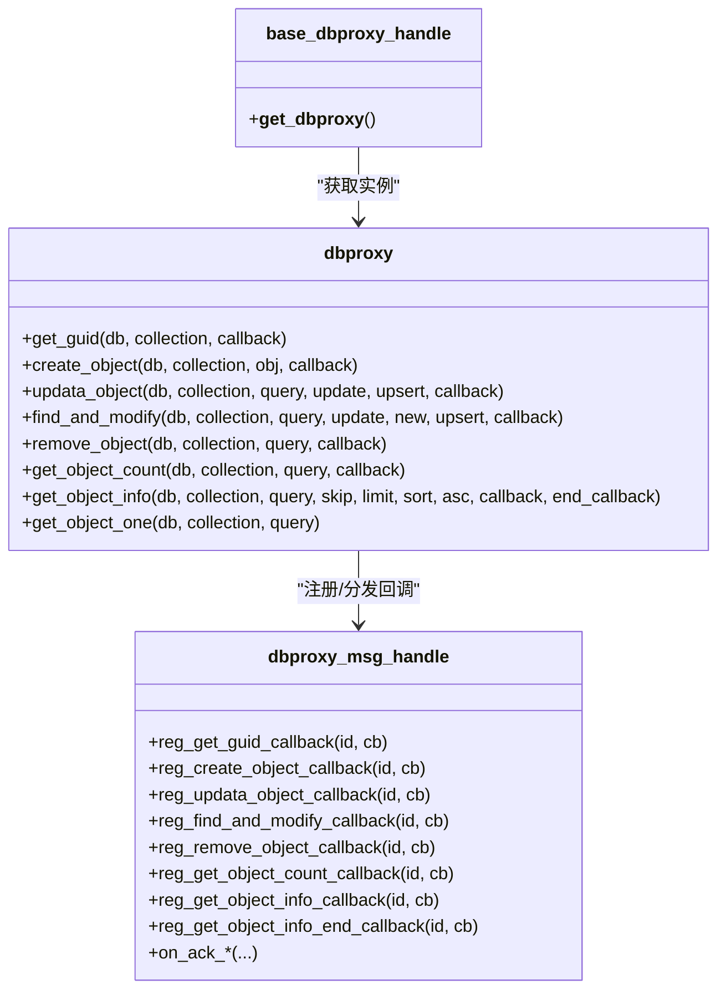
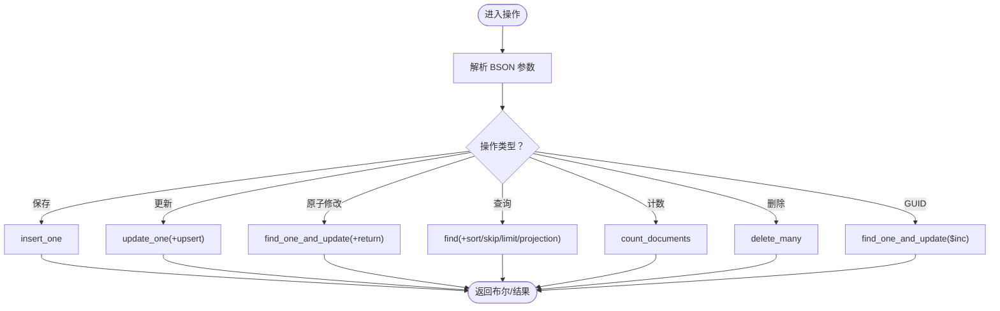
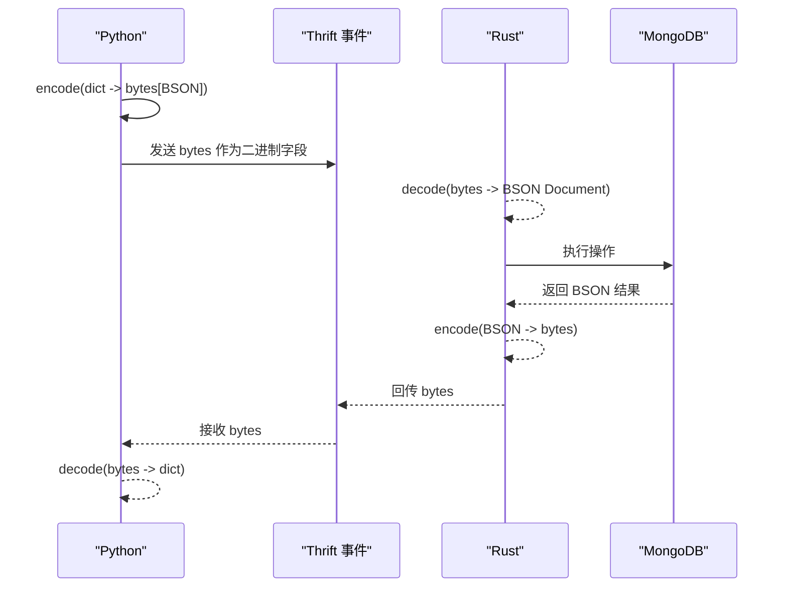
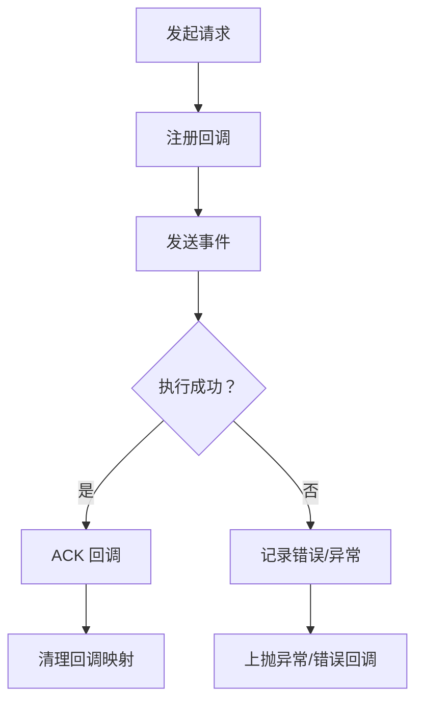
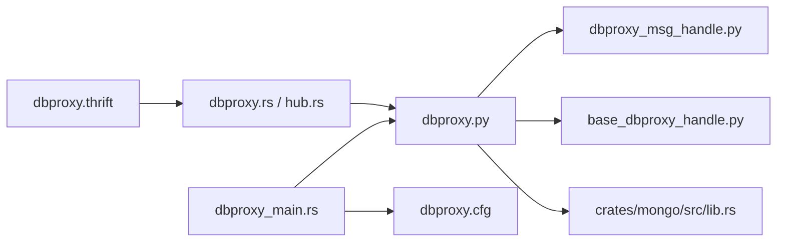

# DBProxy 数据代理 API

<cite>
**本文引用的文件**
- [crates/proto/proto/dbproxy.thrift](file://crates/proto/proto/dbproxy.thrift)
- [crates/proto/src/dbproxy.rs](file://crates/proto/src/dbproxy.rs)
- [crates/proto/src/common.rs](file://crates/proto/src/common.rs)
- [crates/mongo/src/lib.rs](file://crates/mongo/src/lib.rs)
- [server/engine/dbproxy.py](file://server/engine/dbproxy.py)
- [server/engine/dbproxy_msg_handle.py](file://server/engine/dbproxy_msg_handle.py)
- [server/engine/base_dbproxy_handle.py](file://server/engine/base_dbproxy_handle.py)
- [server/src/dbproxy_main.rs](file://server/src/dbproxy_main.rs)
- [sample/server/config/dbproxy.cfg](file://sample/server/config/dbproxy.cfg)
</cite>

## 目录
1. [简介](#简介)
2. [项目结构](#项目结构)
3. [核心组件](#核心组件)
4. [架构总览](#架构总览)
5. [详细组件分析](#详细组件分析)
6. [依赖关系分析](#依赖关系分析)
7. [性能考量](#性能考量)
8. [故障排查指南](#故障排查指南)
9. [结论](#结论)
10. [附录](#附录)

## 简介
本文件为 DBProxy 数据代理服务的详细 API 参考文档，覆盖数据库访问代理的核心接口规范，包括数据读写操作、事务处理（以 MongoDB 原子修改为例）、缓存管理（基于 Redis 的消息通道与本地回调映射）、连接池与查询路由、序列化/反序列化（BSON）以及错误处理与性能监控。本文面向开发者提供从协议定义到运行时实现的完整参考，并给出最佳实践建议。

## 项目结构
DBProxy 由 Rust 后端服务、Python 引擎层、MongoDB 驱动与 Thrift 协议共同组成：
- 协议层：使用 Thrift 定义事件与回调结构，生成跨语言代码。
- 引擎层：Python 提供高层 API 封装与回调管理。
- 存储层：Rust 使用 MongoDB 驱动执行 CRUD、索引与原子修改。
- 运行时：Rust 服务启动、注册 Consul、健康检查与日志。

**图表来源**
- [crates/proto/proto/dbproxy.thrift](file://crates/proto/proto/dbproxy.thrift)
- [crates/proto/src/dbproxy.rs](file://crates/proto/src/dbproxy.rs)
- [server/engine/dbproxy.py](file://server/engine/dbproxy.py)
- [crates/mongo/src/lib.rs](file://crates/mongo/src/lib.rs)
- [server/src/dbproxy_main.rs](file://server/src/dbproxy_main.rs)
- [sample/server/config/dbproxy.cfg](file://sample/server/config/dbproxy.cfg)

**章节来源**
- [crates/proto/proto/dbproxy.thrift](file://crates/proto/proto/dbproxy.thrift)
- [crates/proto/src/dbproxy.rs](file://crates/proto/src/dbproxy.rs)
- [server/engine/dbproxy.py](file://server/engine/dbproxy.py)
- [crates/mongo/src/lib.rs](file://crates/mongo/src/lib.rs)
- [server/src/dbproxy_main.rs](file://server/src/dbproxy_main.rs)
- [sample/server/config/dbproxy.cfg](file://sample/server/config/dbproxy.cfg)

## 核心组件
- Thrift 事件与回调模型：通过 union 组织事件类型，通过回调枚举承载响应结果。
- Python 高层 API：提供 get_guid、create_object、update_object、find_and_modify、remove_object、get_object_count、get_object_info 等方法，并封装单条查询辅助。
- MongoDB 驱动：提供 save、update、find_and_modify、find、count、remove、get_guid、create_index 等能力。
- 运行时与配置：Rust 服务加载配置、注册 Consul、健康检查、日志初始化与服务生命周期管理。

**章节来源**
- [crates/proto/src/dbproxy.rs](file://crates/proto/src/dbproxy.rs)
- [crates/proto/src/common.rs](file://crates/proto/src/common.rs)
- [server/engine/dbproxy.py](file://server/engine/dbproxy.py)
- [crates/mongo/src/lib.rs](file://crates/mongo/src/lib.rs)
- [server/src/dbproxy_main.rs](file://server/src/dbproxy_main.rs)
- [sample/server/config/dbproxy.cfg](file://sample/server/config/dbproxy.cfg)

## 架构总览
DBProxy 的调用链路如下：客户端或上层服务通过 Python API 发起请求；引擎层将请求序列化为 Thrift 事件并发送至 DBProxy 服务；服务在 Rust 中解析事件，调用 MongoDB 驱动执行数据库操作，并通过回调将结果回传给 Python 层。

**图表来源**
- [crates/proto/proto/dbproxy.thrift](file://crates/proto/proto/dbproxy.thrift)
- [crates/proto/src/dbproxy.rs](file://crates/proto/src/dbproxy.rs)
- [server/engine/dbproxy.py](file://server/engine/dbproxy.py)
- [server/engine/dbproxy_msg_handle.py](file://server/engine/dbproxy_msg_handle.py)
- [crates/mongo/src/lib.rs](file://crates/mongo/src/lib.rs)
- [server/src/dbproxy_main.rs](file://server/src/dbproxy_main.rs)

## 详细组件分析

### 协议与数据模型
- 事件模型：通过 union 聚合多种事件类型，如注册 Hub、获取 GUID、创建对象、更新对象、查找并修改、删除对象、查询对象信息、统计数量等。
- 回调模型：通过回调枚举承载不同操作的响应，如 GetGuid、CreateObject、UpdataObject、FindAndModify、RemoveObject、GetObjectCount、GetObjectInfo、GetObjectInfoEnd。
- 通用消息：提供通用消息与 RPC 响应/错误结构，便于跨模块通信。

**图表来源**
- [crates/proto/src/dbproxy.rs](file://crates/proto/src/dbproxy.rs)
- [crates/proto/src/common.rs](file://crates/proto/src/common.rs)

**章节来源**
- [crates/proto/proto/dbproxy.thrift](file://crates/proto/proto/dbproxy.thrift)
- [crates/proto/src/dbproxy.rs](file://crates/proto/src/dbproxy.rs)
- [crates/proto/src/common.rs](file://crates/proto/src/common.rs)

### Python API 与回调管理
- dbproxy 类：封装 CRUD 与查询 API，内部为每个请求生成唯一 callback_id 并注册回调，最终通过上下文发送事件。
- dbproxy_msg_handle：维护回调映射表，接收 ACK 后按 callback_id 分发回调，并清理映射。
- base_dbproxy_handle：提供随机选择 DBProxy 实例的封装，简化上层调用。

**图表来源**
- [server/engine/dbproxy.py](file://server/engine/dbproxy.py)
- [server/engine/dbproxy_msg_handle.py](file://server/engine/dbproxy_msg_handle.py)
- [server/engine/base_dbproxy_handle.py](file://server/engine/base_dbproxy_handle.py)

**章节来源**
- [server/engine/dbproxy.py](file://server/engine/dbproxy.py)
- [server/engine/dbproxy_msg_handle.py](file://server/engine/dbproxy_msg_handle.py)
- [server/engine/base_dbproxy_handle.py](file://server/engine/base_dbproxy_handle.py)

### MongoDB 驱动与数据操作
- 连接与索引：支持创建索引、校验 GUID 初始值。
- 写入与更新：支持保存 BSON 文档、条件更新（可 upsert）。
- 原子修改：find_one_and_update 支持返回新/旧文档、upsert。
- 查询与计数：支持排序、跳过、限制、投影（排除 _id），支持计数。
- 删除：批量删除。
- GUID 获取：原子递增并返回旧值，用于全局唯一 ID 分配。

**图表来源**
- [crates/mongo/src/lib.rs](file://crates/mongo/src/lib.rs)

**章节来源**
- [crates/mongo/src/lib.rs](file://crates/mongo/src/lib.rs)

### 数据序列化与反序列化
- Python 层：使用 BSON 编码/解码字节流，作为 Thrift 二进制字段传输。
- Rust 层：直接解析 BSON 字节流为 Document，执行数据库操作后将结果编码回 BSON。

**图表来源**
- [server/engine/dbproxy.py](file://server/engine/dbproxy.py)
- [crates/mongo/src/lib.rs](file://crates/mongo/src/lib.rs)

**章节来源**
- [server/engine/dbproxy.py](file://server/engine/dbproxy.py)
- [crates/mongo/src/lib.rs](file://crates/mongo/src/lib.rs)

### 错误处理与异常恢复
- Python 层：统一异常类型，携带数据库名、集合名与操作标识，便于定位问题。
- MongoDB 层：对解析失败、插入失败、更新失败、删除失败、计数失败等情况返回错误并记录日志。
- 回调清理：收到 ACK 后立即从回调表中移除，避免内存泄漏与重复触发。

**图表来源**
- [server/engine/dbproxy.py](file://server/engine/dbproxy.py)
- [server/engine/dbproxy_msg_handle.py](file://server/engine/dbproxy_msg_handle.py)
- [crates/mongo/src/lib.rs](file://crates/mongo/src/lib.rs)

**章节来源**
- [server/engine/dbproxy.py](file://server/engine/dbproxy.py)
- [server/engine/dbproxy_msg_handle.py](file://server/engine/dbproxy_msg_handle.py)
- [crates/mongo/src/lib.rs](file://crates/mongo/src/lib.rs)

### 缓存管理与一致性
- 缓存通道：协议层提供 RedisMsg 结构，可用于广播/订阅缓存更新消息，实现跨服务一致性通知。
- 回调驱动：Python 层通过回调映射确保请求-响应一一对应，避免缓存不一致。
- 一致性建议：对热点数据采用“先写库再写缓存”或“写库失败则不写缓存”的策略；对强一致场景，优先读取数据库并回填缓存。

**章节来源**
- [crates/proto/src/common.rs](file://crates/proto/src/common.rs)
- [server/engine/dbproxy.py](file://server/engine/dbproxy.py)
- [server/engine/dbproxy_msg_handle.py](file://server/engine/dbproxy_msg_handle.py)

### 连接池、查询路由与负载均衡
- 连接池：MongoDB 驱动内置连接池与复用机制，Rust 层通过单例客户端对象复用连接。
- 查询路由：服务启动时注册 Consul，健康检查通过独立端口暴露，便于外部路由与负载均衡。
- 负载均衡：结合 Consul 服务发现与健康检查，实现多实例横向扩展。

**章节来源**
- [crates/mongo/src/lib.rs](file://crates/mongo/src/lib.rs)
- [server/src/dbproxy_main.rs](file://server/src/dbproxy_main.rs)
- [sample/server/config/dbproxy.cfg](file://sample/server/config/dbproxy.cfg)

### 性能监控、慢查询分析与优化建议
- 日志与追踪：Rust 侧使用 tracing 初始化日志系统，记录关键路径耗时与错误。
- 健康检查：独立健康端口，便于监控与自动摘除故障节点。
- 慢查询建议：对高频查询添加索引；合理使用投影与分页；避免全表扫描；利用 find_and_modify 原子性减少锁竞争。
- 连接与并发：根据业务 QPS 调整连接池大小；避免阻塞式操作；使用异步 I/O 与批量写入。

**章节来源**
- [server/src/dbproxy_main.rs](file://server/src/dbproxy_main.rs)
- [sample/server/config/dbproxy.cfg](file://sample/server/config/dbproxy.cfg)
- [crates/mongo/src/lib.rs](file://crates/mongo/src/lib.rs)

## 依赖关系分析
- 协议依赖：dbproxy.thrift 定义事件与回调，生成的 Rust/Python 代码在引擎层与服务层之间传递。
- Python 依赖：dbproxy.py 依赖 dbproxy_msg_handle.py 的回调管理；base_dbproxy_handle.py 提供实例选择。
- 存储依赖：Rust 服务依赖 MongoDB 驱动进行数据操作。
- 运行时依赖：Rust 主程序依赖配置文件、Consul 注册与健康服务。

**图表来源**
- [crates/proto/proto/dbproxy.thrift](file://crates/proto/proto/dbproxy.thrift)
- [crates/proto/src/dbproxy.rs](file://crates/proto/src/dbproxy.rs)
- [server/engine/dbproxy.py](file://server/engine/dbproxy.py)
- [server/engine/dbproxy_msg_handle.py](file://server/engine/dbproxy_msg_handle.py)
- [server/engine/base_dbproxy_handle.py](file://server/engine/base_dbproxy_handle.py)
- [crates/mongo/src/lib.rs](file://crates/mongo/src/lib.rs)
- [server/src/dbproxy_main.rs](file://server/src/dbproxy_main.rs)
- [sample/server/config/dbproxy.cfg](file://sample/server/config/dbproxy.cfg)

**章节来源**
- [crates/proto/proto/dbproxy.thrift](file://crates/proto/proto/dbproxy.thrift)
- [crates/proto/src/dbproxy.rs](file://crates/proto/src/dbproxy.rs)
- [server/engine/dbproxy.py](file://server/engine/dbproxy.py)
- [server/engine/dbproxy_msg_handle.py](file://server/engine/dbproxy_msg_handle.py)
- [server/engine/base_dbproxy_handle.py](file://server/engine/base_dbproxy_handle.py)
- [crates/mongo/src/lib.rs](file://crates/mongo/src/lib.rs)
- [server/src/dbproxy_main.rs](file://server/src/dbproxy_main.rs)
- [sample/server/config/dbproxy.cfg](file://sample/server/config/dbproxy.cfg)

## 性能考量
- 索引设计：针对高频查询字段建立单字段或多键索引，必要时启用唯一索引保障约束。
- 查询优化：使用投影剔除不必要的字段；分页查询配合排序字段；避免在大集合上进行复杂聚合。
- 写入优化：批量写入与 upsert 合理使用；控制事务范围，减少长事务。
- 连接池：根据并发与延迟目标调整连接池参数；监控连接利用率与等待队列。
- 监控指标：记录慢查询阈值、错误率、吞吐量与资源占用，结合健康检查实现弹性扩缩容。

[本节为通用指导，无需列出具体文件来源]

## 故障排查指南
- 请求无响应：检查 callback_id 是否正确注册与清理；确认 Python 回调是否被触发。
- 数据库错误：查看 MongoDB 驱动返回的错误日志；核对 BSON 编码/解码是否正确。
- Consul 注册失败：确认 consul_url 与健康端口配置；检查健康检查 URL 与服务名称。
- 性能异常：启用更细粒度的日志与追踪；分析慢查询与索引命中情况。

**章节来源**
- [server/engine/dbproxy_msg_handle.py](file://server/engine/dbproxy_msg_handle.py)
- [crates/mongo/src/lib.rs](file://crates/mongo/src/lib.rs)
- [server/src/dbproxy_main.rs](file://server/src/dbproxy_main.rs)
- [sample/server/config/dbproxy.cfg](file://sample/server/config/dbproxy.cfg)

## 结论
DBProxy 通过 Thrift 协议在 Python 引擎与 Rust 服务之间建立清晰边界，结合 MongoDB 驱动实现高性能数据库代理能力。其回调模型与 BSON 序列化确保了跨语言的一致性与可靠性。配合 Consul 与健康检查，可实现高可用部署与弹性扩展。建议在生产环境中重视索引设计、慢查询治理与缓存一致性策略，以获得稳定与高效的数据库访问体验。

[本节为总结性内容，无需列出具体文件来源]

## 附录

### API 一览（按操作类型）
- 基础 CRUD
  - 创建对象：create_object(db, collection, obj, callback)
  - 更新对象：updata_object(db, collection, query, update, upsert, callback)
  - 查找并修改：find_and_modify(db, collection, query, update, new, upsert, callback)
  - 删除对象：remove_object(db, collection, query, callback)
  - 获取对象列表：get_object_info(db, collection, query, skip, limit, sort, ascending, callback, end_callback)
  - 获取对象数量：get_object_count(db, collection, query, callback)
  - 获取单个对象：get_object_one(db, collection, query)
  - 获取 GUID：get_guid(db, collection, callback)
- 高级能力
  - 创建索引：create_index(db, collection, key, is_unique)
  - 校验 GUID 初始值：check_int_guid(db, collection, initial_guid)
  - 原子 GUID 递增：get_guid(db, collection)

**章节来源**
- [server/engine/dbproxy.py](file://server/engine/dbproxy.py)
- [crates/mongo/src/lib.rs](file://crates/mongo/src/lib.rs)
- [crates/proto/proto/dbproxy.thrift](file://crates/proto/proto/dbproxy.thrift)