# Gate 网关 API

<cite>
**本文引用的文件**
- [gate.thrift](file://crates/proto/proto/gate.thrift)
- [gate.rs](file://crates/proto/src/gate.rs)
- [common.rs](file://crates/proto/src/common.rs)
- [gate_main.rs](file://server/src/gate_main.rs)
- [gate_proxy_manager.rs](file://server/lib/hub/src/gate_proxy_manager.rs)
- [gate_msg_handle.rs](file://server/lib/hub/src/gate_msg_handle.rs)
- [wss_server.rs](file://crates/wss/src/wss_server.rs)
- [gate.cfg](file://sample/server/config/gate.cfg)
- [gate_client_service.ts](file://expand/ts/engine/proto/gate_client_service.ts)
- [gate_hub_service.ts](file://expand/ts/engine/proto/gate_hub_service.ts)
- [client.rs](file://client/lib/client/src/client.rs)
</cite>

## 目录
1. [简介](#简介)
2. [项目结构](#项目结构)
3. [核心组件](#核心组件)
4. [架构总览](#架构总览)
5. [详细组件分析](#详细组件分析)
6. [依赖关系分析](#依赖关系分析)
7. [性能考量](#性能考量)
8. [故障排查指南](#故障排查指南)
9. [结论](#结论)
10. [附录](#附录)

## 简介
本文件为 Gate 网关服务的详细 API 参考文档，聚焦于客户端连接入口的关键接口规范，涵盖以下方面：
- 客户端连接建立、心跳检测、消息转发与连接管理
- 客户端请求处理流程：登录验证、重连机制、服务选择
- 网关与客户端之间的通信协议：消息格式、序列化方式、错误处理
- 连接池管理、负载均衡策略与性能优化建议
- 完整接口参数说明、返回值定义与异常处理方案
- 面向开发者的实现指南与最佳实践

## 项目结构
Gate 服务由 Rust 后端与跨语言协议定义共同组成，前端可使用 TypeScript/Python 等语言通过 Thrift 协议与 Gate 交互。

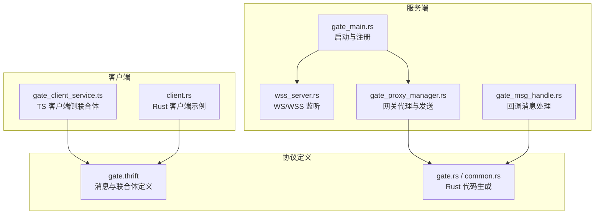

**图表来源**
- [gate_main.rs:33-116](file://server/src/gate_main.rs#L33-L116)
- [wss_server.rs:29-148](file://crates/wss/src/wss_server.rs#L29-L148)
- [gate_proxy_manager.rs:13-44](file://server/lib/hub/src/gate_proxy_manager.rs#L13-L44)
- [gate_msg_handle.rs:24-196](file://server/lib/hub/src/gate_msg_handle.rs#L24-L196)
- [gate.thrift:1-225](file://crates/proto/proto/gate.thrift#L1-L225)
- [gate.rs:1-800](file://crates/proto/src/gate.rs#L1-L800)
- [common.rs:1-462](file://crates/proto/src/common.rs#L1-L462)
- [gate_client_service.ts:25-83](file://expand/ts/engine/proto/gate_client_service.ts#L25-L83)
- [client.rs:80-115](file://client/lib/client/src/client.rs#L80-L115)

**章节来源**
- [gate_main.rs:33-116](file://server/src/gate_main.rs#L33-L116)
- [wss_server.rs:29-148](file://crates/wss/src/wss_server.rs#L29-L148)
- [gate_proxy_manager.rs:13-44](file://server/lib/hub/src/gate_proxy_manager.rs#L13-L44)
- [gate_msg_handle.rs:24-196](file://server/lib/hub/src/gate_msg_handle.rs#L24-L196)
- [gate.thrift:1-225](file://crates/proto/proto/gate.thrift#L1-L225)
- [gate.rs:1-800](file://crates/proto/src/gate.rs#L1-L800)
- [common.rs:1-462](file://crates/proto/src/common.rs#L1-L462)
- [gate_client_service.ts:25-83](file://expand/ts/engine/proto/gate_client_service.ts#L25-L83)
- [client.rs:80-115](file://client/lib/client/src/client.rs#L80-L115)

## 核心组件
- 协议与数据模型
  - gate.thrift 定义了网关与 Hub 之间以及客户端与网关之间的消息结构与联合体类型（如登录、重连、RPC、通知、全局消息、心跳等）。
  - gate.rs / common.rs 提供 Rust 侧的序列化/反序列化实现与类型定义。
- 服务端入口
  - gate_main.rs 负责加载配置、注册健康检查、注册 Consul 服务、启动 WSS/WS 监听并运行 GateServer。
- 网关代理与消息发送
  - gate_proxy_manager.rs 封装 GateProxy，负责将 Hub 发来的消息通过 Thrift Compact 协议写入网络通道并发送。
- 回调消息处理
  - gate_msg_handle.rs 将来自网关的回调消息分发到 Python 扩展回调函数（如登录、重连、RPC、通知、踢人、断线等）。
- 客户端侧
  - gate_client_service.ts 定义客户端侧的 gate_client_service 联合体，用于封装客户端请求到网关的消息。
  - client.rs 展示了客户端如何接收网关消息并进行反序列化处理。

**章节来源**
- [gate.thrift:158-225](file://crates/proto/proto/gate.thrift#L158-L225)
- [gate.rs:2117-2131](file://crates/proto/src/gate.rs#L2117-L2131)
- [common.rs:33-97](file://crates/proto/src/common.rs#L33-L97)
- [gate_main.rs:33-116](file://server/src/gate_main.rs#L33-L116)
- [gate_proxy_manager.rs:13-44](file://server/lib/hub/src/gate_proxy_manager.rs#L13-L44)
- [gate_msg_handle.rs:24-196](file://server/lib/hub/src/gate_msg_handle.rs#L24-L196)
- [gate_client_service.ts:25-83](file://expand/ts/engine/proto/gate_client_service.ts#L25-L83)
- [client.rs:80-115](file://client/lib/client/src/client.rs#L80-L115)

## 架构总览
下图展示了 Gate 与 Hub、客户端之间的交互关系及消息流向。

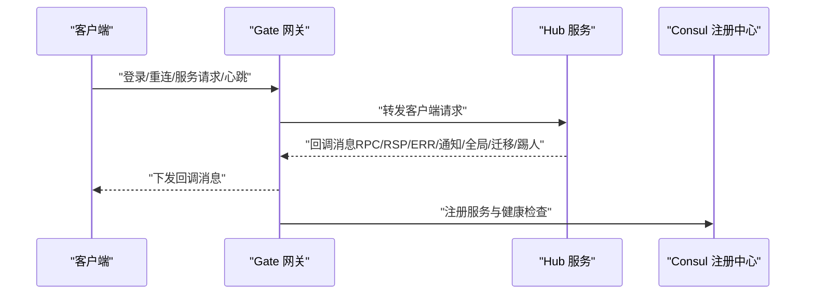

**图表来源**
- [gate_main.rs:64-86](file://server/src/gate_main.rs#L64-L86)
- [gate_proxy_manager.rs:29-43](file://server/lib/hub/src/gate_proxy_manager.rs#L29-L43)
- [gate_msg_handle.rs:31-195](file://server/lib/hub/src/gate_msg_handle.rs#L31-L195)
- [gate.thrift:135-153](file://crates/proto/proto/gate.thrift#L135-L153)

## 详细组件分析

### 1) 登录与重连流程
- 客户端通过 gate_client_service 的 login 或 reconnect 字段发起请求，字段互斥且必填一个。
- Gate 收到后转发至 Hub，Hub 处理完成后通过 HubCallClient* 类型回调给 Gate，再由 Gate 下发给客户端。

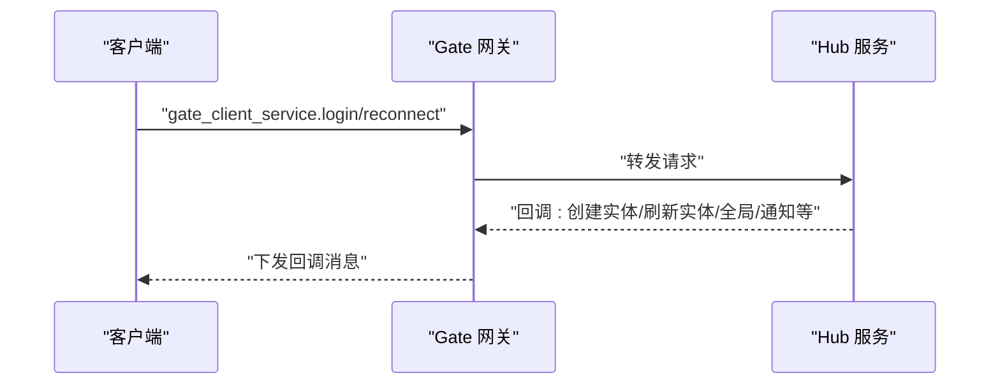

**图表来源**
- [gate.thrift:158-177](file://crates/proto/proto/gate.thrift#L158-L177)
- [gate.rs:2117-2131](file://crates/proto/src/gate.rs#L2117-L2131)
- [gate_client_service.ts:78-83](file://expand/ts/engine/proto/gate_client_service.ts#L78-L83)

**章节来源**
- [gate.thrift:158-177](file://crates/proto/proto/gate.thrift#L158-L177)
- [gate.rs:2117-2131](file://crates/proto/src/gate.rs#L2117-L2131)
- [gate_client_service.ts:78-83](file://expand/ts/engine/proto/gate_client_service.ts#L78-L83)

### 2) 心跳检测
- 客户端通过 gate_client_service.heartbeats 字段发送心跳。
- Gate 仅透传该字段，不改变其语义；心跳周期与超时策略由上层业务或客户端库决定。

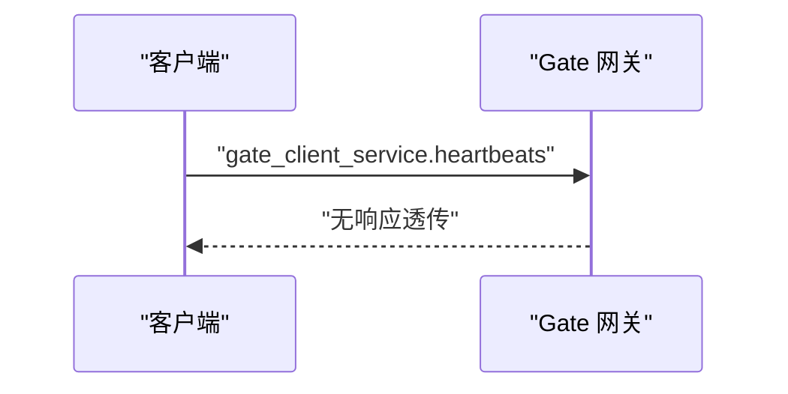

**图表来源**
- [gate.thrift:213-214](file://crates/proto/proto/gate.thrift#L213-L214)
- [gate.rs:2117-2131](file://crates/proto/src/gate.rs#L2117-L2131)
- [gate_client_service.ts:99-101](file://expand/ts/engine/proto/gate_client_service.ts#L99-L101)

**章节来源**
- [gate.thrift:213-214](file://crates/proto/proto/gate.thrift#L213-L214)
- [gate.rs:2117-2131](file://crates/proto/src/gate.rs#L2117-L2131)
- [gate_client_service.ts:99-101](file://expand/ts/engine/proto/gate_client_service.ts#L99-L101)

### 3) RPC/通知/全局消息
- 客户端通过 client_call_hub_rpc、client_call_hub_ntf、client_call_hub_rsp、client_call_hub_err 发起请求。
- Hub 处理后通过 HubCallClientRpc、HubCallClientNtf、HubCallClientRsp、HubCallClientErr 回调给 Gate，再下发给客户端。

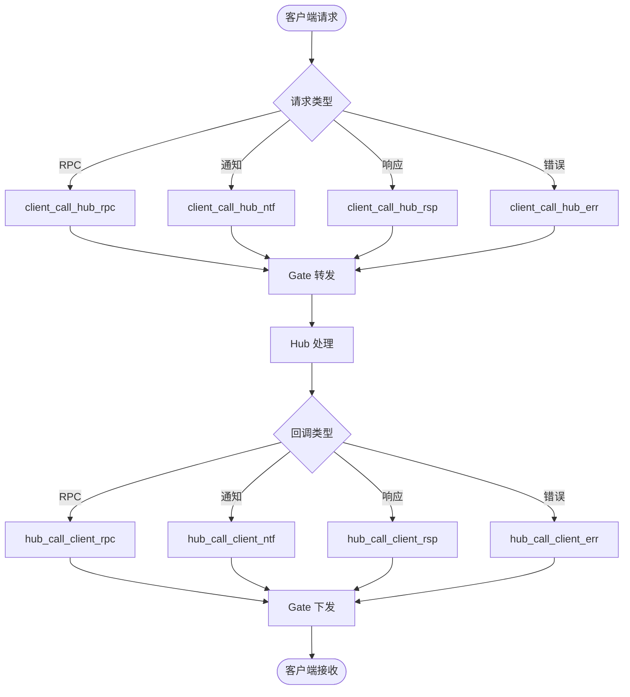

**图表来源**
- [gate.thrift:182-208](file://crates/proto/proto/gate.thrift#L182-L208)
- [gate.rs:416-493](file://crates/proto/src/gate.rs#L416-L493)
- [common.rs:103-180](file://crates/proto/src/common.rs#L103-L180)

**章节来源**
- [gate.thrift:182-208](file://crates/proto/proto/gate.thrift#L182-L208)
- [gate.rs:416-493](file://crates/proto/src/gate.rs#L416-L493)
- [common.rs:103-180](file://crates/proto/src/common.rs#L103-L180)

### 4) 服务选择与迁移
- 客户端通过 client_request_hub_service 请求特定服务。
- Hub 可能触发迁移/转移流程，相关消息包括等待迁移、迁移完成、实体转移完成等。

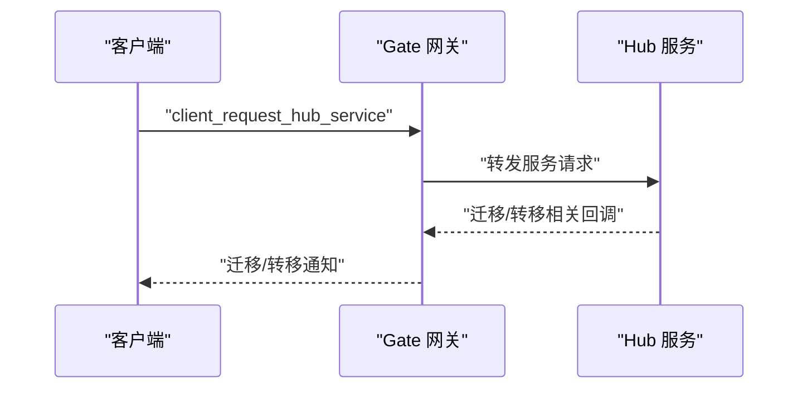

**图表来源**
- [gate.thrift:174-177](file://crates/proto/proto/gate.thrift#L174-L177)
- [gate.thrift:123-133](file://crates/proto/proto/gate.thrift#L123-L133)
- [gate.thrift:115-118](file://crates/proto/proto/gate.thrift#L115-L118)

**章节来源**
- [gate.thrift:174-177](file://crates/proto/proto/gate.thrift#L174-L177)
- [gate.thrift:123-133](file://crates/proto/proto/gate.thrift#L123-L133)
- [gate.thrift:115-118](file://crates/proto/proto/gate.thrift#L115-L118)

### 5) 踢人与断线处理
- Hub 可以请求踢人或通知断线，Gate 将相应消息下发给客户端。

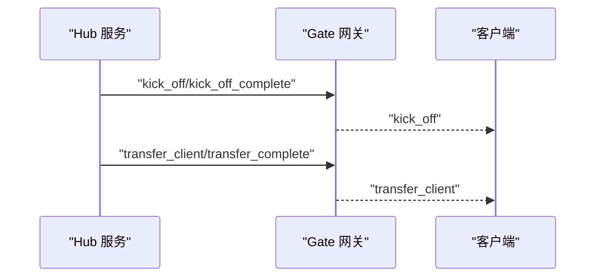

**图表来源**
- [gate.thrift:89-110](file://crates/proto/proto/gate.thrift#L89-L110)
- [gate.thrift:146-149](file://crates/proto/proto/gate.thrift#L146-L149)

**章节来源**
- [gate.thrift:89-110](file://crates/proto/proto/gate.thrift#L89-L110)
- [gate.thrift:146-149](file://crates/proto/proto/gate.thrift#L146-L149)

### 6) 消息格式与序列化
- 协议采用 Thrift Compact 协议，消息结构在 gate.thrift 中定义，Rust 侧通过 gate.rs 与 common.rs 生成的类型进行序列化/反序列化。
- 客户端侧 TypeScript 通过 gate_client_service.ts 与 gate_hub_service.ts 对应联合体与结构体。

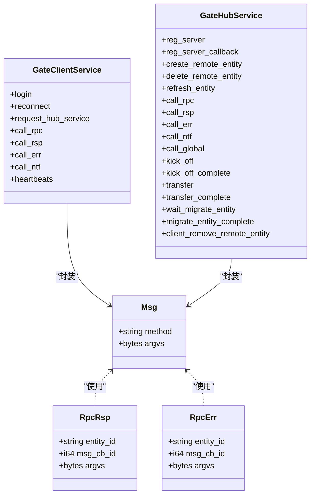

**图表来源**
- [common.rs:33-97](file://crates/proto/src/common.rs#L33-L97)
- [common.rs:103-180](file://crates/proto/src/common.rs#L103-L180)
- [common.rs:186-263](file://crates/proto/src/common.rs#L186-L263)
- [gate.rs:2117-2131](file://crates/proto/src/gate.rs#L2117-L2131)
- [gate.rs:135-153](file://crates/proto/src/gate.rs#L135-L153)

**章节来源**
- [common.rs:33-97](file://crates/proto/src/common.rs#L33-L97)
- [common.rs:103-180](file://crates/proto/src/common.rs#L103-L180)
- [common.rs:186-263](file://crates/proto/src/common.rs#L186-L263)
- [gate.rs:2117-2131](file://crates/proto/src/gate.rs#L2117-L2131)
- [gate.rs:135-153](file://crates/proto/src/gate.rs#L135-L153)

### 7) 错误处理机制
- Thrift 协议层对联合体字段数量进行校验：必须且只能有一个字段被设置，否则抛出协议异常。
- 客户端侧 TypeScript 在构造联合体时同样进行字段数校验，避免非法数据。

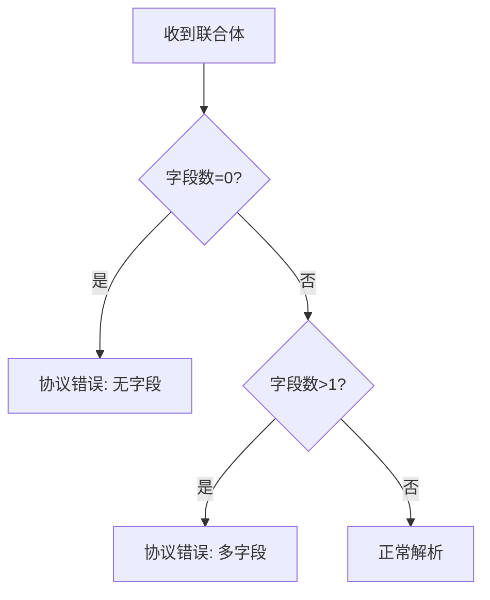

**图表来源**
- [gate.rs:2094-2115](file://crates/proto/src/gate.rs#L2094-L2115)
- [gate_client_service.ts:70-76](file://expand/ts/engine/proto/gate_client_service.ts#L70-L76)

**章节来源**
- [gate.rs:2094-2115](file://crates/proto/src/gate.rs#L2094-L2115)
- [gate_client_service.ts:70-76](file://expand/ts/engine/proto/gate_client_service.ts#L70-L76)

### 8) 连接管理与传输
- Gate 支持 TCP/WS/WSS 三种接入方式，配置项包括服务端口、客户端 TCP/WS 端口与 WSS 证书配置。
- WSS 服务器负责监听并接受 TLS 握手后的 WebSocket 流，分离读写通道交由回调处理。

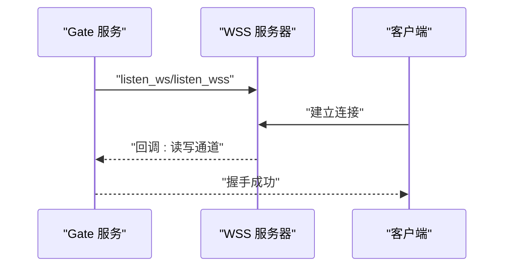

**图表来源**
- [gate_main.rs:64-67](file://server/src/gate_main.rs#L64-L67)
- [wss_server.rs:29-96](file://crates/wss/src/wss_server.rs#L29-L96)
- [wss_server.rs:98-143](file://crates/wss/src/wss_server.rs#L98-L143)

**章节来源**
- [gate_main.rs:64-67](file://server/src/gate_main.rs#L64-L67)
- [wss_server.rs:29-96](file://crates/wss/src/wss_server.rs#L29-L96)
- [wss_server.rs:98-143](file://crates/wss/src/wss_server.rs#L98-L143)

### 9) 客户端请求处理流程（登录/重连/服务）
- 客户端发送 gate_client_service.login/reconnect/request_hub_service。
- Gate 将请求转发至 Hub，Hub 处理后通过 HubCallClient* 类型回调，Gate 再下发给客户端。
- Hub 回调中可能包含实体创建/刷新/删除、全局广播、通知、RPC 响应/错误等。

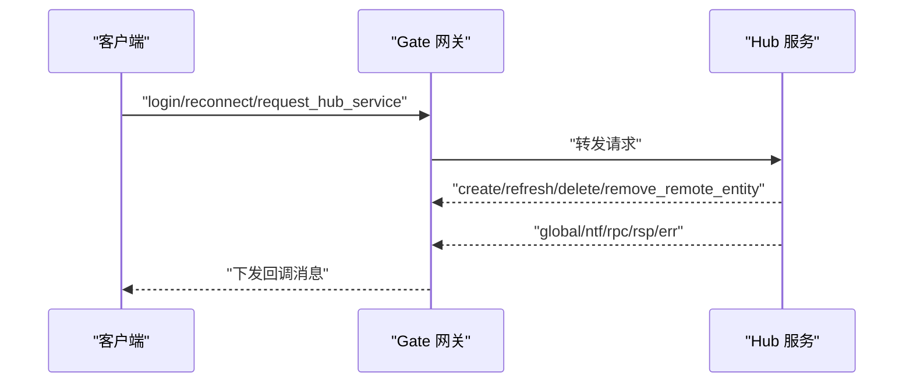

**图表来源**
- [gate.thrift:135-153](file://crates/proto/proto/gate.thrift#L135-L153)
- [gate.thrift:158-177](file://crates/proto/proto/gate.thrift#L158-L177)
- [gate_msg_handle.rs:31-195](file://server/lib/hub/src/gate_msg_handle.rs#L31-L195)

**章节来源**
- [gate.thrift:135-153](file://crates/proto/proto/gate.thrift#L135-L153)
- [gate.thrift:158-177](file://crates/proto/proto/gate.thrift#L158-L177)
- [gate_msg_handle.rs:31-195](file://server/lib/hub/src/gate_msg_handle.rs#L31-L195)

### 10) 客户端消息接收与处理
- 客户端侧通过 GateMsgHandle 接收来自 Gate 的消息，尝试反序列化，失败则记录错误并忽略。
- GateMsgHandle 维护事件队列，按顺序派发到具体处理器。

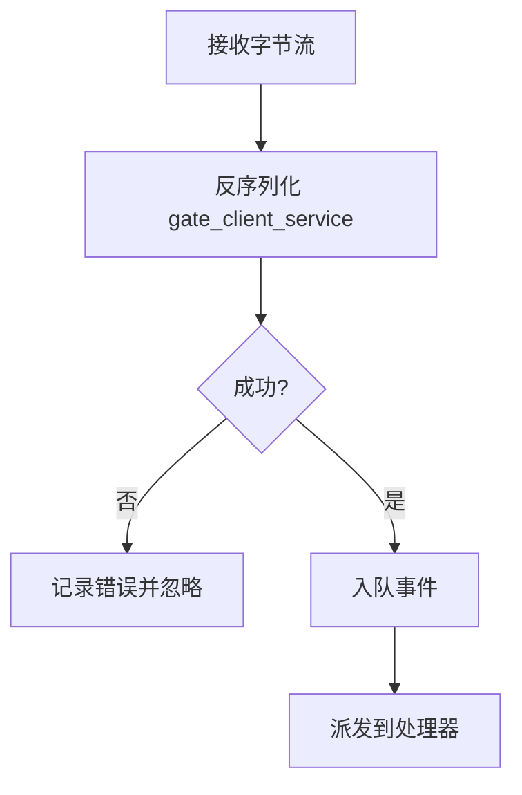

**图表来源**
- [client.rs:100-115](file://client/lib/client/src/client.rs#L100-L115)

**章节来源**
- [client.rs:100-115](file://client/lib/client/src/client.rs#L100-L115)

## 依赖关系分析
- 协议依赖
  - gate.thrift 是所有消息类型的权威定义，gate.rs 与 common.rs 为其 Rust 代码生成产物。
- 服务端依赖
  - gate_main.rs 依赖 wss_server.rs 提供 WS/WSS 监听能力，并通过 Consul 注册服务。
  - gate_proxy_manager.rs 依赖 thrift::protocol 与 net::NetWriter 将消息写入网络通道。
  - gate_msg_handle.rs 依赖 Python 扩展回调接口，将消息桥接到业务逻辑。
- 客户端依赖
  - gate_client_service.ts 与 gate_hub_service.ts 与 gate.thrift 对应，确保跨语言一致性。

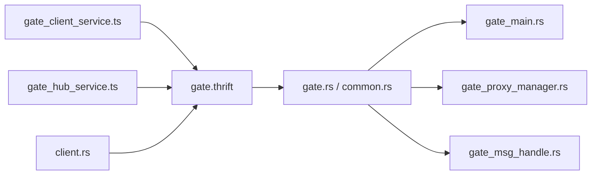

**图表来源**
- [gate.thrift:1-225](file://crates/proto/proto/gate.thrift#L1-L225)
- [gate.rs:1-800](file://crates/proto/src/gate.rs#L1-L800)
- [common.rs:1-462](file://crates/proto/src/common.rs#L1-L462)
- [gate_main.rs:33-116](file://server/src/gate_main.rs#L33-L116)
- [gate_proxy_manager.rs:13-44](file://server/lib/hub/src/gate_proxy_manager.rs#L13-L44)
- [gate_msg_handle.rs:24-196](file://server/lib/hub/src/gate_msg_handle.rs#L24-L196)
- [gate_client_service.ts:25-83](file://expand/ts/engine/proto/gate_client_service.ts#L25-L83)
- [gate_hub_service.ts:276-307](file://expand/ts/engine/proto/gate_hub_service.ts#L276-L307)
- [client.rs:80-115](file://client/lib/client/src/client.rs#L80-L115)

**章节来源**
- [gate.thrift:1-225](file://crates/proto/proto/gate.thrift#L1-L225)
- [gate.rs:1-800](file://crates/proto/src/gate.rs#L1-L800)
- [common.rs:1-462](file://crates/proto/src/common.rs#L1-L462)
- [gate_main.rs:33-116](file://server/src/gate_main.rs#L33-L116)
- [gate_proxy_manager.rs:13-44](file://server/lib/hub/src/gate_proxy_manager.rs#L13-L44)
- [gate_msg_handle.rs:24-196](file://server/lib/hub/src/gate_msg_handle.rs#L24-L196)
- [gate_client_service.ts:25-83](file://expand/ts/engine/proto/gate_client_service.ts#L25-L83)
- [gate_hub_service.ts:276-307](file://expand/ts/engine/proto/gate_hub_service.ts#L276-L307)
- [client.rs:80-115](file://client/lib/client/src/client.rs#L80-L115)

## 性能考量
- 序列化开销
  - 使用 Thrift Compact 协议，减少带宽占用，适合高并发场景。
- 连接与通道
  - 建议为每个 Gate 实例配置合理的客户端接入端口，结合负载均衡器进行横向扩展。
- 缓冲与队列
  - GateMsgHandle 使用队列缓存事件，避免阻塞网络读取；建议根据业务峰值调整队列容量。
- 心跳与超时
  - 心跳周期与超时阈值需与客户端库保持一致，避免误判断线。
- 日志与追踪
  - 启用 Jaeger 配置可选，便于定位跨服务链路问题。

[本节为通用指导，无需列出具体文件来源]

## 故障排查指南
- 协议异常
  - 联合体字段数为 0 或大于 1 时会触发协议异常，检查客户端/服务端联合体构造是否正确。
- 反序列化失败
  - 客户端侧若反序列化失败会记录错误并忽略消息，检查消息格式与版本兼容性。
- 连接问题
  - 确认 Gate 配置中的服务端口与客户端接入端口，以及 WSS 证书路径与密码。
- Consul 注册
  - 若健康检查失败，检查 Consul 地址与健康端口配置。

**章节来源**
- [gate.rs:2094-2115](file://crates/proto/src/gate.rs#L2094-L2115)
- [client.rs:100-107](file://client/lib/client/src/client.rs#L100-L107)
- [gate_main.rs:64-86](file://server/src/gate_main.rs#L64-L86)
- [gate.cfg:1-12](file://sample/server/config/gate.cfg#L1-L12)

## 结论
Gate 网关通过 Thrift 协议与 Hub/客户端进行高效通信，提供统一的登录/重连/服务选择/心跳/迁移/踢人等能力。借助清晰的协议定义与跨语言实现，开发者可在多语言环境下快速集成与扩展。建议在生产环境中配合负载均衡、健康检查与日志追踪，确保高可用与可观测性。

[本节为总结性内容，无需列出具体文件来源]

## 附录

### A. 关键配置项说明
- 服务端口：Gate 主服务监听端口
- 客户端 TCP/WS 端口：客户端接入端口
- WSS 证书：WSS 加密通信所需 PFX 文件与密码
- Consul 地址：服务注册与健康检查地址
- 健康检查端口：健康检查 HTTP 端口
- 日志级别/文件/目录：日志输出配置

**章节来源**
- [gate_main.rs:18-31](file://server/src/gate_main.rs#L18-L31)
- [gate_main.rs:64-86](file://server/src/gate_main.rs#L64-L86)
- [gate.cfg:1-12](file://sample/server/config/gate.cfg#L1-L12)

### B. 数据模型与字段对照
- 客户端请求
  - login：sdk_uuid、argvs
  - reconnect：account_id、argvs
  - request_hub_service：service_name、argvs
  - call_rpc/call_ntf/call_rsp/call_err：实体 ID、回调 ID、消息体
  - heartbeats：空结构
- Hub 回调
  - create/refresh/delete/remove_remote_entity：实体生命周期管理
  - rpc/rsp/err/ntf/global：消息分发
  - kick_off/transfer/migrate：迁移与踢人流程

**章节来源**
- [gate.thrift:158-225](file://crates/proto/proto/gate.thrift#L158-L225)