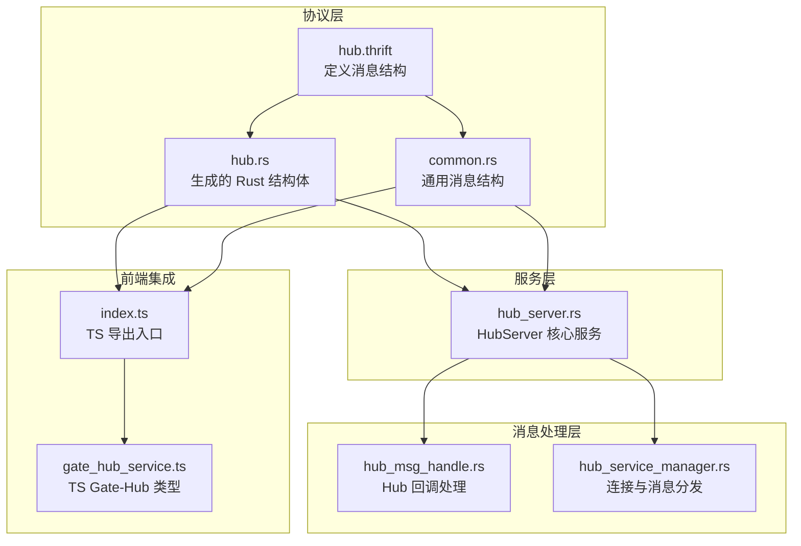
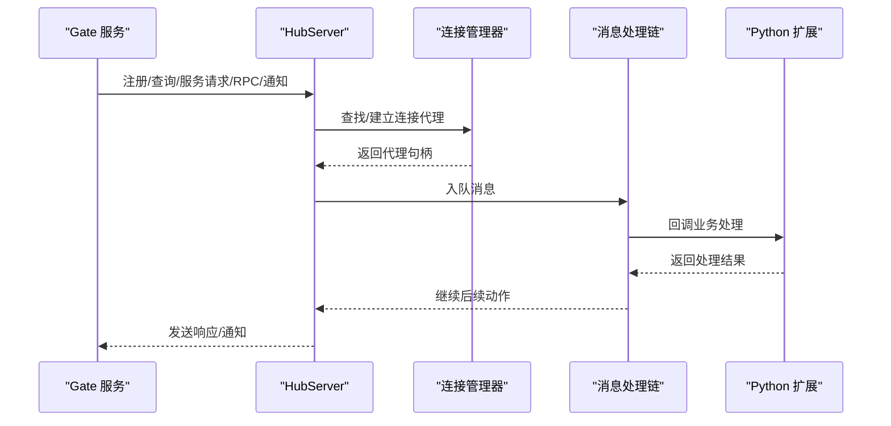
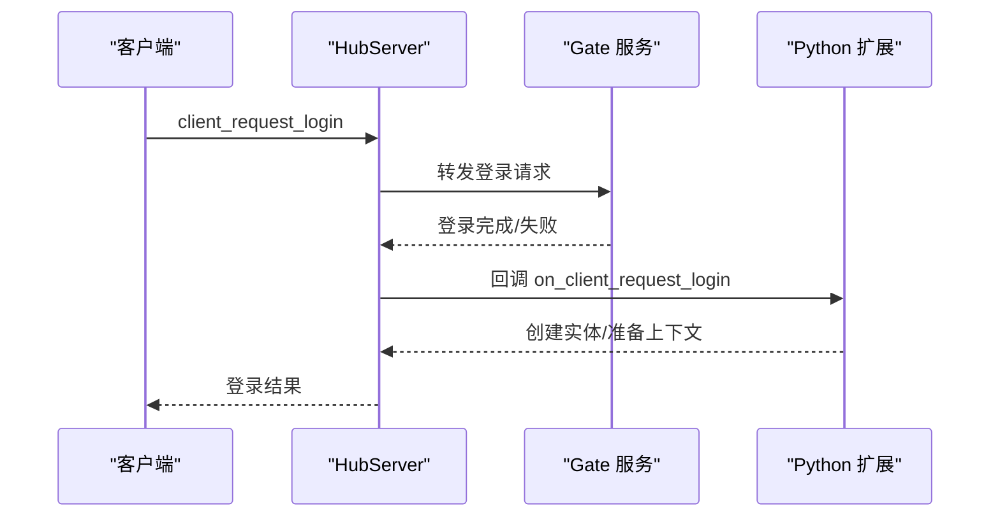
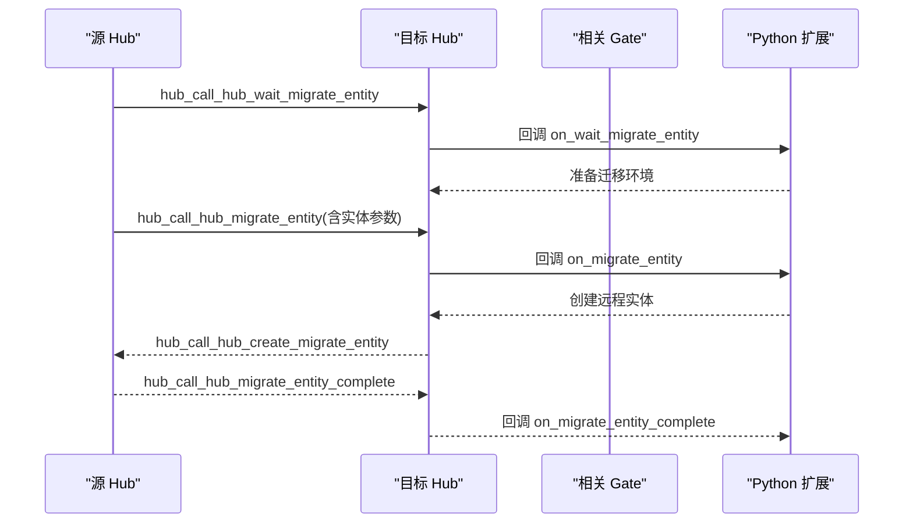
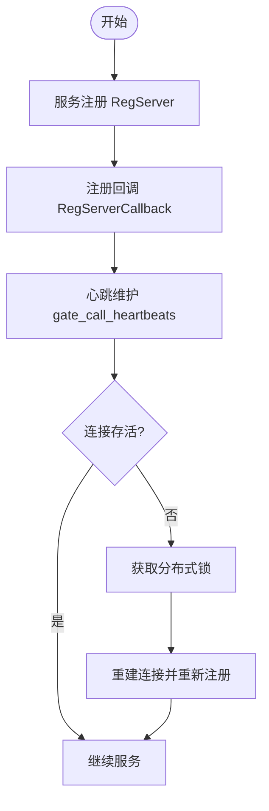
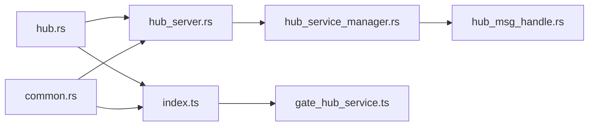

# Hub 中枢 API

<cite>
**本文档引用的文件**
- [hub.thrift](file://crates/proto/proto/hub.thrift)
- [hub.rs](file://crates/proto/src/hub.rs)
- [common.rs](file://crates/proto/src/common.rs)
- [hub_server.rs](file://server/lib/hub/src/hub_server.rs)
- [hub_msg_handle.rs](file://server/lib/hub/src/hub_msg_handle.rs)
- [hub_service_manager.rs](file://server/lib/hub/src/hub_service_manager.rs)
- [index.ts](file://expand/ts/engine/proto/index.ts)
- [gate_hub_service.ts](file://expand/ts/engine/proto/gate_hub_service.ts)
- [lib.rs](file://server/src/hub_lib.rs)
- [client.rs](file://crates/proto/src/client.rs)
- [dbproxy.rs](file://crates/proto/src/dbproxy.rs)
- [lib.rs](file://crates/log/src/lib.rs)
</cite>

## 目录
1. [简介](#简介)
2. [项目结构](#项目结构)
3. [核心组件](#核心组件)
4. [架构总览](#架构总览)
5. [详细组件分析](#详细组件分析)
6. [依赖分析](#依赖分析)
7. [性能考虑](#性能考虑)
8. [故障排查指南](#故障排查指南)
9. [结论](#结论)
10. [附录](#附录)

## 简介
本文件为 Hub 中枢服务的全面 API 参考文档，聚焦于 Hub 作为实体管理中心的核心接口规范。内容涵盖：
- 实体生命周期管理：创建、销毁、状态同步与跨服迁移
- 实体管理 API：实体注册、注销、属性更新与事件通知
- Hub 间实体迁移协议：迁移触发条件、数据传输与一致性保障
- 服务注册与发现：服务注册、心跳维护与故障检测
- 实体关系管理、权限控制与并发访问策略
- 错误码定义、异常处理与性能监控接口
- 开发者实现指南与扩展建议

## 项目结构
Hub 中枢服务由 Rust 后端与 TypeScript 前端协同组成，通过 Thrift 协议进行消息编解码与传输。核心模块包括：
- 协议层：定义 Hub 与 Gate、其他 Hub 以及客户端之间的消息类型（hub.thrift、hub.rs、common.rs）
- 服务层：HubServer 负责监听、连接管理、服务注册与消息分发（hub_server.rs）
- 消息处理层：HubCallbackMsgHandle 与 ConnCallbackMsgHandle 处理各类 Hub/Gate 消息（hub_msg_handle.rs、hub_service_manager.rs）
- 前端集成：TypeScript 侧导出所有消息类型，便于前端消费（index.ts、gate_hub_service.ts）

**图表来源**
- [hub.thrift](file://crates/proto/proto/hub.thrift)
- [hub.rs](file://crates/proto/src/hub.rs)
- [common.rs](file://crates/proto/src/common.rs)
- [hub_server.rs](file://server/lib/hub/src/hub_server.rs)
- [hub_msg_handle.rs](file://server/lib/hub/src/hub_msg_handle.rs)
- [hub_service_manager.rs](file://server/lib/hub/src/hub_service_manager.rs)
- [index.ts](file://expand/ts/engine/proto/index.ts)
- [gate_hub_service.ts](file://expand/ts/engine/proto/gate_hub_service.ts)

**章节来源**
- [hub.thrift](file://crates/proto/proto/hub.thrift)
- [hub.rs](file://crates/proto/src/hub.rs)
- [common.rs](file://crates/proto/src/common.rs)
- [hub_server.rs](file://server/lib/hub/src/hub_server.rs)
- [hub_msg_handle.rs](file://server/lib/hub/src/hub_msg_handle.rs)
- [hub_service_manager.rs](file://server/lib/hub/src/hub_service_manager.rs)
- [index.ts](file://expand/ts/engine/proto/index.ts)
- [gate_hub_service.ts](file://expand/ts/engine/proto/gate_hub_service.ts)

## 核心组件
- HubService 消息集合：统一承载 Hub 与 Gate、其他 Hub 之间的通信消息，包含登录、重连、服务请求、RPC、通知、迁移等消息类型。
- HubServer：负责监听 TCP 与 Redis MQ，维护连接管理器，注册服务并转发消息。
- 消息处理链：ConnCallbackMsgHandle 将接收到的消息入队，HubCallbackMsgHandle/GateCallbackMsgHandle 分别处理 Hub/Gate 侧业务逻辑。
- 前端类型导出：TypeScript 侧通过 index.ts 汇总导出所有消息类型，便于前端直接使用。

**章节来源**
- [hub.rs](file://crates/proto/src/hub.rs)
- [hub_server.rs](file://server/lib/hub/src/hub_server.rs)
- [hub_service_manager.rs](file://server/lib/hub/src/hub_service_manager.rs)
- [index.ts](file://expand/ts/engine/proto/index.ts)

## 架构总览
Hub 中枢服务采用“消息驱动 + 连接代理”的架构模式：
- 通过 Redis MQ 接收来自其他 Hub 或 Gate 的广播/定向消息
- 通过 TCP 监听客户端或内部服务连接
- 使用连接代理（GateProxy/HubProxy）维护与下游服务的长连接
- 通过回调处理器将消息分派到业务层（Python 扩展），实现实体生命周期与迁移等核心逻辑

**图表来源**
- [hub_server.rs](file://server/lib/hub/src/hub_server.rs)
- [hub_service_manager.rs](file://server/lib/hub/src/hub_service_manager.rs)
- [hub_msg_handle.rs](file://server/lib/hub/src/hub_msg_handle.rs)

## 详细组件分析

### 实体生命周期管理 API
- 登录与重连
  - 客户端通过 Hub 发起登录/重连请求，Hub 将消息转发至 Gate 并在成功后建立实体控制权。
  - 关键消息：client_request_login、client_request_reconnect、client_disconnnect、transfer_msg_end、transfer_entity_control。
- 实体创建与注销
  - 通过 Hub 的服务注册机制创建实体；注销时清理实体与关联资源。
  - 关键消息：create_service_entity、client_disconnnect。
- 属性更新与事件通知
  - 支持 RPC 调用与通知推送，用于属性更新与状态变更广播。
  - 关键消息：client_call_rpc、client_call_ntf、client_call_rsp、client_call_err。

**图表来源**
- [hub.rs](file://crates/proto/src/hub.rs)
- [hub_service_manager.rs](file://server/lib/hub/src/hub_service_manager.rs)
- [hub_msg_handle.rs](file://server/lib/hub/src/hub_msg_handle.rs)

**章节来源**
- [hub.rs](file://crates/proto/src/hub.rs)
- [hub_service_manager.rs](file://server/lib/hub/src/hub_service_manager.rs)
- [hub_msg_handle.rs](file://server/lib/hub/src/hub_msg_handle.rs)

### 实体迁移协议
- 触发条件
  - 主动迁移：查询目标 Hub/Gate 状态，获取迁移路径与锁资源。
  - 被动迁移：接收迁移指令后，协调源 Hub 与目标 Hub 完成实体转移。
- 数据传输
  - 迁移过程中携带实体类型、主连接标识、网关列表、Hub 列表与实体参数。
- 一致性保障
  - 使用分布式锁确保迁移期间的互斥访问；通过等待迁移与迁移完成通知保证状态一致。

**图表来源**
- [hub.rs](file://crates/proto/src/hub.rs)
- [hub_msg_handle.rs](file://server/lib/hub/src/hub_msg_handle.rs)

**章节来源**
- [hub.rs](file://crates/proto/src/hub.rs)
- [hub_msg_handle.rs](file://server/lib/hub/src/hub_msg_handle.rs)

### 服务注册与发现机制
- 服务注册
  - 通过 RegServer/RegServerCallback 在 Hub 内部完成服务注册与回调确认。
- 心跳维护
  - Gate 通过心跳消息维持连接活跃度，Hub 记录并校验心跳时间戳。
- 故障检测
  - 通过 Redis 锁与连接状态判断服务可用性，异常时释放锁并重建连接。

**图表来源**
- [common.rs](file://crates/proto/src/common.rs)
- [hub_service_manager.rs](file://server/lib/hub/src/hub_service_manager.rs)

**章节来源**
- [common.rs](file://crates/proto/src/common.rs)
- [hub_service_manager.rs](file://server/lib/hub/src/hub_service_manager.rs)

### 实体关系管理、权限控制与并发访问
- 实体关系管理
  - 通过实体 ID 与连接 ID 建立映射，支持主从实体、重连控制与迁移控制。
- 权限控制
  - 通过服务类型区分 Hub/Gate，仅允许授权服务接入；迁移过程中的锁机制防止并发冲突。
- 并发访问
  - 使用 Tokio 异步运行时与互斥锁保护共享资源；消息通过队列异步处理，避免阻塞。

**章节来源**
- [hub_service_manager.rs](file://server/lib/hub/src/hub_service_manager.rs)
- [hub_server.rs](file://server/lib/hub/src/hub_server.rs)

### 错误码定义、异常处理与性能监控
- 错误码与异常
  - RPC 错误通过 rpc_err 结构返回，包含实体 ID、回调 ID 与错误载荷。
- 异常处理
  - 消息处理链捕获反序列化与回调异常，并记录日志；必要时释放锁并断开连接。
- 性能监控
  - 集成 tracing 与可选 Jaeger OpenTelemetry，支持日志滚动与远程追踪。

**章节来源**
- [common.rs](file://crates/proto/src/common.rs)
- [hub_service_manager.rs](file://server/lib/hub/src/hub_service_manager.rs)
- [lib.rs](file://crates/log/src/lib.rs)

## 依赖分析
Hub 中枢服务的关键依赖关系如下：
- 协议依赖：hub.rs 与 common.rs 由 hub.thrift 生成，提供消息结构定义。
- 运行时依赖：Tokio 异步运行时、RedisService、ConsulImpl、CloseHandle。
- 前端依赖：TypeScript 侧通过 index.ts 导出全部消息类型，便于前端消费。

**图表来源**
- [hub.rs](file://crates/proto/src/hub.rs)
- [common.rs](file://crates/proto/src/common.rs)
- [hub_server.rs](file://server/lib/hub/src/hub_server.rs)
- [hub_service_manager.rs](file://server/lib/hub/src/hub_service_manager.rs)
- [hub_msg_handle.rs](file://server/lib/hub/src/hub_msg_handle.rs)
- [index.ts](file://expand/ts/engine/proto/index.ts)
- [gate_hub_service.ts](file://expand/ts/engine/proto/gate_hub_service.ts)

**章节来源**
- [hub.rs](file://crates/proto/src/hub.rs)
- [common.rs](file://crates/proto/src/common.rs)
- [hub_server.rs](file://server/lib/hub/src/hub_server.rs)
- [hub_service_manager.rs](file://server/lib/hub/src/hub_service_manager.rs)
- [hub_msg_handle.rs](file://server/lib/hub/src/hub_msg_handle.rs)
- [index.ts](file://expand/ts/engine/proto/index.ts)
- [gate_hub_service.ts](file://expand/ts/engine/proto/gate_hub_service.ts)

## 性能考虑
- 异步与并发
  - 使用 Tokio 异步运行时与互斥锁，避免阻塞；消息通过队列异步处理。
- 编解码优化
  - Thrift Compact 协议减少网络开销；缓冲通道提升序列化效率。
- 缓存与锁
  - Redis 缓存主机地址与分布式锁，降低重复连接与并发冲突成本。
- 日志与监控
  - 结合 tracing 与可选 Jaeger，定位性能瓶颈与异常路径。

[本节为通用指导，无需特定文件分析]

## 故障排查指南
- 常见问题
  - 连接失败：检查 Redis MQ 与 TCP 监听是否正常；确认锁获取与释放流程。
  - 消息未达：核查消息队列与回调处理链；查看日志级别与过滤配置。
  - 迁移异常：核对迁移参数与锁状态；确认 on_migrate_entity/on_migrate_entity_complete 回调执行情况。
- 排查步骤
  - 启用更详细的日志级别，观察 trace/debug/info/warn/error 输出。
  - 使用 Jaeger 远程追踪定位跨服务调用耗时。
  - 检查 Redis 键空间与锁值，确保锁正确释放。

**章节来源**
- [hub_server.rs](file://server/lib/hub/src/hub_server.rs)
- [hub_service_manager.rs](file://server/lib/hub/src/hub_service_manager.rs)
- [lib.rs](file://crates/log/src/lib.rs)

## 结论
Hub 中枢服务通过标准化的 Thrift 协议与异步消息处理机制，实现了实体生命周期管理、跨服迁移、服务注册与发现等核心能力。结合分布式锁与心跳机制，系统在高并发场景下保持一致性与稳定性。开发者可基于现有 API 扩展实体行为与迁移策略，并通过日志与监控体系持续优化性能。

[本节为总结性内容，无需特定文件分析]

## 附录

### API 定义概览（按类别）
- 登录与重连
  - client_request_login、client_request_reconnect、client_disconnnect、transfer_msg_end、transfer_entity_control
- 服务请求与转发
  - client_request_service、hub_forward_client_request_service、hub_forward_client_request_service_ext
- RPC 与通知
  - client_call_rpc、client_call_rsp、client_call_err、client_call_ntf
- Hub 间迁移
  - hub_call_hub_wait_migrate_entity、hub_call_hub_migrate_entity、hub_call_hub_create_migrate_entity、hub_call_hub_migrate_entity_complete
- 服务注册与回调
  - reg_server、reg_server_callback
- 通用消息结构
  - msg、rpc_rsp、rpc_err、redis_msg

**章节来源**
- [hub.thrift](file://crates/proto/proto/hub.thrift)
- [common.rs](file://crates/proto/src/common.rs)

### 前端类型导出清单
- TypeScript 侧通过 index.ts 导出所有消息类型，便于前端直接引用与类型安全消费。

**章节来源**
- [index.ts](file://expand/ts/engine/proto/index.ts)

### Python 扩展接口
- 通过 hub_lib.rs 暴露 HubContext、HubConnMsgPump、HubDBMsgPump，供 Python 扩展调用。

**章节来源**
- [lib.rs](file://server/src/hub_lib.rs)