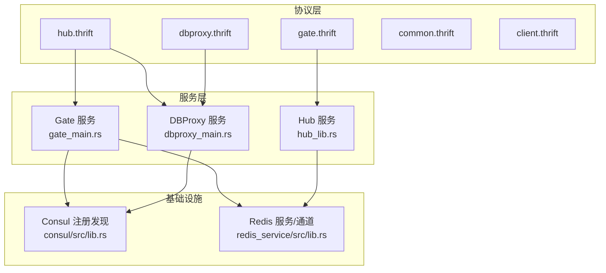
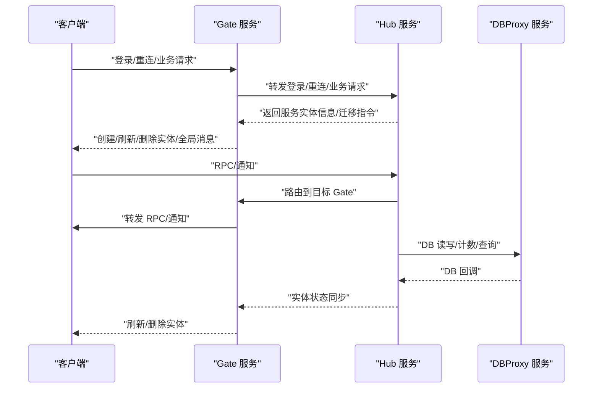
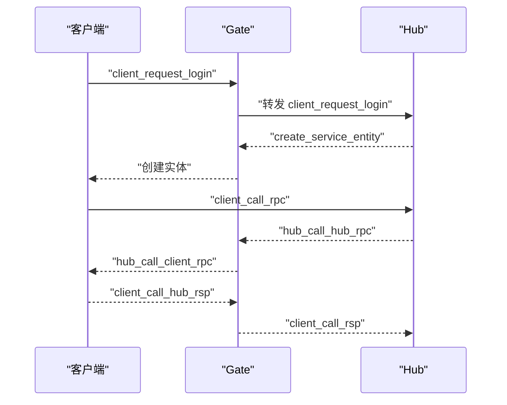
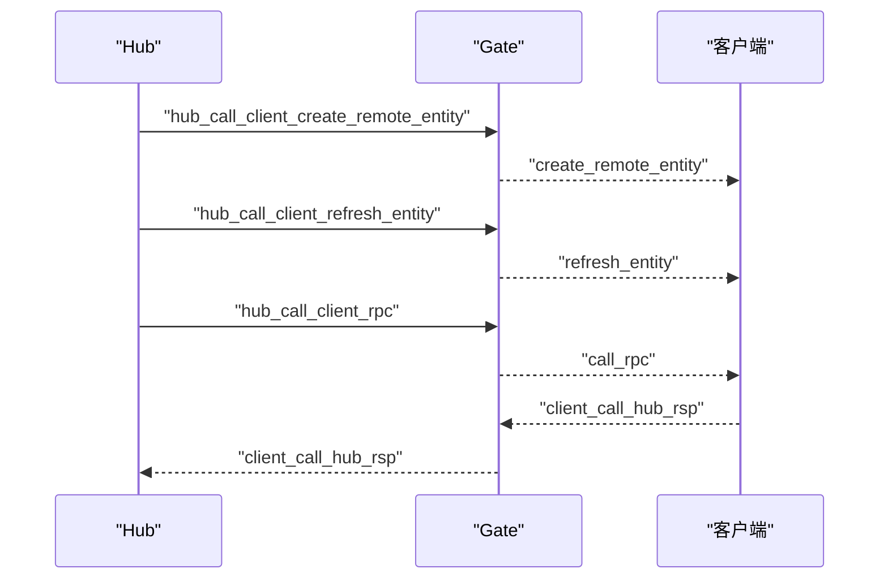
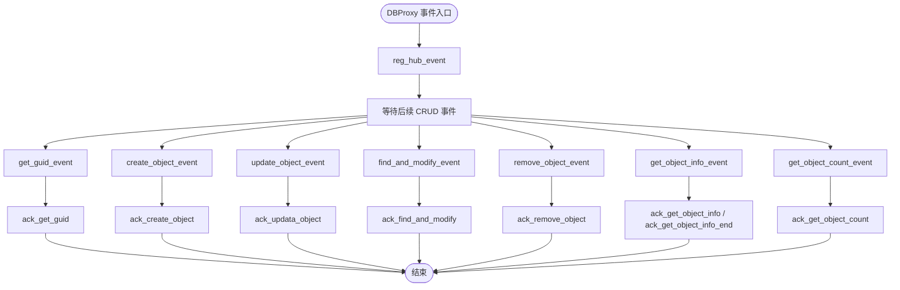
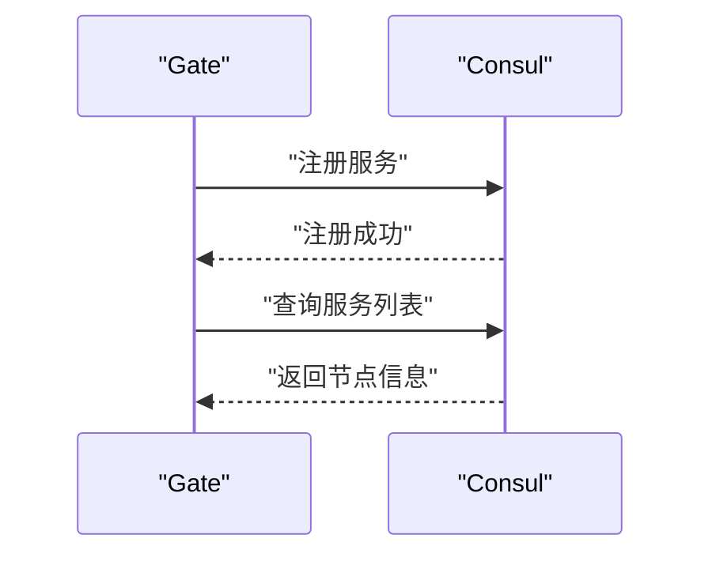
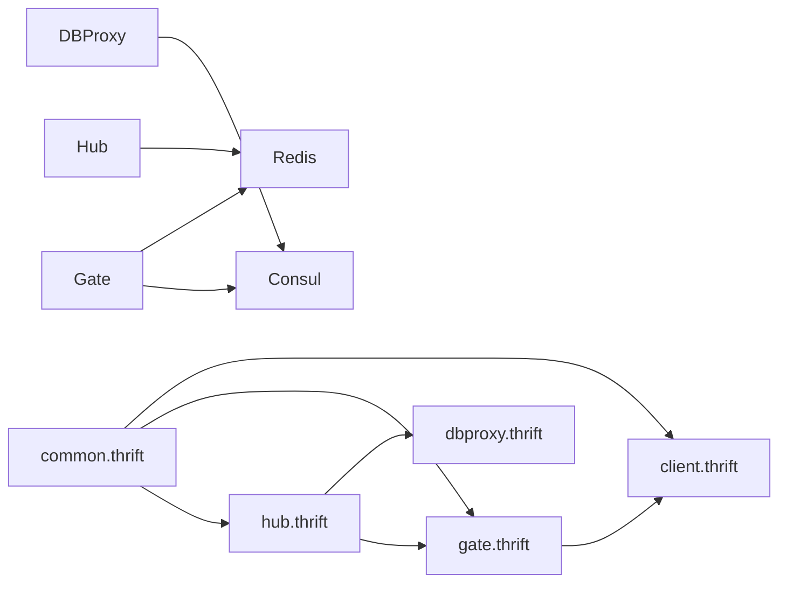

# 服务端 API

<cite>
**本文引用的文件**   
- [crates/proto/proto/hub.thrift](file://crates/proto/proto/hub.thrift)
- [crates/proto/proto/gate.thrift](file://crates/proto/proto/gate.thrift)
- [crates/proto/proto/dbproxy.thrift](file://crates/proto/proto/dbproxy.thrift)
- [crates/proto/proto/common.thrift](file://crates/proto/proto/common.thrift)
- [crates/proto/proto/client.thrift](file://crates/proto/proto/client.thrift)
- [server/src/gate_main.rs](file://server/src/gate_main.rs)
- [server/src/dbproxy_main.rs](file://server/src/dbproxy_main.rs)
- [server/src/hub_lib.rs](file://server/src/hub_lib.rs)
- [crates/consul/src/lib.rs](file://crates/consul/src/lib.rs)
- [crates/redis_service/src/lib.rs](file://crates/redis_service/src/lib.rs)
</cite>

## 目录
1. [简介](#简介)
2. [项目结构](#项目结构)
3. [核心组件](#核心组件)
4. [架构总览](#架构总览)
5. [详细组件分析](#详细组件分析)
6. [依赖关系分析](#依赖关系分析)
7. [性能考虑](#性能考虑)
8. [故障排查指南](#故障排查指南)
9. [结论](#结论)
10. [附录](#附录)

## 简介
本文件为 geese 服务端 API 的完整参考文档，覆盖 Hub、Gate、DBProxy 三大核心服务的接口规范与行为约定，涵盖实体生命周期管理、跨服迁移与状态同步、服务间通信（RPC/通知/路由）、会话与连接控制、权限与登录流程、数据库读写与事务、缓存策略、服务注册与发现以及错误处理与异常码定义。文档以 Thrift 接口定义为基础，结合 Rust 服务入口与注册发现实现，帮助服务端开发者准确理解并实现各模块。

## 项目结构
- 协议层：通过 Thrift 定义 Hub、Gate、DBProxy、Common、Client 的消息与 RPC 结构体，统一跨服务通信契约。
- 服务层：Gate、DBProxy、Hub 分别作为网关、数据库代理与中枢服务运行，提供连接接入、DB 操作与全局调度。
- 基础设施：Consul 注册发现、Redis 通道、健康检查等支撑能力。

图表来源
- [crates/proto/proto/hub.thrift:1-292](file://crates/proto/proto/hub.thrift#L1-L292)
- [crates/proto/proto/gate.thrift:1-225](file://crates/proto/proto/gate.thrift#L1-L225)
- [crates/proto/proto/dbproxy.thrift:1-72](file://crates/proto/proto/dbproxy.thrift#L1-L72)
- [crates/proto/proto/common.thrift:1-39](file://crates/proto/proto/common.thrift#L1-L39)
- [crates/proto/proto/client.thrift:1-112](file://crates/proto/proto/client.thrift#L1-L112)
- [server/src/gate_main.rs:1-117](file://server/src/gate_main.rs#L1-L117)
- [server/src/dbproxy_main.rs:1-78](file://server/src/dbproxy_main.rs#L1-L78)
- [server/src/hub_lib.rs:1-10](file://server/src/hub_lib.rs#L1-L10)
- [crates/consul/src/lib.rs:1-66](file://crates/consul/src/lib.rs#L1-L66)
- [crates/redis_service/src/lib.rs:1-3](file://crates/redis_service/src/lib.rs#L1-L3)

章节来源
- [server/src/gate_main.rs:1-117](file://server/src/gate_main.rs#L1-L117)
- [server/src/dbproxy_main.rs:1-78](file://server/src/dbproxy_main.rs#L1-L78)
- [server/src/hub_lib.rs:1-10](file://server/src/hub_lib.rs#L1-L10)
- [crates/consul/src/lib.rs:1-66](file://crates/consul/src/lib.rs#L1-L66)

## 核心组件
- Hub（中枢服务）
  - 负责全局会话与实体路由、跨服迁移协调、服务注册回调、RPC/通知分发。
  - 关键接口：客户端登录/重连请求、服务查询与创建、跨服迁移通知、RPC/RSP/ERR 回调。
- Gate（网关服务）
  - 负责客户端接入、心跳、实体创建/刷新/删除、迁移与踢人指令下发。
  - 关键接口：客户端到 Hub 的登录/重连/业务 RPC/通知；从 Hub 到客户端的实体同步与全局消息。
- DBProxy（数据库代理）
  - 负责 MongoDB/GUID 等 DB 操作的统一入口，提供 CRUD、计数、查询、原子修改等事件。
  - 关键接口：注册 Hub、获取 GUID、创建/更新/查找并修改/删除、分页查询与计数。

章节来源
- [crates/proto/proto/hub.thrift:1-292](file://crates/proto/proto/hub.thrift#L1-L292)
- [crates/proto/proto/gate.thrift:1-225](file://crates/proto/proto/gate.thrift#L1-L225)
- [crates/proto/proto/dbproxy.thrift:1-72](file://crates/proto/proto/dbproxy.thrift#L1-L72)

## 架构总览
下图展示 Hub、Gate、DBProxy 三者之间的交互关系与典型流程：登录/重连、实体生命周期、跨服迁移、DB 读写与回调。

图表来源
- [crates/proto/proto/gate.thrift:155-225](file://crates/proto/proto/gate.thrift#L155-L225)
- [crates/proto/proto/hub.thrift:1-242](file://crates/proto/proto/hub.thrift#L1-L242)
- [crates/proto/proto/dbproxy.thrift:1-72](file://crates/proto/proto/dbproxy.thrift#L1-L72)

## 详细组件分析

### Hub 服务 API 规范
- 登录与重连
  - 客户端登录：client_request_login（携带 gate_name、gate_host、conn_id、sdk_uuid、argvs）。
  - 客户端重连：client_request_reconnect（携带 account_id、argvs）。
- 服务请求与路由
  - 客户端请求服务：client_request_service（service_name、gate_name、gate_host、conn_id、argvs）。
  - 扩展批量请求：hub_forward_client_request_service_ext（多 gate 请求聚合）。
- 实体生命周期与迁移
  - 查询服务实体：query_service_entity（service_name）。
  - 创建服务实体：create_service_entity（is_migrate、service_name、entity_id、entity_type、argvs）。
  - 跨服迁移：hub_call_hub_migrate_entity（service_name、entity_id、entity_type、main_gate_name、main_conn_id、gates、hubs、argvs）。
  - 迁移完成：hub_call_hub_migrate_entity_complete、hub_call_hub_create_migrate_entity。
- RPC/通知与回调
  - 客户端到 Hub：client_call_rpc、client_call_ntf、client_call_rsp、client_call_err。
  - Hub 到 Hub：hub_call_hub_rpc、hub_call_hub_ntf、hub_call_hub_rsp、hub_call_hub_err。
- 会话与连接控制
  - 踢人：kick_off_client（conn_id）。
  - 断开：client_disconnnect（conn_id）。
  - 迁移消息结束：transfer_msg_end（conn_id、is_kick_off）。
  - 实体控制迁移：transfer_entity_control（entity_id、is_main、is_reconnect、gate_name、conn_id）。

图表来源
- [crates/proto/proto/hub.thrift:6-117](file://crates/proto/proto/hub.thrift#L6-L117)
- [crates/proto/proto/gate.thrift:155-225](file://crates/proto/proto/gate.thrift#L155-L225)

章节来源
- [crates/proto/proto/hub.thrift:1-242](file://crates/proto/proto/hub.thrift#L1-L242)

### Gate 服务 API 规范
- 客户端到 Hub
  - 登录/重连/业务：client_request_hub_login、client_request_hub_reconnect、client_request_hub_service。
  - 心跳：client_call_gate_heartbeats。
  - RPC/通知/RSP/ERR：client_call_hub_rpc、client_call_hub_ntf、client_call_hub_rsp、client_call_hub_err。
- Hub 到客户端
  - 实体管理：hub_call_client_create_remote_entity、hub_call_client_refresh_entity、hub_call_client_delete_remote_entity、hub_call_client_remove_remote_entity。
  - 全局消息：hub_call_client_global。
  - RPC/通知/RSP/ERR：hub_call_client_rpc、hub_call_client_ntf、hub_call_client_rsp、hub_call_client_err。
  - 踢人/迁移：hub_call_kick_off_client、hub_call_kick_off_client_complete、hub_call_transfer_client、hub_call_transfer_entity_complete、hub_call_wait_migrate_entity、hub_call_migrate_entity_complete。

图表来源
- [crates/proto/proto/gate.thrift:8-153](file://crates/proto/proto/gate.thrift#L8-L153)
- [crates/proto/proto/client.thrift:7-112](file://crates/proto/proto/client.thrift#L7-L112)

章节来源
- [crates/proto/proto/gate.thrift:1-225](file://crates/proto/proto/gate.thrift#L1-L225)
- [crates/proto/proto/client.thrift:1-112](file://crates/proto/proto/client.thrift#L1-L112)

### DBProxy 服务 API 规范
- 事件类型
  - 注册 Hub：reg_hub_event（hub_name）。
  - GUID 获取：get_guid_event（db、collection、callback_id）。
  - 对象创建：create_object_event（db、collection、callback_id、object_info）。
  - 更新：update_object_event（db、collection、callback_id、query_info、updata_info、_upsert）。
  - 查找并修改：find_and_modify_event（db、collection、callback_id、query_info、updata_info、_new、_upsert）。
  - 删除：remove_object_event（db、collection、callback_id、query_info）。
  - 查询列表：get_object_info_event（db、collection、callback_id、query_info、skip、limit、sort、ascending）。
  - 计数：get_object_count_event（db、collection、callback_id、query_info）。
- 回调类型（Hub -> DBProxy）
  - ack_get_guid、ack_create_object、ack_updata_object、ack_find_and_modify、ack_remove_object、ack_get_object_count、ack_get_object_info、ack_get_object_info_end。

图表来源
- [crates/proto/proto/dbproxy.thrift:1-72](file://crates/proto/proto/dbproxy.thrift#L1-L72)
- [crates/proto/proto/hub.thrift:244-292](file://crates/proto/proto/hub.thrift#L244-L292)

章节来源
- [crates/proto/proto/dbproxy.thrift:1-72](file://crates/proto/proto/dbproxy.thrift#L1-L72)
- [crates/proto/proto/hub.thrift:244-292](file://crates/proto/proto/hub.thrift#L244-L292)

### 会话管理、连接控制与权限验证
- 会话与连接
  - Gate 维护客户端连接（conn_id），支持心跳与断线检测。
  - Hub 通过 gate_name/gate_host/conn_id 将会话路由至对应 Gate。
- 权限与登录
  - 客户端登录/重连时携带 sdk_uuid/account_id 与自定义参数 argvs，由 Hub/DBProxy 验证与落库。
- 踢人与迁移
  - Hub 发起踢人/迁移，Gate 下发指令并通知客户端；迁移完成后发送完成回调。

章节来源
- [crates/proto/proto/gate.thrift:155-225](file://crates/proto/proto/gate.thrift#L155-L225)
- [crates/proto/proto/hub.thrift:6-67](file://crates/proto/proto/hub.thrift#L6-L67)

### 数据库操作接口、事务与缓存策略
- 读写接口
  - CRUD：create/update/find_and_modify/remove。
  - 查询：分页 skip/limit、排序 sort/ascending。
  - 计数：get_object_count。
- 事务与一致性
  - 使用 MongoDB 原子操作（如 upsert/new）保证一致性。
- 缓存策略
  - 可在应用层对热点数据进行缓存，结合 Redis 通道进行广播或订阅（见基础设施）。

章节来源
- [crates/proto/proto/dbproxy.thrift:1-72](file://crates/proto/proto/dbproxy.thrift#L1-L72)

### 服务注册与发现 API
- 注册
  - Gate/DBProxy 启动后向 Consul 注册服务，包含健康检查 HTTP 地址与端口。
- 发现
  - 通过 Consul 查询服务节点列表，用于路由与负载均衡。

图表来源
- [server/src/gate_main.rs:68-86](file://server/src/gate_main.rs#L68-L86)
- [server/src/dbproxy_main.rs:52-68](file://server/src/dbproxy_main.rs#L52-L68)
- [crates/consul/src/lib.rs:30-65](file://crates/consul/src/lib.rs#L30-L65)

章节来源
- [server/src/gate_main.rs:1-117](file://server/src/gate_main.rs#L1-L117)
- [server/src/dbproxy_main.rs:1-78](file://server/src/dbproxy_main.rs#L1-L78)
- [crates/consul/src/lib.rs:1-66](file://crates/consul/src/lib.rs#L1-L66)

### 错误处理机制与异常码定义
- RPC 错误
  - hub_call_hub_err、client_call_err、client_call_hub_err、rpc_err 结构体包含 entity_id、msg_cb_id、argvs，用于定位调用方与上下文。
- 回调错误
  - DBProxy 回调中使用 ack_* 结构体的 result 或 object_info 字段表达失败或结果。
- 建议
  - 在 Hub/Gate 层对 RPC 错误进行统一包装，透传错误码与提示信息；在 Gate 层对网络异常与超时进行重试与降级。

章节来源
- [crates/proto/proto/common.thrift:13-17](file://crates/proto/proto/common.thrift#L13-L17)
- [crates/proto/proto/hub.thrift:164-169](file://crates/proto/proto/hub.thrift#L164-L169)
- [crates/proto/proto/gate.thrift:63-68](file://crates/proto/proto/gate.thrift#L63-L68)

## 依赖关系分析
- 协议依赖
  - hub.thrift/gate.thrift/client.thrift 引用 common.thrift 的通用消息与 RPC 结构。
- 服务耦合
  - Gate 依赖 Hub 进行实体路由与迁移；DBProxy 依赖 Hub 的回调；Hub 依赖 DBProxy 的数据读写。
- 外部依赖
  - Consul 提供服务注册与发现；Redis 用于消息通道与缓存。

图表来源
- [crates/proto/proto/common.thrift:1-39](file://crates/proto/proto/common.thrift#L1-L39)
- [crates/proto/proto/hub.thrift:1-292](file://crates/proto/proto/hub.thrift#L1-L292)
- [crates/proto/proto/gate.thrift:1-225](file://crates/proto/proto/gate.thrift#L1-L225)
- [crates/proto/proto/dbproxy.thrift:1-72](file://crates/proto/proto/dbproxy.thrift#L1-L72)
- [crates/proto/proto/client.thrift:1-112](file://crates/proto/proto/client.thrift#L1-L112)

章节来源
- [crates/proto/proto/common.thrift:1-39](file://crates/proto/proto/common.thrift#L1-L39)
- [crates/consul/src/lib.rs:1-66](file://crates/consul/src/lib.rs#L1-L66)
- [crates/redis_service/src/lib.rs:1-3](file://crates/redis_service/src/lib.rs#L1-L3)

## 性能考虑
- 连接与心跳
  - Gate 应设置合理的心跳间隔与超时阈值，避免误判断线。
- 路由与负载均衡
  - 通过 Consul 服务发现选择可用 Gate/Hub 节点，结合权重与健康状态进行动态选择。
- DB 读写
  - 对高频查询使用索引与分页；对写入使用批量提交与 upsert 减少往返。
- 缓存
  - 对热点实体与配置使用本地缓存，并通过 Redis 广播失效。

## 故障排查指南
- 服务不可达
  - 检查 Consul 注册状态与健康检查 HTTP 地址是否可达。
- 连接异常
  - 核对 Gate 的 client_tcp_port/client_ws_port/client_wss_cfg 配置与防火墙策略。
- DB 读写失败
  - 检查 DBProxy 的 mongo_url 与集合权限；确认回调中的 callback_id 是否匹配。
- 迁移问题
  - 关注 Hub/Gate 的迁移回调链路，确保迁移完成后再释放旧资源。

章节来源
- [server/src/gate_main.rs:68-86](file://server/src/gate_main.rs#L68-L86)
- [server/src/dbproxy_main.rs:52-68](file://server/src/dbproxy_main.rs#L52-L68)

## 结论
本文档基于 Thrift 协议与服务入口实现，系统性梳理了 Hub、Gate、DBProxy 的接口规范与交互流程，明确了实体生命周期、跨服迁移、DB 读写、注册发现与错误处理的关键点。建议在实际实现中严格遵循接口契约，结合健康检查与监控体系保障线上稳定性。

## 附录
- 关键字段说明
  - entity_id：实体唯一标识。
  - conn_id：客户端连接标识。
  - msg_cb_id：消息回调 ID，用于匹配请求与响应。
  - argvs：二进制参数，承载具体业务数据。
- 建议的实现顺序
  - 先完成协议解析与路由，再实现 DB 代理与迁移逻辑，最后完善注册发现与监控。