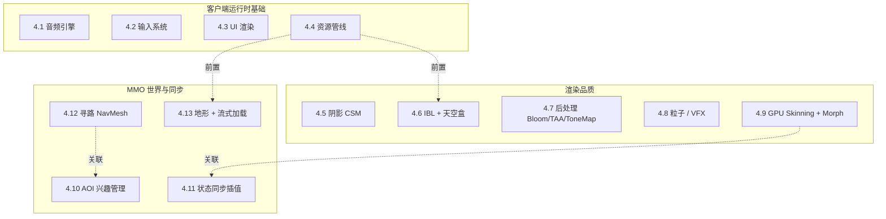
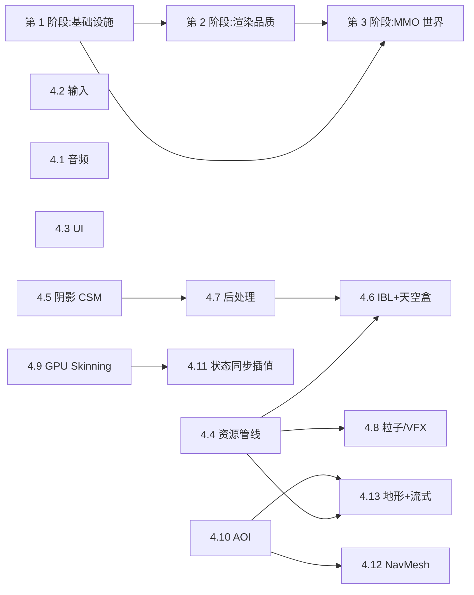

# 功能模块缺口规划

<cite>
**本文引用的文件**
- [crates/asset/src/lib.rs](file://crates/asset/src/lib.rs)
- [crates/avatar/src/lib.rs](file://crates/avatar/src/lib.rs)
- [crates/avatar/src/animation.rs](file://crates/avatar/src/animation.rs)
- [crates/avatar/src/animation_graph.rs](file://crates/avatar/src/animation_graph.rs)
- [crates/camera/src/lib.rs](file://crates/camera/src/lib.rs)
- [crates/camera/src/frustum.rs](file://crates/camera/src/frustum.rs)
- [crates/math/src/lib.rs](file://crates/math/src/lib.rs)
- [crates/net/src/lib.rs](file://crates/net/src/lib.rs)
- [crates/physics/src/lib.rs](file://crates/physics/src/lib.rs)
- [crates/physics/src/scene.rs](file://crates/physics/src/scene.rs)
- [crates/proto/src/lib.rs](file://crates/proto/src/lib.rs)
- [crates/render/src/lib.rs](file://crates/render/src/lib.rs)
- [crates/render/src/cluster.rs](file://crates/render/src/cluster.rs)
- [crates/render/src/common.rs](file://crates/render/src/common.rs)
- [crates/render/src/deferred_plus.rs](file://crates/render/src/deferred_plus.rs)
- [crates/render/src/forward_plus.rs](file://crates/render/src/forward_plus.rs)
- [crates/render/src/light.rs](file://crates/render/src/light.rs)
- [crates/render/src/material.rs](file://crates/render/src/material.rs)
- [crates/render/src/mesh.rs](file://crates/render/src/mesh.rs)
- [crates/render/src/pipeline.rs](file://crates/render/src/pipeline.rs)
- [crates/render/src/scene.rs](file://crates/render/src/scene.rs)
- [crates/render/src/wgpu_renderer.rs](file://crates/render/src/wgpu_renderer.rs)
- [crates/scene/src/lib.rs](file://crates/scene/src/lib.rs)
- [crates/scene/src/scene.rs](file://crates/scene/src/scene.rs)
- [crates/scene/src/octree.rs](file://crates/scene/src/octree.rs)
- [crates/scene/src/material.rs](file://crates/scene/src/material.rs)
- [crates/scene/src/scene_object.rs](file://crates/scene/src/scene_object.rs)
- [crates/tcp/src/lib.rs](file://crates/tcp/src/lib.rs)
- [crates/wss/src/lib.rs](file://crates/wss/src/lib.rs)
- [client/engine/__init__.py](file://client/engine/__init__.py)
- [client/engine/app.py](file://client/engine/app.py)
- [client/engine/scene.py](file://client/engine/scene.py)
- [client/engine/camera.py](file://client/engine/camera.py)
- [client/lib/client/Cargo.toml](file://client/lib/client/Cargo.toml)
- [client/lib/client/src/lib.rs](file://client/lib/client/src/lib.rs)
- [client/lib/client/src/py/mod.rs](file://client/lib/client/src/py/mod.rs)
- [server/engine/app.py](file://server/engine/app.py)
- [server/engine/entity.py](file://server/engine/entity.py)
- [server/engine/group.py](file://server/engine/group.py)
- [server/engine/physics.py](file://server/engine/physics.py)
- [server/engine/physics_component.py](file://server/engine/physics_component.py)
- [server/src/hub_lib.rs](file://server/src/hub_lib.rs)
- [.qoder/repowiki/zh/content/项目概述.md](file://.qoder/repowiki/zh/content/项目概述.md)
- [.qoder/repowiki/zh/content/客户端 SDK/客户端 SDK.md](file://.qoder/repowiki/zh/content/客户端 SDK/客户端 SDK.md)
- [.qoder/repowiki/zh/content/客户端 SDK/Rust 客户端.md](file://.qoder/repowiki/zh/content/客户端 SDK/Rust 客户端.md)
- [.qoder/repowiki/zh/content/客户端 SDK/Python 客户端.md](file://.qoder/repowiki/zh/content/客户端 SDK/Python 客户端.md)
</cite>

## 目录
1. [引言](#引言)
2. [现状一览](#现状一览)
3. [缺口分类总览](#缺口分类总览)
4. [各模块详细规划](#各模块详细规划)
5. [优先级与里程碑总览](#优先级与里程碑总览)
6. [文档边界与排除项](#文档边界与排除项)
7. [参考来源](#参考来源)

## 引言

geese 已经具备一套相对完整的"分布式服务端 + 客户端运行时 + wgpu 渲染 + glTF 场景 + rapier 物理 + behavior3 行为树"基础底座。但要支撑两个目标——**MMO 大世界多人**与**高品质单机渲染 demo**——仍有 13 项关键模块缺口需要补齐。

本文不覆盖部署运维、防作弊、支付、账号 OAuth、回放、回滚网络、编辑器套件等"周边/上线"类话题，专注于**引擎核心能力**的缺口梳理与里程碑规划，作为后续逐项落地的导航。

## 现状一览

geese 当前已经落地的核心能力如下表：

| 域 | 能力 | 落地位置 |
| --- | --- | --- |
| 服务端骨架 | Gate 网关 / Hub 中枢 / DBProxy 数据代理 | [server/src/hub_lib.rs](file://server/src/hub_lib.rs) [server/engine/app.py](file://server/engine/app.py) |
| 协议契约 | Thrift（gate / hub / dbproxy / client / common） | [crates/proto/src/lib.rs](file://crates/proto/src/lib.rs) |
| 网络底座 | TCP / WSS / NetReader-Writer / NetPack | [crates/tcp/src/lib.rs](file://crates/tcp/src/lib.rs) [crates/wss/src/lib.rs](file://crates/wss/src/lib.rs) [crates/net/src/lib.rs](file://crates/net/src/lib.rs) |
| 实体系统 | entity / subentity / player / group | [server/engine/entity.py](file://server/engine/entity.py) [server/engine/group.py](file://server/engine/group.py) |
| 数据存储 | Mongo / Redis / DBProxy / 排行 / 存档 | [server/engine](file://server/engine) |
| 服务发现 | Consul / health 注册与健康检查 | [crates/consul](file://crates/consul) [crates/health](file://crates/health) |
| 日志与追踪 | tracing / jaeger | [crates/log](file://crates/log) |
| 物理（服务端） | rapier3d 多场景刚体/碰撞 | [crates/physics/src/lib.rs](file://crates/physics/src/lib.rs) [server/engine/physics.py](file://server/engine/physics.py) |
| 渲染管线 | wgpu Forward+ / Deferred+ / Cluster Shading | [crates/render/src/lib.rs](file://crates/render/src/lib.rs) [crates/render/src/forward_plus.rs](file://crates/render/src/forward_plus.rs) [crates/render/src/deferred_plus.rs](file://crates/render/src/deferred_plus.rs) [crates/render/src/cluster.rs](file://crates/render/src/cluster.rs) |
| 场景 | glTF 导入 / 八叉树 / 视锥剔除 / 动画推进 | [crates/scene/src/lib.rs](file://crates/scene/src/lib.rs) [crates/scene/src/octree.rs](file://crates/scene/src/octree.rs) |
| 相机 | Frustum / Plane / View×Projection 构造 | [crates/camera/src/frustum.rs](file://crates/camera/src/frustum.rs) |
| 动画 | AnimationPlayer / AnimationGraph / Skin | [crates/avatar/src/animation.rs](file://crates/avatar/src/animation.rs) [crates/avatar/src/animation_graph.rs](file://crates/avatar/src/animation_graph.rs) |
| 客户端运行时 | pyclient cdylib + Python 引擎 | [client/lib/client/src/lib.rs](file://client/lib/client/src/lib.rs) [client/engine/app.py](file://client/engine/app.py) |
| 行为树 | behavior3py + behavior3editor | [external/behavior3py](file://external/behavior3py) [tools/behavior3editor](file://tools/behavior3editor) |

> 详细架构与跨语言协作请参考 [项目概述.md](file://.qoder/repowiki/zh/content/项目概述.md)、[客户端 SDK.md](file://.qoder/repowiki/zh/content/客户端 SDK/客户端 SDK.md)。

## 缺口分类总览

按照"客户端运行时基础 / 渲染品质 / MMO 世界与同步"三大类，共 13 项缺口：

三类缺口之间的核心依赖关系：
- **资源管线（4.4）** 是 IBL（4.6 立方体贴图）与 地形流式加载（4.13）的硬前置。
- **GPU Skinning（4.9）** 与 状态同步插值（4.11） 协同，决定多人场景下角色动画的网络表现。
- **NavMesh（4.12）** 与 AOI（4.10） 在服务端 AI 路径与广播范围两个维度上耦合。

## 各模块详细规划

每节统一模板：**现状 / 目标 / 选型建议 / 影响面（crate / 文件 / Python / TS）/ 里程碑**。

### 4.1 音频引擎

- **现状**：仓库内零音频实现，[client/engine/__init__.py](file://client/engine/__init__.py) 没有导出音频模块，[crates](file://crates) 下也没有 audio crate。
- **目标**：
  - BGM 播放/停止/淡入淡出/循环。
  - SFX 一次性播放，支持优先级与最大并发数。
  - 3D 空间音频：距离衰减、Doppler、左右声道 panning。
  - 进阶：遮挡（Occlusion）、混响（Reverb）、submix bus。
- **选型建议**：
  - 底层：[`cpal`](https://crates.io/crates/cpal) 跨平台音频输出。
  - 解码与混音：[`rodio`](https://crates.io/crates/rodio)（轻量、API 友好）作为 M1 选型；3D 空间音频升级到 [`oddio`](https://crates.io/crates/oddio) 或自研基于 HRTF 的混音器。
  - 通过 pyo3 暴露给 Python：`AudioEngine` / `Sound` / `Listener` / `Emitter`。
- **影响面**：
  - 新建 [crates/audio](file://crates/audio)（不存在，需新建）：`src/lib.rs` / `src/engine.rs` / `src/spatial.rs`。
  - 新建 [client/lib/client/src/py/audio.rs](file://client/lib/client/src/py/audio.rs)：PyAudioEngine / PySound / PyListener / PyEmitter，按既有"集中化"模式注册到 [client/lib/client/src/py/mod.rs](file://client/lib/client/src/py/mod.rs) 的 `add_to_module`。
  - 新建 [client/engine/audio.py](file://client/engine/audio.py)：Python 侧的高层封装与生命周期管理。
- **里程碑**：
  - **M1**：BGM 播放/停止/音量；SFX 一次性触发。
  - **M2**：3D 空间音频，距离衰减 + 立体声 panning；Listener 跟随 Camera。
  - **M3**：遮挡/混响/submix bus；与场景几何（射线）联动做声音遮挡。

### 4.2 输入系统

- **现状**：[client/engine](file://client/engine) 内目前只有 app/context/player/scene/camera 等，**没有键鼠/手柄/触屏抽象**。Rust 侧也没有 input crate。
- **目标**：
  - 统一事件队列：键盘 / 鼠标 / 鼠标滚轮 / 鼠标移动 / 手柄按键与轴 / 触屏多指。
  - **ActionMap**：把物理输入映射到逻辑动作（"前进"、"开火"、"跳跃"），支持多套 binding 与运行时切换。
  - 死区（dead zone）/ 灵敏度 / 反向 / 长按 / 双击。
- **选型建议**：
  - 桌面事件源：`winit` 0.30+（与 wgpu 同源）。
  - 手柄：[`gilrs`](https://crates.io/crates/gilrs)。
  - 触屏：复用 winit Touch 事件；移动端走原生平台桥接。
  - ActionMap：自研，配置存 ron/json，支持热重载。
- **影响面**：
  - 新建 [crates/input](file://crates/input)：`src/lib.rs` / `src/event.rs` / `src/action_map.rs` / `src/gamepad.rs`。
  - 新建 [client/lib/client/src/py/input.rs](file://client/lib/client/src/py/input.rs)：PyInputState / PyActionMap / PyKey / PyMouseButton。
  - 新建 [client/engine/input.py](file://client/engine/input.py)。
  - 与渲染窗口循环（winit event loop）需要在 client cdylib 主循环中协同。
- **里程碑**：
  - **M1**：键鼠原始事件 + 帧 InputState 查询接口（is_pressed / just_pressed / just_released）。
  - **M2**：ActionMap + 配置文件加载与热重载。
  - **M3**：手柄 + 触屏 + 死区/灵敏度/双击。

### 4.3 UI 渲染

- **现状**：HUD / 菜单 / 聊天框 / 设置面板没有任何承载；render 内仅有 3D 场景管线（forward+ / deferred+），无 UI pass。
- **目标**：
  - **即时模式 UI**（开发期调试用）：FPS、Profile、场景树、参数 tweak。
  - **保留模式 UI**（业务用）：HUD、按钮、列表、对话框、聊天框；事件驱动；i18n 友好。
  - 字体回退（CJK + Emoji）。
- **选型建议**：
  - 即时 UI：[`egui`](https://crates.io/crates/egui) + `egui-wgpu` + `egui-winit`（开箱即用）。
  - 保留 UI：M1 复用 egui 的 widget 系统；M2 评估 [`iced`](https://crates.io/crates/iced) 或自研基于 wgpu 的 retained UI（DOM 树 + flexbox 布局 + 事件冒泡）。
  - 字体：`fontdue` 或 `cosmic-text`（含 CJK shaping + emoji）。
- **影响面**：
  - 扩展 [crates/render/src/pipeline.rs](file://crates/render/src/pipeline.rs)：新增 UI pass，3D 之后 / 后处理之前。
  - 新建 [crates/ui](file://crates/ui)（保留模式）：`src/widget.rs` / `src/layout.rs` / `src/event.rs`；M1 阶段可暂不建，仅依赖 egui。
  - 新建 [client/lib/client/src/py/ui.rs](file://client/lib/client/src/py/ui.rs)：PyDebugUi / PyHud。
  - 新建 [client/engine/ui.py](file://client/engine/ui.py)。
- **里程碑**：
  - **M1**：egui 调试 UI（FPS / 场景树 / 参数面板）打通。
  - **M2**：retained UI 框架 + HUD demo + 事件分发。
  - **M3**：CJK 字体 + i18n 文案管线 + 主题/换肤。

### 4.4 资源管线

- **现状**：[crates/asset/src/lib.rs](file://crates/asset/src/lib.rs) 仅封装了 glTF 文件加载（依赖 [crates/scene/src/lib.rs](file://crates/scene/src/lib.rs) 中的 `import_scene`），**无纹理压缩、无 mesh 压缩、无包格式、无热重载、无引用计数**。这是大量后续模块（IBL / 地形 / UI / VFX）的硬前置。
- **目标**：
  - 统一资源管理器：纹理 / mesh / 材质 / 音频 / 动画 / shader 都走同一套 Handle + 引用计数。
  - 纹理压缩：KTX2 容器 + Basis Universal 解码（运行时按 GPU 能力转 BC7 / ASTC / ETC2）。
  - Mesh 压缩：meshopt（vertex cache / overdraw / fetch 优化）+ 量化。
  - 资产打包：自研 manifest（CRC + 偏移）+ pack 格式；支持 mmap。
  - 热重载：监听文件变更（`notify` crate），增量重建 GPU 资源。
  - 异步加载：tokio 任务 + 主线程上传队列。
- **选型建议**：
  - KTX2 / Basis：[`ktx2`](https://crates.io/crates/ktx2) + [`basis-universal`](https://crates.io/crates/basis-universal)。
  - meshopt：[`meshopt`](https://crates.io/crates/meshopt) Rust 绑定。
  - 文件监听：[`notify`](https://crates.io/crates/notify)。
  - 序列化 manifest：`bincode` + `serde`。
- **影响面**：
  - 扩展 [crates/asset/src/lib.rs](file://crates/asset/src/lib.rs)：新增 `AssetManager` / `AssetHandle<T>` / `AssetLoader` trait；保留现有 glTF 加载兼容入口。
  - 新建 [crates/asset/src/ktx2.rs](file://crates/asset/src/ktx2.rs) / [crates/asset/src/meshopt.rs](file://crates/asset/src/meshopt.rs) / [crates/asset/src/pack.rs](file://crates/asset/src/pack.rs) / [crates/asset/src/hot_reload.rs](file://crates/asset/src/hot_reload.rs)。
  - 配合 [crates/scene/src/lib.rs](file://crates/scene/src/lib.rs)：mesh / texture 加载走 AssetHandle。
  - 配合 [crates/render/src/material.rs](file://crates/render/src/material.rs)：Texture / Sampler 接受 AssetHandle 形式。
  - 新增 tools/asset_packer：CLI 把源资产打成 .geesepack。
- **里程碑**：
  - **M1**：KTX2 纹理加载 + GPU 上传；AssetManager + 引用计数；保持现 glTF 入口可用。
  - **M2**：meshopt 离线优化 + 运行时验证；AssetBundle pack 格式落地。
  - **M3**：热重载（纹理 / 材质 / shader / glTF）+ 异步流式加载队列。

### 4.5 阴影 CSM

- **现状**：[crates/render/src/light.rs](file://crates/render/src/light.rs) 已有 LightStorage 与 cluster shading，但**没有 shadow pass、没有深度贴图采样**。整个项目目前是无阴影渲染。
- **目标**：
  - **方向光**：4 级 Cascaded Shadow Map（CSM），split 策略 logarithmic + uniform 混合。
  - **点光源**：cube shadow（6 面深度）+ 距离衰减阴影。
  - 软阴影：M1 PCF 3x3；M2 PCSS 自适应核。
  - 阴影偏移（bias / slope-scaled bias）+ 接触阴影（contact shadow）防漏光。
- **选型建议**：自研，参考 Unity HDRP / Frostbite GDC 公开方案。
- **影响面**：
  - 扩展 [crates/render/src/light.rs](file://crates/render/src/light.rs)：增加 ShadowMap / ShadowAtlas 抽象。
  - 扩展 [crates/render/src/deferred_plus.rs](file://crates/render/src/deferred_plus.rs) 与 [crates/render/src/forward_plus.rs](file://crates/render/src/forward_plus.rs)：在 lighting pass 中采样阴影图。
  - 扩展 [crates/render/shaders](file://crates/render/shaders)：新增 `shadow_directional.wgsl` / `shadow_point.wgsl` / `shadow_sample.wgsl`。
  - 扩展 [crates/render/src/pipeline.rs](file://crates/render/src/pipeline.rs)：在主 pass 之前安排 shadow pass 列表。
- **里程碑**：
  - **M1**：单方向光 4 级 CSM + 硬阴影 + 基础 bias。
  - **M2**：PCF 3x3 + slope-scaled bias + 接触阴影。
  - **M3**：点光源 cube shadow + PCSS 软阴影 + atlas 共享。

### 4.6 IBL + 天空盒

- **现状**：缺失。当前 PBR 仅有直接光，**没有环境光照**，金属材质看上去会发黑。
- **目标**：
  - HDR 立方体贴图天空盒（带 Mip）。
  - **Diffuse IBL**：Irradiance Map（球谐 SH9 或低分辨率 Cubemap）。
  - **Specular IBL**：Prefiltered Environment Map（按粗糙度分 mip）+ Split-Sum BRDF LUT。
  - 多探针支持（局部反射）：M3 阶段。
- **选型建议**：
  - 离线烘焙：CLI 工具读 `.hdr` / `.exr` 生成 KTX2 立方体贴图（含 Mip）+ BRDF LUT；运行时直接读取，避免启动延迟。
  - 运行时降级：低端机用 SH9 表示 diffuse、低分 prefiltered cube 表示 specular。
- **影响面**：
  - 依赖 4.4 资源管线（KTX2 加载）。
  - 扩展 [crates/render/src/light.rs](file://crates/render/src/light.rs)：新增 `EnvironmentLight` / `IblTextures`。
  - 新增 [crates/render/src/sky.rs](file://crates/render/src/sky.rs) + 对应 wgsl shader：天空盒 pass。
  - 扩展 [crates/render/src/material.rs](file://crates/render/src/material.rs)：BRDF LUT + 环境贴图采样。
  - 新建 tools/ibl_baker：CLI 工具。
- **里程碑**：
  - **M1**：HDR 天空盒渲染（无 IBL）。
  - **M2**：Diffuse IBL（SH9 / Irradiance Cubemap）。
  - **M3**：Specular IBL Prefiltered + Split-Sum BRDF LUT；多探针。

### 4.7 后处理（Bloom / TAA / Tone Mapping）

- **现状**：[crates/render/src/pipeline.rs](file://crates/render/src/pipeline.rs) 输出为 LDR；**无 HDR 中间缓冲、无 tone mapping、无抗锯齿、无 bloom**。
- **目标**：
  - 全管线走 HDR（rgba16f）中间缓冲。
  - **Tone Mapping**：ACES Filmic（默认）+ Reinhard（备选）+ 用户曲线 LUT。
  - **Bloom**：down-up sampling（13-tap Karis filter，参考 Call of Duty 公开方案）。
  - **抗锯齿**：M1 FXAA（廉价）；M2 TAA（需要 motion vector）。
  - **Gamma 校正**：sRGB swapchain + 颜色空间统一。
- **选型建议**：自研 compute / fragment 后处理链；TAA 需要 G-Buffer 输出 motion vector（与 4.5 阴影共享 GBuffer 改造）。
- **影响面**：
  - 扩展 [crates/render/src/pipeline.rs](file://crates/render/src/pipeline.rs)：HDR 中间缓冲 + 后处理链编排。
  - 新建 [crates/render/src/post_process.rs](file://crates/render/src/post_process.rs)：每个效果一个 pass。
  - 扩展 [crates/render/shaders](file://crates/render/shaders)：`bloom_downsample.wgsl` / `bloom_upsample.wgsl` / `tone_mapping.wgsl` / `taa.wgsl` / `fxaa.wgsl`。
  - 扩展 [crates/render/src/forward_plus.rs](file://crates/render/src/forward_plus.rs) / [crates/render/src/deferred_plus.rs](file://crates/render/src/deferred_plus.rs)：输出 motion vector。
- **里程碑**：
  - **M1**：HDR 中间缓冲 + ACES Tone Mapping + sRGB 校正 + FXAA。
  - **M2**：Bloom（Karis 13-tap）。
  - **M3**：TAA（含 motion vector + history buffer）。

### 4.8 粒子 / VFX

- **现状**：缺失。
- **目标**：
  - **CPU 发射 + GPU 模拟** 的粒子系统：billboard、网格粒子、轨迹（trail）、命中特效。
  - 数据驱动：粒子模板（emitter / module / renderer）保存为 ron / json，可在编辑器中可视化调参。
  - 与渲染管线集成：透明粒子排序、与深度合成（soft particle）、bloom 反馈。
- **选型建议**：
  - 自研基于 compute shader 的 GPU 粒子系统（参考 Unity VFX Graph）。
  - 模拟：compute pass 更新位置 / 速度 / 生命；渲染：indirect draw + billboard。
- **影响面**：
  - 新建 [crates/vfx](file://crates/vfx)：`src/lib.rs` / `src/emitter.rs` / `src/module.rs` / `src/renderer.rs`。
  - 扩展 [crates/render](file://crates/render)：新增 transparent + particle pass，安排在 tone mapping 之前。
  - 与 4.4 资源管线协同：粒子贴图、轨迹贴图走 AssetHandle。
- **里程碑**：
  - **M1**：CPU 粒子 billboard + 简单 module（速度 / 重力 / 颜色随生命）。
  - **M2**：GPU 粒子 compute 模拟 + indirect draw + soft particle 深度合成。
  - **M3**：网格粒子 + 轨迹 trail + 数据驱动模板编辑器导出。

### 4.9 GPU Skinning + Morph Target

- **现状**：[crates/avatar/src/animation.rs](file://crates/avatar/src/animation.rs) 与 [crates/avatar/src/animation_graph.rs](file://crates/avatar/src/animation_graph.rs) 已有骨骼动画与状态机；[crates/render/src/common.rs](file://crates/render/src/common.rs) 中 `MAX_JOINTS` 已预留 uniform 槽，但**蒙皮当前在 CPU 完成**（每帧把骨骼变换乘到顶点），网格蒙皮无法做大批量。Morph Target 完全未支持。
- **目标**：
  - GPU skin：joint matrices 走 SSBO（或 uniform），vertex shader 中用 4 weights 做线性蒙皮。
  - 大型骨架（>128 关节）：dual quaternion skinning 备选。
  - Morph Target：表情 blend shape，动态权重，可与骨骼动画叠加。
- **选型建议**：自研，shader 内做骨骼变换；morph 数据走顶点流。
- **影响面**：
  - 扩展 [crates/render/src/common.rs](file://crates/render/src/common.rs)：SSBO 布局 / `MAX_JOINTS` 调整 / `MAX_MORPHS` 新增。
  - 扩展 [crates/render/src/forward_plus.rs](file://crates/render/src/forward_plus.rs) / [crates/render/src/deferred_plus.rs](file://crates/render/src/deferred_plus.rs)：bind group 增加 joint buffer。
  - 扩展 [crates/render/shaders](file://crates/render/shaders)：vertex shader 增加 skinning + morph 分支。
  - 扩展 [crates/avatar/src/animation.rs](file://crates/avatar/src/animation.rs)：输出 joint matrices 数组，避免在 CPU 端做最终顶点变换。
  - 扩展 [crates/scene/src/scene_object.rs](file://crates/scene/src/scene_object.rs)：joint_matrices 不再写回 mesh，只走 GPU。
- **里程碑**：
  - **M1**：标准 4-weights GPU 线性蒙皮；CPU 蒙皮路径保留兼容。
  - **M2**：≥4 weights / 大型骨架（>128 joints）+ dual quaternion 备选。
  - **M3**：Morph Target + 与骨骼动画叠加；与 AnimationGraph 联动。

### 4.10 AOI 兴趣管理

- **现状**：[server/engine/group.py](file://server/engine/group.py) 提供 group 概念，但**没有空间索引、没有按距离过滤**；目前广播是粗粒度的。
- **目标**：
  - 服务端 AOI（Area of Interest）：每个玩家根据位置只接收**视野范围内**的实体同步。
  - 多种实现：M1 九宫格（grid hash），M2 距离衰减（近高频远低频），M3 视野朝向（cone filter）。
  - 与 Hub 推送差量协同：Enter / Leave / Update 事件。
- **选型建议**：
  - M1：纯 Python 九宫格，rapier 已有 `BroadPhaseBvh` 不直接复用（rapier 是物理 broad-phase，AOI 是逻辑 broad-phase，二者数据生命周期不同）。
  - M2/M3：评估新建 [crates/aoi](file://crates/aoi) Rust 实现 + pyo3 绑定（对万人在线场景更稳）。
- **影响面**：
  - 服务端：扩展 [server/engine/entity.py](file://server/engine/entity.py)：实体注册 AOI 钩子；扩展 [server/engine/group.py](file://server/engine/group.py)：AOIGroup 子类。
  - 协议：可能需要在 [crates/proto/src/lib.rs](file://crates/proto/src/lib.rs) 增加 AOI Enter/Leave 通知，或复用现有 Create/Refresh/Delete。
  - Hub 主循环：每 tick 扫描脏标记 + 推送差量。
- **里程碑**：
  - **M1**：九宫格 AOI + Enter/Leave 事件 + Hub 差量推送。
  - **M2**：距离衰减（近实体高频更新，远实体低频或位置预测）。
  - **M3**：视野/朝向过滤（cone filter）+ Rust AOI crate 重写以支撑大规模。

### 4.11 状态同步插值

- **现状**：协议有属性同步雏形（[crates/proto](file://crates/proto) 中 client/hub 协议族），但**客户端没有插值器**，新位置直接闪现。
- **目标**：
  - 服务端定时（如 20Hz）发送实体快照，每个快照含序列号（snapshot id）。
  - 客户端做 100ms 滞后插值（Linear / Hermite）；丢包时外推（dead reckoning）。
  - 进阶：客户端预测 + 服务端权威和解（与 4.12 客户端物理协同；本规划暂不引入客户端物理，仅做插值）。
- **选型建议**：参考 Source Engine、Overwatch GDC 公开方案；自研 InterpBuffer。
- **影响面**：
  - 协议：扩展 [crates/proto](file://crates/proto)：新增 `EntitySnapshot { seq, entities[] }` 消息或在 Refresh 中加 seq。
  - 客户端：扩展 [client/engine/player.py](file://client/engine/player.py) / [client/engine/subentity.py](file://client/engine/subentity.py)：增加位置/朝向插值器；为 transform 暴露"interpolated transform"读接口。
  - 服务端：扩展 Hub 主循环按 tick 发送 snapshot。
- **里程碑**：
  - **M1**：服务端 20Hz 快照 + 客户端 100ms 滞后线性插值。
  - **M2**：Hermite 平滑 + 丢包外推（dead reckoning）。
  - **M3**：客户端预测 + 和解（保留接口，等 4.12 客户端物理引入后接通）。

### 4.12 寻路 NavMesh

- **现状**：缺失，服务端 AI 没有路径查询能力。
- **目标**：
  - 服务端寻路：追怪、巡逻、AI、玩家自动寻路。
  - 静态 NavMesh：从 glTF / 体素烘焙 → 运行时加载查询。
  - 动态 obstacle：临时阻挡（boss 召唤物、动态门）。
  - 多 agent：避让（RVO/ORCA）。
- **选型建议**：
  - [`oxidized_navigation`](https://crates.io/crates/oxidized_navigation)（基于 Recast & Detour 的 Rust 实现）作为首选。
  - 备选：FFI 包装原生 Recast & Detour C++。
- **影响面**：
  - 新建 [crates/navmesh](file://crates/navmesh)：`src/lib.rs` / `src/agent.rs` / `src/baker.rs`。
  - 通过 pyo3 暴露给 server/pyhub：`server/lib/hub` 注册 add_to_module。
  - 新建 [server/engine/navmesh.py](file://server/engine/navmesh.py)：Python 高层封装，挂在 entity / group 上。
  - 配合 4.4 资源管线：NavMesh 文件作为资产打包。
- **里程碑**：
  - **M1**：静态 NavMesh 加载 + 路径查询（A*）；玩家自动寻路 demo。
  - **M2**：动态 obstacle 增删；增量重烘。
  - **M3**：多 agent 避让（RVO/ORCA）+ 群体寻路。

### 4.13 地形 + 流式加载

- **现状**：[crates/scene/src/lib.rs](file://crates/scene/src/lib.rs) 中 `import_scene` 一次性把整个 glTF 加载到内存与 GPU。**无地形、无 LOD、无 Streaming**，大世界场景无法承载。
- **目标**：
  - **分块地形**：heightmap / clipmap，支持 LOD（远处低分辨率）。
  - **场景流式加载**：按玩家位置增量加载/卸载分块；异步 IO + 主线程上传队列。
  - 地表细节：splat map（多层贴图混合）+ 草/植被实例化。
- **选型建议**：
  - 自研 chunk 系统：地形分块（如 256m × 256m）+ LOD 层级（4 级）+ stream radius。
  - 异步 IO：tokio + 与 4.4 资源管线异步加载队列共用。
- **影响面**：
  - 扩展 [crates/scene/src/lib.rs](file://crates/scene/src/lib.rs)：拆分 `import_scene` → `Scene::stream_chunk(coord)`；八叉树 [crates/scene/src/octree.rs](file://crates/scene/src/octree.rs) 改为支持动态增删。
  - 新建 [crates/scene/src/terrain.rs](file://crates/scene/src/terrain.rs)：heightmap / clipmap 数据结构。
  - 扩展 [crates/render](file://crates/render)：新增 terrain pass + splat 采样 shader。
  - 配合 4.4 资源管线（分块资产加载）+ 4.10 AOI（按玩家位置决定加载范围）。
- **里程碑**：
  - **M1**：静态分块加载（无 LOD）+ 八叉树动态增删。
  - **M2**：地形 LOD（4 级）+ heightmap 渲染 + splat。
  - **M3**：异步流式加载/卸载 + 草/植被实例化 + GPU instancing。

## 优先级与里程碑总览

按"先打底座，再拉品质，再做大世界"的顺序，分三个阶段推进：

- **第 1 阶段（基础设施补齐）**：
  - 顺序：4.4 资源管线 → 4.2 输入 → 4.1 音频 → 4.3 UI。
  - 这一阶段产出后，无论做哪种品类，客户端都"长得像一个引擎"。
- **第 2 阶段（渲染品质拉升）**：
  - 顺序：4.5 阴影 CSM → 4.7 后处理 → 4.6 IBL → 4.9 GPU Skinning → 4.8 粒子。
  - 完成后，单机渲染 demo 达到中端商业引擎水平。
- **第 3 阶段（MMO 世界完整化）**：
  - 顺序：4.10 AOI → 4.11 状态同步插值 → 4.12 NavMesh → 4.13 地形流式加载。
  - 完成后，能承载万人在线大世界 MMO 的核心循环。

## 文档边界与排除项

下列模块**不在本规划内**，列入后续 roadmap，避免本阶段 plan 过载：

| 类别 | 模块 |
| --- | --- |
| 安全 | 防作弊（速度校验/签名）、反外挂、加密通道 |
| 商业 | 支付 IAP、账号 OAuth、客服/后台 |
| 部署 | Docker / K8s 模板、灰度发布、Prometheus/Grafana |
| 工具链 | 场景编辑器、材质编辑器、粒子编辑器、动画状态机编辑器 |
| 高级渲染 | GI 烘焙、Light Probe、Reflection Probe、SSAO/SSR/DOF/Motion Blur |
| 高级网络 | 帧同步 / 回滚网络（rollback netcode）、UDP/KCP、AOI 跨服 |
| 高级动画 | IK（FootIK / 二骨链）、布料 / 头发模拟 |
| 资产 | Lightmap 烘焙、自动 LOD 生成 |
| 平台 | iOS / Android / WebGPU 浏览器端 |
| 调试 | 远程 GM 控制台、录像/回放、Profiler 集成 |
| 业务 | 数据表（Excel/CSV）驱动的游戏配置工具链 |

> 部分子项（如 IK、客户端物理预测、回滚网络）会在后续品类专项规划中重新评估优先级。

## 参考来源

- 项目总览：[项目概述.md](file://.qoder/repowiki/zh/content/项目概述.md)
- 客户端 SDK：[客户端 SDK.md](file://.qoder/repowiki/zh/content/客户端 SDK/客户端 SDK.md) / [Rust 客户端.md](file://.qoder/repowiki/zh/content/客户端 SDK/Rust 客户端.md) / [Python 客户端.md](file://.qoder/repowiki/zh/content/客户端 SDK/Python 客户端.md)
- Rust crate 索引：[crates/asset/src/lib.rs](file://crates/asset/src/lib.rs) [crates/avatar/src/lib.rs](file://crates/avatar/src/lib.rs) [crates/camera/src/lib.rs](file://crates/camera/src/lib.rs) [crates/math/src/lib.rs](file://crates/math/src/lib.rs) [crates/net/src/lib.rs](file://crates/net/src/lib.rs) [crates/physics/src/lib.rs](file://crates/physics/src/lib.rs) [crates/proto/src/lib.rs](file://crates/proto/src/lib.rs) [crates/render/src/lib.rs](file://crates/render/src/lib.rs) [crates/scene/src/lib.rs](file://crates/scene/src/lib.rs) [crates/tcp/src/lib.rs](file://crates/tcp/src/lib.rs) [crates/wss/src/lib.rs](file://crates/wss/src/lib.rs)
- 服务端：[server/src/hub_lib.rs](file://server/src/hub_lib.rs) [server/engine/app.py](file://server/engine/app.py) [server/engine/entity.py](file://server/engine/entity.py) [server/engine/group.py](file://server/engine/group.py) [server/engine/physics.py](file://server/engine/physics.py)
- 客户端：[client/lib/client/src/lib.rs](file://client/lib/client/src/lib.rs) [client/lib/client/src/py/mod.rs](file://client/lib/client/src/py/mod.rs) [client/engine/app.py](file://client/engine/app.py) [client/engine/scene.py](file://client/engine/scene.py) [client/engine/camera.py](file://client/engine/camera.py)
