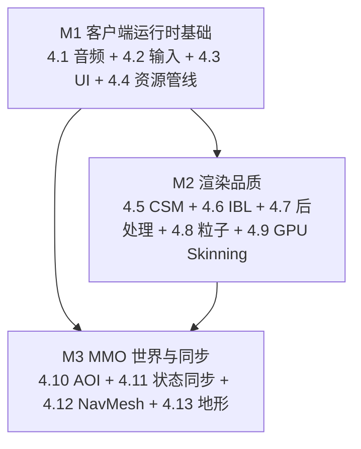
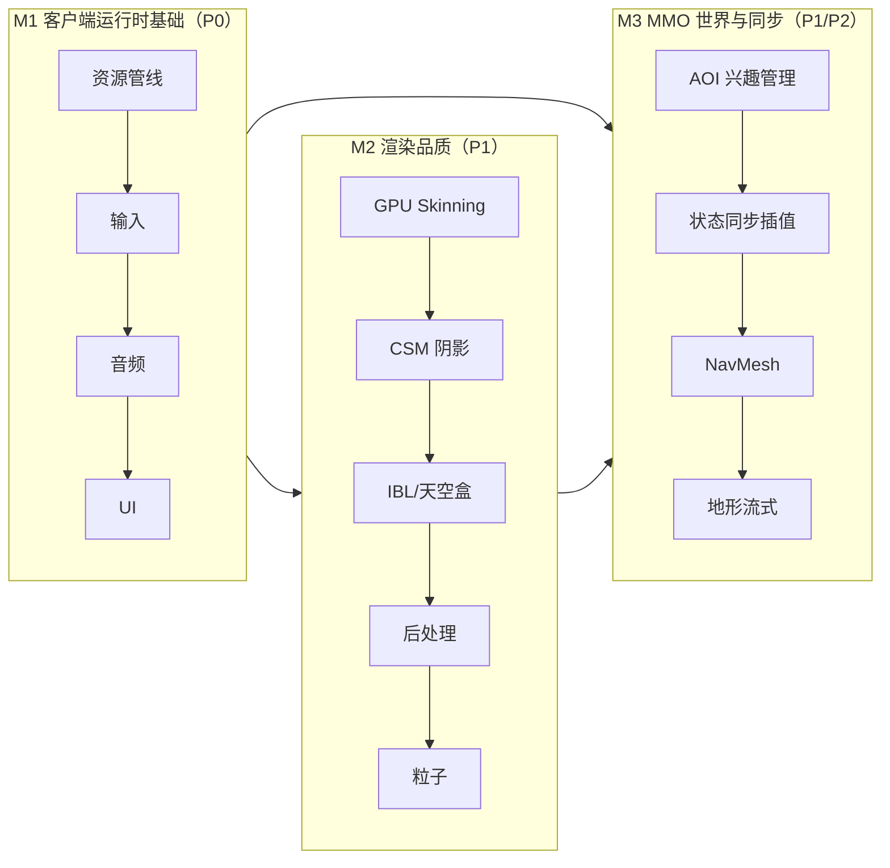

# 功能模块缺口规划

<cite>
**本文引用的文件**
- [crates/asset/src/lib.rs](file://crates/asset/src/lib.rs)
- [crates/render/src/lib.rs](file://crates/render/src/lib.rs)
- [crates/scene/src/lib.rs](file://crates/scene/src/lib.rs)
- [crates/avatar/src/lib.rs](file://crates/avatar/src/lib.rs)
- [crates/physics/src/lib.rs](file://crates/physics/src/lib.rs)
- [crates/camera/src/lib.rs](file://crates/camera/src/lib.rs)
- [server/engine/app.py](file://server/engine/app.py)
- [client/engine/app.py](file://client/engine/app.py)
</cite>

## 目录
1. [引言](#引言)
2. [现状一览](#现状一览)
3. [缺口清单与里程碑](#缺口清单与里程碑)
4. [13 个模块详细规划](#13-个模块详细规划)
5. [优先级路线图](#优先级路线图)
6. [文档边界](#文档边界)

## 引言
本文盘点 geese 引擎相对于「典型 3D MMO 引擎」的功能缺口，按 P0/P1/P2 划分实施优先级，给出每个模块的目标、技术选型、影响面与里程碑。

## 现状一览

| 能力域 | 已具备 | 文件锚点 |
|---|---|---|
| RPC/网关 | Gate / Hub / DBProxy 三层架构、Thrift 协议、跨服迁移 | [server/](file://server/) |
| 实体系统 | Entity / Group / Login / Global、行为树（python-behavior3） | [server/engine/](file://server/engine/) |
| 物理 | rapier3d 0.32 集成（刚体 / 碰撞 / 关节） | [crates/physics/](file://crates/physics/) |
| 渲染 | Forward+ / Deferred+ / Cluster Shading、PBR、IBL 占位 | [crates/render/](file://crates/render/) |
| 场景 | Octree + 静/动分离、glTF 加载 | [crates/scene/](file://crates/scene/) |
| 动画 | AnimationClip / AnimationStateMachine / Blend Tree | [crates/avatar/](file://crates/avatar/) |
| 相机 | Frustum / 视锥剔除 | [crates/camera/](file://crates/camera/) |
| 资源 | 仅 glTF 一种加载器 | [crates/asset/src/lib.rs](file://crates/asset/src/lib.rs) |

## 缺口清单与里程碑

| # | 模块 | 优先级 | 阶段 | 状态 |
|---|---|---|---|---|
| 4.1 | 音频 | P0 | M1 | 🟢 已接入 rodio 0.20（[crates/audio](file://crates/audio/)，9 单测：5 骨架 + 4 rodio） |
| 4.2 | 输入 | P0 | M1 | 🟢 已接入 gilrs 0.11 手柄后端（[crates/input](file://crates/input/)，8 单测：5 骨架 + 3 gilrs） |
| 4.3 | UI | P0 | M1 | 🟢 已接入 egui 0.29（[crates/ui](file://crates/ui/)，5 单测） |
| 4.4 | 资源管线 | P0 | M1 | 🟢 骨架完成（[crates/asset](file://crates/asset/)，6 单测） |
| 4.5 | 阴影 CSM | P1 | M2 | ⏳ 待启动 |
| 4.6 | IBL/天空盒 | P1 | M2 | ⏳ 待启动 |
| 4.7 | 后处理（Bloom/TAA/Tone Mapping） | P1 | M2 | ⏳ 待启动 |
| 4.8 | 粒子系统 | P1 | M2 | ⏳ 待启动 |
| 4.9 | GPU Skinning | P1 | M2 | ⏳ 待启动 |
| 4.10 | AOI 兴趣管理 | P1 | M3 | ⏳ 待启动 |
| 4.11 | 状态同步与插值 | P1 | M3 | ⏳ 待启动 |
| 4.12 | NavMesh 寻路 | P2 | M3 | ⏳ 待启动 |
| 4.13 | 地形与流式加载 | P2 | M3 | ⏳ 待启动 |

## 13 个模块详细规划

### 4.1 音频 [crates/audio](file://crates/audio)（新建）
- **目标**：3D 空间音效、BGM 流式播放、混音通道、距离衰减。
- **选型**：`rodio 0.20`（default-features off，启 `wav`/`vorbis`）；后续可选 `oddio + cpal`（低延迟需求）。
- **API**：`AudioSystem`、`AudioBackend` trait（非 Send+Sync，避免 cpal 原生资源跨线程问题）、`Sound` trait（Send+Sync）、`SoundConfig`（looping/volume/pitch/position）、`SourceId`、`MixerChannel`、`Listener`、`AudioError`、`NullBackend` 软回退、`RodioBackend`/`RodioSound`、`AudioSystem::try_with_rodio()` 工厂。
- **里程碑**：🟢 M1 骨架 + rodio 接入（9 单测，含 silent_wav helper 构造合法 PCM 16-bit mono WAV 字节，headless 软跳过）→ 3D 衰减 + 多通道混音 → 流式 BGM。

### 4.2 输入 [crates/input](file://crates/input)（新建）
- **目标**：键盘 / 鼠标 / 手柄事件统一抽象、按键映射、热重映射。
- **选型**：`gilrs 0.11`（手柄，已接入）+ 后续 `winit 0.30`（窗口事件）。
- **API**：`InputEvent` enum、`InputState`（press/release 边沿 + FocusLost 防卡键）、`InputBackend` trait、`KeyCode/MouseButton/GamepadButton/GamepadAxis` 枚举、`ActionMap` + `InputBinding`、`NullBackend`、`GilrsBackend`（XInput 布局映射，bumper/trigger 映射到 `LeftTrigger`/`LeftTrigger2`）、`GilrsInitError`、`try_new()`/`connected_count()`。
- **里程碑**：🟢 M1 骨架 + gilrs 接入（8 单测，gilrs init 在 headless 软跳过）→ 接 winit 转发键鼠事件 → Action Mapping 配置文件 + 热重映射。

### 4.3 UI [crates/ui](file://crates/ui)（新建）
- **目标**：immediate-mode UI、文本布局、与渲染管线集成。
- **选型**：`egui 0.29`（核心，default-features off）+ 后续 `egui-wgpu`（渲染桥接） + `cosmic-text 0.12`（CJK 文本，可选）。
- **API**：[`UiContext`]（薄包装 `egui::Context`）、`UiContext::run(input, |ctx| { … })`、`PointerState` → `egui::RawInput` 桥接 helper、`Theme`（Dark/Light + accent → `egui::Visuals`）、重新导出 egui。
- **里程碑**：🟢 M1 已接入 egui 0.29 核心（不绑 winit/wgpu，5 单测：empty run / CentralPanel + Button / PointerState 转 RawInput / 主题切换 / Color 量化）→ 接 `egui-wgpu` 渲染桥接 → 接 `cosmic-text` CJK → HUD/调试面板。

### 4.4 资源管线 [crates/asset](file://crates/asset)（扩展）
- **现状**：原 13 行 gltf wrapper 保留；🟢 已扩展统一资源管理层。
- **目标**：通用 `AssetLoader<T>` / `AssetCache` / `Handle<T>`、异步加载、热重载、KTX2/Basis 纹理压缩。
- **选型**：`notify 6.1`（文件热重载）+ `ktx2 0.3`/`basis-universal 0.3`（纹理）+ `meshopt 0.3`（顶点优化）。
- **骨架 API**：`AssetLoader` trait、`AssetCache`、`Handle<T>`、`LoadError`、原 `load()` 保留向后兼容。
- **里程碑**：🟢 M1 骨架完成（按 (TypeId, path) 去重缓存 + Handle Arc 共享 + evict/clear，6 单测，未引入新依赖）→ 异步加载 + LRU 缓存 → notify 热重载 → KTX2/meshopt 集成。

### 4.5 阴影 CSM [crates/render](file://crates/render)（扩展）
- **目标**：方向光级联阴影贴图（Cascaded Shadow Map）、PCF 软阴影。
- **选型**：3/4 级 cascade、Sample Distribution Shadow Maps（SDSM）。
- **影响面**：新增 shadow pass + cluster shading 中阴影采样、`MaterialLibrary` 接入阴影参数。
- **里程碑**：M2 骨架 shadow map render target → CSM 划分 + 矩阵计算 → PCF/PCSS。

### 4.6 IBL/天空盒 [crates/render](file://crates/render)（扩展）
- **目标**：HDR 天空盒、Irradiance Cubemap、Prefiltered Cubemap、BRDF LUT。
- **依赖**：4.4 资源管线（HDR/KTX2 加载）。
- **里程碑**：M2 静态 cubemap → 离线烘焙 IBL → 运行时动态 IBL（探针）。

### 4.7 后处理（Bloom/TAA/Tone Mapping） [crates/render](file://crates/render)（扩展）
- **目标**：ACES Tone Mapping、Bloom（Karis avg）、TAA（Temporal Anti-Aliasing）。
- **影响面**：新增 post-process pass chain、抖动相机矩阵接入 [crates/camera](file://crates/camera/)。
- **里程碑**：M2 ACES → Bloom → TAA。

### 4.8 粒子系统 [crates/vfx](file://crates/vfx)（新建）
- **目标**：CPU 粒子发射器、GPU 粒子（compute shader）、Billboard/Mesh 粒子。
- **依赖**：4.4 资源管线（纹理/材质）。
- **里程碑**：M2 CPU 粒子 + Billboard → GPU 粒子（wgpu compute） → Trail/Mesh 粒子。

### 4.9 GPU Skinning [crates/render](file://crates/render) ↔ [crates/avatar](file://crates/avatar)（扩展）
- **现状**：CPU 端 `compute_joint_matrices` + uniform 上传。
- **目标**：joint matrices SSBO/vertex pulling、Morph Target。
- **影响面**：[crates/render/src/forward_plus.rs](file://crates/render/src/forward_plus.rs) / [deferred_plus.rs](file://crates/render/src/deferred_plus.rs) 的 vertex pipeline。
- **里程碑**：M2 joint SSBO → vertex pulling → morph targets。

### 4.10 AOI 兴趣管理 [crates/aoi](file://crates/aoi)（新建，服务端）
- **目标**：九宫格 / Octree AOI、Enter/Leave/Update 事件。
- **选型**：九宫格（简单 MMO）或动态 Octree（开放世界）。
- **里程碑**：M3 九宫格 → 实体进出事件 → 与 [server/engine/entity.py](file://server/engine/entity.py) 集成。

### 4.11 状态同步与插值 [server/engine](file://server/engine/) + [client/engine](file://client/engine/)（扩展）
- **目标**：滞后插值（Source Engine 模式）、预测/回滚（Overwatch 模式可选）。
- **依赖**：4.10 AOI（确定同步范围）。
- **里程碑**：M3 滞后插值 → 预测 → 回滚。

### 4.12 NavMesh 寻路 [crates/navmesh](file://crates/navmesh)（新建）
- **目标**：基于 NavMesh 的 A*/funnel 寻路、动态 obstacle。
- **选型**：`oxidized_navigation 0.10`（Rust 端口的 Recast & Detour）。
- **依赖**：4.10 AOI（场景分块）。
- **里程碑**：M3 离线烘焙 NavMesh → 运行时寻路 → 动态 obstacle。

### 4.13 地形与流式加载 [crates/terrain](file://crates/terrain)（新建）
- **目标**：高度图地形、LOD、流式加载（streaming）。
- **选型**：Geo-clipmap LOD、tile-based streaming。
- **依赖**：4.4 资源管线、4.5 CSM（大场景阴影）、4.12 NavMesh（地形导航网格）。
- **里程碑**：M3 静态高度图 → clipmap LOD → tile streaming。

## 优先级路线图

**关键依赖**：
- 4.4 资源管线 → 4.6 IBL（HDR）/ 4.13 地形（heightmap）
- 4.9 GPU Skinning ↔ 4.11 状态同步（动作同步精度）
- 4.10 AOI → 4.11 状态同步 / 4.12 NavMesh / 4.13 地形

## 文档边界

本文档不涉及以下方向，避免范围过大：
- 编辑器（场景编辑/材质编辑/动画状态机编辑等 IDE）
- 资源烘焙工具链（Blender 插件、烘焙集群）
- 在线运营（CDN/分发/版本管理）
- 引擎脚本系统（已有 Python/TS）
- 多平台移植（Mobile/Console）
- 网络压缩协议（已有 Thrift/MessagePack）
- 安全反作弊
- 本地化
- 录像/回放
- 测试自动化与性能 profiling 工具
- AI 行为系统增强（已有 behavior3）
