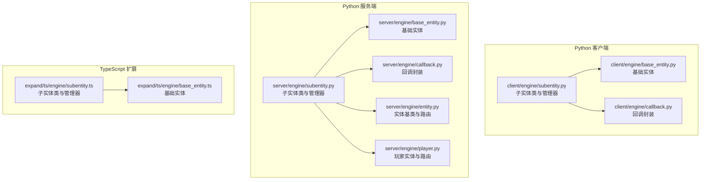
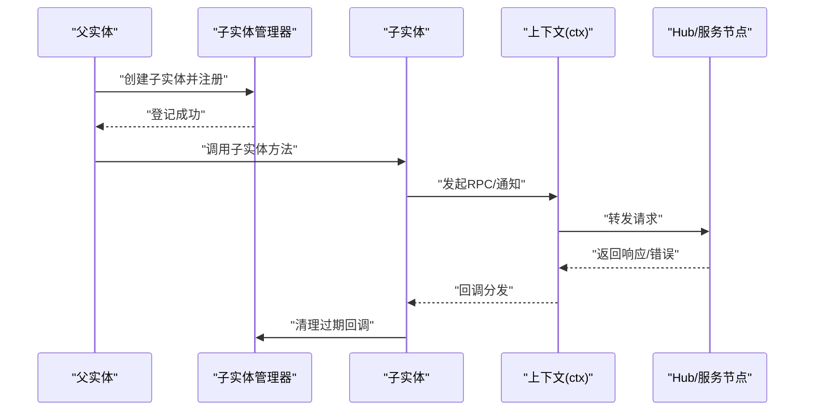
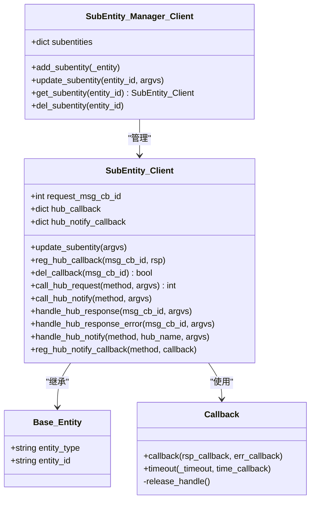
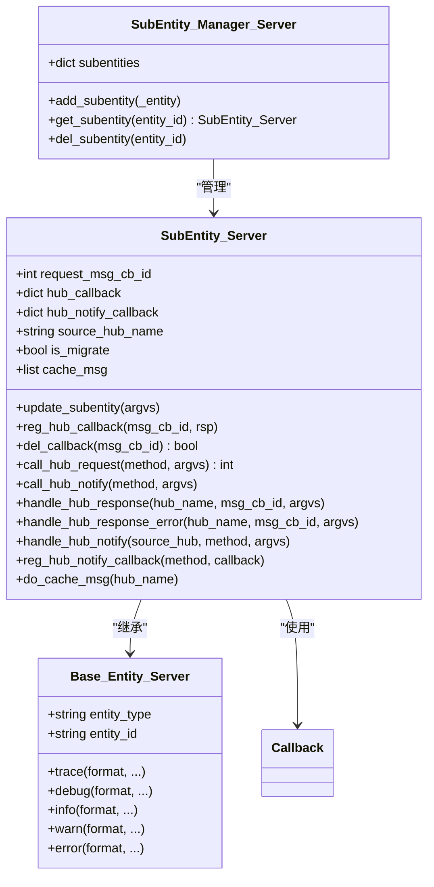
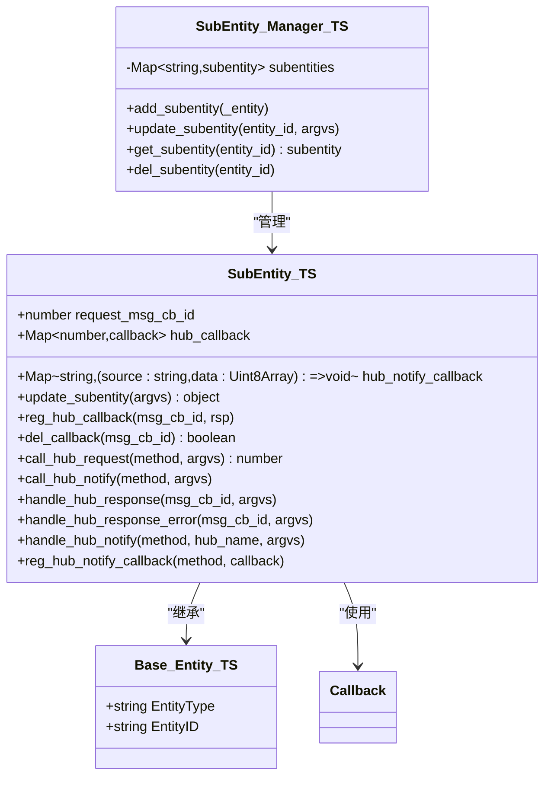
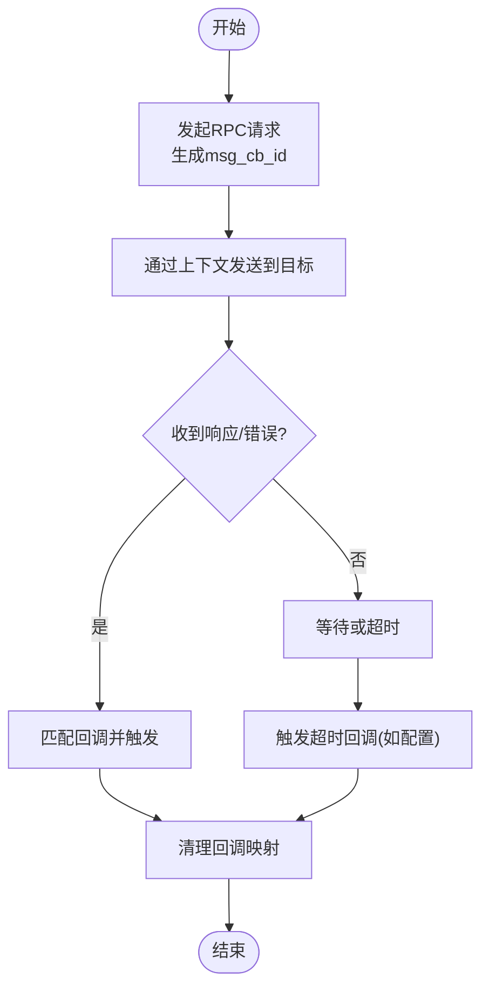
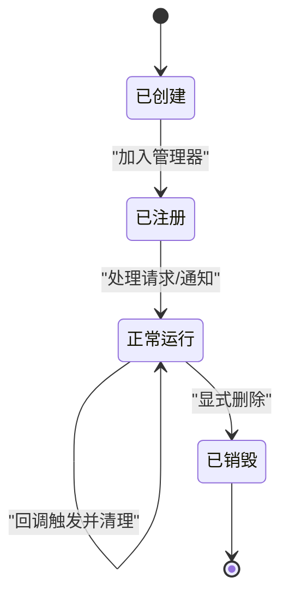
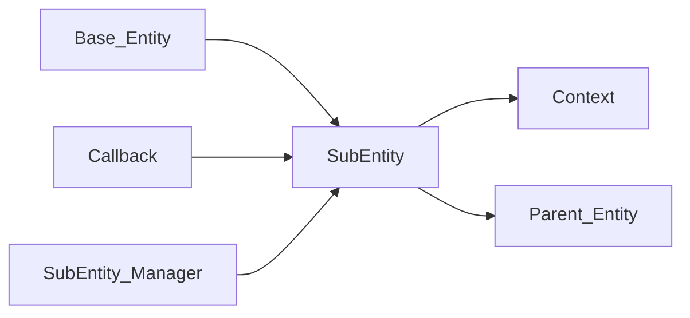

# 子实体管理系统

<cite>
**本文引用的文件**
- [client/engine/subentity.py](file://client/engine/subentity.py)
- [server/engine/subentity.py](file://server/engine/subentity.py)
- [expand/ts/engine/subentity.ts](file://expand/ts/engine/subentity.ts)
- [client/engine/base_entity.py](file://client/engine/base_entity.py)
- [server/engine/base_entity.py](file://server/engine/base_entity.py)
- [expand/ts/engine/base_entity.ts](file://expand/ts/engine/base_entity.ts)
- [client/engine/callback.py](file://client/engine/callback.py)
- [server/engine/callback.py](file://server/engine/callback.py)
- [server/engine/entity.py](file://server/engine/entity.py)
- [server/engine/player.py](file://server/engine/player.py)
</cite>

## 目录
1. [引言](#引言)
2. [项目结构](#项目结构)
3. [核心组件](#核心组件)
4. [架构总览](#架构总览)
5. [详细组件分析](#详细组件分析)
6. [依赖分析](#依赖分析)
7. [性能考量](#性能考量)
8. [故障排查指南](#故障排查指南)
9. [结论](#结论)
10. [附录：使用示例与最佳实践](#附录使用示例与最佳实践)

## 引言
本技术文档围绕“子实体”（subentity）系统展开，系统性阐述其概念、设计原理与实现细节，重点覆盖以下方面：
- 子实体与父实体的关系建模、层次结构管理与嵌套组织方式
- 子实体的生命周期与创建/销毁机制、自动清理与资源管理策略
- 子实体与父实体之间的通信机制：请求/响应、通知、错误回调与消息路由
- 查询与遍历能力：按ID检索、按类型过滤等，并给出性能优化建议
- 最佳实践：层次设计原则、性能与内存管理策略
- 实际项目中的使用示例与落地建议

## 项目结构
子实体系统在不同语言实现中保持一致的设计思想：
- Python 客户端与服务端分别提供子实体基类与管理器
- TypeScript 扩展版本提供跨平台支持
- 基类统一承载实体标识与日志能力
- 回调封装统一处理 RPC 请求的响应与错误

图表来源
- [client/engine/subentity.py:1-89](file://client/engine/subentity.py#L1-L89)
- [server/engine/subentity.py:1-98](file://server/engine/subentity.py#L1-L98)
- [expand/ts/engine/subentity.ts:1-103](file://expand/ts/engine/subentity.ts#L1-L103)
- [client/engine/base_entity.py:1-6](file://client/engine/base_entity.py#L1-L6)
- [server/engine/base_entity.py:1-26](file://server/engine/base_entity.py#L1-L26)
- [expand/ts/engine/base_entity.ts:1-15](file://expand/ts/engine/base_entity.ts#L1-L15)
- [client/engine/callback.py:1-23](file://client/engine/callback.py#L1-L23)
- [server/engine/callback.py:1-23](file://server/engine/callback.py#L1-L23)
- [server/engine/entity.py:1-194](file://server/engine/entity.py#L1-L194)
- [server/engine/player.py:1-295](file://server/engine/player.py#L1-L295)

章节来源
- [client/engine/subentity.py:1-89](file://client/engine/subentity.py#L1-L89)
- [server/engine/subentity.py:1-98](file://server/engine/subentity.py#L1-L98)
- [expand/ts/engine/subentity.ts:1-103](file://expand/ts/engine/subentity.ts#L1-L103)
- [client/engine/base_entity.py:1-6](file://client/engine/base_entity.py#L1-L6)
- [server/engine/base_entity.py:1-26](file://server/engine/base_entity.py#L1-L26)
- [expand/ts/engine/base_entity.ts:1-15](file://expand/ts/engine/base_entity.ts#L1-L15)
- [client/engine/callback.py:1-23](file://client/engine/callback.py#L1-L23)
- [server/engine/callback.py:1-23](file://server/engine/callback.py#L1-L23)
- [server/engine/entity.py:1-194](file://server/engine/entity.py#L1-L194)
- [server/engine/player.py:1-295](file://server/engine/player.py#L1-L295)

## 核心组件
- 子实体基类：负责与 Hub/客户端的 RPC 调用、通知分发、回调注册与清理
- 子实体管理器：集中维护子实体实例，提供按 ID 获取与删除
- 基础实体：统一实体标识（类型、ID），并提供日志能力
- 回调封装：统一封装请求回调、错误回调与超时处理

章节来源
- [client/engine/subentity.py:9-23](file://client/engine/subentity.py#L9-L23)
- [server/engine/subentity.py:8-21](file://server/engine/subentity.py#L8-L21)
- [expand/ts/engine/subentity.ts:10-25](file://expand/ts/engine/subentity.ts#L10-L25)
- [client/engine/base_entity.py:3-6](file://client/engine/base_entity.py#L3-L6)
- [server/engine/base_entity.py:3-6](file://server/engine/base_entity.py#L3-L6)
- [expand/ts/engine/base_entity.ts:7-14](file://expand/ts/engine/base_entity.ts#L7-L14)
- [client/engine/callback.py:5-23](file://client/engine/callback.py#L5-L23)
- [server/engine/callback.py:5-23](file://server/engine/callback.py#L5-L23)

## 架构总览
子实体系统以“父实体”为中心，通过管理器集中持有子实体实例；子实体通过上下文接口向 Hub 或客户端发起 RPC 请求与通知，同时注册回调以接收响应或错误。

图表来源
- [server/engine/subentity.py:57-65](file://server/engine/subentity.py#L57-L65)
- [client/engine/subentity.py:57-62](file://client/engine/subentity.py#L57-L62)
- [expand/ts/engine/subentity.ts:58-75](file://expand/ts/engine/subentity.ts#L58-L75)
- [server/engine/entity.py:98-130](file://server/engine/entity.py#L98-L130)
- [server/engine/player.py:116-148](file://server/engine/player.py#L116-L148)

## 详细组件分析

### 子实体类与管理器（Python 客户端）
- 子实体类职责
  - 维护请求回调映射与通知回调映射
  - 生成消息回调 ID 并通过上下文发起 RPC/通知
  - 处理 Hub 返回的响应与错误，触发回调并清理
  - 注册 Hub 通知回调，接收上游推送
- 管理器职责
  - 按实体 ID 管理子实体实例
  - 提供更新与删除操作

图表来源
- [client/engine/subentity.py:9-23](file://client/engine/subentity.py#L9-L23)
- [client/engine/subentity.py:71-89](file://client/engine/subentity.py#L71-L89)
- [client/engine/base_entity.py:3-6](file://client/engine/base_entity.py#L3-L6)
- [client/engine/callback.py:5-23](file://client/engine/callback.py#L5-L23)

章节来源
- [client/engine/subentity.py:9-89](file://client/engine/subentity.py#L9-L89)
- [client/engine/base_entity.py:3-6](file://client/engine/base_entity.py#L3-L6)
- [client/engine/callback.py:5-23](file://client/engine/callback.py#L5-L23)

### 子实体类与管理器（Python 服务端）
- 子实体类职责
  - 额外维护迁移状态与缓存消息队列，在迁移完成后批量重放
  - 与父实体类似，但处理 Hub 侧的 RPC/通知与回调
- 管理器职责
  - 同样按实体 ID 管理子实体实例

图表来源
- [server/engine/subentity.py:8-21](file://server/engine/subentity.py#L8-L21)
- [server/engine/subentity.py:84-98](file://server/engine/subentity.py#L84-L98)
- [server/engine/base_entity.py:3-26](file://server/engine/base_entity.py#L3-L26)
- [server/engine/callback.py:5-23](file://server/engine/callback.py#L5-L23)

章节来源
- [server/engine/subentity.py:8-98](file://server/engine/subentity.py#L8-L98)
- [server/engine/base_entity.py:3-26](file://server/engine/base_entity.py#L3-L26)
- [server/engine/callback.py:5-23](file://server/engine/callback.py#L5-L23)

### 子实体类与管理器（TypeScript 扩展）
- 子实体类职责
  - 使用 Map 结构替代 Python 字典，提供更直观的键值访问
  - 通过上下文发起 RPC/通知，处理响应与错误回调
- 管理器职责
  - 使用 Map 存储子实体，提供增删查改

图表来源
- [expand/ts/engine/subentity.ts:10-25](file://expand/ts/engine/subentity.ts#L10-L25)
- [expand/ts/engine/subentity.ts:78-103](file://expand/ts/engine/subentity.ts#L78-L103)
- [expand/ts/engine/base_entity.ts:7-14](file://expand/ts/engine/base_entity.ts#L7-L14)
- [expand/ts/engine/callback.ts:1-103](file://expand/ts/engine/callback.ts#L1-L103)

章节来源
- [expand/ts/engine/subentity.ts:10-103](file://expand/ts/engine/subentity.ts#L10-L103)
- [expand/ts/engine/base_entity.ts:7-14](file://expand/ts/engine/base_entity.ts#L7-L14)

### 通信机制与消息路由
- 请求/响应
  - 子实体通过上下文发起 RPC 请求，携带自增的消息回调 ID
  - 对方返回后，回调被触发并清理
- 通知
  - 子实体可注册通知回调，接收来自上游的推送
- 错误处理
  - 统一通过错误回调处理异常情况
- 迁移场景
  - 服务端子实体在迁移期间缓存消息，待迁移完成后再重放

图表来源
- [client/engine/subentity.py:57-62](file://client/engine/subentity.py#L57-L62)
- [server/engine/subentity.py:57-65](file://server/engine/subentity.py#L57-L65)
- [expand/ts/engine/subentity.ts:58-75](file://expand/ts/engine/subentity.ts#L58-L75)
- [client/engine/callback.py:13-23](file://client/engine/callback.py#L13-L23)
- [server/engine/callback.py:13-23](file://server/engine/callback.py#L13-L23)

章节来源
- [client/engine/subentity.py:31-56](file://client/engine/subentity.py#L31-L56)
- [server/engine/subentity.py:31-55](file://server/engine/subentity.py#L31-L55)
- [expand/ts/engine/subentity.ts:31-56](file://expand/ts/engine/subentity.ts#L31-L56)
- [client/engine/callback.py:13-23](file://client/engine/callback.py#L13-L23)
- [server/engine/callback.py:13-23](file://server/engine/callback.py#L13-L23)

### 生命周期与资源管理
- 创建
  - 子实体构造时注册到全局管理器
- 更新
  - 管理器根据实体 ID 分发更新
- 销毁
  - 显式删除管理器中的子实体条目
  - 回调在响应/错误到达时自动清理，避免泄漏

图表来源
- [client/engine/subentity.py:18-20](file://client/engine/subentity.py#L18-L20)
- [server/engine/subentity.py:22-24](file://server/engine/subentity.py#L22-L24)
- [client/engine/subentity.py:82-89](file://client/engine/subentity.py#L82-L89)
- [server/engine/subentity.py:91-98](file://server/engine/subentity.py#L91-L98)

章节来源
- [client/engine/subentity.py:18-20](file://client/engine/subentity.py#L18-L20)
- [server/engine/subentity.py:22-24](file://server/engine/subentity.py#L22-L24)
- [client/engine/subentity.py:82-89](file://client/engine/subentity.py#L82-L89)
- [server/engine/subentity.py:91-98](file://server/engine/subentity.py#L91-L98)

### 查询与遍历
- 按 ID 查询
  - 管理器提供按实体 ID 获取子实体的方法
- 过滤与遍历
  - 可基于实体类型进行二次过滤（在上层逻辑中实现）
- 性能优化建议
  - 使用哈希表（字典/Map）存储，O(1) 查找
  - 控制回调数量，及时清理过期回调
  - 在高频场景下合并通知或采用批处理

章节来源
- [client/engine/subentity.py:82-85](file://client/engine/subentity.py#L82-L85)
- [server/engine/subentity.py:91-94](file://server/engine/subentity.py#L91-L94)
- [expand/ts/engine/subentity.ts:96-98](file://expand/ts/engine/subentity.ts#L96-L98)

## 依赖分析
- 子实体与基础实体：继承关系，复用实体标识与日志能力
- 子实体与回调：组合关系，统一处理响应/错误/超时
- 管理器与子实体：聚合关系，集中管理生命周期
- 服务端子实体与父实体：协作关系，通过上下文进行跨节点通信

图表来源
- [client/engine/base_entity.py:3-6](file://client/engine/base_entity.py#L3-L6)
- [server/engine/base_entity.py:3-6](file://server/engine/base_entity.py#L3-L6)
- [client/engine/callback.py:5-23](file://client/engine/callback.py#L5-L23)
- [server/engine/callback.py:5-23](file://server/engine/callback.py#L5-L23)
- [client/engine/subentity.py:71-89](file://client/engine/subentity.py#L71-L89)
- [server/engine/subentity.py:84-98](file://server/engine/subentity.py#L84-L98)
- [server/engine/entity.py:98-130](file://server/engine/entity.py#L98-L130)
- [server/engine/player.py:116-148](file://server/engine/player.py#L116-L148)

章节来源
- [client/engine/base_entity.py:3-6](file://client/engine/base_entity.py#L3-L6)
- [server/engine/base_entity.py:3-6](file://server/engine/base_entity.py#L3-L6)
- [client/engine/callback.py:5-23](file://client/engine/callback.py#L5-L23)
- [server/engine/callback.py:5-23](file://server/engine/callback.py#L5-L23)
- [client/engine/subentity.py:71-89](file://client/engine/subentity.py#L71-L89)
- [server/engine/subentity.py:84-98](file://server/engine/subentity.py#L84-L98)
- [server/engine/entity.py:98-130](file://server/engine/entity.py#L98-L130)
- [server/engine/player.py:116-148](file://server/engine/player.py#L116-L148)

## 性能考量
- 数据结构选择
  - Python 使用字典，TypeScript 使用 Map，均提供 O(1) 访问
- 回收策略
  - 响应/错误到达即清理回调映射，避免长期持有
- 迁移期间的消息缓存
  - 服务端子实体在迁移阶段缓存消息，完成后批量重放，减少丢失与重复
- 日志与开销
  - 基类日志方法便于定位问题，但应避免在热路径中频繁调用

章节来源
- [server/engine/subentity.py:77-82](file://server/engine/subentity.py#L77-L82)
- [server/engine/base_entity.py:8-26](file://server/engine/base_entity.py#L8-L26)

## 故障排查指南
- 未处理的响应/错误
  - 若回调不存在，系统会输出未处理提示；检查是否正确注册回调或是否已清理
- 未处理的通知
  - 若通知方法未注册，系统会输出未处理提示；确认通知回调注册
- 回调未清理
  - 确保在响应/错误到达后回调被触发并清理；必要时检查超时逻辑
- 迁移导致的消息丢失
  - 服务端子实体应在迁移完成后调用重放函数，确保缓存消息被发送

章节来源
- [client/engine/subentity.py:31-52](file://client/engine/subentity.py#L31-L52)
- [server/engine/subentity.py:31-52](file://server/engine/subentity.py#L31-L52)
- [client/engine/callback.py:17-23](file://client/engine/callback.py#L17-L23)
- [server/engine/callback.py:17-23](file://server/engine/callback.py#L17-L23)
- [server/engine/subentity.py:77-82](file://server/engine/subentity.py#L77-L82)

## 结论
子实体系统通过统一的基类、回调封装与管理器，实现了父子实体间清晰的层次关系与高效的通信机制。在服务端，迁移场景下的缓存与重放进一步增强了可靠性。结合合理的数据结构与回收策略，可在高并发场景下保持良好的性能与稳定性。

## 附录：使用示例与最佳实践
- 层次设计原则
  - 将子实体视为“轻量、可销毁”的实体片段，避免在其中存放重型状态
  - 通过父实体协调子实体的生命周期，确保创建与销毁的一致性
- 性能考虑
  - 使用哈希表管理子实体与回调，避免线性扫描
  - 合理设置超时时间，防止回调堆积
- 内存管理策略
  - 在响应/错误到达后立即清理回调映射
  - 在迁移场景下，确保迁移完成后再释放相关资源
- 实际落地建议
  - 在父实体中集中注册子实体的请求/通知回调
  - 对高频通知进行批处理或去抖动
  - 使用日志定位问题，但避免在热路径中过度打印