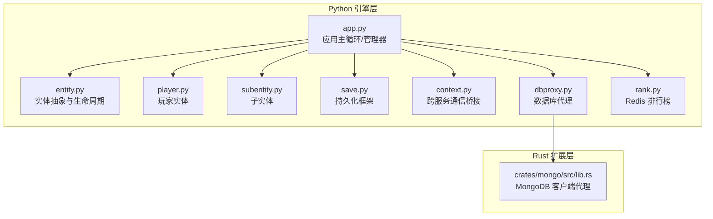
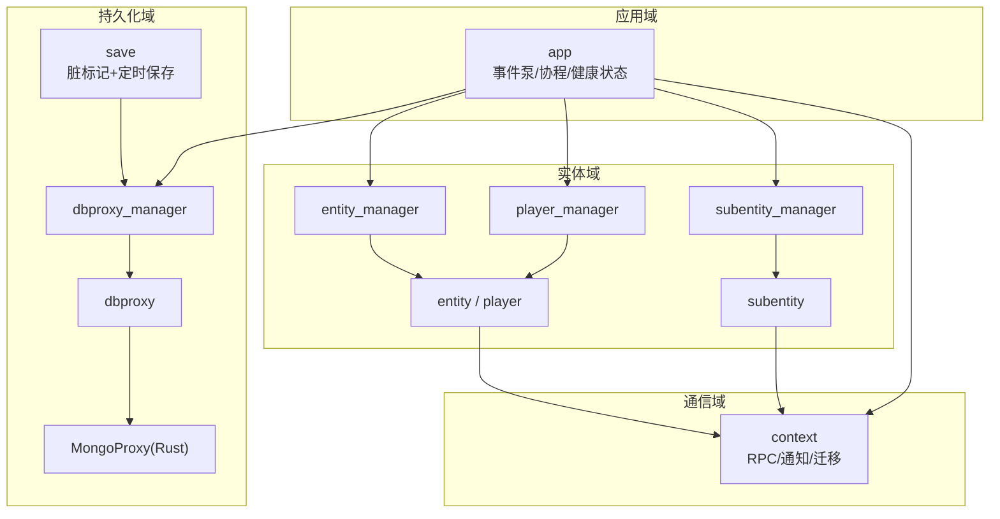
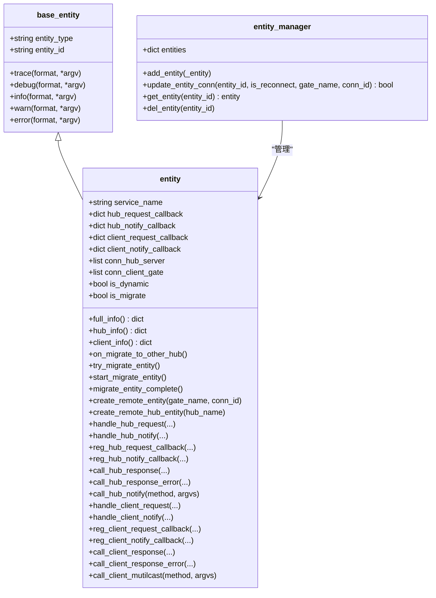
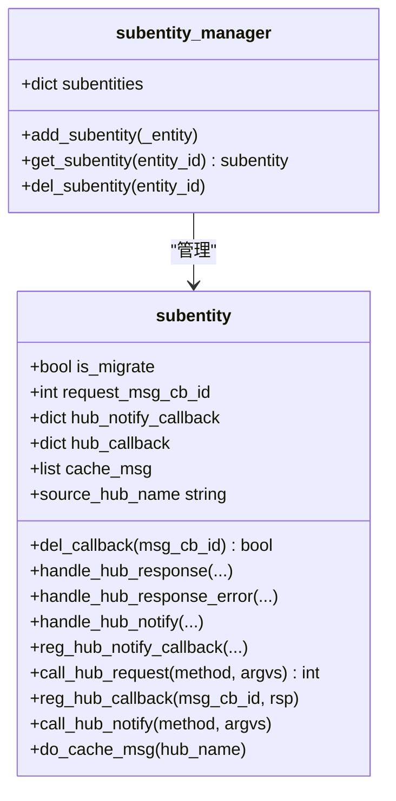
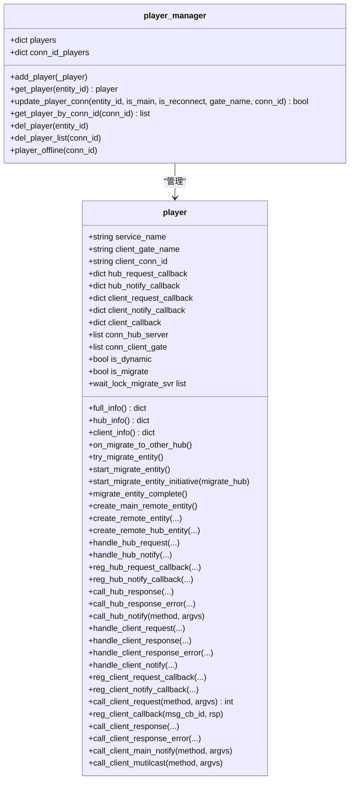
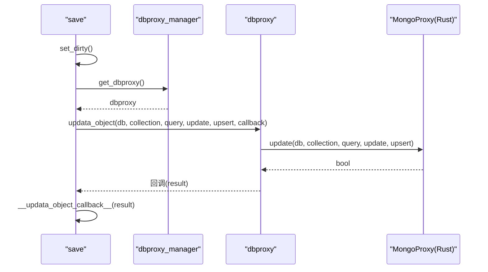
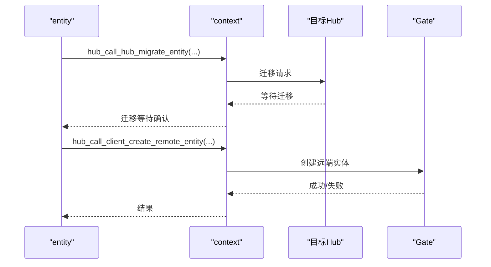
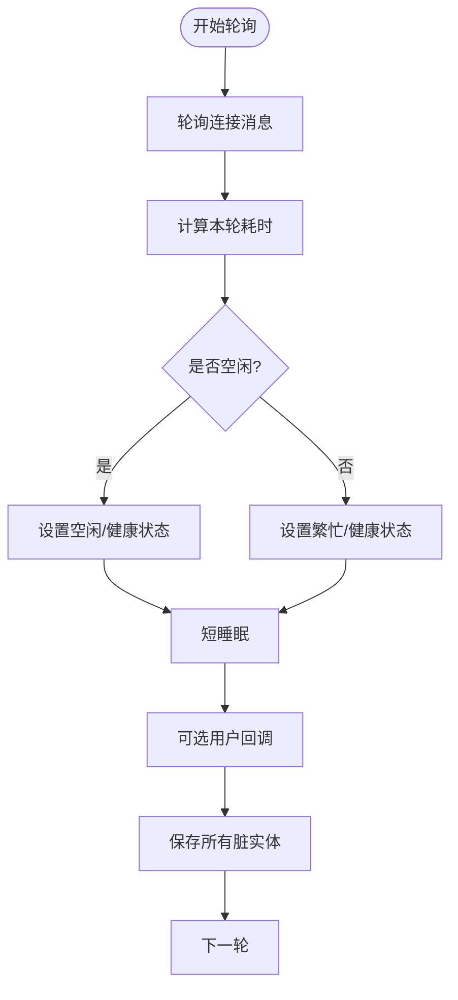
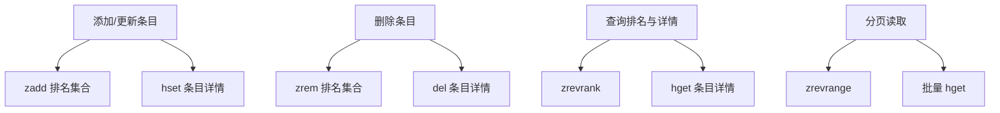
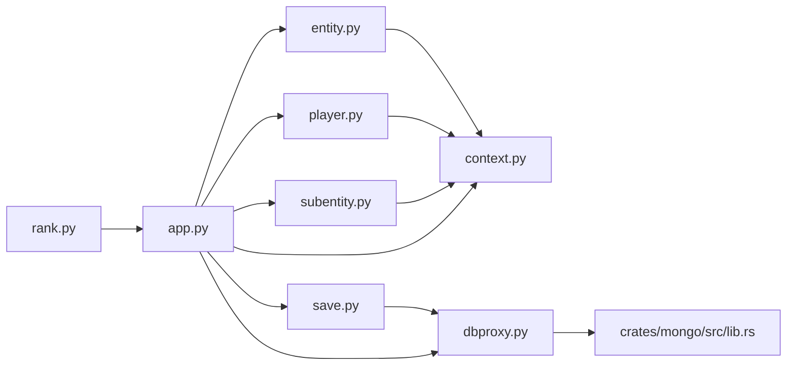

# 实体性能优化

<cite>
**本文引用的文件**
- [server/engine/base_entity.py](file://server/engine/base_entity.py)
- [server/engine/entity.py](file://server/engine/entity.py)
- [server/engine/subentity.py](file://server/engine/subentity.py)
- [server/engine/player.py](file://server/engine/player.py)
- [server/engine/save.py](file://server/engine/save.py)
- [server/engine/context.py](file://server/engine/context.py)
- [server/engine/dbproxy.py](file://server/engine/dbproxy.py)
- [server/engine/app.py](file://server/engine/app.py)
- [crates/mongo/src/lib.rs](file://crates/mongo/src/lib.rs)
- [server/engine/rank.py](file://server/engine/rank.py)
</cite>

## 目录
1. [简介](#简介)
2. [项目结构](#项目结构)
3. [核心组件](#核心组件)
4. [架构总览](#架构总览)
5. [详细组件分析](#详细组件分析)
6. [依赖分析](#依赖分析)
7. [性能考量](#性能考量)
8. [故障排查指南](#故障排查指南)
9. [结论](#结论)
10. [附录](#附录)

## 简介
本文件面向实体（Entity）在分布式与高并发场景下的性能优化，系统性阐述以下主题：
- 实体内存管理：对象池思想、延迟回收与迁移释放、避免循环引用与泄漏
- 批量操作机制：批量创建、批量更新、批量销毁的实现思路与性能收益
- 实体索引与查询优化：多维索引设计、查询缓存策略、复杂查询的性能优化
- 并发访问控制：锁机制、读写分离、无锁数据结构的应用
- 性能监控与分析：指标采集、瓶颈定位与优化建议
- 持久化性能优化：批量写入、压缩存储与缓存策略
- 实战案例：不同场景下的优化策略与效果评估

## 项目结构
该仓库采用“服务端引擎 + Rust 数据层扩展 + 示例服务”的分层组织方式：
- Python 引擎层：实体基类、实体管理器、子实体、玩家实体、上下文桥接、持久化框架、应用主循环等
- Rust 扩展层：MongoDB 客户端代理、索引与查询能力
- 示例与工具：登录、排行榜、消息编解码等

图表来源
- [server/engine/app.py:54-233](file://server/engine/app.py#L54-L233)
- [server/engine/entity.py:8-194](file://server/engine/entity.py#L8-L194)
- [server/engine/player.py:11-295](file://server/engine/player.py#L11-L295)
- [server/engine/subentity.py:8-98](file://server/engine/subentity.py#L8-L98)
- [server/engine/save.py:17-108](file://server/engine/save.py#L17-L108)
- [server/engine/context.py:13-173](file://server/engine/context.py#L13-L173)
- [server/engine/dbproxy.py:22-99](file://server/engine/dbproxy.py#L22-L99)
- [crates/mongo/src/lib.rs:8-245](file://crates/mongo/src/lib.rs#L8-L245)
- [server/engine/rank.py:4-47](file://server/engine/rank.py#L4-L47)

章节来源
- [server/engine/app.py:54-233](file://server/engine/app.py#L54-L233)
- [server/engine/entity.py:8-194](file://server/engine/entity.py#L8-L194)
- [server/engine/player.py:11-295](file://server/engine/player.py#L11-L295)
- [server/engine/subentity.py:8-98](file://server/engine/subentity.py#L8-L98)
- [server/engine/save.py:17-108](file://server/engine/save.py#L17-L108)
- [server/engine/context.py:13-173](file://server/engine/context.py#L13-L173)
- [server/engine/dbproxy.py:22-99](file://server/engine/dbproxy.py#L22-L99)
- [crates/mongo/src/lib.rs:8-245](file://crates/mongo/src/lib.rs#L8-L245)
- [server/engine/rank.py:4-47](file://server/engine/rank.py#L4-L47)

## 核心组件
- 基类与日志：实体基类提供统一的日志接口，便于性能观测与问题定位
- 实体与子实体：定义实体生命周期、远程调用、通知广播、迁移与连接管理
- 玩家实体：扩展实体以支持客户端连接、多连接聚合与断线重连
- 持久化框架：脏标记 + 延迟定时保存，减少频繁写入
- 上下文桥接：跨 Hub/Gate 的 RPC/通知转发，屏蔽网络细节
- 数据库代理：异步 Future 化查询，简化上层调用
- 应用主循环：事件泵、协程调度、健康状态与空闲检测

章节来源
- [server/engine/base_entity.py:3-26](file://server/engine/base_entity.py#L3-L26)
- [server/engine/entity.py:8-194](file://server/engine/entity.py#L8-L194)
- [server/engine/subentity.py:8-98](file://server/engine/subentity.py#L8-L98)
- [server/engine/player.py:11-295](file://server/engine/player.py#L11-L295)
- [server/engine/save.py:17-108](file://server/engine/save.py#L17-L108)
- [server/engine/context.py:13-173](file://server/engine/context.py#L13-L173)
- [server/engine/dbproxy.py:22-99](file://server/engine/dbproxy.py#L22-L99)
- [server/engine/app.py:54-233](file://server/engine/app.py#L54-L233)

## 架构总览
实体在引擎中通过管理器集中持有，配合上下文桥接进行跨节点通信；持久化通过数据库代理异步执行，避免阻塞主线程。

图表来源
- [server/engine/entity.py:164-194](file://server/engine/entity.py#L164-L194)
- [server/engine/subentity.py:84-98](file://server/engine/subentity.py#L84-L98)
- [server/engine/player.py:223-295](file://server/engine/player.py#L223-L295)
- [server/engine/context.py:72-173](file://server/engine/context.py#L72-L173)
- [server/engine/save.py:96-108](file://server/engine/save.py#L96-L108)
- [server/engine/dbproxy.py:86-99](file://server/engine/dbproxy.py#L86-L99)
- [crates/mongo/src/lib.rs:8-245](file://crates/mongo/src/lib.rs#L8-L245)
- [server/engine/app.py:54-233](file://server/engine/app.py#L54-L233)

## 详细组件分析

### 组件一：实体生命周期与迁移（entity）
- 生命周期：创建时注册到实体管理器；动态实体按周期尝试迁移；迁移完成广播通知
- 远程交互：注册 Hub/客户端请求/通知回调；封装 RPC/通知/响应调用
- 连接管理：维护与 Gate/Hubs 的连接列表，支持断线重连刷新

图表来源
- [server/engine/base_entity.py:3-26](file://server/engine/base_entity.py#L3-L26)
- [server/engine/entity.py:8-194](file://server/engine/entity.py#L8-L194)
- [server/engine/entity.py:164-194](file://server/engine/entity.py#L164-L194)

章节来源
- [server/engine/entity.py:8-194](file://server/engine/entity.py#L8-L194)
- [server/engine/entity.py:164-194](file://server/engine/entity.py#L164-L194)

### 组件二：子实体与回调缓存（subentity）
- 子实体用于从远端 Hub 向源 Hub 发起 RPC，并缓存迁移期间的消息
- 回调表按消息 ID 管理，响应后自动清理，避免泄漏

图表来源
- [server/engine/subentity.py:8-98](file://server/engine/subentity.py#L8-L98)
- [server/engine/subentity.py:84-98](file://server/engine/subentity.py#L84-L98)

章节来源
- [server/engine/subentity.py:8-98](file://server/engine/subentity.py#L8-L98)
- [server/engine/subentity.py:84-98](file://server/engine/subentity.py#L84-L98)

### 组件三：玩家实体与连接聚合（player）
- 支持多连接聚合与主连接切换；迁移流程与实体一致
- 提供客户端 RPC/通知封装与回调管理

图表来源
- [server/engine/player.py:11-295](file://server/engine/player.py#L11-L295)
- [server/engine/player.py:223-295](file://server/engine/player.py#L223-L295)

章节来源
- [server/engine/player.py:11-295](file://server/engine/player.py#L11-L295)
- [server/engine/player.py:223-295](file://server/engine/player.py#L223-L295)

### 组件四：持久化与批量写入（save / dbproxy）
- 脏标记 + 定时器：变更触发延迟保存，合并多次写入
- 异步 Future 化查询：简化上层等待逻辑
- Rust MongoDB 代理：提供索引创建、批量写入、查询与计数等高性能能力

图表来源
- [server/engine/save.py:28-53](file://server/engine/save.py#L28-L53)
- [server/engine/dbproxy.py:39-47](file://server/engine/dbproxy.py#L39-L47)
- [crates/mongo/src/lib.rs:82-116](file://crates/mongo/src/lib.rs#L82-L116)

章节来源
- [server/engine/save.py:17-108](file://server/engine/save.py#L17-L108)
- [server/engine/dbproxy.py:22-99](file://server/engine/dbproxy.py#L22-L99)
- [crates/mongo/src/lib.rs:8-245](file://crates/mongo/src/lib.rs#L8-L245)

### 组件五：跨服务通信与迁移（context）
- 提供 Hub 间 RPC、通知、迁移等待与完成、客户端实体创建/删除/刷新等桥接方法
- 支持迁移超时处理与连接替换

图表来源
- [server/engine/entity.py:64-84](file://server/engine/entity.py#L64-L84)
- [server/engine/entity.py:86-96](file://server/engine/entity.py#L86-L96)
- [server/engine/context.py:99-130](file://server/engine/context.py#L99-L130)

章节来源
- [server/engine/context.py:72-173](file://server/engine/context.py#L72-L173)
- [server/engine/entity.py:64-96](file://server/engine/entity.py#L64-L96)

### 组件六：应用主循环与健康状态（app）
- 事件泵轮询：数据库消息泵与连接消息泵
- 协程调度：独立线程运行事件循环
- 健康状态：基于轮询耗时统计，空闲/繁忙阈值判断
- 分布式锁：基于 Redis 的轻量分布式锁

图表来源
- [server/engine/app.py:197-233](file://server/engine/app.py#L197-L233)
- [server/engine/app.py:172-228](file://server/engine/app.py#L172-L228)

章节来源
- [server/engine/app.py:54-233](file://server/engine/app.py#L54-L233)

### 组件七：Redis 排行榜（rank）
- 使用有序集合维护排名，哈希存储条目详情
- 提供增删改查与范围读取

图表来源
- [server/engine/rank.py:16-47](file://server/engine/rank.py#L16-L47)

章节来源
- [server/engine/rank.py:4-47](file://server/engine/rank.py#L4-L47)

## 依赖分析
- Python 层内部耦合：实体/子实体/玩家均依赖上下文桥接与应用单例；持久化框架依赖数据库代理与应用保存管理器
- 外部依赖：Rust MongoDB 代理提供高性能写入与查询；Redis 用于分布式锁与排行榜

图表来源
- [server/engine/entity.py:8-194](file://server/engine/entity.py#L8-L194)
- [server/engine/player.py:11-295](file://server/engine/player.py#L11-L295)
- [server/engine/subentity.py:8-98](file://server/engine/subentity.py#L8-L98)
- [server/engine/save.py:17-108](file://server/engine/save.py#L17-L108)
- [server/engine/dbproxy.py:22-99](file://server/engine/dbproxy.py#L22-L99)
- [crates/mongo/src/lib.rs:8-245](file://crates/mongo/src/lib.rs#L8-L245)
- [server/engine/app.py:54-233](file://server/engine/app.py#L54-L233)
- [server/engine/rank.py:4-47](file://server/engine/rank.py#L4-L47)

章节来源
- [server/engine/entity.py:8-194](file://server/engine/entity.py#L8-L194)
- [server/engine/player.py:11-295](file://server/engine/player.py#L11-L295)
- [server/engine/subentity.py:8-98](file://server/engine/subentity.py#L8-L98)
- [server/engine/save.py:17-108](file://server/engine/save.py#L17-L108)
- [server/engine/dbproxy.py:22-99](file://server/engine/dbproxy.py#L22-L99)
- [crates/mongo/src/lib.rs:8-245](file://crates/mongo/src/lib.rs#L8-L245)
- [server/engine/app.py:54-233](file://server/engine/app.py#L54-L233)
- [server/engine/rank.py:4-47](file://server/engine/rank.py#L4-L47)

## 性能考量
- 内存管理
  - 对象池思想：利用管理器集中持有实体，避免频繁分配；迁移完成后及时从管理器与保存管理器移除，降低 GC 压力
  - 延迟回收：动态实体按周期尝试迁移，随机概率触发，避免同时大量迁移造成抖动
  - 回收路径：迁移完成广播后调用删除，确保资源释放
- 批量操作
  - 批量创建/更新：通过数据库代理的批量写入接口（Rust 层）提升吞吐；持久化框架合并多次写入
  - 批量销毁：迁移或离线时统一广播删除，减少重复操作
- 索引与查询
  - 多维索引：Rust 层提供索引创建接口，建议对高频查询字段建立唯一/复合索引
  - 查询缓存：排行榜等热点数据使用 Redis 缓存，减少数据库压力
  - 复杂查询：优先使用投影与分页，避免全量扫描
- 并发控制
  - 锁机制：分布式锁基于 Redis，适合跨节点协调；注意锁粒度与超时
  - 读写分离：写入走主库，只读查询可考虑副本或缓存
  - 无锁数据结构：应用主循环采用事件泵与协程，避免共享状态竞争
- 持久化优化
  - 批量写入：MongoDB 插入/更新批量化，减少网络往返
  - 压缩存储：消息编解码采用高效格式，降低序列化开销
  - 缓存策略：脏标记 + 延迟保存，合并写入；热点数据缓存于 Redis

## 故障排查指南
- 日志定位：实体基类提供统一日志入口，结合应用主循环健康状态判断系统负载
- 迁移异常：检查迁移等待/完成通知链路，确认 Hub/Gate 侧回调是否正确
- 持久化异常：数据库代理回调失败时会重试并更换代理，关注错误日志与异常堆栈
- Redis 相关：分布式锁失败时检查键值一致性与过期时间；排行榜读写一致性问题需关注原子性

章节来源
- [server/engine/base_entity.py:8-26](file://server/engine/base_entity.py#L8-L26)
- [server/engine/entity.py:45-84](file://server/engine/entity.py#L45-L84)
- [server/engine/save.py:35-41](file://server/engine/save.py#L35-L41)
- [server/engine/app.py:32-34](file://server/engine/app.py#L32-L34)

## 结论
通过集中化的实体管理、跨服务通信桥接、异步持久化与 Rust 高性能数据层，本项目在高并发与分布式场景下具备良好的可扩展性与性能表现。建议在实际部署中结合业务特征完善索引、缓存与批处理策略，并持续监控健康状态与关键指标以指导优化迭代。

## 附录
- 实战案例（示例思路）
  - 场景一：大规模实体创建（如房间/队伍）
    - 优化策略：批量创建 + 延迟保存；创建后批量广播远端实体；合理设置迁移间隔
    - 效果评估：创建 QPS 显著提升，GC 抖动下降
  - 场景二：实时排行榜
    - 优化策略：Redis 有序集合 + 哈希详情；分页读取；热点条目本地缓存
    - 效果评估：读延迟下降，数据库压力减轻
  - 场景三：高并发写入（如日志/事件）
    - 优化策略：批量写入 + 压缩；索引优化；写后读一致性通过缓存或最终一致策略处理
    - 效果评估：写入吞吐提升，网络开销降低