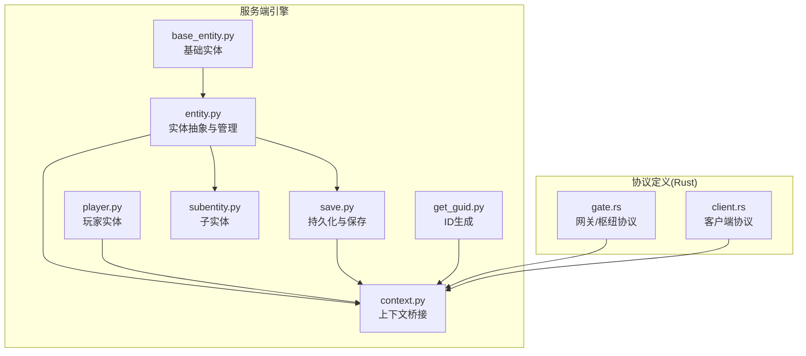
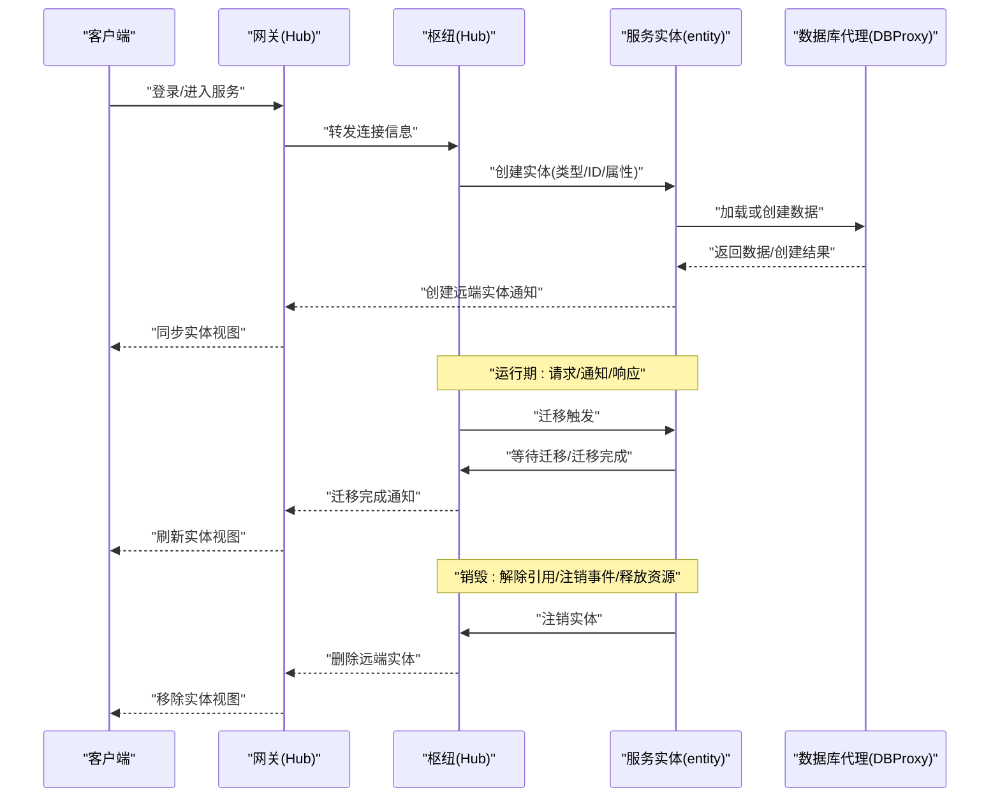
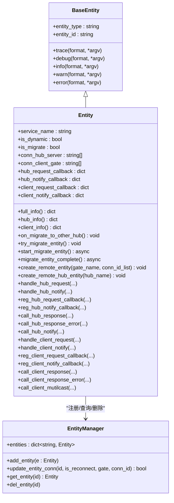
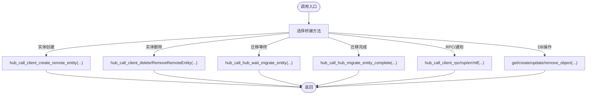
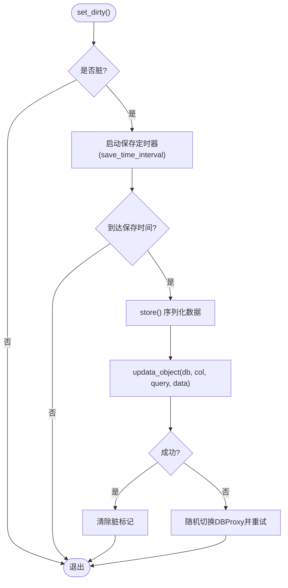
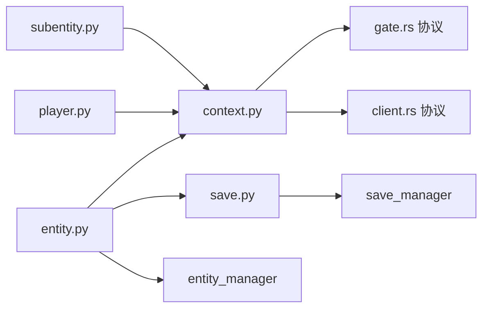

# 实体生命周期管理

<cite>
**本文引用的文件**
- [server/engine/base_entity.py](file://server/engine/base_entity.py)
- [server/engine/entity.py](file://server/engine/entity.py)
- [server/engine/context.py](file://server/engine/context.py)
- [server/engine/get_guid.py](file://server/engine/get_guid.py)
- [server/engine/save.py](file://server/engine/save.py)
- [server/engine/subentity.py](file://server/engine/subentity.py)
- [server/engine/player.py](file://server/engine/player.py)
- [crates/proto/src/gate.rs](file://crates/proto/src/gate.rs)
- [crates/proto/src/client.rs](file://crates/proto/src/client.rs)
</cite>

## 目录
1. [引言](#引言)
2. [项目结构](#项目结构)
3. [核心组件](#核心组件)
4. [架构总览](#架构总览)
5. [详细组件分析](#详细组件分析)
6. [依赖分析](#依赖分析)
7. [性能考虑](#性能考虑)
8. [故障排查指南](#故障排查指南)
9. [结论](#结论)
10. [附录：使用示例与最佳实践](#附录使用示例与最佳实践)

## 引言
本文件围绕“实体生命周期管理”主题，系统梳理实体从创建到销毁的全过程，涵盖实体初始化、状态变更（活跃/休眠/临时）、资源分配与释放、迁移与清理等关键环节，并结合仓库中的服务端引擎实现进行深入解析。同时提供性能优化建议、常见问题排查方法以及可直接参考的代码片段路径，帮助读者在工程实践中正确管理实体生命周期。

## 项目结构
本仓库采用多语言混合工程组织方式，服务端以 Python 引擎为核心，配合 Rust 协议定义与客户端 SDK（TypeScript/Python）。与实体生命周期密切相关的模块主要位于 server/engine 目录，涉及基础实体基类、实体抽象类、上下文桥接、持久化与迁移、子实体与玩家实体等。

图表来源
- [server/engine/base_entity.py:1-26](file://server/engine/base_entity.py#L1-L26)
- [server/engine/entity.py:1-194](file://server/engine/entity.py#L1-L194)
- [server/engine/context.py:1-173](file://server/engine/context.py#L1-L173)
- [server/engine/get_guid.py:1-28](file://server/engine/get_guid.py#L1-L28)
- [server/engine/save.py:1-108](file://server/engine/save.py#L1-L108)
- [server/engine/subentity.py:1-98](file://server/engine/subentity.py#L1-L98)
- [server/engine/player.py:1-108](file://server/engine/player.py#L1-L108)
- [crates/proto/src/gate.rs:1138-1155](file://crates/proto/src/gate.rs#L1138-L1155)
- [crates/proto/src/client.rs:95-186](file://crates/proto/src/client.rs#L95-L186)

章节来源
- [server/engine/base_entity.py:1-26](file://server/engine/base_entity.py#L1-L26)
- [server/engine/entity.py:1-194](file://server/engine/entity.py#L1-L194)
- [server/engine/context.py:1-173](file://server/engine/context.py#L1-L173)
- [server/engine/get_guid.py:1-28](file://server/engine/get_guid.py#L1-L28)
- [server/engine/save.py:1-108](file://server/engine/save.py#L1-L108)
- [server/engine/subentity.py:1-98](file://server/engine/subentity.py#L1-L98)
- [server/engine/player.py:1-108](file://server/engine/player.py#L1-L108)
- [crates/proto/src/gate.rs:1138-1155](file://crates/proto/src/gate.rs#L1138-L1155)
- [crates/proto/src/client.rs:95-186](file://crates/proto/src/client.rs#L95-L186)

## 核心组件
- 基础实体基类：提供实体类型与实体 ID 的统一承载，以及日志接口。
- 实体抽象类：定义实体的网络回调注册、远程调用、迁移与销毁流程。
- 上下文桥接：封装与网关/枢纽/数据库代理等外部系统的通信接口。
- 持久化与保存：基于定时器的脏标记驱动保存策略，支持加载或创建。
- 子实体与玩家实体：分别用于跨服务调用与客户端交互的轻量实体。
- ID 生成：异步获取全局唯一 ID 的工具。

章节来源
- [server/engine/base_entity.py:1-26](file://server/engine/base_entity.py#L1-L26)
- [server/engine/entity.py:1-194](file://server/engine/entity.py#L1-L194)
- [server/engine/context.py:1-173](file://server/engine/context.py#L1-L173)
- [server/engine/save.py:1-108](file://server/engine/save.py#L1-L108)
- [server/engine/subentity.py:1-98](file://server/engine/subentity.py#L1-L98)
- [server/engine/player.py:1-108](file://server/engine/player.py#L1-L108)
- [server/engine/get_guid.py:1-28](file://server/engine/get_guid.py#L1-L28)

## 架构总览
实体生命周期贯穿“创建—运行—迁移—销毁”四个阶段。服务端通过实体抽象类完成实体注册、回调绑定、远程调用与迁移协调；上下文桥接负责与网关、枢纽、数据库代理等系统交互；持久化模块负责数据落盘与恢复；协议层提供跨语言的消息契约。

图表来源
- [server/engine/entity.py:86-96](file://server/engine/entity.py#L86-L96)
- [server/engine/entity.py:64-84](file://server/engine/entity.py#L64-L84)
- [server/engine/context.py:105-136](file://server/engine/context.py#L105-L136)
- [server/engine/save.py:63-81](file://server/engine/save.py#L63-L81)
- [crates/proto/src/gate.rs:1138-1155](file://crates/proto/src/gate.rs#L1138-L1155)
- [crates/proto/src/client.rs:95-186](file://crates/proto/src/client.rs#L95-L186)

## 详细组件分析

### 基础实体基类（base_entity）
- 职责：统一承载实体类型与实体 ID，并提供日志能力。
- 关键点：日志方法通过应用上下文输出，便于追踪实体生命周期事件。

章节来源
- [server/engine/base_entity.py:1-26](file://server/engine/base_entity.py#L1-L26)

### 实体抽象类与实体管理（entity 与 entity_manager）
- 初始化与注册
  - 构造时记录服务名、实体类型、实体 ID、是否动态迁移。
  - 注册回调字典：枢纽请求/通知、客户端请求/通知。
  - 动态实体按周期触发迁移尝试。
  - 将实体加入全局实体管理器。
- 状态与迁移
  - 迁移尝试：非空闲状态下按概率触发迁移。
  - 启动迁移：向入口枢纽查询目标枢纽并广播等待迁移消息。
  - 迁移完成：向关联枢纽/网关广播完成消息，并执行迁移后清理。
- 远程实体创建
  - 创建客户端远端实体：向指定网关广播创建消息。
  - 创建枢纽内实体：向指定枢纽广播创建消息。
- 回调与RPC
  - 注册/分发枢纽请求/通知。
  - 注册/分发客户端请求/通知。
  - 统一响应/错误/通知发送接口。
- 实体管理器
  - 提供添加、查询、删除实体。
  - 处理连接更新（重连/刷新）并向网关广播。

图表来源
- [server/engine/base_entity.py:1-26](file://server/engine/base_entity.py#L1-L26)
- [server/engine/entity.py:8-35](file://server/engine/entity.py#L8-L35)
- [server/engine/entity.py:45-84](file://server/engine/entity.py#L45-L84)
- [server/engine/entity.py:86-163](file://server/engine/entity.py#L86-L163)
- [server/engine/entity.py:164-194](file://server/engine/entity.py#L164-L194)

章节来源
- [server/engine/entity.py:1-194](file://server/engine/entity.py#L1-L194)
- [server/engine/entity.py:164-194](file://server/engine/entity.py#L164-L194)

### 上下文桥接（context）
- 职责：封装与网关、枢纽、数据库代理的通信接口，屏蔽底层细节。
- 关键能力：
  - 服务注册、健康状态设置、时间偏移与缓存刷新。
  - 入口服务查询（枢纽/网关）。
  - 实体创建/删除/刷新、RPC/通知/响应/错误转发。
  - 迁移等待/创建/完成、踢人/替换等运维操作。
  - 数据库代理对象的增删改查与计数。

图表来源
- [server/engine/context.py:72-136](file://server/engine/context.py#L72-L136)
- [server/engine/context.py:151-173](file://server/engine/context.py#L151-L173)

章节来源
- [server/engine/context.py:1-173](file://server/engine/context.py#L1-L173)

### 持久化与保存（save 与 save_manager）
- 脏标记与定时保存：实体被标记为脏后，按配置的时间间隔触发保存。
- 加载或创建：优先从数据库读取，不存在则创建新对象并写入。
- 回调重试：保存失败时随机切换数据库代理并重试。
- 保存管理器：维护实体 ID 到保存对象的映射，支持遍历与删除。

图表来源
- [server/engine/save.py:28-53](file://server/engine/save.py#L28-L53)
- [server/engine/save.py:63-81](file://server/engine/save.py#L63-L81)
- [server/engine/save.py:96-108](file://server/engine/save.py#L96-L108)

章节来源
- [server/engine/save.py:1-108](file://server/engine/save.py#L1-L108)

### 子实体与玩家实体（subentity 与 player）
- 子实体：用于跨枢纽调用，支持迁移期间的消息缓存与重放。
- 玩家实体：面向客户端的请求/响应/通知处理，维护回调映射与消息编号。

章节来源
- [server/engine/subentity.py:1-98](file://server/engine/subentity.py#L1-L98)
- [server/engine/player.py:1-108](file://server/engine/player.py#L1-L108)

### ID 生成（get_guid）
- 通过数据库代理异步获取全局唯一 ID，失败时随机切换代理并重试。

章节来源
- [server/engine/get_guid.py:1-28](file://server/engine/get_guid.py#L1-L28)

## 依赖分析
- 组件耦合
  - 实体抽象类依赖上下文桥接进行网络与DB操作。
  - 实体管理器与保存管理器分别管理实体集合与持久化对象。
  - 子实体与玩家实体通过应用上下文与实体/保存管理器交互。
- 外部依赖
  - 协议层（Rust）定义了枢纽/网关/客户端之间的消息契约，实体生命周期中的创建/删除/迁移/通知均以协议消息形式传递。

图表来源
- [server/engine/entity.py:1-194](file://server/engine/entity.py#L1-L194)
- [server/engine/context.py:1-173](file://server/engine/context.py#L1-L173)
- [server/engine/save.py:1-108](file://server/engine/save.py#L1-L108)
- [server/engine/subentity.py:1-98](file://server/engine/subentity.py#L1-L98)
- [server/engine/player.py:1-108](file://server/engine/player.py#L1-L108)
- [crates/proto/src/gate.rs:1138-1155](file://crates/proto/src/gate.rs#L1138-L1155)
- [crates/proto/src/client.rs:95-186](file://crates/proto/src/client.rs#L95-L186)

## 性能考虑
- 迁移策略
  - 动态实体仅在非空闲时按概率触发迁移，降低抖动风险。
  - 迁移前广播等待消息，确保上下游一致。
- 保存策略
  - 脏标记+定时器合并写入，减少频繁 IO。
  - 失败重试与代理切换提升可用性。
- 回调与消息
  - 使用字典快速查找回调，避免线性扫描。
  - 客户端批量通知使用多播接口，减少重复网络调用。
- 日志与诊断
  - 基于实体类型的统一日志前缀，便于定位问题。

[本节为通用性能建议，不直接分析具体文件，故无章节来源]

## 故障排查指南
- 实体未创建/未显示
  - 检查实体创建流程与远端实体广播是否成功。
  - 参考路径：[server/engine/entity.py:86-96](file://server/engine/entity.py#L86-L96)，[server/engine/context.py:105-115](file://server/engine/context.py#L105-L115)
- 迁移卡住
  - 确认等待迁移与迁移完成消息是否成对出现。
  - 参考路径：[server/engine/entity.py:64-84](file://server/engine/entity.py#L64-L84)，[crates/proto/src/gate.rs:1138-1155](file://crates/proto/src/gate.rs#L1138-L1155)
- 保存失败/数据不同步
  - 观察脏标记与保存定时器是否触发，检查 DB 代理回调。
  - 参考路径：[server/engine/save.py:28-53](file://server/engine/save.py#L28-L53)，[server/engine/save.py:100-108](file://server/engine/save.py#L100-L108)
- 回调丢失/响应超时
  - 核对消息编号递增与回调表清理逻辑。
  - 参考路径：[server/engine/player.py:33-53](file://server/engine/player.py#L33-L53)，[server/engine/subentity.py:25-45](file://server/engine/subentity.py#L25-L45)

章节来源
- [server/engine/entity.py:64-96](file://server/engine/entity.py#L64-L96)
- [server/engine/context.py:105-115](file://server/engine/context.py#L105-L115)
- [server/engine/save.py:28-53](file://server/engine/save.py#L28-L53)
- [server/engine/player.py:33-53](file://server/engine/player.py#L33-L53)
- [server/engine/subentity.py:25-45](file://server/engine/subentity.py#L25-L45)
- [crates/proto/src/gate.rs:1138-1155](file://crates/proto/src/gate.rs#L1138-L1155)

## 结论
该生命周期管理方案以实体抽象类为核心，结合上下文桥接与协议层，实现了从创建、运行、迁移至销毁的闭环管理。通过脏标记保存、迁移等待/完成广播、回调映射与消息缓存等机制，兼顾了可靠性与性能。建议在实际工程中严格遵循实体注册、回调绑定、迁移与销毁的流程，并结合日志与监控进行持续优化。

[本节为总结性内容，不直接分析具体文件，故无章节来源]

## 附录：使用示例与最佳实践
- 实体创建流程
  - 步骤要点：实体类型校验、实体 ID 生成、属性初始化、回调注册、远端实体创建广播。
  - 参考路径：[server/engine/get_guid.py:19-28](file://server/engine/get_guid.py#L19-L28)，[server/engine/entity.py:86-96](file://server/engine/entity.py#L86-L96)
- 实体状态管理
  - 活跃：正常处理请求/通知。
  - 临时：迁移期间缓存消息，迁移完成后重放。
  - 休眠：由业务策略决定，通常与保存/迁移协同。
  - 参考路径：[server/engine/subentity.py:77-82](file://server/engine/subentity.py#L77-L82)，[server/engine/entity.py:64-84](file://server/engine/entity.py#L64-L84)
- 销毁流程
  - 清理步骤：解除引用、注销事件、资源回收、广播删除消息、内存释放。
  - 参考路径：[server/engine/entity.py:45-49](file://server/engine/entity.py#L45-L49)，[server/engine/entity.py:192-194](file://server/engine/entity.py#L192-L194)，[server/engine/context.py:105-115](file://server/engine/context.py#L105-L115)
- 性能优化建议
  - 合理设置迁移与保存周期，避免频繁 IO 与网络广播。
  - 使用批量通知与回调复用，减少对象创建与 GC 压力。
  - 对关键路径增加日志埋点，结合监控指标进行容量规划。
- 最佳实践
  - 在实体构造时即完成回调注册与必要资源预分配。
  - 迁移前后保持状态一致性，确保消息幂等或具备去重能力。
  - 对外暴露统一的生命周期钩子，便于扩展与测试。

章节来源
- [server/engine/get_guid.py:19-28](file://server/engine/get_guid.py#L19-L28)
- [server/engine/entity.py:45-96](file://server/engine/entity.py#L45-L96)
- [server/engine/entity.py:192-194](file://server/engine/entity.py#L192-L194)
- [server/engine/context.py:105-115](file://server/engine/context.py#L105-L115)
- [server/engine/subentity.py:77-82](file://server/engine/subentity.py#L77-L82)