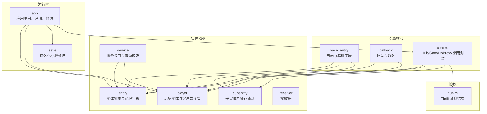
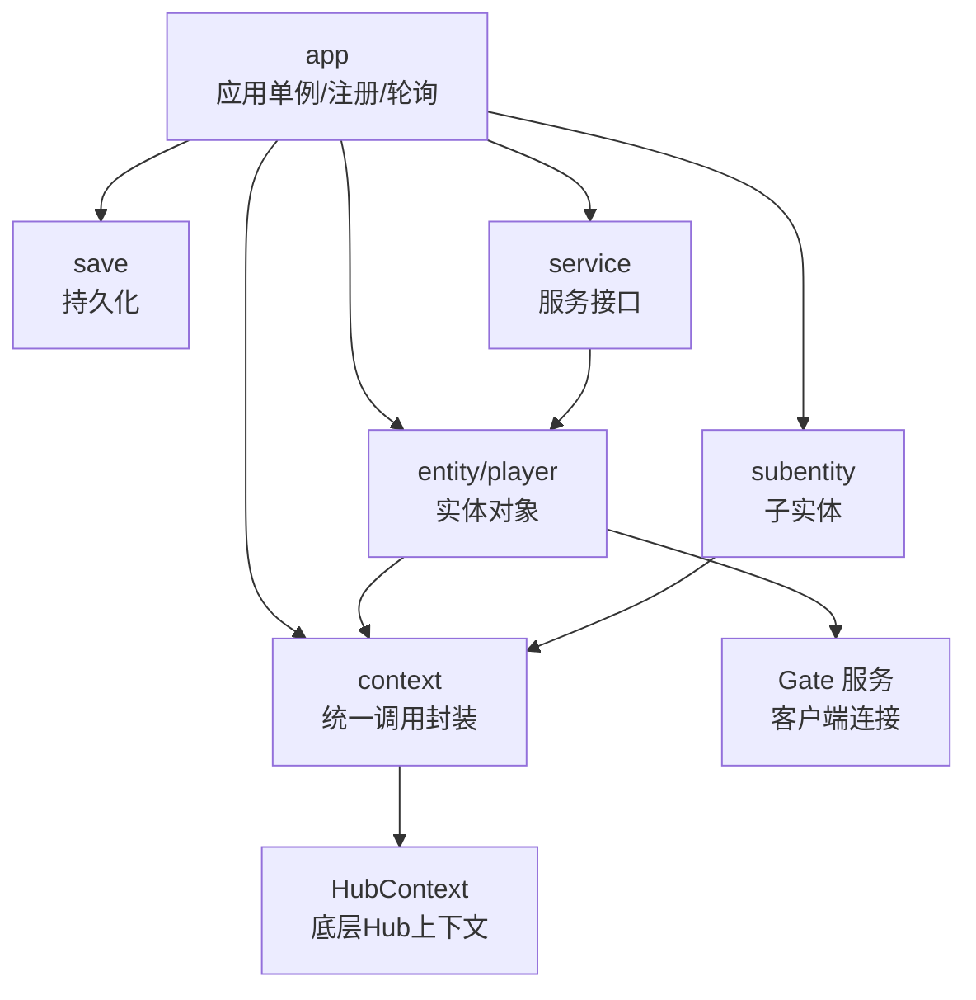
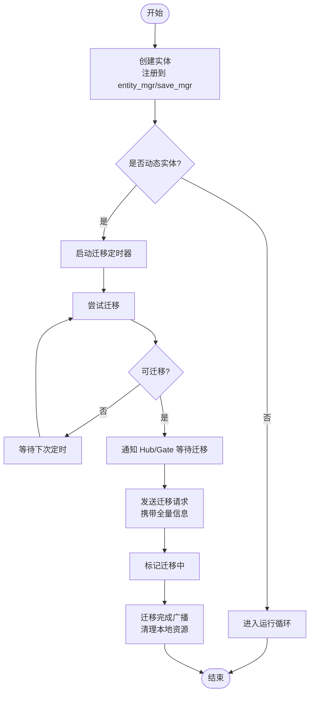
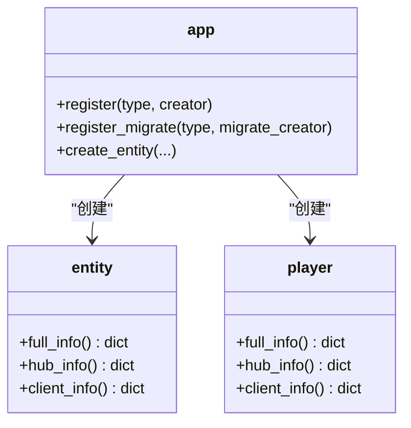
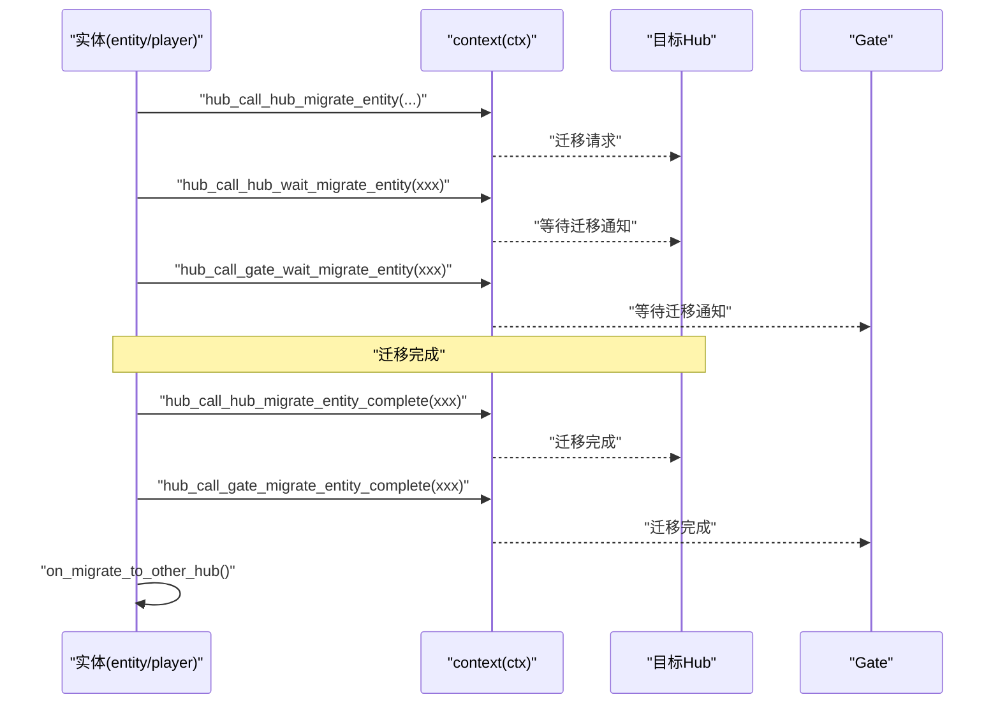
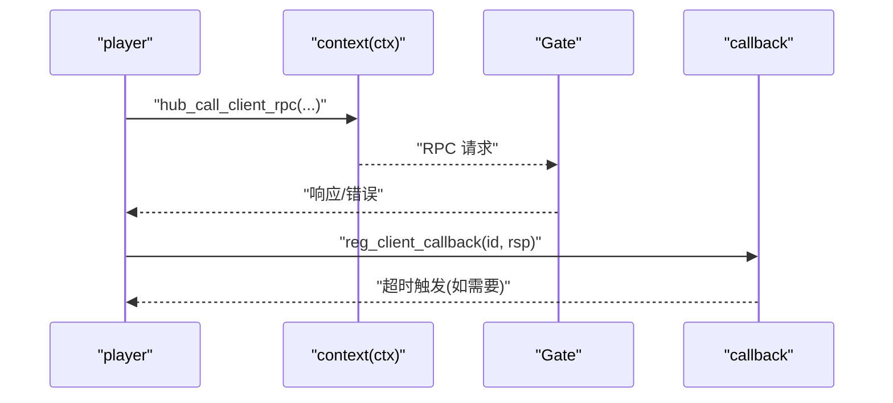
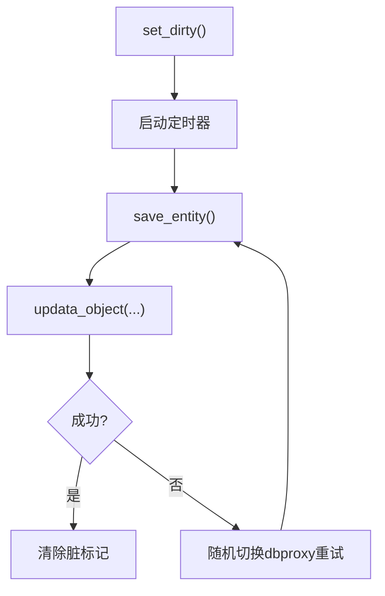
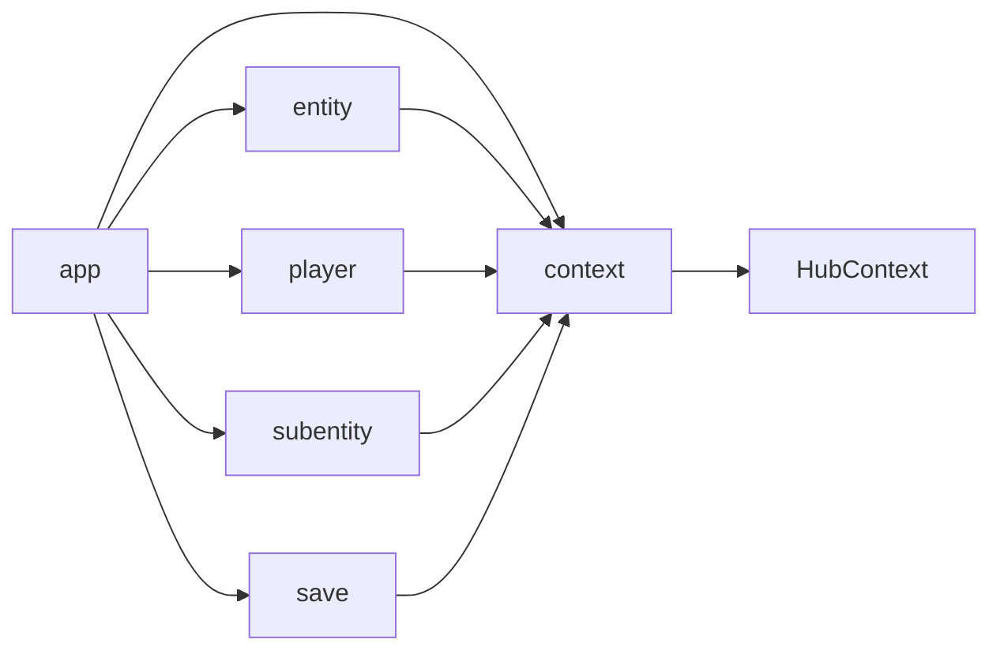

# 实体管理系统

<cite>
**本文引用的文件**   
- [server/engine/base_entity.py](file://server/engine/base_entity.py)
- [server/engine/entity.py](file://server/engine/entity.py)
- [server/engine/player.py](file://server/engine/player.py)
- [server/engine/subentity.py](file://server/engine/subentity.py)
- [server/engine/callback.py](file://server/engine/callback.py)
- [server/engine/context.py](file://server/engine/context.py)
- [server/engine/app.py](file://server/engine/app.py)
- [server/engine/save.py](file://server/engine/save.py)
- [server/engine/service.py](file://server/engine/service.py)
- [server/engine/receiver.py](file://server/engine/receiver.py)
- [crates/proto/src/hub.rs](file://crates/proto/src/hub.rs)
</cite>

## 目录
1. [简介](#简介)
2. [项目结构](#项目结构)
3. [核心组件](#核心组件)
4. [架构总览](#架构总览)
5. [详细组件分析](#详细组件分析)
6. [依赖分析](#依赖分析)
7. [性能考虑](#性能考虑)
8. [故障排查指南](#故障排查指南)
9. [结论](#结论)
10. [附录](#附录)

## 简介
本技术文档围绕 geese 的实体管理系统，系统性阐述实体生命周期（创建、初始化、状态更新、销毁与迁移）、实体类型系统与动态扩展、跨服实体迁移机制（状态同步、连接转移、数据一致性）、SubEntity 子实体管理、事件与回调、异步处理以及性能优化策略。文档面向游戏开发者与系统架构师，既提供高层设计视图，也给出代码级关系与流程图，帮助快速理解与落地。

## 项目结构
实体管理相关代码主要集中在 server/engine 目录，采用“按职责分层”的组织方式：
- 基类与通用能力：base_entity、callback、context
- 实体与玩家：entity、player
- 子实体：subentity
- 生命周期与持久化：save
- 服务与路由：service
- 应用入口与注册：app
- 接收器：receiver
- 协议与消息：crates/proto/src/hub.rs



**图表来源**
- [server/engine/base_entity.py:1-26](file://server/engine/base_entity.py#L1-L26)
- [server/engine/callback.py:1-23](file://server/engine/callback.py#L1-L23)
- [server/engine/context.py:1-173](file://server/engine/context.py#L1-L173)
- [server/engine/entity.py:1-194](file://server/engine/entity.py#L1-L194)
- [server/engine/player.py:1-295](file://server/engine/player.py#L1-L295)
- [server/engine/subentity.py:1-98](file://server/engine/subentity.py#L1-L98)
- [server/engine/service.py:1-75](file://server/engine/service.py#L1-L75)
- [server/engine/receiver.py:1-39](file://server/engine/receiver.py#L1-L39)
- [server/engine/app.py:1-233](file://server/engine/app.py#L1-L233)
- [server/engine/save.py:1-108](file://server/engine/save.py#L1-L108)
- [crates/proto/src/hub.rs:1-800](file://crates/proto/src/hub.rs#L1-L800)

**章节来源**
- [server/engine/app.py:83-132](file://server/engine/app.py#L83-L132)
- [server/engine/context.py:13-173](file://server/engine/context.py#L13-L173)

## 核心组件
- 基类与日志：base_entity 提供实体类型与实体 ID，并统一输出 trace/debug/info/warn/error 日志。
- 回调与超时：callback 封装 RPC 回调、错误回调与超时 Timer。
- 上下文桥接：context 对 HubContext 进行二次封装，暴露统一的跨服/客户端调用方法。
- 实体抽象：entity 定义实体的全量/服务端/客户端信息导出、请求/通知回调注册、远程实体创建、跨服迁移与完成通知等。
- 玩家实体：player 继承自 base_entity，扩展客户端连接、主连接切换、迁移与刷新逻辑。
- 子实体：subentity 表达“从属实体”，在迁移期间缓存消息并在迁移完成后恢复通信。
- 持久化：save 抽象实体的存储/加载/保存，支持脏标记与定时保存。
- 服务：service 定义服务接口，负责实体迁移后的接管与查询转发。
- 接收器：receiver 用于监听来自其他 Hub 的通知。
- 应用：app 提供单例、服务注册、实体创建/迁移注册、轮询与协程调度。

**章节来源**
- [server/engine/base_entity.py:3-26](file://server/engine/base_entity.py#L3-L26)
- [server/engine/callback.py:5-23](file://server/engine/callback.py#L5-L23)
- [server/engine/context.py:13-173](file://server/engine/context.py#L13-L173)
- [server/engine/entity.py:8-194](file://server/engine/entity.py#L8-L194)
- [server/engine/player.py:11-295](file://server/engine/player.py#L11-L295)
- [server/engine/subentity.py:8-98](file://server/engine/subentity.py#L8-L98)
- [server/engine/save.py:17-108](file://server/engine/save.py#L17-L108)
- [server/engine/service.py:8-75](file://server/engine/service.py#L8-L75)
- [server/engine/receiver.py:5-39](file://server/engine/receiver.py#L5-L39)
- [server/engine/app.py:54-233](file://server/engine/app.py#L54-L233)

## 架构总览
实体管理贯穿 Hub 与 Gate 之间的交互，通过 context 统一调用，结合 app 的注册与轮询，形成完整的生命周期闭环。



**图表来源**
- [server/engine/app.py:54-132](file://server/engine/app.py#L54-L132)
- [server/engine/context.py:13-173](file://server/engine/context.py#L13-L173)
- [server/engine/entity.py:8-194](file://server/engine/entity.py#L8-L194)
- [server/engine/player.py:11-295](file://server/engine/player.py#L11-L295)
- [server/engine/subentity.py:8-98](file://server/engine/subentity.py#L8-L98)
- [server/engine/save.py:17-108](file://server/engine/save.py#L17-L108)
- [server/engine/service.py:8-75](file://server/engine/service.py#L8-L75)

## 详细组件分析

### 实体生命周期管理
- 创建与初始化
  - 通过 app.register 注册实体类型与构造器；创建时由 app 调用具体构造器生成实体实例。
  - 实体构造中会向 app.entity_mgr 注册自身，并根据 is_dynamic 决定是否启动迁移定时器。
- 状态更新
  - save 抽象通过 set_dirty 标记脏数据，并按 save_time_interval 触发定时保存。
  - 实体可通过 full_info/hub_info/client_info 导出不同层级信息，用于跨服同步或客户端展示。
- 销毁
  - 实体销毁时需从 entity_mgr 与 save_mgr 中移除，避免悬挂引用。
- 迁移
  - 动态实体周期性尝试迁移；发起迁移前向关联的 Hub/Gate 发送等待迁移通知，随后进入迁移中状态。
  - 迁移完成后，向 Hub/Gate 广播迁移完成通知，并触发 on_migrate_to_other_hub 清理本地资源。



**图表来源**
- [server/engine/entity.py:50-85](file://server/engine/entity.py#L50-L85)
- [server/engine/entity.py:164-194](file://server/engine/entity.py#L164-L194)
- [server/engine/save.py:28-53](file://server/engine/save.py#L28-L53)
- [server/engine/app.py:111-121](file://server/engine/app.py#L111-L121)

**章节来源**
- [server/engine/entity.py:8-194](file://server/engine/entity.py#L8-L194)
- [server/engine/save.py:17-108](file://server/engine/save.py#L17-L108)
- [server/engine/app.py:111-121](file://server/engine/app.py#L111-L121)

### 实体类型系统与动态扩展
- 类型注册
  - app.register(entity_type, creator) 将实体类型映射到构造器；app.create_entity(is_migrate, entity_type, ...) 通过类型查找并创建实体。
  - app.register_migrate(entity_type, migrate_creator) 注册迁移时的重建器，迁移完成后由 service.on_migrate 接管。
- 动态实体
  - entity/player 在 is_dynamic=true 时启动迁移定时器，按 migrate_time_interval 随机触发迁移尝试。
- 自定义属性
  - 实体通过 full_info/hub_info/client_info 返回字典，作为序列化参数传递给远端，实现自定义属性的动态扩展。



**图表来源**
- [server/engine/app.py:111-128](file://server/engine/app.py#L111-L128)
- [server/engine/entity.py:33-43](file://server/engine/entity.py#L33-L43)
- [server/engine/player.py:42-52](file://server/engine/player.py#L42-L52)

**章节来源**
- [server/engine/app.py:111-128](file://server/engine/app.py#L111-L128)
- [server/engine/entity.py:33-43](file://server/engine/entity.py#L33-L43)
- [server/engine/player.py:42-52](file://server/engine/player.py#L42-L52)

### 跨服实体迁移机制
- 启动迁移
  - 通过 ctx.hub_call_hub_migrate_entity 发起迁移，携带 service_name、entity_type、entity_id、连接列表与全量信息。
  - 向所有关联 Hub/Gate 发送等待迁移通知，防止并发写入。
- 迁移完成
  - 通过 ctx.hub_call_hub_migrate_entity_complete 与 ctx.hub_call_gate_migrate_entity_complete 广播完成，随后执行 on_migrate_to_other_hub 清理。
- 连接转移与重连
  - 通过 ctx.hub_call_client_refresh_entity 或 ctx.hub_call_client_create_remote_entity 同步客户端连接状态。
  - 迁移期间若发生连接替换，使用 ctx.hub_call_replace_client 并设置超时 Timer，超时后触发 transfer_timeout 处理。



**图表来源**
- [server/engine/entity.py:64-84](file://server/engine/entity.py#L64-L84)
- [server/engine/player.py:72-98](file://server/engine/player.py#L72-L98)
- [server/engine/context.py:93-149](file://server/engine/context.py#L93-L149)

**章节来源**
- [server/engine/entity.py:64-84](file://server/engine/entity.py#L64-L84)
- [server/engine/player.py:72-98](file://server/engine/player.py#L72-L98)
- [server/engine/context.py:93-149](file://server/engine/context.py#L93-L149)

### SubEntity 子实体管理
- 设计目的
  - 子实体用于表达“附属”实体，常伴随主实体迁移；在迁移过程中缓存消息，迁移完成后恢复通信。
- 关键行为
  - call_hub_request/call_hub_notify 在非迁移状态下直接发送；处于迁移状态时将消息缓存至 cache_msg。
  - do_cache_msg 在迁移完成后清空缓存并恢复通信。
  - 支持注册 hub_notify 回调与响应回调，配合 callback 超时机制。

```mermaid
classDiagram
class subentity {
+request_msg_cb_id : int
+hub_notify_callback : map
+hub_callback : map
+cache_msg : list
+call_hub_request(method, argvs) int
+call_hub_notify(method, argvs)
+do_cache_msg(hub_name)
}
class callback {
+callback(rsp, err)
+timeout(ms, cb)
}
subentity --> callback : "注册回调"
```

**图表来源**
- [server/engine/subentity.py:8-98](file://server/engine/subentity.py#L8-L98)
- [server/engine/callback.py:5-23](file://server/engine/callback.py#L5-L23)

**章节来源**
- [server/engine/subentity.py:8-98](file://server/engine/subentity.py#L8-L98)
- [server/engine/callback.py:5-23](file://server/engine/callback.py#L5-L23)

### 事件系统、回调机制与异步处理
- 请求/响应与通知
  - 实体与玩家分别维护 hub_request_callback/hub_notify_callback 与 client_request_callback/client_notify_callback，分别处理来自 Hub 与客户端的消息。
  - 响应通过 ctx.hub_call_hub_rsp/hub_call_client_rsp/hub_call_client_err 分发。
- 异步与协程
  - app.run_coroutine_async 将协程提交到 asyncio loop；player 的迁移流程使用 async/await。
  - app.poll 通过线程轮询连接与数据库消息泵，维持健康状态与空闲检测。
- 超时与释放
  - callback.timeout 设置超时回调，Timer 到期后调用 __call_timeout__，必要时调用 release_handle 释放资源。



**图表来源**
- [server/engine/player.py:149-216](file://server/engine/player.py#L149-L216)
- [server/engine/callback.py:17-23](file://server/engine/callback.py#L17-L23)
- [server/engine/context.py:117-130](file://server/engine/context.py#L117-L130)

**章节来源**
- [server/engine/player.py:149-216](file://server/engine/player.py#L149-L216)
- [server/engine/callback.py:17-23](file://server/engine/callback.py#L17-L23)
- [server/engine/app.py:193-233](file://server/engine/app.py#L193-L233)

### 数据一致性与持久化
- 脏标记与定时保存
  - save.set_dirty 标记脏数据，按 save_time_interval 启动定时器触发保存。
  - 保存失败时随机切换 dbproxy 并重试，确保最终一致。
- 加载与创建
  - 通过 save.load_or_create_entity 异步加载或创建对象，异常时自动切换 dbproxy 并重试。



**图表来源**
- [server/engine/save.py:28-53](file://server/engine/save.py#L28-L53)
- [server/engine/save.py:54-81](file://server/engine/save.py#L54-L81)

**章节来源**
- [server/engine/save.py:28-81](file://server/engine/save.py#L28-L81)

### 协议与消息结构
- Hub/Gate/RPC/迁移相关消息结构由 hub.rs 自动生成，涵盖：
  - CreateServiceEntity：服务端创建实体
  - ClientCallRpc/ClientCallRsp：客户端 RPC 请求与响应
  - TransferEntityControl/KickOffClient/ClientDisconnnect：连接控制与断开
  - Hub 间迁移通知与完成消息

这些结构与 context 的方法一一对应，确保跨语言/跨进程的一致性。

**章节来源**
- [crates/proto/src/hub.rs:988-1011](file://crates/proto/src/hub.rs#L988-L1011)
- [crates/proto/src/hub.rs:651-800](file://crates/proto/src/hub.rs#L651-L800)

## 依赖分析
- 组件耦合
  - entity/player 依赖 base_entity、callback、context；通过 app.entity_mgr 与 app.save_mgr 管理生命周期。
  - subentity 依赖 base_entity 与 callback，通过 app.subentity_mgr 管理。
  - app 作为中心枢纽，注册服务、实体与迁移处理器，驱动轮询与协程。
- 外部依赖
  - context 依赖 HubContext，封装 RPC/通知/迁移/客户端操作。
  - save 依赖 dbproxy 与 redis（分布式锁）。



**图表来源**
- [server/engine/app.py:54-132](file://server/engine/app.py#L54-L132)
- [server/engine/entity.py:8-194](file://server/engine/entity.py#L8-L194)
- [server/engine/player.py:11-295](file://server/engine/player.py#L11-L295)
- [server/engine/subentity.py:8-98](file://server/engine/subentity.py#L8-L98)
- [server/engine/save.py:17-108](file://server/engine/save.py#L17-L108)
- [server/engine/context.py:13-173](file://server/engine/context.py#L13-L173)

**章节来源**
- [server/engine/app.py:54-132](file://server/engine/app.py#L54-L132)
- [server/engine/entity.py:8-194](file://server/engine/entity.py#L8-L194)
- [server/engine/player.py:11-295](file://server/engine/player.py#L11-L295)
- [server/engine/subentity.py:8-98](file://server/engine/subentity.py#L8-L98)
- [server/engine/save.py:17-108](file://server/engine/save.py#L17-L108)
- [server/engine/context.py:13-173](file://server/engine/context.py#L13-L173)

## 性能考虑
- 空闲检测与健康上报
  - app.poll 统计轮询耗时，超过阈值标记为繁忙，降低 save/migrate 触发频率，避免雪崩。
- 定时器与批处理
  - save 使用定时器合并保存，减少频繁 IO。
  - entity/player 的迁移尝试采用随机概率与定时器，避免同时大量迁移。
- 异步与线程
  - 使用 asyncio loop 与独立线程处理消息泵，提升吞吐。
- 缓存与延迟
  - subentity 在迁移期间缓存消息，减少重复网络往返。
- 内存与 GC
  - 及时从 entity_mgr/save_mgr/subentity_mgr 删除已销毁实体，避免长尾内存占用。
- 批量操作
  - 通过 service.forward_client_query_service_ext 批量转发客户端查询，减少网络往返。

**章节来源**
- [server/engine/app.py:197-233](file://server/engine/app.py#L197-L233)
- [server/engine/save.py:28-53](file://server/engine/save.py#L28-L53)
- [server/engine/entity.py:50-62](file://server/engine/entity.py#L50-L62)
- [server/engine/player.py:59-71](file://server/engine/player.py#L59-L71)
- [server/engine/subentity.py:77-82](file://server/engine/subentity.py#L77-L82)

## 故障排查指南
- 日志定位
  - 所有实体均继承 base_entity，统一通过 app.ctx.log 输出 trace/debug/info/warn/error，便于问题定位。
- 未处理回调
  - 当收到未注册的请求/通知时，实体会记录错误日志，检查回调注册是否遗漏。
- 迁移卡顿
  - 若迁移长时间未完成，检查 hub_call_hub_wait_migrate_entity/hub_call_gate_wait_migrate_entity 是否被正确调用与响应。
- 保存失败
  - save.save_entity 失败时会切换 dbproxy 并重试；若持续失败，检查 dbproxy 服务与网络。
- 超时未回调
  - callback.timeout 未触发时，确认 Timer 是否被取消或阻塞。

**章节来源**
- [server/engine/base_entity.py:8-26](file://server/engine/base_entity.py#L8-L26)
- [server/engine/entity.py:98-110](file://server/engine/entity.py#L98-L110)
- [server/engine/player.py:116-128](file://server/engine/player.py#L116-L128)
- [server/engine/save.py:35-41](file://server/engine/save.py#L35-L41)
- [server/engine/callback.py:17-23](file://server/engine/callback.py#L17-L23)

## 结论
geese 实体管理系统以清晰的分层与统一的上下文封装，实现了实体生命周期的完整闭环、动态类型扩展、跨服迁移与一致性保障、子实体的缓存与恢复、完善的事件与回调体系以及高效的异步与持久化策略。该方案适合高并发、多服协同的游戏场景，具备良好的可扩展性与稳定性。

## 附录
- 关键流程速查
  - 实体创建：app.register → app.create_entity → entity_mgr/save_mgr 注册
  - 迁移启动：try_migrate_entity → hub_call_hub_migrate_entity → 等待迁移 → 迁移完成广播
  - 客户端同步：hub_call_client_create_remote_entity/hub_call_client_refresh_entity
  - 子实体迁移：cache_msg + do_cache_msg
  - 持久化：set_dirty + 定时保存 + 失败重试