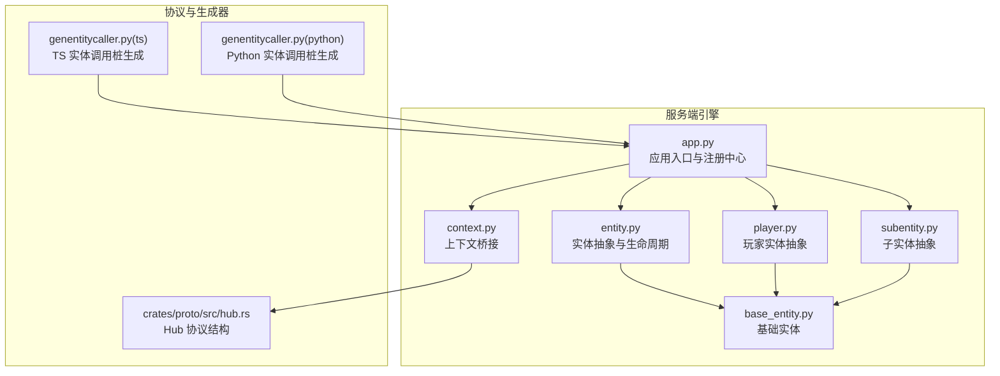
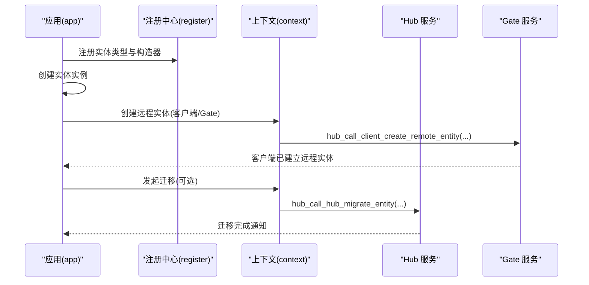
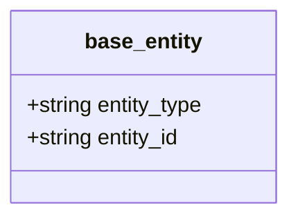
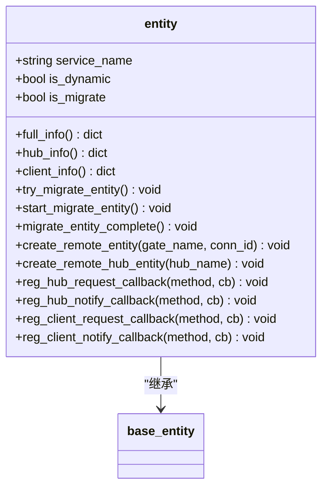
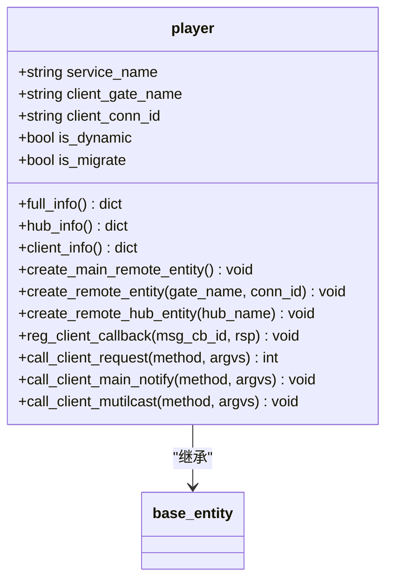
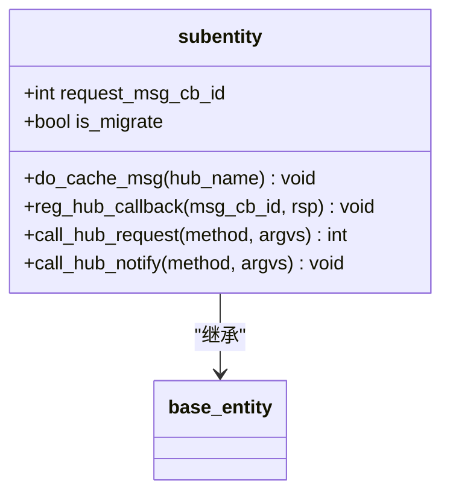
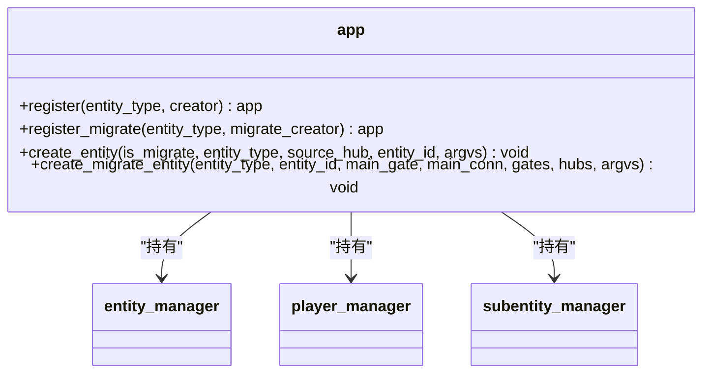
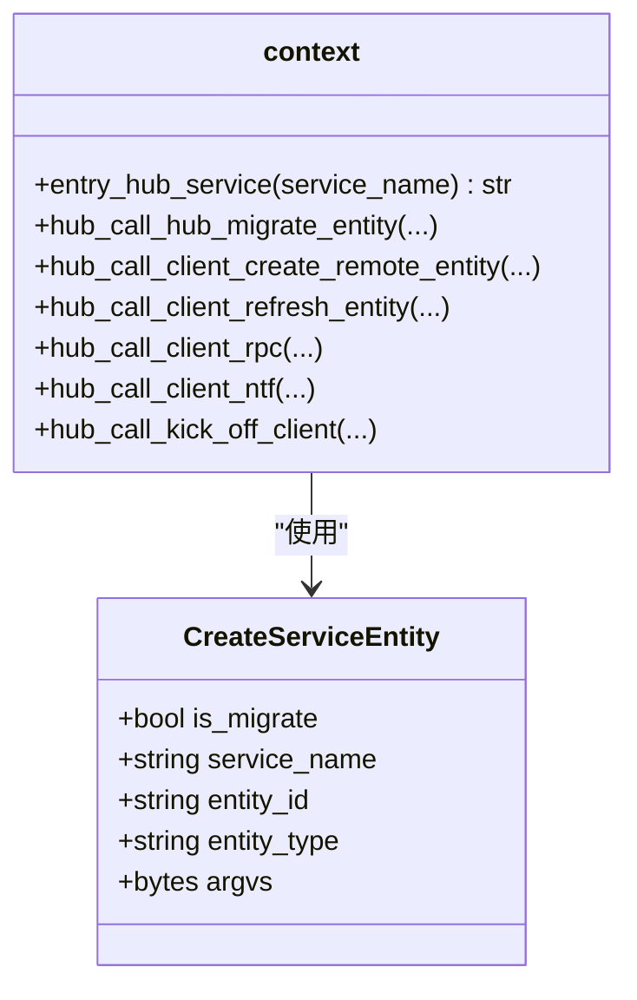
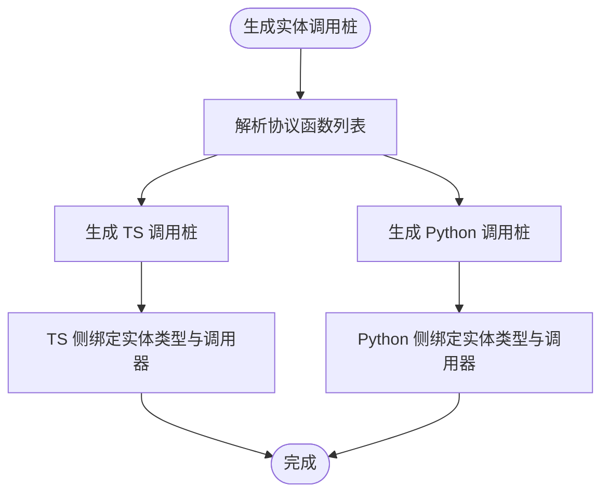
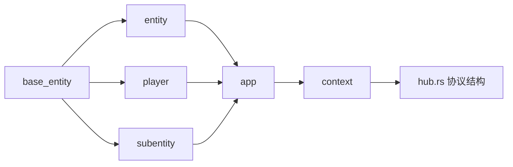

# 实体类型系统

<cite>
**本文引用的文件**
- [server/engine/base_entity.py](file://server/engine/base_entity.py)
- [server/engine/entity.py](file://server/engine/entity.py)
- [server/engine/player.py](file://server/engine/player.py)
- [server/engine/subentity.py](file://server/engine/subentity.py)
- [server/engine/app.py](file://server/engine/app.py)
- [server/engine/context.py](file://server/engine/context.py)
- [crates/proto/src/hub.rs](file://crates/proto/src/hub.rs)
- [rpc/gen/client_call_hub/ts/genentitycaller.py](file://rpc/gen/client_call_hub/ts/genentitycaller.py)
- [rpc/gen/client_call_hub/python/genentitycaller.py](file://rpc/gen/client_call_hub/python/genentitycaller.py)
- [rpc/gen/hub_call_client/python/genentitycaller.py](file://rpc/gen/hub_call_client/python/genentitycaller.py)
- [expand/ts/engine/base_entity.ts](file://expand/ts/engine/base_entity.ts)
- [expand/ts/engine/player.ts](file://expand/ts/engine/player.ts)
- [expand/ts/engine/subentity.ts](file://expand/ts/engine/subentity.ts)
</cite>

## 目录
1. [引言](#引言)
2. [项目结构](#项目结构)
3. [核心组件](#核心组件)
4. [架构总览](#架构总览)
5. [详细组件分析](#详细组件分析)
6. [依赖分析](#依赖分析)
7. [性能考量](#性能考量)
8. [故障排查指南](#故障排查指南)
9. [结论](#结论)
10. [附录：实体类型最佳实践与示例](#附录实体类型最佳实践与示例)

## 引言
本文件面向“实体类型系统”的技术文档，围绕实体类型的定义机制（动态注册、类型继承、属性元数据）、实体类型分类（玩家、NPC、物品、场景等）、扩展机制（自定义类型创建、属性定义、行为实现）、实体类型与实例的关系（类型验证、实例化、类型转换）以及最佳实践展开。文档同时给出基于仓库中现有实现的架构图、时序图与流程图，帮助读者快速理解并正确使用该系统。

## 项目结构
实体类型系统主要由服务端引擎层与跨语言生成器组成：
- 服务端引擎层：Python 实现的实体基类、实体管理器、上下文桥接、应用入口等
- 跨语言生成器：根据协议生成客户端/服务端调用桩代码，支撑实体类型在多语言环境下的统一交互
- 协议层：Rust Thrift 定义了实体迁移、远程实体创建、广播通知等消息契约

图表来源
- [server/engine/app.py:54-132](file://server/engine/app.py#L54-L132)
- [server/engine/entity.py:8-35](file://server/engine/entity.py#L8-L35)
- [server/engine/player.py:11-52](file://server/engine/player.py#L11-L52)
- [server/engine/subentity.py:8-24](file://server/engine/subentity.py#L8-L24)
- [server/engine/base_entity.py:3-6](file://server/engine/base_entity.py#L3-L6)
- [server/engine/context.py:13-173](file://server/engine/context.py#L13-L173)
- [crates/proto/src/hub.rs:992-1095](file://crates/proto/src/hub.rs#L992-L1095)
- [rpc/gen/client_call_hub/ts/genentitycaller.py:10-20](file://rpc/gen/client_call_hub/ts/genentitycaller.py#L10-L20)
- [rpc/gen/client_call_hub/python/genentitycaller.py:10-18](file://rpc/gen/client_call_hub/python/genentitycaller.py#L10-L18)
- [rpc/gen/hub_call_client/python/genentitycaller.py:10-18](file://rpc/gen/hub_call_client/python/genentitycaller.py#L10-L18)

章节来源
- [server/engine/app.py:54-132](file://server/engine/app.py#L54-L132)
- [server/engine/entity.py:8-35](file://server/engine/entity.py#L8-L35)
- [server/engine/player.py:11-52](file://server/engine/player.py#L11-L52)
- [server/engine/subentity.py:8-24](file://server/engine/subentity.py#L8-L24)
- [server/engine/base_entity.py:3-6](file://server/engine/base_entity.py#L3-L6)
- [server/engine/context.py:13-173](file://server/engine/context.py#L13-L173)
- [crates/proto/src/hub.rs:992-1095](file://crates/proto/src/hub.rs#L992-L1095)
- [rpc/gen/client_call_hub/ts/genentitycaller.py:10-20](file://rpc/gen/client_call_hub/ts/genentitycaller.py#L10-L20)
- [rpc/gen/client_call_hub/python/genentitycaller.py:10-18](file://rpc/gen/client_call_hub/python/genentitycaller.py#L10-L18)
- [rpc/gen/hub_call_client/python/genentitycaller.py:10-18](file://rpc/gen/hub_call_client/python/genentitycaller.py#L10-L18)

## 核心组件
- 基础实体 base_entity：所有实体的最小公共字段（类型标识、实体标识）
- 实体 entity：抽象实体，负责与 Hub/Gate 的通信、回调注册、远程实体创建、迁移流程
- 玩家 player：面向玩家会话的实体抽象，包含客户端连接信息、回调映射、主/副连接刷新逻辑
- 子实体 subentity：轻量实体，用于跨 Hub 的请求/通知，具备迁移缓存能力
- 应用 app：全局单例，维护实体/玩家/子实体管理器，提供实体注册与迁移创建接口
- 上下文 context：对底层 HubContext 的封装，提供 RPC/通知/迁移/踢人等跨网络调用
- 协议结构 hub.rs：定义实体迁移、远程实体创建等消息结构，作为跨语言契约

章节来源
- [server/engine/base_entity.py:3-6](file://server/engine/base_entity.py#L3-L6)
- [server/engine/entity.py:8-35](file://server/engine/entity.py#L8-L35)
- [server/engine/player.py:11-52](file://server/engine/player.py#L11-L52)
- [server/engine/subentity.py:8-24](file://server/engine/subentity.py#L8-L24)
- [server/engine/app.py:54-132](file://server/engine/app.py#L54-L132)
- [server/engine/context.py:13-173](file://server/engine/context.py#L13-L173)
- [crates/proto/src/hub.rs:992-1095](file://crates/proto/src/hub.rs#L992-L1095)

## 架构总览
实体类型系统通过“类型注册—实例化—远程同步—迁移—销毁”闭环实现跨服务、跨网关的实体管理。应用层通过注册表将实体类型与构造器绑定；运行时按需创建实体实例；通过上下文桥接进行跨节点通信；支持动态迁移与缓存消息以保证一致性。

图表来源
- [server/engine/app.py:111-129](file://server/engine/app.py#L111-L129)
- [server/engine/context.py:105-115](file://server/engine/context.py#L105-L115)
- [server/engine/context.py:99-103](file://server/engine/context.py#L99-L103)

## 详细组件分析

### 组件一：基础实体与类型标识
- base_entity 提供实体类型与实体 ID 的最小集合，是所有实体类型的父类
- 类型标识用于区分不同实体类别（如玩家、NPC、物品、场景），ID 用于唯一性与路由

图表来源
- [server/engine/base_entity.py:3-6](file://server/engine/base_entity.py#L3-L6)

章节来源
- [server/engine/base_entity.py:3-6](file://server/engine/base_entity.py#L3-L6)

### 组件二：实体抽象与生命周期
- entity 抽象类定义了实体的三大信息视图（完整/仅 Hub/仅客户端），并提供 Hub/Gate 间的消息回调注册与响应
- 支持动态实体迁移：定时尝试迁移、发起迁移、迁移完成通知、清理本地状态
- 提供创建远程实体（到客户端或 Hub）与批量通知能力

图表来源
- [server/engine/entity.py:8-35](file://server/engine/entity.py#L8-L35)
- [server/engine/entity.py:45-85](file://server/engine/entity.py#L45-L85)
- [server/engine/entity.py:86-163](file://server/engine/entity.py#L86-L163)
- [server/engine/base_entity.py:3-6](file://server/engine/base_entity.py#L3-L6)

章节来源
- [server/engine/entity.py:8-35](file://server/engine/entity.py#L8-L35)
- [server/engine/entity.py:45-85](file://server/engine/entity.py#L45-L85)
- [server/engine/entity.py:86-163](file://server/engine/entity.py#L86-L163)

### 组件三：玩家实体与会话管理
- player 面向玩家会话，维护客户端连接信息、请求回调映射、主/副连接刷新
- 支持主动迁移、迁移完成后的状态清理
- 提供主实体创建、远程实体创建、多播通知等能力

图表来源
- [server/engine/player.py:11-52](file://server/engine/player.py#L11-L52)
- [server/engine/player.py:100-217](file://server/engine/player.py#L100-L217)
- [server/engine/base_entity.py:3-6](file://server/engine/base_entity.py#L3-L6)

章节来源
- [server/engine/player.py:11-52](file://server/engine/player.py#L11-L52)
- [server/engine/player.py:100-217](file://server/engine/player.py#L100-L217)

### 组件四：子实体与跨 Hub 通信
- subentity 用于轻量实体，支持 Hub 侧请求/通知回调、迁移期间的消息缓存与重放
- 提供请求回调注册、通知发送、缓存消息执行等能力

图表来源
- [server/engine/subentity.py:8-24](file://server/engine/subentity.py#L8-L24)
- [server/engine/subentity.py:57-82](file://server/engine/subentity.py#L57-L82)
- [server/engine/base_entity.py:3-6](file://server/engine/base_entity.py#L3-L6)

章节来源
- [server/engine/subentity.py:8-24](file://server/engine/subentity.py#L8-L24)
- [server/engine/subentity.py:57-82](file://server/engine/subentity.py#L57-L82)

### 组件五：应用注册与实体管理
- app 提供实体类型注册（register）、迁移创建（register_migrate/create_migrate_entity）、实体创建（create_entity）
- 维护实体管理器、玩家管理器、子实体管理器、接收器管理器等
- 提供分布式锁、协程调度、轮询循环等基础设施

图表来源
- [server/engine/app.py:54-132](file://server/engine/app.py#L54-L132)
- [server/engine/entity.py:164-194](file://server/engine/entity.py#L164-L194)
- [server/engine/player.py:223-295](file://server/engine/player.py#L223-L295)
- [server/engine/subentity.py:84-98](file://server/engine/subentity.py#L84-L98)

章节来源
- [server/engine/app.py:54-132](file://server/engine/app.py#L54-L132)
- [server/engine/entity.py:164-194](file://server/engine/entity.py#L164-L194)
- [server/engine/player.py:223-295](file://server/engine/player.py#L223-L295)
- [server/engine/subentity.py:84-98](file://server/engine/subentity.py#L84-L98)

### 组件六：上下文桥接与协议契约
- context 对底层 HubContext 的封装，提供 RPC/通知/迁移/踢人等跨网络调用
- hub.rs 定义了实体迁移、远程实体创建等结构，作为跨语言契约

图表来源
- [server/engine/context.py:13-173](file://server/engine/context.py#L13-L173)
- [crates/proto/src/hub.rs:992-1095](file://crates/proto/src/hub.rs#L992-L1095)

章节来源
- [server/engine/context.py:13-173](file://server/engine/context.py#L13-L173)
- [crates/proto/src/hub.rs:992-1095](file://crates/proto/src/hub.rs#L992-L1095)

### 组件七：跨语言调用桩与类型使用
- TS/Python 生成器根据协议生成实体调用桩，支持客户端/服务端双向调用
- 生成桩中将实体类型与调用器绑定，便于在客户端/服务端侧直接发起 RPC/通知

图表来源
- [rpc/gen/client_call_hub/ts/genentitycaller.py:10-20](file://rpc/gen/client_call_hub/ts/genentitycaller.py#L10-L20)
- [rpc/gen/client_call_hub/python/genentitycaller.py:10-18](file://rpc/gen/client_call_hub/python/genentitycaller.py#L10-L18)
- [rpc/gen/hub_call_client/python/genentitycaller.py:10-18](file://rpc/gen/hub_call_client/python/genentitycaller.py#L10-L18)

章节来源
- [rpc/gen/client_call_hub/ts/genentitycaller.py:10-20](file://rpc/gen/client_call_hub/ts/genentitycaller.py#L10-L20)
- [rpc/gen/client_call_hub/python/genentitycaller.py:10-18](file://rpc/gen/client_call_hub/python/genentitycaller.py#L10-L18)
- [rpc/gen/hub_call_client/python/genentitycaller.py:10-18](file://rpc/gen/hub_call_client/python/genentitycaller.py#L10-L18)

## 依赖分析
- 继承关系：entity/player/subentity 均继承 base_entity，形成统一的类型标识与日志接口
- 耦合度：实体抽象依赖 app 与 context 进行生命周期管理与跨节点通信；app 持有各管理器
- 外部依赖：context 依赖底层 HubContext；生成器依赖协议定义

图表来源
- [server/engine/base_entity.py:3-6](file://server/engine/base_entity.py#L3-L6)
- [server/engine/entity.py:8-35](file://server/engine/entity.py#L8-L35)
- [server/engine/player.py:11-52](file://server/engine/player.py#L11-L52)
- [server/engine/subentity.py:8-24](file://server/engine/subentity.py#L8-L24)
- [server/engine/app.py:54-132](file://server/engine/app.py#L54-L132)
- [server/engine/context.py:13-173](file://server/engine/context.py#L13-L173)
- [crates/proto/src/hub.rs:992-1095](file://crates/proto/src/hub.rs#L992-L1095)

章节来源
- [server/engine/base_entity.py:3-6](file://server/engine/base_entity.py#L3-L6)
- [server/engine/entity.py:8-35](file://server/engine/entity.py#L8-L35)
- [server/engine/player.py:11-52](file://server/engine/player.py#L11-L52)
- [server/engine/subentity.py:8-24](file://server/engine/subentity.py#L8-L24)
- [server/engine/app.py:54-132](file://server/engine/app.py#L54-L132)
- [server/engine/context.py:13-173](file://server/engine/context.py#L13-L173)
- [crates/proto/src/hub.rs:992-1095](file://crates/proto/src/hub.rs#L992-L1095)

## 性能考量
- 动态迁移策略：实体在空闲状态下按概率触发迁移，降低高峰负载；迁移完成后清理本地状态，避免资源泄漏
- 回调与消息队列：实体/玩家/子实体均维护回调映射与消息缓存，在迁移期间缓存消息，迁移后重放，确保一致性
- 日志与健康状态：应用轮询周期内统计忙闲状态，设置健康状态，便于运维监控与自动扩缩容

章节来源
- [server/engine/entity.py:50-85](file://server/engine/entity.py#L50-L85)
- [server/engine/player.py:72-99](file://server/engine/player.py#L72-L99)
- [server/engine/subentity.py:77-82](file://server/engine/subentity.py#L77-L82)
- [server/engine/app.py:197-233](file://server/engine/app.py#L197-L233)

## 故障排查指南
- 未处理请求/通知：实体在收到未知方法时会记录错误日志，检查回调注册是否遗漏
- 迁移异常：迁移过程中若源 Hub/Gate 未确认，检查迁移完成通知链路；迁移完成后清理失败会导致状态不一致
- 客户端连接刷新：主/副连接刷新时需确保实体 ID 与连接 ID 映射正确，避免重复创建或删除
- 分布式锁：分布式锁获取失败或释放异常会影响并发控制，检查 Redis 可用性与键值一致性

章节来源
- [server/engine/entity.py:98-110](file://server/engine/entity.py#L98-L110)
- [server/engine/entity.py:131-143](file://server/engine/entity.py#L131-L143)
- [server/engine/player.py:116-129](file://server/engine/player.py#L116-L129)
- [server/engine/player.py:178-184](file://server/engine/player.py#L178-L184)
- [server/engine/app.py:133-149](file://server/engine/app.py#L133-L149)

## 结论
实体类型系统通过清晰的类型标识、统一的基类抽象、完善的生命周期管理与跨节点通信机制，实现了动态实体注册、类型继承与属性元数据管理。结合生成器与协议契约，系统在多语言环境下保持一致的实体交互体验。建议在实际工程中遵循类型命名规范、合理组织属性与行为、关注迁移与缓存策略，以获得更优的稳定性与性能表现。

## 附录：实体类型最佳实践与示例
- 类型命名规范
  - 使用语义明确的类型名，避免缩写；建议采用“领域_对象_用途”的组合
  - 区分玩家实体与非玩家实体，便于权限与生命周期管理
- 属性组织原则
  - 将只读元数据与可变状态分离；通过 info 视图导出不同粒度的数据
  - 使用字典结构承载属性，便于序列化与跨语言传输
- 行为实现方式
  - 将业务行为拆分为独立方法，通过回调注册与 RPC 调用解耦
  - 对外暴露的 RPC 方法应具备幂等性与超时控制
- 实例化与类型转换
  - 在 app.register 中绑定实体类型与构造器；迁移时通过 app.register_migrate 与 app.create_migrate_entity 完成类型转换
  - 远程实体创建时，确保客户端/Gate 侧的实体视图与 Hub 侧一致
- 具体实现示例与使用场景
  - 玩家实体：登录成功后创建主实体，随后根据需要创建子实体（如宠物、载具）
  - NPC 实体：按场景加载，通过 Hub 广播通知客户端更新
  - 物品实体：在背包/仓库模块中创建，支持跨 Hub 迁移与持久化
  - 场景实体：负责区域级事件与状态同步，配合多播通知

章节来源
- [server/engine/app.py:111-129](file://server/engine/app.py#L111-L129)
- [server/engine/entity.py:86-163](file://server/engine/entity.py#L86-L163)
- [server/engine/player.py:100-217](file://server/engine/player.py#L100-L217)
- [server/engine/subentity.py:57-82](file://server/engine/subentity.py#L57-L82)
- [crates/proto/src/hub.rs:992-1095](file://crates/proto/src/hub.rs#L992-L1095)