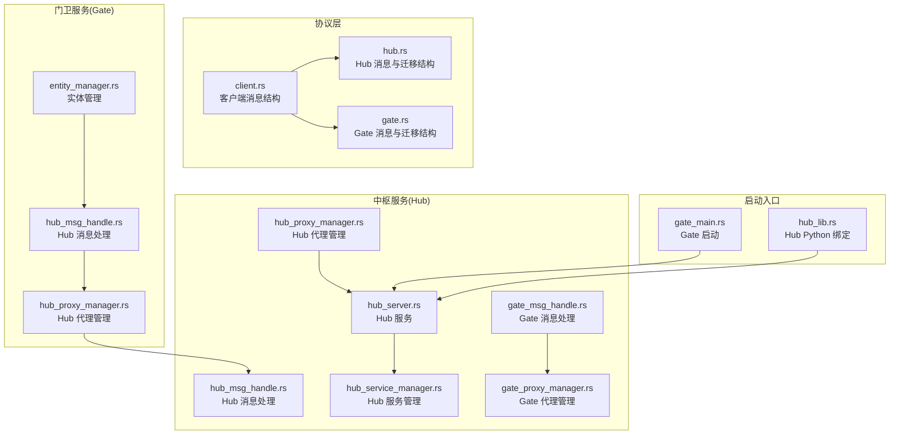
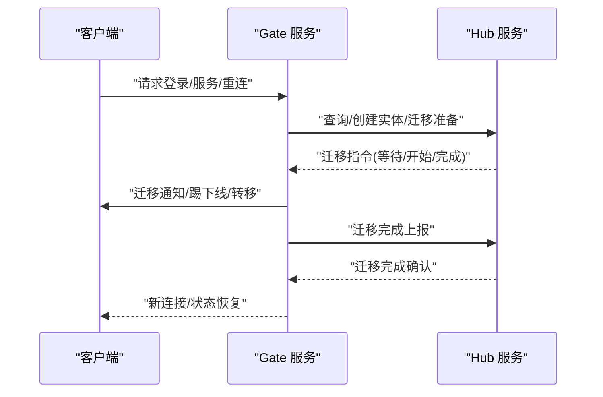
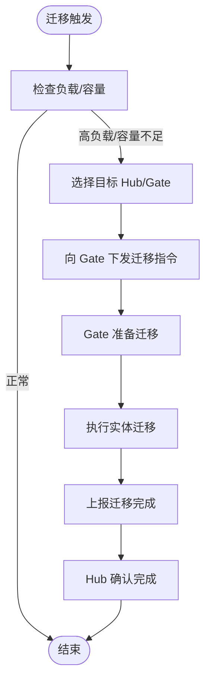
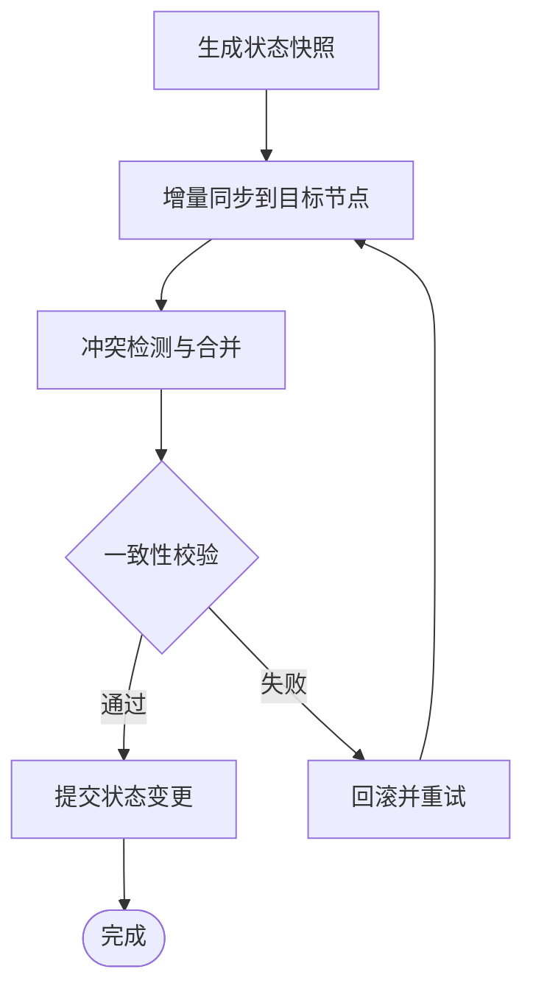
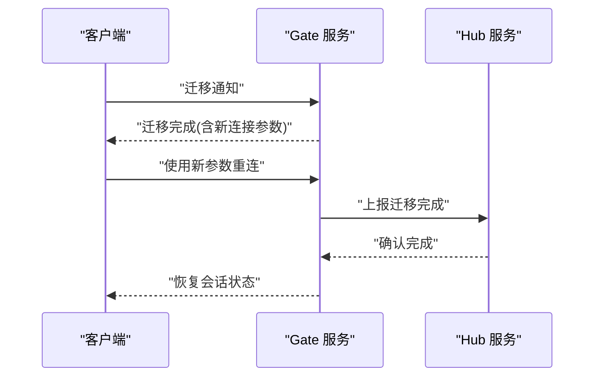
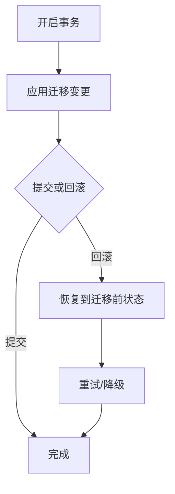
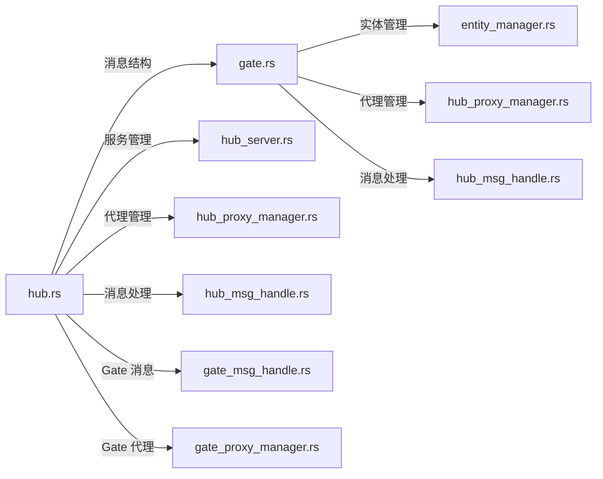

# 跨服实体迁移

<cite>
**本文引用的文件**
- [crates/proto/src/hub.rs](file://crates/proto/src/hub.rs)
- [crates/proto/src/gate.rs](file://crates/proto/src/gate.rs)
- [crates/proto/src/client.rs](file://crates/proto/src/client.rs)
- [server/lib/gate/src/entity_manager.rs](file://server/lib/gate/src/entity_manager.rs)
- [server/lib/gate/src/hub_msg_handle.rs](file://server/lib/gate/src/hub_msg_handle.rs)
- [server/lib/gate/src/hub_proxy_manager.rs](file://server/lib/gate/src/hub_proxy_manager.rs)
- [server/lib/hub/src/hub_msg_handle.rs](file://server/lib/hub/src/hub_msg_handle.rs)
- [server/lib/hub/src/hub_proxy_manager.rs](file://server/lib/hub/src/hub_proxy_manager.rs)
- [server/lib/hub/src/hub_server.rs](file://server/lib/hub/src/hub_server.rs)
- [server/lib/hub/src/hub_service_manager.rs](file://server/lib/hub/src/hub_service_manager.rs)
- [server/lib/hub/src/gate_msg_handle.rs](file://server/lib/hub/src/gate_msg_handle.rs)
- [server/lib/hub/src/gate_proxy_manager.rs](file://server/lib/hub/src/gate_proxy_manager.rs)
- [server/src/gate_main.rs](file://server/src/gate_main.rs)
- [server/src/hub_lib.rs](file://server/src/hub_lib.rs)
</cite>

## 目录
1. [引言](#引言)
2. [项目结构](#项目结构)
3. [核心组件](#核心组件)
4. [架构总览](#架构总览)
5. [详细组件分析](#详细组件分析)
6. [依赖关系分析](#依赖关系分析)
7. [性能考量](#性能考量)
8. [故障排查指南](#故障排查指南)
9. [结论](#结论)
10. [附录](#附录)

## 引言
本技术文档围绕跨服实体迁移机制展开，系统性阐述以下主题：
- 实体迁移的触发条件与决策机制：涵盖负载均衡、服务重启、故障转移等场景下的迁移策略。
- 实体状态同步：状态快照生成、增量同步、冲突解决与一致性保障。
- 连接转移：客户端重连、会话保持、连接状态恢复与网络切换处理。
- 数据完整性：事务处理、回滚机制与错误恢复策略。
- 性能优化：批量迁移、并行处理与资源调度。
- 监控与调试：迁移过程可观测性与常见问题排查。

## 项目结构
该仓库采用多语言混合工程，核心迁移协议由 Rust 的 Thrift 宏生成，服务端以 Rust 实现，前端 SDK 提供 TypeScript/Python 等绑定。迁移相关的关键模块分布如下：
- 协议层（crates/proto）：定义 Hub/Gate 间的消息类型与迁移控制结构。
- 门卫服务（server/lib/gate）：负责客户端接入、实体管理与迁移协调。
- 中枢服务（server/lib/hub）：负责服务注册、路由、实体迁移编排与完成确认。
- 启动入口（server/src）：Gate/Hub 服务启动与健康检查注册。

**图表来源**
- [crates/proto/src/hub.rs](file://crates/proto/src/hub.rs)
- [crates/proto/src/gate.rs](file://crates/proto/src/gate.rs)
- [crates/proto/src/client.rs](file://crates/proto/src/client.rs)
- [server/lib/gate/src/entity_manager.rs](file://server/lib/gate/src/entity_manager.rs)
- [server/lib/gate/src/hub_msg_handle.rs](file://server/lib/gate/src/hub_msg_handle.rs)
- [server/lib/gate/src/hub_proxy_manager.rs](file://server/lib/gate/src/hub_proxy_manager.rs)
- [server/lib/hub/src/hub_msg_handle.rs](file://server/lib/hub/src/hub_msg_handle.rs)
- [server/lib/hub/src/hub_proxy_manager.rs](file://server/lib/hub/src/hub_proxy_manager.rs)
- [server/lib/hub/src/hub_server.rs](file://server/lib/hub/src/hub_server.rs)
- [server/lib/hub/src/hub_service_manager.rs](file://server/lib/hub/src/hub_service_manager.rs)
- [server/lib/hub/src/gate_msg_handle.rs](file://server/lib/hub/src/gate_msg_handle.rs)
- [server/lib/hub/src/gate_proxy_manager.rs](file://server/lib/hub/src/gate_proxy_manager.rs)
- [server/src/gate_main.rs](file://server/src/gate_main.rs)
- [server/src/hub_lib.rs](file://server/src/hub_lib.rs)

**章节来源**
- [server/src/gate_main.rs](file://server/src/gate_main.rs)
- [server/src/hub_lib.rs](file://server/src/hub_lib.rs)

## 核心组件
- 迁移控制结构
  - Hub 侧：等待迁移、发起迁移、创建迁移实体、迁移完成等消息结构，用于编排跨服迁移流程。
  - Gate 侧：迁移实体控制、迁移完成等消息结构，用于在网关层执行迁移动作与通知。
- 实体管理
  - Gate 实体管理器负责实体生命周期、连接与迁移准备；Hub 服务管理器负责服务发现与迁移目标选择。
- 消息处理与代理
  - Gate/Hub 的消息处理器负责解析与转发迁移相关消息；代理管理器负责与远端 Hub/Gate 建立与维护连接。

**章节来源**
- [crates/proto/src/hub.rs](file://crates/proto/src/hub.rs)
- [crates/proto/src/gate.rs](file://crates/proto/src/gate.rs)
- [server/lib/gate/src/entity_manager.rs](file://server/lib/gate/src/entity_manager.rs)
- [server/lib/gate/src/hub_msg_handle.rs](file://server/lib/gate/src/hub_msg_handle.rs)
- [server/lib/gate/src/hub_proxy_manager.rs](file://server/lib/gate/src/hub_proxy_manager.rs)
- [server/lib/hub/src/hub_msg_handle.rs](file://server/lib/hub/src/hub_msg_handle.rs)
- [server/lib/hub/src/hub_proxy_manager.rs](file://server/lib/hub/src/hub_proxy_manager.rs)
- [server/lib/hub/src/hub_server.rs](file://server/lib/hub/src/hub_server.rs)
- [server/lib/hub/src/hub_service_manager.rs](file://server/lib/hub/src/hub_service_manager.rs)
- [server/lib/hub/src/gate_msg_handle.rs](file://server/lib/hub/src/gate_msg_handle.rs)
- [server/lib/hub/src/gate_proxy_manager.rs](file://server/lib/hub/src/gate_proxy_manager.rs)

## 架构总览
跨服实体迁移的整体流程由 Hub 发起，Gate 执行，最终通过 Hub 完成确认。迁移消息在 Hub/Gate 之间以 Thrift 结构传输，确保类型安全与序列化一致性。

**图表来源**
- [crates/proto/src/hub.rs](file://crates/proto/src/hub.rs)
- [crates/proto/src/gate.rs](file://crates/proto/src/gate.rs)
- [server/lib/gate/src/hub_msg_handle.rs](file://server/lib/gate/src/hub_msg_handle.rs)
- [server/lib/hub/src/hub_msg_handle.rs](file://server/lib/hub/src/hub_msg_handle.rs)

## 详细组件分析

### 迁移触发与决策机制
- 触发条件
  - 负载均衡：当目标 Hub/Gate 负载过高或容量不足时，Hub 发出迁移指令，促使 Gate 将部分实体迁移到其他节点。
  - 服务重启：在维护或滚动升级时，Hub 指示 Gate 将实体迁移至可用节点，避免业务中断。
  - 故障转移：当某节点不可用时，Hub 自动选择备用节点并下发迁移指令。
- 决策机制
  - Hub 侧根据服务注册中心信息与负载指标选择迁移目标；Gate 侧依据实体连接状态与迁移控制结构决定具体执行顺序与策略。

**图表来源**
- [crates/proto/src/hub.rs](file://crates/proto/src/hub.rs)
- [crates/proto/src/gate.rs](file://crates/proto/src/gate.rs)
- [server/lib/hub/src/hub_service_manager.rs](file://server/lib/hub/src/hub_service_manager.rs)
- [server/lib/gate/src/hub_msg_handle.rs](file://server/lib/gate/src/hub_msg_handle.rs)

**章节来源**
- [crates/proto/src/hub.rs](file://crates/proto/src/hub.rs)
- [crates/proto/src/gate.rs](file://crates/proto/src/gate.rs)
- [server/lib/hub/src/hub_service_manager.rs](file://server/lib/hub/src/hub_service_manager.rs)
- [server/lib/gate/src/hub_msg_handle.rs](file://server/lib/gate/src/hub_msg_handle.rs)

### 实体状态同步与一致性
- 状态快照生成
  - 在迁移前，Gate 对目标实体进行状态快照，记录关键字段与上下文，确保迁移后可恢复。
- 增量同步
  - 迁移过程中，Hub/Gate 通过消息通道对实体状态进行增量更新，减少全量同步开销。
- 冲突解决与一致性
  - 采用主从模型与版本号/时间戳机制，优先保留最新写入；若出现并发冲突，按预设规则进行合并或回滚。
- 完整性保护
  - 使用事务式消息与幂等操作，确保迁移期间的状态变更可回滚，避免脏读与不一致。

**图表来源**
- [crates/proto/src/hub.rs](file://crates/proto/src/hub.rs)
- [crates/proto/src/gate.rs](file://crates/proto/src/gate.rs)
- [server/lib/gate/src/entity_manager.rs](file://server/lib/gate/src/entity_manager.rs)
- [server/lib/hub/src/hub_msg_handle.rs](file://server/lib/hub/src/hub_msg_handle.rs)

**章节来源**
- [crates/proto/src/hub.rs](file://crates/proto/src/hub.rs)
- [crates/proto/src/gate.rs](file://crates/proto/src/gate.rs)
- [server/lib/gate/src/entity_manager.rs](file://server/lib/gate/src/entity_manager.rs)
- [server/lib/hub/src/hub_msg_handle.rs](file://server/lib/hub/src/hub_msg_handle.rs)

### 连接转移与会话保持
- 客户端重连
  - Gate 在迁移完成后向客户端发送“迁移完成”消息，并提供新的连接参数；客户端根据参数重新建立连接。
- 会话保持
  - 通过会话 ID 与连接 ID 的映射，在迁移前后维持会话上下文；必要时在 Hub 层缓存短期会话状态。
- 连接状态恢复
  - Gate 在迁移过程中暂停实体消息处理，迁移完成后恢复并补发必要的状态同步消息。
- 网络切换处理
  - 当客户端网络发生切换时，Gate 通过心跳与重连机制快速恢复；Hub 层记录切换轨迹以便审计与排障。

**图表来源**
- [crates/proto/src/gate.rs](file://crates/proto/src/gate.rs)
- [crates/proto/src/hub.rs](file://crates/proto/src/hub.rs)
- [server/lib/gate/src/hub_msg_handle.rs](file://server/lib/gate/src/hub_msg_handle.rs)
- [server/lib/hub/src/hub_msg_handle.rs](file://server/lib/hub/src/hub_msg_handle.rs)

**章节来源**
- [crates/proto/src/gate.rs](file://crates/proto/src/gate.rs)
- [crates/proto/src/hub.rs](file://crates/proto/src/hub.rs)
- [server/lib/gate/src/hub_msg_handle.rs](file://server/lib/gate/src/hub_msg_handle.rs)
- [server/lib/hub/src/hub_msg_handle.rs](file://server/lib/hub/src/hub_msg_handle.rs)

### 数据完整性保护与错误恢复
- 事务处理
  - 迁移过程中的状态变更采用事务封装，确保原子性；失败时整体回滚。
- 回滚机制
  - 通过日志与快照记录，支持在迁移失败时回退到迁移前状态。
- 错误恢复策略
  - 分阶段重试与超时控制；对不可恢复错误，触发降级与人工干预流程。

**图表来源**
- [crates/proto/src/hub.rs](file://crates/proto/src/hub.rs)
- [crates/proto/src/gate.rs](file://crates/proto/src/gate.rs)
- [server/lib/gate/src/entity_manager.rs](file://server/lib/gate/src/entity_manager.rs)
- [server/lib/hub/src/hub_msg_handle.rs](file://server/lib/hub/src/hub_msg_handle.rs)

**章节来源**
- [crates/proto/src/hub.rs](file://crates/proto/src/hub.rs)
- [crates/proto/src/gate.rs](file://crates/proto/src/gate.rs)
- [server/lib/gate/src/entity_manager.rs](file://server/lib/gate/src/entity_manager.rs)
- [server/lib/hub/src/hub_msg_handle.rs](file://server/lib/hub/src/hub_msg_handle.rs)

### 性能优化方案
- 批量迁移
  - 将多个实体的迁移打包为批次，减少消息往返与系统调用次数。
- 并行处理
  - 在 Gate/Hub 两端对不同实体或不同节点的迁移任务并行执行，提升吞吐。
- 资源调度
  - 基于负载与容量动态分配迁移任务，避免热点节点过载；结合队列与限流策略稳定系统。

**章节来源**
- [server/lib/gate/src/entity_manager.rs](file://server/lib/gate/src/entity_manager.rs)
- [server/lib/hub/src/hub_service_manager.rs](file://server/lib/hub/src/hub_service_manager.rs)
- [server/lib/gate/src/hub_msg_handle.rs](file://server/lib/gate/src/hub_msg_handle.rs)
- [server/lib/hub/src/hub_msg_handle.rs](file://server/lib/hub/src/hub_msg_handle.rs)

## 依赖关系分析
- 协议依赖
  - Hub/Gate 间通过 Thrift 结构传递迁移消息，确保类型安全与跨语言兼容。
- 组件耦合
  - Gate 的实体管理与 Hub 的服务管理存在强耦合，需通过代理管理器与消息处理模块解耦。
- 外部依赖
  - 服务注册与健康检查依赖 Consul；日志与追踪依赖 Jaeger；Redis 用于会话与状态缓存。

**图表来源**
- [crates/proto/src/hub.rs](file://crates/proto/src/hub.rs)
- [crates/proto/src/gate.rs](file://crates/proto/src/gate.rs)
- [server/lib/gate/src/entity_manager.rs](file://server/lib/gate/src/entity_manager.rs)
- [server/lib/gate/src/hub_msg_handle.rs](file://server/lib/gate/src/hub_msg_handle.rs)
- [server/lib/gate/src/hub_proxy_manager.rs](file://server/lib/gate/src/hub_proxy_manager.rs)
- [server/lib/hub/src/hub_msg_handle.rs](file://server/lib/hub/src/hub_msg_handle.rs)
- [server/lib/hub/src/hub_proxy_manager.rs](file://server/lib/hub/src/hub_proxy_manager.rs)
- [server/lib/hub/src/hub_server.rs](file://server/lib/hub/src/hub_server.rs)
- [server/lib/hub/src/gate_msg_handle.rs](file://server/lib/hub/src/gate_msg_handle.rs)
- [server/lib/hub/src/gate_proxy_manager.rs](file://server/lib/hub/src/gate_proxy_manager.rs)

**章节来源**
- [crates/proto/src/hub.rs](file://crates/proto/src/hub.rs)
- [crates/proto/src/gate.rs](file://crates/proto/src/gate.rs)
- [server/lib/gate/src/entity_manager.rs](file://server/lib/gate/src/entity_manager.rs)
- [server/lib/gate/src/hub_msg_handle.rs](file://server/lib/gate/src/hub_msg_handle.rs)
- [server/lib/gate/src/hub_proxy_manager.rs](file://server/lib/gate/src/hub_proxy_manager.rs)
- [server/lib/hub/src/hub_msg_handle.rs](file://server/lib/hub/src/hub_msg_handle.rs)
- [server/lib/hub/src/hub_proxy_manager.rs](file://server/lib/hub/src/hub_proxy_manager.rs)
- [server/lib/hub/src/hub_server.rs](file://server/lib/hub/src/hub_server.rs)
- [server/lib/hub/src/gate_msg_handle.rs](file://server/lib/hub/src/gate_msg_handle.rs)
- [server/lib/hub/src/gate_proxy_manager.rs](file://server/lib/hub/src/gate_proxy_manager.rs)

## 性能考量
- 序列化与网络
  - Thrift 结构紧凑，建议在高频迁移场景中启用压缩与长连接复用。
- 并发与锁
  - 避免在热路径上持有全局锁；对实体状态访问采用细粒度锁或无锁结构。
- 缓存与队列
  - 利用 Redis 缓存会话与状态；对迁移消息使用有界队列防止内存膨胀。
- 监控与采样
  - 关键路径埋点与采样，结合 Jaeger 进行链路追踪，定位瓶颈。

[本节为通用指导，无需列出章节来源]

## 故障排查指南
- 常见问题
  - 迁移未完成：检查 Hub/Gate 的迁移消息是否正确下发与接收；核对迁移完成确认是否到达。
  - 客户端无法重连：确认 Gate 是否返回了正确的重连参数；检查网络与证书配置。
  - 会话丢失：核查会话 ID 映射与缓存策略；关注迁移过程中的暂停与恢复时机。
- 排查步骤
  - 查看 Gate/Hub 日志与健康检查接口；使用 Consul 检查服务注册状态。
  - 对比迁移前后的状态快照与增量同步记录，定位不一致点。
  - 在 Hub 层启用迁移审计日志，记录每一步迁移的决策与结果。
- 工具与入口
  - Gate 启动入口负责健康检查与服务注册；Hub Python 绑定便于在测试环境中验证迁移流程。

**章节来源**
- [server/src/gate_main.rs](file://server/src/gate_main.rs)
- [server/src/hub_lib.rs](file://server/src/hub_lib.rs)

## 结论
跨服实体迁移是一个涉及协议、服务、存储与网络的复杂系统工程。通过明确的触发条件与决策机制、可靠的状态同步与一致性保障、稳健的连接转移与会话保持、完善的完整性保护与错误恢复，以及针对性的性能优化与监控手段，可以实现低停机、高性能、可运维的跨服迁移能力。建议在生产环境持续完善迁移审计与自动化演练，确保迁移流程的稳定性与可预测性。

[本节为总结性内容，无需列出章节来源]

## 附录
- 关键消息与结构
  - Hub 侧：等待迁移、发起迁移、创建迁移实体、迁移完成等结构。
  - Gate 侧：迁移实体控制、迁移完成等结构。
- 相关实现文件
  - 协议定义：crates/proto/src/hub.rs、crates/proto/src/gate.rs、crates/proto/src/client.rs
  - Gate 实体与消息：server/lib/gate/src/entity_manager.rs、server/lib/gate/src/hub_msg_handle.rs、server/lib/gate/src/hub_proxy_manager.rs
  - Hub 消息与服务：server/lib/hub/src/hub_msg_handle.rs、server/lib/hub/src/hub_proxy_manager.rs、server/lib/hub/src/hub_server.rs、server/lib/hub/src/hub_service_manager.rs、server/lib/hub/src/gate_msg_handle.rs、server/lib/hub/src/gate_proxy_manager.rs
  - 启动入口：server/src/gate_main.rs、server/src/hub_lib.rs

[本节为补充信息，无需列出章节来源]