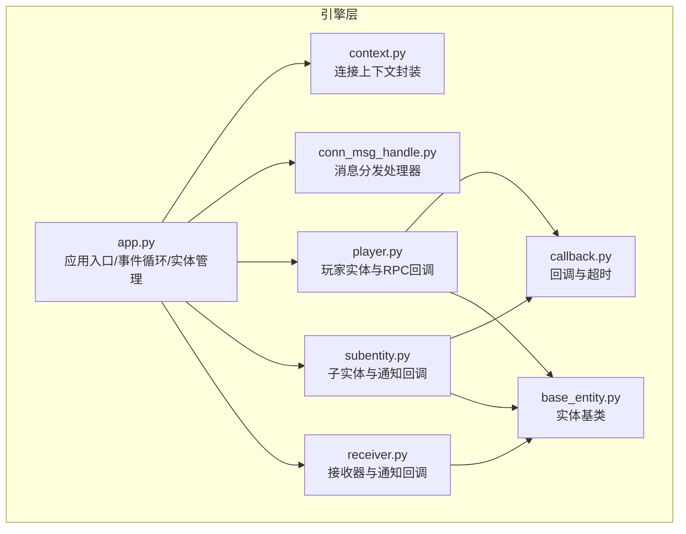
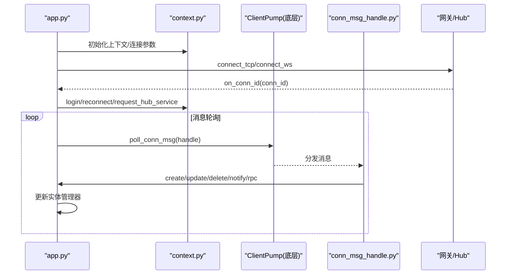
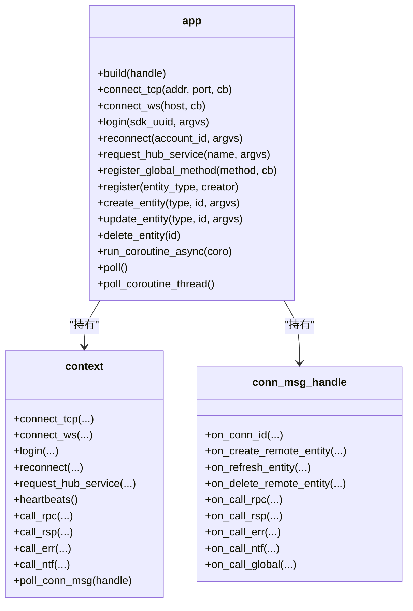
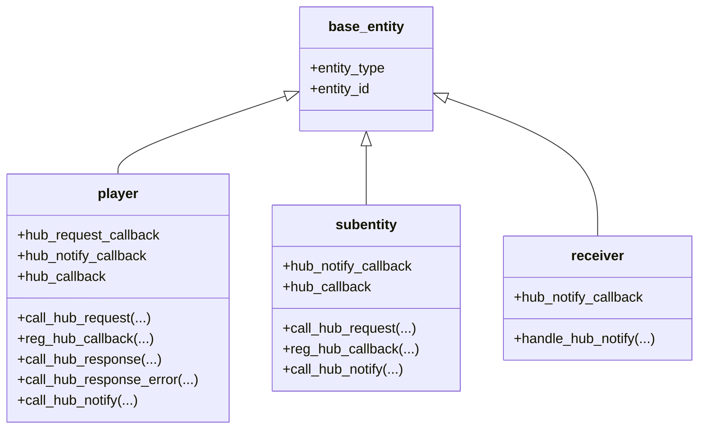
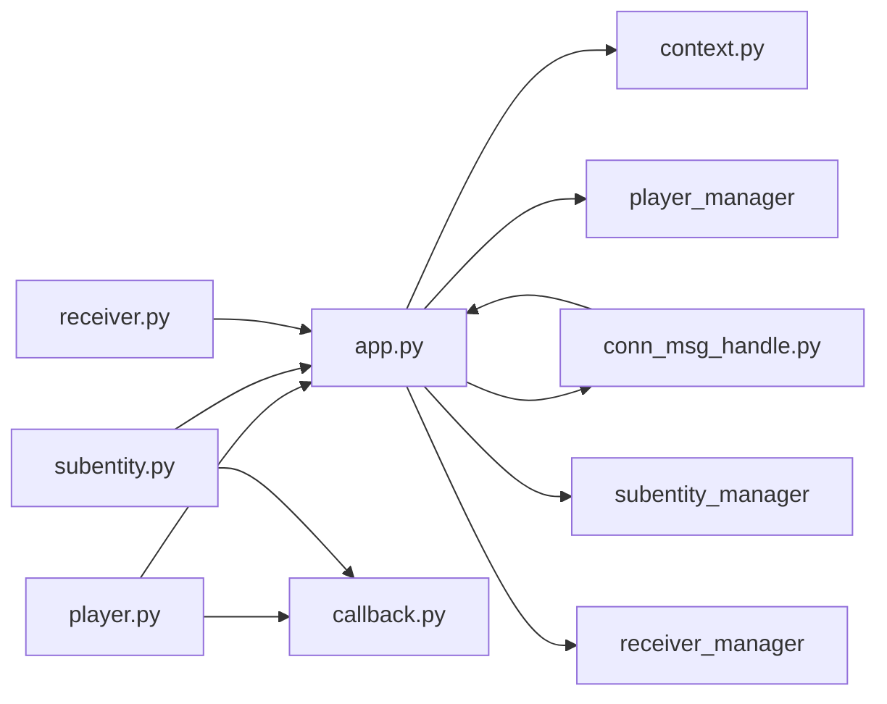
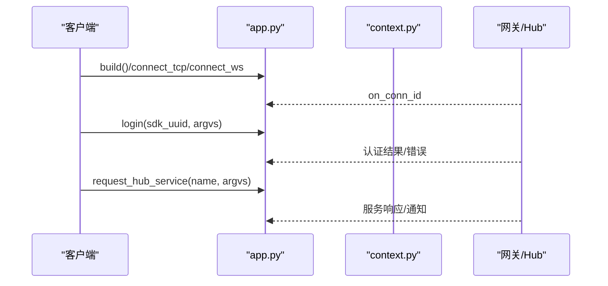
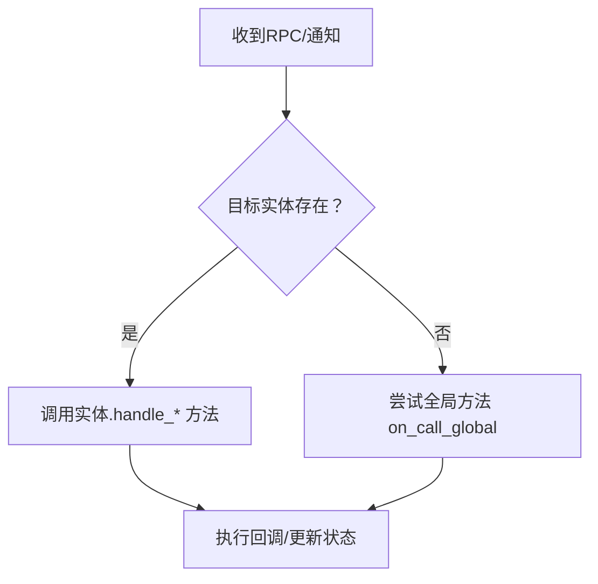

# Python 客户端

<cite>
**本文引用的文件**
- [client/engine/__init__.py](file://client/engine/__init__.py)
- [client/engine/app.py](file://client/engine/app.py)
- [client/engine/context.py](file://client/engine/context.py)
- [client/engine/conn_msg_handle.py](file://client/engine/conn_msg_handle.py)
- [client/engine/player.py](file://client/engine/player.py)
- [client/engine/subentity.py](file://client/engine/subentity.py)
- [client/engine/receiver.py](file://client/engine/receiver.py)
- [client/engine/callback.py](file://client/engine/callback.py)
- [client/engine/base_entity.py](file://client/engine/base_entity.py)
- [sample/client/py/engine/login_cli.py](file://sample/client/py/engine/login_cli.py)
- [sample/client/py/engine/get_rank_cli.py](file://sample/client/py/engine/get_rank_cli.py)
- [sample/client/py/engine/heartbeat_cli.py](file://sample/client/py/engine/heartbeat_cli.py)
- [sample/client/py/engine/common_cli.py](file://sample/client/py/engine/common_cli.py)
</cite>

## 目录
1. [简介](#简介)
2. [项目结构](#项目结构)
3. [核心组件](#核心组件)
4. [架构总览](#架构总览)
5. [详细组件分析](#详细组件分析)
6. [依赖分析](#依赖分析)
7. [性能考虑](#性能考虑)
8. [故障排查指南](#故障排查指南)
9. [结论](#结论)
10. [附录：使用示例与最佳实践](#附录使用示例与最佳实践)

## 简介
本指南面向使用 Python 客户端 SDK 的开发者，系统讲解客户端核心架构、上下文与连接管理、异步编程模型（事件循环与协程调度）、登录与重连流程、实体管理 API、消息处理机制（全局方法注册、回调绑定、自定义消息处理），以及错误处理、网络异常恢复与性能优化建议。文档同时提供可直接参考的实际示例路径，帮助快速集成到实际项目中。

## 项目结构
客户端 SDK 的核心位于 client/engine 目录，采用“引擎层”组织方式：app 负责应用生命周期与线程/事件循环协调；context 封装底层连接上下文；conn_msg_handle 处理来自网关/Hub 的消息分发；player/subentity/receiver 管理不同类型的实体；callback 提供 RPC 回调与超时控制；基础实体类 base_entity 统一实体标识。

图表来源
- [client/engine/app.py:40-157](file://client/engine/app.py#L40-L157)
- [client/engine/context.py:4-38](file://client/engine/context.py#L4-L38)
- [client/engine/conn_msg_handle.py:6-86](file://client/engine/conn_msg_handle.py#L6-L86)
- [client/engine/player.py:9-108](file://client/engine/player.py#L9-L108)
- [client/engine/subentity.py:9-89](file://client/engine/subentity.py#L9-L89)
- [client/engine/receiver.py:7-48](file://client/engine/receiver.py#L7-L48)
- [client/engine/callback.py:5-23](file://client/engine/callback.py#L5-L23)
- [client/engine/base_entity.py:3-6](file://client/engine/base_entity.py#L3-L6)

章节来源
- [client/engine/__init__.py:1-8](file://client/engine/__init__.py#L1-L8)
- [client/engine/app.py:40-157](file://client/engine/app.py#L40-L157)

## 核心组件
- 应用入口与事件循环
  - app 类负责初始化上下文、连接处理器、实体管理器与事件循环，提供连接、登录、重连、请求 Hub 服务等入口。
  - 通过独立线程运行事件循环，保证消息泵与异步任务并发执行。
- 连接上下文
  - context 对底层 ClientContext 做薄封装，统一对外暴露 connect_tcp/connect_ws/login/reconnect/request_hub_service/heartbeats/call_* 等能力。
- 消息分发
  - conn_msg_handle 接收来自底层的消息，按实体类型与消息类型分派给 player/subentity/receiver 或全局方法。
- 实体管理
  - player/subentity/receiver 分别维护各自实体集合，支持创建、刷新、删除与状态更新。
- 回调与超时
  - callback 提供响应回调与错误回调注册，以及基于定时器的超时触发。

章节来源
- [client/engine/app.py:40-157](file://client/engine/app.py#L40-L157)
- [client/engine/context.py:4-38](file://client/engine/context.py#L4-L38)
- [client/engine/conn_msg_handle.py:6-86](file://client/engine/conn_msg_handle.py#L6-L86)
- [client/engine/player.py:9-108](file://client/engine/player.py#L9-L108)
- [client/engine/subentity.py:9-89](file://client/engine/subentity.py#L9-L89)
- [client/engine/receiver.py:7-48](file://client/engine/receiver.py#L7-L48)
- [client/engine/callback.py:5-23](file://client/engine/callback.py#L5-L23)

## 架构总览
下图展示从应用启动到消息处理的全链路交互：

图表来源
- [client/engine/app.py:60-157](file://client/engine/app.py#L60-L157)
- [client/engine/context.py:8-38](file://client/engine/context.py#L8-L38)
- [client/engine/conn_msg_handle.py:7-86](file://client/engine/conn_msg_handle.py#L7-L86)

## 详细组件分析

### app：应用构建、上下文与连接处理
- 构建流程
  - build：初始化 context、连接处理器、实体管理器、消息泵与事件循环，启动心跳定时器。
- 连接与登录
  - connect_tcp/connect_ws：发起连接，设置连接成功回调。
  - login/reconnect/request_hub_service：向 Hub 发起认证与服务请求。
- 消息泵与事件循环
  - poll_conn_msg：持续拉取底层消息并交由 conn_msg_handle 处理。
  - poll：主循环，限制每帧处理时间，避免过载。
  - run/poll_coroutine_thread：在独立线程中运行事件循环，支持 asyncio.run_coroutine_threadsafe 调度协程。
- 全局方法与事件
  - register_global_method/on_call_global：注册与处理全局方法。
  - on_kick_off/on_transfer_complete：处理被踢下线与迁移完成事件。

图表来源
- [client/engine/app.py:40-157](file://client/engine/app.py#L40-L157)
- [client/engine/context.py:4-38](file://client/engine/context.py#L4-L38)
- [client/engine/conn_msg_handle.py:6-86](file://client/engine/conn_msg_handle.py#L6-L86)

章节来源
- [client/engine/app.py:40-157](file://client/engine/app.py#L40-L157)

### context：连接上下文封装
- 统一封装底层连接与 RPC 能力，屏蔽平台差异。
- 提供 connect_tcp/connect_ws/login/reconnect/request_hub_service/heartbeats/call_* 等方法。

章节来源
- [client/engine/context.py:4-38](file://client/engine/context.py#L4-L38)

### conn_msg_handle：消息分发处理器
- 负责将底层消息映射到具体实体或全局方法：
  - on_conn_id：保存连接 ID 并回调上层。
  - on_create_remote_entity/on_refresh_entity/on_delete_remote_entity：驱动实体管理器更新。
  - on_call_rpc/on_call_rsp/on_call_err：分派到 player/subentity 的回调表。
  - on_call_ntf：分派到 player/subentity/receiver 的通知回调。
  - on_call_global：转交 app 的全局方法处理。

图表来源
- [client/engine/conn_msg_handle.py:6-86](file://client/engine/conn_msg_handle.py#L6-L86)

章节来源
- [client/engine/conn_msg_handle.py:6-86](file://client/engine/conn_msg_handle.py#L6-L86)

### player/subentity/receiver：实体管理与消息回调
- player
  - 维护 hub_request_callback/hub_notify_callback/hub_callback 表。
  - 支持 call_hub_request/reg_hub_callback/call_hub_response/call_hub_response_error/call_hub_notify。
  - 通过 app 上下文转发 RPC/通知消息。
- subentity
  - 与 player 类似，但不处理请求回调，仅处理通知与响应。
- receiver
  - 仅处理通知，用于被动接收 Hub 的广播或定向通知。

图表来源
- [client/engine/base_entity.py:3-6](file://client/engine/base_entity.py#L3-L6)
- [client/engine/player.py:9-108](file://client/engine/player.py#L9-L108)
- [client/engine/subentity.py:9-89](file://client/engine/subentity.py#L9-L89)
- [client/engine/receiver.py:7-48](file://client/engine/receiver.py#L7-L48)

章节来源
- [client/engine/player.py:9-108](file://client/engine/player.py#L9-L108)
- [client/engine/subentity.py:9-89](file://client/engine/subentity.py#L9-L89)
- [client/engine/receiver.py:7-48](file://client/engine/receiver.py#L7-L48)
- [client/engine/base_entity.py:3-6](file://client/engine/base_entity.py#L3-L6)

### callback：回调与超时
- 提供 callback 注册接口与超时触发机制，便于 RPC 请求的异步处理与资源回收。

章节来源
- [client/engine/callback.py:5-23](file://client/engine/callback.py#L5-L23)

## 依赖分析
- app 依赖 context、conn_msg_handle、实体管理器与事件循环。
- player/subentity/receiver 依赖 app 以访问 context 与回调注册。
- conn_msg_handle 依赖 app 的实体管理器与全局方法表。
- callback 作为轻量工具被 player/subentity 使用。

图表来源
- [client/engine/app.py:40-157](file://client/engine/app.py#L40-L157)
- [client/engine/conn_msg_handle.py:6-86](file://client/engine/conn_msg_handle.py#L6-L86)
- [client/engine/player.py:9-108](file://client/engine/player.py#L9-L108)
- [client/engine/subentity.py:9-89](file://client/engine/subentity.py#L9-L89)
- [client/engine/receiver.py:7-48](file://client/engine/receiver.py#L7-L48)
- [client/engine/callback.py:5-23](file://client/engine/callback.py#L5-L23)

章节来源
- [client/engine/app.py:40-157](file://client/engine/app.py#L40-L157)
- [client/engine/conn_msg_handle.py:6-86](file://client/engine/conn_msg_handle.py#L6-L86)

## 性能考虑
- 主循环节流：poll 中限制单帧处理时长并进行微小休眠，避免 CPU 占用过高。
- 异步调度：通过 asyncio.run_coroutine_threadsafe 在事件循环线程安全地提交协程任务。
- 消息批处理：conn_msg_handle 内部按类型分派，减少不必要的查找成本。
- 实体管理：player/subentity/receiver 使用字典索引，O(1) 查找与更新。
- 建议
  - 合理设置心跳周期与网络超时，避免频繁重连。
  - 控制回调数量与生命周期，及时释放不再使用的回调。
  - 对高频通知进行去抖/合并，降低 UI 或业务层压力。

[本节为通用性能建议，无需特定文件引用]

## 故障排查指南
- 连接失败
  - 检查 connect_tcp/connect_ws 参数与网络可达性；确认 on_conn_id 是否回调。
- 登录/重连异常
  - 核对 login/reconnect 的参数编码（应为二进制）；关注 Hub 返回的错误码。
- RPC 无响应
  - 确认已通过 reg_hub_callback 注册回调；检查 msg_cb_id 是否正确传递。
  - 若未收到响应，检查回调是否被提前释放或超时触发。
- 通知未到达
  - 确认已通过 reg_hub_notify_callback 注册对应方法名的通知回调。
- 被踢下线/迁移
  - on_kick_off/on_transfer_complete 会触发关闭与事件回调，请在上层做资源清理与重连策略。

章节来源
- [client/engine/conn_msg_handle.py:27-35](file://client/engine/conn_msg_handle.py#L27-L35)
- [client/engine/player.py:33-54](file://client/engine/player.py#L33-L54)
- [client/engine/subentity.py:25-46](file://client/engine/subentity.py#L25-L46)
- [client/engine/receiver.py:20-26](file://client/engine/receiver.py#L20-L26)
- [client/engine/callback.py:17-23](file://client/engine/callback.py#L17-L23)

## 结论
该 Python 客户端 SDK 通过 app/context/conn_msg_handle 的清晰分层，结合 player/subentity/receiver 的实体模型与 callback 的回调体系，提供了稳定可靠的连接、认证、实体管理与消息处理能力。配合事件循环与线程隔离，既满足异步编程需求，又保持了良好的可维护性与扩展性。

[本节为总结，无需特定文件引用]

## 附录：使用示例与最佳实践

### 异步编程模式与事件循环
- 在独立线程中运行事件循环，使用 run_coroutine_threadsafe 提交协程任务，确保线程安全。
- 避免在事件循环线程中执行阻塞操作，必要时使用异步 I/O 或线程池。

章节来源
- [client/engine/app.py:131-139](file://client/engine/app.py#L131-L139)

### 登录流程（账号认证、重连与 Hub 服务请求）
- 基本步骤
  - 构建 app 并设置事件处理回调。
  - 建立连接（TCP/WS），等待 on_conn_id。
  - 执行 login，等待 Hub 认证结果。
  - 如需重连，使用 reconnect 并携带账户信息。
  - 通过 request_hub_service 请求 Hub 服务。
- 示例参考
  - 登录调用与回调封装：[sample/client/py/engine/login_cli.py:36-46](file://sample/client/py/engine/login_cli.py#L36-L46)
  - 获取排行榜请求与回调封装：[sample/client/py/engine/get_rank_cli.py:62-80](file://sample/client/py/engine/get_rank_cli.py#L62-L80)
  - 心跳请求处理模块：[sample/client/py/engine/heartbeat_cli.py:37-51](file://sample/client/py/engine/heartbeat_cli.py#L37-L51)

图表来源
- [client/engine/app.py:94-112](file://client/engine/app.py#L94-L112)
- [client/engine/context.py:14-21](file://client/engine/context.py#L14-L21)
- [sample/client/py/engine/login_cli.py:40-46](file://sample/client/py/engine/login_cli.py#L40-L46)
- [sample/client/py/engine/get_rank_cli.py:66-79](file://sample/client/py/engine/get_rank_cli.py#L66-L79)

### 实体管理 API 使用
- 注册实体构造器
  - 使用 register(entity_type, creator) 注册实体类型与构造函数。
- 创建/更新/删除
  - create_entity/update_entity/delete_entity：由 app 驱动实体管理器更新。
- 示例参考
  - 实体注册与使用：[client/engine/app.py:113-129](file://client/engine/app.py#L113-L129)

章节来源
- [client/engine/app.py:113-129](file://client/engine/app.py#L113-L129)

### 消息处理机制：全局方法、回调绑定与自定义消息
- 全局方法注册
  - register_global_method(method, callback)：注册全局方法处理函数。
- 回调绑定
  - player/subentity：通过 reg_hub_callback/reg_hub_notify_callback 绑定回调。
  - receiver：通过 reg_hub_notify_callback 绑定通知回调。
- 自定义消息处理
  - 在 conn_msg_handle 中扩展 on_call_* 分支，或在实体侧补充 handle_* 方法。

图表来源
- [client/engine/conn_msg_handle.py:36-82](file://client/engine/conn_msg_handle.py#L36-L82)
- [client/engine/player.py:26-61](file://client/engine/player.py#L26-L61)
- [client/engine/subentity.py:31-69](file://client/engine/subentity.py#L31-L69)
- [client/engine/receiver.py:20-28](file://client/engine/receiver.py#L20-L28)

### 错误处理策略与网络异常恢复
- 回调错误分支：在 callback 的 error 回调中处理 Hub 返回的错误。
- 超时控制：通过 callback.timeout 设置超时，避免悬挂请求。
- 重连策略：在 on_kick_off/on_transfer_complete 中触发重连逻辑，重建 app 与连接。

章节来源
- [client/engine/callback.py:13-23](file://client/engine/callback.py#L13-L23)
- [client/engine/conn_msg_handle.py:27-35](file://client/engine/conn_msg_handle.py#L27-L35)

### 实际项目集成要点
- 初始化顺序：context → app → 实体管理器 → 事件循环线程。
- 生命周期管理：在应用退出时调用 app.close()，确保资源释放。
- 参数编码：login/reconnect/request_hub_service 的参数需按 SDK 规范序列化为二进制。
- 示例参考
  - 通用协议编解码与枚举：[sample/client/py/engine/common_cli.py:9-67](file://sample/client/py/engine/common_cli.py#L9-L67)
  - 登录调用与回调封装：[sample/client/py/engine/login_cli.py:12-46](file://sample/client/py/engine/login_cli.py#L12-L46)
  - 排行榜查询与回调封装：[sample/client/py/engine/get_rank_cli.py:12-80](file://sample/client/py/engine/get_rank_cli.py#L12-L80)
  - 心跳请求处理模块：[sample/client/py/engine/heartbeat_cli.py:12-51](file://sample/client/py/engine/heartbeat_cli.py#L12-L51)