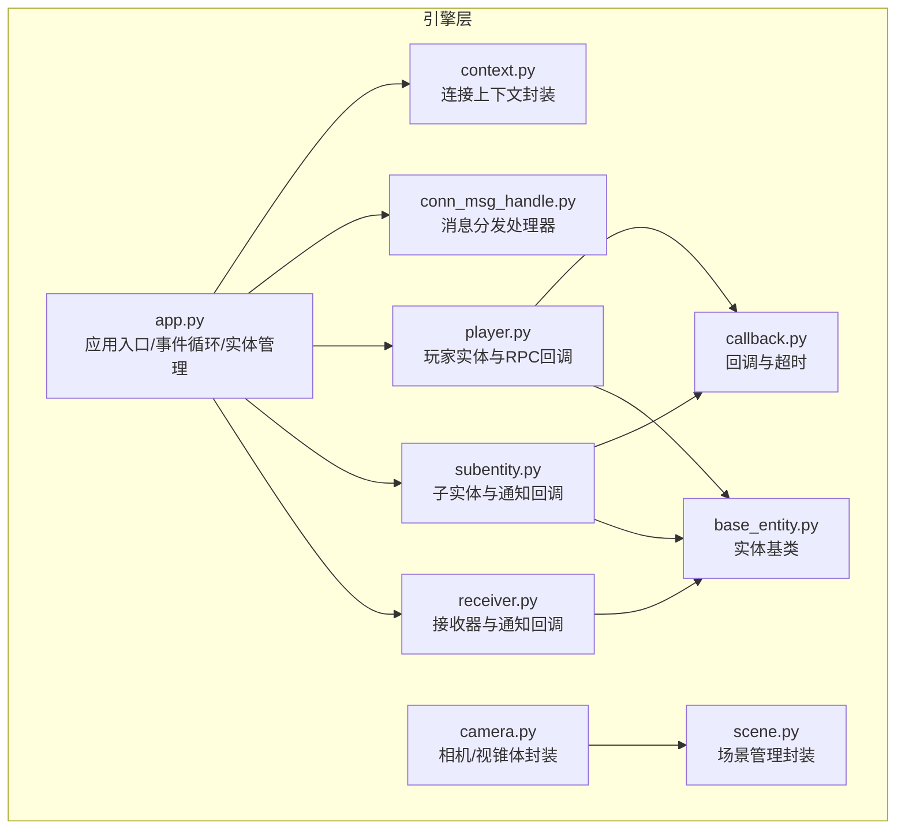
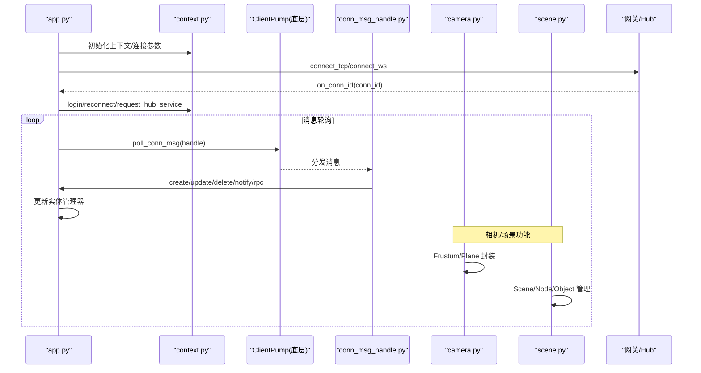
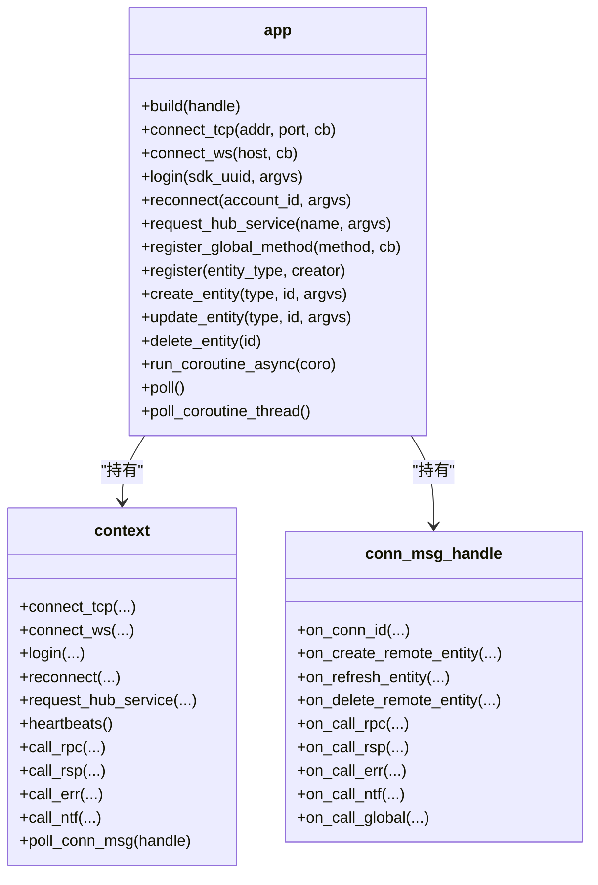
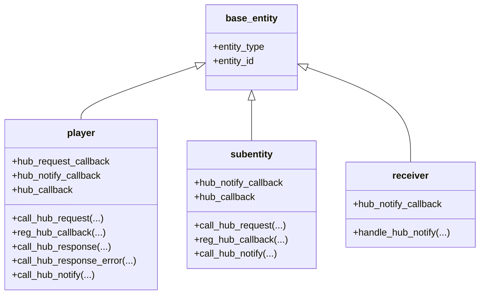
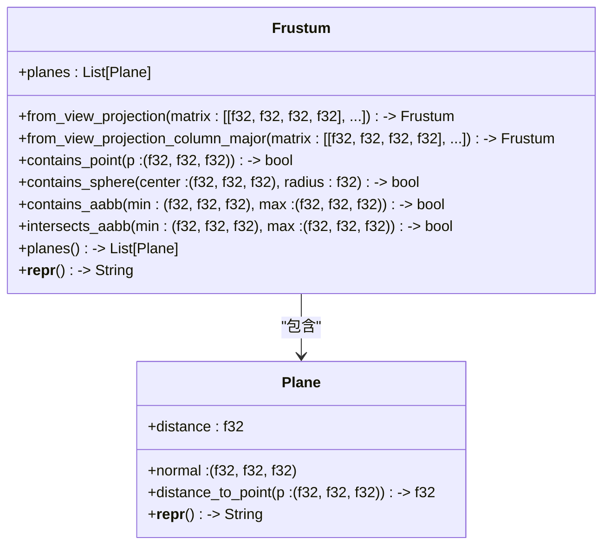
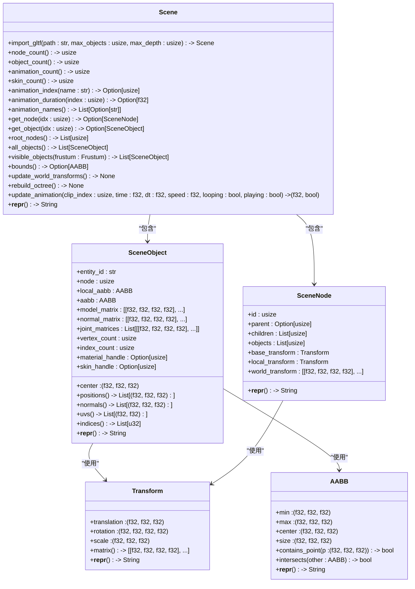
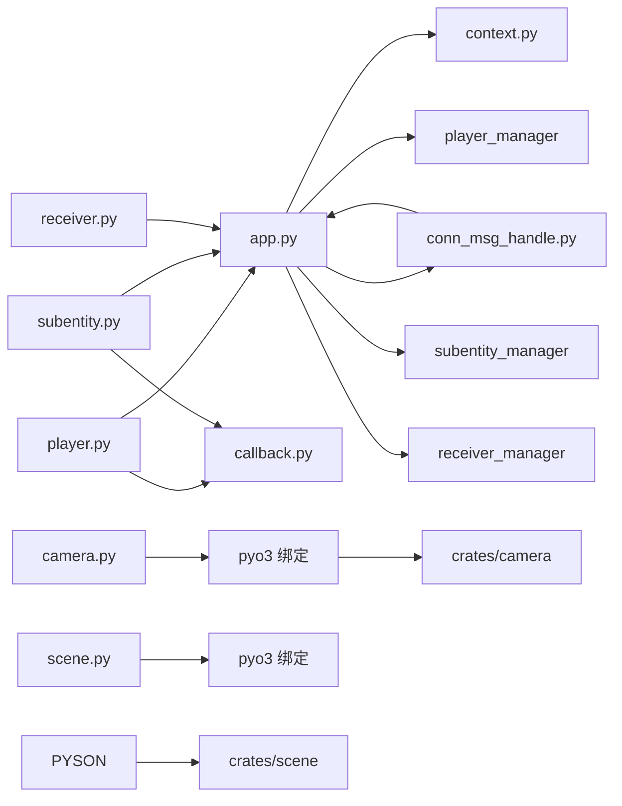
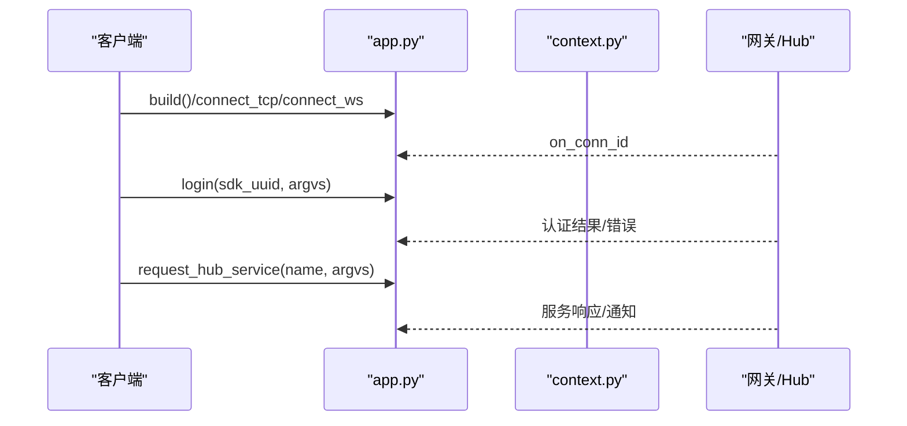
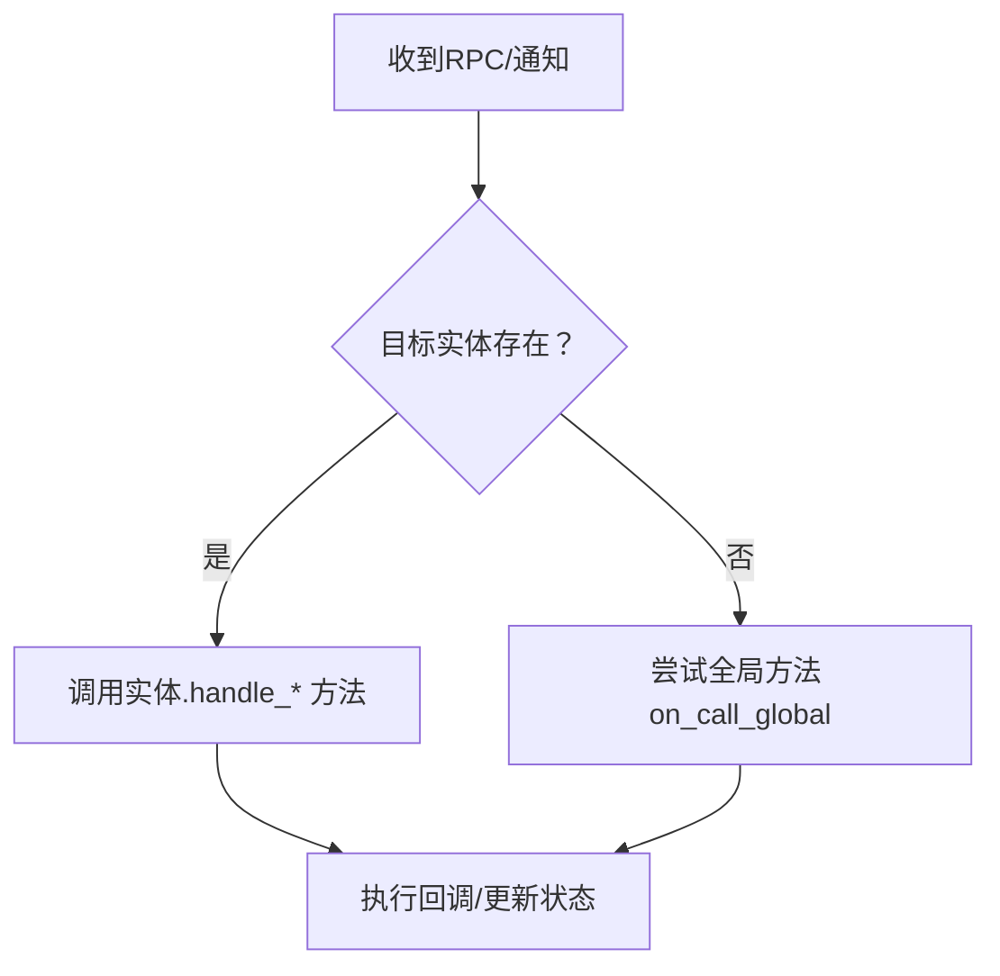

# Python 客户端

<cite>
**本文档引用的文件**
- [client/engine/__init__.py](file://client/engine/__init__.py)
- [client/engine/app.py](file://client/engine/app.py)
- [client/engine/context.py](file://client/engine/context.py)
- [client/engine/conn_msg_handle.py](file://client/engine/conn_msg_handle.py)
- [client/engine/player.py](file://client/engine/player.py)
- [client/engine/subentity.py](file://client/engine/subentity.py)
- [client/engine/receiver.py](file://client/engine/receiver.py)
- [client/engine/callback.py](file://client/engine/callback.py)
- [client/engine/base_entity.py](file://client/engine/base_entity.py)
- [client/engine/camera.py](file://client/engine/camera.py)
- [client/engine/scene.py](file://client/engine/scene.py)
- [sample/client/py/engine/login_cli.py](file://sample/client/py/engine/login_cli.py)
- [sample/client/py/engine/get_rank_cli.py](file://sample/client/py/engine/get_rank_cli.py)
- [sample/client/py/engine/heartbeat_cli.py](file://sample/client/py/engine/heartbeat_cli.py)
- [sample/client/py/engine/common_cli.py](file://sample/client/py/engine/common_cli.py)
- [crates/physics/src/py/mod.rs](file://crates/physics/src/py/mod.rs)
- [crates/physics/src/py/world.rs](file://crates/physics/src/py/world.rs)
- [crates/physics/src/py/body.rs](file://crates/physics/src/py/body.rs)
- [crates/physics/src/py/shape.rs](file://crates/physics/src/py/shape.rs)
- [crates/physics/src/py/query.rs](file://crates/physics/src/py/query.rs)
- [crates/camera/src/frustum.rs](file://crates/camera/src/frustum.rs)
- [crates/scene/src/scene.rs](file://crates/scene/src/scene.rs)
- [crates/scene/src/scene_object.rs](file://crates/scene/src/scene_object.rs)
- [client/lib/client/src/py/camera.rs](file://client/lib/client/src/py/camera.rs)
- [client/lib/client/src/py/scene.rs](file://client/lib/client/src/py/scene.rs)
- [client/lib/client/src/py/aabb.rs](file://client/lib/client/src/py/aabb.rs)
- [client/lib/client/src/py/transform.rs](file://client/lib/client/src/py/transform.rs)
- [client/lib/client/src/py/scene_object.rs](file://client/lib/client/src/py/scene_object.rs)
- [server/engine/physics.py](file://server/engine/physics.py)
- [server/engine/tests/test_physics.py](file://server/engine/tests/test_physics.py)
- [server/src/hub_lib.rs](file://server/src/hub_lib.rs)
</cite>

## 更新摘要
**所做更改**
- 新增相机模块（client.engine.camera）文档，包含 Frustum 和 Plane 的 Python 封装
- 新增场景模块（client.engine.scene）文档，包含 Scene、SceneNode、SceneObject、AABB、Transform 的 Python 封装
- 新增相机和场景系统的 Rust 绑定层实现说明
- 更新架构图以反映新增的相机和场景功能
- 添加相机视锥体和场景管理的使用示例

## 目录
1. [简介](#简介)
2. [项目结构](#项目结构)
3. [核心组件](#核心组件)
4. [架构总览](#架构总览)
5. [详细组件分析](#详细组件分析)
6. [相机模块](#相机模块)
7. [场景模块](#场景模块)
8. [依赖分析](#依赖分析)
9. [性能考虑](#性能考虑)
10. [故障排查指南](#故障排查指南)
11. [结论](#结论)
12. [附录：使用示例与最佳实践](#附录使用示例与最佳实践)

## 简介
本指南面向使用 Python 客户端 SDK 的开发者，系统讲解客户端核心架构、上下文与连接管理、异步编程模型（事件循环与协程调度）、登录与重连流程、实体管理 API、消息处理机制（全局方法注册、回调绑定、自定义消息处理），以及错误处理、网络异常恢复与性能优化建议。文档同时提供可直接参考的实际示例路径，帮助快速集成到实际项目中。

**更新** 本版本新增了相机和场景系统的支持，包括 Frustum/Plane 视锥体封装和 Scene/SceneNode/SceneObject/AABB/Transform 场景管理功能，以及对应的 Rust 绑定层实现。

## 项目结构
客户端 SDK 的核心位于 client/engine 目录，采用"引擎层"组织方式：app 负责应用生命周期与线程/事件循环协调；context 封装底层连接上下文；conn_msg_handle 处理来自网关/Hub 的消息分发；player/subentity/receiver 管理不同类型的实体；callback 提供 RPC 回调与超时控制；基础实体类 base_entity 统一实体标识。新增的相机和场景模块提供图形渲染相关的基础功能。



**图表来源**
- [client/engine/app.py:40-157](file://client/engine/app.py#L40-L157)
- [client/engine/context.py:4-38](file://client/engine/context.py#L4-L38)
- [client/engine/conn_msg_handle.py:6-86](file://client/engine/conn_msg_handle.py#L6-L86)
- [client/engine/player.py:9-108](file://client/engine/player.py#L9-L108)
- [client/engine/subentity.py:9-89](file://client/engine/subentity.py#L9-L89)
- [client/engine/receiver.py:7-48](file://client/engine/receiver.py#L7-L48)
- [client/engine/callback.py:5-23](file://client/engine/callback.py#L5-L23)
- [client/engine/base_entity.py:3-6](file://client/engine/base_entity.py#L3-L6)
- [client/engine/camera.py:1-12](file://client/engine/camera.py#L1-L12)
- [client/engine/scene.py:1-35](file://client/engine/scene.py#L1-L35)

**章节来源**
- [client/engine/__init__.py:1-8](file://client/engine/__init__.py#L1-L8)
- [client/engine/app.py:40-157](file://client/engine/app.py#L40-L157)

## 核心组件
- 应用入口与事件循环
  - app 类负责初始化上下文、连接处理器、实体管理器与事件循环，提供连接、登录、重连、请求 Hub 服务等入口。
  - 通过独立线程运行事件循环，保证消息泵与异步任务并发执行。
- 连接上下文
  - context 对底层 ClientContext 做薄封装，统一对外暴露 connect_tcp/connect_ws/login/reconnect/request_hub_service/heartbeats/call_* 等能力。
- 消息分发
  - conn_msg_handle 接收来自底层的消息，按实体类型与消息类型分派给 player/subentity/receiver 或全局方法。
- 实体管理
  - player/subentity/receiver 分别维护各自实体集合，支持创建、刷新、删除与状态更新。
- 回调与超时
  - callback 提供响应回调与错误回调注册，以及基于定时器的超时触发。
- **更新** 相机与场景系统
  - camera 模块提供 Frustum（视锥体）和 Plane（平面）的 Python 封装，基于 Rust 实现的图形数学库。
  - scene 模块提供 Scene（场景容器）、SceneNode（场景节点）、SceneObject（场景对象）、AABB（轴对齐包围盒）、Transform（变换）的 Python 封装，支持 GLTF 资源导入和视锥体可见性查询。

**章节来源**
- [client/engine/app.py:40-157](file://client/engine/app.py#L40-L157)
- [client/engine/context.py:4-38](file://client/engine/context.py#L4-L38)
- [client/engine/conn_msg_handle.py:6-86](file://client/engine/conn_msg_handle.py#L6-L86)
- [client/engine/player.py:9-108](file://client/engine/player.py#L9-L108)
- [client/engine/subentity.py:9-89](file://client/engine/subentity.py#L9-L89)
- [client/engine/receiver.py:7-48](file://client/engine/receiver.py#L7-L48)
- [client/engine/callback.py:5-23](file://client/engine/callback.py#L5-L23)
- [client/engine/camera.py:1-12](file://client/engine/camera.py#L1-L12)
- [client/engine/scene.py:1-35](file://client/engine/scene.py#L1-L35)

## 架构总览
下图展示从应用启动到消息处理的全链路交互，包括新增的相机和场景系统：



**图表来源**
- [client/engine/app.py:60-157](file://client/engine/app.py#L60-L157)
- [client/engine/context.py:8-38](file://client/engine/context.py#L8-L38)
- [client/engine/conn_msg_handle.py:7-86](file://client/engine/conn_msg_handle.py#L7-L86)
- [client/engine/camera.py:1-12](file://client/engine/camera.py#L1-L12)
- [client/engine/scene.py:1-35](file://client/engine/scene.py#L1-L35)

## 详细组件分析

### app：应用构建、上下文与连接处理
- 构建流程
  - build：初始化 context、连接处理器、实体管理器、消息泵与事件循环，启动心跳定时器。
- 连接与登录
  - connect_tcp/connect_ws：发起连接，设置连接成功回调。
  - login/reconnect/request_hub_service：向 Hub 发起认证与服务请求。
- 消息泵与事件循环
  - poll_conn_msg：持续拉取底层消息并交由 conn_msg_handle 处理。
  - poll：主循环，限制每帧处理时间，避免过载。
  - run/poll_coroutine_thread：在独立线程中运行事件循环，支持 asyncio.run_coroutine_threadsafe 调度协程。
- 全局方法与事件
  - register_global_method/on_call_global：注册与处理全局方法。
  - on_kick_off/on_transfer_complete：处理被踢下线与迁移完成事件。



**图表来源**
- [client/engine/app.py:40-157](file://client/engine/app.py#L40-L157)
- [client/engine/context.py:4-38](file://client/engine/context.py#L4-L38)
- [client/engine/conn_msg_handle.py:6-86](file://client/engine/conn_msg_handle.py#L6-L86)

**章节来源**
- [client/engine/app.py:40-157](file://client/engine/app.py#L40-L157)

### context：连接上下文封装
- 统一封装底层连接与 RPC 能力，屏蔽平台差异。
- 提供 connect_tcp/connect_ws/login/reconnect/request_hub_service/heartbeats/call_* 等方法。

**章节来源**
- [client/engine/context.py:4-38](file://client/engine/context.py#L4-L38)

### conn_msg_handle：消息分发处理器
- 负责将底层消息映射到具体实体或全局方法：
  - on_conn_id：保存连接 ID 并回调上层。
  - on_create_remote_entity/on_refresh_entity/on_delete_remote_entity：驱动实体管理器更新。
  - on_call_rpc/on_call_rsp/on_call_err：分派到 player/subentity 的回调表。
  - on_call_ntf：分派到 player/subentity/receiver 的通知回调。
  - on_call_global：转交 app 的全局方法处理。


**图表来源**
- [client/engine/conn_msg_handle.py:6-86](file://client/engine/conn_msg_handle.py#L6-L86)

**章节来源**
- [client/engine/conn_msg_handle.py:6-86](file://client/engine/conn_msg_handle.py#L6-L86)

### player/subentity/receiver：实体管理与消息回调
- player
  - 维护 hub_request_callback/hub_notify_callback/hub_callback 表。
  - 支持 call_hub_request/reg_hub_callback/call_hub_response/call_hub_response_error/call_hub_notify。
  - 通过 app 上下文转发 RPC/通知消息。
- subentity
  - 与 player 类似，但不处理请求回调，仅处理通知与响应。
- receiver
  - 仅处理通知，用于被动接收 Hub 的广播或定向通知。



**图表来源**
- [client/engine/base_entity.py:3-6](file://client/engine/base_entity.py#L3-L6)
- [client/engine/player.py:9-108](file://client/engine/player.py#L9-L108)
- [client/engine/subentity.py:9-89](file://client/engine/subentity.py#L9-L89)
- [client/engine/receiver.py:7-48](file://client/engine/receiver.py#L7-L48)

**章节来源**
- [client/engine/player.py:9-108](file://client/engine/player.py#L9-L108)
- [client/engine/subentity.py:9-89](file://client/engine/subentity.py#L9-L89)
- [client/engine/receiver.py:7-48](file://client/engine/receiver.py#L7-L48)
- [client/engine/base_entity.py:3-6](file://client/engine/base_entity.py#L3-L6)

### callback：回调与超时
- 提供 callback 注册接口与超时触发机制，便于 RPC 请求的异步处理与资源回收。

**章节来源**
- [client/engine/callback.py:5-23](file://client/engine/callback.py#L5-L23)

## 相机模块

### 概述
相机模块提供 Frustum（视锥体）和 Plane（平面）的 Python 封装，基于 Rust 实现的图形数学库。该模块支持从视图投影矩阵构造视锥体，进行点、球体和包围盒的空间关系判断，并提供视锥体平面的访问接口。

### 核心类与方法

#### Plane（平面）
- 构造函数：`Plane(a, b, c, d)` - 从平面系数构造，自动归一化法向量
- 属性：
  - `normal`：法向量 (x, y, z)
  - `distance`：到原点的距离
- 方法：
  - `distance_to_point(p)`：计算点到平面的距离
  - `__repr__()`：字符串表示

#### Frustum（视锥体）
- 构造方法：
  - `Frustum.from_view_projection(matrix)`：从行主序 4x4 视图投影矩阵构造
  - `Frustum.from_view_projection_column_major(matrix)`：从列主序 4x4 矩阵构造
- 空间关系判断：
  - `contains_point(p)`：判断点是否在视锥体内
  - `contains_sphere(center, radius)`：判断球是否完全在视锥体内
  - `contains_aabb(min, max)`：判断包围盒是否完全在视锥体内
  - `intersects_aabb(min, max)`：判断包围盒是否与视锥体相交
- 辅助方法：
  - `planes()`：返回 6 个平面的拷贝
  - `__repr__()`：字符串表示



**图表来源**
- [client/lib/client/src/py/camera.rs:8-127](file://client/lib/client/src/py/camera.rs#L8-L127)
- [crates/camera/src/frustum.rs:6-148](file://crates/camera/src/frustum.rs#L6-L148)

### 使用示例
```python
from client.engine.camera import Frustum, Plane

# 从视图投影矩阵创建视锥体
vp = [
    [2.0, 0.0, 0.0, 0.0],
    [0.0, 2.0, 0.0, 0.0],
    [0.0, 0.0, -1.1, -2.0],
    [0.0, 0.0, -1.0, 0.0]
]
frustum = Frustum.from_view_projection(vp)

# 点在视锥体内的测试
point_inside = frustum.contains_point((0.0, 0.0, -5.0))
point_outside = frustum.contains_point((10.0, 10.0, -5.0))

# 平面操作
plane = Plane(0.0, 1.0, 0.0, 0.0)  # XZ 平面
distance = plane.distance_to_point((0.0, 5.0, 0.0))
```

**章节来源**
- [client/engine/camera.py:1-12](file://client/engine/camera.py#L1-L12)
- [client/lib/client/src/py/camera.rs:1-128](file://client/lib/client/src/py/camera.rs#L1-L128)
- [crates/camera/src/frustum.rs:1-148](file://crates/camera/src/frustum.rs#L1-L148)

## 场景模块

### 概述
场景模块提供 Scene（场景容器）、SceneNode（场景节点）、SceneObject（场景对象）、AABB（轴对齐包围盒）、Transform（变换）的 Python 封装。该模块支持从 GLTF/GLB 文件导入场景，进行视锥体可见性查询，管理场景对象和节点层次结构，并提供动画播放功能。

### 核心类与方法

#### AABB（轴对齐包围盒）
- 构造函数：`AABB(min, max)` - 从最小最大坐标构造
- 属性：
  - `min`：最小坐标 (x, y, z)
  - `max`：最大坐标 (x, y, z)
  - `center`：中心点坐标
  - `size`：尺寸 (x, y, z)
- 方法：
  - `contains_point(p)`：判断点是否在包围盒内
  - `intersects(other)`：判断是否与其他包围盒相交
  - `__repr__()`：字符串表示

#### Transform（变换）
- 属性：
  - `translation`：平移 (x, y, z)
  - `rotation`：旋转四元数 (x, y, z, w)
  - `scale`：缩放 (x, y, z)
- 方法：
  - `matrix()`：返回行主序 4x4 变换矩阵
  - `__repr__()`：字符串表示

#### SceneObject（场景对象）
- 属性：
  - `entity_id`：实体 ID
  - `node`：所属节点索引
  - `local_aabb`：局部包围盒
  - `aabb`：世界包围盒
  - `center`：世界中心点
  - `model_matrix`：行主序 4x4 模型矩阵
  - `normal_matrix`：行主序 4x4 法线矩阵
  - `joint_matrices`：骨骼矩阵列表
  - `vertex_count`：顶点数量
  - `index_count`：索引数量
  - `material_handle`：材质句柄
  - `skin_handle`：蒙皮句柄
- 方法：
  - `positions()`：顶点位置数组
  - `normals()`：顶点法线数组
  - `uvs()`：UV 坐标数组
  - `indices()`：三角形索引数组

#### SceneNode（场景节点）
- 属性：
  - `id`：节点 ID
  - `parent`：父节点 ID
  - `children`：子节点 ID 列表
  - `objects`：对象索引列表
  - `base_transform`：基础变换
  - `local_transform`：局部变换
  - `world_transform`：行主序 4x4 世界变换矩阵
- 方法：无

#### Scene（场景容器）
- 构造方法：`Scene.import_gltf(path, max_objects=8, max_depth=6)` - 从 GLTF/GLB 文件导入
- 属性查询：
  - `node_count()`：节点数量
  - `object_count()`：对象数量
  - `animation_count()`：动画数量
  - `skin_count()`：蒙皮数量
- 动画管理：
  - `animation_index(name)`：获取动画索引
  - `animation_duration(index)`：获取动画时长
  - `animation_names()`：获取所有动画名称
  - `update_animation(clip_index, time, dt, speed, looping, playing)`：推进动画状态
- 场景查询：
  - `get_node(idx)`：获取节点视图
  - `get_object(idx)`：获取对象视图
  - `root_nodes()`：获取顶级节点列表
  - `all_objects()`：获取所有对象
  - `visible_objects(frustum)`：获取视锥体可见对象
  - `bounds()`：获取场景包围盒
- 变换管理：
  - `update_world_transforms()`：更新所有节点世界矩阵
  - `rebuild_octree()`：重建八叉树



**图表来源**
- [client/lib/client/src/py/aabb.rs:7-66](file://client/lib/client/src/py/aabb.rs#L7-L66)
- [client/lib/client/src/py/transform.rs:7-69](file://client/lib/client/src/py/transform.rs#L7-L69)
- [client/lib/client/src/py/scene_object.rs:13-140](file://client/lib/client/src/py/scene_object.rs#L13-L140)
- [client/lib/client/src/py/scene_object.rs:142-207](file://client/lib/client/src/py/scene_object.rs#L142-L207)
- [client/lib/client/src/py/scene.rs:19-210](file://client/lib/client/src/py/scene.rs#L19-L210)
- [crates/scene/src/scene.rs:16-285](file://crates/scene/src/scene.rs#L16-L285)
- [crates/scene/src/scene_object.rs:8-42](file://crates/scene/src/scene_object.rs#L8-L42)

### 使用示例
```python
from client.engine.scene import Scene
from client.engine.camera import Frustum

# 从 GLTF 文件导入场景
scene = Scene.import_gltf("assets/level.glb", max_objects=8, max_depth=6)
print(f"场景包含 {scene.node_count()} 个节点, {scene.object_count()} 个对象")

# 获取场景边界
bounds = scene.bounds()
if bounds:
    print(f"场景边界: {bounds}")

# 创建视锥体并查询可见对象
vp = build_view_projection_matrix(...)  # 行主序 4x4 矩阵
frustum = Frustum.from_view_projection(vp)
visible_objects = scene.visible_objects(frustum)

for obj in visible_objects:
    print(f"可见对象: {obj.entity_id}, 中心点: {obj.center}")

# 动画播放
current_time = 0.0
for frame in range(60):
    current_time, playing = scene.update_animation(
        clip_index=0,
        time=current_time,
        dt=1.0/60.0,
        speed=1.0,
        looping=True,
        playing=True
    )
```

**章节来源**
- [client/engine/scene.py:1-35](file://client/engine/scene.py#L1-L35)
- [client/lib/client/src/py/scene.rs:1-211](file://client/lib/client/src/py/scene.rs#L1-L211)
- [client/lib/client/src/py/aabb.rs:1-67](file://client/lib/client/src/py/aabb.rs#L1-L67)
- [client/lib/client/src/py/transform.rs:1-70](file://client/lib/client/src/py/transform.rs#L1-L70)
- [client/lib/client/src/py/scene_object.rs:1-218](file://client/lib/client/src/py/scene_object.rs#L1-L218)
- [crates/scene/src/scene.rs:1-285](file://crates/scene/src/scene.rs#L1-L285)
- [crates/scene/src/scene_object.rs:1-42](file://crates/scene/src/scene_object.rs#L1-L42)

## 依赖分析
- app 依赖 context、conn_msg_handle、实体管理器与事件循环。
- player/subentity/receiver 依赖 app 以访问 context 与回调注册。
- conn_msg_handle 依赖 app 的实体管理器与全局方法表。
- callback 作为轻量工具被 player/subentity 使用。
- **更新** 相机与场景模块依赖 pyo3 绑定，通过 Rust 实现的图形数学和场景管理系统：
  - camera 模块依赖 crates/camera 的 Frustum 和 Plane 实现
  - scene 模块依赖 crates/scene 的 Scene、SceneNode、SceneObject 实现
  - 两者都通过 client/lib/client/src/py 下的 Rust 绑定层暴露给 Python



**图表来源**
- [client/engine/app.py:40-157](file://client/engine/app.py#L40-L157)
- [client/engine/conn_msg_handle.py:6-86](file://client/engine/conn_msg_handle.py#L6-L86)
- [client/engine/player.py:9-108](file://client/engine/player.py#L9-L108)
- [client/engine/subentity.py:9-89](file://client/engine/subentity.py#L9-L89)
- [client/engine/receiver.py:7-48](file://client/engine/receiver.py#L7-L48)
- [client/engine/callback.py:5-23](file://client/engine/callback.py#L5-L23)
- [client/engine/camera.py:1-12](file://client/engine/camera.py#L1-L12)
- [client/engine/scene.py:1-35](file://client/engine/scene.py#L1-L35)
- [client/lib/client/src/py/camera.rs:1-128](file://client/lib/client/src/py/camera.rs#L1-L128)
- [client/lib/client/src/py/scene.rs:1-211](file://client/lib/client/src/py/scene.rs#L1-L211)

**章节来源**
- [client/engine/app.py:40-157](file://client/engine/app.py#L40-L157)
- [client/engine/conn_msg_handle.py:6-86](file://client/engine/conn_msg_handle.py#L6-L86)

## 性能考虑
- 主循环节流：poll 中限制单帧处理时长并进行微小休眠，避免 CPU 占用过高。
- 异步调度：通过 asyncio.run_coroutine_threadsafe 在事件循环线程安全地提交协程任务，确保线程安全。
- 消息批处理：conn_msg_handle 内部按类型分派，减少不必要的查找成本。
- 实体管理：player/subentity/receiver 使用字典索引，O(1) 查找与更新。
- **更新** 相机与场景系统性能优化：
  - Scene 对象使用 Arc<Mutex<Scene>> 串行化访问，确保线程安全但可能成为性能瓶颈。
  - 八叉树（Octree）用于高效的空间查询，max_objects 和 max_depth 参数影响查询性能。
  - 视锥体可见性查询通过八叉树加速，适合大规模场景。
  - 矩阵转换（行主序↔列主序）在 Python 和 Rust 之间进行，注意内存拷贝开销。
- 建议
  - 合理设置心跳周期与网络超时，避免频繁重连。
  - 控制回调数量与生命周期，及时释放不再使用的回调。
  - 对高频通知进行去抖/合并，降低 UI 或业务层压力。
  - 物理步进频率与游戏帧率匹配，避免过高的计算负载。
  - 场景导入时合理设置 max_objects 和 max_depth，平衡内存使用和查询性能。
  - 大场景渲染时优先使用视锥体可见性查询，避免渲染不可见对象。

## 故障排查指南
- 连接失败
  - 检查 connect_tcp/connect_ws 参数与网络可达性；确认 on_conn_id 是否回调。
- 登录/重连异常
  - 核对 login/reconnect 的参数编码（应为二进制）；关注 Hub 返回的错误码。
- RPC 无响应
  - 确认已通过 reg_hub_callback 注册回调；检查 msg_cb_id 是否正确传递。
  - 若未收到响应，检查回调是否被提前释放或超时触发。
- 通知未到达
  - 确认已通过 reg_hub_notify_callback 注册对应方法名的通知回调。
- 被踢下线/迁移
  - on_kick_off/on_transfer_complete 会触发关闭与事件回调，请在上层做资源清理与重连策略。
- **更新** 相机系统相关问题
  - 确认 Frustum.from_view_projection 的矩阵参数为正确的行主序 4x4 列表。
  - 检查视锥体构造是否成功，可通过 __repr__ 输出验证。
  - 注意矩阵转置问题，确保传入的矩阵格式符合预期。
- **更新** 场景系统相关问题
  - 确认 GLTF 文件路径正确且文件可访问。
  - 检查 max_objects 和 max_depth 参数设置是否合理。
  - 动画播放时确保 clip_index 在有效范围内。
  - 场景对象的模型矩阵和法线矩阵转换为行主序，注意与渲染管线的兼容性。
  - 八叉树重建后需要重新查询可见对象。

**章节来源**
- [client/engine/conn_msg_handle.py:27-35](file://client/engine/conn_msg_handle.py#L27-L35)
- [client/engine/player.py:33-54](file://client/engine/player.py#L33-L54)
- [client/engine/subentity.py:25-46](file://client/engine/subentity.py#L25-L46)
- [client/engine/receiver.py:20-26](file://client/engine/receiver.py#L20-L26)
- [client/engine/callback.py:17-23](file://client/engine/callback.py#L17-L23)
- [client/lib/client/src/py/camera.rs:60-75](file://client/lib/client/src/py/camera.rs#L60-L75)
- [client/lib/client/src/py/scene.rs:42-50](file://client/lib/client/src/py/scene.rs#L42-L50)
- [client/lib/client/src/py/scene.rs:154-176](file://client/lib/client/src/py/scene.rs#L154-L176)

## 结论
该 Python 客户端 SDK 通过 app/context/conn_msg_handle 的清晰分层，结合 player/subentity/receiver 的实体模型与 callback 的回调体系，提供了稳定可靠的连接、认证、实体管理与消息处理能力。配合事件循环与线程隔离，既满足异步编程需求，又保持了良好的可维护性与扩展性。

**更新** 新增的相机和场景系统进一步增强了客户端的功能，通过 pyo3 绑定提供高性能的图形渲染支持，包括视锥体计算、场景导入、对象查询和动画播放等功能。这些功能为游戏开发提供了完整的场景管理和渲染辅助工具，配合现有的实体管理功能，形成了从网络通信到图形渲染的完整客户端解决方案。

## 附录：使用示例与最佳实践

### 异步编程模式与事件循环
- 在独立线程中运行事件循环，使用 run_coroutine_threadsafe 提交协程任务，确保线程安全。
- 避免在事件循环线程中执行阻塞操作，必要时使用异步 I/O 或线程池。

**章节来源**
- [client/engine/app.py:131-139](file://client/engine/app.py#L131-L139)

### 登录流程（账号认证、重连与 Hub 服务请求）
- 基本步骤
  - 构建 app 并设置事件处理回调。
  - 建立连接（TCP/WS），等待 on_conn_id。
  - 执行 login，等待 Hub 认证结果。
  - 如需重连，使用 reconnect 并携带账户信息。
  - 通过 request_hub_service 请求 Hub 服务。
- 示例参考
  - 登录调用与回调封装：[sample/client/py/engine/login_cli.py:36-46](file://sample/client/py/engine/login_cli.py#L36-L46)
  - 获取排行榜请求与回调封装：[sample/client/py/engine/get_rank_cli.py:62-80](file://sample/client/py/engine/get_rank_cli.py#L62-L80)
  - 心跳请求处理模块：[sample/client/py/engine/heartbeat_cli.py:37-51](file://sample/client/py/engine/heartbeat_cli.py#L37-L51)



**图表来源**
- [client/engine/app.py:94-112](file://client/engine/app.py#L94-L112)
- [client/engine/context.py:14-21](file://client/engine/context.py#L14-L21)
- [sample/client/py/engine/login_cli.py:40-46](file://sample/client/py/engine/login_cli.py#L40-L46)
- [sample/client/py/engine/get_rank_cli.py:66-79](file://sample/client/py/engine/get_rank_cli.py#L66-L79)

### 实体管理 API 使用
- 注册实体构造器
  - 使用 register(entity_type, creator) 注册实体类型与构造函数。
- 创建/更新/删除
  - create_entity/update_entity/delete_entity：由 app 驱动实体管理器更新。
- 示例参考
  - 实体注册与使用：[client/engine/app.py:113-129](file://client/engine/app.py#L113-L129)

**章节来源**
- [client/engine/app.py:113-129](file://client/engine/app.py#L113-L129)

### 消息处理机制：全局方法、回调绑定与自定义消息
- 全局方法注册
  - register_global_method(method, callback)：注册全局方法处理函数。
- 回调绑定
  - player/subentity：通过 reg_hub_callback/reg_hub_notify_callback 绑定回调。
  - receiver：通过 reg_hub_notify_callback 绑定通知回调。
- 自定义消息处理
  - 在 conn_msg_handle 中扩展 on_call_* 分支，或在实体侧补充 handle_* 方法。



**图表来源**
- [client/engine/conn_msg_handle.py:36-82](file://client/engine/conn_msg_handle.py#L36-L82)
- [client/engine/player.py:26-61](file://client/engine/player.py#L26-L61)
- [client/engine/subentity.py:31-69](file://client/engine/subentity.py#L31-L69)
- [client/engine/receiver.py:20-28](file://client/engine/receiver.py#L20-L28)

### 错误处理策略与网络异常恢复
- 回调错误分支：在 callback 的 error 回调中处理 Hub 返回的错误。
- 超时控制：通过 callback.timeout 设置超时，避免悬挂请求。
- 重连策略：在 on_kick_off/on_transfer_complete 中触发重连逻辑，重建 app 与连接。

**章节来源**
- [client/engine/callback.py:13-23](file://client/engine/callback.py#L13-L23)
- [client/engine/conn_msg_handle.py:27-35](file://client/engine/conn_msg_handle.py#L27-L35)

### 相机系统使用指南
**更新** 相机系统的完整使用指南：

#### 基础视锥体操作
```python
from client.engine.camera import Frustum

# 从视图投影矩阵创建视锥体
vp = [
    [2.0, 0.0, 0.0, 0.0],
    [0.0, 2.0, 0.0, 0.0],
    [0.0, 0.0, -1.1, -2.0],
    [0.0, 0.0, -1.0, 0.0]
]
frustum = Frustum.from_view_projection(vp)

# 空间关系测试
point_inside = frustum.contains_point((0.0, 0.0, -5.0))
sphere_inside = frustum.contains_sphere((0.0, 0.0, -5.0), 1.0)
aabb_intersects = frustum.intersects_aabb((-1.0, -1.0, -6.0), (1.0, 1.0, -4.0))
```

#### 平面操作
```python
from client.engine.camera import Plane

# 创建 XZ 平面（法向量向上）
plane = Plane(0.0, 1.0, 0.0, 0.0)
distance = plane.distance_to_point((0.0, 5.0, 0.0))
print(f"点到平面距离: {distance}")

# 获取视锥体的所有平面
frustum_planes = frustum.planes()
for i, plane in enumerate(frustum_planes):
    print(f"平面 {i}: 法向量 {plane.normal}, 距离 {plane.distance}")
```

**章节来源**
- [client/engine/camera.py:1-12](file://client/engine/camera.py#L1-L12)
- [client/lib/client/src/py/camera.rs:1-128](file://client/lib/client/src/py/camera.rs#L1-L128)

### 场景系统使用指南
**更新** 场景系统的完整使用指南：

#### 场景导入与基础查询
```python
from client.engine.scene import Scene

# 从 GLTF 文件导入场景
scene = Scene.import_gltf("assets/level.glb", max_objects=8, max_depth=6)
print(f"场景统计: {scene}")

# 获取场景边界
bounds = scene.bounds()
if bounds:
    print(f"场景包围盒: {bounds}")

# 查询场景对象
for i in range(min(10, scene.object_count())):  # 限制数量避免输出过多
    obj = scene.get_object(i)
    if obj:
        print(f"对象 {i}: {obj.entity_id}, 顶点数: {obj.vertex_count}")
```

#### 视锥体可见性查询
```python
from client.engine.camera import Frustum

# 创建视锥体
vp = build_view_projection_matrix(...)
frustum = Frustum.from_view_projection(vp)

# 查询可见对象
visible_objects = scene.visible_objects(frustum)
print(f"可见对象数量: {len(visible_objects)}")

for obj in visible_objects[:5]:  # 限制输出
    print(f"可见对象: {obj.entity_id}")
    print(f"  世界中心: {obj.center}")
    print(f"  模型矩阵: {obj.model_matrix[:2]}...")  # 显示前两行
```

#### 动画播放
```python
# 获取动画信息
print(f"动画数量: {scene.animation_count()}")
for i, name in enumerate(scene.animation_names()):
    duration = scene.animation_duration(i)
    print(f"动画 {i}: {name}, 时长: {duration}")

# 播推进度
current_time = 0.0
frame_time = 1.0/60.0

for frame in range(60):  # 模拟 1 秒动画
    current_time, playing = scene.update_animation(
        clip_index=0,
        time=current_time,
        dt=frame_time,
        speed=1.0,
        looping=True,
        playing=True
    )
    
    if not playing:
        break
        
    print(f"帧 {frame}: 时间 = {current_time:.2f}, 播放状态 = {playing}")
```

#### 场景变换管理
```python
# 更新世界变换
scene.update_world_transforms()

# 重建八叉树（当外部修改了对象 AABB 后）
scene.rebuild_octree()

# 获取节点信息
root_nodes = scene.root_nodes()
print(f"顶级节点: {root_nodes}")

for node_id in root_nodes[:3]:  # 限制输出
    node = scene.get_node(node_id)
    if node:
        print(f"节点 {node_id}: 子节点数 = {len(node.children)}, 对象数 = {len(node.objects)}")
```

**章节来源**
- [client/engine/scene.py:1-35](file://client/engine/scene.py#L1-L35)
- [client/lib/client/src/py/scene.rs:1-211](file://client/lib/client/src/py/scene.rs#L1-L211)
- [client/lib/client/src/py/aabb.rs:1-67](file://client/lib/client/src/py/aabb.rs#L1-L67)
- [client/lib/client/src/py/transform.rs:1-70](file://client/lib/client/src/py/transform.rs#L1-L70)
- [client/lib/client/src/py/scene_object.rs:1-218](file://client/lib/client/src/py/scene_object.rs#L1-L218)

### 实际项目集成要点
- 初始化顺序：context → app → 实体管理器 → 事件循环线程。
- 生命周期管理：在应用退出时调用 app.close()，确保资源释放。
- 参数编码：login/reconnect/request_hub_service 的参数需按 SDK 规范序列化为二进制。
- **更新** 相机与场景系统集成：
  - 确保 pyo3 绑定正确安装和导入相机与场景模块。
  - 在服务器端启用相应的渲染和图形处理支持。
  - 场景导入时选择合适的 max_objects 和 max_depth 参数。
  - 大场景渲染时优先使用视锥体可见性查询优化性能。
  - 注意矩阵格式转换，确保行主序和列主序的一致性。
  - 动画播放时合理设置播放参数，避免性能问题。
- 示例参考
  - 通用协议编解码与枚举：[sample/client/py/engine/common_cli.py:9-67](file://sample/client/py/engine/common_cli.py#L9-L67)
  - 登录调用与回调封装：[sample/client/py/engine/login_cli.py:12-46](file://sample/client/py/engine/login_cli.py#L12-L46)
  - 排行榜查询与回调封装：[sample/client/py/engine/get_rank_cli.py:12-80](file://sample/client/py/engine/get_rank_cli.py#L12-L80)
  - 心跳请求处理模块：[sample/client/py/engine/heartbeat_cli.py:12-51](file://sample/client/py/engine/heartbeat_cli.py#L12-L51)