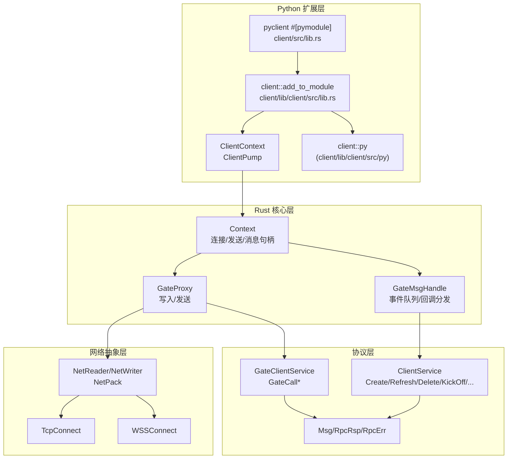
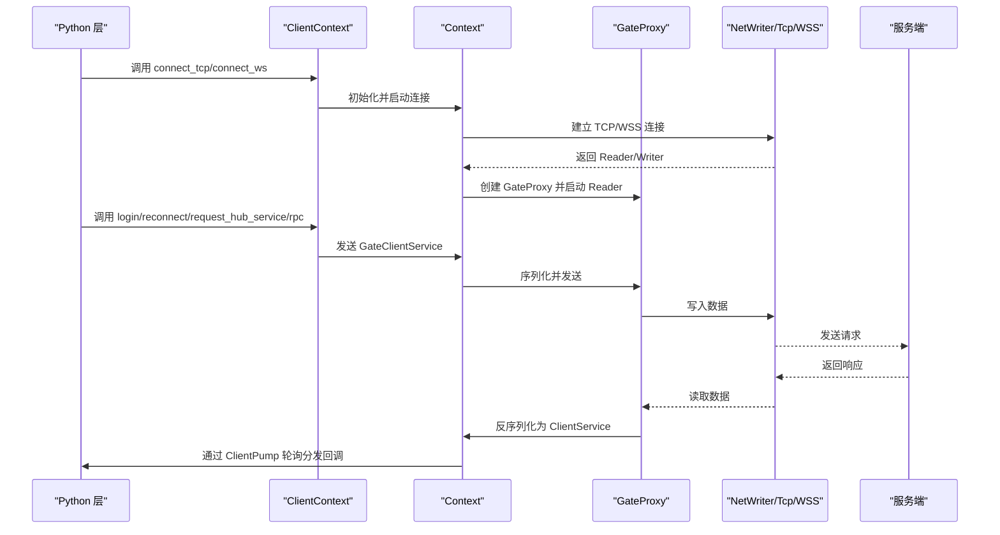
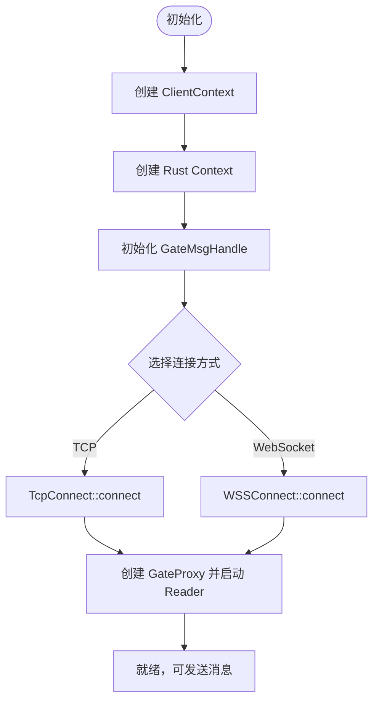
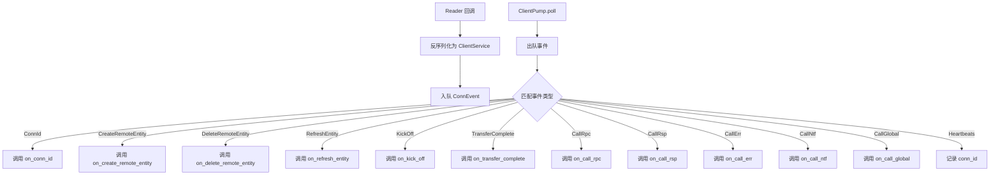
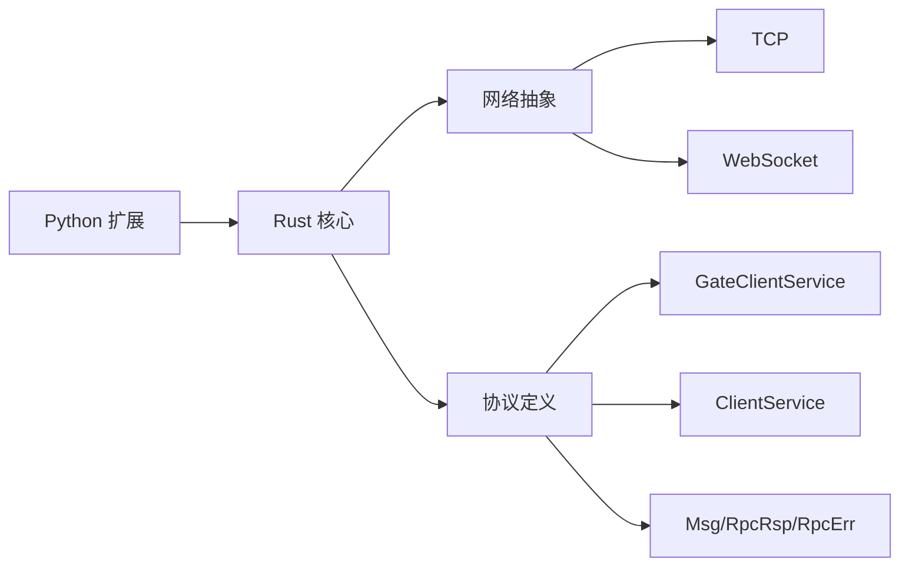

# Rust 客户端

<cite>
**本文引用的文件**
- [lib.rs](file://client/lib/client/src/lib.rs)
- [client.rs](file://client/lib/client/src/client.rs)
- [lib.rs（Python 扩展）](file://client/Cargo.toml)
- [lib.rs（顶层 cdylib）](file://client/src/lib.rs)
- [Cargo.toml（子 client）](file://client/lib/client/Cargo.toml)
- [lib.rs（网络抽象）](file://crates/net/src/lib.rs)
- [lib.rs（TCP 连接）](file://crates/tcp/src/lib.rs)
- [tcp_connect.rs](file://crates/tcp/src/tcp_connect.rs)
- [lib.rs（WebSocket 连接）](file://crates/wss/src/lib.rs)
- [wss_connect.rs](file://crates/wss/src/wss_connect.rs)
- [lib.rs（协议：公共）](file://crates/proto/src/common.rs)
- [lib.rs（协议：网关）](file://crates/proto/src/gate.rs)
- [lib.rs（协议：客户端）](file://crates/proto/src/client.rs)
</cite>

## 目录
1. [简介](#简介)
2. [项目结构](#项目结构)
3. [核心组件](#核心组件)
4. [架构总览](#架构总览)
5. [组件详解](#组件详解)
6. [依赖关系分析](#依赖关系分析)
7. [性能与可靠性建议](#性能与可靠性建议)
8. [故障排查指南](#故障排查指南)
9. [结论](#结论)
10. [附录：集成示例与最佳实践](#附录集成示例与最佳实践)

## 简介
本指南面向希望在游戏或应用中集成 Rust 客户端 SDK 的开发者，系统讲解客户端应用框架的设计与实现要点，包括：
- 应用上下文与连接管理
- 消息处理循环与事件分发
- 实体生命周期管理（创建、刷新、删除）
- 接收器与回调接口的使用
- 消息序列化、心跳、重连与错误处理
- 完整的 TCP 与 WebSocket 连接建立示例路径
- 面向 Rust 的最佳实践与常见问题排查

## 项目结构
客户端 SDK 由以下关键部分组成：
- Python 扩展层：顶层 cdylib `pyclient`（`client/src/lib.rs`）仅声明 `#[pymodule]`，调用子 crate `client/lib/client::add_to_module`统一注册所有 pyo3 类（网络、场景、相机）
- Rust 核心层：负责网络连接、消息编解码、事件队列与回调分发
- 协议层：基于 Thrift 的网关与客户端消息类型定义
- 网络抽象层：统一 Reader/Writer 抽象，屏蔽 TCP/WSS 差异
- 场景与相机层（`crates/scene` / `crates/camera`）：零 pyo3 依赖的纯 Rust crate，pyo3 包装全部集中在 `client/lib/client/src/py/` 下，由 `client::py::add_to_module` 统一注册到 `pyclient`
- 示例与样例：演示登录、心跳、RPC 调用等典型流程

图表来源
- [lib.rs:27-94](file://client/lib/client/src/lib.rs#L27-L94)
- [client.rs:22-51](file://client/lib/client/src/client.rs#L22-L51)
- [lib.rs（网络抽象）:8-23](file://crates/net/src/lib.rs#L8-L23)
- [tcp_connect.rs:10-18](file://crates/tcp/src/tcp_connect.rs#L10-L18)
- [wss_connect.rs:12-33](file://crates/wss/src/wss_connect.rs#L12-L33)
- [lib.rs（协议：网关）:1-20](file://crates/proto/src/gate.rs#L1-L20)
- [lib.rs（协议：客户端）:1-20](file://crates/proto/src/client.rs#L1-L20)
- [lib.rs（协议：公共）:1-20](file://crates/proto/src/common.rs#L1-L20)

章节来源
- [lib.rs（Python 扩展）:1-21](file://client/Cargo.toml#L1-L21)
- [lib.rs:1-116](file://client/lib/client/src/lib.rs#L1-L116)
- [client.rs:1-356](file://client/lib/client/src/client.rs#L1-L356)

## 核心组件
- pyclient cdylib (`client/src/lib.rs`)：顶层 `#[pymodule]` 入口，仅调用 `client::add_to_module`
- client::add_to_module (`client/lib/client/src/lib.rs`)：统一注册 `ClientContext` / `ClientPump` + `client::py::add_to_module`（包含 `Plane` / `Frustum` / `AABB` / `Transform` / `SceneObject` / `SceneNode` / `Scene`）
- client::py (`client/lib/client/src/py/mod.rs`)：渲染层 pyo3 包装统一入口，底层 `crates/camera` / `crates/scene` 零 pyo3 依赖
- ClientContext：Python 可调用的客户端上下文，封装连接、登录、RPC、心跳等入口
- ClientPump：轮询消息的桥接对象，将底层事件派发给 Python 回调
- Context：Rust 内部上下文，持有 GateProxy、消息句柄与 Tokio 运行时
- GateProxy：网关代理，负责将 GateClientService 序列化后发送，并持有 NetWriter
- GateMsgHandle：事件队列与回调分发器，将反序列化的 ClientService 分派到 Python 回调
- NetReader/NetWriter：网络读写抽象，配合 NetPack 做帧拆包
- TcpConnect/WSSConnect：TCP 与 WebSocket 连接工厂
- 协议类型：GateClientService、ClientService、Msg、RpcRsp、RpcErr 等

章节来源
- [lib.rs:27-94](file://client/lib/client/src/lib.rs#L27-L94)
- [client.rs:22-51](file://client/lib/client/src/client.rs#L22-L51)
- [client.rs:85-123](file://client/lib/client/src/client.rs#L85-L123)
- [client.rs:282-356](file://client/lib/client/src/client.rs#L282-L356)
- [lib.rs（网络抽象）:8-23](file://crates/net/src/lib.rs#L8-L23)
- [tcp_connect.rs:10-18](file://crates/tcp/src/tcp_connect.rs#L10-L18)
- [wss_connect.rs:12-33](file://crates/wss/src/wss_connect.rs#L12-L33)
- [lib.rs（协议：网关）:1-20](file://crates/proto/src/gate.rs#L1-L20)
- [lib.rs（协议：客户端）:1-20](file://crates/proto/src/client.rs#L1-L20)
- [lib.rs（协议：公共）:1-20](file://crates/proto/src/common.rs#L1-L20)

## 架构总览
下图展示了从 Python 调用到网络发送、再到服务端响应的完整链路。

图表来源
- [lib.rs:41-93](file://client/lib/client/src/lib.rs#L41-L93)
- [client.rs:297-356](file://client/lib/client/src/client.rs#L297-L356)
- [tcp_connect.rs:10-18](file://crates/tcp/src/tcp_connect.rs#L10-L18)
- [wss_connect.rs:12-33](file://crates/wss/src/wss_connect.rs#L12-L33)
- [client.rs:100-122](file://client/lib/client/src/client.rs#L100-L122)

## 组件详解

### 应用框架与初始化流程
- Python 侧通过 ClientContext.new 创建上下文
- 上下文内部持有 Context，包含 GateMsgHandle 与 Tokio 运行时
- 通过 connect_tcp/connect_ws 启动连接；成功后创建 GateProxy 并启动 Reader
- 通过 ClientPump 获取消息句柄，周期性轮询事件并回调 Python

图表来源
- [lib.rs:34-49](file://client/lib/client/src/lib.rs#L34-L49)
- [client.rs:282-356](file://client/lib/client/src/client.rs#L282-L356)
- [tcp_connect.rs:10-18](file://crates/tcp/src/tcp_connect.rs#L10-L18)
- [wss_connect.rs:12-33](file://crates/wss/src/wss_connect.rs#L12-L33)

章节来源
- [lib.rs:34-49](file://client/lib/client/src/lib.rs#L34-L49)
- [client.rs:282-356](file://client/lib/client/src/client.rs#L282-L356)

### 连接管理机制
- TCP 连接：使用 TcpConnect::connect 建立 TCP 流，拆分为读写通道，分别包装为 Reader/Writer
- WebSocket 连接：使用 WSSConnect::connect 建立 WebSocket 连接，同样拆分为读写通道
- GateProxy 持有 NetWriter，负责将序列化后的消息写入网络
- Reader 通过 NetReaderCallback 将字节流交给 GateMsgHandle 反序列化并入队

章节来源
- [tcp_connect.rs:10-18](file://crates/tcp/src/tcp_connect.rs#L10-L18)
- [wss_connect.rs:12-33](file://crates/wss/src/wss_connect.rs#L12-L33)
- [client.rs:22-51](file://client/lib/client/src/client.rs#L22-L51)
- [client.rs:53-70](file://client/lib/client/src/client.rs#L53-L70)

### 消息处理循环与事件分发
- GateMsgHandle 维护一个队列，将反序列化后的 ClientService 入队
- ClientPump.poll 从队列取出事件，根据事件类型调用 Python 回调
- 支持的回调包括：on_conn_id、on_create_remote_entity、on_delete_remote_entity、on_refresh_entity、on_kick_off、on_transfer_complete、on_call_rpc、on_call_rsp、on_call_err、on_call_ntf、on_call_global
- 心跳事件用于维持连接活性，打印当前 conn_id

图表来源
- [client.rs:100-122](file://client/lib/client/src/client.rs#L100-L122)
- [client.rs:124-279](file://client/lib/client/src/client.rs#L124-L279)
- [lib.rs（协议：客户端）:378-429](file://crates/proto/src/client.rs#L378-L429)

章节来源
- [client.rs:85-123](file://client/lib/client/src/client.rs#L85-L123)
- [client.rs:124-279](file://client/lib/client/src/client.rs#L124-L279)

### 客户端事件处理接口 client_event_handle 的实现要求
- on_conn_id：收到连接 ID 后更新本地状态
- on_create_remote_entity：创建远程实体，解析实体类型、ID 与初始参数
- on_delete_remote_entity：删除远程实体
- on_refresh_entity：刷新实体数据
- on_kick_off：被踢下线，提示信息来自服务端
- on_transfer_complete：迁移完成
- on_call_rpc：收到 RPC 请求，需返回 rsp 或 err
- on_call_rsp：收到 RPC 响应
- on_call_err：收到 RPC 错误
- on_call_ntf：收到通知消息
- on_call_global：收到全局广播

章节来源
- [client.rs:143-279](file://client/lib/client/src/client.rs#L143-L279)
- [lib.rs（协议：客户端）:318-429](file://crates/proto/src/client.rs#L318-L429)

### 消息序列化与反序列化
- 发送：GateClientService 序列化为二进制，写入 NetWriter
- 接收：NetPack 拆包后交由 GateMsgHandle 反序列化为 ClientService
- 协议类型：Msg、RpcRsp、RpcErr 等均基于 Thrift 协议

章节来源
- [client.rs:37-51](file://client/lib/client/src/client.rs#L37-L51)
- [client.rs:72-78](file://client/lib/client/src/client.rs#L72-L78)
- [lib.rs（网络抽象）:25-75](file://crates/net/src/lib.rs#L25-L75)
- [lib.rs（协议：公共）:1-20](file://crates/proto/src/common.rs#L1-L20)

### 心跳机制
- 客户端定时发送心跳消息
- 服务端心跳事件到达后，客户端记录当前 conn_id，用于诊断与调试

章节来源
- [lib.rs:90-93](file://client/lib/client/src/lib.rs#L90-L93)
- [client.rs:272-276](file://client/lib/client/src/client.rs#L272-L276)

### 重连逻辑
- 当前 Context 提供 login 与 reconnect 请求，但未内置自动重连循环
- 建议在 Python 层监听 on_kick_off/on_transfer_complete 等事件后，按业务策略触发 reconnect 或重新 login

章节来源
- [lib.rs:51-59](file://client/lib/client/src/lib.rs#L51-L59)
- [client.rs:194-209](file://client/lib/client/src/client.rs#L194-L209)

### 错误处理
- 连接失败：打印错误日志并返回失败
- 反序列化失败：打印错误并丢弃该帧
- 回调失败：捕获异常并打印错误，不影响后续事件处理

章节来源
- [client.rs:314-317](file://client/lib/client/src/client.rs#L314-L317)
- [client.rs:102-105](file://client/lib/client/src/client.rs#L102-L105)
- [client.rs:157-159](file://client/lib/client/src/client.rs#L157-L159)

### 玩家管理、子实体管理与接收器管理 API 使用方法
- 玩家管理：通过 login/reconnect 请求进入游戏世界，随后根据服务端推送的实体事件进行增删改查
- 子实体管理：服务端会下发 Create/Refresh/Delete 事件，客户端据此维护本地实体树
- 接收器管理：通过 ClientPump.poll 轮询事件，将事件分发到 Python 回调，回调内实现具体业务逻辑

章节来源
- [lib.rs:51-93](file://client/lib/client/src/lib.rs#L51-L93)
- [client.rs:161-193](file://client/lib/client/src/client.rs#L161-L193)
- [client.rs:124-279](file://client/lib/client/src/client.rs#L124-L279)

## 依赖关系分析

图表来源
- [lib.rs（Python 扩展）:8-16](file://client/Cargo.toml#L8-L16)
- [lib.rs:5-21](file://client/lib/client/src/lib.rs#L5-L21)
- [lib.rs（网络抽象）:1-75](file://crates/net/src/lib.rs#L1-L75)
- [lib.rs（协议：网关）:1-20](file://crates/proto/src/gate.rs#L1-L20)
- [lib.rs（协议：客户端）:1-20](file://crates/proto/src/client.rs#L1-L20)
- [lib.rs（协议：公共）:1-20](file://crates/proto/src/common.rs#L1-L20)

章节来源
- [lib.rs（Python 扩展）:8-16](file://client/Cargo.toml#L8-L16)
- [lib.rs:5-21](file://client/lib/client/src/lib.rs#L5-L21)

## 性能与可靠性建议
- 线程模型：Context 内部使用 Tokio 运行时，避免阻塞 IO；发送与接收分离，减少锁竞争
- 序列化开销：Thrift Compact 协议体积小，适合高频 RPC；注意避免频繁大包
- 心跳频率：根据网络质量调整心跳间隔，过密增加带宽压力，过疏可能误判掉线
- 重连策略：指数退避 + 最大重试次数；区分网络错误与业务错误（如被踢下线）
- 日志与监控：对连接失败、反序列化失败、回调异常进行统计与告警

## 故障排查指南
- 无法连接 TCP：检查地址与端口、防火墙、服务端是否启动
- 无法连接 WebSocket：检查 URL、头部字段、证书与域名
- 无事件回调：确认 ClientPump.poll 是否被持续调用，Python 回调是否正确注册
- 反序列化失败：检查协议版本一致性、消息长度与帧边界
- 心跳无效：确认心跳发送与接收路径，检查服务端心跳策略

章节来源
- [client.rs:314-317](file://client/lib/client/src/client.rs#L314-L317)
- [client.rs:102-105](file://client/lib/client/src/client.rs#L102-L105)
- [client.rs:157-159](file://client/lib/client/src/client.rs#L157-L159)
- [client.rs:272-276](file://client/lib/client/src/client.rs#L272-L276)

## 结论
本 SDK 以清晰的分层设计实现了跨语言的客户端通信能力：Python 扩展层提供易用接口，Rust 核心层保证高性能与可靠性，协议层确保跨语言一致的数据格式。结合本文的连接建立、事件处理、实体管理与错误处理建议，开发者可快速集成并稳定运行于生产环境。

## 附录：集成示例与最佳实践

### 完整连接建立示例（路径）
- TCP 连接
  - [connect_tcp 调用路径:41-44](file://client/lib/client/src/lib.rs#L41-L44)
  - [Context::connect_tcp 实现:297-318](file://client/lib/client/src/client.rs#L297-L318)
  - [TcpConnect::connect 实现:10-18](file://crates/tcp/src/tcp_connect.rs#L10-L18)
- WebSocket 连接
  - [connect_ws 调用路径:46-49](file://client/lib/client/src/lib.rs#L46-L49)
  - [Context::connect_ws 实现:320-338](file://client/lib/client/src/client.rs#L320-L338)
  - [WSSConnect::connect 实现:12-33](file://crates/wss/src/wss_connect.rs#L12-L33)

### 登录与 RPC 调用（路径）
- 登录
  - [login 调用路径:51-54](file://client/lib/client/src/lib.rs#L51-L54)
  - [send_msg 发送:340-350](file://client/lib/client/src/client.rs#L340-L350)
- RPC 调用
  - [call_rpc/call_rsp/call_err/call_ntf:66-88](file://client/lib/client/src/lib.rs#L66-L88)
  - [心跳:90-93](file://client/lib/client/src/lib.rs#L90-L93)

### 事件回调实现（路径）
- 在 Python 中实现 client_event_handle 的回调方法
  - [on_conn_id:157-159](file://client/lib/client/src/client.rs#L157-L159)
  - [on_kick_off:199-201](file://client/lib/client/src/client.rs#L199-L201)
  - [on_transfer_complete:206-208](file://client/lib/client/src/client.rs#L206-L208)
  - [on_create_remote_entity/on_refresh_entity/on_delete_remote_entity:164-193](file://client/lib/client/src/client.rs#L164-L193)
  - [on_call_rpc/on_call_rsp/on_call_err/on_call_ntf/on_call_global:210-271](file://client/lib/client/src/client.rs#L210-L271)

### 最佳实践清单
- 在 Python 层注册所有回调，确保事件不丢失
- 使用 ClientPump.poll 循环驱动，建议每帧调用一次
- 对 RPC 请求维护 msg_cb_id 映射，确保响应与错误能正确匹配
- 心跳周期建议 10–30 秒，依据网络延迟与业务需求调整
- 重连策略：失败立即重试 1–2 次，之后指数退避至最大等待时间
- 记录关键事件日志，便于定位连接、迁移与实体同步问题