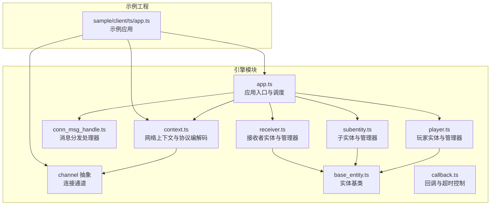
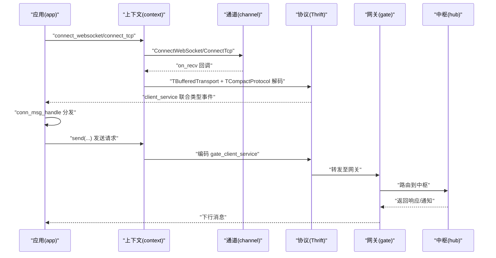
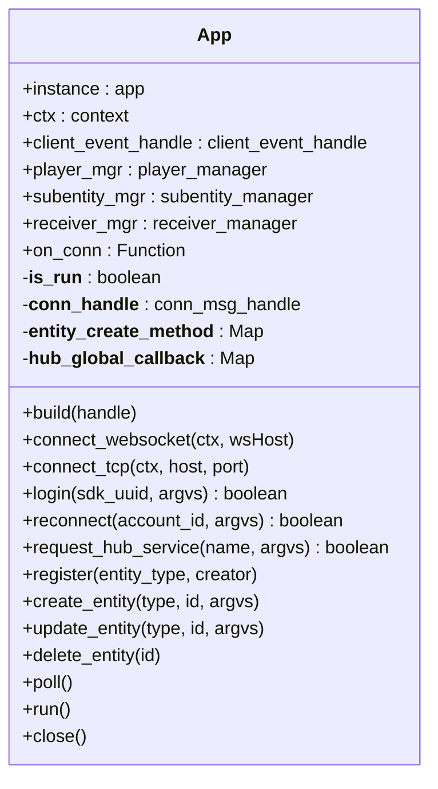
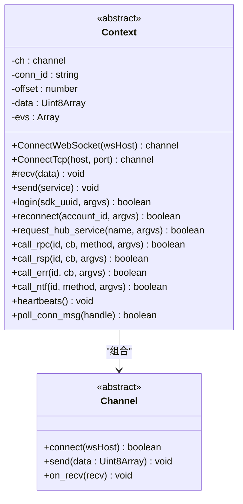
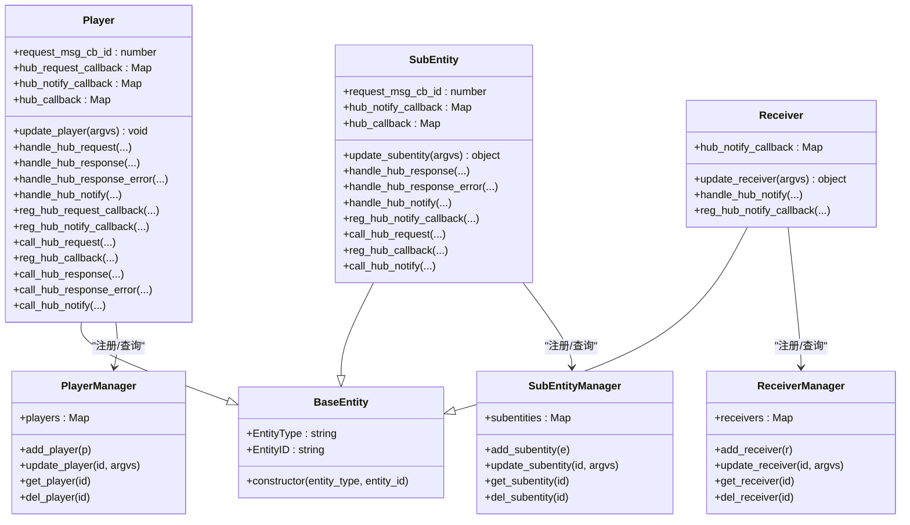
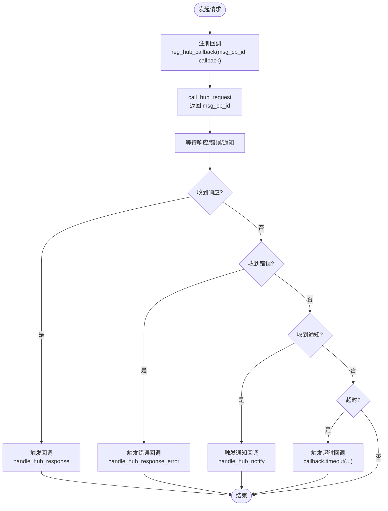
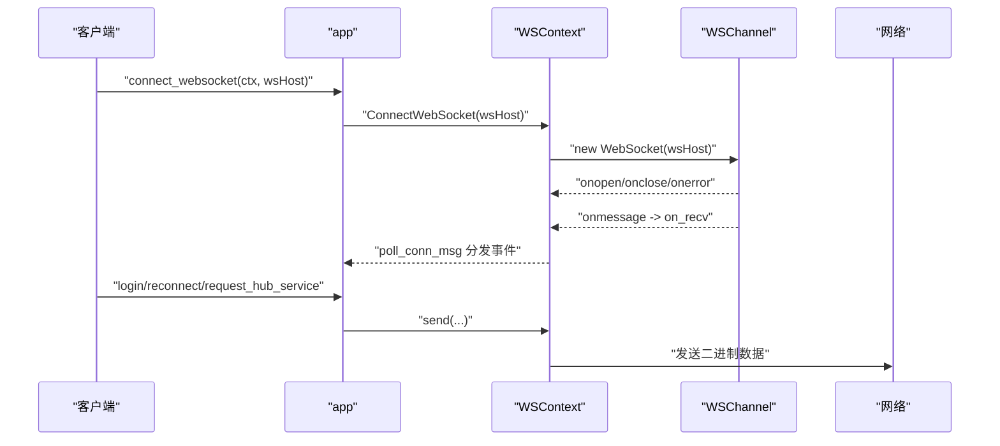
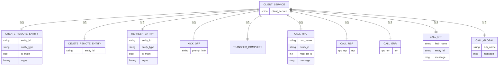
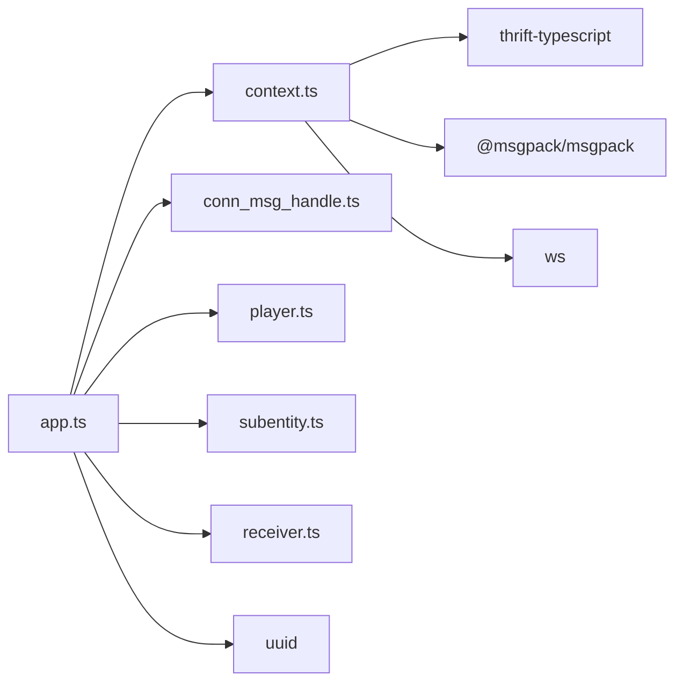

# TypeScript 客户端

<cite>
**本文引用的文件**
- [app.ts](file://expand/ts/engine/app.ts)
- [context.ts](file://expand/ts/engine/context.ts)
- [conn_msg_handle.ts](file://expand/ts/engine/conn_msg_handle.ts)
- [player.ts](file://expand/ts/engine/player.ts)
- [subentity.ts](file://expand/ts/engine/subentity.ts)
- [receiver.ts](file://expand/ts/engine/receiver.ts)
- [callback.ts](file://expand/ts/engine/callback.ts)
- [base_entity.ts](file://expand/ts/engine/base_entity.ts)
- [index.ts](file://expand/ts/engine/index.ts)
- [package.json](file://expand/ts/package.json)
- [app.ts](file://sample/client/ts/app.ts)
- [client.thrift](file://crates/proto/proto/client.thrift)
- [gate.thrift](file://crates/proto/proto/gate.thrift)
- [hub.thrift](file://crates/proto/proto/hub.thrift)
</cite>

## 目录
1. [简介](#简介)
2. [项目结构](#项目结构)
3. [核心组件](#核心组件)
4. [架构总览](#架构总览)
5. [组件详解](#组件详解)
6. [依赖关系分析](#依赖关系分析)
7. [性能考量](#性能考量)
8. [故障排查指南](#故障排查指南)
9. [结论](#结论)
10. [附录](#附录)

## 简介
本文件面向 TypeScript 客户端 SDK 的开发者与集成者，系统化阐述类型安全设计、现代 JavaScript 开发体验、实体管理与消息编解码、连接与协议栈、以及与前端框架的集成与优化建议。重点围绕 app 类的 TypeScript 实现，解释泛型约束、接口定义与类型推导；提供 TCP 与 WebSocket 的连接配置示例与参数校验；说明装饰器模式与依赖注入在本项目中的体现方式；详述实体管理的类型安全实现；给出异步编程最佳实践与错误处理策略；并附带 API 类型定义参考与实际项目集成示例。

## 项目结构
TypeScript 客户端位于 expand/ts/engine 下，采用按功能模块划分的组织方式：应用入口与事件调度、网络上下文与通道抽象、实体基类与管理器、回调与消息处理、以及对外导出索引。sample/client/ts 提供了完整示例工程，展示如何通过自定义 channel/context 实现 WebSocket/TCP 连接、注册实体类型、发起登录与服务请求、处理 RPC/通知等。

**图表来源**
- [app.ts:18-51](file://expand/ts/engine/app.ts#L18-L51)
- [context.ts:18-31](file://expand/ts/engine/context.ts#L18-L31)
- [conn_msg_handle.ts:9-17](file://expand/ts/engine/conn_msg_handle.ts#L9-L17)
- [player.ts:10-26](file://expand/ts/engine/player.ts#L10-L26)
- [subentity.ts:10-23](file://expand/ts/engine/subentity.ts#L10-L23)
- [receiver.ts:8-15](file://expand/ts/engine/receiver.ts#L8-L15)
- [callback.ts:7-20](file://expand/ts/engine/callback.ts#L7-L20)
- [app.ts:134-146](file://sample/client/ts/app.ts#L134-L146)

**章节来源**
- [index.ts:1-9](file://expand/ts/engine/index.ts#L1-L9)
- [package.json:1-15](file://expand/ts/package.json#L1-L15)

## 核心组件
- 应用入口与调度：app 类负责生命周期管理、心跳、连接、实体注册与更新、全局回调注册、消息轮询与关闭。
- 网络上下文与通道：context 抽象定义连接抽象与协议编解码；channel 抽象定义连接、发送、接收回调；示例中通过 WSChannel 实现 WebSocket 连接。
- 实体体系：base_entity 作为所有实体的基类；player/subentity/receiver 分别承载不同职责；各自配套 manager 管理集合。
- 回调与超时：callback 封装响应、错误与超时逻辑，统一释放资源。
- 协议与消息：基于 Thrift 定义的 gate_client_service、hub_call_client 等联合类型，配合 MsgPack 编解码。

**章节来源**
- [app.ts:18-51](file://expand/ts/engine/app.ts#L18-L51)
- [context.ts:18-31](file://expand/ts/engine/context.ts#L18-L31)
- [base_entity.ts:7-14](file://expand/ts/engine/base_entity.ts#L7-L14)
- [player.ts:10-26](file://expand/ts/engine/player.ts#L10-L26)
- [subentity.ts:10-23](file://expand/ts/engine/subentity.ts#L10-L23)
- [receiver.ts:8-15](file://expand/ts/engine/receiver.ts#L8-L15)
- [callback.ts:7-20](file://expand/ts/engine/callback.ts#L7-L20)

## 架构总览
下图展示了从应用层到网络层、再到协议层的消息流转与职责边界。

**图表来源**
- [app.ts:65-73](file://expand/ts/engine/app.ts#L65-L73)
- [context.ts:26-27](file://expand/ts/engine/context.ts#L26-L27)
- [context.ts:75-95](file://expand/ts/engine/context.ts#L75-L95)
- [context.ts:199-269](file://expand/ts/engine/context.ts#L199-L269)
- [client.thrift:99-112](file://crates/proto/proto/client.thrift#L99-L112)
- [gate.thrift:216-225](file://crates/proto/proto/gate.thrift#L216-L225)

## 组件详解

### app 类：类型安全与现代 JS 体验
- 单例与生命周期：维护单例实例、心跳定时器、运行标志与消息轮询。
- 连接与事件：支持 WebSocket/TCP 连接；提供 on_conn 回调；封装登录、重连、请求服务等。
- 泛型约束与类型推导：通过 Map 的键值对与回调签名，利用 TypeScript 的类型推导确保传入的实体创建器与回调函数签名一致。
- 异步与错误处理：登录/重连/请求服务均返回布尔值以表示是否成功提交；消息轮询通过 setTimeout 递归实现，避免阻塞主线程。
- 全局回调与实体管理：register/register_global_method 提供类型安全的注册；update_entity/delete_entity 统一委托给各管理器。

**图表来源**
- [app.ts:18-51](file://expand/ts/engine/app.ts#L18-L51)
- [app.ts:98-117](file://expand/ts/engine/app.ts#L98-L117)
- [app.ts:119-144](file://expand/ts/engine/app.ts#L119-L144)

**章节来源**
- [app.ts:18-51](file://expand/ts/engine/app.ts#L18-L51)
- [app.ts:53-57](file://expand/ts/engine/app.ts#L53-L57)
- [app.ts:65-73](file://expand/ts/engine/app.ts#L65-L73)
- [app.ts:98-117](file://expand/ts/engine/app.ts#L98-L117)
- [app.ts:119-144](file://expand/ts/engine/app.ts#L119-L144)

### context 与 channel：连接抽象与协议编解码
- channel 抽象：定义 connect/on_recv/send 三个核心方法，屏蔽底层传输细节。
- context 抽象：持有 channel 实例，负责粘包拆包、Thrift 协议编解码、发送与接收队列 evs 的处理。
- 协议栈：使用 TBufferedTransport + TCompactProtocol 对 Thrift 结构进行序列化/反序列化；消息头包含长度字段，便于可靠拆包。
- 上下文方法：login/reconnect/request_hub_service/call_rpc/call_rsp/call_err/call_ntf/heartbeats/poll_conn_msg 等。

**图表来源**
- [context.ts:6-10](file://expand/ts/engine/context.ts#L6-L10)
- [context.ts:18-31](file://expand/ts/engine/context.ts#L18-L31)
- [context.ts:75-95](file://expand/ts/engine/context.ts#L75-L95)
- [context.ts:199-269](file://expand/ts/engine/context.ts#L199-L269)

**章节来源**
- [context.ts:18-31](file://expand/ts/engine/context.ts#L18-L31)
- [context.ts:32-73](file://expand/ts/engine/context.ts#L32-L73)
- [context.ts:75-95](file://expand/ts/engine/context.ts#L75-L95)
- [context.ts:199-269](file://expand/ts/engine/context.ts#L199-L269)

### 实体管理：类型安全与状态管理
- 基类与继承：base_entity 统一存储 EntityType/EntityID；player/subentity/receiver 承载不同职责。
- 管理器：player_manager/subentity_manager/receiver_manager 使用 Map 存储实体，提供增删查与批量更新。
- 回调与通知：实体可注册 hub 请求/通知回调，处理响应与错误；通过 app 上下文回传结果。
- 更新与删除：app.update_entity/delete_entity 统一委托给各管理器，确保一致性。

**图表来源**
- [base_entity.ts:7-14](file://expand/ts/engine/base_entity.ts#L7-L14)
- [player.ts:10-26](file://expand/ts/engine/player.ts#L10-L26)
- [player.ts:30-101](file://expand/ts/engine/player.ts#L30-L101)
- [subentity.ts:10-23](file://expand/ts/engine/subentity.ts#L10-L23)
- [subentity.ts:25-75](file://expand/ts/engine/subentity.ts#L25-L75)
- [receiver.ts:8-15](file://expand/ts/engine/receiver.ts#L8-L15)
- [player.ts:104-129](file://expand/ts/engine/player.ts#L104-L129)
- [subentity.ts:78-103](file://expand/ts/engine/subentity.ts#L78-L103)
- [receiver.ts:31-56](file://expand/ts/engine/receiver.ts#L31-L56)

**章节来源**
- [base_entity.ts:7-14](file://expand/ts/engine/base_entity.ts#L7-L14)
- [player.ts:10-26](file://expand/ts/engine/player.ts#L10-L26)
- [subentity.ts:10-23](file://expand/ts/engine/subentity.ts#L10-L23)
- [receiver.ts:8-15](file://expand/ts/engine/receiver.ts#L8-L15)
- [player.ts:104-129](file://expand/ts/engine/player.ts#L104-L129)
- [subentity.ts:78-103](file://expand/ts/engine/subentity.ts#L78-L103)
- [receiver.ts:31-56](file://expand/ts/engine/receiver.ts#L31-L56)

### 回调与超时：Promise 链式调用与 async/await
- callback 封装：提供 callback/error 与 timeout 回调；内部通过 setTimeout 触发超时；release 用于资源回收。
- 在实体中使用：实体通过 reg_hub_callback 注册回调，call_hub_request 返回 msg_cb_id；收到响应后自动清理。
- 异步最佳实践：推荐在业务层将回调转换为 Promise 包装，结合 async/await 使用；错误处理采用 try/catch 与链式 .catch。

**图表来源**
- [callback.ts:7-20](file://expand/ts/engine/callback.ts#L7-L20)
- [callback.ts:22-38](file://expand/ts/engine/callback.ts#L22-L38)
- [player.ts:30-101](file://expand/ts/engine/player.ts#L30-L101)
- [subentity.ts:25-75](file://expand/ts/engine/subentity.ts#L25-L75)

**章节来源**
- [callback.ts:7-20](file://expand/ts/engine/callback.ts#L7-L20)
- [callback.ts:22-38](file://expand/ts/engine/callback.ts#L22-L38)
- [player.ts:30-101](file://expand/ts/engine/player.ts#L30-L101)
- [subentity.ts:25-75](file://expand/ts/engine/subentity.ts#L25-L75)

### 连接配置示例：TCP 与 WebSocket
- WebSocket：示例中通过 WSChannel 实现 connect/on_recv/send；WSContext.ConnectWebSocket 返回该通道并绑定 on_recv。
- TCP：示例中 WSContext.ConnectTcp 返回一个 WSChannel（演示目的），实际生产中应替换为 TCP 通道实现。
- 参数校验：host/port 与 wsHost 字符串需满足网络可达性；on_recv 中需兼容 Buffer/ArrayBuffer/Buffer 数组等输入格式。
- 登录与服务：app.login/app.reconnect/app.request_hub_service 均通过 context 发送 Thrift 结构；参数 argvs 通过 MsgPack 编码。

**图表来源**
- [app.ts:134-146](file://sample/client/ts/app.ts#L134-L146)
- [app.ts:121-132](file://sample/client/ts/app.ts#L121-L132)
- [app.ts:74-119](file://sample/client/ts/app.ts#L74-L119)
- [context.ts:75-95](file://expand/ts/engine/context.ts#L75-L95)

**章节来源**
- [app.ts:74-132](file://sample/client/ts/app.ts#L74-L132)
- [app.ts:134-146](file://sample/client/ts/app.ts#L134-L146)
- [context.ts:75-95](file://expand/ts/engine/context.ts#L75-L95)

### 装饰器模式与依赖注入
- 依赖注入：app 构造时注入 client_event_handle、player/subentity/receiver 管理器；context 注入 channel；conn_msg_handle 注入 app。
- 装饰器模式：本项目未直接使用 TypeScript 装饰器语法，但通过“工厂+注册”实现类似效果：app.register 注册实体创建器；conn_msg_handle 根据实体类型分发创建/更新/删除。
- 可扩展性：新增实体类型只需实现对应基类并提供静态 Creator 工厂方法，再通过 app.register 注册即可。

**章节来源**
- [app.ts:119-128](file://expand/ts/engine/app.ts#L119-L128)
- [conn_msg_handle.ts:10-17](file://expand/ts/engine/conn_msg_handle.ts#L10-L17)
- [app.ts:19-48](file://sample/client/ts/app.ts#L19-L48)
- [app.ts:50-72](file://sample/client/ts/app.ts#L50-L72)

### 异步编程最佳实践
- Promise 包装：将 callback 转换为 Promise，结合 async/await 提升可读性与可维护性。
- 错误处理：使用 try/catch 捕获异常；对网络/协议错误进行分类处理；对超时场景设置合理阈值。
- 并发控制：限制并发请求数量，避免拥塞；对重复请求进行去重或合并。
- 资源回收：确保回调在使用后及时释放，防止内存泄漏。

[本节为通用指导，不直接分析具体文件]

### API 类型定义参考
- client_service 联合类型：包含创建/删除/刷新实体、连接 ID、踢出、迁移完成、RPC/响应/错误/通知、全局消息与心跳等。
- gate_client_service 联合类型：包含登录、重连、请求服务、RPC/响应/错误/通知、心跳等。
- hub_call_client 联合类型：包含创建/删除/刷新实体、RPC/响应/错误/通知、全局消息、踢出/迁移等。

**图表来源**
- [client.thrift:7-112](file://crates/proto/proto/client.thrift#L7-L112)

**章节来源**
- [client.thrift:99-112](file://crates/proto/proto/client.thrift#L99-L112)
- [gate.thrift:216-225](file://crates/proto/proto/gate.thrift#L216-L225)
- [hub.thrift:216-242](file://crates/proto/proto/hub.thrift#L216-L242)

### 与前端框架集成与性能优化
- React/Vue 集成：将 app 实例挂载到全局状态（如 Redux/Zustand/Pinia），在组件中通过 hooks/useStore 订阅状态变化；避免在渲染阶段执行耗时操作。
- 性能优化：减少不必要的实体更新；对高频通知进行节流/防抖；使用 Web Workers 处理大量计算；合理设置心跳间隔与超时时间。
- 网络优化：复用连接；压缩消息体；在移动端启用低功耗模式；在网络切换时自动重连。

[本节为通用指导，不直接分析具体文件]

## 依赖关系分析
- 内聚与耦合：app 与 context 通过接口解耦；实体管理器与 app 通过单例弱耦合；channel 与 context 为组合关系。
- 外部依赖：@msgpack/msgpack 用于二进制编解码；thrift-typescript 与 ws 用于协议与 WebSocket；uuid 用于登录标识。
- 循环依赖：当前结构未发现循环导入；若新增模块需注意避免相互引用。

**图表来源**
- [package.json:2-13](file://expand/ts/package.json#L2-L13)
- [app.ts:1-12](file://expand/ts/engine/app.ts#L1-L12)
- [context.ts:12-16](file://expand/ts/engine/context.ts#L12-L16)

**章节来源**
- [package.json:1-15](file://expand/ts/package.json#L1-L15)

## 性能考量
- 消息轮询：app.poll 使用 setTimeout 递归，建议根据帧率调整间隔（如 16ms），避免过频导致 CPU 占用过高。
- 编解码开销：Thrift Compact 协议较高效；对大对象建议分片传输或压缩。
- 内存管理：实体删除后及时清理回调与监听；避免闭包持有大对象导致 GC 不及时。
- 网络层：WebSocket/TCP 选择应考虑延迟与稳定性；在弱网环境下启用重连与退避策略。

[本节为通用指导，不直接分析具体文件]

## 故障排查指南
- 连接失败：检查 wsHost/host:port 是否可达；确认 onerror/onclose 回调日志；验证证书与跨域设置。
- 登录/重连失败：确认 argvs 编码正确；检查 sdk_uuid/account_id 格式；观察 on_conn 是否触发。
- RPC 超时：增大 timeout 阈值；检查服务端处理耗时；对高频请求进行限流。
- 消息乱序/丢失：检查粘包拆包逻辑；确认 evs 队列处理顺序；必要时引入序列号与去重。

**章节来源**
- [app.ts:74-119](file://sample/client/ts/app.ts#L74-L119)
- [context.ts:32-73](file://expand/ts/engine/context.ts#L32-L73)
- [callback.ts:33-38](file://expand/ts/engine/callback.ts#L33-L38)

## 结论
本 TypeScript 客户端 SDK 通过清晰的模块划分与强类型设计，提供了高内聚、低耦合的架构。app 类作为中枢，结合 context/channel 的抽象与 Thrift 协议栈，实现了稳定可靠的网络通信；实体管理器与回调系统保证了类型安全与可扩展性。配合示例工程与最佳实践，开发者可以快速集成并优化在各类前端框架中的表现。

## 附录
- 示例工程路径：sample/client/ts
- 关键文件清单：app.ts、context.ts、conn_msg_handle.ts、player.ts、subentity.ts、receiver.ts、callback.ts、base_entity.ts、index.ts、package.json
- 协议文件：client.thrift、gate.thrift、hub.thrift