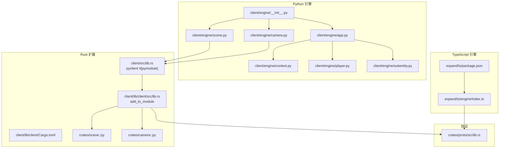
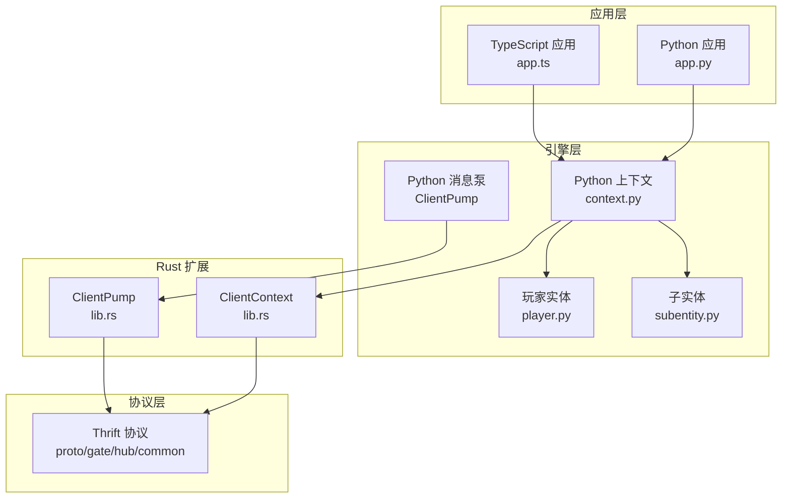
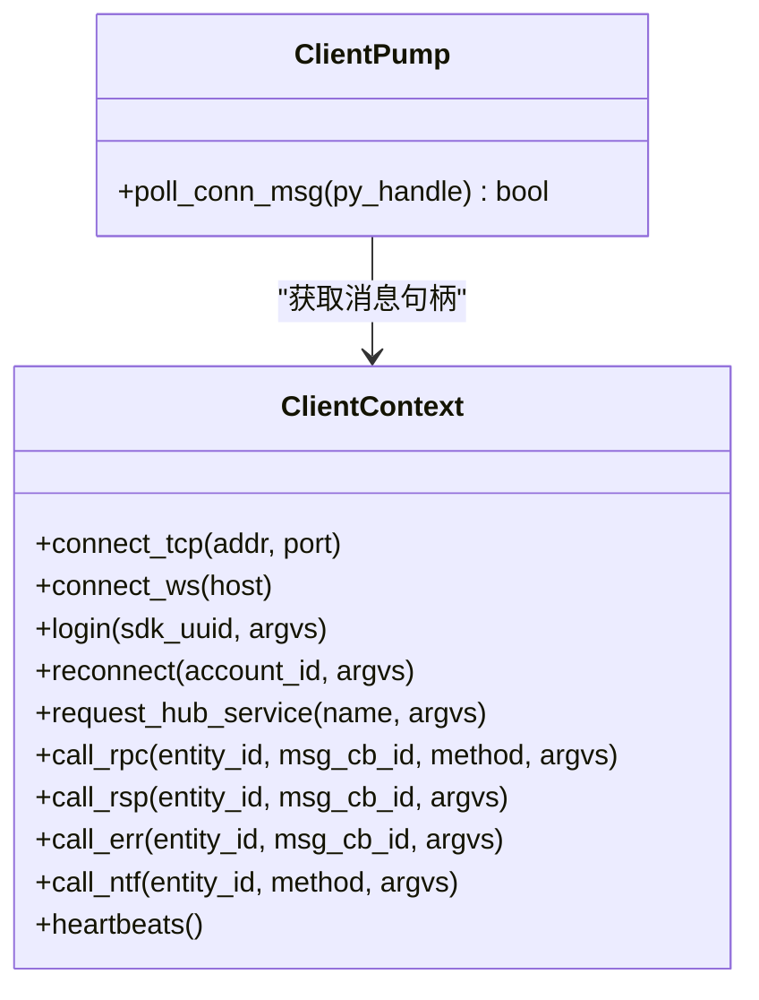
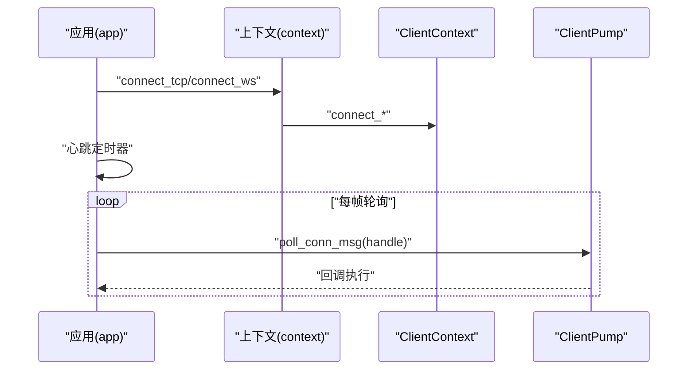
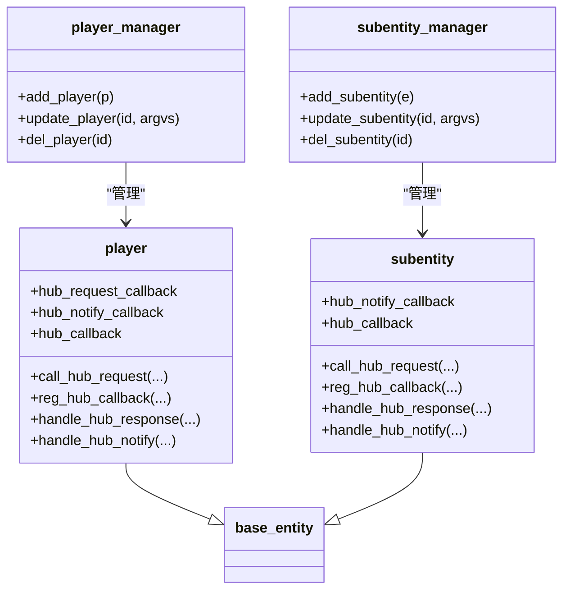
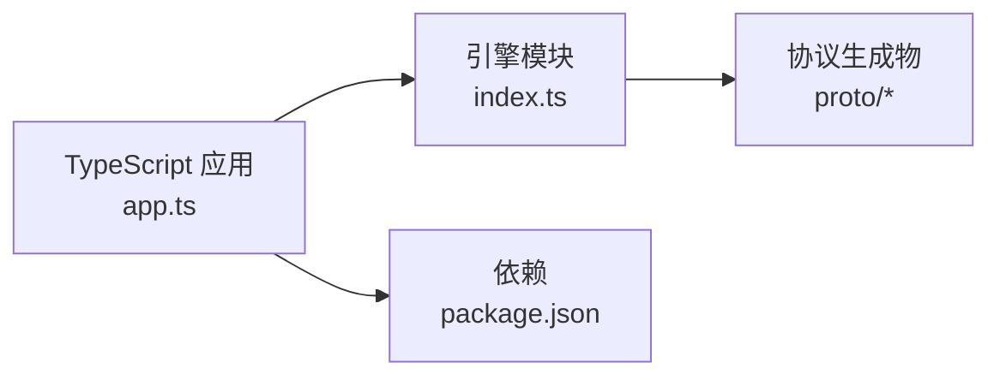
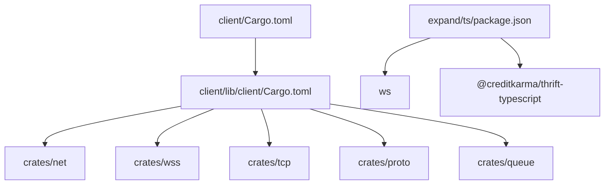

# 客户端 SDK

<cite>
**本文引用的文件**
- [client/Cargo.toml](file://client/Cargo.toml)
- [client/lib/client/Cargo.toml](file://client/lib/client/Cargo.toml)
- [client/src/lib.rs](file://client/src/lib.rs)
- [client/lib/client/src/lib.rs](file://client/lib/client/src/lib.rs)
- [client/engine/__init__.py](file://client/engine/__init__.py)
- [client/engine/app.py](file://client/engine/app.py)
- [client/engine/context.py](file://client/engine/context.py)
- [client/engine/session.py](file://client/engine/session.py)
- [client/engine/player.py](file://client/engine/player.py)
- [client/engine/subentity.py](file://client/engine/subentity.py)
- [client/engine/scene.py](file://client/engine/scene.py)
- [client/engine/camera.py](file://client/engine/camera.py)
- [client/lib/client/src/py/mod.rs](file://client/lib/client/src/py/mod.rs)
- [client/lib/client/src/py/camera.rs](file://client/lib/client/src/py/camera.rs)
- [client/lib/client/src/py/scene.rs](file://client/lib/client/src/py/scene.rs)
- [client/lib/client/src/py/scene_object.rs](file://client/lib/client/src/py/scene_object.rs)
- [client/lib/client/src/py/aabb.rs](file://client/lib/client/src/py/aabb.rs)
- [client/lib/client/src/py/transform.rs](file://client/lib/client/src/py/transform.rs)
- [expand/ts/package.json](file://expand/ts/package.json)
- [expand/ts/engine/index.ts](file://expand/ts/engine/index.ts)
- [sample/client/py/app.py](file://sample/client/py/app.py)
- [sample/client/ts/app.ts](file://sample/client/ts/app.ts)
- [crates/proto/src/lib.rs](file://crates/proto/src/lib.rs)
</cite>

## 目录
1. [简介](#简介)
2. [项目结构](#项目结构)
3. [核心组件](#核心组件)
4. [架构总览](#架构总览)
5. [详细组件分析](#详细组件分析)
6. [依赖分析](#依赖分析)
7. [性能考虑](#性能考虑)
8. [故障排查指南](#故障排查指南)
9. [结论](#结论)
10. [附录](#附录)

## 简介
本指南面向希望在 Rust、Python、TypeScript 三种语言中使用 geese 客户端 SDK 的开发者，系统讲解客户端应用框架的设计与实现，覆盖连接管理、消息处理、实体管理（玩家与子实体）、会话控制、错误处理、重连机制与性能优化，并提供 API 使用示例与集成调试方法。文档以仓库现有代码为依据，确保内容可追溯到具体源码文件。

## 项目结构
geese 客户端 SDK 在仓库中以多语言实现并共享同一套协议与引擎逻辑：
- Rust 扩展：顶层 cdylib `pyclient`（`client/src/lib.rs`）仅声明 `#[pymodule]`，调用子 crate `client::add_to_module` 统一注册所有 pyo3 类（网络、场景、相机）。
- Python 引擎：提供应用入口、连接上下文、实体管理器、回调与消息轮询等高层封装。
- 渲染场景与相机：`crates/scene` / `crates/camera` 启用 `pyo3` feature 后由 `client::add_to_module` 转发注册到 `pyclient`，覆盖 glTF 导入、八叉树可见性查询、动画推进、视锥体裁剪。
- TypeScript 引擎：提供与 Python 引擎一致的接口与行为，用于浏览器或 Node.js 环境。
- 协议层：统一的 Thrift 协议与消息模型，支撑跨语言通信。
- 隔离说明：server 侧 `pyhub` 仅提供物理（rapier）与 Hub 运行时，client 侧 `pyclient` 仅提供网络与渲染场景；二者完全隔离。

**图表来源**
- [client/lib/client/src/lib.rs:1-116](file://client/lib/client/src/lib.rs#L1-L116)
- [client/src/lib.rs:1-9](file://client/src/lib.rs#L1-L9)
- [client/lib/client/Cargo.toml:1-24](file://client/lib/client/Cargo.toml#L1-L24)
- [client/engine/app.py:1-157](file://client/engine/app.py#L1-L157)
- [client/engine/context.py:1-39](file://client/engine/context.py#L1-L39)
- [client/engine/player.py:1-108](file://client/engine/player.py#L1-L108)
- [client/engine/subentity.py:1-89](file://client/engine/subentity.py#L1-L89)
- [client/engine/__init__.py:1-8](file://client/engine/__init__.py#L1-L8)
- [expand/ts/engine/index.ts:1-9](file://expand/ts/engine/index.ts#L1-L9)
- [expand/ts/package.json:1-15](file://expand/ts/package.json#L1-L15)
- [crates/proto/src/lib.rs:1-5](file://crates/proto/src/lib.rs#L1-L5)

**章节来源**
- [client/Cargo.toml:1-21](file://client/Cargo.toml#L1-L21)
- [client/lib/client/Cargo.toml:1-24](file://client/lib/client/Cargo.toml#L1-L24)
- [client/src/lib.rs:1-9](file://client/src/lib.rs#L1-L9)
- [client/lib/client/src/lib.rs:1-116](file://client/lib/client/src/lib.rs#L1-L116)
- [client/engine/__init__.py:1-8](file://client/engine/__init__.py#L1-L8)
- [client/engine/app.py:1-157](file://client/engine/app.py#L1-L157)
- [client/engine/context.py:1-39](file://client/engine/context.py#L1-L39)
- [client/engine/player.py:1-108](file://client/engine/player.py#L1-L108)
- [client/engine/subentity.py:1-89](file://client/engine/subentity.py#L1-L89)
- [expand/ts/engine/index.ts:1-9](file://expand/ts/engine/index.ts#L1-L9)
- [expand/ts/package.json:1-15](file://expand/ts/package.json#L1-L15)
- [crates/proto/src/lib.rs:1-5](file://crates/proto/src/lib.rs#L1-L5)

## 核心组件
- 应用入口与事件回调
  - Python：应用类负责构建上下文、注册实体创建器、启动轮询、心跳与事件回调转发。
  - TypeScript：提供与 Python 对齐的 app 类与事件回调接口。
- 连接上下文
  - Python：context 封装 TCP/WS 连接、登录、重连、服务请求、RPC/通知等消息发送。
  - Rust：ClientContext 暴露连接与消息发送方法，供 Python 扩展调用。
- 实体管理
  - 玩家实体与子实体：统一的消息回调注册、响应处理、通知分发与实体生命周期管理。
- 消息泵与轮询
  - Python：ClientPump 轮询连接消息，驱动回调执行；应用主循环按帧节流。
  - Rust：GateMsgHandle 提供 poll 钩子，配合 Python 扩展进行消息处理。
- pyo3 注册入口
  - `pyclient` cdylib（`client/src/lib.rs`）：顶层 `#[pymodule]` 函数，仅调用 `client::add_to_module(m)`，不直接注册 pyclass。
  - `client::add_to_module`（`client/lib/client/src/lib.rs`）：集中注册 `ClientContext` / `ClientPump`，并转发 `client::py::add_to_module(m)` 注册全部渲染相关 pyclass。
  - `client::py`（`client/lib/client/src/py/mod.rs`）：作为渲染层 pyo3 包装的统一入口，集中注册 `Plane` / `Frustum` / `AABB` / `Transform` / `SceneObject` / `SceneNode` / `Scene` 7 个 pyclass。底层 `crates/camera`、`crates/scene` **零 pyo3 依赖**，仅暴露纯 Rust API。
- 渲染场景与相机
  - `Scene` / `SceneNode` / `SceneObject` / `AABB` / `Transform`：glTF 导入、八叉树可见性查询、动画推进、世界矩阵访问。
  - `Frustum` / `Plane`：从 View×Projection 矩阵构造视锥体，提供点 / 球 / AABB 的包含与相交查询。

**章节来源**
- [client/engine/app.py:40-157](file://client/engine/app.py#L40-L157)
- [client/engine/context.py:4-39](file://client/engine/context.py#L4-L39)
- [client/src/lib.rs:1-7](file://client/src/lib.rs#L1-L7)
- [client/lib/client/src/lib.rs:27-131](file://client/lib/client/src/lib.rs#L27-L131)
- [client/engine/player.py:9-108](file://client/engine/player.py#L9-L108)
- [client/engine/subentity.py:9-89](file://client/engine/subentity.py#L9-L89)
- [client/engine/scene.py:1-35](file://client/engine/scene.py#L1-L35)
- [client/engine/camera.py:1-12](file://client/engine/camera.py#L1-L12)
- [client/lib/client/src/py/mod.rs:1-41](file://client/lib/client/src/py/mod.rs#L1-L41)
- [client/lib/client/src/py/camera.rs:1-128](file://client/lib/client/src/py/camera.rs#L1-L128)
- [client/lib/client/src/py/scene.rs:1-212](file://client/lib/client/src/py/scene.rs#L1-L212)

## 架构总览
下图展示客户端 SDK 的三层结构：协议层、引擎层、应用层。Rust 扩展作为引擎层的核心，Python/TS 引擎提供高层 API 与运行时环境。

**图表来源**
- [client/engine/app.py:40-157](file://client/engine/app.py#L40-L157)
- [client/engine/context.py:4-39](file://client/engine/context.py#L4-L39)
- [client/lib/client/src/lib.rs:27-116](file://client/lib/client/src/lib.rs#L27-L116)
- [client/engine/player.py:9-108](file://client/engine/player.py#L9-L108)
- [client/engine/subentity.py:9-89](file://client/engine/subentity.py#L9-L89)
- [crates/proto/src/lib.rs:1-5](file://crates/proto/src/lib.rs#L1-L5)

## 详细组件分析

### Rust 扩展与消息泵
- ClientContext：封装连接与消息发送，暴露 TCP/WS 连接、登录、重连、服务请求、RPC/通知、心跳等方法。
- ClientPump：持有 GateMsgHandle，提供 poll_conn_msg 回调驱动。
- 与协议绑定：通过 proto::gate 与 proto::common 的消息类型进行编解码与传输。

**图表来源**
- [client/lib/client/src/lib.rs:27-116](file://client/lib/client/src/lib.rs#L27-L116)

**章节来源**
- [client/lib/client/src/lib.rs:1-116](file://client/lib/client/src/lib.rs#L1-L116)
- [client/src/lib.rs:1-9](file://client/src/lib.rs#L1-L9)

### Python 引擎：应用与连接
- app：构建上下文、注册实体创建器、启动心跳、事件回调转发、消息轮询与帧节流。
- context：对 ClientContext 的轻量封装，统一对外接口。
- 心跳：定时触发，维持连接活跃。
- 轮询：阻塞式轮询连接消息，避免阻塞主线程。

**图表来源**
- [client/engine/app.py:73-157](file://client/engine/app.py#L73-L157)
- [client/engine/context.py:8-39](file://client/engine/context.py#L8-L39)
- [client/lib/client/src/lib.rs:41-94](file://client/lib/client/src/lib.rs#L41-L94)

**章节来源**
- [client/engine/app.py:40-157](file://client/engine/app.py#L40-L157)
- [client/engine/context.py:4-39](file://client/engine/context.py#L4-L39)

### 实体管理：玩家与子实体
- 玩家实体 player：维护 hub 请求/通知回调映射，支持 RPC 请求编号分配与响应处理。
- 子实体 subentity：与玩家类似，但更聚焦于通知与响应处理。
- 管理器：player_manager 与 subentity_manager 统一更新与删除实体。

**图表来源**
- [client/engine/player.py:9-108](file://client/engine/player.py#L9-L108)
- [client/engine/subentity.py:9-89](file://client/engine/subentity.py#L9-L89)

**章节来源**
- [client/engine/player.py:1-108](file://client/engine/player.py#L1-L108)
- [client/engine/subentity.py:1-89](file://client/engine/subentity.py#L1-L89)

### TypeScript 引擎与协议
- TypeScript 引擎导出与 Python 引擎一致的 API，便于在浏览器或 Node.js 环境使用。
- 依赖包：ws、uuid、thrift 等，用于 WebSocket 连接与消息编解码。
- 协议索引：通过 index.ts 导出 app、player、subentity 等模块。

**图表来源**
- [expand/ts/engine/index.ts:1-9](file://expand/ts/engine/index.ts#L1-L9)
- [expand/ts/package.json:1-15](file://expand/ts/package.json#L1-L15)

**章节来源**
- [expand/ts/engine/index.ts:1-9](file://expand/ts/engine/index.ts#L1-L9)
- [expand/ts/package.json:1-15](file://expand/ts/package.json#L1-L15)

### API 使用示例与最佳实践
以下示例基于仓库中的样例工程，展示常见场景的调用路径与注意事项。请根据实际业务替换参数与回调逻辑。

- 建立连接与登录
  - Python：在连接回调中调用登录，随后注册实体创建器并启动应用循环。
  - TypeScript：通过自定义 channel 上下文连接 WebSocket，在连接完成回调中发起登录。
  
  参考路径：
  - [sample/client/py/app.py:55-68](file://sample/client/py/app.py#L55-L68)
  - [sample/client/ts/app.ts:134-145](file://sample/client/ts/app.ts#L134-L145)

- 身份验证与重连
  - 登录：通过上下文发送登录请求，携带 SDK UUID 与参数。
  - 重连：在断线后使用账号标识与参数发起重连。
  
  参考路径：
  - [client/engine/context.py:14-18](file://client/engine/context.py#L14-L18)
  - [client/lib/client/src/lib.rs:51-59](file://client/lib/client/src/lib.rs#L51-L59)

- 消息发送与接收
  - RPC 请求/响应/错误：玩家与子实体通过统一接口发起请求并注册回调。
  - 通知：支持 hub 侧向客户端推送通知。
  
  参考路径：
  - [client/engine/player.py:68-88](file://client/engine/player.py#L68-L88)
  - [client/engine/subentity.py:57-69](file://client/engine/subentity.py#L57-L69)

- 实体操作
  - 注册实体创建器：在应用层注册实体类型与工厂函数。
  - 更新/删除：通过管理器统一更新或删除实体。
  
  参考路径：
  - [sample/client/py/app.py:63-64](file://sample/client/py/app.py#L63-L64)
  - [client/engine/app.py:117-129](file://client/engine/app.py#L117-L129)

- 事件处理
  - 踢下线与迁移完成事件：通过事件回调处理服务器推送的事件。
  
  参考路径：
  - [sample/client/py/app.py:7-14](file://sample/client/py/app.py#L7-L14)
  - [client/engine/app.py:78-82](file://client/engine/app.py#L78-L82)

**章节来源**
- [sample/client/py/app.py:1-71](file://sample/client/py/app.py#L1-L71)
- [sample/client/ts/app.ts:1-146](file://sample/client/ts/app.ts#L1-L146)
- [client/engine/context.py:14-36](file://client/engine/context.py#L14-L36)
- [client/lib/client/src/lib.rs:51-88](file://client/lib/client/src/lib.rs#L51-L88)
- [client/engine/player.py:68-88](file://client/engine/player.py#L68-L88)
- [client/engine/subentity.py:57-69](file://client/engine/subentity.py#L57-L69)
- [client/engine/app.py:78-82](file://client/engine/app.py#L78-L82)

### 各语言差异与特殊用法
- Python
  - 通过 PyO3 导出 Rust 实现的 ClientContext 与 ClientPump，应用层以线程+事件循环的方式进行消息轮询。
  - 心跳采用 Timer 定时器，轮询中加入帧节流，避免 CPU 占用过高。
- TypeScript
  - 通过 ws 与 uuid 等依赖实现 WebSocket 连接与消息编解码；引擎 API 与 Python 保持一致。
  - 通过自定义 channel 上下文注入连接实现，便于在浏览器或 Node.js 环境复用。
- Rust
  - 作为扩展模块被 Python 调用，直接对接协议层消息类型，提供最小化的消息发送与连接接口。

**章节来源**
- [client/Cargo.toml:1-21](file://client/Cargo.toml#L1-L21)
- [client/lib/client/Cargo.toml:1-24](file://client/lib/client/Cargo.toml#L1-L24)
- [client/src/lib.rs:1-9](file://client/src/lib.rs#L1-L9)
- [client/engine/app.py:73-157](file://client/engine/app.py#L73-L157)
- [expand/ts/package.json:1-15](file://expand/ts/package.json#L1-L15)
- [expand/ts/engine/index.ts:1-9](file://expand/ts/engine/index.ts#L1-L9)

## 依赖分析
- Rust 扩展依赖
  - tokio、async-trait、thrift、serde、uuid 等，提供异步网络与序列化能力。
  - 内部依赖 crates/net、wss、tcp、proto、queue、close_handle、asset、camera、math、render、scene 等，其中 `camera`、`scene` 为零 pyo3 依赖的纯 Rust crate，pyo3 包装全部集中在 `client/lib/client/src/py/`，形成完整客户端运行时。
- Python 扩展依赖
  - pyo3、tokio、thrift、serde_json、uuid、tracing 等，桥接 Rust 与 Python。
- TypeScript 依赖
  - ws、uuid、thrift、@creditkarma/thrift-typescript 等，用于 WebSocket 与协议编解码。

**图表来源**
- [client/lib/client/Cargo.toml:13-23](file://client/lib/client/Cargo.toml#L13-L23)
- [client/Cargo.toml:8-16](file://client/Cargo.toml#L8-L16)
- [expand/ts/package.json:2-13](file://expand/ts/package.json#L2-L13)

**章节来源**
- [client/lib/client/Cargo.toml:1-24](file://client/lib/client/Cargo.toml#L1-L24)
- [client/Cargo.toml:1-21](file://client/Cargo.toml#L1-L21)
- [expand/ts/package.json:1-15](file://expand/ts/package.json#L1-L15)

## 性能考虑
- 轮询节流：应用层在每帧轮询后进行时间差计算并睡眠，保证固定帧率下的 CPU 占用稳定。
- 心跳频率：定时心跳维持连接活跃，建议根据网络状况调整周期。
- 消息队列：协议层使用队列组件，避免阻塞主循环。
- 序列化开销：统一使用 Thrift/MsgPack 编解码，建议在高频 RPC 中减少不必要的数据拷贝。

**章节来源**
- [client/engine/app.py:146-157](file://client/engine/app.py#L146-L157)
- [client/lib/client/Cargo.toml:17-17](file://client/lib/client/Cargo.toml#L17-L17)

## 故障排查指南
- 连接失败
  - 检查地址与端口是否正确，确认网络可达。
  - 查看连接回调是否触发，以及日志输出。
- 登录/重连异常
  - 确认 SDK UUID 与参数格式正确，检查服务端返回的错误信息。
- RPC 回调未触发
  - 确认已注册回调与消息编号匹配，检查响应/错误处理分支。
- 心跳中断
  - 检查定时器是否正常运行，确认网络波动与服务器状态。
- 踢下线与迁移
  - 实现事件回调处理踢下线与迁移完成事件，确保资源清理与重新连接流程。

**章节来源**
- [sample/client/py/app.py:7-14](file://sample/client/py/app.py#L7-L14)
- [client/engine/app.py:78-82](file://client/engine/app.py#L78-L82)
- [client/engine/player.py:39-53](file://client/engine/player.py#L39-L53)
- [client/engine/subentity.py:31-45](file://client/engine/subentity.py#L31-L45)

## 结论
geese 客户端 SDK 通过 Rust 扩展与 Python/TS 引擎实现了跨语言的一致性体验。其设计强调连接管理、消息处理、实体管理与会话控制的清晰分离，辅以完善的事件回调与轮询机制，适合在多平台环境中快速集成与扩展。遵循本文档的最佳实践与示例路径，开发者可以高效地完成从连接建立到消息收发的全链路开发。

## 附录
- 协议模块：proto/gate、proto/hub、proto/common 等模块提供统一的 RPC/通知/全局消息定义。
- 引擎导出：Python 引擎通过 __init__.py 汇总导出 app、session、player、subentity、receiver、msgpack 等模块，便于外部引用。

**章节来源**
- [crates/proto/src/lib.rs:1-5](file://crates/proto/src/lib.rs#L1-L5)
- [client/engine/__init__.py:1-8](file://client/engine/__init__.py#L1-L8)