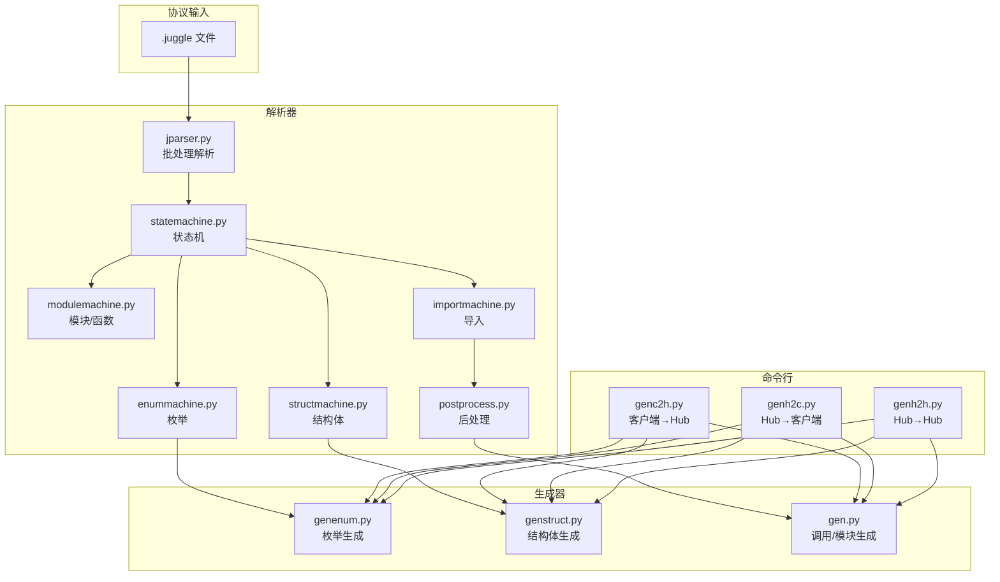
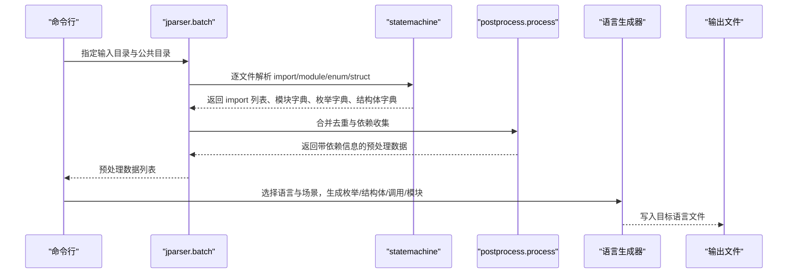
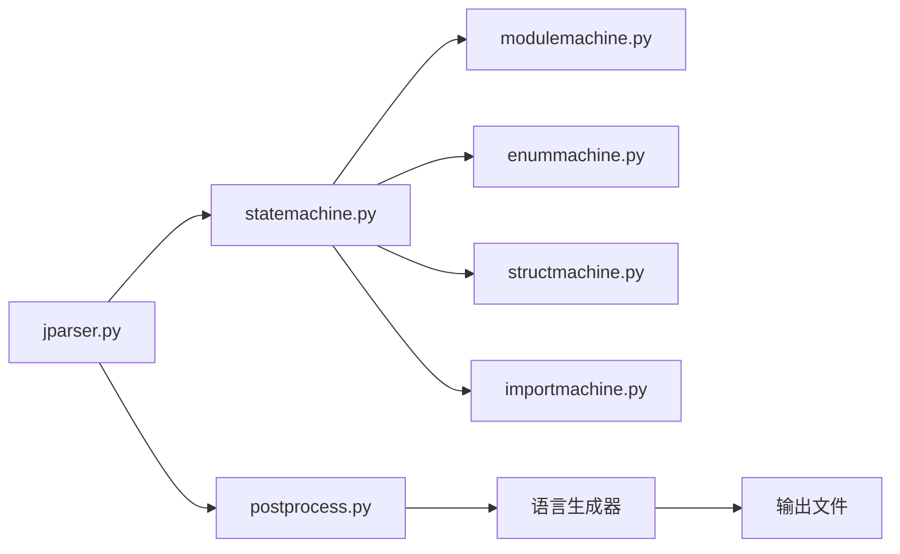

# RPC 代码生成工具

<cite>
**本文引用的文件**
- [rpc/genc2h.py](file://rpc/genc2h.py)
- [rpc/genh2c.py](file://rpc/genh2c.py)
- [rpc/genh2h.py](file://rpc/genh2h.py)
- [rpc/parser/jparser.py](file://rpc/parser/jparser.py)
- [rpc/parser/statemachine.py](file://rpc/parser/statemachine.py)
- [rpc/parser/modulemachine.py](file://rpc/parser/modulemachine.py)
- [rpc/parser/enummachine.py](file://rpc/parser/enummachine.py)
- [rpc/parser/structmachine.py](file://rpc/parser/structmachine.py)
- [rpc/parser/importmachine.py](file://rpc/parser/importmachine.py)
- [rpc/parser/postprocess.py](file://rpc/parser/postprocess.py)
- [rpc/gen/common/python/genenum.py](file://rpc/gen/common/python/genenum.py)
- [rpc/gen/common/python/genstruct.py](file://rpc/gen/common/python/genstruct.py)
- [rpc/gen/common/ts/genenum.py](file://rpc/gen/common/ts/genenum.py)
- [rpc/gen/common/ts/genstruct.py](file://rpc/gen/common/ts/genstruct.py)
- [rpc/gen/client_call_hub/python/gen.py](file://rpc/gen/client_call_hub/python/gen.py)
</cite>

## 目录
1. [简介](#简介)
2. [项目结构](#项目结构)
3. [核心组件](#核心组件)
4. [架构总览](#架构总览)
5. [详细组件分析](#详细组件分析)
6. [依赖分析](#依赖分析)
7. [性能考虑](#性能考虑)
8. [故障排查指南](#故障排查指南)
9. [结论](#结论)
10. [附录](#附录)

## 简介
本文件为 RPC 代码生成工具的使用与技术指南。该工具以自定义协议文件（.juggle）为输入，通过解析器将协议转换为内部数据结构，再根据目标语言（Python/TypeScript）生成对应的枚举、结构体以及调用/模块代码。工具支持三类 RPC 场景：客户端到 Hub 的调用、Hub 到客户端的回调、Hub 到 Hub 的内部调用。同时提供导入处理、批量生成、版本与兼容性管理建议及扩展新语言支持的方法。

## 项目结构
- 协议解析层：负责读取 .juggle 文件，构建 import、module、enum、struct 四类元素，并进行后处理（去重、依赖收集）。
- 代码生成层：按语言与场景分别生成枚举、结构体、调用器与模块代码。
- 命令行入口：提供针对不同 RPC 方向的生成脚本，支持指定输入目录、公共目录与输出目录。

图表来源
- [rpc/parser/jparser.py:27-65](file://rpc/parser/jparser.py#L27-L65)
- [rpc/parser/statemachine.py:12-74](file://rpc/parser/statemachine.py#L12-L74)
- [rpc/parser/modulemachine.py:115-151](file://rpc/parser/modulemachine.py#L115-L151)
- [rpc/parser/enummachine.py:38-65](file://rpc/parser/enummachine.py#L38-L65)
- [rpc/parser/structmachine.py:65-94](file://rpc/parser/structmachine.py#L65-L94)
- [rpc/parser/importmachine.py:8-24](file://rpc/parser/importmachine.py#L8-L24)
- [rpc/parser/postprocess.py:28-65](file://rpc/parser/postprocess.py#L28-L65)
- [rpc/gen/common/python/genenum.py:6-24](file://rpc/gen/common/python/genenum.py#L6-L24)
- [rpc/gen/common/python/genstruct.py:70-83](file://rpc/gen/common/python/genstruct.py#L70-L83)
- [rpc/gen/common/ts/genenum.py:6-24](file://rpc/gen/common/ts/genenum.py#L6-L24)
- [rpc/gen/common/ts/genstruct.py:75-88](file://rpc/gen/common/ts/genstruct.py#L75-L88)
- [rpc/gen/client_call_hub/python/gen.py:9-34](file://rpc/gen/client_call_hub/python/gen.py#L9-L34)
- [rpc/genc2h.py:40-101](file://rpc/genc2h.py#L40-L101)
- [rpc/genh2c.py:40-101](file://rpc/genh2c.py#L40-L101)
- [rpc/genh2h.py:22-51](file://rpc/genh2h.py#L22-L51)

章节来源
- [rpc/genc2h.py:40-101](file://rpc/genc2h.py#L40-L101)
- [rpc/genh2c.py:40-101](file://rpc/genh2c.py#L40-L101)
- [rpc/genh2h.py:22-51](file://rpc/genh2h.py#L22-L51)
- [rpc/parser/jparser.py:27-65](file://rpc/parser/jparser.py#L27-L65)

## 核心组件
- 解析器与语法机
  - jparser：遍历输入与公共目录中的 .juggle 文件，逐个解析为 import、module、enum、struct，并执行后处理。
  - statemachine：驱动模块、枚举、结构体、导入的状态机，汇总结果。
  - modulemachine：解析服务模块与函数签名，校验重复函数名与默认参数规则。
  - enummachine：解析枚举项，记录键值对。
  - structmachine：解析结构体字段，支持默认参数与列表类型，校验默认参数类型。
  - importmachine：解析 import 名称。
  - postprocess：去重与依赖收集，建立跨文件的枚举与结构体依赖关系。
- 代码生成器
  - Python/TypeScript 枚举生成：按语言导出枚举定义。
  - Python/TypeScript 结构体生成：生成类定义、序列化/反序列化函数。
  - 调用/模块生成：按 RPC 场景生成调用器或模块代码（如实体服务）。

章节来源
- [rpc/parser/jparser.py:22-72](file://rpc/parser/jparser.py#L22-L72)
- [rpc/parser/statemachine.py:12-74](file://rpc/parser/statemachine.py#L12-L74)
- [rpc/parser/modulemachine.py:9-151](file://rpc/parser/modulemachine.py#L9-L151)
- [rpc/parser/enummachine.py:8-65](file://rpc/parser/enummachine.py#L8-L65)
- [rpc/parser/structmachine.py:9-94](file://rpc/parser/structmachine.py#L9-L94)
- [rpc/parser/importmachine.py:8-24](file://rpc/parser/importmachine.py#L8-L24)
- [rpc/parser/postprocess.py:6-65](file://rpc/parser/postprocess.py#L6-L65)
- [rpc/gen/common/python/genenum.py:6-24](file://rpc/gen/common/python/genenum.py#L6-L24)
- [rpc/gen/common/python/genstruct.py:9-83](file://rpc/gen/common/python/genstruct.py#L9-L83)
- [rpc/gen/common/ts/genenum.py:6-24](file://rpc/gen/common/ts/genenum.py#L6-L24)
- [rpc/gen/common/ts/genstruct.py:9-88](file://rpc/gen/common/ts/genstruct.py#L9-L88)
- [rpc/gen/client_call_hub/python/gen.py:9-34](file://rpc/gen/client_call_hub/python/gen.py#L9-L34)

## 架构总览
下图展示从 .juggle 到最终代码生成的关键流程：解析、依赖合并、语言特定生成与输出。

图表来源
- [rpc/genc2h.py:49-74](file://rpc/genc2h.py#L49-L74)
- [rpc/genh2c.py:49-74](file://rpc/genh2c.py#L49-L74)
- [rpc/genh2h.py:29-45](file://rpc/genh2h.py#L29-L45)
- [rpc/parser/jparser.py:27-65](file://rpc/parser/jparser.py#L27-L65)
- [rpc/parser/statemachine.py:21-74](file://rpc/parser/statemachine.py#L21-L74)
- [rpc/parser/postprocess.py:28-65](file://rpc/parser/postprocess.py#L28-L65)

## 详细组件分析

### 协议编译流程（Thrift 文件解析）
- 输入格式：.juggle 文件，支持 import 引入、service 定义模块、enum 定义枚举、struct 定义结构体。
- 解析步骤：
  1) 扫描输入目录与公共目录，过滤 .juggle 文件。
  2) 对每个文件进行注释删除、词法归一化与语法分析。
  3) 使用状态机识别 import/module/enum/struct 并收集结果。
  4) 执行后处理：检查重复键、合并枚举与结构体、建立跨文件依赖。
- 导入处理：import 名称用于在后处理阶段合并其他文件的定义，形成全局可用的枚举集合与结构体依赖链。

章节来源
- [rpc/parser/jparser.py:27-65](file://rpc/parser/jparser.py#L27-L65)
- [rpc/parser/statemachine.py:21-74](file://rpc/parser/statemachine.py#L21-L74)
- [rpc/parser/modulemachine.py:131-151](file://rpc/parser/modulemachine.py#L131-L151)
- [rpc/parser/enummachine.py:45-65](file://rpc/parser/enummachine.py#L45-L65)
- [rpc/parser/structmachine.py:72-94](file://rpc/parser/structmachine.py#L72-L94)
- [rpc/parser/importmachine.py:13-24](file://rpc/parser/importmachine.py#L13-L24)
- [rpc/parser/postprocess.py:28-65](file://rpc/parser/postprocess.py#L28-L65)

### 模块生成与导入处理机制
- 模块解析：模块名称与类型（如 entity_service）由状态机识别；函数列表包含函数名、参数列表（含可选默认值）与通知/请求/响应语义。
- 导入处理：后处理阶段将被 import 的文件中的枚举与结构体加入当前文件的依赖列表，并保留原始文件名以便生成器正确引用。
- 重复检测：模块、枚举、结构体均不允许重复命名，避免生成冲突。

章节来源
- [rpc/parser/modulemachine.py:115-151](file://rpc/parser/modulemachine.py#L115-L151)
- [rpc/parser/postprocess.py:28-65](file://rpc/parser/postprocess.py#L28-L65)

### Python 代码生成器工作原理
- 枚举生成：遍历枚举字典，生成 Python Enum 类型。
- 结构体生成：生成类构造函数、序列化函数与反序列化函数；支持原生类型、自定义类型与列表类型；默认参数按类型转换。
- 调用/模块生成：按场景生成调用器或模块代码（例如实体服务），结合依赖信息生成正确的类型与调用逻辑。

章节来源
- [rpc/gen/common/python/genenum.py:6-24](file://rpc/gen/common/python/genenum.py#L6-L24)
- [rpc/gen/common/python/genstruct.py:9-83](file://rpc/gen/common/python/genstruct.py#L9-L83)
- [rpc/gen/client_call_hub/python/gen.py:9-34](file://rpc/gen/client_call_hub/python/gen.py#L9-L34)

### TypeScript 代码生成器工作原理
- 枚举生成：遍历枚举字典，生成 TypeScript export enum。
- 结构体生成：生成类与 public 字段、序列化/反序列化函数；默认参数按类型转换；列表类型生成循环与容器处理。
- 调用/模块生成：按场景生成调用器或模块代码，保持与 Python 一致的依赖与类型映射。

章节来源
- [rpc/gen/common/ts/genenum.py:6-24](file://rpc/gen/common/ts/genenum.py#L6-L24)
- [rpc/gen/common/ts/genstruct.py:9-88](file://rpc/gen/common/ts/genstruct.py#L9-L88)
- [rpc/gen/client_call_hub/python/gen.py:9-34](file://rpc/gen/client_call_hub/python/gen.py#L9-L34)

### 命令行使用示例
- 客户端到 Hub（genc2h.py）
  - 用途：生成客户端侧调用器与服务器侧模块代码。
  - 参数：语言、输入目录、公共目录（可选）、客户端输出目录、服务器输出目录。
  - 示例：python rpc/genc2h.py D:/input D:/common D:/out/cli D:/out/svr
- Hub 到客户端（genh2c.py）
  - 用途：生成服务器侧模块与客户端侧调用器代码。
  - 参数：语言、输入目录、公共目录（可选）、客户端输出目录、服务器输出目录。
  - 示例：python rpc/genh2c.py D:/input D:/common D:/out/cli D:/out/svr
- Hub 到 Hub（genh2h.py）
  - 用途：生成服务器侧模块与调用器代码（同侧内部通信）。
  - 参数：语言、输入目录、公共目录（可选）、输出目录。
  - 示例：python rpc/genh2h.py D:/input D:/common D:/out/svr

章节来源
- [rpc/genc2h.py:91-101](file://rpc/genc2h.py#L91-L101)
- [rpc/genh2c.py:91-101](file://rpc/genh2c.py#L91-L101)
- [rpc/genh2h.py:47-51](file://rpc/genh2h.py#L47-L51)

### 协议版本管理、向后兼容性与重构最佳实践
- 版本管理
  - 将协议文件按版本分目录存放，公共定义放入公共目录，避免重复与冲突。
  - 在导入时仅引入必要模块，减少耦合。
- 向后兼容
  - 新增枚举值需保证数值不破坏已有逻辑；新增结构体字段应提供默认值，避免反序列化失败。
  - 函数新增可选参数时，确保默认值类型与现有调用兼容。
- 重构建议
  - 先在公共目录中沉淀通用定义，再在业务目录中引用，降低重复与维护成本。
  - 严格控制模块与结构体命名，避免重复键导致生成异常。

章节来源
- [rpc/parser/postprocess.py:28-65](file://rpc/parser/postprocess.py#L28-L65)
- [rpc/parser/structmachine.py:72-94](file://rpc/parser/structmachine.py#L72-L94)
- [rpc/parser/modulemachine.py:131-151](file://rpc/parser/modulemachine.py#L131-L151)

### 扩展新语言支持的方法
- 添加语言生成器
  - 在对应语言目录下实现枚举与结构体生成器（参考 Python/TypeScript 实现）。
  - 在场景生成器中添加新语言分支，调用相应生成器。
- 更新命令行入口
  - 在对应入口脚本中增加语言分支与参数解析逻辑。
- 保持一致性
  - 生成的类型与序列化/反序列化函数需与现有工具链一致，确保运行时互操作。

章节来源
- [rpc/gen/common/python/genenum.py:6-24](file://rpc/gen/common/python/genenum.py#L6-L24)
- [rpc/gen/common/python/genstruct.py:70-83](file://rpc/gen/common/python/genstruct.py#L70-L83)
- [rpc/gen/common/ts/genenum.py:6-24](file://rpc/gen/common/ts/genenum.py#L6-L24)
- [rpc/gen/common/ts/genstruct.py:75-88](file://rpc/gen/common/ts/genstruct.py#L75-L88)
- [rpc/genc2h.py:51-89](file://rpc/genc2h.py#L51-L89)
- [rpc/genh2c.py:51-89](file://rpc/genh2c.py#L51-L89)
- [rpc/genh2h.py:31-45](file://rpc/genh2h.py#L31-L45)

## 依赖分析
- 组件内聚与耦合
  - 解析器各子机职责清晰，statemachine 作为协调者，耦合度低，便于扩展。
  - 生成器按语言与场景分离，耦合度低，便于维护与扩展。
- 外部依赖
  - Python 侧使用标准库（如 enum、collections.abc）与 msgpack 编解码。
  - TypeScript 侧使用 @msgpack/msgpack 进行编码解码。
- 循环依赖
  - 通过后处理阶段的依赖收集与去重，避免生成阶段出现循环引用。

图表来源
- [rpc/parser/jparser.py:27-65](file://rpc/parser/jparser.py#L27-L65)
- [rpc/parser/statemachine.py:12-74](file://rpc/parser/statemachine.py#L12-L74)
- [rpc/parser/modulemachine.py:115-151](file://rpc/parser/modulemachine.py#L115-L151)
- [rpc/parser/enummachine.py:38-65](file://rpc/parser/enummachine.py#L38-L65)
- [rpc/parser/structmachine.py:65-94](file://rpc/parser/structmachine.py#L65-L94)
- [rpc/parser/importmachine.py:8-24](file://rpc/parser/importmachine.py#L8-L24)
- [rpc/parser/postprocess.py:28-65](file://rpc/parser/postprocess.py#L28-L65)

## 性能考虑
- 批量处理：解析器一次性扫描输入与公共目录，减少 IO 开销。
- 依赖合并：后处理阶段集中处理去重与依赖，避免生成阶段重复计算。
- 生成策略：按语言与场景拆分生成器，避免单文件过长，提升可维护性与编译速度。
- 类型检查：在结构体与函数解析阶段即进行类型与默认参数校验，提前发现错误，减少运行时开销。

## 故障排查指南
- 重复键/重复函数
  - 现象：生成阶段抛出重复键或重复函数异常。
  - 排查：检查模块、枚举、结构体命名是否唯一；确认公共目录与业务目录未重复定义相同键。
- 默认参数类型错误
  - 现象：解析阶段抛出默认参数类型错误异常。
  - 排查：核对默认参数的类型与字段类型一致；列表类型默认参数需符合容器约定。
- 导入文件缺失
  - 现象：生成器无法解析被导入的类型。
  - 排查：确认公共目录中存在对应文件；检查导入名称与文件名一致。
- 输出目录不存在
  - 现象：脚本报错无法写入文件。
  - 排查：确保输出目录已创建或脚本具备创建权限。

章节来源
- [rpc/parser/postprocess.py:34-43](file://rpc/parser/postprocess.py#L34-L43)
- [rpc/parser/modulemachine.py:87-95](file://rpc/parser/modulemachine.py#L87-L95)
- [rpc/parser/structmachine.py:80-82](file://rpc/parser/structmachine.py#L80-L82)
- [rpc/genc2h.py:44-47](file://rpc/genc2h.py#L44-L47)
- [rpc/genh2c.py:44-47](file://rpc/genh2c.py#L44-L47)
- [rpc/genh2h.py:26-27](file://rpc/genh2h.py#L26-L27)

## 结论
该 RPC 代码生成工具通过清晰的解析与生成分层，实现了对多语言、多场景协议的自动化代码生成。配合严格的导入与依赖管理、默认参数与重复键校验，能够在保证类型安全的同时提升开发效率。建议在团队内统一协议目录规范与命名约定，并在引入新语言或新场景时沿用现有分层与校验机制，确保长期可维护性与可扩展性。

## 附录
- 命令行参数速查
  - genc2h.py：python rpc/genc2h.py 语言 输入目录 公共目录(可选) 客户端输出目录 服务器输出目录
  - genh2c.py：python rpc/genh2c.py 语言 输入目录 公共目录(可选) 客户端输出目录 服务器输出目录
  - genh2h.py：python rpc/genh2h.py 语言 输入目录 公共目录(可选) 输出目录
- 输出文件命名
  - 客户端：模块名_cli.(py|ts)
  - 服务器：模块名_svr.(py|ts)