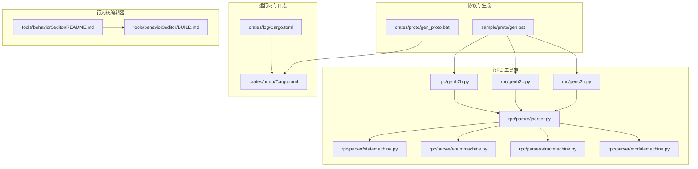
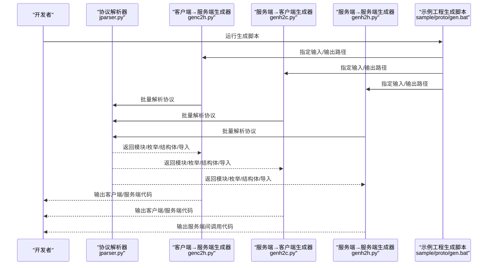
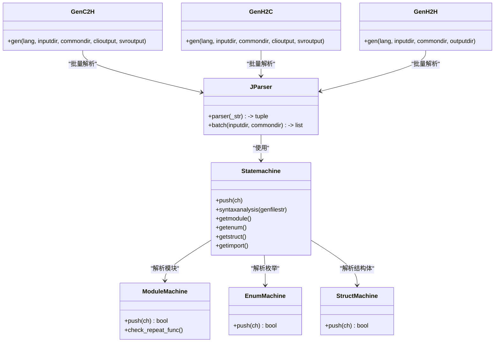
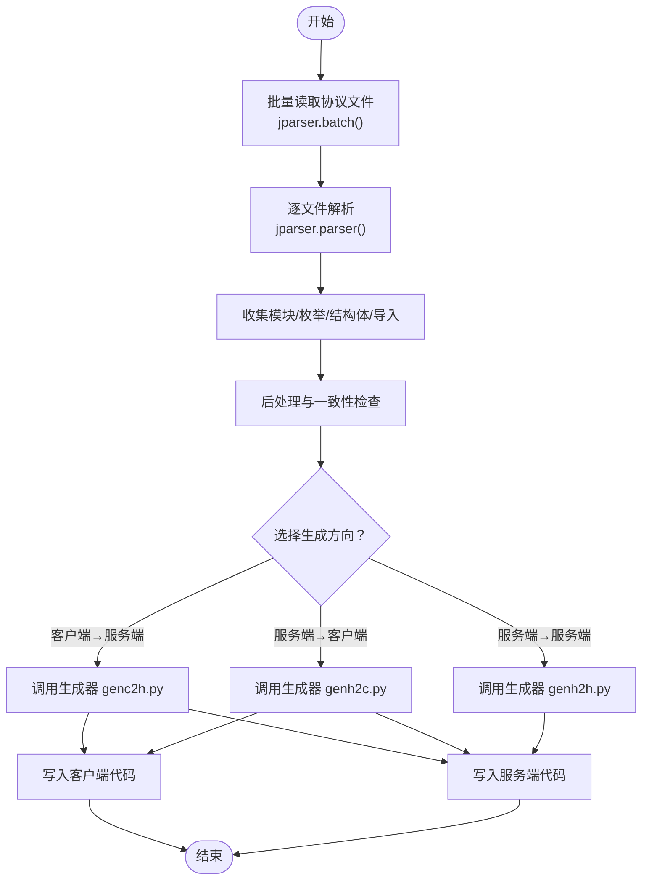
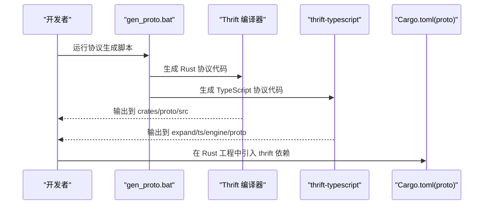
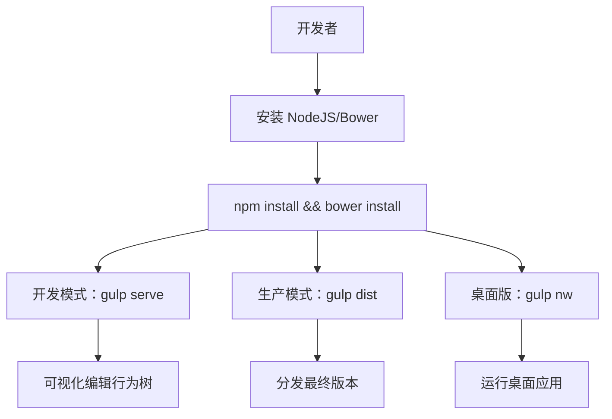
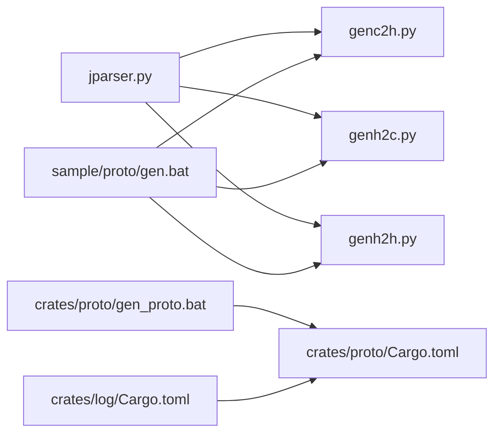

# 开发工具

<cite>
**本文引用的文件**
- [README.md](file://README.md)
- [genh2c.py](file://rpc/genh2c.py)
- [genc2h.py](file://rpc/genc2h.py)
- [genh2h.py](file://rpc/genh2h.py)
- [jparser.py](file://rpc/parser/jparser.py)
- [statemachine.py](file://rpc/parser/statemachine.py)
- [enummachine.py](file://rpc/parser/enummachine.py)
- [structmachine.py](file://rpc/parser/structmachine.py)
- [modulemachine.py](file://rpc/parser/modulemachine.py)
- [gen_proto.bat](file://crates/proto/gen_proto.bat)
- [Cargo.toml（proto crate）](file://crates/proto/Cargo.toml)
- [Cargo.toml（log crate）](file://crates/log/Cargo.toml)
- [BUILD.md（行为树编辑器）](file://tools/behavior3editor/BUILD.md)
- [README.md（行为树编辑器）](file://tools/behavior3editor/README.md)
- [gen.bat（示例协议生成）](file://sample/proto/gen.bat)
</cite>

## 目录
1. [简介](#简介)
2. [项目结构](#项目结构)
3. [核心组件](#核心组件)
4. [架构总览](#架构总览)
5. [详细组件分析](#详细组件分析)
6. [依赖分析](#依赖分析)
7. [性能考虑](#性能考虑)
8. [故障排查指南](#故障排查指南)
9. [结论](#结论)
10. [附录](#附录)

## 简介
本指南面向 geese 开发者，系统性介绍开发工具链与最佳实践，覆盖以下主题：
- RPC 协议编译与代码自动生成：从协议定义到客户端/服务端代码生成、语言适配与版本管理策略
- 行为树编辑器：可视化行为设计与调试流程
- 调试与性能分析：日志、追踪与可观测性工具使用
- 测试与质量保障：单元测试与集成测试建议
- 开发环境与 IDE 配置：Rust/Python/TypeScript 工程与工具链
- 自动化构建、CI/CD 与部署：流水线配置思路
- 故障诊断与运维：日志分析、性能监控与问题定位

## 项目结构
本仓库采用多语言混合工程组织方式：
- Rust 二进制与库工程位于 server、crates、client 等目录
- Python 客户端与示例位于 sample/client/py 与 sample/server
- TypeScript 引擎与示例位于 expand/ts 与 sample/client/ts
- RPC 工具链位于 rpc，包含协议解析器与多语言生成器
- 行为树编辑器位于 tools/behavior3editor
- 日志与追踪相关能力位于 crates/log

图表来源
- [jparser.py:27-65](file://rpc/parser/jparser.py#L27-L65)
- [statemachine.py:12-74](file://rpc/parser/statemachine.py#L12-L74)
- [enummachine.py:38-65](file://rpc/parser/enummachine.py#L38-L65)
- [structmachine.py:65-94](file://rpc/parser/structmachine.py#L65-L94)
- [modulemachine.py:115-151](file://rpc/parser/modulemachine.py#L115-L151)
- [genc2h.py:40-101](file://rpc/genc2h.py#L40-L101)
- [genh2c.py:40-101](file://rpc/genh2c.py#L40-L101)
- [genh2h.py:22-51](file://rpc/genh2h.py#L22-L51)
- [gen.bat（示例协议生成）:1-13](file://sample/proto/gen.bat#L1-L13)
- [gen_proto.bat（协议生成）:1-11](file://crates/proto/gen_proto.bat#L1-L11)
- [Cargo.toml（log crate）:1-16](file://crates/log/Cargo.toml#L1-L16)
- [Cargo.toml（proto crate）:1-10](file://crates/proto/Cargo.toml#L1-L10)
- [README.md（行为树编辑器）:1-49](file://tools/behavior3editor/README.md#L1-L49)
- [BUILD.md（行为树编辑器）:1-53](file://tools/behavior3editor/BUILD.md#L1-L53)

章节来源
- [README.md:1-2](file://README.md#L1-L2)
- [gen.bat（示例协议生成）:1-13](file://sample/proto/gen.bat#L1-L13)

## 核心组件
- RPC 协议解析器：负责解析 .juggle 协议文件，产出模块、枚举、结构体与导入信息，并进行后处理与一致性校验
- 多语言生成器：根据协议与导入关系，生成 Python/TypeScript 客户端与服务端调用模块
- 协议生成脚本：基于 Thrift 的 Rust/TypeScript 协议生成与打包
- 行为树编辑器：可视化行为树设计与导出，支持本地开发与生产构建
- 日志与追踪：基于 tracing 与 OpenTelemetry 的日志与链路追踪能力

章节来源
- [jparser.py:22-72](file://rpc/parser/jparser.py#L22-L72)
- [statemachine.py:12-74](file://rpc/parser/statemachine.py#L12-L74)
- [enummachine.py:38-65](file://rpc/parser/enummachine.py#L38-L65)
- [structmachine.py:65-94](file://rpc/parser/structmachine.py#L65-L94)
- [modulemachine.py:115-151](file://rpc/parser/modulemachine.py#L115-L151)
- [genc2h.py:40-101](file://rpc/genc2h.py#L40-L101)
- [genh2c.py:40-101](file://rpc/genh2c.py#L40-L101)
- [genh2h.py:22-51](file://rpc/genh2h.py#L22-L51)
- [gen_proto.bat:1-11](file://crates/proto/gen_proto.bat#L1-L11)
- [Cargo.toml（log crate）:1-16](file://crates/log/Cargo.toml#L1-L16)
- [Cargo.toml（proto crate）:1-10](file://crates/proto/Cargo.toml#L1-L10)
- [README.md（行为树编辑器）:1-49](file://tools/behavior3editor/README.md#L1-L49)
- [BUILD.md（行为树编辑器）:1-53](file://tools/behavior3editor/BUILD.md#L1-L53)

## 架构总览
下图展示 RPC 工具链从协议到代码生成的整体流程，以及与示例工程和协议生成脚本的关系。

图表来源
- [gen.bat（示例协议生成）:1-13](file://sample/proto/gen.bat#L1-L13)
- [genc2h.py:40-101](file://rpc/genc2h.py#L40-L101)
- [genh2c.py:40-101](file://rpc/genh2c.py#L40-L101)
- [genh2h.py:22-51](file://rpc/genh2h.py#L22-L51)
- [jparser.py:27-65](file://rpc/parser/jparser.py#L27-L65)

## 详细组件分析

### 组件 A：RPC 协议解析与生成（Python/TS）
该组件由“协议解析器 + 多语言生成器”构成，负责将 .juggle 协议转换为客户端/服务端代码。

图表来源
- [statemachine.py:12-74](file://rpc/parser/statemachine.py#L12-L74)
- [modulemachine.py:115-151](file://rpc/parser/modulemachine.py#L115-L151)
- [enummachine.py:38-65](file://rpc/parser/enummachine.py#L38-L65)
- [structmachine.py:65-94](file://rpc/parser/structmachine.py#L65-L94)
- [jparser.py:22-72](file://rpc/parser/jparser.py#L22-L72)
- [genc2h.py:40-101](file://rpc/genc2h.py#L40-L101)
- [genh2c.py:40-101](file://rpc/genh2c.py#L40-L101)
- [genh2h.py:22-51](file://rpc/genh2h.py#L22-L51)

图表来源
- [jparser.py:27-65](file://rpc/parser/jparser.py#L27-L65)
- [genc2h.py:40-101](file://rpc/genc2h.py#L40-L101)
- [genh2c.py:40-101](file://rpc/genh2c.py#L40-L101)
- [genh2h.py:22-51](file://rpc/genh2h.py#L22-L51)

章节来源
- [jparser.py:22-72](file://rpc/parser/jparser.py#L22-L72)
- [statemachine.py:12-74](file://rpc/parser/statemachine.py#L12-L74)
- [enummachine.py:38-65](file://rpc/parser/enummachine.py#L38-L65)
- [structmachine.py:65-94](file://rpc/parser/structmachine.py#L65-L94)
- [modulemachine.py:115-151](file://rpc/parser/modulemachine.py#L115-L151)
- [genc2h.py:40-101](file://rpc/genc2h.py#L40-L101)
- [genh2c.py:40-101](file://rpc/genh2c.py#L40-L101)
- [genh2h.py:22-51](file://rpc/genh2h.py#L22-L51)

### 组件 B：协议生成（Thrift → Rust/TypeScript）
该组件通过 Thrift 将 .thrift 协议生成 Rust 与 TypeScript 代码，并在 Rust 工程中集成。

图表来源
- [gen_proto.bat:1-11](file://crates/proto/gen_proto.bat#L1-L11)
- [Cargo.toml（proto crate）:1-10](file://crates/proto/Cargo.toml#L1-L10)

章节来源
- [gen_proto.bat:1-11](file://crates/proto/gen_proto.bat#L1-L11)
- [Cargo.toml（proto crate）:1-10](file://crates/proto/Cargo.toml#L1-L10)

### 组件 C：行为树编辑器（可视化行为设计与调试）
行为树编辑器提供在线与桌面版本，支持节点类型扩展、自动布局、JSON 导入导出等特性，便于团队协作与跨语言使用。

图表来源
- [BUILD.md（行为树编辑器）:1-53](file://tools/behavior3editor/BUILD.md#L1-L53)
- [README.md（行为树编辑器）:1-49](file://tools/behavior3editor/README.md#L1-L49)

章节来源
- [BUILD.md（行为树编辑器）:1-53](file://tools/behavior3editor/BUILD.md#L1-L53)
- [README.md（行为树编辑器）:1-49](file://tools/behavior3editor/README.md#L1-L49)

## 依赖分析
- 解析器与生成器之间的耦合度低，通过统一的数据结构（模块/枚举/结构体/导入）解耦
- 示例工程生成脚本作为入口，按需调用不同方向的生成器
- 协议生成脚本独立于解析器，仅依赖 Thrift 工具链与目标语言生态
- 日志与追踪 crate 提供统一的观测能力，可按需启用

图表来源
- [jparser.py:27-65](file://rpc/parser/jparser.py#L27-L65)
- [genc2h.py:40-101](file://rpc/genc2h.py#L40-L101)
- [genh2c.py:40-101](file://rpc/genh2c.py#L40-L101)
- [genh2h.py:22-51](file://rpc/genh2h.py#L22-L51)
- [gen.bat（示例协议生成）:1-13](file://sample/proto/gen.bat#L1-L13)
- [gen_proto.bat（协议生成）:1-11](file://crates/proto/gen_proto.bat#L1-L11)
- [Cargo.toml（log crate）:1-16](file://crates/log/Cargo.toml#L1-L16)
- [Cargo.toml（proto crate）:1-10](file://crates/proto/Cargo.toml#L1-L10)

章节来源
- [jparser.py:27-65](file://rpc/parser/jparser.py#L27-L65)
- [genc2h.py:40-101](file://rpc/genc2h.py#L40-L101)
- [genh2c.py:40-101](file://rpc/genh2c.py#L40-L101)
- [genh2h.py:22-51](file://rpc/genh2h.py#L22-L51)
- [gen.bat（示例协议生成）:1-13](file://sample/proto/gen.bat#L1-L13)
- [gen_proto.bat（协议生成）:1-11](file://crates/proto/gen_proto.bat#L1-L11)
- [Cargo.toml（log crate）:1-16](file://crates/log/Cargo.toml#L1-L16)
- [Cargo.toml（proto crate）:1-10](file://crates/proto/Cargo.toml#L1-L10)

## 性能考虑
- 协议解析阶段避免重复扫描，使用状态机一次性完成词法/语法分析
- 生成器按模块批量处理，减少 IO 次数；输出前先创建目录，避免运行时错误
- 日志与追踪采用异步与采样策略，降低对业务线程的影响
- 建议在 CI 中缓存依赖与生成产物，缩短构建时间

## 故障排查指南
- 协议解析异常
  - 检查 .juggle 文件是否符合语法规则，尤其是函数参数默认值顺序与类型匹配
  - 关注重复函数名、非法默认参数位置等错误提示
- 生成失败
  - 确认输出目录存在或可创建
  - 检查导入模块是否正确，避免循环依赖
- 行为树编辑器
  - 开发模式使用 gulp serve，确保 Node/Bower 安装完成
  - 生产构建使用 gulp dist，桌面版使用 gulp nw
- 日志与追踪
  - 使用 tracing-subscriber 的 env-filter 控制日志级别
  - 结合 OpenTelemetry 采集链路数据，定位性能瓶颈

章节来源
- [modulemachine.py:123-135](file://rpc/parser/modulemachine.py#L123-L135)
- [structmachine.py:78-82](file://rpc/parser/structmachine.py#L78-L82)
- [BUILD.md（行为树编辑器）:1-53](file://tools/behavior3editor/BUILD.md#L1-L53)
- [Cargo.toml（log crate）:1-16](file://crates/log/Cargo.toml#L1-L16)

## 结论
本指南梳理了 geese 的开发工具链：从协议解析到多语言代码生成、从行为树可视化设计到日志与追踪观测，提供了可落地的使用方法与最佳实践。建议在团队内统一协议格式与生成流程，结合 CI/CD 实现自动化构建与发布。

## 附录

### A. RPC 代码生成工具链使用步骤
- 准备 .juggle 协议文件，放置于输入目录
- 运行示例生成脚本，选择生成方向（客户端→服务端、服务端→客户端、服务端→服务端）
- 检查生成的客户端/服务端代码，补充业务逻辑
- 在 Rust 工程中引入 thrift 依赖，生成 Rust/TypeScript 协议代码

章节来源
- [gen.bat（示例协议生成）:1-13](file://sample/proto/gen.bat#L1-L13)
- [genh2c.py:40-101](file://rpc/genh2c.py#L40-L101)
- [genc2h.py:40-101](file://rpc/genc2h.py#L40-L101)
- [genh2h.py:22-51](file://rpc/genh2h.py#L22-L51)
- [gen_proto.bat:1-11](file://crates/proto/gen_proto.bat#L1-L11)
- [Cargo.toml（proto crate）:1-10](file://crates/proto/Cargo.toml#L1-L10)

### B. 行为树编辑器使用要点
- 安装 NodeJS 与 Bower，执行 npm install 与 bower install
- 开发模式：gulp serve；生产模式：gulp dist；桌面版：gulp nw
- 支持 JSON 导入导出，便于跨语言复用与团队协作

章节来源
- [BUILD.md（行为树编辑器）:1-53](file://tools/behavior3editor/BUILD.md#L1-L53)
- [README.md（行为树编辑器）:1-49](file://tools/behavior3editor/README.md#L1-L49)

### C. 日志与追踪配置
- 使用 tracing 与 tracing-subscriber 记录结构化日志
- 通过 env-filter 动态控制日志级别
- 集成 OpenTelemetry 与 Jaeger，实现链路追踪与性能监控

章节来源
- [Cargo.toml（log crate）:1-16](file://crates/log/Cargo.toml#L1-L16)