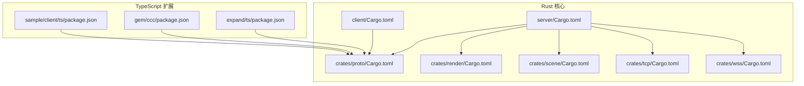
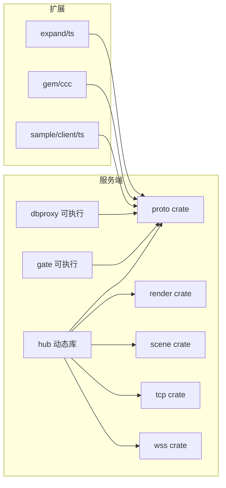
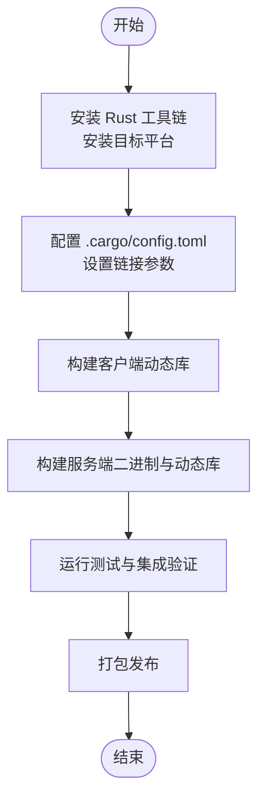
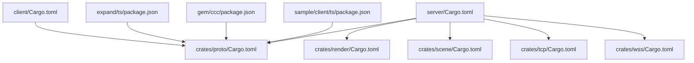

# 开发环境配置

<cite>
**本文引用的文件**
- [README.md](file://README.md)
- [client/Cargo.toml](file://client/Cargo.toml)
- [client/.cargo/config.toml](file://client/.cargo/config.toml)
- [server/Cargo.toml](file://server/Cargo.toml)
- [crates/proto/Cargo.toml](file://crates/proto/Cargo.toml)
- [crates/render/Cargo.toml](file://crates/render/Cargo.toml)
- [crates/scene/Cargo.toml](file://crates/scene/Cargo.toml)
- [crates/tcp/Cargo.toml](file://crates/tcp/Cargo.toml)
- [crates/wss/Cargo.toml](file://crates/wss/Cargo.toml)
- [expand/ts/package.json](file://expand/ts/package.json)
- [gem/ccc/package.json](file://gem/ccc/package.json)
- [sample/client/ts/package.json](file://sample/client/ts/package.json)
</cite>

## 目录
1. [简介](#简介)
2. [项目结构](#项目结构)
3. [核心组件](#核心组件)
4. [架构总览](#架构总览)
5. [详细组件分析](#详细组件分析)
6. [依赖分析](#依赖分析)
7. [性能考虑](#性能考虑)
8. [故障排查指南](#故障排查指南)
9. [结论](#结论)
10. [附录](#附录)

## 简介
本指南面向在 macOS/Linux 上为 geese 项目搭建统一开发环境，覆盖 Rust 工具链、Python 生态与 Node.js 生态的安装与配置；提供 IDE（VS Code、IntelliJ IDEA）插件与配置建议；解释项目结构、Cargo 工作空间与模块依赖关系；给出自动化构建脚本使用方法（编译、测试、打包发布）；说明代码规范与格式化工具（Rustfmt、ESLint、Prettier）配置；并介绍调试与远程调试的搭建要点。

## 项目结构
geese 采用多语言混合架构：Rust 作为服务端与核心引擎，Python 提供部分服务端逻辑与工具，TypeScript 提供客户端与扩展工程。项目通过 Cargo 工作空间组织多个 Rust crate，并通过 Node.js 包管理器管理前端与扩展工程依赖。

**图示来源**
- [server/Cargo.toml:1-42](file://server/Cargo.toml#L1-L42)
- [client/Cargo.toml:1-21](file://client/Cargo.toml#L1-L21)
- [crates/proto/Cargo.toml:1-10](file://crates/proto/Cargo.toml#L1-L10)
- [crates/render/Cargo.toml:1-10](file://crates/render/Cargo.toml#L1-L10)
- [crates/scene/Cargo.toml:1-14](file://crates/scene/Cargo.toml#L1-L14)
- [crates/tcp/Cargo.toml:1-15](file://crates/tcp/Cargo.toml#L1-L15)
- [crates/wss/Cargo.toml:1-20](file://crates/wss/Cargo.toml#L1-L20)
- [expand/ts/package.json:1-15](file://expand/ts/package.json#L1-L15)
- [gem/ccc/package.json:1-16](file://gem/ccc/package.json#L1-L16)
- [sample/client/ts/package.json:1-15](file://sample/client/ts/package.json#L1-L15)

**章节来源**
- [README.md:1-2](file://README.md#L1-L2)
- [server/Cargo.toml:1-42](file://server/Cargo.toml#L1-L42)
- [client/Cargo.toml:1-21](file://client/Cargo.toml#L1-L21)
- [crates/proto/Cargo.toml:1-10](file://crates/proto/Cargo.toml#L1-L10)
- [crates/render/Cargo.toml:1-10](file://crates/render/Cargo.toml#L1-L10)
- [crates/scene/Cargo.toml:1-14](file://crates/scene/Cargo.toml#L1-L14)
- [crates/tcp/Cargo.toml:1-15](file://crates/tcp/Cargo.toml#L1-L15)
- [crates/wss/Cargo.toml:1-20](file://crates/wss/Cargo.toml#L1-L20)
- [expand/ts/package.json:1-15](file://expand/ts/package.json#L1-L15)
- [gem/ccc/package.json:1-16](file://gem/ccc/package.json#L1-L16)
- [sample/client/ts/package.json:1-15](file://sample/client/ts/package.json#L1-L15)

## 核心组件
- Rust 工具链与工作空间
  - 使用 Rust 2021/2024 edition，Tokio 全功能特性，Serde 序列化，UUID，Tracing 日志，Consul 客户端等。
  - 服务端以二进制与动态库形式组合，包含 dbproxy、gate、hub 等可执行程序与共享库。
- Python 生态
  - 服务端与客户端引擎中广泛使用 Python 模块（如 msgpack、bson、pymongo、redis），用于序列化、数据库与缓存交互。
- TypeScript 生态
  - 客户端与扩展工程使用 Thrift、WebSocket、UUID、MsgPack 等依赖，支持跨平台运行时与类型安全。

**章节来源**
- [server/Cargo.toml:1-42](file://server/Cargo.toml#L1-L42)
- [client/Cargo.toml:1-21](file://client/Cargo.toml#L1-L21)
- [crates/proto/Cargo.toml:1-10](file://crates/proto/Cargo.toml#L1-L10)
- [crates/render/Cargo.toml:1-10](file://crates/render/Cargo.toml#L1-L10)
- [crates/scene/Cargo.toml:1-14](file://crates/scene/Cargo.toml#L1-L14)
- [crates/tcp/Cargo.toml:1-15](file://crates/tcp/Cargo.toml#L1-L15)
- [crates/wss/Cargo.toml:1-20](file://crates/wss/Cargo.toml#L1-L20)
- [expand/ts/package.json:1-15](file://expand/ts/package.json#L1-L15)
- [gem/ccc/package.json:1-16](file://gem/ccc/package.json#L1-L16)
- [sample/client/ts/package.json:1-15](file://sample/client/ts/package.json#L1-L15)

## 架构总览
下图展示 Rust 服务端与核心 crate 的依赖关系，以及与 TypeScript 扩展工程的关联。

**图示来源**
- [server/Cargo.toml:1-42](file://server/Cargo.toml#L1-L42)
- [crates/proto/Cargo.toml:1-10](file://crates/proto/Cargo.toml#L1-L10)
- [crates/render/Cargo.toml:1-10](file://crates/render/Cargo.toml#L1-L10)
- [crates/scene/Cargo.toml:1-14](file://crates/scene/Cargo.toml#L1-L14)
- [crates/tcp/Cargo.toml:1-15](file://crates/tcp/Cargo.toml#L1-L15)
- [crates/wss/Cargo.toml:1-20](file://crates/wss/Cargo.toml#L1-L20)
- [expand/ts/package.json:1-15](file://expand/ts/package.json#L1-L15)
- [gem/ccc/package.json:1-16](file://gem/ccc/package.json#L1-L16)
- [sample/client/ts/package.json:1-15](file://sample/client/ts/package.json#L1-L15)

## 详细组件分析

### Rust 工具链与工作空间
- 安装与版本
  - Rust: 使用 rustup 安装最新稳定版，确保目标平台（如 aarch64-apple-darwin、x86_64-apple-darwin）可用。
  - Tokio: 服务端普遍启用 full 特性，注意异步任务与连接池资源管理。
  - Serde/UUID/Tracing: 用于序列化、标识与可观测性。
- 编译与链接
  - 客户端 Python 绑定使用 cdylib 动态库输出，需正确设置链接参数以兼容 Python C 扩展。
  - macOS 平台通过 .cargo/config.toml 设置链接参数，确保动态符号导出。

**图示来源**
- [client/.cargo/config.toml:1-6](file://client/.cargo/config.toml#L1-L6)
- [client/Cargo.toml:1-21](file://client/Cargo.toml#L1-L21)
- [server/Cargo.toml:1-42](file://server/Cargo.toml#L1-L42)

**章节来源**
- [client/.cargo/config.toml:1-6](file://client/.cargo/config.toml#L1-L6)
- [client/Cargo.toml:1-21](file://client/Cargo.toml#L1-L21)
- [server/Cargo.toml:1-42](file://server/Cargo.toml#L1-L42)

### Python 环境配置
- 依赖来源
  - 服务端引擎与客户端引擎中使用 msgpack、bson、pymongo、redis 等 Python 包，确保与对应版本兼容。
- 推荐做法
  - 使用虚拟环境隔离依赖，避免系统级包冲突。
  - 在 CI 或本地脚本中统一安装依赖，保证一致性。

**章节来源**
- [server/Cargo.toml:1-42](file://server/Cargo.toml#L1-L42)
- [client/Cargo.toml:1-21](file://client/Cargo.toml#L1-L21)

### Node.js 环境准备
- 依赖管理
  - TypeScript 扩展工程通过 package.json 管理依赖，包含 Thrift、WebSocket、UUID、MsgPack 等。
- 运行时与脚本
  - 使用 tsx 运行 TypeScript 脚本，确保 Node.js 版本满足依赖要求。
- 版本策略
  - 保持 Thrift、ws、uuid 等核心依赖的兼容性，避免版本升级导致的类型不匹配。

**章节来源**
- [expand/ts/package.json:1-15](file://expand/ts/package.json#L1-L15)
- [gem/ccc/package.json:1-16](file://gem/ccc/package.json#L1-L16)
- [sample/client/ts/package.json:1-15](file://sample/client/ts/package.json#L1-L15)

### IDE 配置建议
- VS Code
  - 插件推荐：Rust Analyzer、Even Better TOML、ESLint、Prettier、Python、Thrift。
  - 工作区设置：启用 Rust Analyzer 的 cargo.workspace 与 target 目标自动发现；为 TypeScript 启用 ESLint/Prettier。
- IntelliJ IDEA
  - 插件推荐：IntelliJ Rust、NodeJS、Python。
  - 设置：为 Rust 模块启用 Cargo 工作空间；为 TypeScript/JavaScript 启用 ESLint 与 Prettier。
- 通用建议
  - 为 Python 项目启用虚拟环境路径；为 Node.js 项目启用 package manager 自动检测。

[本节为通用配置建议，无需具体文件分析]

### 代码规范与格式化
- Rust
  - 使用 rustfmt 默认风格，结合 clippy 进行静态检查；在 CI 中统一校验。
- TypeScript
  - 使用 ESLint 与 Prettier，配置 .eslintrc 与 .prettierrc，确保团队一致的代码风格。
- Python
  - 使用 ruff 或 flake8 + black，CI 中强制执行格式化与静态检查。

[本节为通用规范建议，无需具体文件分析]

### 调试与远程调试
- Rust
  - 使用 rust-lldb 或 gdb 调试二进制；在 VS Code 中配置 launch.json，选择目标与断点。
  - 对于动态库（Python 绑定），确保符号表完整并正确加载。
- Python
  - 使用 pdb 或 IDE 内置调试器；在服务端引擎中设置断点验证消息处理流程。
- TypeScript
  - 使用 node --inspect 或 VS Code 的调试配置启动 tsx 脚本，进行断点调试。
- 远程调试
  - 通过 SSH 隧道或内网穿透访问目标机器的服务端口；在 IDE 中配置远程调试端口。

[本节为通用调试建议，无需具体文件分析]

## 依赖分析
- Rust 依赖关系
  - 服务端依赖 proto、render、scene、tcp、wss 等 crate；客户端依赖 proto 与 Python 绑定。
  - proto 作为通信协议基础，被广泛复用。
- TypeScript 依赖关系
  - 扩展工程与示例工程均依赖 Thrift、WebSocket、UUID、MsgPack 等，形成统一的客户端协议栈。

**图示来源**
- [server/Cargo.toml:1-42](file://server/Cargo.toml#L1-L42)
- [client/Cargo.toml:1-21](file://client/Cargo.toml#L1-L21)
- [crates/proto/Cargo.toml:1-10](file://crates/proto/Cargo.toml#L1-L10)
- [crates/render/Cargo.toml:1-10](file://crates/render/Cargo.toml#L1-L10)
- [crates/scene/Cargo.toml:1-14](file://crates/scene/Cargo.toml#L1-L14)
- [crates/tcp/Cargo.toml:1-15](file://crates/tcp/Cargo.toml#L1-L15)
- [crates/wss/Cargo.toml:1-20](file://crates/wss/Cargo.toml#L1-L20)
- [expand/ts/package.json:1-15](file://expand/ts/package.json#L1-L15)
- [gem/ccc/package.json:1-16](file://gem/ccc/package.json#L1-L16)
- [sample/client/ts/package.json:1-15](file://sample/client/ts/package.json#L1-L15)

**章节来源**
- [server/Cargo.toml:1-42](file://server/Cargo.toml#L1-L42)
- [client/Cargo.toml:1-21](file://client/Cargo.toml#L1-L21)
- [crates/proto/Cargo.toml:1-10](file://crates/proto/Cargo.toml#L1-L10)
- [crates/render/Cargo.toml:1-10](file://crates/render/Cargo.toml#L1-L10)
- [crates/scene/Cargo.toml:1-14](file://crates/scene/Cargo.toml#L1-L14)
- [crates/tcp/Cargo.toml:1-15](file://crates/tcp/Cargo.toml#L1-L15)
- [crates/wss/Cargo.toml:1-20](file://crates/wss/Cargo.toml#L1-L20)
- [expand/ts/package.json:1-15](file://expand/ts/package.json#L1-L15)
- [gem/ccc/package.json:1-16](file://gem/ccc/package.json#L1-L16)
- [sample/client/ts/package.json:1-15](file://sample/client/ts/package.json#L1-L15)

## 性能考虑
- 异步与并发
  - 服务端广泛使用 Tokio，应合理划分任务与通道，避免阻塞事件循环。
- 序列化与网络
  - 优先使用 MsgPack 与 Thrift，减少序列化开销；对高频 RPC 做批量与压缩优化。
- 渲染与场景
  - 使用 wgpu 与 cgmath，注意 GPU 内存与绘制批次；对场景树与材质做懒加载与缓存。

[本节提供通用性能建议，无需具体文件分析]

## 故障排查指南
- Rust 构建失败
  - 检查 .cargo/config.toml 的链接参数是否与目标平台匹配；确认 Tokio、Serde、UUID 版本兼容。
- Python 绑定问题
  - 确认动态库输出类型为 cdylib；检查 Python 版本与扩展模块导入路径。
- TypeScript 运行异常
  - 确认 tsx 与 Node.js 版本；检查依赖安装与类型声明文件。
- 依赖冲突
  - 使用 Cargo.lock 与 package-lock.json 固定版本；在 CI 中强制执行依赖安装与校验。

**章节来源**
- [client/.cargo/config.toml:1-6](file://client/.cargo/config.toml#L1-L6)
- [client/Cargo.toml:1-21](file://client/Cargo.toml#L1-L21)
- [server/Cargo.toml:1-42](file://server/Cargo.toml#L1-L42)
- [expand/ts/package.json:1-15](file://expand/ts/package.json#L1-L15)
- [gem/ccc/package.json:1-16](file://gem/ccc/package.json#L1-L16)
- [sample/client/ts/package.json:1-15](file://sample/client/ts/package.json#L1-L15)

## 结论
通过统一的 Rust 工具链、Python 与 Node.js 生态配置，配合 IDE 插件与代码规范，可以高效搭建 geese 的开发环境。建议在本地与 CI 中严格执行构建、测试与格式化流程，确保跨平台与跨语言的一致性。

[本节为总结内容，无需具体文件分析]

## 附录
- 自动化构建脚本使用
  - Rust: 使用 cargo build 与 cargo test；在 CI 中添加 cargo fmt 与 clippy 步骤。
  - Python: 使用 pip install -r requirements.txt 或虚拟环境安装依赖。
  - TypeScript: 使用 npm ci 安装依赖后运行 tsx 脚本。
- 打包发布
  - Rust: 使用 cargo build --release 输出二进制与动态库；在 CI 中生成 tar.gz 包。
  - Python: 使用 maturin 或 setuptools 构建 wheel；在 CI 中上传至私有仓库。
  - TypeScript: 使用 tsc 或打包工具生成 dist；在 CI 中上传至 CDN 或包管理器。

[本节为通用流程建议，无需具体文件分析]