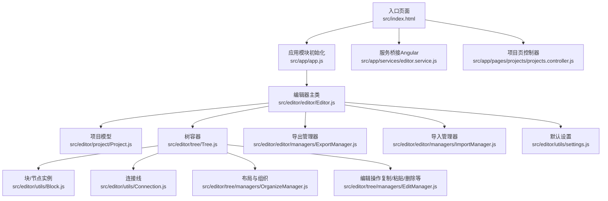
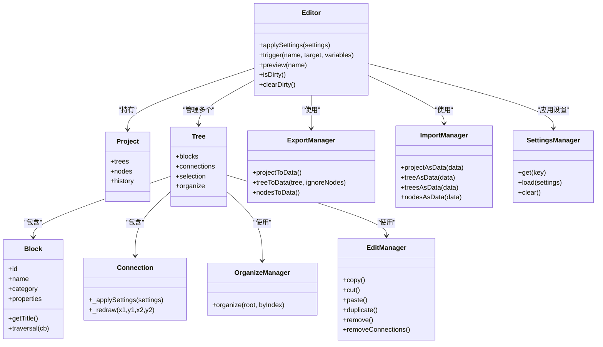
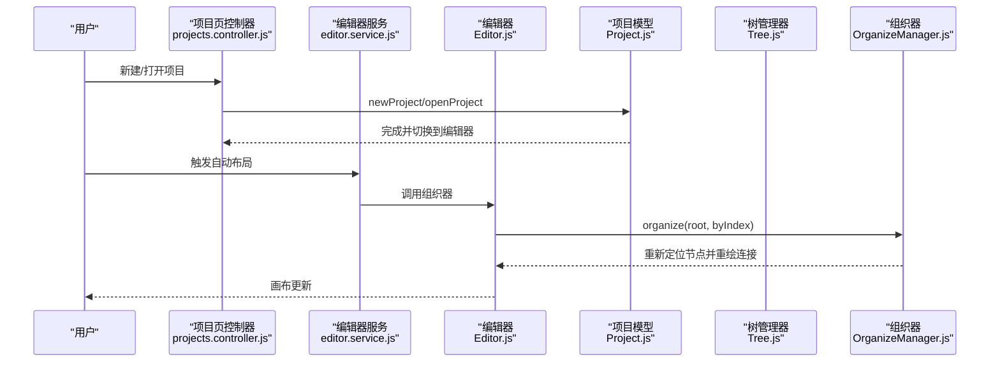
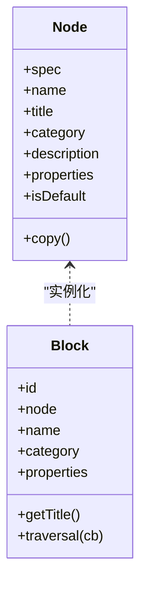
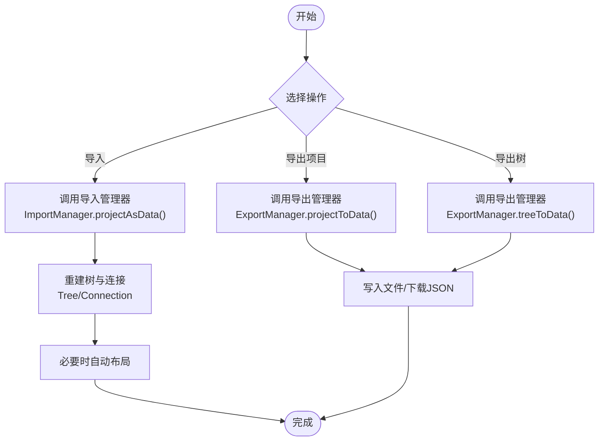
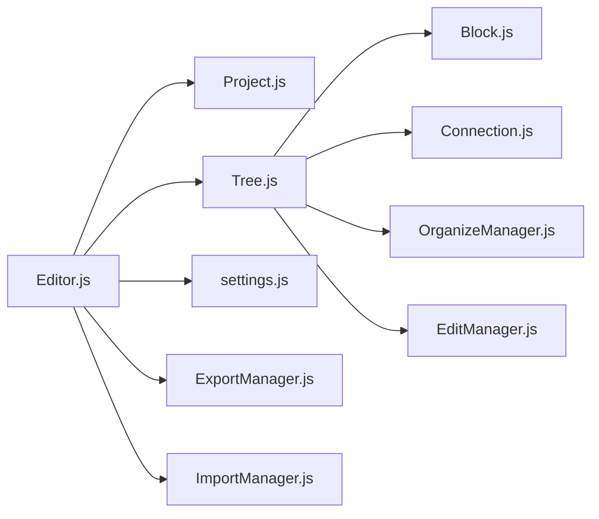

# 行为树编辑器

<cite>
**本文引用的文件**
- [tools/behavior3editor/README.md](file://tools/behavior3editor/README.md)
- [tools/behavior3editor/package.json](file://tools/behavior3editor/package.json)
- [tools/behavior3editor/src/index.html](file://tools/behavior3editor/src/index.html)
- [tools/behavior3editor/src/app/app.js](file://tools/behavior3editor/src/app/app.js)
- [tools/behavior3editor/src/app/services/editor.service.js](file://tools/behavior3editor/src/app/services/editor.service.js)
- [tools/behavior3editor/src/app/pages/projects/projects.controller.js](file://tools/behavior3editor/src/app/pages/projects/projects.controller.js)
- [tools/behavior3editor/src/editor/editor/Editor.js](file://tools/behavior3editor/src/editor/editor/Editor.js)
- [tools/behavior3editor/src/editor/tree/Tree.js](file://tools/behavior3editor/src/editor/tree/Tree.js)
- [tools/behavior3editor/src/editor/utils/Node.js](file://tools/behavior3editor/src/editor/utils/Node.js)
- [tools/behavior3editor/src/editor/utils/Block.js](file://tools/behavior3editor/src/editor/utils/Block.js)
- [tools/behavior3editor/src/editor/utils/Connection.js](file://tools/behavior3editor/src/editor/utils/Connection.js)
- [tools/behavior3editor/src/editor/utils/settings.js](file://tools/behavior3editor/src/editor/utils/settings.js)
- [tools/behavior3editor/src/editor/tree/managers/OrganizeManager.js](file://tools/behavior3editor/src/editor/tree/managers/OrganizeManager.js)
- [tools/behavior3editor/src/editor/tree/managers/EditManager.js](file://tools/behavior3editor/src/editor/tree/managers/EditManager.js)
- [tools/behavior3editor/src/editor/editor/managers/ExportManager.js](file://tools/behavior3editor/src/editor/editor/managers/ExportManager.js)
- [tools/behavior3editor/src/editor/editor/managers/ImportManager.js](file://tools/behavior3editor/src/editor/editor/managers/ImportManager.js)
- [tools/behavior3editor/src/editor/project/Project.js](file://tools/behavior3editor/src/editor/project/Project.js)
</cite>

## 目录
1. [简介](#简介)
2. [项目结构](#项目结构)
3. [核心组件](#核心组件)
4. [架构总览](#架构总览)
5. [详细组件分析](#详细组件分析)
6. [依赖关系分析](#依赖关系分析)
7. [性能与优化建议](#性能与优化建议)
8. [故障排查指南](#故障排查指南)
9. [结论](#结论)
10. [附录](#附录)

## 简介
本使用指南面向行为树编辑器的使用者与集成者，围绕可视化行为设计界面、节点类型与配置、项目管理、调试与优化、以及与开发工具的集成进行系统化说明。编辑器基于浏览器运行，支持自定义节点类型、自动/手动布局、JSON 导入导出，并提供基础的剪贴板与历史记录能力。

## 项目结构
编辑器采用前端单页应用（AngularJS + UI-Router）+ Canvas 渲染（CreateJS）的架构，核心逻辑集中在 editor 子目录，页面与服务在 app 子目录，资源通过 assets 提供，构建与打包由 gulp 管理。

图表来源
- [tools/behavior3editor/src/index.html:1-59](file://tools/behavior3editor/src/index.html#L1-L59)
- [tools/behavior3editor/src/app/app.js:1-63](file://tools/behavior3editor/src/app/app.js#L1-L63)
- [tools/behavior3editor/src/editor/editor/Editor.js:1-145](file://tools/behavior3editor/src/editor/editor/Editor.js#L1-L145)
- [tools/behavior3editor/src/editor/project/Project.js:1-57](file://tools/behavior3editor/src/editor/project/Project.js#L1-L57)
- [tools/behavior3editor/src/editor/tree/Tree.js:1-65](file://tools/behavior3editor/src/editor/tree/Tree.js#L1-L65)
- [tools/behavior3editor/src/editor/utils/Block.js:1-316](file://tools/behavior3editor/src/editor/utils/Block.js#L1-L316)
- [tools/behavior3editor/src/editor/utils/Connection.js:1-99](file://tools/behavior3editor/src/editor/utils/Connection.js#L1-L99)
- [tools/behavior3editor/src/editor/tree/managers/OrganizeManager.js:1-167](file://tools/behavior3editor/src/editor/tree/managers/OrganizeManager.js#L1-L167)
- [tools/behavior3editor/src/editor/tree/managers/EditManager.js:1-183](file://tools/behavior3editor/src/editor/tree/managers/EditManager.js#L1-L183)
- [tools/behavior3editor/src/editor/editor/managers/ExportManager.js:1-134](file://tools/behavior3editor/src/editor/editor/managers/ExportManager.js#L1-L134)
- [tools/behavior3editor/src/editor/editor/managers/ImportManager.js:1-117](file://tools/behavior3editor/src/editor/editor/managers/ImportManager.js#L1-L117)
- [tools/behavior3editor/src/editor/utils/settings.js:1-67](file://tools/behavior3editor/src/editor/utils/settings.js#L1-L67)
- [tools/behavior3editor/src/app/services/editor.service.js:1-38](file://tools/behavior3editor/src/app/services/editor.service.js#L1-L38)
- [tools/behavior3editor/src/app/pages/projects/projects.controller.js:1-214](file://tools/behavior3editor/src/app/pages/projects/projects.controller.js#L1-L214)

章节来源
- [tools/behavior3editor/src/index.html:1-59](file://tools/behavior3editor/src/index.html#L1-L59)
- [tools/behavior3editor/src/app/app.js:1-63](file://tools/behavior3editor/src/app/app.js#L1-L63)

## 核心组件
- 编辑器主类：负责创建游戏循环、初始化系统与管理器、应用设置、预览节点、脏标记等。
- 项目模型：维护当前项目、节点模板库、树集合、历史记录；内置默认节点集。
- 树容器：承载块、连接线、选择框、视图管理、组织器等子系统。
- 块（Block）：节点实例，包含标题、描述、属性、尺寸、锚点、命中测试、遍历等。
- 连接（Connection）：连接两个块的连线，支持曲线与箭头绘制、根据布局方向调整。
- 组织器（OrganizeManager）：按横向或纵向布局自动排列节点。
- 编辑器（EditManager）：实现复制/剪切/粘贴/删除、连接删除等编辑操作。
- 导出/导入（Export/Import Manager）：将项目/树/节点序列化为 JSON 或从 JSON 恢复。
- 设置（Settings）：统一的颜色、尺寸、缩放、对齐等参数。

章节来源
- [tools/behavior3editor/src/editor/editor/Editor.js:1-145](file://tools/behavior3editor/src/editor/editor/Editor.js#L1-L145)
- [tools/behavior3editor/src/editor/project/Project.js:1-57](file://tools/behavior3editor/src/editor/project/Project.js#L1-L57)
- [tools/behavior3editor/src/editor/tree/Tree.js:1-65](file://tools/behavior3editor/src/editor/tree/Tree.js#L1-L65)
- [tools/behavior3editor/src/editor/utils/Block.js:1-316](file://tools/behavior3editor/src/editor/utils/Block.js#L1-L316)
- [tools/behavior3editor/src/editor/utils/Connection.js:1-99](file://tools/behavior3editor/src/editor/utils/Connection.js#L1-L99)
- [tools/behavior3editor/src/editor/tree/managers/OrganizeManager.js:1-167](file://tools/behavior3editor/src/editor/tree/managers/OrganizeManager.js#L1-L167)
- [tools/behavior3editor/src/editor/tree/managers/EditManager.js:1-183](file://tools/behavior3editor/src/editor/tree/managers/EditManager.js#L1-L183)
- [tools/behavior3editor/src/editor/editor/managers/ExportManager.js:1-134](file://tools/behavior3editor/src/editor/editor/managers/ExportManager.js#L1-L134)
- [tools/behavior3editor/src/editor/editor/managers/ImportManager.js:1-117](file://tools/behavior3editor/src/editor/editor/managers/ImportManager.js#L1-L117)
- [tools/behavior3editor/src/editor/utils/settings.js:1-67](file://tools/behavior3editor/src/editor/utils/settings.js#L1-L67)

## 架构总览
编辑器以 Editor 为中心，通过系统（Camera/Connection/Selection/Drag/Collapse/Shortcut）与管理器（Project/Export/Import/Shortcuts）协作，渲染层由 CreateJS 负责，设置通过 SettingsManager 统一下发。

图表来源
- [tools/behavior3editor/src/editor/editor/Editor.js:1-145](file://tools/behavior3editor/src/editor/editor/Editor.js#L1-L145)
- [tools/behavior3editor/src/editor/project/Project.js:1-57](file://tools/behavior3editor/src/editor/project/Project.js#L1-L57)
- [tools/behavior3editor/src/editor/tree/Tree.js:1-65](file://tools/behavior3editor/src/editor/tree/Tree.js#L1-L65)
- [tools/behavior3editor/src/editor/utils/Block.js:1-316](file://tools/behavior3editor/src/editor/utils/Block.js#L1-L316)
- [tools/behavior3editor/src/editor/utils/Connection.js:1-99](file://tools/behavior3editor/src/editor/utils/Connection.js#L1-L99)
- [tools/behavior3editor/src/editor/tree/managers/OrganizeManager.js:1-167](file://tools/behavior3editor/src/editor/tree/managers/OrganizeManager.js#L1-L167)
- [tools/behavior3editor/src/editor/tree/managers/EditManager.js:1-183](file://tools/behavior3editor/src/editor/tree/managers/EditManager.js#L1-L183)
- [tools/behavior3editor/src/editor/editor/managers/ExportManager.js:1-134](file://tools/behavior3editor/src/editor/editor/managers/ExportManager.js#L1-L134)
- [tools/behavior3editor/src/editor/editor/managers/ImportManager.js:1-117](file://tools/behavior3editor/src/editor/editor/managers/ImportManager.js#L1-L117)

## 详细组件分析

### 可视化行为设计界面
- 节点拖拽与放置
  - 画布挂载可放置属性，配合拖拽指令与系统，将节点从面板拖入画布。
  - 节点实例 Block 具备锚点（输入/输出），用于连接其他节点。
- 连接绘制
  - Connection 支持水平/纵向布局下的贝塞尔曲线与箭头绘制，自动根据锚点位置重绘。
- 属性编辑
  - Block 支持动态标题与属性替换，属性变更后可触发重绘与布局更新。
- 自动布局
  - OrganizeManager 提供按横向/纵向的自动排列算法，支持按索引或坐标排序。

图表来源
- [tools/behavior3editor/src/app/pages/projects/projects.controller.js:1-214](file://tools/behavior3editor/src/app/pages/projects/projects.controller.js#L1-L214)
- [tools/behavior3editor/src/app/services/editor.service.js:1-38](file://tools/behavior3editor/src/app/services/editor.service.js#L1-L38)
- [tools/behavior3editor/src/editor/editor/Editor.js:1-145](file://tools/behavior3editor/src/editor/editor/Editor.js#L1-L145)
- [tools/behavior3editor/src/editor/project/Project.js:1-57](file://tools/behavior3editor/src/editor/project/Project.js#L1-L57)
- [tools/behavior3editor/src/editor/tree/Tree.js:1-65](file://tools/behavior3editor/src/editor/tree/Tree.js#L1-L65)
- [tools/behavior3editor/src/editor/tree/managers/OrganizeManager.js:1-167](file://tools/behavior3editor/src/editor/tree/managers/OrganizeManager.js#L1-L167)

章节来源
- [tools/behavior3editor/src/editor/utils/Block.js:1-316](file://tools/behavior3editor/src/editor/utils/Block.js#L1-L316)
- [tools/behavior3editor/src/editor/utils/Connection.js:1-99](file://tools/behavior3editor/src/editor/utils/Connection.js#L1-L99)
- [tools/behavior3editor/src/editor/tree/managers/OrganizeManager.js:1-167](file://tools/behavior3editor/src/editor/tree/managers/OrganizeManager.js#L1-L167)

### 行为树节点类型与配置
- 节点规格（Node）
  - 包含名称、标题、分类、描述、属性与是否默认节点等元信息。
- 节点实例（Block）
  - 基于 Node 实例化，具备唯一 ID、类别、属性、尺寸、锚点、命中测试、遍历等。
- 默认节点
  - 项目初始化时注册了多种内置节点（根、序列、优先、记忆型序列/优先、重复器系列、限制器、失败/成功、等待、运行等）。

图表来源
- [tools/behavior3editor/src/editor/utils/Node.js:1-39](file://tools/behavior3editor/src/editor/utils/Node.js#L1-L39)
- [tools/behavior3editor/src/editor/utils/Block.js:1-316](file://tools/behavior3editor/src/editor/utils/Block.js#L1-L316)
- [tools/behavior3editor/src/editor/project/Project.js:23-48](file://tools/behavior3editor/src/editor/project/Project.js#L23-L48)

章节来源
- [tools/behavior3editor/src/editor/utils/Node.js:1-39](file://tools/behavior3editor/src/editor/utils/Node.js#L1-L39)
- [tools/behavior3editor/src/editor/utils/Block.js:1-316](file://tools/behavior3editor/src/editor/utils/Block.js#L1-L316)
- [tools/behavior3editor/src/editor/project/Project.js:23-48](file://tools/behavior3editor/src/editor/project/Project.js#L23-L48)

### 项目管理：保存、加载、导入与导出
- 保存/关闭/重命名/移除
  - 项目页控制器提供新建、打开、保存、关闭、重命名与移除项目的能力，并处理未保存提示。
- 导出
  - ExportManager 支持导出项目（含所有树与自定义节点）、导出单棵树、导出自定义节点，生成统一版本号与作用域标识。
- 导入
  - ImportManager 支持从 JSON 恢复项目/树/节点，自动重建块与连接，并可触发重排。

图表来源
- [tools/behavior3editor/src/editor/editor/managers/ExportManager.js:1-134](file://tools/behavior3editor/src/editor/editor/managers/ExportManager.js#L1-L134)
- [tools/behavior3editor/src/editor/editor/managers/ImportManager.js:1-117](file://tools/behavior3editor/src/editor/editor/managers/ImportManager.js#L1-L117)
- [tools/behavior3editor/src/app/pages/projects/projects.controller.js:1-214](file://tools/behavior3editor/src/app/pages/projects/projects.controller.js#L1-L214)

章节来源
- [tools/behavior3editor/src/editor/editor/managers/ExportManager.js:1-134](file://tools/behavior3editor/src/editor/editor/managers/ExportManager.js#L1-L134)
- [tools/behavior3editor/src/editor/editor/managers/ImportManager.js:1-117](file://tools/behavior3editor/src/editor/editor/managers/ImportManager.js#L1-L117)
- [tools/behavior3editor/src/app/pages/projects/projects.controller.js:1-214](file://tools/behavior3editor/src/app/pages/projects/projects.controller.js#L1-L214)

### 调试工具与执行可视化
- 预览节点
  - Editor 提供 preview 方法，可将指定节点以缩略形式渲染到独立 Canvas，便于快速预览节点外观与布局。
- 脏标记
  - Editor 维护脏标记，项目页控制器在切换/关闭前检查该标记以提示保存。
- 历史记录
  - EditManager 与 OrganizeManager 在批量操作时通过历史记录批处理，便于撤销/重做（具体撤销机制由历史管理器实现）。

章节来源
- [tools/behavior3editor/src/editor/editor/Editor.js:111-134](file://tools/behavior3editor/src/editor/editor/Editor.js#L111-L134)
- [tools/behavior3editor/src/app/pages/projects/projects.controller.js:87-97](file://tools/behavior3editor/src/app/pages/projects/projects.controller.js#L87-L97)

### 与其他开发工具的集成与自动化
- 构建与打包
  - 使用 gulp 管理样式、脚本合并与压缩，支持模板缓存与资源打包。
- Electron 打包
  - package.json 中包含 electron 相关依赖，可用于将编辑器打包为桌面应用。
- JSON 格式开放
  - 导出格式为开放 JSON，可在其他语言/引擎中读取与执行，便于跨平台集成。

章节来源
- [tools/behavior3editor/package.json:1-30](file://tools/behavior3editor/package.json#L1-L30)
- [tools/behavior3editor/README.md:1-49](file://tools/behavior3editor/README.md#L1-L49)

## 依赖关系分析
- 模块耦合
  - Editor 作为中枢，依赖 Project、Tree、SettingsManager 与各系统/管理器。
  - Tree 内部聚合 Block、Connection、Selection、Organize、Edit 等子系统。
  - 导出/导入管理器依赖 Project 与 Tree 的数据结构。
- 外部依赖
  - AngularJS、UI-Router、UI Bootstrap、CreateJS、tine（轻量工具库）。

图表来源
- [tools/behavior3editor/src/editor/editor/Editor.js:1-145](file://tools/behavior3editor/src/editor/editor/Editor.js#L1-L145)
- [tools/behavior3editor/src/editor/project/Project.js:1-57](file://tools/behavior3editor/src/editor/project/Project.js#L1-L57)
- [tools/behavior3editor/src/editor/tree/Tree.js:1-65](file://tools/behavior3editor/src/editor/tree/Tree.js#L1-L65)
- [tools/behavior3editor/src/editor/utils/Block.js:1-316](file://tools/behavior3editor/src/editor/utils/Block.js#L1-L316)
- [tools/behavior3editor/src/editor/utils/Connection.js:1-99](file://tools/behavior3editor/src/editor/utils/Connection.js#L1-L99)
- [tools/behavior3editor/src/editor/tree/managers/OrganizeManager.js:1-167](file://tools/behavior3editor/src/editor/tree/managers/OrganizeManager.js#L1-L167)
- [tools/behavior3editor/src/editor/tree/managers/EditManager.js:1-183](file://tools/behavior3editor/src/editor/tree/managers/EditManager.js#L1-L183)
- [tools/behavior3editor/src/editor/editor/managers/ExportManager.js:1-134](file://tools/behavior3editor/src/editor/editor/managers/ExportManager.js#L1-L134)
- [tools/behavior3editor/src/editor/editor/managers/ImportManager.js:1-117](file://tools/behavior3editor/src/editor/editor/managers/ImportManager.js#L1-L117)

## 性能与优化建议
- 布局与渲染
  - 使用 OrganizeManager 的自动布局减少手工调整成本；横向/纵向布局在大规模树上差异明显，建议根据树的深度与分支特性选择合适布局。
- 连接绘制
  - 连接线重绘仅在必要时触发（如移动节点或切换布局），避免频繁全量重绘。
- 交互体验
  - 合理设置网格吸附（snap_x/snap_y）与偏移，提升拖拽与对齐效率。
- 数据规模
  - 导出/导入时注意节点数量与连接复杂度，大图建议分拆为多棵树或模块化管理。

## 故障排查指南
- 无法打开/保存项目
  - 检查文件扩展名与权限；桌面版可通过对话框选择路径；若提示“无效文件”，确认 JSON 结构与版本兼容性。
- 未保存提示频繁
  - 若编辑器处于脏状态，切换页面或关闭前会弹出确认提示；请先保存再继续。
- 导入后布局错乱
  - 导入后可触发自动布局；若仍异常，尝试手动调整或切换布局方向。
- 浏览器兼容性
  - 文档指出在 Chrome/Opera 上表现良好；Firefox 可能存在拖拽预览延迟等问题，建议使用推荐浏览器。

章节来源
- [tools/behavior3editor/src/app/pages/projects/projects.controller.js:87-133](file://tools/behavior3editor/src/app/pages/projects/projects.controller.js#L87-L133)
- [tools/behavior3editor/README.md:39-42](file://tools/behavior3editor/README.md#L39-L42)

## 结论
行为树编辑器提供了完整的可视化设计、节点管理、项目生命周期与导出导入能力。通过清晰的模块划分与统一的设置体系，用户可以高效地构建与维护复杂的行为树。结合自动布局与 JSON 开放格式，编辑器易于融入现有开发流程与自动化管线。

## 附录
- 快速上手
  - 新建项目 → 从面板拖拽节点到画布 → 拖动连接线 → 修改节点属性 → 自动/手动布局 → 导出为 JSON。
- 常用快捷键
  - 文档说明可一键自动布局（按键 a），便于快速整理复杂树。
- 默认节点清单
  - 根、序列、优先、记忆型序列/优先、重复器系列、限制器、失败/成功、等待、运行等。

章节来源
- [tools/behavior3editor/README.md:30-37](file://tools/behavior3editor/README.md#L30-L37)
- [tools/behavior3editor/src/editor/project/Project.js:28-44](file://tools/behavior3editor/src/editor/project/Project.js#L28-L44)