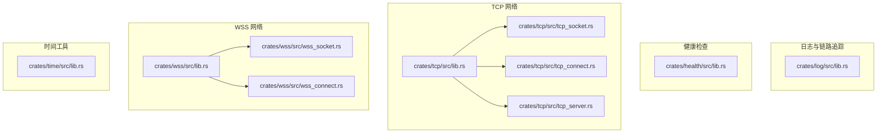
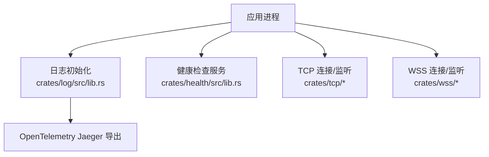
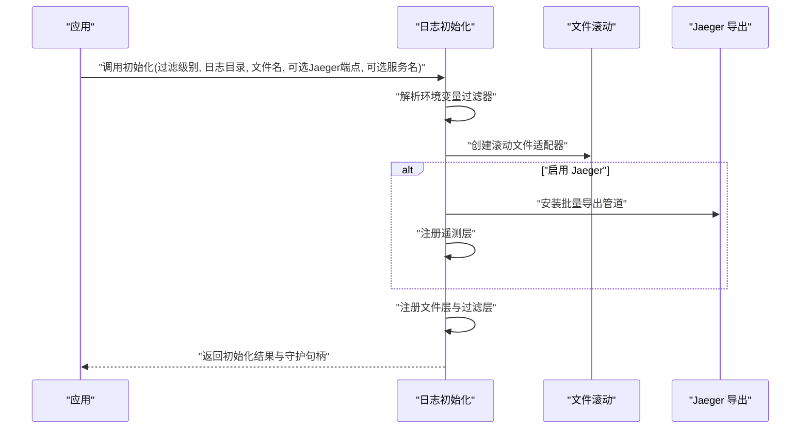
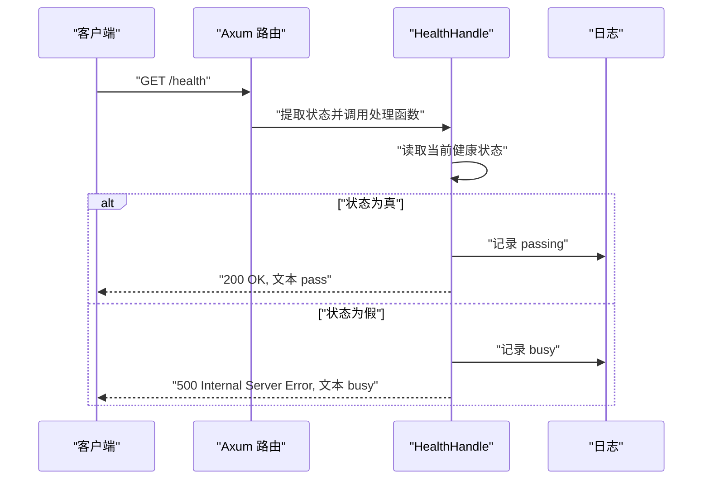
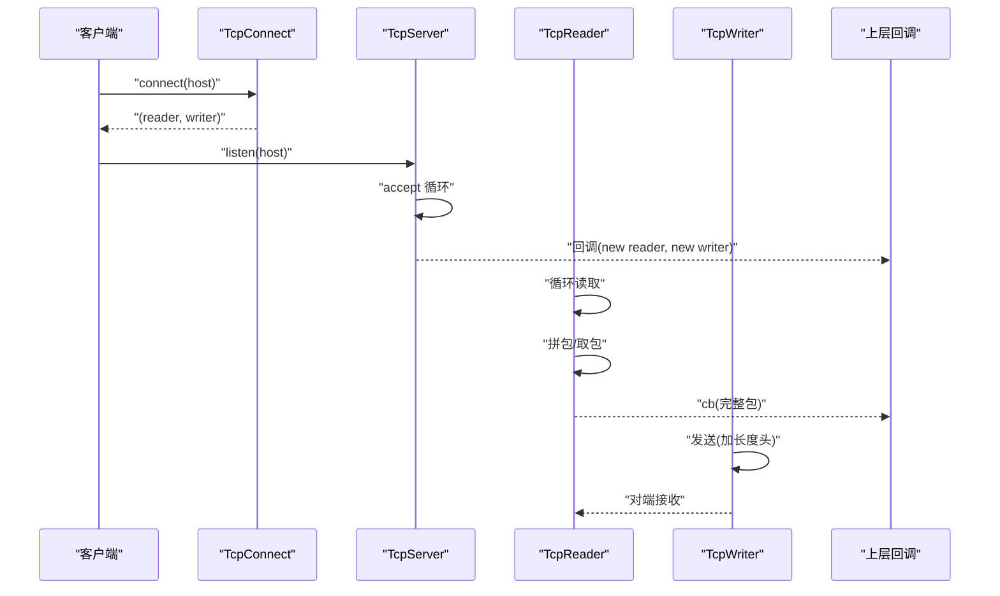
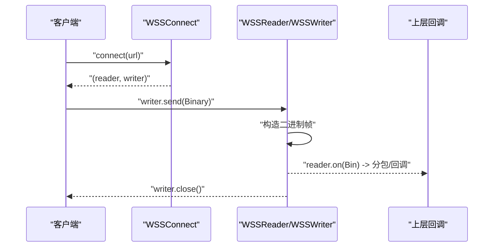
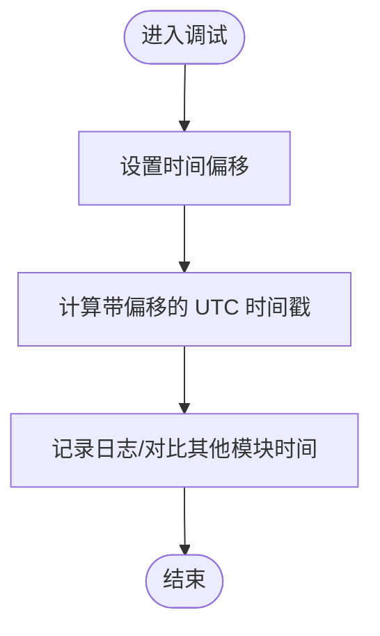
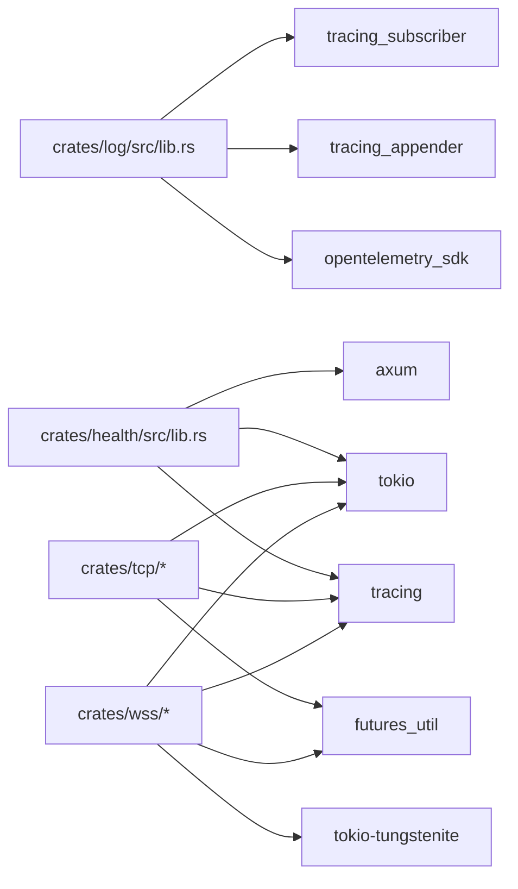

# 调试与分析工具

<cite>
**本文引用的文件**
- [crates/log/src/lib.rs](file://crates/log/src/lib.rs)
- [crates/health/src/lib.rs](file://crates/health/src/lib.rs)
- [crates/tcp/src/lib.rs](file://crates/tcp/src/lib.rs)
- [crates/tcp/src/tcp_socket.rs](file://crates/tcp/src/tcp_socket.rs)
- [crates/tcp/src/tcp_connect.rs](file://crates/tcp/src/tcp_connect.rs)
- [crates/tcp/src/tcp_server.rs](file://crates/tcp/src/tcp_server.rs)
- [crates/wss/src/lib.rs](file://crates/wss/src/lib.rs)
- [crates/wss/src/wss_socket.rs](file://crates/wss/src/wss_socket.rs)
- [crates/wss/src/wss_connect.rs](file://crates/wss/src/wss_connect.rs)
- [crates/time/src/lib.rs](file://crates/time/src/lib.rs)
</cite>

## 目录
1. [简介](#简介)
2. [项目结构](#项目结构)
3. [核心组件](#核心组件)
4. [架构总览](#架构总览)
5. [详细组件分析](#详细组件分析)
6. [依赖关系分析](#依赖关系分析)
7. [性能考虑](#性能考虑)
8. [故障排查指南](#故障排查指南)
9. [结论](#结论)
10. [附录](#附录)

## 简介
本指南围绕 geese 的调试与分析能力展开，重点覆盖以下方面：
- 日志系统：初始化流程、日志级别、格式化输出、滚动策略与可选的 Jaeger 链路追踪集成。
- 健康检查服务：HTTP 接口、状态管理、错误码返回与可观测性记录。
- 网络调试工具：TCP 与 WebSocket 安全通道（WSS）的连接、读写、消息分包、心跳与异常处理。
- 实体状态调试：通过时间偏移工具辅助定位时钟偏差与状态一致性问题。
- 性能分析建议：CPU、内存与 I/O 的观测方向与实践建议。

## 项目结构
本仓库采用多 crate 组织方式，调试与分析相关模块主要集中在以下位置：
- 日志与链路追踪：crates/log
- 健康检查服务：crates/health
- TCP 网络栈：crates/tcp
- WebSocket 安全通道（WSS）：crates/wss
- 时间偏移工具：crates/time

图表来源
- [crates/log/src/lib.rs:1-35](file://crates/log/src/lib.rs#L1-L35)
- [crates/health/src/lib.rs:1-51](file://crates/health/src/lib.rs#L1-L51)
- [crates/tcp/src/lib.rs:1-3](file://crates/tcp/src/lib.rs#L1-L3)
- [crates/tcp/src/tcp_socket.rs:1-101](file://crates/tcp/src/tcp_socket.rs#L1-L101)
- [crates/tcp/src/tcp_connect.rs:1-19](file://crates/tcp/src/tcp_connect.rs#L1-L19)
- [crates/tcp/src/tcp_server.rs:1-70](file://crates/tcp/src/tcp_server.rs#L1-L70)
- [crates/wss/src/lib.rs:1-4](file://crates/wss/src/lib.rs#L1-L4)
- [crates/wss/src/wss_socket.rs:1-126](file://crates/wss/src/wss_socket.rs#L1-L126)
- [crates/wss/src/wss_connect.rs:1-34](file://crates/wss/src/wss_connect.rs#L1-L34)
- [crates/time/src/lib.rs:1-30](file://crates/time/src/lib.rs#L1-L30)

章节来源
- [crates/log/src/lib.rs:1-35](file://crates/log/src/lib.rs#L1-L35)
- [crates/health/src/lib.rs:1-51](file://crates/health/src/lib.rs#L1-L51)
- [crates/tcp/src/lib.rs:1-3](file://crates/tcp/src/lib.rs#L1-L3)
- [crates/tcp/src/tcp_socket.rs:1-101](file://crates/tcp/src/tcp_socket.rs#L1-L101)
- [crates/tcp/src/tcp_connect.rs:1-19](file://crates/tcp/src/tcp_connect.rs#L1-L19)
- [crates/tcp/src/tcp_server.rs:1-70](file://crates/tcp/src/tcp_server.rs#L1-L70)
- [crates/wss/src/lib.rs:1-4](file://crates/wss/src/lib.rs#L1-L4)
- [crates/wss/src/wss_socket.rs:1-126](file://crates/wss/src/wss_socket.rs#L1-L126)
- [crates/wss/src/wss_connect.rs:1-34](file://crates/wss/src/wss_connect.rs#L1-L34)
- [crates/time/src/lib.rs:1-30](file://crates/time/src/lib.rs#L1-L30)

## 核心组件
- 日志与链路追踪初始化：支持按环境变量控制日志级别、文件滚动、非阻塞落盘与 OpenTelemetry Jaeger 导出。
- 健康检查服务：提供 /health GET 接口，返回 OK 或内部错误，并记录健康状态日志。
- TCP 网络栈：封装读写器、连接建立与监听，具备分包与错误处理。
- WSS 网络栈：基于 WebSocket 的安全通道实现，支持二进制帧、Ping/Pong、Close 处理与分包。
- 时间偏移工具：原子式时间偏移存储，用于模拟或校准系统时间。

章节来源
- [crates/log/src/lib.rs:8-35](file://crates/log/src/lib.rs#L8-L35)
- [crates/health/src/lib.rs:17-50](file://crates/health/src/lib.rs#L17-L50)
- [crates/tcp/src/tcp_socket.rs:25-101](file://crates/tcp/src/tcp_socket.rs#L25-L101)
- [crates/wss/src/wss_socket.rs:29-126](file://crates/wss/src/wss_socket.rs#L29-L126)
- [crates/time/src/lib.rs:4-28](file://crates/time/src/lib.rs#L4-L28)

## 架构总览
下图展示了日志、健康检查与网络栈之间的交互关系，以及可选的 Jaeger 集成路径。

图表来源
- [crates/log/src/lib.rs:8-35](file://crates/log/src/lib.rs#L8-L35)
- [crates/health/src/lib.rs:34-44](file://crates/health/src/lib.rs#L34-L44)
- [crates/tcp/src/tcp_connect.rs:10-18](file://crates/tcp/src/tcp_connect.rs#L10-L18)
- [crates/tcp/src/tcp_server.rs:22-64](file://crates/tcp/src/tcp_server.rs#L22-L64)
- [crates/wss/src/wss_connect.rs:12-33](file://crates/wss/src/wss_connect.rs#L12-L33)
- [crates/wss/src/wss_socket.rs:30-79](file://crates/wss/src/wss_socket.rs#L30-L79)

## 详细组件分析

### 日志系统
- 初始化入口
  - 支持从环境变量加载默认过滤级别，若失败则回退到传入的 filter 字符串。
  - 使用滚动文件适配器与非阻塞后台写入，避免阻塞主业务线程。
  - 可选启用 OpenTelemetry Jaeger 导出，支持自定义服务名。
- 输出与格式
  - 文件层采用无 ANSI 控制台输出，适合日志文件阅读。
  - 结合 tracing_subscriber 注册环境过滤层与可选的遥测层。
- 使用建议
  - 在开发阶段可将日志级别设为更细粒度；生产环境建议以 warn/error 为主，必要时临时提升。
  - 滚动策略按天生成新文件，便于归档与轮转。
  - 若接入 Jaeger，确保 endpoint 可达且服务名唯一。

图表来源
- [crates/log/src/lib.rs:8-35](file://crates/log/src/lib.rs#L8-L35)

章节来源
- [crates/log/src/lib.rs:8-35](file://crates/log/src/lib.rs#L8-L35)

### 健康检查服务
- 接口与路由
  - 提供 /health GET 路由，返回 200 表示 pass，否则返回 500 并标记 busy。
- 状态管理
  - 内部维护一个布尔型健康状态，可通过接口设置。
- 观测性
  - 访问时记录健康状态日志，便于审计与告警联动。

图表来源
- [crates/health/src/lib.rs:22-32](file://crates/health/src/lib.rs#L22-L32)
- [crates/health/src/lib.rs:34-44](file://crates/health/src/lib.rs#L34-L44)

章节来源
- [crates/health/src/lib.rs:12-50](file://crates/health/src/lib.rs#L12-L50)

### TCP 网络调试工具
- 连接与监听
  - 客户端：通过连接函数建立 TCP 连接并拆分为读写半工。
  - 服务端：绑定地址并循环接受连接，拆分为读写半工后回调给上层。
- 读写与分包
  - 读取器在循环中读取数据，拼接到分包器，尝试提取完整包后回调上层处理。
  - 写入器发送前附加长度头，保证对端可正确识别包边界。
- 错误处理
  - 对端关闭或读取错误时退出读循环；写入失败返回 false。
- 调试要点
  - 利用 trace/info/error 级别日志定位连接建立、读写循环与异常路径。
  - 关注空读（0 字节）与异常错误，及时中断并上报。

图表来源
- [crates/tcp/src/tcp_connect.rs:10-18](file://crates/tcp/src/tcp_connect.rs#L10-L18)
- [crates/tcp/src/tcp_server.rs:22-64](file://crates/tcp/src/tcp_server.rs#L22-L64)
- [crates/tcp/src/tcp_socket.rs:25-101](file://crates/tcp/src/tcp_socket.rs#L25-L101)

章节来源
- [crates/tcp/src/tcp_connect.rs:1-19](file://crates/tcp/src/tcp_connect.rs#L1-L19)
- [crates/tcp/src/tcp_server.rs:1-70](file://crates/tcp/src/tcp_server.rs#L1-L70)
- [crates/tcp/src/tcp_socket.rs:1-101](file://crates/tcp/src/tcp_socket.rs#L1-L101)

### WSS 网络调试工具
- 连接与握手
  - 通过构建请求发起 WebSocket 握手，成功后拆分为读写通道。
- 读写与分包
  - 读取器处理 Ping、Close、Binary 等消息类型，Binary 帧走分包逻辑并回调上层。
  - 写入器发送二进制帧并在失败时记录错误。
- 调试要点
  - 关注 Ping/Pong 心跳与 Close 事件，结合 trace/info/error 定位异常。
  - 分包器需确保输入连续、无丢帧。

图表来源
- [crates/wss/src/wss_connect.rs:12-33](file://crates/wss/src/wss_connect.rs#L12-L33)
- [crates/wss/src/wss_socket.rs:29-126](file://crates/wss/src/wss_socket.rs#L29-L126)

章节来源
- [crates/wss/src/wss_connect.rs:1-34](file://crates/wss/src/wss_connect.rs#L1-L34)
- [crates/wss/src/wss_socket.rs:1-126](file://crates/wss/src/wss_socket.rs#L1-L126)

### 实体状态调试方法（时间偏移）
- 功能概述
  - 提供原子式时间偏移存储，支持设置偏移量并计算带偏移的时间戳。
- 使用场景
  - 在调试实体状态一致性时，通过统一时间基准减少时钟漂移带来的误差。
  - 与日志时间戳配合，便于跨模块对齐事件顺序。

图表来源
- [crates/time/src/lib.rs:20-27](file://crates/time/src/lib.rs#L20-L27)

章节来源
- [crates/time/src/lib.rs:1-30](file://crates/time/src/lib.rs#L1-L30)

## 依赖关系分析
- 日志模块
  - 依赖 tracing_subscriber、tracing_appender、opentelemetry_sdk（可选）。
- 健康检查模块
  - 依赖 tokio、axum、tracing。
- TCP/WSS 模块
  - 依赖 tokio、futures-util、tokio-tungstenite（WSS）、tracing、net 抽象接口。

图表来源
- [crates/log/src/lib.rs:1-7](file://crates/log/src/lib.rs#L1-L7)
- [crates/health/src/lib.rs:3-10](file://crates/health/src/lib.rs#L3-L10)
- [crates/tcp/src/tcp_socket.rs:3-9](file://crates/tcp/src/tcp_socket.rs#L3-L9)
- [crates/wss/src/wss_socket.rs:3-12](file://crates/wss/src/wss_socket.rs#L3-L12)

章节来源
- [crates/log/src/lib.rs:1-7](file://crates/log/src/lib.rs#L1-L7)
- [crates/health/src/lib.rs:3-10](file://crates/health/src/lib.rs#L3-L10)
- [crates/tcp/src/tcp_socket.rs:3-9](file://crates/tcp/src/tcp_socket.rs#L3-L9)
- [crates/wss/src/wss_socket.rs:3-12](file://crates/wss/src/wss_socket.rs#L3-L12)

## 性能考虑
- 日志性能
  - 使用非阻塞文件适配器避免 IO 阻塞；按需调整日志级别与采样。
- 网络性能
  - TCP/WSS 发送前附加长度头，减少粘包/拆包开销；注意缓冲区大小与背压处理。
  - 读循环中及时处理异常与关闭事件，防止资源泄露。
- 健康检查
  - 路由简单、无复杂计算，但应避免频繁切换状态导致抖动。
- 时间偏移
  - 原子操作开销极低，适合高频使用；仅在需要统一时间基准时启用。

## 故障排查指南
- 日志无法输出或级别不生效
  - 检查环境变量与传入过滤器是否冲突；确认文件路径与权限。
  - 若启用 Jaeger，检查端点可达性与服务名配置。
- 健康检查一直返回 500
  - 确认健康状态被设置为 false；查看日志中的健康状态记录。
- TCP 连接频繁断开
  - 关注读取循环中的 0 字节与错误日志；检查对端关闭与网络波动。
- WSS 无法收到消息
  - 检查 Ping/Pong 心跳与 Close 事件；确认 Binary 帧是否完整到达分包器。
- 延迟测量与流量分析
  - 在发送与接收处打点记录时间戳，结合日志与时间偏移工具进行对齐分析。

章节来源
- [crates/log/src/lib.rs:8-35](file://crates/log/src/lib.rs#L8-L35)
- [crates/health/src/lib.rs:22-32](file://crates/health/src/lib.rs#L22-L32)
- [crates/tcp/src/tcp_socket.rs:37-54](file://crates/tcp/src/tcp_socket.rs#L37-L54)
- [crates/wss/src/wss_socket.rs:38-77](file://crates/wss/src/wss_socket.rs#L38-L77)
- [crates/time/src/lib.rs:20-27](file://crates/time/src/lib.rs#L20-L27)

## 结论
本指南梳理了 geese 的日志、健康检查与网络栈调试能力，并提供了可操作的使用建议与排障思路。建议在开发与生产环境中分别采用合适的日志级别与采样策略，利用健康检查接口与可观测性日志快速定位问题；在网络层通过分包与心跳机制保障稳定性；在需要统一时间基准时使用时间偏移工具辅助调试。

## 附录
- 常用环境变量与参数
  - 日志级别：通过环境变量控制；若未设置则使用传入的过滤字符串。
  - Jaeger：可选端点与服务名，便于集中采集链路信息。
- 健康检查
  - 接口：GET /health
  - 返回：200 pass 或 500 busy，同时记录健康状态日志。
- 网络调试
  - TCP：关注连接建立、读写循环、异常与关闭事件。
  - WSS：关注 Ping/Pong、Close、Binary 帧与分包完整性。