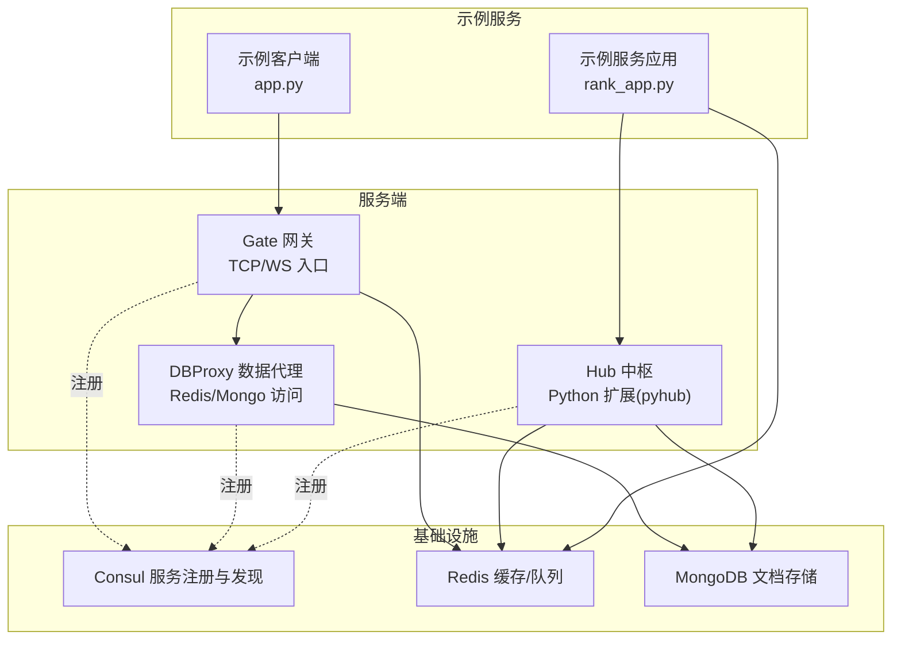
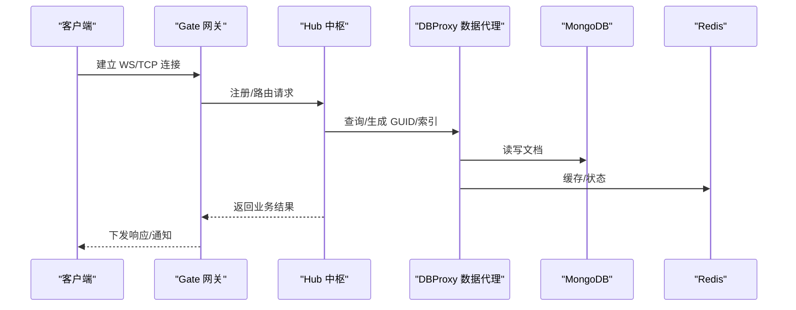
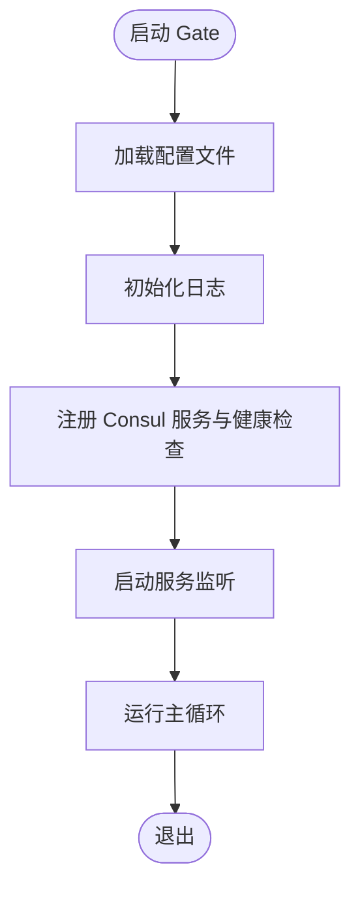
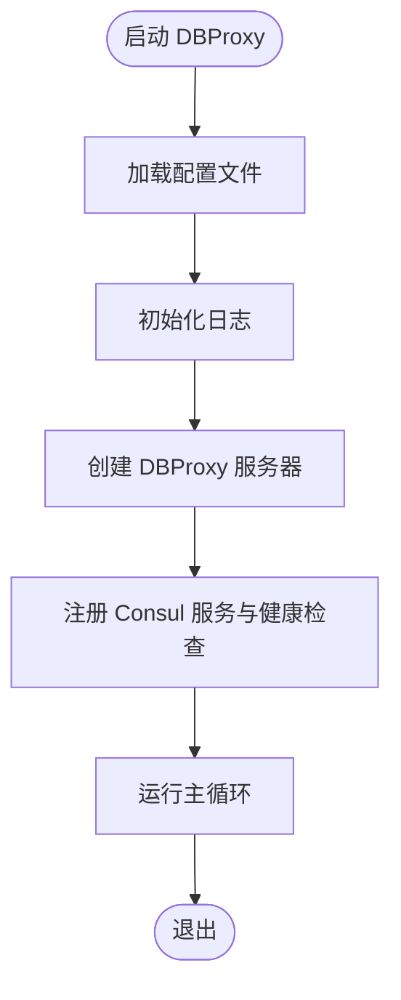
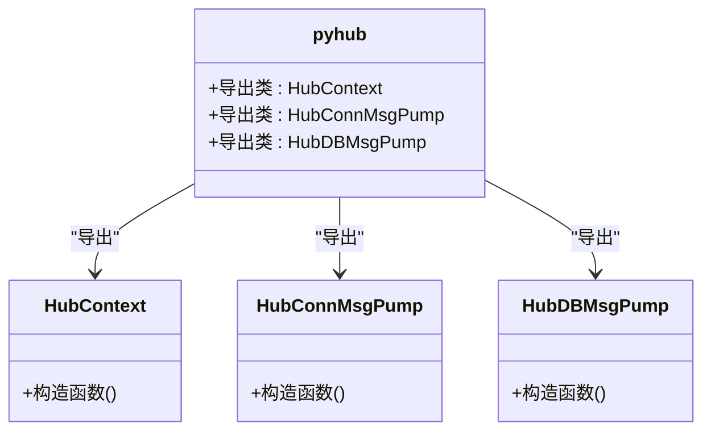
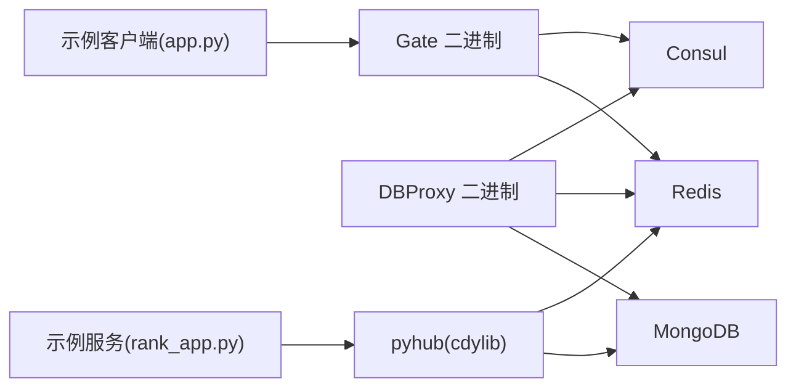
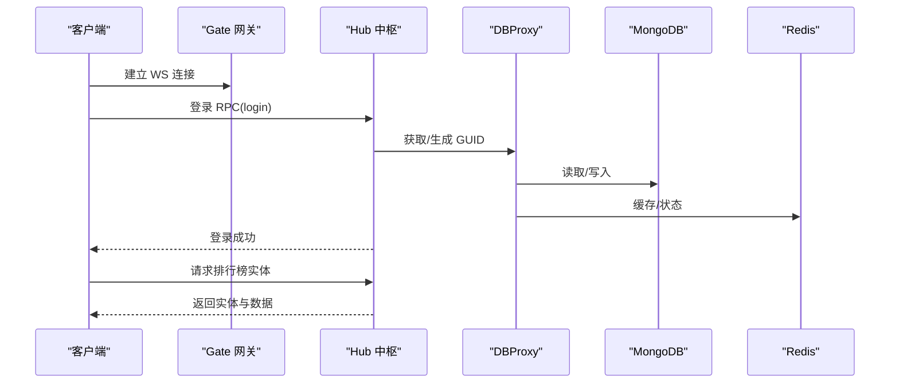

# 快速开始

<cite>
**本文引用的文件**
- [server/Cargo.toml](file://server/Cargo.toml)
- [server/src/gate_main.rs](file://server/src/gate_main.rs)
- [server/src/dbproxy_main.rs](file://server/src/dbproxy_main.rs)
- [server/src/hub_lib.rs](file://server/src/hub_lib.rs)
- [server/dependences/redis/start.bat](file://server/dependences/redis/start.bat)
- [sample/server/start.bat](file://sample/server/start.bat)
- [sample/server/config/gate.cfg](file://sample/server/config/gate.cfg)
- [sample/server/config/dbproxy.cfg](file://sample/server/config/dbproxy.cfg)
- [sample/server/config/rank.cfg](file://sample/server/config/rank.cfg)
- [sample/server/src/app.py](file://sample/server/src/app.py)
- [sample/client/py/app.py](file://sample/client/py/app.py)
- [client/.cargo/config.toml](file://client/.cargo/config.toml)
</cite>

## 目录
1. [简介](#简介)
2. [项目结构](#项目结构)
3. [核心组件](#核心组件)
4. [架构总览](#架构总览)
5. [详细组件分析](#详细组件分析)
6. [依赖关系分析](#依赖关系分析)
7. [性能与并发特性](#性能与并发特性)
8. [环境准备与安装](#环境准备与安装)
9. [服务部署流程](#服务部署流程)
10. [第一个完整示例：登录与消息交互](#第一个完整示例登录与消息交互)
11. [常见问题与故障排除](#常见问题与故障排除)
12. [结论](#结论)

## 简介
本指南面向首次接触 geese 框架的新用户，目标是在约 30 分钟内完成环境准备、服务部署与首个示例的端到端运行（客户端连接、用户登录、基础消息交互）。文档覆盖以下内容：
- 环境准备：Rust 工具链、Python 环境、系统依赖（Consul、Redis、MongoDB）及平台差异注意事项
- 服务部署：Gate 网关、DBProxy 数据代理、Hub 中枢与示例服务的启动顺序与配置要点
- 完整示例：客户端连接、登录流程、消息交互与实体生命周期
- 故障排除：常见错误定位与解决思路

## 项目结构
geese 采用多语言混合架构：
- 服务端以 Rust 实现核心网关与数据代理，并通过 Python 扩展模块承载业务中枢 Hub 的 Python 逻辑
- 客户端提供 Python 与 TypeScript 引擎，示例中使用 Python 客户端演示
- 配置采用 JSON 文件，集中管理各服务的网络、日志、健康检查与注册中心参数

图表来源
- [server/Cargo.toml:8-28](file://server/Cargo.toml#L8-L28)
- [server/src/gate_main.rs:18-31](file://server/src/gate_main.rs#L18-L31)
- [server/src/dbproxy_main.rs:15-36](file://server/src/dbproxy_main.rs#L15-L36)
- [server/src/hub_lib.rs:1-10](file://server/src/hub_lib.rs#L1-L10)

章节来源
- [server/Cargo.toml:1-42](file://server/Cargo.toml#L1-L42)

## 核心组件
- Gate 网关：对外提供 TCP/WS 入口，负责客户端接入、会话管理、与 Hub/DBProxy 协作
- DBProxy 数据代理：对接 Redis 与 MongoDB，提供统一的数据访问与索引/GUID 管理
- Hub 中枢：以 Python 扩展形式提供业务上下文与实体生命周期管理，示例中承载排行榜等业务
- 客户端引擎：提供连接、实体创建、RPC 调用与回调机制

章节来源
- [server/src/gate_main.rs:33-117](file://server/src/gate_main.rs#L33-L117)
- [server/src/dbproxy_main.rs:15-78](file://server/src/dbproxy_main.rs#L15-L78)
- [server/src/hub_lib.rs:1-10](file://server/src/hub_lib.rs#L1-L10)

## 架构总览
下图展示从客户端到服务端的关键交互路径与职责边界。

图表来源
- [server/src/gate_main.rs:90-105](file://server/src/gate_main.rs#L90-L105)
- [server/src/dbproxy_main.rs:44-50](file://server/src/dbproxy_main.rs#L44-L50)
- [sample/server/src/app.py:107-115](file://sample/server/src/app.py#L107-L115)

## 详细组件分析

### Gate 网关
- 启动流程：加载配置 → 初始化日志 → 注册 Consul 健康检查 → 启动服务监听
- 监听端口：服务端口用于 Hub/DBProxy 注册与通信；客户端 TCP/WS 端口用于玩家接入
- 健康检查：通过独立健康端口暴露 /health 接口供 Consul 轮询
- 依赖：Consul 服务注册、Redis 会话/路由、可选 WSS 配置

图表来源
- [server/src/gate_main.rs:34-111](file://server/src/gate_main.rs#L34-L111)

章节来源
- [server/src/gate_main.rs:18-31](file://server/src/gate_main.rs#L18-L31)
- [server/src/gate_main.rs:64-86](file://server/src/gate_main.rs#L64-L86)
- [server/src/gate_main.rs:108-111](file://server/src/gate_main.rs#L108-L111)

### DBProxy 数据代理
- 启动流程：加载配置 → 初始化日志 → 创建 DBProxy 服务器 → 注册 Consul 健康检查
- 功能：统一 Redis/Mongo 访问，支持索引与 GUID 初始化配置
- 健康检查：独立健康端口暴露 /health

图表来源
- [server/src/dbproxy_main.rs:15-74](file://server/src/dbproxy_main.rs#L15-L74)

章节来源
- [server/src/dbproxy_main.rs:15-36](file://server/src/dbproxy_main.rs#L15-L36)
- [server/src/dbproxy_main.rs:54-68](file://server/src/dbproxy_main.rs#L54-L68)
- [server/src/dbproxy_main.rs:70-74](file://server/src/dbproxy_main.rs#L70-L74)

### Hub 中枢（Python 扩展）
- 以 cdylib 形式导出 Hub 上下文与消息泵类，供 Python 侧业务使用
- 示例应用通过注册实体类型、构建登录与玩家服务、运行协程查询服务等方式组织业务

图表来源
- [server/src/hub_lib.rs:1-10](file://server/src/hub_lib.rs#L1-L10)

章节来源
- [server/src/hub_lib.rs:1-10](file://server/src/hub_lib.rs#L1-L10)

## 依赖关系分析
- 服务端二进制：Gate、DBProxy 由 Rust 编译产出；Hub 通过 Python 扩展模块提供能力
- 外部依赖：Consul（服务注册与发现）、Redis（缓存/会话）、MongoDB（持久化）
- 配置耦合：各服务通过 namespace、consul_url、health_port、日志目录等参数协同

图表来源
- [server/Cargo.toml:8-28](file://server/Cargo.toml#L8-L28)
- [sample/server/config/gate.cfg:1-12](file://sample/server/config/gate.cfg#L1-L12)
- [sample/server/config/dbproxy.cfg:1-13](file://sample/server/config/dbproxy.cfg#L1-L13)
- [sample/server/config/rank.cfg:1-12](file://sample/server/config/rank.cfg#L1-L12)

章节来源
- [server/Cargo.toml:8-28](file://server/Cargo.toml#L8-L28)

## 性能与并发特性
- Gate/DBProxy 使用异步运行时处理高并发连接与请求
- Hub 通过 Python 扩展承载业务逻辑，建议在业务密集场景评估 Python GIL 与线程模型影响
- 建议：合理设置健康检查间隔、日志级别与缓冲区大小，避免 IO 瓶颈

[本节为通用指导，不直接分析具体文件]

## 环境准备与安装

### Rust 工具链
- 安装：使用官方安装器安装最新稳定版
- 平台差异：
  - macOS ARM/x86：如需动态链接符号，请按工程配置设置 rustflags
  - Windows/Linux：按默认流程安装即可

章节来源
- [client/.cargo/config.toml:1-6](file://client/.cargo/config.toml#L1-L6)

### Python 环境
- 建议使用虚拟环境隔离依赖
- 示例服务与客户端均基于 Python 3.x

[本节为通用指导，不直接分析具体文件]

### 系统依赖
- Consul：服务注册与发现
- Redis：缓存与会话
- MongoDB：文档存储

章节来源
- [sample/server/start.bat:1-5](file://sample/server/start.bat#L1-L5)
- [server/dependences/redis/start.bat:1-5](file://server/dependences/redis/start.bat#L1-L5)

### 平台差异与注意事项
- Windows
  - 提供批处理脚本一键启动 Consul、Redis 与服务端二进制
  - 客户端示例默认使用 WebSocket 连接
- macOS/Linux
  - 参考 Windows 脚本中的顺序与参数，手动执行对应命令
  - 注意端口占用与防火墙策略

章节来源
- [sample/server/start.bat:1-23](file://sample/server/start.bat#L1-L23)

## 服务部署流程

### 启动顺序与配置要点
1) 启动 Consul 与 Redis
- Consul：开发模式启动
- Redis：按配置文件启动

2) 启动 DBProxy
- 加载 dbproxy.cfg，注册 Consul 健康检查
- 绑定服务端口，等待 Hub/DBProxy 通信

3) 启动 Gate
- 加载 gate.cfg，注册 Consul 健康检查
- 绑定服务端口与客户端 TCP/WS 端口

4) 启动示例服务（Hub）
- 加载 rank.cfg，构建登录与玩家服务，注册实体类型，运行协程查询服务

5) 启动示例客户端
- 连接 Gate 的 WS 端口，发起登录 RPC，请求排行榜实体

章节来源
- [sample/server/start.bat:1-23](file://sample/server/start.bat#L1-L23)
- [sample/server/config/dbproxy.cfg:1-13](file://sample/server/config/dbproxy.cfg#L1-L13)
- [sample/server/config/gate.cfg:1-12](file://sample/server/config/gate.cfg#L1-L12)
- [sample/server/config/rank.cfg:1-12](file://sample/server/config/rank.cfg#L1-L12)
- [server/src/dbproxy_main.rs:15-74](file://server/src/dbproxy_main.rs#L15-L74)
- [server/src/gate_main.rs:33-111](file://server/src/gate_main.rs#L33-L111)
- [sample/server/src/app.py:107-115](file://sample/server/src/app.py#L107-L115)

## 第一个完整示例：登录与消息交互

### 步骤概览
- 启动基础设施：Consul、Redis
- 启动 DBProxy 与 Gate
- 启动示例服务（rank_app.py）
- 启动示例客户端（app.py），连接 Gate，发起登录与 RPC 请求

### 关键流程时序

图表来源
- [sample/client/py/app.py:45-50](file://sample/client/py/app.py#L45-L50)
- [sample/server/src/app.py:61-79](file://sample/server/src/app.py#L61-L79)
- [server/src/gate_main.rs:90-105](file://server/src/gate_main.rs#L90-L105)
- [server/src/dbproxy_main.rs:44-50](file://server/src/dbproxy_main.rs#L44-L50)

### 客户端连接与登录
- 客户端通过 WS 连接 Gate
- 发起登录 RPC，随后请求 Hub 服务“Rank”，创建远程实体并进行查询

章节来源
- [sample/client/py/app.py:55-68](file://sample/client/py/app.py#L55-L68)
- [sample/client/py/app.py:41-50](file://sample/client/py/app.py#L41-L50)

### 服务端登录与实体创建
- Hub 收到登录事件后，根据 SDK UUID 获取或生成账户 ID
- 将玩家信息写入 Redis，创建主实体并调用排行榜服务

章节来源
- [sample/server/src/app.py:61-99](file://sample/server/src/app.py#L61-L99)
- [sample/server/src/app.py:107-115](file://sample/server/src/app.py#L107-L115)

## 常见问题与故障排除

- Consul 无法访问
  - 症状：服务注册失败、健康检查 500
  - 排查：确认 Consul 地址与端口配置一致，服务已启动
  - 参考
    - [sample/server/config/gate.cfg](file://sample/server/config/gate.cfg#L3)
    - [sample/server/config/dbproxy.cfg](file://sample/server/config/dbproxy.cfg#L3)

- Redis 连接失败
  - 症状：登录/迁移/缓存相关功能异常
  - 排查：确认 Redis 配置与实际进程一致，Windows 下使用提供的启动脚本
  - 参考
    - [sample/server/config/gate.cfg](file://sample/server/config/gate.cfg#L5)
    - [sample/server/config/dbproxy.cfg](file://sample/server/config/dbproxy.cfg#L6)
    - [server/dependences/redis/start.bat:1-5](file://server/dependences/redis/start.bat#L1-L5)

- MongoDB 连接失败
  - 症状：登录/数据读写异常
  - 排查：确认 MongoDB 地址与端口，以及数据库/集合存在
  - 参考
    - [sample/server/config/dbproxy.cfg](file://sample/server/config/dbproxy.cfg#L6)

- Gate/DBProxy 端口冲突
  - 症状：启动失败或被占用
  - 排查：修改配置文件中的 service_port、client_ws_port、health_port
  - 参考
    - [sample/server/config/gate.cfg:6-8](file://sample/server/config/gate.cfg#L6-L8)
    - [sample/server/config/dbproxy.cfg](file://sample/server/config/dbproxy.cfg#L9)

- 客户端无法连接
  - 症状：WS 连接失败
  - 排查：确认 Gate 的 client_ws_port 与客户端连接地址一致
  - 参考
    - [sample/client/py/app.py](file://sample/client/py/app.py#L66)
    - [sample/server/config/gate.cfg](file://sample/server/config/gate.cfg#L8)

- 日志定位
  - 各服务均支持配置日志级别与输出目录，便于问题排查
  - 参考
    - [sample/server/config/gate.cfg:9-12](file://sample/server/config/gate.cfg#L9-L12)
    - [sample/server/config/dbproxy.cfg:10-13](file://sample/server/config/dbproxy.cfg#L10-L13)
    - [sample/server/config/rank.cfg:9-12](file://sample/server/config/rank.cfg#L9-L12)

## 结论
通过本指南，您可以在 30 分钟内完成环境准备、服务部署与首个示例的端到端验证。建议在生产环境中进一步完善：
- 健康检查与自动重启策略
- 日志聚合与告警
- 网络与安全加固（TLS/WSS）
- 数据库与缓存的高可用部署