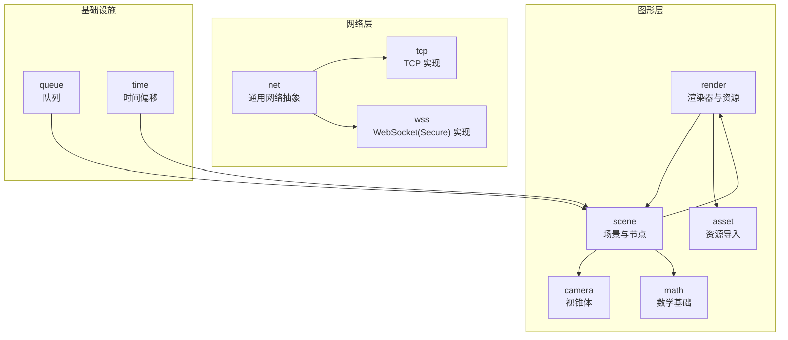
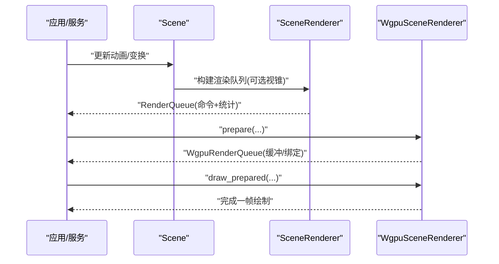
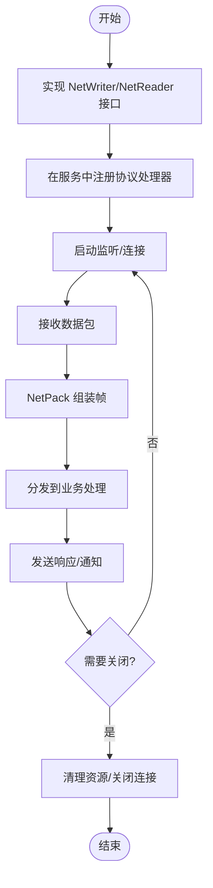
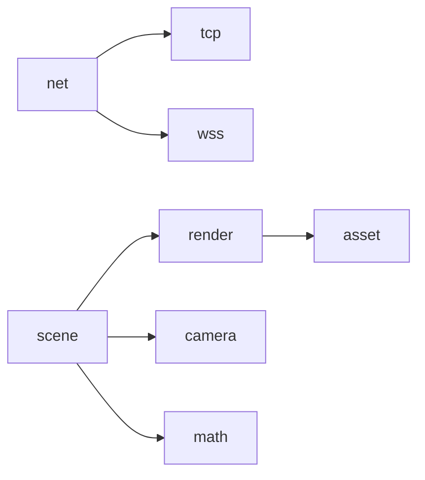

# 扩展开发

<cite>
**本文引用的文件**
- [crates/render/src/lib.rs](file://crates/render/src/lib.rs)
- [crates/render/src/scene.rs](file://crates/render/src/scene.rs)
- [crates/render/src/wgpu_renderer.rs](file://crates/render/src/wgpu_renderer.rs)
- [crates/scene/src/lib.rs](file://crates/scene/src/lib.rs)
- [crates/scene/src/scene.rs](file://crates/scene/src/scene.rs)
- [crates/camera/src/lib.rs](file://crates/camera/src/lib.rs)
- [crates/math/src/lib.rs](file://crates/math/src/lib.rs)
- [crates/net/src/lib.rs](file://crates/net/src/lib.rs)
- [crates/tcp/src/lib.rs](file://crates/tcp/src/lib.rs)
- [crates/wss/src/lib.rs](file://crates/wss/src/lib.rs)
- [crates/asset/src/lib.rs](file://crates/asset/src/lib.rs)
- [crates/queue/src/lib.rs](file://crates/queue/src/lib.rs)
- [crates/time/src/lib.rs](file://crates/time/src/lib.rs)
</cite>

## 目录
1. [引言](#引言)
2. [项目结构](#项目结构)
3. [核心组件](#核心组件)
4. [架构总览](#架构总览)
5. [详细组件分析](#详细组件分析)
6. [依赖关系分析](#依赖关系分析)
7. [性能考虑](#性能考虑)
8. [故障排查指南](#故障排查指南)
9. [结论](#结论)
10. [附录](#附录)

## 引言
本指南面向希望在 geese 扩展体系上进行二次开发的工程师，覆盖以下主题：
- 自定义服务模块的接口定义、生命周期管理与跨服务集成
- 插件系统的架构设计与扩展机制
- 新通信协议（TCP、UDP、自定义协议）的接入方法
- 渲染系统、场景管理与相机控制的扩展开发
- 性能优化、内存管理与并发处理最佳实践
- 第三方库集成、依赖管理与版本兼容性策略
- 为扩展开发者提供的完整二次开发框架与工具链

## 项目结构
geese 采用多 crate 的 Rust 工程组织方式，按功能域划分模块：
- 渲染与图形：render、scene、camera、math、asset
- 网络与协议：net、tcp、wss
- 时间与队列：time、queue
- 其他支撑：log、config、health、local_ip、mongo、redis_service、consul、close_handle

图表来源
- [crates/render/src/lib.rs:1-16](file://crates/render/src/lib.rs#L1-L16)
- [crates/scene/src/lib.rs:1-11](file://crates/scene/src/lib.rs#L1-L11)
- [crates/camera/src/lib.rs:1](file://crates/camera/src/lib.rs#L1)
- [crates/math/src/lib.rs:1-43](file://crates/math/src/lib.rs#L1-L43)
- [crates/asset/src/lib.rs:1-14](file://crates/asset/src/lib.rs#L1-L14)
- [crates/net/src/lib.rs:1-75](file://crates/net/src/lib.rs#L1-L75)
- [crates/tcp/src/lib.rs:1-3](file://crates/tcp/src/lib.rs#L1-L3)
- [crates/wss/src/lib.rs:1-4](file://crates/wss/src/lib.rs#L1-L4)
- [crates/queue/src/lib.rs:1-21](file://crates/queue/src/lib.rs#L1-L21)
- [crates/time/src/lib.rs:1-30](file://crates/time/src/lib.rs#L1-L30)

章节来源
- [crates/render/src/lib.rs:1-16](file://crates/render/src/lib.rs#L1-L16)
- [crates/scene/src/lib.rs:1-11](file://crates/scene/src/lib.rs#L1-L11)
- [crates/net/src/lib.rs:1-75](file://crates/net/src/lib.rs#L1-L75)

## 核心组件
- 场景与对象
  - Scene 负责节点树、对象集合、八叉树、材质库、动画与骨骼数据的管理，并提供可见性查询与渲染队列构建能力。
  - SceneObject 表示场景中的具体对象，包含本地/世界变换、包围盒、网格与材质句柄等。
- 渲染管线
  - SceneRenderer 将场景对象转换为渲染命令与统计信息；WgpuSceneRenderer 基于 wgpu 实现 GPU 端绘制，负责缓冲区、绑定组与管线布局。
  - RenderObject/RenderCommand 抽象了对象到渲染命令的映射。
- 数学与相机
  - AABB 提供轴对齐包围盒运算；Frustum 来自 camera 模块，用于剔除与可见性判断。
- 网络抽象
  - NetWriter/NetReader/NetReaderCallback 定义异步写入与读取回调；NetPack 提供基于长度前缀的帧组装逻辑。
- 协议实现
  - tcp 与 wss 分别提供连接、服务器与套接字实现；net 提供通用网络抽象。

章节来源
- [crates/scene/src/scene.rs:1-173](file://crates/scene/src/scene.rs#L1-L173)
- [crates/render/src/scene.rs:1-87](file://crates/render/src/scene.rs#L1-L87)
- [crates/render/src/wgpu_renderer.rs:1-674](file://crates/render/src/wgpu_renderer.rs#L1-L674)
- [crates/math/src/lib.rs:1-43](file://crates/math/src/lib.rs#L1-L43)
- [crates/camera/src/lib.rs:1](file://crates/camera/src/lib.rs#L1)
- [crates/net/src/lib.rs:1-75](file://crates/net/src/lib.rs#L1-L75)
- [crates/tcp/src/lib.rs:1-3](file://crates/tcp/src/lib.rs#L1-L3)
- [crates/wss/src/lib.rs:1-4](file://crates/wss/src/lib.rs#L1-L4)

## 架构总览
下图展示了从场景到渲染器再到 GPU 的整体流程，以及网络层的抽象与协议实现。

图表来源
- [crates/scene/src/scene.rs:56-65](file://crates/scene/src/scene.rs#L56-L65)
- [crates/render/src/scene.rs:42-79](file://crates/render/src/scene.rs#L42-L79)
- [crates/render/src/wgpu_renderer.rs:414-560](file://crates/render/src/wgpu_renderer.rs#L414-L560)

## 详细组件分析

### 组件A：渲染系统与场景管理
- 设计要点
  - 渲染命令由 SceneRenderer 生成，包含实体标识、网格、材质、模型矩阵、法线矩阵与骨骼矩阵。
  - WgpuSceneRenderer 将命令转换为 GPU 可执行的缓冲与绑定组，支持法线贴图、采样器与着色参数。
  - 场景通过 Octree 进行空间分割，结合 Frustum 做视锥剔除，减少渲染开销。
- 数据结构复杂度
  - 渲染队列构建为 O(N)（N 为可见对象数），八叉树插入/查询受空间分布影响，理想情况下近似 O(log N)。
- 优化建议
  - 合理设置 Octree 的 max_objects 与 max_depth，避免过深或过浅导致缓存命中率下降。
  - 对静态对象使用实例化或合并网格以降低 draw call。
  - 材质缺失时回退默认材质，避免频繁空材质查找。

```mermaid
classDiagram
class Scene {
+nodes : Vec<SceneNode>
+objects : Vec<SceneObject>
+octree : Octree
+materials : MaterialLibrary
+animations : Vec<AnimationClip>
+skins : Vec<Skin>
+bounds : AABB
+visible_objects(frustum) : Vec<&SceneObject>
+render_queue(renderer, frustum) : RenderQueue
+update_animation(player, dt)
+rebuild_octree()
}
class SceneRenderer {
+build_queue(materials, objects) : RenderQueue
}
class WgpuSceneRenderer {
+prepare(device, queue, materials, render_queue) : WgpuRenderQueue
+draw_prepared(pass, queue)
}
class RenderObject {
+entity_id() : &str
+mesh() : &ModelMesh
+model_matrix() : [[f32;4];4]
+normal_matrix() : [[f32;4];4]
+joint_matrices() : &[[[f32;4];4]]
}
Scene --> SceneRenderer : "构建队列"
SceneRenderer --> RenderObject : "遍历对象"
SceneRenderer --> WgpuSceneRenderer : "准备GPU命令"
```

图表来源
- [crates/scene/src/scene.rs:9-143](file://crates/scene/src/scene.rs#L9-L143)
- [crates/render/src/scene.rs:3-86](file://crates/render/src/scene.rs#L3-L86)
- [crates/render/src/wgpu_renderer.rs:180-560](file://crates/render/src/wgpu_renderer.rs#L180-L560)

章节来源
- [crates/scene/src/scene.rs:1-173](file://crates/scene/src/scene.rs#L1-L173)
- [crates/render/src/scene.rs:1-87](file://crates/render/src/scene.rs#L1-L87)
- [crates/render/src/wgpu_renderer.rs:1-674](file://crates/render/src/wgpu_renderer.rs#L1-L674)

### 组件B：相机与视锥剔除
- 设计要点
  - Frustum 由 camera 模块提供，Scene 在构建渲染队列时可选择是否启用视锥剔除。
  - 场景更新世界变换后重建 Octree，确保剔除准确性。
- 使用建议
  - 动态场景中定期重建 Octree，避免因对象移动导致的错误剔除。
  - 视锥参数应与投影矩阵一致，保证裁剪平面正确。

章节来源
- [crates/scene/src/scene.rs:52-65](file://crates/scene/src/scene.rs#L52-L65)
- [crates/camera/src/lib.rs:1](file://crates/camera/src/lib.rs#L1)

### 组件C：网络抽象与协议扩展
- 设计要点
  - NetWriter/NetReader/NetReaderCallback 定义异步发送与接收回调；NetPack 提供基于 4 字节长度前缀的帧组装。
  - tcp 与 wss 提供连接、服务器与套接字实现，可作为新协议的参考模板。
- 生命周期与集成
  - Reader 通过 start 接收回调锁与任务句柄，便于统一管理生命周期。
  - Writer 提供 send 与 close，确保异常断开时资源释放。
- 新协议接入步骤
  - 参考 tcp/wss 的目录结构，新增 crate 并实现 NetWriter/NetReader 接口。
  - 在服务侧注册协议处理器，将消息解码为内部实体调用或 RPC 请求。
  - 配置监听端口、握手流程与心跳策略。

图表来源
- [crates/net/src/lib.rs:8-75](file://crates/net/src/lib.rs#L8-L75)
- [crates/tcp/src/lib.rs:1-3](file://crates/tcp/src/lib.rs#L1-L3)
- [crates/wss/src/lib.rs:1-4](file://crates/wss/src/lib.rs#L1-L4)

章节来源
- [crates/net/src/lib.rs:1-75](file://crates/net/src/lib.rs#L1-L75)
- [crates/tcp/src/lib.rs:1-3](file://crates/tcp/src/lib.rs#L1-L3)
- [crates/wss/src/lib.rs:1-4](file://crates/wss/src/lib.rs#L1-L4)

### 组件D：资源导入与 GLTF 处理
- 设计要点
  - asset 提供 glTF 导入入口；scene 模块解析节点、网格、材质、骨骼与动画，构建 Scene。
  - 支持法线、切线、UV、骨骼权重等顶点属性的提取与生成。
- 扩展建议
  - 新增资源格式时，在 asset 中增加导入函数，并在 scene 中扩展加载逻辑。
  - 注意内存占用与纹理上传路径，避免重复解码与冗余拷贝。

章节来源
- [crates/asset/src/lib.rs:1-14](file://crates/asset/src/lib.rs#L1-L14)
- [crates/scene/src/lib.rs:266-330](file://crates/scene/src/lib.rs#L266-L330)

### 组件E：时间与队列
- 设计要点
  - OffsetTime 提供毫秒级 UTC 时间与偏移量原子存储，便于跨服务时间同步。
  - Queue 基于 VecDeque 实现 FIFO 队列，适合事件/任务调度。
- 使用建议
  - 在高并发场景中，优先使用无锁或低锁结构；若需全局时间源，使用原子读取。
  - 队列容量应根据峰值吞吐量评估，避免频繁扩容。

章节来源
- [crates/time/src/lib.rs:1-30](file://crates/time/src/lib.rs#L1-L30)
- [crates/queue/src/lib.rs:1-21](file://crates/queue/src/lib.rs#L1-L21)

## 依赖关系分析
- 模块耦合
  - scene 依赖 render 的 MaterialLibrary 与 RenderObject；render 依赖 asset 的纹理与材质；camera 提供剔除所需几何。
  - net 为 tcp/wss 提供抽象，二者分别实现具体协议。
- 外部依赖
  - wgpu、cgmath、gltf 等第三方库在渲染与数学计算中广泛使用。
- 循环依赖
  - 当前结构未见直接循环依赖；如新增模块，应避免反向依赖主干模块。

图表来源
- [crates/net/src/lib.rs:1-75](file://crates/net/src/lib.rs#L1-L75)
- [crates/tcp/src/lib.rs:1-3](file://crates/tcp/src/lib.rs#L1-L3)
- [crates/wss/src/lib.rs:1-4](file://crates/wss/src/lib.rs#L1-L4)
- [crates/scene/src/lib.rs:12-27](file://crates/scene/src/lib.rs#L12-L27)
- [crates/render/src/lib.rs:6-15](file://crates/render/src/lib.rs#L6-L15)

章节来源
- [crates/scene/src/lib.rs:12-27](file://crates/scene/src/lib.rs#L12-L27)
- [crates/render/src/lib.rs:6-15](file://crates/render/src/lib.rs#L6-L15)

## 性能考虑
- 渲染
  - 减少 draw call：合并材质相同且拓扑连续的对象；使用 instancing 或批处理。
  - 控制 GPU 数据传输：复用缓冲与绑定组，批量更新 uniform。
  - 剔除优化：合理配置 Octree 参数，避免过度细分；利用视锥剔除与遮挡剔除。
- 场景与动画
  - 动画采样与骨骼矩阵计算应在 CPU 端尽量高效；必要时使用 SIMD 或并行。
  - 对静态对象禁用每帧更新，或延迟到变更时再更新。
- 网络
  - 使用零拷贝与缓冲池减少分配；批量发送与 Nagle 优化。
  - 帧组装与拆包应避免频繁扩容；保持固定头部长度以简化解析。
- 内存与并发
  - 使用 Arc/Mutex/Async-trait 时注意锁粒度；优先采用无锁容器或通道。
  - 定期检查内存增长，避免闭包捕获大对象导致的泄漏。

## 故障排查指南
- 渲染问题
  - 若出现黑面或材质缺失：检查材质库是否正确加载，RenderQueue 统计中 missing_materials 是否异常。
  - 若模型错位或不显示：确认世界矩阵更新顺序与父节点变换传播。
- 网络问题
  - 断包/粘包：核对 NetPack 的长度字段与剩余缓冲处理逻辑。
  - 连接异常：检查 Reader 任务是否被取消，Writer 的 close 是否被调用。
- 场景问题
  - 可见性异常：确认 Frustum 参数与投影一致；检查 Octree 重建时机。
- 时间与队列
  - 时间偏差：检查 OffsetTime 的偏移设置与读取一致性。
  - 队列阻塞：检查生产者/消费者速率与队列容量。

章节来源
- [crates/render/src/scene.rs:20-31](file://crates/render/src/scene.rs#L20-L31)
- [crates/render/src/wgpu_renderer.rs:414-560](file://crates/render/src/wgpu_renderer.rs#L414-L560)
- [crates/net/src/lib.rs:29-75](file://crates/net/src/lib.rs#L29-L75)
- [crates/scene/src/scene.rs:91-97](file://crates/scene/src/scene.rs#L91-L97)
- [crates/time/src/lib.rs:20-27](file://crates/time/src/lib.rs#L20-L27)
- [crates/queue/src/lib.rs:14-21](file://crates/queue/src/lib.rs#L14-L21)

## 结论
geese 的扩展开发围绕“场景-渲染-网络”三大主线展开。通过清晰的抽象与模块化设计，开发者可以：
- 快速接入新协议，遵循 net 的接口约定与 tcp/wss 的实现范式；
- 扩展渲染管线，利用 SceneRenderer/WgpuSceneRenderer 的命令生成与 GPU 准备流程；
- 在场景层实现动画、骨骼与空间索引的增强，提升大规模场景的运行效率；
- 在基础设施层引入时间与队列等通用能力，保障系统稳定性与可维护性。

## 附录
- 开发建议
  - 以最小可行模块切入，先实现接口与生命周期，再逐步完善功能。
  - 编写单元测试与基准测试，覆盖关键路径与边界条件。
  - 文档与注释同步更新，明确模块职责与外部依赖。
- 工具与脚手架
  - 借助现有 tcp/wss 的目录结构与接口定义，快速生成新协议 crate。
  - 使用渲染器的 prepare/draw 流程作为新图形扩展的参考模板。