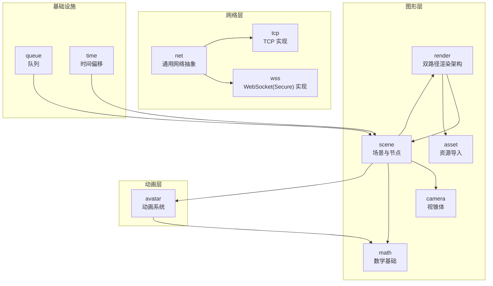
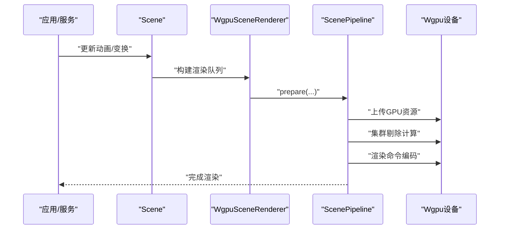
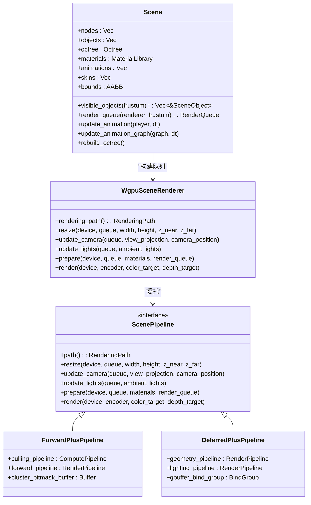
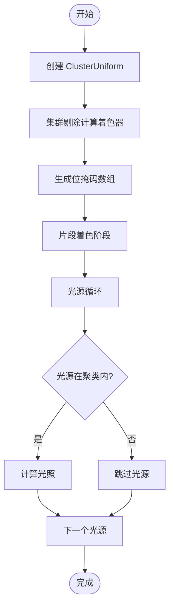
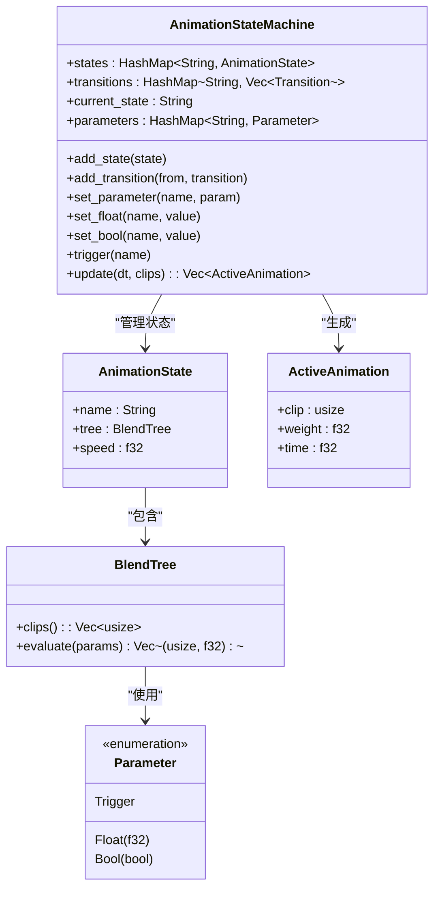
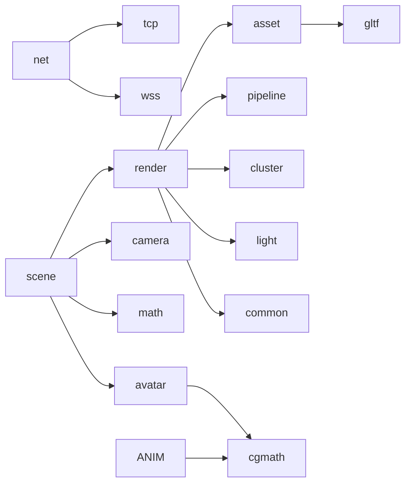

# 扩展开发

<cite>
**本文引用的文件**
- [crates/render/src/lib.rs](file://crates/render/src/lib.rs)
- [crates/render/src/pipeline.rs](file://crates/render/src/pipeline.rs)
- [crates/render/src/forward_plus.rs](file://crates/render/src/forward_plus.rs)
- [crates/render/src/deferred_plus.rs](file://crates/render/src/deferred_plus.rs)
- [crates/render/src/cluster.rs](file://crates/render/src/cluster.rs)
- [crates/render/src/light.rs](file://crates/render/src/light.rs)
- [crates/render/src/common.rs](file://crates/render/src/common.rs)
- [crates/render/src/wgpu_renderer.rs](file://crates/render/src/wgpu_renderer.rs)
- [crates/render/shaders/cluster_culling.wgsl](file://crates/render/shaders/cluster_culling.wgsl)
- [crates/render/shaders/forward_plus.wgsl](file://crates/render/shaders/forward_plus.wgsl)
- [crates/render/shaders/deferred_lighting.wgsl](file://crates/render/shaders/deferred_lighting.wgsl)
- [crates/render/shaders/pbr_common.wgsl](file://crates/render/shaders/pbr_common.wgsl)
- [crates/scene/src/lib.rs](file://crates/scene/src/lib.rs)
- [crates/scene/src/scene.rs](file://crates/scene/src/scene.rs)
- [crates/avatar/src/lib.rs](file://crates/avatar/src/lib.rs)
- [crates/avatar/src/animation.rs](file://crates/avatar/src/animation.rs)
- [crates/avatar/src/animation_graph.rs](file://crates/avatar/src/animation_graph.rs)
- [crates/scene/tests/animation_graph_tests.rs](file://crates/scene/tests/animation_graph_tests.rs)
- [crates/camera/src/lib.rs](file://crates/camera/src/lib.rs)
- [crates/math/src/lib.rs](file://crates/math/src/lib.rs)
- [crates/net/src/lib.rs](file://crates/net/src/lib.rs)
- [crates/tcp/src/lib.rs](file://crates/tcp/src/lib.rs)
- [crates/wss/src/lib.rs](file://crates/wss/src/lib.rs)
- [crates/asset/src/lib.rs](file://crates/asset/src/lib.rs)
- [crates/queue/src/lib.rs](file://crates/queue/src/lib.rs)
- [crates/time/src/lib.rs](file://crates/time/src/lib.rs)
</cite>

## 更新摘要
**所做更改**
- 更新渲染系统章节以反映双路径渲染架构的重大变更
- 新增管道抽象层、聚类系统和光照系统的详细说明
- 更新渲染流程图以展示 Forward-Plus 和 Deferred-Plus 架构差异
- 添加新的着色器架构和集群剔除系统说明
- 更新性能优化建议以适应新的渲染路径

## 目录
1. [引言](#引言)
2. [项目结构](#项目结构)
3. [核心组件](#核心组件)
4. [架构总览](#架构总览)
5. [详细组件分析](#详细组件分析)
6. [依赖关系分析](#依赖关系分析)
7. [性能考虑](#性能考虑)
8. [故障排查指南](#故障排查指南)
9. [结论](#结论)
10. [附录](#附录)

## 引言
本指南面向希望在 geese 扩展体系上进行二次开发的工程师，覆盖以下主题：
- 自定义服务模块的接口定义、生命周期管理与跨服务集成
- 插件系统的架构设计与扩展机制
- 新通信协议（TCP、UDP、自定义协议）的接入方法
- **渲染系统：从单通道网格渲染重构为双路径渲染架构（Forward-Plus和Deferred-Plus）**
- **新增管道抽象层、聚类系统、光照系统等核心组件**
- 场景管理与相机控制的扩展开发
- **动画系统：从 avatar crate 提供的高级动画图系统到场景集成**
- 性能优化、内存管理与并发处理最佳实践
- 第三方库集成、依赖管理与版本兼容性策略
- 为扩展开发者提供的完整二次开发框架与工具链

## 项目结构
geese 采用多 crate 的 Rust 工程组织方式，按功能域划分模块：
- **渲染与图形：render（重构为双路径架构）、scene、camera、math、asset**
- **动画系统：avatar（新增）**
- 网络与协议：net、tcp、wss
- 时间与队列：time、queue
- 其他支撑：log、config、health、local_ip、mongo、redis_service、consul、close_handle

**图表来源**
- [crates/render/src/lib.rs:1-33](file://crates/render/src/lib.rs#L1-L33)
- [crates/scene/src/lib.rs:1-440](file://crates/scene/src/lib.rs#L1-L440)
- [crates/avatar/src/lib.rs:1-13](file://crates/avatar/src/lib.rs#L1-L13)
- [crates/camera/src/lib.rs:1](file://crates/camera/src/lib.rs#L1)
- [crates/math/src/lib.rs:1-43](file://crates/math/src/lib.rs#L1-L43)
- [crates/asset/src/lib.rs:1-14](file://crates/asset/src/lib.rs#L1-L14)
- [crates/net/src/lib.rs:1-75](file://crates/net/src/lib.rs#L1-L75)
- [crates/tcp/src/lib.rs:1-3](file://crates/tcp/src/lib.rs#L1-L3)
- [crates/wss/src/lib.rs:1-4](file://crates/wss/src/lib.rs#L1-L4)
- [crates/queue/src/lib.rs:1-21](file://crates/queue/src/lib.rs#L1-L21)
- [crates/time/src/lib.rs:1-30](file://crates/time/src/lib.rs#L1-L30)

**章节来源**
- [crates/render/src/lib.rs:1-33](file://crates/render/src/lib.rs#L1-L33)
- [crates/scene/src/lib.rs:1-440](file://crates/scene/src/lib.rs#L1-L440)
- [crates/avatar/src/lib.rs:1-13](file://crates/avatar/src/lib.rs#L1-L13)
- [crates/net/src/lib.rs:1-75](file://crates/net/src/lib.rs#L1-L75)

## 核心组件
- **双路径渲染架构**
  - **Forward-Plus**：基于聚类剔除的前向渲染，使用计算着色器进行光源剔除，适合大量透明和半透明物体。
  - **Deferred-Plus**：基于 G-Buffer 的延迟渲染，包含几何传递和光照传递，适合大量光源场景。
  - **管道抽象层**：统一的 ScenePipeline 接口，支持动态切换渲染路径。
- **聚类系统**
  - ClusterUniform 提供屏幕空间聚类划分（8×8×16=1024个聚类）。
  - 集群剔除计算着色器生成位掩码，优化光照计算复杂度。
- **光照系统**
  - 支持方向光、点光和聚光灯，最大支持16个光源。
  - LightStorage 提供 GPU 上传格式，包含环境光和光源数组。
- **管道抽象层**
  - RenderingPath 枚举定义渲染路径选择。
  - ScenePipeline trait 提供统一的生命周期接口。
- 场景与对象
  - Scene 负责节点树、对象集合、八叉树、材质库、动画与骨骼数据的管理，并提供可见性查询与渲染队列构建能力。
  - SceneObject 表示场景中的具体对象，包含本地/世界变换、包围盒、网格与材质句柄等。
- 渲染管线
  - WgpuSceneRenderer 作为顶层外观，根据 RenderingPath 选择 ForwardPlusPipeline 或 DeferredPlusPipeline。
  - RenderObject/RenderCommand 抽象了对象到渲染命令的映射。
- 数学与相机
  - AABB 提供轴对齐包围盒运算；Frustum 来自 camera 模块，用于剔除与可见性判断。
- 网络抽象
  - NetWriter/NetReader/NetReaderCallback 定义异步写入与读取回调；NetPack 提供基于长度前缀的帧组装逻辑。
- 协议实现
  - tcp 与 wss 分别提供连接、服务器与套接字实现；net 提供通用网络抽象。
- **动画系统**（**重大更新**）
  - **avatar crate**：全新的动画系统模块，提供高级动画图系统，支持状态机、混合树和参数驱动的动画控制。
  - **AnimationPlayer**：基础动画播放器，支持单个动画片段的播放、循环和速度控制。
  - **AnimationStateMachine**：基于状态机的动画图系统，支持状态切换、参数驱动和混合动画。
  - **BlendTree**：混合树系统，支持单动画和一维混合两种模式。
  - **Parameter**：参数类型，支持浮点数、布尔值和触发器三种类型。

**章节来源**
- [crates/render/src/pipeline.rs:3-16](file://crates/render/src/pipeline.rs#L3-L16)
- [crates/render/src/cluster.rs:3-11](file://crates/render/src/cluster.rs#L3-L11)
- [crates/render/src/light.rs:3-4](file://crates/render/src/light.rs#L3-L4)
- [crates/render/src/forward_plus.rs:19-41](file://crates/render/src/forward_plus.rs#L19-L41)
- [crates/render/src/deferred_plus.rs:31-77](file://crates/render/src/deferred_plus.rs#L31-L77)
- [crates/scene/src/scene.rs:1-285](file://crates/scene/src/scene.rs#L1-L285)
- [crates/render/src/wgpu_renderer.rs:60-87](file://crates/render/src/wgpu_renderer.rs#L60-L87)
- [crates/math/src/lib.rs:1-43](file://crates/math/src/lib.rs#L1-L43)
- [crates/camera/src/lib.rs:1](file://crates/camera/src/lib.rs#L1)
- [crates/net/src/lib.rs:1-75](file://crates/net/src/lib.rs#L1-L75)
- [crates/tcp/src/lib.rs:1-3](file://crates/tcp/src/lib.rs#L1-L3)
- [crates/wss/src/lib.rs:1-4](file://crates/wss/src/lib.rs#L1-L4)
- [crates/avatar/src/animation.rs:105-139](file://crates/avatar/src/animation.rs#L105-L139)
- [crates/avatar/src/animation_graph.rs:100-322](file://crates/avatar/src/animation_graph.rs#L100-L322)

## 架构总览
下图展示了从场景到渲染器再到 GPU 的整体流程，以及网络层的抽象与协议实现。**渲染系统现已重构为双路径架构，提供 Forward-Plus 和 Deferred-Plus 两种渲染路径**。

**图表来源**
- [crates/scene/src/scene.rs:100-188](file://crates/scene/src/scene.rs#L100-L188)
- [crates/render/src/wgpu_renderer.rs:116-135](file://crates/render/src/wgpu_renderer.rs#L116-L135)
- [crates/render/src/pipeline.rs:66-109](file://crates/render/src/pipeline.rs#L66-L109)

## 详细组件分析

### 组件A：双路径渲染系统与场景管理
- **设计要点**
  - **Forward-Plus 架构**：使用计算着色器进行集群剔除，前向渲染阶段仅处理受影响的光源，适合大量透明和半透明物体。
  - **Deferred-Plus 架构**：包含几何传递（写入 G-Buffer）和光照传递（全屏四边形），适合大量光源场景。
  - **管道抽象层**：统一的 ScenePipeline 接口，支持动态切换渲染路径，保持调用方接口不变。
  - **聚类系统**：1024个聚类（8×8×16）的屏幕空间划分，使用位掩码优化光照计算。
  - **光照系统**：支持最多16个光源，包含环境光和多种光源类型。
- **数据结构复杂度**
  - 聚类剔除为 O(TOTAL_CLUSTERS)，其中 TOTAL_CLUSTERS=1024。
  - 渲染队列构建为 O(N)（N 为可见对象数），八叉树插入/查询受空间分布影响，理想情况下近似 O(log N)。
- **优化建议**
  - 合理设置聚类参数，平衡内存占用和剔除精度。
  - 根据场景特点选择合适的渲染路径：Forward-Plus适合大量透明物体，Deferred-Plus适合大量光源。
  - 对静态对象使用实例化或合并网格以降低 draw call。
  - 材质缺失时回退默认材质，避免频繁空材质查找。

**图表来源**
- [crates/scene/src/scene.rs:9-285](file://crates/scene/src/scene.rs#L9-L285)
- [crates/render/src/wgpu_renderer.rs:60-139](file://crates/render/src/wgpu_renderer.rs#L60-L139)
- [crates/render/src/pipeline.rs:66-109](file://crates/render/src/pipeline.rs#L66-L109)
- [crates/render/src/forward_plus.rs:19-41](file://crates/render/src/forward_plus.rs#L19-L41)
- [crates/render/src/deferred_plus.rs:31-77](file://crates/render/src/deferred_plus.rs#L31-L77)

**章节来源**
- [crates/scene/src/scene.rs:1-285](file://crates/scene/src/scene.rs#L1-L285)
- [crates/render/src/wgpu_renderer.rs:1-139](file://crates/render/src/wgpu_renderer.rs#L1-L139)
- [crates/render/src/pipeline.rs:1-128](file://crates/render/src/pipeline.rs#L1-L128)
- [crates/render/src/forward_plus.rs:1-614](file://crates/render/src/forward_plus.rs#L1-L614)
- [crates/render/src/deferred_plus.rs:1-761](file://crates/render/src/deferred_plus.rs#L1-L761)

### 组件B：聚类系统与光照管理
- **设计要点**
  - **聚类系统**：1024个聚类（8×8×16）的屏幕空间划分，使用 ClusterUniform 提供划分参数。
  - **集群剔除**：计算着色器生成位掩码，每个聚类记录影响该区域的光源索引。
  - **光照系统**：支持方向光、点光和聚光灯，LightStorage 提供 GPU 上传格式。
  - **着色器集成**：forward_plus.wgsl 和 deferred_lighting.wgsl 共享聚类剔除逻辑。
- **使用建议**
  - 聚类大小可根据场景特点调整，平衡内存占用和剔除精度。
  - 光源数量应控制在16以内，超出部分会被截断。
  - 环境光和光源强度应合理设置，避免过亮或过暗。

**图表来源**
- [crates/render/src/cluster.rs:15-78](file://crates/render/src/cluster.rs#L15-L78)
- [crates/render/shaders/cluster_culling.wgsl:7-27](file://crates/render/shaders/cluster_culling.wgsl#L7-L27)

**章节来源**
- [crates/render/src/cluster.rs:1-145](file://crates/render/src/cluster.rs#L1-L145)
- [crates/render/src/light.rs:1-310](file://crates/render/src/light.rs#L1-L310)
- [crates/render/shaders/cluster_culling.wgsl:1-28](file://crates/render/shaders/cluster_culling.wgsl#L1-L28)

### 组件C：相机与视锥剔除
- **设计要点**
  - Frustum 由 camera 模块提供，Scene 在构建渲染队列时可选择是否启用视锥剔除。
  - 场景更新世界变换后重建 Octree，确保剔除准确性。
- **使用建议**
  - 动态场景中定期重建 Octree，避免因对象移动导致的错误剔除。
  - 视锥参数应与投影矩阵一致，保证裁剪平面正确。

**章节来源**
- [crates/scene/src/scene.rs:74-76](file://crates/scene/src/scene.rs#L74-L76)
- [crates/camera/src/lib.rs:1](file://crates/camera/src/lib.rs#L1)

### 组件D：网络抽象与协议扩展
- **设计要点**
  - NetWriter/NetReader/NetReaderCallback 定义异步发送与接收回调；NetPack 提供基于 4 字节长度前缀的帧组装。
  - tcp 与 wss 提供连接、服务器与套接字实现，可作为新协议的参考模板。
- **生命周期与集成**
  - Reader 通过 start 接收回调锁与任务句柄，便于统一管理生命周期。
  - Writer 提供 send 与 close，确保异常断开时资源释放。
- **新协议接入步骤**
  - 参考 tcp/wss 的目录结构，新增 crate 并实现 NetWriter/NetReader 接口。
  - 在服务侧注册协议处理器，将消息解码为内部实体调用或 RPC 请求。
  - 配置监听端口、握手流程与心跳策略。

**图表来源**
- [crates/net/src/lib.rs:8-75](file://crates/net/src/lib.rs#L8-L75)
- [crates/tcp/src/lib.rs:1-3](file://crates/tcp/src/lib.rs#L1-L3)
- [crates/wss/src/lib.rs:1-4](file://crates/wss/src/lib.rs#L1-L4)

**章节来源**
- [crates/net/src/lib.rs:1-75](file://crates/net/src/lib.rs#L1-L75)
- [crates/tcp/src/lib.rs:1-3](file://crates/tcp/src/lib.rs#L1-L3)
- [crates/wss/src/lib.rs:1-4](file://crates/wss/src/lib.rs#L1-L4)

### 组件E：资源导入与 GLTF 处理
- **设计要点**
  - asset 提供 glTF 导入入口；scene 模块解析节点、网格、材质、骨骼与动画，构建 Scene。
  - 支持法线、切线、UV、骨骼权重等顶点属性的提取与生成。
- **扩展建议**
  - 新增资源格式时，在 asset 中增加导入函数，并在 scene 中扩展加载逻辑。
  - 注意内存占用与纹理上传路径，避免重复解码与冗余拷贝。

**章节来源**
- [crates/asset/src/lib.rs:1-14](file://crates/asset/src/lib.rs#L1-L14)
- [crates/scene/src/lib.rs:266-440](file://crates/scene/src/lib.rs#L266-L440)

### 组件F：时间与队列
- **设计要点**
  - OffsetTime 提供毫秒级 UTC 时间与偏移量原子存储，便于跨服务时间同步。
  - Queue 基于 VecDeque 实现 FIFO 队列，适合事件/任务调度。
- **使用建议**
  - 在高并发场景中，优先使用无锁或低锁结构；若需全局时间源，使用原子读取。
  - 队列容量应根据峰值吞吐量评估，避免频繁扩容。

**章节来源**
- [crates/time/src/lib.rs:1-30](file://crates/time/src/lib.rs#L1-L30)
- [crates/queue/src/lib.rs:1-21](file://crates/queue/src/lib.rs#L1-L21)

### 组件G：动画系统（**重大更新**）

#### 动画系统架构重构
**重要更新**：动画系统已从 scene crate 迁移到新的 avatar crate，提供更清晰的模块分离和更强大的功能。

#### avatar crate：新的动画系统核心
- **模块分离**：动画相关代码现在位于独立的 avatar crate 中，提高了代码组织性和可维护性。
- **API 导出**：avatar crate 通过 lib.rs 导出所有必要的动画类型和功能，供其他模块使用。
- **依赖管理**：avatar crate 仅依赖 cgmath 库，保持了轻量级设计。

#### 传统动画系统（AnimationPlayer）
- **设计要点**
  - AnimationPlayer 提供基础的单动画播放功能，支持播放状态、循环模式和播放速度控制。
  - 通过 AnimationClip 存储动画数据，包括持续时间、通道和输出数据。
  - 支持线性、步进和三次样条插值方式。
- **使用场景**
  - 简单的循环动画播放
  - UI 动画效果
  - 特殊效果的独立播放

#### 基于状态机的动画图系统（AnimationStateMachine）
- **重大架构变更**：从简单的动画播放系统迁移到基于状态机的动画图系统
- **设计要点**
  - **AnimationStateMachine**：核心状态机，管理状态、转换和参数。
  - **AnimationState**：状态定义，包含状态名称、混合树和播放速度。
  - **BlendTree**：混合树系统，支持单动画和一维混合两种模式。
  - **Parameter**：参数类型，支持浮点数、布尔值和触发器。
  - **Transition**：状态转换，包含目标状态、持续时间和转换条件。
- **状态机特性**
  - **参数驱动**：通过 Float、Bool、Trigger 参数控制动画状态切换。
  - **混合动画**：支持多个动画同时播放并通过权重混合。
  - **平滑过渡**：状态间转换具有持续时间，实现平滑过渡效果。
  - **条件转换**：支持多种转换条件（Always、Trigger、FloatGreater、FloatLess、Bool）。

#### BlendTree 混合系统
- **Single 模式**：播放指定的单个动画片段。
- **Blend1D 模式**：基于单一参数在一维空间内混合多个动画片段。
- **权重计算**：根据参数值和阈值计算各动画片段的混合权重。

#### 动画图更新流程
- **参数设置**：通过 set_float、set_bool、trigger 设置参数。
- **状态评估**：BlendTree.evaluate 根据参数计算活动动画及其权重。
- **时间推进**：AnimationPlayer.advance 推进动画时间。
- **混合合成**：将多个动画片段按权重混合生成最终变换。

**图表来源**
- [crates/avatar/src/animation_graph.rs:100-322](file://crates/avatar/src/animation_graph.rs#L100-L322)
- [crates/avatar/src/animation.rs:68-139](file://crates/avatar/src/animation.rs#L68-L139)

#### 动画系统使用示例
- **基本状态机**：创建状态机，添加状态和转换，设置初始状态。
- **参数驱动**：通过 set_float、set_bool 设置参数，实现条件转换。
- **混合动画**：在 Blend1D 中配置多个动画片段和阈值。
- **状态切换**：通过 trigger 触发即时转换，或通过条件自动转换。

**章节来源**
- [crates/avatar/src/animation.rs:105-139](file://crates/avatar/src/animation.rs#L105-L139)
- [crates/avatar/src/animation_graph.rs:100-322](file://crates/avatar/src/animation_graph.rs#L100-L322)
- [crates/scene/src/scene.rs:100-188](file://crates/scene/src/scene.rs#L100-L188)
- [crates/scene/tests/animation_graph_tests.rs:1-222](file://crates/scene/tests/animation_graph_tests.rs#L1-L222)

## 依赖关系分析
- **模块耦合**
  - scene 依赖 render 的 MaterialLibrary 与 RenderObject；render 依赖 asset 的纹理与材质；camera 提供剔除所需几何。
  - **scene 依赖 avatar crate 提供的动画系统功能**，包括 AnimationClip、AnimationPlayer、AnimationStateMachine 等核心类型。
  - **render 模块内部依赖**：forward_plus 和 deferred_plus 两个渲染路径实现，cluster 和 light 聚类与光照系统，common 共享组件。
  - net 为 tcp/wss 提供抽象，二者分别实现具体协议。
- **外部依赖**
  - wgpu、cgmath、gltf 等第三方库在渲染与数学计算中广泛使用。
  - **avatar crate 依赖 cgmath 库进行数学运算**。
- **循环依赖**
  - 当前结构未见直接循环依赖；如新增模块，应避免反向依赖主干模块。

**图表来源**
- [crates/net/src/lib.rs:1-75](file://crates/net/src/lib.rs#L1-L75)
- [crates/tcp/src/lib.rs:1-3](file://crates/tcp/src/lib.rs#L1-L3)
- [crates/wss/src/lib.rs:1-4](file://crates/wss/src/lib.rs#L1-L4)
- [crates/scene/src/lib.rs:6-10](file://crates/scene/src/lib.rs#L6-L10)
- [crates/render/src/lib.rs:1-33](file://crates/render/src/lib.rs#L1-L33)
- [crates/avatar/src/lib.rs:6-12](file://crates/avatar/src/lib.rs#L6-L12)

**章节来源**
- [crates/scene/src/lib.rs:6-10](file://crates/scene/src/lib.rs#L6-L10)
- [crates/render/src/lib.rs:1-33](file://crates/render/src/lib.rs#L1-L33)
- [crates/avatar/src/lib.rs:6-12](file://crates/avatar/src/lib.rs#L6-L12)

## 性能考虑
- **渲染**
  - **双路径选择**：Forward-Plus 适合大量透明和半透明物体，Deferred-Plus 适合大量光源场景。
  - **聚类优化**：1024个聚类的位掩码系统显著减少光照计算复杂度。
  - **GPU 数据传输**：复用缓冲与绑定组，批量更新 uniform。
  - **剔除优化**：合理配置 Octree 参数，避免过度细分；利用视锥剔除与遮挡剔除。
- **场景与动画**
  - **动画系统优化**：
    - 使用 AnimationStateMachine 替代多个 AnimationPlayer，减少状态切换开销。
    - 合理设置 BlendTree 的参数数量，避免过多的混合计算。
    - 利用参数缓存，避免重复计算相同的混合权重。
    - 在状态机中预分配 AnimationPlayer，减少运行时分配。
    - **通过 avatar crate 的模块化设计，动画系统现在更加独立和高效**。
  - 动画采样与骨骼矩阵计算应在 CPU 端尽量高效；必要时使用 SIMD 或并行。
  - 对静态对象禁用每帧更新，或延迟到变更时再更新。
- **网络**
  - 使用零拷贝与缓冲池减少分配；批量发送与 Nagle 优化。
  - 帧组装与拆包应避免频繁扩容；保持固定头部长度以简化解析。
- **内存与并发**
  - 使用 Arc/Mutex/Async-trait 时注意锁粒度；优先采用无锁容器或通道。
  - 定期检查内存增长，避免闭包捕获大对象导致的泄漏。

## 故障排查指南
- **渲染问题**
  - 若出现黑面或材质缺失：检查材质库是否正确加载，RenderQueue 统计中 missing_materials 是否异常。
  - 若模型错位或不显示：确认世界矩阵更新顺序与父节点变换传播。
  - **Forward-Plus 问题**：检查集群剔除计算是否正常，位掩码数组是否正确生成。
  - **Deferred-Plus 问题**：检查 G-Buffer 是否正确创建和绑定，几何传递和光照传递是否分离。
  - **聚类系统问题**：验证 ClusterUniform 参数是否正确，聚类数量是否符合预期。
- **网络问题**
  - 断包/粘包：核对 NetPack 的长度字段与剩余缓冲处理逻辑。
  - 连接异常：检查 Reader 任务是否被取消，Writer 的 close 是否被调用。
- **场景问题**
  - 可见性异常：确认 Frustum 参数与投影一致；检查 Octree 重建时机。
- **动画系统问题**（**新增**）
  - **avatar crate 未找到**：如果编译时报错找不到 avatar 模块，请检查 Cargo.toml 中的依赖配置。
  - 状态机不工作：检查 AnimationStateMachine 的初始化和状态添加。
  - 参数无效：确认参数名称与状态树中的参数名一致。
  - 动画不混合：检查 BlendTree 的阈值设置和权重计算。
  - 状态转换失败：验证 TransitionCondition 的条件表达式。
  - 时间同步问题：确保 AnimationPlayer 的速度和时间推进正确。
  - **模块导入问题**：确保在使用动画功能时正确导入 avatar crate 的类型**。
- **时间与队列**
  - 时间偏差：检查 OffsetTime 的偏移设置与读取一致性。
  - 队列阻塞：检查生产者/消费者速率与队列容量。

**章节来源**
- [crates/render/src/scene.rs:20-31](file://crates/render/src/scene.rs#L20-L31)
- [crates/render/src/wgpu_renderer.rs:414-560](file://crates/render/src/wgpu_renderer.rs#L414-L560)
- [crates/net/src/lib.rs:29-75](file://crates/net/src/lib.rs#L29-L75)
- [crates/scene/src/scene.rs:91-97](file://crates/scene/src/scene.rs#L91-L97)
- [crates/time/src/lib.rs:20-27](file://crates/time/src/lib.rs#L20-L27)
- [crates/queue/src/lib.rs:14-21](file://crates/queue/src/lib.rs#L14-L21)

## 结论
geese 的扩展开发围绕"场景-渲染-网络"三大主线展开。**通过将动画系统重构到独立的 avatar crate 和渲染系统重构为双路径架构，开发者现在可以**：
- 快速接入新协议，遵循 net 的接口约定与 tcp/wss 的实现范式；
- **扩展渲染管线，利用双路径渲染架构（Forward-Plus 和 Deferred-Plus）的管道抽象层，支持动态切换渲染路径**；
- **在 avatar crate 中使用高级动画图系统，支持参数驱动和混合动画，提升角色动画的灵活性与表现力**；
- **通过模块化的动画系统架构，获得更好的代码组织和可维护性**；
- **利用聚类系统和光照系统优化渲染性能，支持大量光源场景**；
- 在基础设施层引入时间与队列等通用能力，保障系统稳定性与可维护性。

## 附录
- **开发建议**
  - 以最小可行模块切入，先实现接口与生命周期，再逐步完善功能。
  - 编写单元测试与基准测试，覆盖关键路径与边界条件。
  - 文档与注释同步更新，明确模块职责与外部依赖。
  - **对于动画系统，建议先从简单的 Single 模式开始，逐步引入 Blend1D 和复杂的转换条件**。
  - **对于渲染系统，建议先理解聚类系统和光照系统的工作原理，再选择合适的渲染路径**。
  - **在使用 avatar crate 时，确保正确的依赖配置和模块导入**。
- **工具与脚手架**
  - 借助现有 tcp/wss 的目录结构与接口定义，快速生成新协议 crate。
  - 使用渲染器的 prepare/draw 流程作为新图形扩展的参考模板。
  - **利用 AnimationStateMachine 的测试用例作为开发参考，确保状态机行为符合预期**。
  - **通过 avatar crate 的独立模块化设计，简化动画系统的集成和使用**。
  - **利用聚类系统和光照系统的测试文件，验证渲染路径的正确性**。