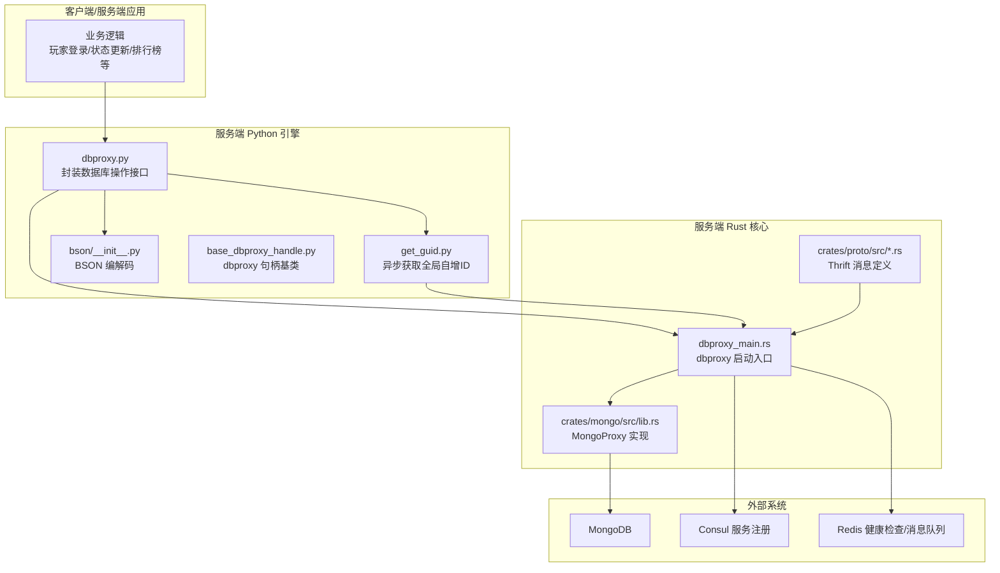
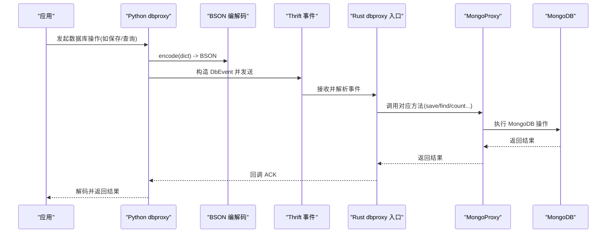
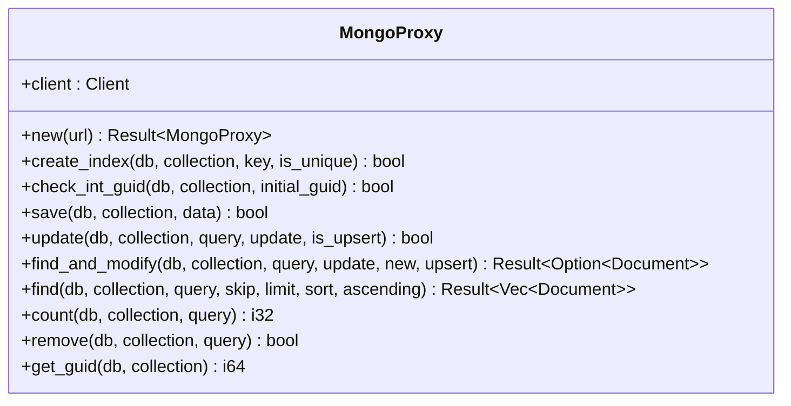
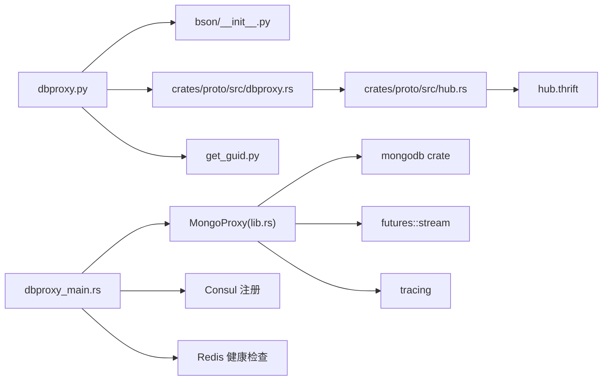

# MongoDB 集成

<cite>
**本文引用的文件**
- [lib.rs](file://crates/mongo/src/lib.rs)
- [dbproxy.py](file://server/engine/dbproxy.py)
- [dbproxy_main.rs](file://server/src/dbproxy_main.rs)
- [get_guid.py](file://server/engine/get_guid.py)
- [base_dbproxy_handle.py](file://server/engine/base_dbproxy_handle.py)
- [dbproxy.rs](file://crates/proto/src/dbproxy.rs)
- [hub.rs](file://crates/proto/src/hub.rs)
- [hub.thrift](file://crates/proto/proto/hub.thrift)
- [bson/__init__.py](file://server/engine/bson/__init__.py)
</cite>

## 目录
1. [简介](#简介)
2. [项目结构](#项目结构)
3. [核心组件](#核心组件)
4. [架构总览](#架构总览)
5. [详细组件分析](#详细组件分析)
6. [依赖关系分析](#依赖关系分析)
7. [性能考量](#性能考量)
8. [故障排查指南](#故障排查指南)
9. [结论](#结论)
10. [附录](#附录)

## 简介
本文件面向 geese 项目的 MongoDB 集成，系统性阐述 MongoProxy 的设计理念与实现细节，覆盖连接池管理、异步操作模式、错误处理机制，并对索引创建、数据保存、更新、查询、计数、删除等核心操作进行深入解析。同时，文档说明 BSON 文档的序列化与反序列化流程、GUID 生成机制以及分布式环境下的数据一致性保障策略，并提供在游戏服务器中存储玩家数据、游戏状态与配置信息的实际用法指引。

## 项目结构
MongoDB 集成由 Rust 层的 MongoProxy 提供核心能力，通过 Thrift 协议与服务端 dbproxy 进行通信；服务端 Python 层负责将业务请求编码为 BSON 并转发到 dbproxy；dbproxy 再调用 Rust 的 MongoProxy 执行具体数据库操作。

图表来源
- [dbproxy_main.rs:15-77](file://server/src/dbproxy_main.rs#L15-L77)
- [lib.rs:8-245](file://crates/mongo/src/lib.rs#L8-L245)
- [dbproxy.py:22-99](file://server/engine/dbproxy.py#L22-L99)
- [get_guid.py:9-28](file://server/engine/get_guid.py#L9-L28)
- [base_dbproxy_handle.py:3-15](file://server/engine/base_dbproxy_handle.py#L3-L15)
- [dbproxy.rs:866-962](file://crates/proto/src/dbproxy.rs#L866-L962)
- [hub.rs:2946-3077](file://crates/proto/src/hub.rs#L2946-L3077)
- [hub.thrift:244-292](file://crates/proto/proto/hub.thrift#L244-L292)

章节来源
- [dbproxy_main.rs:15-77](file://server/src/dbproxy_main.rs#L15-L77)
- [lib.rs:8-245](file://crates/mongo/src/lib.rs#L8-L245)
- [dbproxy.py:22-99](file://server/engine/dbproxy.py#L22-L99)
- [get_guid.py:9-28](file://server/engine/get_guid.py#L9-L28)
- [base_dbproxy_handle.py:3-15](file://server/engine/base_dbproxy_handle.py#L3-L15)
- [dbproxy.rs:866-962](file://crates/proto/src/dbproxy.rs#L866-L962)
- [hub.rs:2946-3077](file://crates/proto/src/hub.rs#L2946-L3077)
- [hub.thrift:244-292](file://crates/proto/proto/hub.thrift#L244-L292)

## 核心组件
- MongoProxy：Rust 层的数据库代理，封装 MongoDB 客户端并提供异步 CRUD 能力，支持索引创建、文档保存、更新、查询、计数、删除、查找并修改、GUID 获取等。
- dbproxy（Python）：为上层业务提供统一的数据库操作接口，负责将 Python 字典对象编码为 BSON，再通过 Thrift 事件发送给 dbproxy 服务端。
- dbproxy（Rust）：服务端入口，加载配置、注册健康检查、启动服务，接收来自 Python 层的数据库事件并调用 MongoProxy 执行。
- BSON 编解码：Python 层提供完整的 BSON 编解码工具，确保跨语言的数据交换类型安全。
- GUID 生成：基于 MongoDB 的原子自增字段，提供全局唯一自增 ID 的获取能力，满足分布式场景下的实体主键需求。

章节来源
- [lib.rs:8-245](file://crates/mongo/src/lib.rs#L8-L245)
- [dbproxy.py:22-99](file://server/engine/dbproxy.py#L22-L99)
- [dbproxy_main.rs:44-50](file://server/src/dbproxy_main.rs#L44-L50)
- [bson/__init__.py:18-55](file://server/engine/bson/__init__.py#L18-L55)

## 架构总览
下图展示了从应用层到数据库的完整链路：应用通过 Python 层的 dbproxy 接口发起请求，Python 将字典对象编码为 BSON，构造 Thrift 事件，发送至 dbproxy 服务端；服务端解析事件后调用 MongoProxy 执行数据库操作，最终返回结果并通过回调通知应用。

图表来源
- [dbproxy.py:34-63](file://server/engine/dbproxy.py#L34-L63)
- [dbproxy.rs:866-962](file://crates/proto/src/dbproxy.rs#L866-L962)
- [hub.rs:2946-3077](file://crates/proto/src/hub.rs#L2946-L3077)
- [lib.rs:56-209](file://crates/mongo/src/lib.rs#L56-L209)

章节来源
- [dbproxy.py:34-63](file://server/engine/dbproxy.py#L34-L63)
- [dbproxy.rs:866-962](file://crates/proto/src/dbproxy.rs#L866-L962)
- [hub.rs:2946-3077](file://crates/proto/src/hub.rs#L2946-L3077)
- [lib.rs:56-209](file://crates/mongo/src/lib.rs#L56-L209)

## 详细组件分析

### MongoProxy 设计与实现
- 结构体设计
  - 成员：持有 MongoDB 客户端实例，用于后续所有数据库操作。
- 异步模型
  - 所有数据库操作均以 async 方法暴露，内部使用 MongoDB Rust 驱动的异步 API，避免阻塞主线程。
- 错误处理
  - 对外统一返回布尔值或 Result 类型，内部捕获异常并记录日志，便于上层根据返回值判断操作是否成功。
- 关键方法概览
  - create_index：创建单字段唯一索引，支持唯一性约束。
  - save：将 BSON 文档插入集合。
  - update：按查询条件更新文档，支持 upsert。
  - find：按查询条件分页、排序查询，投影排除 _id。
  - count：统计匹配文档数量。
  - remove：批量删除匹配文档。
  - find_and_modify：原子更新并返回新旧文档。
  - get_guid：原子自增获取全局 GUID。
  - check_int_guid：初始化 GUID 计数器文档。

图表来源
- [lib.rs:8-245](file://crates/mongo/src/lib.rs#L8-L245)

章节来源
- [lib.rs:13-18](file://crates/mongo/src/lib.rs#L13-L18)
- [lib.rs:19-38](file://crates/mongo/src/lib.rs#L19-L38)
- [lib.rs:40-54](file://crates/mongo/src/lib.rs#L40-L54)
- [lib.rs:56-80](file://crates/mongo/src/lib.rs#L56-L80)
- [lib.rs:82-116](file://crates/mongo/src/lib.rs#L82-L116)
- [lib.rs:118-133](file://crates/mongo/src/lib.rs#L118-L133)
- [lib.rs:135-157](file://crates/mongo/src/lib.rs#L135-L157)
- [lib.rs:159-183](file://crates/mongo/src/lib.rs#L159-L183)
- [lib.rs:185-209](file://crates/mongo/src/lib.rs#L185-L209)
- [lib.rs:211-244](file://crates/mongo/src/lib.rs#L211-L244)

### 数据库操作方法详解

#### 索引创建 create_index
- 功能：为指定集合的某个字段创建单字段升序索引，可选唯一性约束。
- 流程：构建 IndexOptions 与 IndexModel，调用集合 create_index 异步执行。
- 返回：成功返回 true，失败记录错误并返回 false。

章节来源
- [lib.rs:19-38](file://crates/mongo/src/lib.rs#L19-L38)

#### 数据保存 save
- 功能：将 BSON 文档插入集合。
- 流程：从字节流读取 BSON 文档，调用 insert_one 插入。
- 返回：成功返回 true，失败记录错误并返回 false。

章节来源
- [lib.rs:56-80](file://crates/mongo/src/lib.rs#L56-L80)

#### 数据更新 update
- 功能：按查询条件更新文档，支持 upsert。
- 流程：从字节流读取查询与更新 BSON，调用 update_one(upsert)。
- 返回：成功返回 true，失败记录错误并返回 false。

章节来源
- [lib.rs:82-116](file://crates/mongo/src/lib.rs#L82-L116)

#### 数据查询 find
- 功能：按查询条件分页、排序查询，投影排除 _id。
- 流程：从字节流读取查询 BSON，设置 FindOptions（skip/limit/projection），按需排序，收集游标结果。
- 返回：成功返回文档向量，失败记录错误并返回空列表。

章节来源
- [lib.rs:135-157](file://crates/mongo/src/lib.rs#L135-L157)

#### 数量统计 count
- 功能：统计匹配文档数量。
- 流程：从字节流读取查询 BSON，调用 count_documents。
- 返回：成功返回数量，失败记录错误并返回 -1。

章节来源
- [lib.rs:159-183](file://crates/mongo/src/lib.rs#L159-L183)

#### 数据删除 remove
- 功能：删除匹配文档。
- 流程：从字节流读取查询 BSON，调用 delete_many。
- 返回：成功返回 true，失败记录错误并返回 false。

章节来源
- [lib.rs:185-209](file://crates/mongo/src/lib.rs#L185-L209)

#### 查找并修改 find_and_modify
- 功能：原子更新并返回新旧文档，支持 upsert。
- 流程：从字节流读取查询与更新 BSON，设置 ReturnDocument（Before/After），调用 find_one_and_update 并投影排除 _id。
- 返回：成功返回文档，失败记录错误并抛出异常。

章节来源
- [lib.rs:118-133](file://crates/mongo/src/lib.rs#L118-L133)

#### GUID 获取 get_guid
- 功能：原子自增获取全局 GUID。
- 流程：查询并更新计数器文档，返回更新前的值。
- 返回：成功返回 GUID，失败记录错误并返回 -1。

章节来源
- [lib.rs:211-244](file://crates/mongo/src/lib.rs#L211-L244)

### BSON 文档序列化与反序列化
- Python 层
  - encode：将 Python 字典对象编码为 BSON 字节流，用于跨语言传输。
  - decode/decode_all：将 BSON 字节流解码回 Python 对象。
  - 类型映射：明确 Python 类型与 BSON 类型的双向映射关系，确保类型安全。
- Rust 层
  - 通过 mongodb::bson::Document::from_reader 从字节流读取 BSON 文档。
  - 使用 projection(doc! {"_id": 0}) 在查询时默认排除 _id 字段，减少网络传输与存储冗余。

章节来源
- [dbproxy.py:34-63](file://server/engine/dbproxy.py#L34-L63)
- [bson/__init__.py:18-55](file://server/engine/bson/__init__.py#L18-L55)
- [lib.rs:62-63](file://crates/mongo/src/lib.rs#L62-L63)
- [lib.rs:145-146](file://crates/mongo/src/lib.rs#L145-L146)

### GUID 生成机制与一致性
- 初始化
  - check_int_guid：在目标集合写入计数器文档，键名约定为 GuidIndexKey，初始值为 initial_guid。
- 获取
  - get_guid：使用 find_one_and_update 原子自增计数器，返回更新前的值，作为全局唯一 GUID。
- 分布式一致性
  - MongoDB 原子操作保证单文档更新的一致性；通过独立集合存放计数器，避免热点冲突。
- Python 层集成
  - get_guid.py 通过 dbproxy 异步获取 GUID，内部使用 Future 等待回调，自动重试并切换 dbproxy 实例。

章节来源
- [lib.rs:40-54](file://crates/mongo/src/lib.rs#L40-L54)
- [lib.rs:211-244](file://crates/mongo/src/lib.rs#L211-L244)
- [get_guid.py:9-28](file://server/engine/get_guid.py#L9-L28)
- [base_dbproxy_handle.py:3-15](file://server/engine/base_dbproxy_handle.py#L3-L15)

### 游戏服务器典型用法
- 玩家数据
  - 使用 save 存储角色基础信息；使用 find 查询角色；使用 update 更新属性；使用 find_and_modify 原子变更并返回最新数据。
- 游戏状态
  - 使用 save 存储关卡进度；使用 count 统计关卡完成人数；使用 remove 清理过期状态。
- 配置信息
  - 使用 create_index 为配置项建立唯一索引；使用 find_and_modify 原子读取并更新配置。

章节来源
- [lib.rs:56-80](file://crates/mongo/src/lib.rs#L56-L80)
- [lib.rs:135-157](file://crates/mongo/src/lib.rs#L135-L157)
- [lib.rs:159-183](file://crates/mongo/src/lib.rs#L159-L183)
- [lib.rs:185-209](file://crates/mongo/src/lib.rs#L185-L209)
- [lib.rs:118-133](file://crates/mongo/src/lib.rs#L118-L133)

## 依赖关系分析
- Rust 层
  - 使用 mongodb crate 提供的 Client、IndexModel、Document、FindOptions 等类型。
  - 使用 futures::stream::TryStreamExt 收集游标结果。
  - 使用 tracing 记录 trace/error 日志。
- Thrift 协议
  - DbEvent/DbCallback 定义了 get_guid/create_object/update/find_and_modify/remove/get_object_info/get_object_count 等事件与回调。
  - hub.thrift 中定义了 ack_* 结构体，承载回调数据。
- Python 层
  - dbproxy.py 将 Python 字典 encode 为 BSON，构造 DbEvent 并发送。
  - get_guid.py 通过 dbproxy 异步获取 GUID，并自动处理 dbproxy 切换。

图表来源
- [lib.rs:1-6](file://crates/mongo/src/lib.rs#L1-L6)
- [dbproxy.py:22-99](file://server/engine/dbproxy.py#L22-L99)
- [get_guid.py:9-28](file://server/engine/get_guid.py#L9-L28)
- [dbproxy.rs:866-962](file://crates/proto/src/dbproxy.rs#L866-L962)
- [hub.rs:2946-3077](file://crates/proto/src/hub.rs#L2946-L3077)
- [hub.thrift:244-292](file://crates/proto/proto/hub.thrift#L244-L292)
- [dbproxy_main.rs:44-72](file://server/src/dbproxy_main.rs#L44-L72)

章节来源
- [lib.rs:1-6](file://crates/mongo/src/lib.rs#L1-L6)
- [dbproxy.py:22-99](file://server/engine/dbproxy.py#L22-L99)
- [get_guid.py:9-28](file://server/engine/get_guid.py#L9-L28)
- [dbproxy.rs:866-962](file://crates/proto/src/dbproxy.rs#L866-L962)
- [hub.rs:2946-3077](file://crates/proto/src/hub.rs#L2946-L3077)
- [hub.thrift:244-292](file://crates/proto/proto/hub.thrift#L244-L292)
- [dbproxy_main.rs:44-72](file://server/src/dbproxy_main.rs#L44-L72)

## 性能考量
- 连接池与并发
  - MongoDB Rust 驱动内置连接池与异步 I/O，MongoProxy 以 async 方法复用同一 Client，避免重复创建连接。
- 查询优化
  - 为高频查询字段建立合适索引（create_index），优先使用单字段索引，必要时使用复合索引。
  - 使用 projection 排除不必要的字段（如默认排除 _id），减少网络与内存开销。
  - 合理设置 skip/limit，避免全表扫描；对排序字段建立索引。
- 写入优化
  - 批量写入：将多个 insert/update 聚合为批量操作（如 insert_many、bulk_write）可显著提升吞吐。
  - upsert 使用：仅在确有需要时启用 upsert，避免不必要的文档写入。
- GUID 与热点
  - 将 GUID 计数器单独存放于独立集合，避免写入热点；若业务规模较大，可考虑分片计数器或预分配区间。
- 序列化成本
  - BSON 编解码在 Python 层完成，尽量减少中间对象拷贝；对大文档采用分批处理策略。

[本节为通用性能建议，不直接分析具体文件]

## 故障排查指南
- 常见错误与定位
  - save/update/find/count/remove 等方法内部均捕获异常并记录错误日志，可通过日志定位具体失败原因。
  - get_guid 返回 -1 或异常：检查计数器文档是否存在、字段名是否正确、权限是否允许更新。
- 超时与重试
  - Python 层的 get_guid 会自动重试并随机切换 dbproxy 实例，确保高可用。
- 网络与服务
  - dbproxy_main.rs 启动时注册 Consul 健康检查，可通过健康端点快速判断服务状态。

章节来源
- [lib.rs:67-78](file://crates/mongo/src/lib.rs#L67-L78)
- [lib.rs:111-115](file://crates/mongo/src/lib.rs#L111-L115)
- [lib.rs:178-182](file://crates/mongo/src/lib.rs#L178-L182)
- [lib.rs:196-208](file://crates/mongo/src/lib.rs#L196-L208)
- [lib.rs:224-243](file://crates/mongo/src/lib.rs#L224-L243)
- [get_guid.py:24-27](file://server/engine/get_guid.py#L24-L27)
- [dbproxy_main.rs:52-72](file://server/src/dbproxy_main.rs#L52-L72)

## 结论
geese 项目的 MongoDB 集成以 Rust 的 MongoProxy 为核心，结合 Python 层的 BSON 编解码与 Thrift 事件协议，实现了高性能、类型安全且易于扩展的数据库访问层。通过合理的索引策略、查询优化与 GUID 原子自增机制，能够满足游戏服务器对实时性与一致性的严格要求。建议在生产环境中配合连接池参数调优、索引监控与慢查询分析，持续优化整体性能。

[本节为总结性内容，不直接分析具体文件]

## 附录

### API 方法一览（路径参考）
- 创建索引：[create_index:19-38](file://crates/mongo/src/lib.rs#L19-L38)
- 保存文档：[save:56-80](file://crates/mongo/src/lib.rs#L56-L80)
- 更新文档：[update:82-116](file://crates/mongo/src/lib.rs#L82-L116)
- 查找并修改：[find_and_modify:118-133](file://crates/mongo/src/lib.rs#L118-L133)
- 查询文档：[find:135-157](file://crates/mongo/src/lib.rs#L135-L157)
- 统计数量：[count:159-183](file://crates/mongo/src/lib.rs#L159-L183)
- 删除文档：[remove:185-209](file://crates/mongo/src/lib.rs#L185-L209)
- 获取 GUID：[get_guid:211-244](file://crates/mongo/src/lib.rs#L211-L244)

### Thrift 事件与回调（路径参考）
- 事件定义：[DbEvent:866-962](file://crates/proto/src/dbproxy.rs#L866-L962)
- 回调定义：[DbCallback:2946-3077](file://crates/proto/src/hub.rs#L2946-L3077)
- ACK 结构：[hub.thrift:244-292](file://crates/proto/proto/hub.thrift#L244-L292)