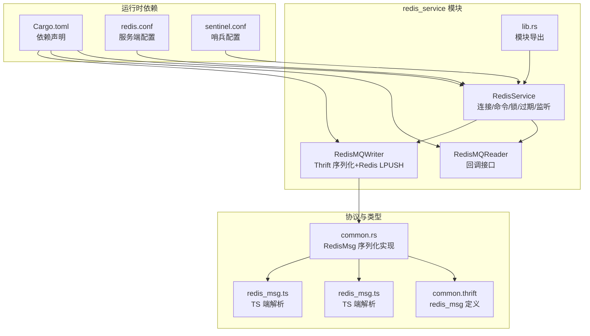
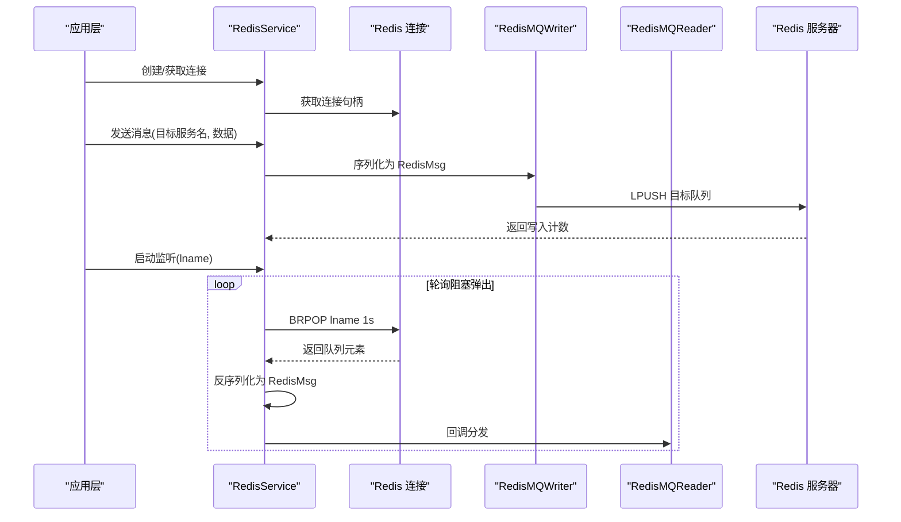
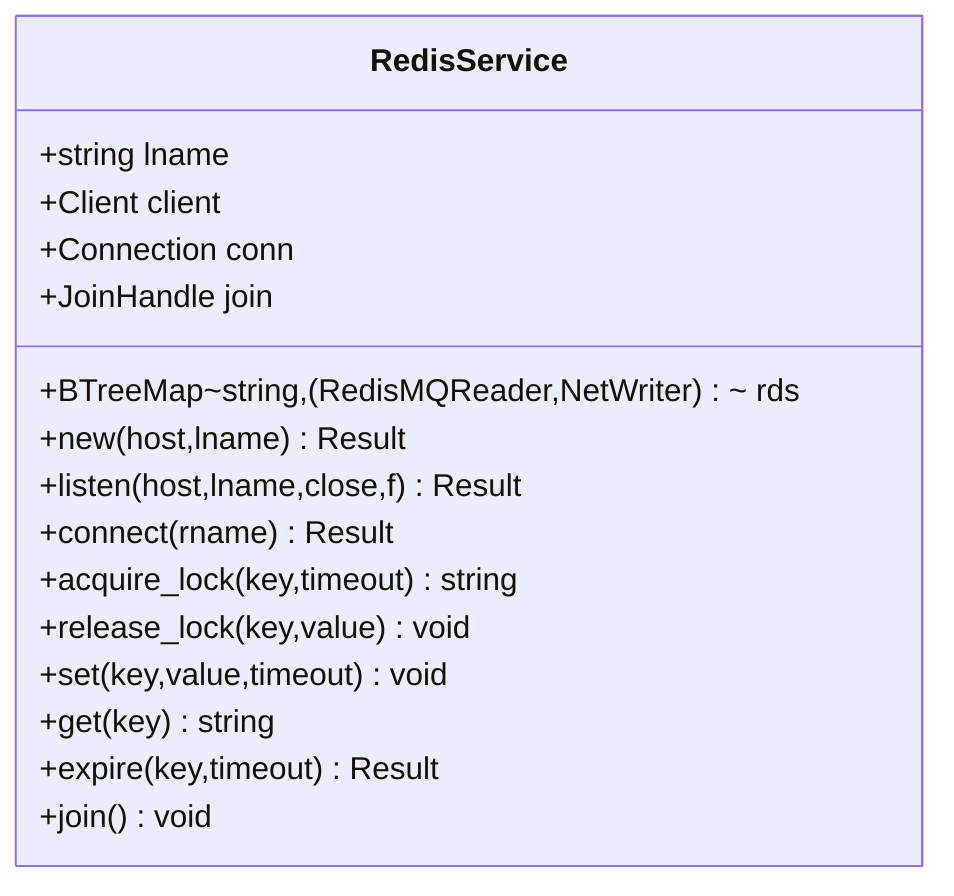
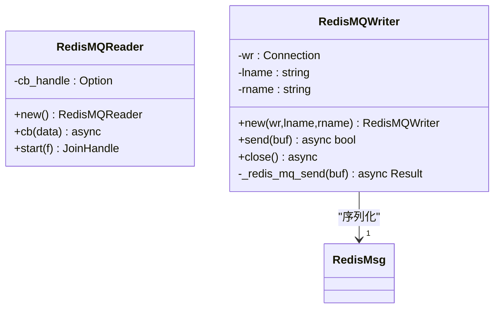
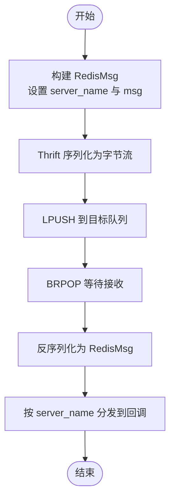
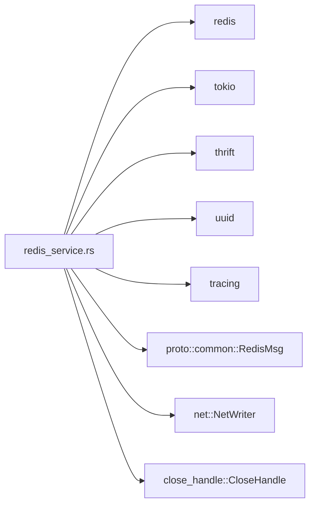

# Redis 缓存系统

<cite>
**本文引用的文件**
- [lib.rs](file://crates/redis_service/src/lib.rs)
- [redis_service.rs](file://crates/redis_service/src/redis_service.rs)
- [redis_mq_channel.rs](file://crates/redis_service/src/redis_mq_channel.rs)
- [Cargo.toml](file://crates/redis_service/Cargo.toml)
- [common.thrift](file://crates/proto/proto/common.thrift)
- [common.rs](file://crates/proto/src/common.rs)
- [redis_msg.ts](file://expand/ts/engine/proto/redis_msg.ts)
- [redis_msg.ts](file://gem/ccc/assets/script/serverSDK/engine/engine/proto/redis_msg.ts)
- [redis.conf](file://server/dependences/redis/redis.conf)
- [sentinel.conf](file://server/dependences/redis/sentinel.conf)
</cite>

## 目录
1. [简介](#简介)
2. [项目结构](#项目结构)
3. [核心组件](#核心组件)
4. [架构总览](#架构总览)
5. [详细组件分析](#详细组件分析)
6. [依赖关系分析](#依赖关系分析)
7. [性能考量](#性能考量)
8. [故障排查指南](#故障排查指南)
9. [结论](#结论)
10. [附录](#附录)

## 简介
本文件面向 geese 项目的 Redis 缓存与消息通道子系统，围绕 crates/redis_service 模块进行系统性技术文档整理。内容涵盖：
- RedisService 的架构设计与实现要点（连接管理、命令执行、结果处理）
- Redis MQ Channel 的消息队列实现（发布/订阅、序列化、可靠性保障）
- 缓存策略与可靠性（过期、锁、持久化与副本）
- 游戏服务器典型场景（会话、排行榜、配置、临时状态）
- 性能优化建议（键命名、数据结构、批量操作）
- 实际使用示例（实体管理、玩家登录、实时通信）
- 集群、哨兵与高可用部署方案

## 项目结构
该模块位于 crates/redis_service，核心由以下文件组成：
- lib.rs：导出模块入口
- redis_service.rs：RedisService 核心实现（连接、命令、锁、过期、监听）
- redis_mq_channel.rs：消息通道 Reader/Writer 实现（基于 Redis 列表的点对点通信）

图表来源
- [lib.rs:1-3](file://crates/redis_service/src/lib.rs#L1-L3)
- [redis_service.rs:36-42](file://crates/redis_service/src/redis_service.rs#L36-L42)
- [redis_mq_channel.rs:15-46](file://crates/redis_service/src/redis_mq_channel.rs#L15-L46)
- [Cargo.toml:8-17](file://crates/redis_service/Cargo.toml#L8-L17)
- [common.thrift:20-23](file://crates/proto/proto/common.thrift#L20-L23)
- [common.rs:284-333](file://crates/proto/src/common.rs#L284-L333)
- [redis_msg.ts:39-77](file://expand/ts/engine/proto/redis_msg.ts#L39-L77)
- [redis_msg.ts:39-77](file://gem/ccc/assets/script/serverSDK/engine/engine/proto/redis_msg.ts#L39-L77)
- [redis.conf:136-176](file://server/dependences/redis/redis.conf#L136-L176)
- [sentinel.conf:56-114](file://server/dependences/redis/sentinel.conf#L56-L114)

章节来源
- [lib.rs:1-3](file://crates/redis_service/src/lib.rs#L1-L3)
- [Cargo.toml:8-17](file://crates/redis_service/Cargo.toml#L8-L17)

## 核心组件
- RedisService：封装 Redis 连接、命令执行、分布式锁、键过期控制，并提供消息监听与连接管理能力。
- RedisMQReader/RedisMQWriter：基于 Redis 列表的轻量消息通道，负责消息序列化与发送。
- RedisMsg：跨语言/跨进程的消息载体，采用 Thrift 协议序列化。

章节来源
- [redis_service.rs:36-42](file://crates/redis_service/src/redis_service.rs#L36-L42)
- [redis_mq_channel.rs:15-46](file://crates/redis_service/src/redis_mq_channel.rs#L15-L46)
- [common.thrift:20-23](file://crates/proto/proto/common.thrift#L20-L23)

## 架构总览
下图展示了 RedisService 如何通过 Redis 连接执行命令、监听队列并分发消息，同时通过 Thrift 将消息序列化为二进制后写入 Redis 列表。

图表来源
- [redis_service.rs:65-155](file://crates/redis_service/src/redis_service.rs#L65-L155)
- [redis_mq_channel.rs:57-101](file://crates/redis_service/src/redis_mq_channel.rs#L57-L101)
- [common.rs:284-333](file://crates/proto/src/common.rs#L284-L333)

## 详细组件分析

### RedisService 组件
- 连接管理
  - 使用 Arc<Mutex<Client>> 和 Arc<Mutex<Connection>> 管理共享连接，避免多线程竞争。
  - 提供 new/listen/connect 三种入口，分别用于初始化、启动监听和建立点对点连接。
- 命令执行与结果处理
  - 提供 set/get/expire 等常用命令的异步封装，内部通过循环重试与连接重建保障可靠性。
  - 对异常进行日志记录并尝试重新获取连接，确保服务稳定性。
- 分布式锁
  - 使用 set_nx + expire 组合实现带过期时间的互斥锁；释放时校验持有者以避免误删。
- 键命名规范
  - 提供 create_lock_key/create_channel_key/create_host_cache_key 等工具函数，统一键前缀与格式。

图表来源
- [redis_service.rs:36-42](file://crates/redis_service/src/redis_service.rs#L36-L42)
- [redis_service.rs:49-304](file://crates/redis_service/src/redis_service.rs#L49-L304)

章节来源
- [redis_service.rs:49-304](file://crates/redis_service/src/redis_service.rs#L49-L304)

### Redis MQ Channel 组件
- RedisMQReader
  - 保存回调句柄，接收来自 Redis 的消息后触发回调。
  - 提供 start 方法注册回调并启动处理流程。
- RedisMQWriter
  - 将消息序列化为 RedisMsg，再通过 Thrift 输出协议写入缓冲区，最终以 LPUSH 写入目标队列。
  - 支持错误处理与日志记录，失败时返回 false 并记录错误信息。

图表来源
- [redis_mq_channel.rs:15-46](file://crates/redis_service/src/redis_mq_channel.rs#L15-L46)
- [redis_mq_channel.rs:48-106](file://crates/redis_service/src/redis_mq_channel.rs#L48-L106)
- [common.rs:284-333](file://crates/proto/src/common.rs#L284-L333)

章节来源
- [redis_mq_channel.rs:15-106](file://crates/redis_service/src/redis_mq_channel.rs#L15-L106)

### 消息序列化与跨语言互通
- RedisMsg 结构体定义了 server_name 与 msg 字段，分别承载目标服务名与二进制消息体。
- Rust 端通过 TCompactInputProtocol/TCompactOutputProtocol 进行读写。
- TS 端提供对应的解析逻辑，确保跨语言一致性。

图表来源
- [common.thrift:20-23](file://crates/proto/proto/common.thrift#L20-L23)
- [common.rs:284-333](file://crates/proto/src/common.rs#L284-L333)
- [redis_msg.ts:39-77](file://expand/ts/engine/proto/redis_msg.ts#L39-L77)
- [redis_msg.ts:39-77](file://gem/ccc/assets/script/serverSDK/engine/engine/proto/redis_msg.ts#L39-L77)

章节来源
- [common.thrift:20-23](file://crates/proto/proto/common.thrift#L20-L23)
- [common.rs:284-333](file://crates/proto/src/common.rs#L284-L333)
- [redis_msg.ts:39-77](file://expand/ts/engine/proto/redis_msg.ts#L39-L77)
- [redis_msg.ts:39-77](file://gem/ccc/assets/script/serverSDK/engine/engine/proto/redis_msg.ts#L39-L77)

### 键命名与数据结构选择
- 锁键：create_lock_key 规范化排序后拼接，避免冲突。
- 队列键：create_channel_key 为每个服务名生成唯一队列名。
- 数据结构：消息通道使用 Redis List（LPUSH/BRPOP），具备 FIFO、阻塞弹出等特性，适合轻量消息传递。

章节来源
- [redis_service.rs:19-34](file://crates/redis_service/src/redis_service.rs#L19-L34)
- [redis_mq_channel.rs:57-68](file://crates/redis_service/src/redis_mq_channel.rs#L57-L68)

## 依赖关系分析
- 外部库
  - redis：提供客户端、连接与命令执行能力
  - tokio：异步运行时，支持并发任务与超时
  - thrift：跨语言序列化协议
  - uuid：生成锁值
  - tracing：日志与追踪
- 内部模块
  - proto：RedisMsg 类型定义与序列化
  - net：网络读写接口
  - close_handle：关闭信号

图表来源
- [Cargo.toml:8-17](file://crates/redis_service/Cargo.toml#L8-L17)
- [redis_service.rs:1-17](file://crates/redis_service/src/redis_service.rs#L1-L17)

章节来源
- [Cargo.toml:8-17](file://crates/redis_service/Cargo.toml#L8-L17)

## 性能考量
- 连接复用与重试
  - 通过 Arc<Mutex<Connection>> 共享连接，减少握手开销；异常时自动重建连接。
- 批量与流水线
  - 当前实现逐条发送/接收；可考虑合并多次 LPUSH 或使用事务减少往返。
- 锁与过期
  - 锁使用 set_nx + expire 组合，避免死锁；建议设置合理的超时时间。
- 队列长度与内存
  - BRPOP 阻塞弹出避免轮询浪费 CPU；需关注队列长度与内存占用。
- 序列化成本
  - Thrift 序列化为二进制，体积小、解析快；注意字段大小限制与版本兼容。

[本节为通用指导，不直接分析具体文件]

## 故障排查指南
- 连接异常
  - 现象：命令执行报错或连接断开
  - 排查：检查 Redis 服务状态、网络连通性；确认监听循环是否正常退出
- 消息未达
  - 现象：BRPOP 无数据或反序列化失败
  - 排查：确认目标队列名一致、Thrift 版本匹配、消息体非空
- 锁冲突
  - 现象：acquire_lock 循环等待
  - 排查：检查锁键命名是否一致、过期时间是否合理、是否存在未释放锁

章节来源
- [redis_service.rs:84-146](file://crates/redis_service/src/redis_service.rs#L84-L146)
- [redis_mq_channel.rs:75-101](file://crates/redis_service/src/redis_mq_channel.rs#L75-L101)

## 结论
geese 的 Redis 缓存与消息通道子系统以 RedisService 为核心，结合 RedisMQReader/Writer 实现了轻量、可靠的跨服务通信与缓存能力。通过统一的键命名、Thrift 序列化与连接重试机制，系统在性能与稳定性之间取得平衡。建议在生产环境中结合集群/哨兵方案提升可用性，并根据业务场景优化键结构与批量操作策略。

[本节为总结性内容，不直接分析具体文件]

## 附录

### 游戏服务器典型应用场景
- 玩家会话缓存
  - 使用 set/get/expire 管理登录态与会话信息，设置合理过期时间。
- 实时排行榜
  - 使用有序集合或列表维护分数与排名，定期清理过期数据。
- 配置数据缓存
  - 将热配置加载至 Redis，通过过期刷新策略保持一致性。
- 临时状态存储
  - 使用短生命周期键存储临时状态，避免长期驻留内存。

[本节为概念性说明，不直接分析具体文件]

### 实际使用示例（路径指引）
- 实体管理
  - 在实体创建/销毁时，通过 RedisService 设置/删除键，或通过消息通道通知其他服务。
  - 参考路径：[redis_service.rs:250-283](file://crates/redis_service/src/redis_service.rs#L250-L283)
- 玩家登录
  - 登录成功后设置会话键并设定过期时间；登出时主动删除。
  - 参考路径：[redis_service.rs:250-283](file://crates/redis_service/src/redis_service.rs#L250-L283)
- 实时通信
  - 通过 RedisMQWriter 将消息序列化后 LPUSH 至目标队列；监听端 BRPOP 弹出并分发。
  - 参考路径：[redis_mq_channel.rs:75-101](file://crates/redis_service/src/redis_mq_channel.rs#L75-L101)，[redis_service.rs:93-145](file://crates/redis_service/src/redis_service.rs#L93-L145)

### 集群配置、哨兵模式与高可用部署
- Redis 配置
  - 网络绑定与端口、TCP backlog、超时与 keepalive 等参数可根据负载调整。
  - 参考路径：[redis.conf:55-176](file://server/dependences/redis/redis.conf#L55-L176)
- 哨兵配置
  - 监控主节点、设置超时阈值与故障转移策略，确保高可用。
  - 参考路径：[sentinel.conf:56-214](file://server/dependences/redis/sentinel.conf#L56-L214)
- 部署建议
  - 生产环境建议启用副本与持久化（RDB/AOF），并结合哨兵或 Redis Cluster 提升可用性与扩展性。

章节来源
- [redis.conf:55-176](file://server/dependences/redis/redis.conf#L55-L176)
- [sentinel.conf:56-214](file://server/dependences/redis/sentinel.conf#L56-L214)