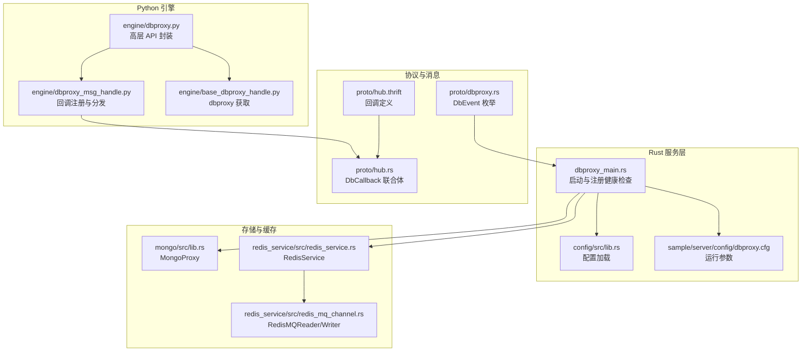
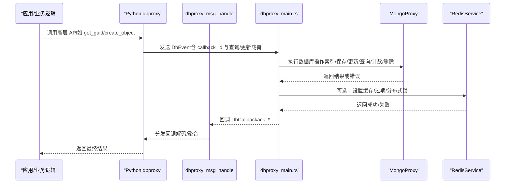
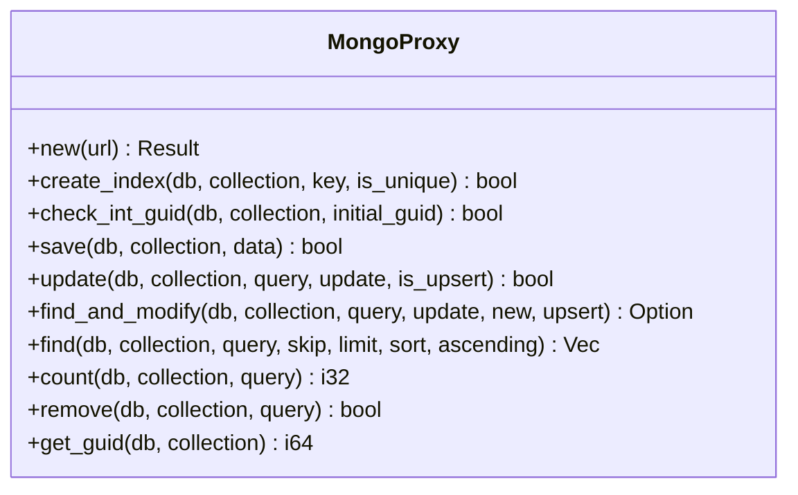
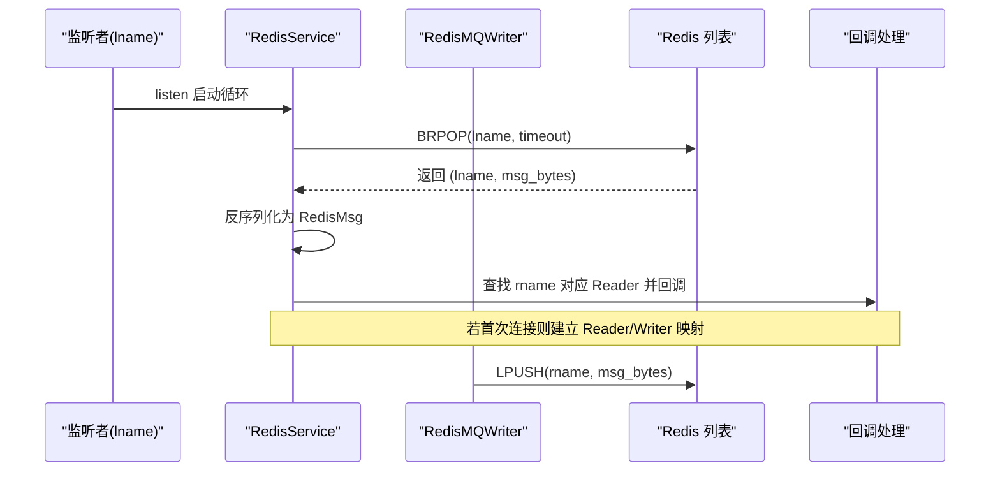
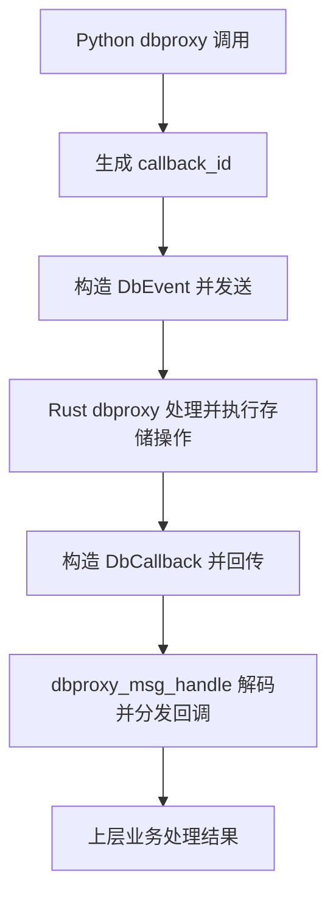
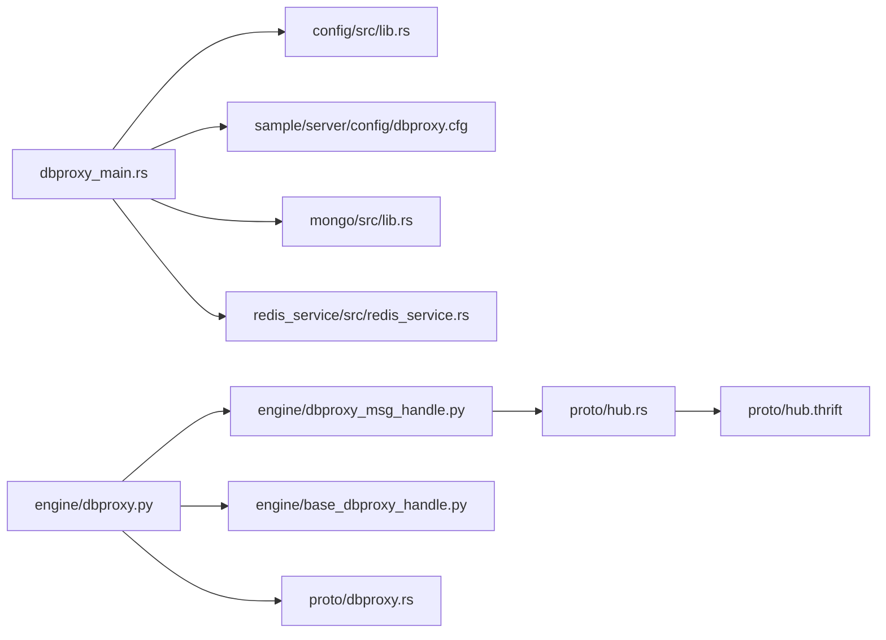

# 数据存储

<cite>
**本文引用的文件**
- [crates/mongo/src/lib.rs](file://crates/mongo/src/lib.rs)
- [crates/redis_service/src/redis_service.rs](file://crates/redis_service/src/redis_service.rs)
- [crates/redis_service/src/redis_mq_channel.rs](file://crates/redis_service/src/redis_mq_channel.rs)
- [crates/proto/src/dbproxy.rs](file://crates/proto/src/dbproxy.rs)
- [crates/proto/src/hub.rs](file://crates/proto/src/hub.rs)
- [crates/proto/proto/hub.thrift](file://crates/proto/proto/hub.thrift)
- [server/engine/dbproxy.py](file://server/engine/dbproxy.py)
- [server/engine/dbproxy_msg_handle.py](file://server/engine/dbproxy_msg_handle.py)
- [server/engine/base_dbproxy_handle.py](file://server/engine/base_dbproxy_handle.py)
- [server/src/dbproxy_main.rs](file://server/src/dbproxy_main.rs)
- [sample/server/config/dbproxy.cfg](file://sample/server/config/dbproxy.cfg)
- [crates/config/src/lib.rs](file://crates/config/src/lib.rs)
</cite>

## 目录
1. [简介](#简介)
2. [项目结构](#项目结构)
3. [核心组件](#核心组件)
4. [架构总览](#架构总览)
5. [详细组件分析](#详细组件分析)
6. [依赖分析](#依赖分析)
7. [性能考虑](#性能考虑)
8. [故障排查指南](#故障排查指南)
9. [结论](#结论)
10. [附录](#附录)

## 简介
本技术文档面向 geese 数据存储系统，聚焦于 MongoDB 文档数据库与 Redis 缓存的集成方案，涵盖连接池管理、查询优化与索引策略；深入解析 Redis 缓存系统（键值缓存、分布式锁、消息队列）的实现细节与运行机制；阐述从内存状态到数据库持久化的完整数据流；说明数据一致性保障（事务与冲突解决）、备份恢复、性能监控与容量规划；并提供数据迁移、版本升级与向后兼容的实践建议。目标读者为数据库管理员与后端开发者。

## 项目结构
geese 的数据存储由 Rust 实现的 dbproxy 服务作为统一入口，Python 引擎侧提供高层封装与回调管理，协议层通过 Thrift 定义跨语言通信契约，MongoDB 提供文档存储与自增 ID 支持，Redis 提供缓存、分布式锁与消息队列能力。

图表来源
- [server/src/dbproxy_main.rs:15-78](file://server/src/dbproxy_main.rs#L15-L78)
- [crates/config/src/lib.rs:1-13](file://crates/config/src/lib.rs#L1-L13)
- [sample/server/config/dbproxy.cfg:1-13](file://sample/server/config/dbproxy.cfg#L1-L13)
- [crates/proto/src/dbproxy.rs:866-876](file://crates/proto/src/dbproxy.rs#L866-L876)
- [crates/proto/src/hub.rs:2950-2960](file://crates/proto/src/hub.rs#L2950-L2960)
- [crates/proto/proto/hub.thrift:244-292](file://crates/proto/proto/hub.thrift#L244-L292)
- [server/engine/dbproxy.py:22-99](file://server/engine/dbproxy.py#L22-L99)
- [server/engine/dbproxy_msg_handle.py:5-82](file://server/engine/dbproxy_msg_handle.py#L5-L82)
- [server/engine/base_dbproxy_handle.py:3-15](file://server/engine/base_dbproxy_handle.py#L3-L15)
- [crates/mongo/src/lib.rs:8-245](file://crates/mongo/src/lib.rs#L8-L245)
- [crates/redis_service/src/redis_service.rs:36-304](file://crates/redis_service/src/redis_service.rs#L36-L304)
- [crates/redis_service/src/redis_mq_channel.rs:15-106](file://crates/redis_service/src/redis_mq_channel.rs#L15-L106)

章节来源
- [server/src/dbproxy_main.rs:15-78](file://server/src/dbproxy_main.rs#L15-L78)
- [crates/config/src/lib.rs:1-13](file://crates/config/src/lib.rs#L1-L13)
- [sample/server/config/dbproxy.cfg:1-13](file://sample/server/config/dbproxy.cfg#L1-L13)

## 核心组件
- MongoDB 集成：通过 MongoProxy 提供索引创建、GUID 自增、保存、更新、查找、计数、删除等操作，并支持 find_and_modify 原子性修改返回新/旧文档。
- Redis 缓存与锁：RedisService 提供键值缓存、过期控制、分布式互斥锁（基于 SET NX + GET + DEL），以及基于列表的点对点消息队列（BRPOP/LPUSH）。
- 消息通道：RedisMQReader/Writer 实现 NetReaderCallback/NetWriter 接口，承载 Thrift 序列化后的二进制消息在 Redis 中传输。
- 协议与回调：DbEvent/DbCallback 定义了 dbproxy 与 hub 之间的事件与应答契约，Python 层负责回调注册与结果分发。
- Python 封装：dbproxy 提供高层 API（如 get_guid/create_object/find_and_modify 等），dbproxy_msg_handle 负责回调映射与解码。

章节来源
- [crates/mongo/src/lib.rs:8-245](file://crates/mongo/src/lib.rs#L8-L245)
- [crates/redis_service/src/redis_service.rs:36-304](file://crates/redis_service/src/redis_service.rs#L36-L304)
- [crates/redis_service/src/redis_mq_channel.rs:15-106](file://crates/redis_service/src/redis_mq_channel.rs#L15-L106)
- [crates/proto/src/dbproxy.rs:866-876](file://crates/proto/src/dbproxy.rs#L866-L876)
- [crates/proto/src/hub.rs:2950-2960](file://crates/proto/src/hub.rs#L2950-L2960)
- [crates/proto/proto/hub.thrift:244-292](file://crates/proto/proto/hub.thrift#L244-L292)
- [server/engine/dbproxy.py:22-99](file://server/engine/dbproxy.py#L22-L99)
- [server/engine/dbproxy_msg_handle.py:5-82](file://server/engine/dbproxy_msg_handle.py#L5-L82)

## 架构总览
下图展示从应用调用到数据库与缓存的完整交互路径，包括 Python 层 API、Rust dbproxy、MongoDB 与 Redis 的协作关系。

图表来源
- [server/engine/dbproxy.py:29-66](file://server/engine/dbproxy.py#L29-L66)
- [crates/proto/src/dbproxy.rs:866-876](file://crates/proto/src/dbproxy.rs#L866-L876)
- [crates/proto/src/hub.rs:2950-2960](file://crates/proto/src/hub.rs#L2950-L2960)
- [crates/mongo/src/lib.rs:56-209](file://crates/mongo/src/lib.rs#L56-L209)
- [crates/redis_service/src/redis_service.rs:250-304](file://crates/redis_service/src/redis_service.rs#L250-L304)

## 详细组件分析

### MongoDB 组件分析（MongoProxy）
- 连接与初始化：通过连接字符串解析客户端选项并建立连接。
- 索引策略：支持唯一/非唯一索引创建，便于高频查询字段加速。
- GUID 管理：维护一个“自增索引”文档，使用 find_one_and_update 原子递增并返回旧值，确保多实例并发安全。
- 文档操作：支持保存、更新（upsert 可选）、查找（投影、排序、分页）、计数、删除。
- 原子修改：find_and_modify 支持返回新/旧文档，配合 upsert 控制插入行为。

图表来源
- [crates/mongo/src/lib.rs:8-245](file://crates/mongo/src/lib.rs#L8-L245)

章节来源
- [crates/mongo/src/lib.rs:19-54](file://crates/mongo/src/lib.rs#L19-L54)
- [crates/mongo/src/lib.rs:211-244](file://crates/mongo/src/lib.rs#L211-L244)
- [crates/mongo/src/lib.rs:56-209](file://crates/mongo/src/lib.rs#L56-L209)

### Redis 组件分析（RedisService 与消息队列）
- 键值缓存与过期：提供 set_ex/get/expire，具备断线重连与重试机制，确保高可用。
- 分布式锁：acquire_lock 使用 SET NX + EXPIRE，release_lock 使用 GET 比较值后 DEL，避免误删。
- 消息队列：listen 循环 BRPOP，收到消息后反序列化为 RedisMsg 并回调对应 rname 的 Reader；connect 动态建立 Reader/Writer 映射；Writer 通过 LPUSH 发送 Thrift 序列化后的二进制消息。

图表来源
- [crates/redis_service/src/redis_service.rs:65-155](file://crates/redis_service/src/redis_service.rs#L65-L155)
- [crates/redis_service/src/redis_mq_channel.rs:42-106](file://crates/redis_service/src/redis_mq_channel.rs#L42-L106)

章节来源
- [crates/redis_service/src/redis_service.rs:181-248](file://crates/redis_service/src/redis_service.rs#L181-L248)
- [crates/redis_service/src/redis_service.rs:250-304](file://crates/redis_service/src/redis_service.rs#L250-L304)
- [crates/redis_service/src/redis_mq_channel.rs:15-106](file://crates/redis_service/src/redis_mq_channel.rs#L15-L106)

### 协议与回调（DbEvent/DbCallback）
- DbEvent：定义了注册 Hub、获取 GUID、创建对象、更新对象、原子修改、删除对象、查询对象信息、统计对象数量等事件类型。
- DbCallback：定义了对应的应答联合体，包含各操作的结果载荷（如 GUID、布尔结果、对象二进制、计数、分页结束标记等）。
- Python 层：dbproxy 将高层 API 转换为 DbEvent，携带 callback_id；dbproxy_msg_handle 注册回调并在收到 ack_* 后解码并分发给上层。

图表来源
- [crates/proto/src/dbproxy.rs:866-876](file://crates/proto/src/dbproxy.rs#L866-L876)
- [crates/proto/src/hub.rs:2950-2960](file://crates/proto/src/hub.rs#L2950-L2960)
- [crates/proto/proto/hub.thrift:244-292](file://crates/proto/proto/hub.thrift#L244-L292)
- [server/engine/dbproxy.py:29-66](file://server/engine/dbproxy.py#L29-L66)
- [server/engine/dbproxy_msg_handle.py:40-79](file://server/engine/dbproxy_msg_handle.py#L40-L79)

章节来源
- [crates/proto/src/dbproxy.rs:766-876](file://crates/proto/src/dbproxy.rs#L766-L876)
- [crates/proto/src/hub.rs:2946-3002](file://crates/proto/src/hub.rs#L2946-L3002)
- [crates/proto/proto/hub.thrift:244-292](file://crates/proto/proto/hub.thrift#L244-L292)
- [server/engine/dbproxy.py:22-99](file://server/engine/dbproxy.py#L22-L99)
- [server/engine/dbproxy_msg_handle.py:5-82](file://server/engine/dbproxy_msg_handle.py#L5-L82)

### Python 引擎封装与回调管理
- dbproxy：提供高层 API（get_guid/create_object/update/find_and_modify/remove/get_object_count/get_object_info 等），内部以 UUID 生成 callback_id 并注册回调。
- dbproxy_msg_handle：维护各类回调字典，收到 ack_* 后进行解码与回调分发，并清理回调记录。
- base_dbproxy_handle：随机选择 dbproxy 服务实例，简化调用方逻辑。

章节来源
- [server/engine/dbproxy.py:22-99](file://server/engine/dbproxy.py#L22-L99)
- [server/engine/dbproxy_msg_handle.py:5-82](file://server/engine/dbproxy_msg_handle.py#L5-L82)
- [server/engine/base_dbproxy_handle.py:3-15](file://server/engine/base_dbproxy_handle.py#L3-L15)

## 依赖分析
- dbproxy_main.rs 依赖配置加载模块与 Consul 注册，启动健康检查服务，随后创建 DBProxyServer 并运行。
- dbproxy.py 依赖上下文与消息处理句柄，向上层暴露高层 API。
- MongoProxy 与 RedisService 分别依赖各自的客户端库，提供异步操作接口。
- 协议层（dbproxy.rs、hub.rs、hub.thrift）定义跨语言通信契约，Python 与 Rust 通过 Thrift 序列化/反序列化互通。

图表来源
- [server/src/dbproxy_main.rs:15-78](file://server/src/dbproxy_main.rs#L15-L78)
- [crates/config/src/lib.rs:1-13](file://crates/config/src/lib.rs#L1-L13)
- [sample/server/config/dbproxy.cfg:1-13](file://sample/server/config/dbproxy.cfg#L1-L13)
- [crates/mongo/src/lib.rs:8-245](file://crates/mongo/src/lib.rs#L8-L245)
- [crates/redis_service/src/redis_service.rs:36-304](file://crates/redis_service/src/redis_service.rs#L36-L304)
- [server/engine/dbproxy.py:22-99](file://server/engine/dbproxy.py#L22-L99)
- [server/engine/dbproxy_msg_handle.py:5-82](file://server/engine/dbproxy_msg_handle.py#L5-L82)
- [server/engine/base_dbproxy_handle.py:3-15](file://server/engine/base_dbproxy_handle.py#L3-L15)
- [crates/proto/src/dbproxy.rs:866-876](file://crates/proto/src/dbproxy.rs#L866-L876)
- [crates/proto/src/hub.rs:2950-2960](file://crates/proto/src/hub.rs#L2950-L2960)
- [crates/proto/proto/hub.thrift:244-292](file://crates/proto/proto/hub.thrift#L244-L292)

章节来源
- [server/src/dbproxy_main.rs:15-78](file://server/src/dbproxy_main.rs#L15-L78)
- [crates/config/src/lib.rs:1-13](file://crates/config/src/lib.rs#L1-L13)
- [sample/server/config/dbproxy.cfg:1-13](file://sample/server/config/dbproxy.cfg#L1-L13)

## 性能考虑
- MongoDB 查询优化
  - 索引策略：为高频过滤/排序字段创建单字段或复合索引，必要时启用唯一索引保证业务约束。
  - 投影与分页：默认移除 _id 字段减少网络开销；合理设置 skip/limit，避免深度分页导致的性能退化。
  - 原子修改：优先使用 find_and_modify 返回新/旧文档，减少二次读取。
- Redis 缓存与锁
  - 键值缓存：结合业务热点数据设置合理过期时间，避免内存膨胀。
  - 分布式锁：短持有时间 + 自动续期（可扩展）降低死锁风险；严格比对值再删除，防止误释放。
  - 消息队列：BRPOP 超时与重试间隔需平衡延迟与吞吐；LPUSH/RPOP 为 O(1)，适合高并发场景。
- 连接与并发
  - Rust 异步模型与 Tokio 任务调度提升并发能力；Python 层回调解耦，避免阻塞主线程。
- 监控与日志
  - 通过日志级别与 Jaeger 链路追踪定位瓶颈；结合健康检查端口进行存活探测。

## 故障排查指南
- MongoDB 相关
  - 插入/更新失败：检查 BSON 解析与集合权限；确认 upsert 参数是否符合预期。
  - 计数异常：确认查询条件是否正确解析；注意负数返回表示错误。
  - GUID 获取失败：检查 GuidIndexKey 文档是否存在且可更新。
- Redis 相关
  - set/get/expire 失败：自动重连与重试逻辑会尝试重建连接；若持续失败，检查 Redis 地址与认证。
  - 分布式锁：若 acquire 失败，检查锁键是否被其他实例持有；release 时比较值不一致会导致释放失败。
  - 消息队列：BRPOP 返回空表示超时或队列为空；确认 rname 与 lname 是否匹配。
- 协议与回调
  - 回调未触发：确认 callback_id 是否正确传递与注册；检查 ack_* 解码是否成功。
  - Python 层异常：查看 dbproxy_msg_handle 的回调字典是否被提前清理。

章节来源
- [crates/mongo/src/lib.rs:62-80](file://crates/mongo/src/lib.rs#L62-L80)
- [crates/mongo/src/lib.rs:165-183](file://crates/mongo/src/lib.rs#L165-L183)
- [crates/mongo/src/lib.rs:222-244](file://crates/mongo/src/lib.rs#L222-L244)
- [crates/redis_service/src/redis_service.rs:250-304](file://crates/redis_service/src/redis_service.rs#L250-L304)
- [crates/redis_service/src/redis_service.rs:181-248](file://crates/redis_service/src/redis_service.rs#L181-L248)
- [server/engine/dbproxy_msg_handle.py:40-79](file://server/engine/dbproxy_msg_handle.py#L40-L79)

## 结论
geese 的数据存储方案以 Rust dbproxy 为核心，结合 MongoDB 的文档模型与 Redis 的高性能缓存/锁/消息能力，形成稳定、可扩展的数据层。通过清晰的协议契约与 Python 封装，既满足高并发下的性能需求，又保持良好的可维护性。建议在生产环境中完善索引策略、缓存过期与监控告警，并制定数据备份与迁移计划以保障业务连续性。

## 附录
- 配置示例：dbproxy.cfg 包含 consul、健康检查端口、Redis/Mongo 连接串、GUID 初始化与索引配置项。
- 启动流程：dbproxy_main.rs 加载配置、初始化日志与健康检查、注册服务、启动 dbproxy 服务。

章节来源
- [sample/server/config/dbproxy.cfg:1-13](file://sample/server/config/dbproxy.cfg#L1-L13)
- [server/src/dbproxy_main.rs:15-78](file://server/src/dbproxy_main.rs#L15-L78)