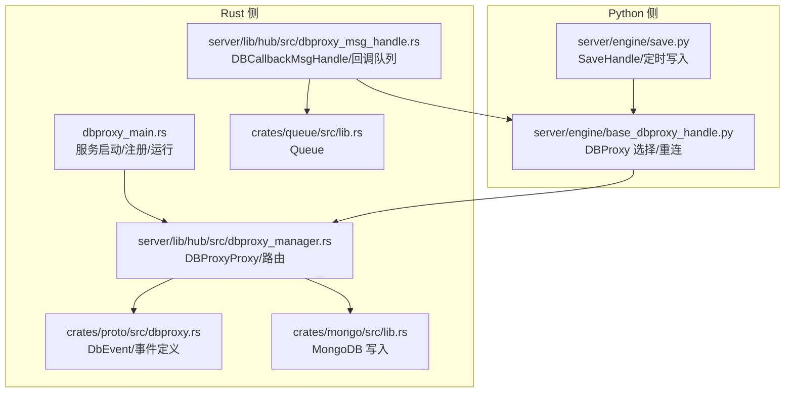
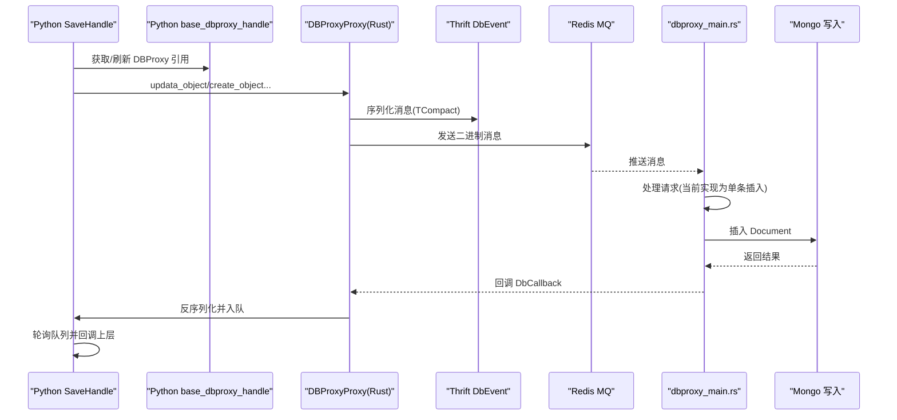
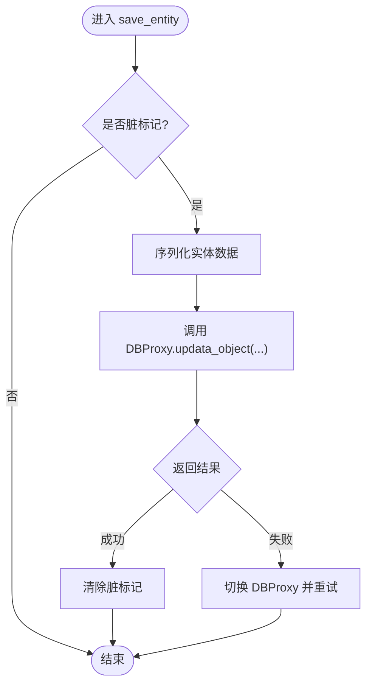
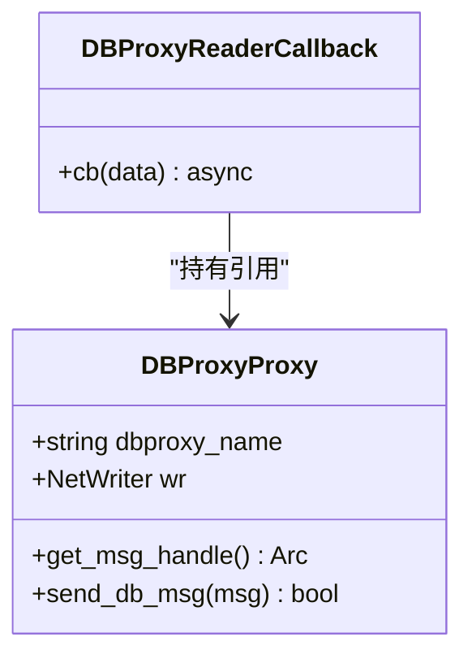
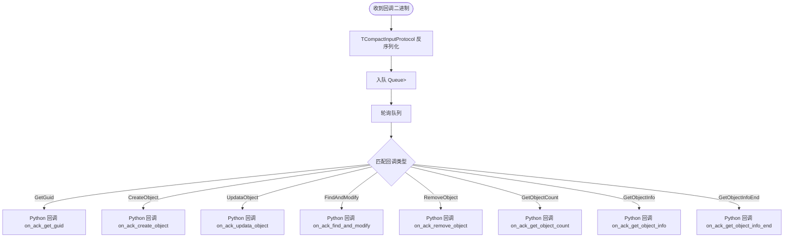
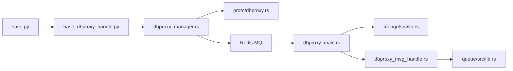

# 数据持久化流程

<cite>
**本文引用的文件**
- [server/src/dbproxy_main.rs](file://server/src/dbproxy_main.rs)
- [crates/proto/src/dbproxy.rs](file://crates/proto/src/dbproxy.rs)
- [server/lib/hub/src/dbproxy_manager.rs](file://server/lib/hub/src/dbproxy_manager.rs)
- [server/lib/hub/src/dbproxy_msg_handle.rs](file://server/lib/hub/src/dbproxy_msg_handle.rs)
- [crates/queue/src/lib.rs](file://crates/queue/src/lib.rs)
- [server/engine/save.py](file://server/engine/save.py)
- [server/engine/base_dbproxy_handle.py](file://server/engine/base_dbproxy_handle.py)
- [crates/proto/src/hub.rs](file://crates/proto/src/hub.rs)
- [crates/proto/proto/hub.thrift](file://crates/proto/proto/hub.thrift)
- [crates/proto/proto/common.thrift](file://crates/proto/proto/common.thrift)
- [crates/mongo/src/lib.rs](file://crates/mongo/src/lib.rs)
- [crates/close_handle/src/lib.rs](file://crates/close_handle/src/lib.rs)
</cite>

## 目录
1. [引言](#引言)
2. [项目结构](#项目结构)
3. [核心组件](#核心组件)
4. [架构总览](#架构总览)
5. [详细组件分析](#详细组件分析)
6. [依赖关系分析](#依赖关系分析)
7. [性能考量](#性能考量)
8. [故障排查指南](#故障排查指南)
9. [结论](#结论)
10. [附录](#附录)

## 引言
本文件面向 geese 项目的“数据持久化流程”，系统性梳理从内存状态到数据库存储的完整数据流：包括数据变更检测、批量写入与事务处理机制；深入解析 SaveHandle（Python 层）与 DBProxy（Rust 层）的协作方式；阐明队列系统在持久化中的作用（消息缓冲、优先级与背压控制）；给出数据一致性保障（ACID 事务、最终一致与冲突解决）与迁移升级策略；并提供性能监控与调优建议。

## 项目结构
围绕数据持久化，本项目的关键模块分布如下：
- Rust 后端入口与服务编排：dbproxy 主进程负责启动、注册健康检查、Consul 注册与运行循环。
- 协议与事件模型：通过 Thrift 自动生成的 dbproxy.rs/hub.rs 定义跨进程通信的消息体与回调类型。
- Hub 侧代理与消息处理：DBProxyProxy 负责连接与发送消息；DBCallbackMsgHandle 负责接收回调并入队分发。
- 队列系统：轻量队列用于回调消息的缓冲与顺序化处理。
- Python 持久化层：SaveHandle（save.py）负责实体状态变更检测与定时批量写入；base_dbproxy_handle 提供 DBProxy 选择与重连逻辑。
- 存储后端：mongo crate 提供 MongoDB 写入能力（单条插入）。

**图表来源**
- [server/src/dbproxy_main.rs:15-77](file://server/src/dbproxy_main.rs#L15-L77)
- [crates/proto/src/dbproxy.rs:878-919](file://crates/proto/src/dbproxy.rs#L878-L919)
- [server/lib/hub/src/dbproxy_manager.rs:86-121](file://server/lib/hub/src/dbproxy_manager.rs#L86-L121)
- [server/lib/hub/src/dbproxy_msg_handle.rs:27-93](file://server/lib/hub/src/dbproxy_msg_handle.rs#L27-L93)
- [crates/queue/src/lib.rs:3-21](file://crates/queue/src/lib.rs#L3-L21)
- [server/engine/save.py:17-53](file://server/engine/save.py#L17-L53)
- [server/engine/base_dbproxy_handle.py:3-15](file://server/engine/base_dbproxy_handle.py#L3-L15)
- [crates/mongo/src/lib.rs:56-80](file://crates/mongo/src/lib.rs#L56-L80)

**章节来源**
- [server/src/dbproxy_main.rs:15-77](file://server/src/dbproxy_main.rs#L15-L77)
- [crates/proto/src/dbproxy.rs:878-919](file://crates/proto/src/dbproxy.rs#L878-L919)
- [server/lib/hub/src/dbproxy_manager.rs:86-121](file://server/lib/hub/src/dbproxy_manager.rs#L86-L121)
- [server/lib/hub/src/dbproxy_msg_handle.rs:27-93](file://server/lib/hub/src/dbproxy_msg_handle.rs#L27-L93)
- [crates/queue/src/lib.rs:3-21](file://crates/queue/src/lib.rs#L3-L21)
- [server/engine/save.py:17-53](file://server/engine/save.py#L17-L53)
- [server/engine/base_dbproxy_handle.py:3-15](file://server/engine/base_dbproxy_handle.py#L3-L15)
- [crates/mongo/src/lib.rs:56-80](file://crates/mongo/src/lib.rs#L56-L80)

## 核心组件
- SaveHandle（Python）
  - 通过装饰器标记实体的数据库与集合信息。
  - 维护脏标记与定时器，周期性触发批量更新。
  - 回调中根据结果决定是否清除脏标记或切换 DBProxy 并重试。
- DBProxyProxy（Rust）
  - 基于 Redis MQ 通道建立与 dbproxy 的长连接。
  - 使用 Thrift TCompact 协议序列化消息并通过 NetWriter 发送。
  - 支持随机选择可用 dbproxy 实例，具备基本容错。
- DBCallbackMsgHandle（Rust）
  - 接收来自 dbproxy 的回调消息，反序列化为 DbCallback 枚举。
  - 将回调入队，由轮询函数按序分发至 Python 回调。
- Queue（Rust）
  - 简易双端队列，支持入队与出队，作为回调缓冲区。
- Mongo 写入（Rust）
  - 将二进制 BSON 文档解析为 MongoDB Document 后执行插入。
  - 当前实现为单条插入，未见批量写入或事务封装。

**章节来源**
- [server/engine/save.py:17-53](file://server/engine/save.py#L17-L53)
- [server/engine/save.py:63-81](file://server/engine/save.py#L63-L81)
- [server/engine/base_dbproxy_handle.py:3-15](file://server/engine/base_dbproxy_handle.py#L3-L15)
- [server/lib/hub/src/dbproxy_manager.rs:86-121](file://server/lib/hub/src/dbproxy_manager.rs#L86-L121)
- [server/lib/hub/src/dbproxy_msg_handle.rs:27-93](file://server/lib/hub/src/dbproxy_msg_handle.rs#L27-L93)
- [crates/queue/src/lib.rs:3-21](file://crates/queue/src/lib.rs#L3-L21)
- [crates/mongo/src/lib.rs:56-80](file://crates/mongo/src/lib.rs#L56-L80)

## 架构总览
下图展示从实体状态变更到数据库落盘的端到端流程，以及各组件之间的交互关系。

**图表来源**
- [server/engine/save.py:42-52](file://server/engine/save.py#L42-L52)
- [server/engine/base_dbproxy_handle.py:12-15](file://server/engine/base_dbproxy_handle.py#L12-L15)
- [server/lib/hub/src/dbproxy_manager.rs:105-121](file://server/lib/hub/src/dbproxy_manager.rs#L105-L121)
- [crates/proto/src/dbproxy.rs:878-919](file://crates/proto/src/dbproxy.rs#L878-L919)
- [server/src/dbproxy_main.rs:44-72](file://server/src/dbproxy_main.rs#L44-L72)
- [crates/mongo/src/lib.rs:56-80](file://crates/mongo/src/lib.rs#L56-L80)
- [server/lib/hub/src/dbproxy_msg_handle.rs:51-71](file://server/lib/hub/src/dbproxy_msg_handle.rs#L51-L71)

## 详细组件分析

### SaveHandle（Python）：数据变更检测与异步持久化
- 脏标记与定时器
  - set_dirty 触发定时器，周期性调用 save_entity。
  - 回调中若成功则清除脏标记；失败则切换 DBProxy 并重试。
- 创建/加载流程
  - load_or_create_entity 先查询，不存在则创建并调用 create_object，失败时重试。
- 与 DBProxy 的交互
  - 通过 base_dbproxy_handle 获取/刷新 DBProxy 引用，确保连接可用。
  - 调用 updata_object/create_object 等接口发起持久化请求。

**图表来源**
- [server/engine/save.py:28-53](file://server/engine/save.py#L28-L53)
- [server/engine/save.py:35-41](file://server/engine/save.py#L35-L41)
- [server/engine/save.py:54-62](file://server/engine/save.py#L54-L62)
- [server/engine/save.py:63-81](file://server/engine/save.py#L63-L81)

**章节来源**
- [server/engine/save.py:17-53](file://server/engine/save.py#L17-L53)
- [server/engine/save.py:63-81](file://server/engine/save.py#L63-L81)
- [server/engine/base_dbproxy_handle.py:3-15](file://server/engine/base_dbproxy_handle.py#L3-L15)

### DBProxyProxy（Rust）：消息序列化与写入队列管理
- 连接与路由
  - 通过 Consul 查询 dbproxy 服务列表，随机选择实例并建立 Redis MQ 通道。
  - 已存在的连接复用，避免重复握手。
- 序列化与发送
  - 使用 TBufferChannel + TCompactOutputProtocol 将 DbEvent 序列化为二进制。
  - 通过 NetWriter 发送，支持异步发送。
- 错误与重试
  - 连接失败时移除该实例并继续尝试其他实例。
  - 上层 SaveHandle 在回调失败时可触发重新选择 DBProxy 并重试。

**图表来源**
- [server/lib/hub/src/dbproxy_manager.rs:86-121](file://server/lib/hub/src/dbproxy_manager.rs#L86-L121)
- [server/lib/hub/src/dbproxy_manager.rs:123-140](file://server/lib/hub/src/dbproxy_manager.rs#L123-L140)

**章节来源**
- [server/lib/hub/src/dbproxy_manager.rs:25-84](file://server/lib/hub/src/dbproxy_manager.rs#L25-L84)
- [server/lib/hub/src/dbproxy_manager.rs:86-121](file://server/lib/hub/src/dbproxy_manager.rs#L86-L121)
- [server/lib/hub/src/dbproxy_manager.rs:123-140](file://server/lib/hub/src/dbproxy_manager.rs#L123-L140)

### DBCallbackMsgHandle（Rust）：回调队列与分发
- 反序列化
  - 使用 TBufferChannel + TCompactInputProtocol 将二进制回调反序列化为 DbCallback。
- 入队与轮询
  - 将 DbCallback 入队，由轮询函数按序分发到对应 Python 回调方法。
- 支持的回调类型
  - 包括 GetGuid、CreateObject、UpdataObject、FindAndModify、RemoveObject、GetObjectCount、GetObjectInfo、GetObjectInfoEnd。

**图表来源**
- [server/lib/hub/src/dbproxy_msg_handle.rs:31-38](file://server/lib/hub/src/dbproxy_msg_handle.rs#L31-L38)
- [server/lib/hub/src/dbproxy_msg_handle.rs:47-93](file://server/lib/hub/src/dbproxy_msg_handle.rs#L47-L93)
- [crates/proto/src/hub.rs:2950-2960](file://crates/proto/src/hub.rs#L2950-L2960)
- [crates/proto/proto/hub.thrift:283-292](file://crates/proto/proto/hub.thrift#L283-L292)

**章节来源**
- [server/lib/hub/src/dbproxy_msg_handle.rs:27-93](file://server/lib/hub/src/dbproxy_msg_handle.rs#L27-L93)
- [crates/proto/src/hub.rs:2950-2960](file://crates/proto/src/hub.rs#L2950-L2960)
- [crates/proto/proto/hub.thrift:244-292](file://crates/proto/proto/hub.thrift#L244-L292)

### 队列系统：消息缓冲、优先级与背压控制
- Queue<T>
  - 使用 VecDeque 实现 FIFO 缓冲，支持高并发下的回调聚合。
  - 作为 DBCallbackMsgHandle 的内部队列，避免回调风暴导致的阻塞。
- 优先级与背压
  - 当前实现未显式区分优先级；可通过扩展队列结构（如多级队列或多路复用）实现。
  - 背压主要通过队列长度与轮询频率控制，建议结合业务设置阈值与限速。

**章节来源**
- [crates/queue/src/lib.rs:3-21](file://crates/queue/src/lib.rs#L3-L21)
- [server/lib/hub/src/dbproxy_msg_handle.rs:28-49](file://server/lib/hub/src/dbproxy_msg_handle.rs#L28-L49)

### 事务与一致性：现状与建议
- 现状
  - MongoDB 写入为单条 insert_one，未见批量写入或事务封装。
  - 回调基于 RPC/消息回传，未见强一致的分布式事务协议。
- 建议
  - 批量写入：将多个 updata_object 聚合为批量插入，减少网络往返。
  - 事务：对需要强一致性的复合写入，引入 MongoDB 会话事务或外部协调（如两阶段提交）。
  - 最终一致：对非关键路径采用最终一致，通过幂等与去重策略保证一致性。
  - 冲突解决：对同一实体的并发写入，采用时间戳/版本号或乐观锁策略。

**章节来源**
- [crates/mongo/src/lib.rs:56-80](file://crates/mongo/src/lib.rs#L56-L80)

### 数据迁移与版本升级
- 结构变更
  - 通过版本字段或 schema 版本号标识数据结构版本，在读取时做向后兼容转换。
- 无停机策略
  - 渐进式发布：先在新旧结构共存期间完成数据迁移，再切换默认读写路径。
  - 双写校验：在迁移期间同时写入新旧格式，校验一致性后再清理旧格式。
- 回滚预案
  - 保留旧格式读取路径与迁移脚本，必要时快速回滚。

[本节为通用实践建议，无需特定文件引用]

## 依赖关系分析
- 组件耦合
  - Python SaveHandle 依赖 base_dbproxy_handle 选择 DBProxy；DBProxyProxy 依赖 Redis MQ 通道与 Thrift 协议。
  - DBCallbackMsgHandle 依赖 Queue<T> 与 Thrift DbCallback 枚举。
- 外部依赖
  - Consul 用于服务发现；Redis 用于消息通道；MongoDB 作为存储后端。
- 循环依赖
  - 未见直接循环依赖；消息方向为单向（请求→dbproxy→Mongo），回调方向为单向（Mongo→dbproxy→Hub→Python）。

**图表来源**
- [server/engine/save.py:17-53](file://server/engine/save.py#L17-L53)
- [server/engine/base_dbproxy_handle.py:3-15](file://server/engine/base_dbproxy_handle.py#L3-L15)
- [server/lib/hub/src/dbproxy_manager.rs:86-121](file://server/lib/hub/src/dbproxy_manager.rs#L86-L121)
- [crates/proto/src/dbproxy.rs:878-919](file://crates/proto/src/dbproxy.rs#L878-L919)
- [server/src/dbproxy_main.rs:44-72](file://server/src/dbproxy_main.rs#L44-L72)
- [crates/mongo/src/lib.rs:56-80](file://crates/mongo/src/lib.rs#L56-L80)
- [server/lib/hub/src/dbproxy_msg_handle.rs:27-93](file://server/lib/hub/src/dbproxy_msg_handle.rs#L27-L93)
- [crates/queue/src/lib.rs:3-21](file://crates/queue/src/lib.rs#L3-L21)

**章节来源**
- [server/engine/save.py:17-53](file://server/engine/save.py#L17-L53)
- [server/engine/base_dbproxy_handle.py:3-15](file://server/engine/base_dbproxy_handle.py#L3-L15)
- [server/lib/hub/src/dbproxy_manager.rs:86-121](file://server/lib/hub/src/dbproxy_manager.rs#L86-L121)
- [crates/proto/src/dbproxy.rs:878-919](file://crates/proto/src/dbproxy.rs#L878-L919)
- [server/src/dbproxy_main.rs:44-72](file://server/src/dbproxy_main.rs#L44-L72)
- [crates/mongo/src/lib.rs:56-80](file://crates/mongo/src/lib.rs#L56-L80)
- [server/lib/hub/src/dbproxy_msg_handle.rs:27-93](file://server/lib/hub/src/dbproxy_msg_handle.rs#L27-L93)
- [crates/queue/src/lib.rs:3-21](file://crates/queue/src/lib.rs#L3-L21)

## 性能考量
- 写入延迟
  - 序列化开销：TCompact 协议较紧凑，适合高频写入；注意大对象的序列化成本。
  - 网络往返：单条 insert_one 无事务，延迟较低；批量写入可显著降低 RTT。
- 吞吐量优化
  - 批量聚合：将多个 updata_object 聚合成一次批量写入。
  - 并发控制：限制每秒写入次数与队列长度，防止过载。
- 存储空间管理
  - 合理设置 TTL 与索引，定期清理历史数据。
  - 对大字段使用压缩或外部存储（如 GridFS）。

[本节提供通用指导，无需特定文件引用]

## 故障排查指南
- 常见问题
  - DBProxy 不可用：检查 Consul 服务发现与 Redis MQ 通道；确认 DBProxyProxy 是否成功建立连接。
  - 回调丢失：检查 DBCallbackMsgHandle 的入队与轮询逻辑；确认 Python 回调是否被正确调用。
  - 写入失败：检查 mongo crate 的插入结果与异常日志；确认 BSON 文档格式正确。
- 关键定位点
  - 日志级别：提升 tracing 与 error 日志以捕获序列化/网络/存储异常。
  - 健康检查：dbproxy_main.rs 中的健康服务与 Consul 注册，确保服务存活。
  - 关闭信号：close_handle 提供 SIGTERM 处理，避免强制退出导致数据不一致。

**章节来源**
- [server/src/dbproxy_main.rs:40-72](file://server/src/dbproxy_main.rs#L40-L72)
- [crates/close_handle/src/lib.rs:1-24](file://crates/close_handle/src/lib.rs#L1-L24)
- [crates/mongo/src/lib.rs:56-80](file://crates/mongo/src/lib.rs#L56-L80)
- [server/lib/hub/src/dbproxy_msg_handle.rs:51-71](file://server/lib/hub/src/dbproxy_msg_handle.rs#L51-L71)

## 结论
geese 的数据持久化以“Python SaveHandle + Rust DBProxy”为核心，通过 Thrift 消息与 Redis MQ 实现解耦；回调经由队列缓冲与顺序化分发，满足高并发下的稳定性需求。当前实现以单条写入为主，建议在保持现有架构不变的前提下，逐步引入批量写入与事务封装，并完善版本迁移与一致性策略，以进一步提升可靠性与性能。

## 附录
- 关键协议与消息
  - DbEvent/DbCallback：定义了注册、GUID、创建、更新、查找修改、删除、计数、分页等事件与回调。
  - RedisMsg：通用 Redis 消息载体，可用于跨服务广播或通知。
- 配置与启动
  - dbproxy_main.rs 负责加载配置、初始化日志、健康检查与 Consul 注册，随后进入运行与等待循环。

**章节来源**
- [crates/proto/src/dbproxy.rs:878-919](file://crates/proto/src/dbproxy.rs#L878-L919)
- [crates/proto/src/hub.rs:2950-2960](file://crates/proto/src/hub.rs#L2950-L2960)
- [crates/proto/proto/common.thrift:20-23](file://crates/proto/proto/common.thrift#L20-L23)
- [server/src/dbproxy_main.rs:15-77](file://server/src/dbproxy_main.rs#L15-L77)