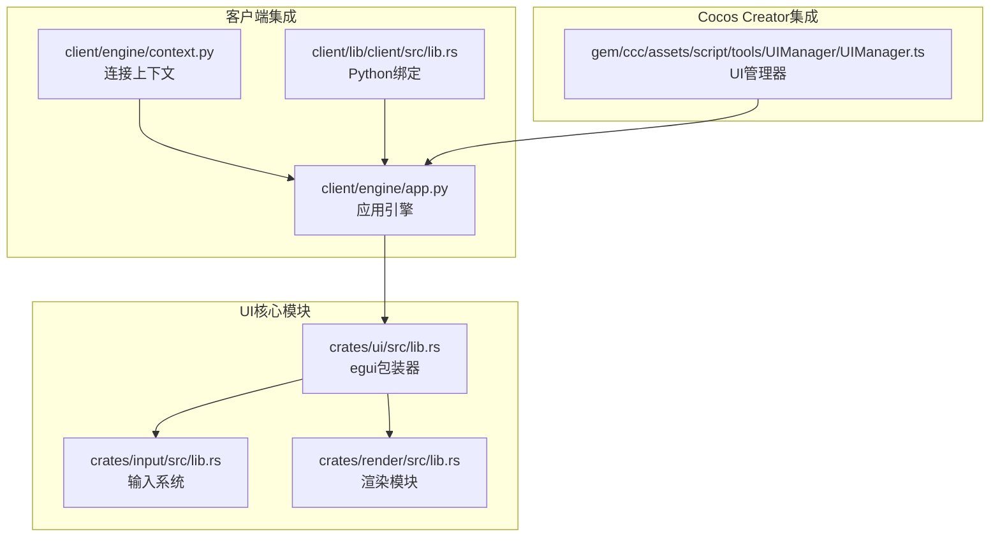
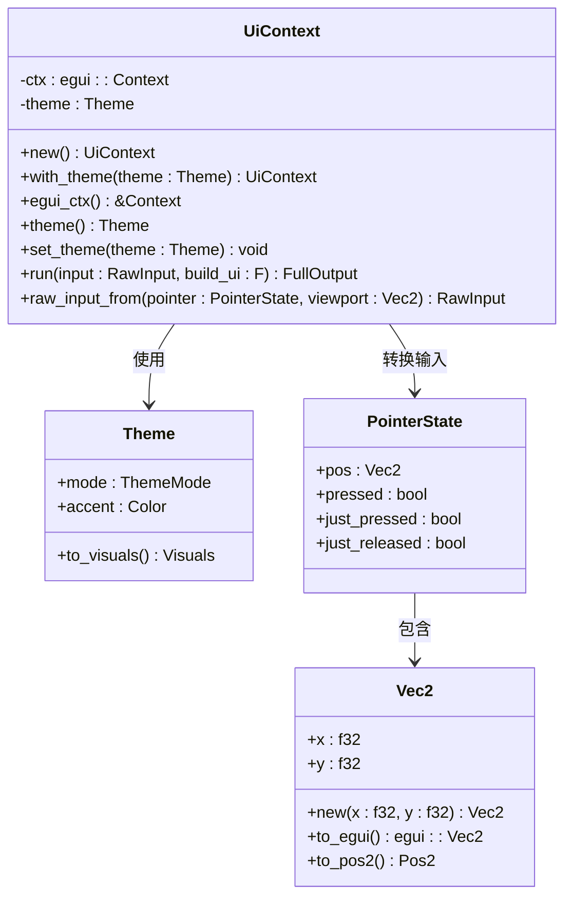
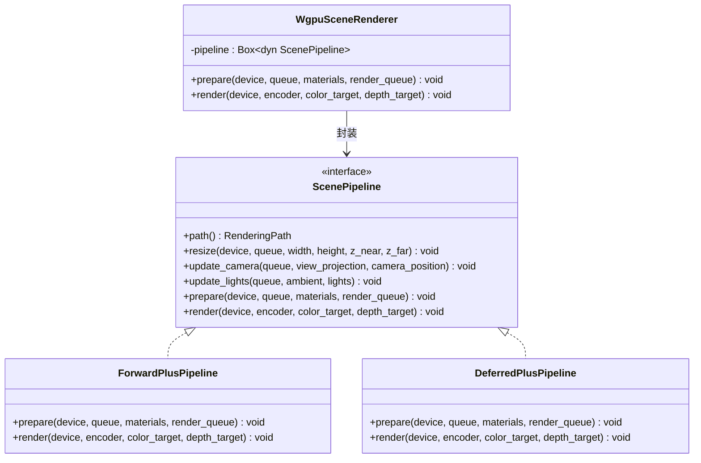
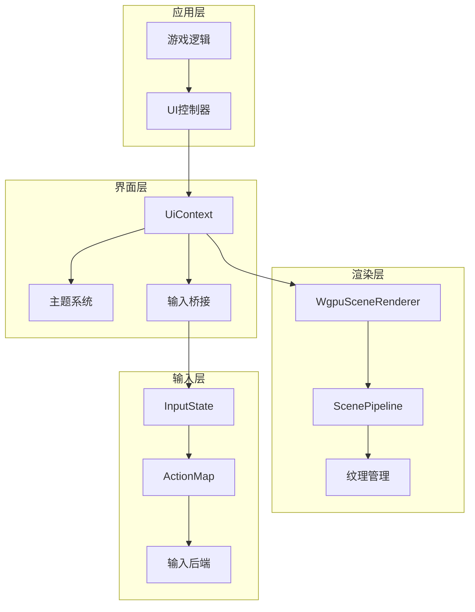
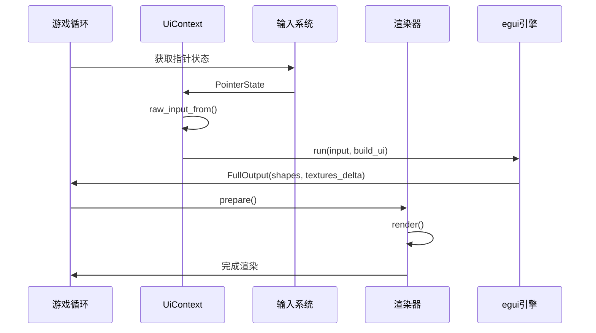
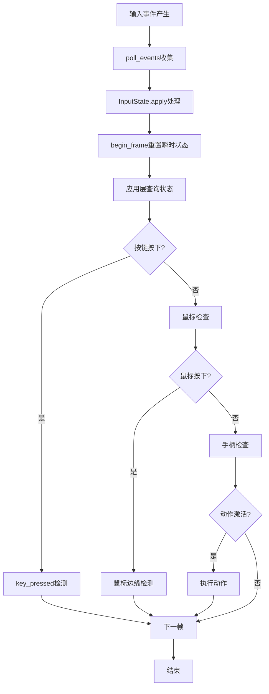
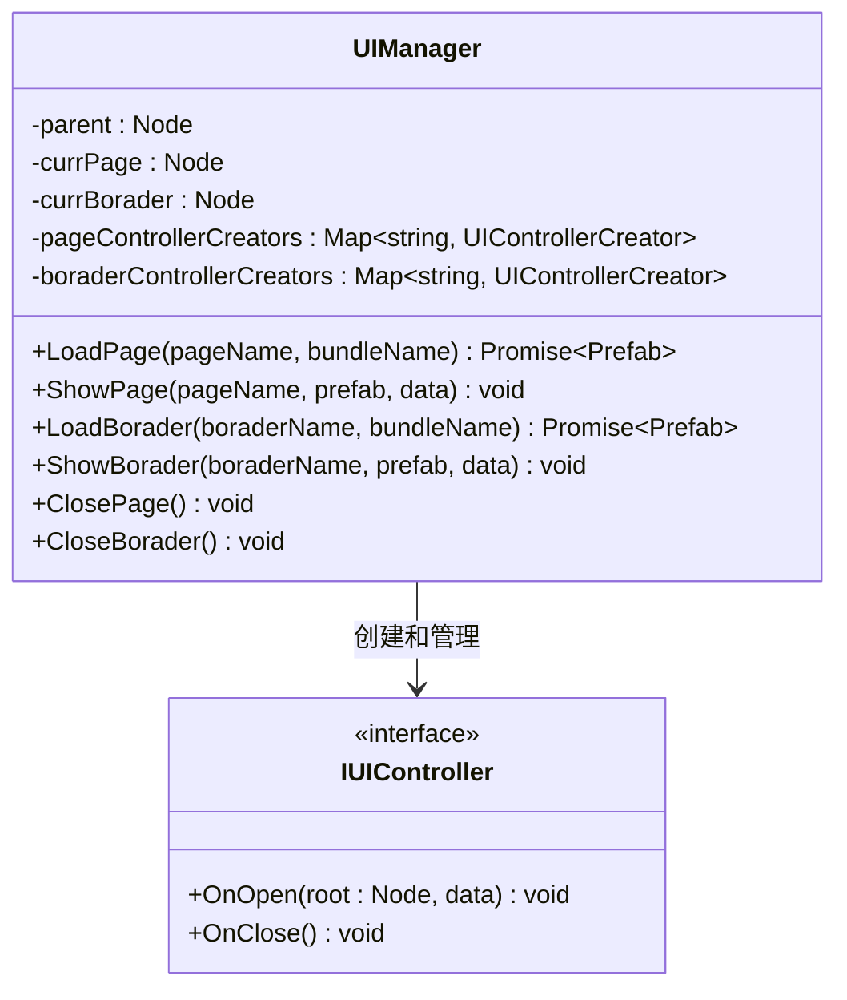
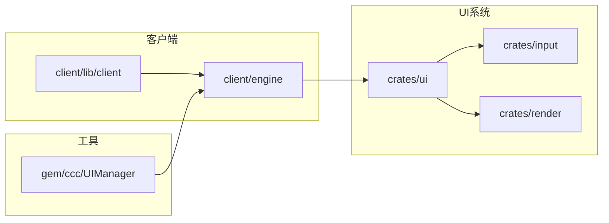

# 用户界面系统

<cite>
**本文档引用的文件**
- [crates/ui/src/lib.rs](file://crates/ui/src/lib.rs)
- [crates/input/src/lib.rs](file://crates/input/src/lib.rs)
- [crates/render/src/lib.rs](file://crates/render/src/lib.rs)
- [crates/render/src/wgpu_renderer.rs](file://crates/render/src/wgpu_renderer.rs)
- [crates/render/src/common.rs](file://crates/render/src/common.rs)
- [crates/render/src/pipeline.rs](file://crates/render/src/pipeline.rs)
- [gem/ccc/assets/script/tools/UIManager/UIManager.ts](file://gem/ccc/assets/script/tools/UIManager/UIManager.ts)
- [client/engine/app.py](file://client/engine/app.py)
- [client/engine/context.py](file://client/engine/context.py)
- [client/lib/client/src/lib.rs](file://client/lib/client/src/lib.rs)
</cite>

## 目录
1. [简介](#简介)
2. [项目结构](#项目结构)
3. [核心组件](#核心组件)
4. [架构概览](#架构概览)
5. [详细组件分析](#详细组件分析)
6. [依赖关系分析](#依赖关系分析)
7. [性能考虑](#性能考虑)
8. [故障排除指南](#故障排除指南)
9. [结论](#结论)

## 简介

用户界面系统是整个游戏引擎的重要组成部分，负责处理用户交互、渲染UI元素以及管理各种界面组件。该系统采用模块化设计，主要基于egui即时模式UI库构建，同时提供了灵活的输入处理机制和高效的渲染管道。

系统的核心特点包括：
- 基于egui的即时模式UI框架
- 解耦的输入处理系统
- 支持多种渲染后端
- 组件化的UI管理器
- 跨平台兼容性

## 项目结构

用户界面系统分布在多个crate和工具模块中，形成了完整的UI解决方案：



**图表来源**
- [crates/ui/src/lib.rs:1-290](file://crates/ui/src/lib.rs#L1-L290)
- [crates/input/src/lib.rs:1-395](file://crates/input/src/lib.rs#L1-L395)
- [crates/render/src/lib.rs:1-49](file://crates/render/src/lib.rs#L1-L49)

**章节来源**
- [crates/ui/src/lib.rs:1-290](file://crates/ui/src/lib.rs#L1-L290)
- [crates/input/src/lib.rs:1-395](file://crates/input/src/lib.rs#L1-L395)
- [crates/render/src/lib.rs:1-49](file://crates/render/src/lib.rs#L1-L49)

## 核心组件

### UI上下文管理器

UI系统的核心是`UiContext`结构体，它提供了对egui上下文的薄包装，管理主题设置并协调UI渲染流程。



**图表来源**
- [crates/ui/src/lib.rs:144-216](file://crates/ui/src/lib.rs#L144-L216)
- [crates/ui/src/lib.rs:112-134](file://crates/ui/src/lib.rs#L112-L134)
- [crates/ui/src/lib.rs:94-99](file://crates/ui/src/lib.rs#L94-L99)
- [crates/ui/src/lib.rs:31-49](file://crates/ui/src/lib.rs#L31-L49)

### 输入系统架构

输入系统提供了统一的输入事件抽象，支持键盘、鼠标和手柄输入，并确保与具体平台库的解耦。

```mermaid
classDiagram
class InputState {
-keys_down : HashSet~KeyCode~
-keys_pressed_this_frame : HashSet~KeyCode~
-mouse_buttons_down : HashSet~MouseButton~
-mouse_pos : (f32, f32)
-mouse_delta : (f32, f32)
+begin_frame() void
+apply(event : &InputEvent) void
+is_key_down(k : KeyCode) bool
+key_pressed(k : KeyCode) bool
+mouse_position() (f32, f32)
+scroll_delta() (f32, f32)
}
class InputEvent {
<<enumeration>>
KeyPressed(KeyCode)
MouseMoved {x : f32, y : f32, dx : f32, dy : f32}
MouseButtonPressed(MouseButton)
Scroll {dx : f32, dy : f32}
GamepadButtonPressed {id : u32, button : GamepadButton}
}
class ActionMap {
-bindings : HashMap~String, Vec~InputBinding~~
+bind(action : String, binding : InputBinding) void
+is_active(action : &str, state : &InputState) bool
}
InputState --> InputEvent : 处理
ActionMap --> InputState : 查询
```

**图表来源**
- [crates/input/src/lib.rs:115-243](file://crates/input/src/lib.rs#L115-L243)
- [crates/input/src/lib.rs:87-104](file://crates/input/src/lib.rs#L87-L104)
- [crates/input/src/lib.rs:279-312](file://crates/input/src/lib.rs#L279-L312)

### 渲染管道集成

渲染系统提供了灵活的渲染管道选择，支持Forward+和Deferred+两种渲染路径。



**图表来源**
- [crates/render/src/wgpu_renderer.rs:62-135](file://crates/render/src/wgpu_renderer.rs#L62-L135)
- [crates/render/src/pipeline.rs:66-88](file://crates/render/src/pipeline.rs#L66-L88)
- [crates/render/src/wgpu_renderer.rs:10-13](file://crates/render/src/wgpu_renderer.rs#L10-L13)

**章节来源**
- [crates/ui/src/lib.rs:144-216](file://crates/ui/src/lib.rs#L144-L216)
- [crates/input/src/lib.rs:115-243](file://crates/input/src/lib.rs#L115-L243)
- [crates/render/src/wgpu_renderer.rs:62-135](file://crates/render/src/wgpu_renderer.rs#L62-L135)

## 架构概览

用户界面系统采用分层架构设计，确保各组件之间的松耦合和高内聚性：



**图表来源**
- [crates/ui/src/lib.rs:144-216](file://crates/ui/src/lib.rs#L144-L216)
- [crates/render/src/wgpu_renderer.rs:62-135](file://crates/render/src/wgpu_renderer.rs#L62-L135)
- [crates/input/src/lib.rs:115-243](file://crates/input/src/lib.rs#L115-L243)

## 详细组件分析

### UI上下文执行流程

UI系统的执行流程展示了从输入到渲染的完整过程：



**图表来源**
- [crates/ui/src/lib.rs:180-215](file://crates/ui/src/lib.rs#L180-L215)
- [crates/ui/src/lib.rs:188-215](file://crates/ui/src/lib.rs#L188-L215)

### 输入事件处理流程

输入系统的事件处理展示了从原始输入到应用层的状态更新过程：



**图表来源**
- [crates/input/src/lib.rs:148-198](file://crates/input/src/lib.rs#L148-L198)
- [crates/input/src/lib.rs:138-145](file://crates/input/src/lib.rs#L138-L145)

### Cocos Creator UI管理器

Cocos Creator集成提供了页面和边框的管理功能：



**图表来源**
- [gem/ccc/assets/script/tools/UIManager/UIManager.ts:12-187](file://gem/ccc/assets/script/tools/UIManager/UIManager.ts#L12-L187)

**章节来源**
- [crates/ui/src/lib.rs:180-215](file://crates/ui/src/lib.rs#L180-L215)
- [crates/input/src/lib.rs:148-198](file://crates/input/src/lib.rs#L148-L198)
- [gem/ccc/assets/script/tools/UIManager/UIManager.ts:12-187](file://gem/ccc/assets/script/tools/UIManager/UIManager.ts#L12-L187)

## 依赖关系分析

用户界面系统的依赖关系展现了清晰的模块化架构：



**图表来源**
- [crates/ui/src/lib.rs:1-290](file://crates/ui/src/lib.rs#L1-L290)
- [crates/input/src/lib.rs:1-395](file://crates/input/src/lib.rs#L1-L395)
- [crates/render/src/lib.rs:1-49](file://crates/render/src/lib.rs#L1-L49)

### 关键依赖特性

1. **UI系统独立性**：UI模块不直接依赖具体渲染后端，通过抽象接口与渲染系统解耦
2. **输入系统可扩展性**：支持多种输入后端，包括Winit和Gilrs
3. **渲染系统灵活性**：支持Forward+和Deferred+两种渲染路径
4. **跨平台兼容性**：提供Python绑定和TypeScript集成

**章节来源**
- [crates/ui/src/lib.rs:17-21](file://crates/ui/src/lib.rs#L17-L21)
- [crates/input/src/lib.rs:1-18](file://crates/input/src/lib.rs#L1-L18)
- [crates/render/src/lib.rs:16-48](file://crates/render/src/lib.rs#L16-L48)

## 性能考虑

用户界面系统在设计时充分考虑了性能优化：

### 渲染优化策略

1. **即时模式UI优势**：egui的即时模式避免了复杂的UI状态管理开销
2. **纹理管理优化**：使用RGBA8格式减少内存占用
3. **批处理渲染**：合并相似的渲染命令提高GPU效率

### 内存管理

- **零拷贝设计**：尽量避免不必要的数据复制
- **智能缓存**：利用egui的内置缓存机制
- **资源复用**：纹理和着色器资源的重复使用

### 并发处理

- **线程安全**：使用Arc<Mutex<T>>确保多线程安全
- **异步加载**：UI资源的异步加载避免阻塞主线程

## 故障排除指南

### 常见问题及解决方案

#### UI主题问题
- **症状**：UI主题不生效或显示异常
- **原因**：主题设置未正确应用到egui上下文
- **解决**：检查`set_theme`方法调用和`to_visuals`转换

#### 输入响应问题
- **症状**：鼠标点击无响应或按键识别错误
- **原因**：InputState状态未正确更新
- **解决**：验证`apply`方法的事件处理和`begin_frame`的调用时机

#### 渲染性能问题
- **症状**：UI渲染卡顿或帧率下降
- **原因**：过多的UI元素或复杂布局
- **解决**：优化UI层次结构，减少不必要的重绘

**章节来源**
- [crates/ui/src/lib.rs:270-289](file://crates/ui/src/lib.rs#L270-L289)
- [crates/input/src/lib.rs:318-395](file://crates/input/src/lib.rs#L318-L395)

## 结论

用户界面系统通过模块化设计实现了高度的灵活性和可扩展性。其核心优势包括：

1. **解耦设计**：UI、输入和渲染系统相互独立，便于维护和测试
2. **跨平台支持**：提供多种集成方式，适应不同的开发环境
3. **性能优化**：采用即时模式UI和高效的渲染管道
4. **易于使用**：简洁的API设计降低了使用门槛

该系统为游戏开发提供了强大的UI基础设施，支持从简单的HUD到复杂的全屏界面的各种需求。通过合理的架构设计和性能优化，能够满足现代游戏对UI系统的高性能要求。