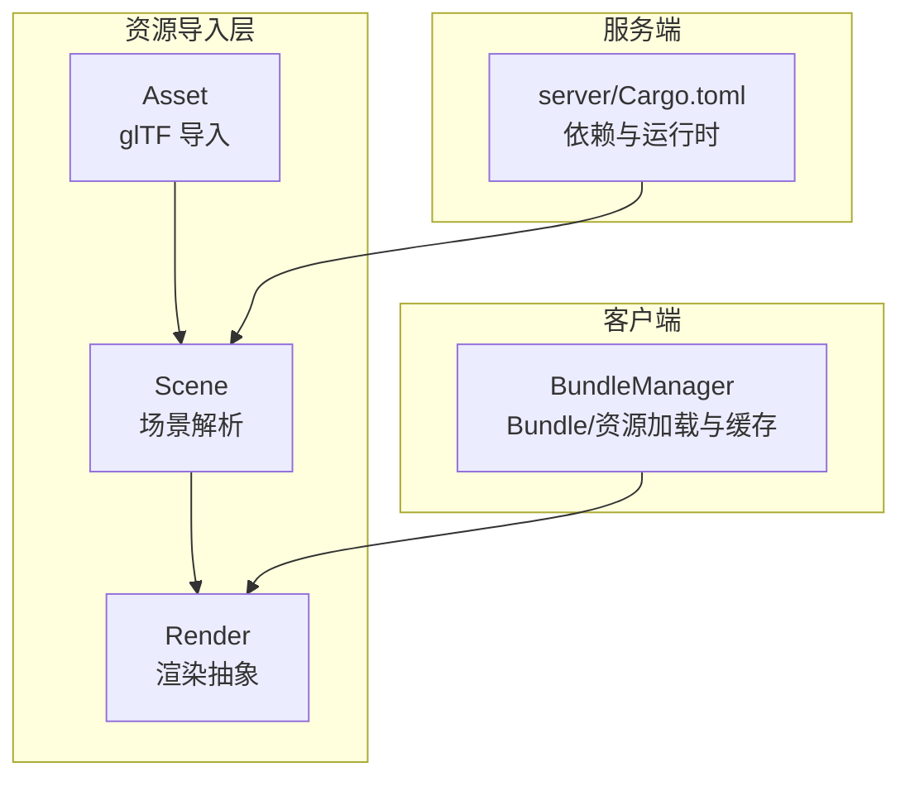
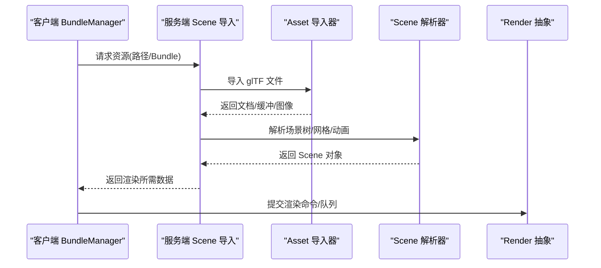
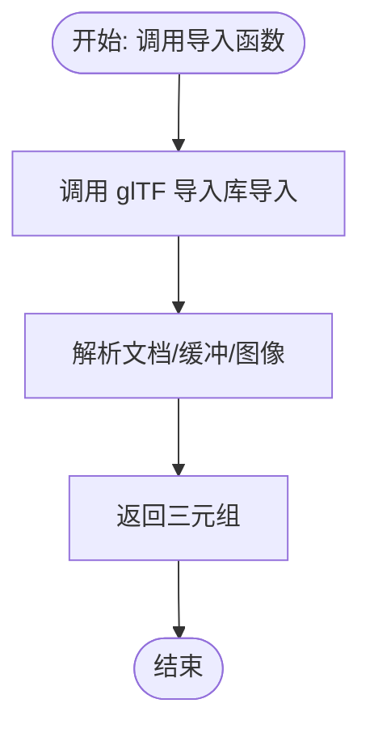
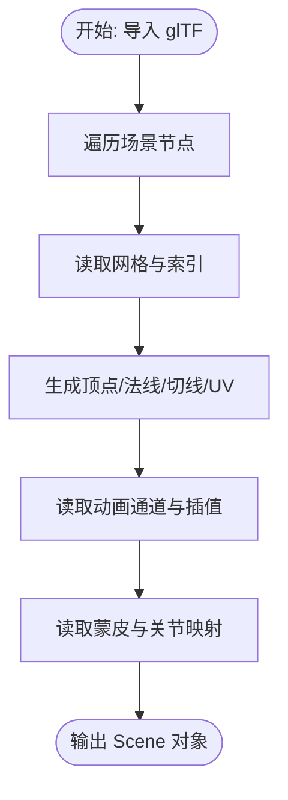
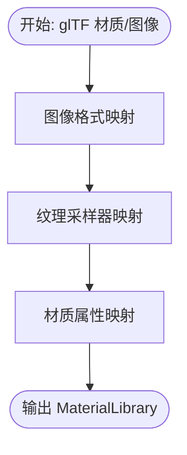
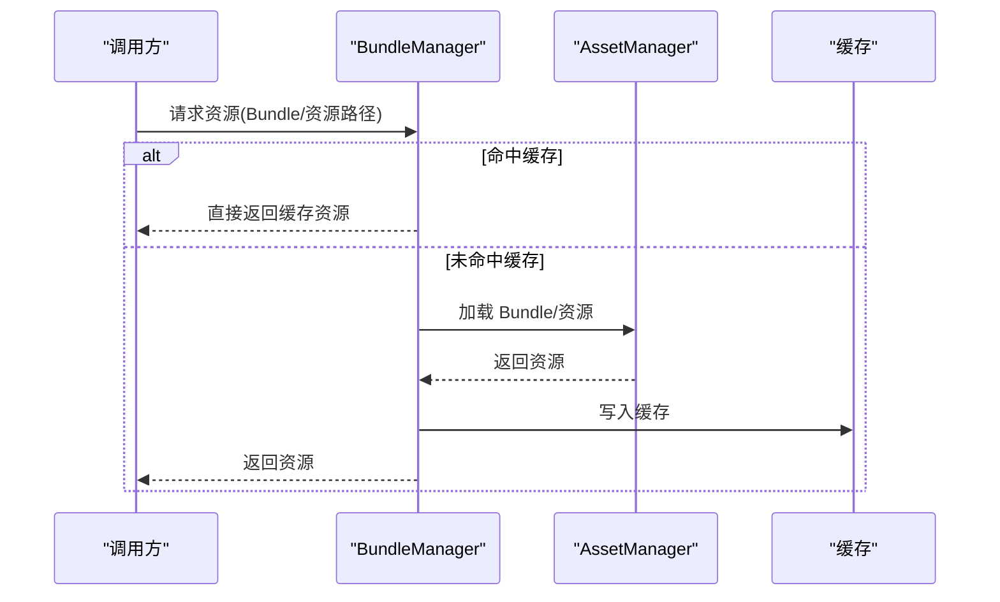
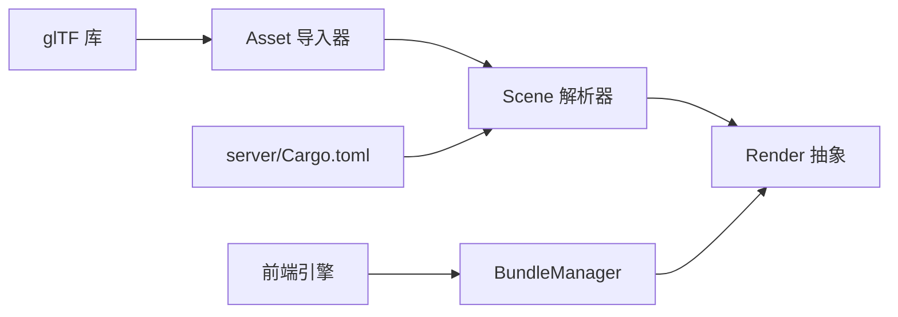

# 资源管理

<cite>
**本文引用的文件**
- [crates/asset/src/lib.rs](file://crates/asset/src/lib.rs)
- [crates/asset/Cargo.toml](file://crates/asset/Cargo.toml)
- [crates/scene/src/lib.rs](file://crates/scene/src/lib.rs)
- [crates/scene/src/material.rs](file://crates/scene/src/material.rs)
- [crates/render/src/lib.rs](file://crates/render/src/lib.rs)
- [gem/ccc/assets/script/tools/BundleManager/BundleManager.ts](file://gem/ccc/assets/script/tools/BundleManager/BundleManager.ts)
- [gem/ccc/assets/script/tools/README.md](file://gem/ccc/assets/script/tools/README.md)
- [server/Cargo.toml](file://server/Cargo.toml)
- [client/engine/msgpack/fallback.py](file://client/engine/msgpack/fallback.py)
</cite>

## 目录
1. [引言](#引言)
2. [项目结构](#项目结构)
3. [核心组件](#核心组件)
4. [架构总览](#架构总览)
5. [详细组件分析](#详细组件分析)
6. [依赖关系分析](#依赖关系分析)
7. [性能考量](#性能考量)
8. [故障排查指南](#故障排查指南)
9. [结论](#结论)
10. [附录](#附录)

## 引言
本技术文档围绕 geese 项目的资源管理系统展开，重点聚焦于 Asset crate 的设计目标与实现架构，涵盖资源文件组织、版本管理与动态加载机制；资源数据的序列化与反序列化处理（BSON 与 MessagePack 的使用场景与性能对比）；资源缓存策略（内存缓存、磁盘缓存与 CDN 集成）；资源热更新（零停机更新、回滚策略与版本控制）；资源压缩与优化（纹理压缩、音频格式转换、模型简化）；资源打包与分发最佳实践（多服务器一致性）；资源依赖管理与构建流程（自动化测试与质量保证）；以及资源监控与性能分析工具的使用建议。

## 项目结构
本项目采用多 crate 的模块化组织方式，资源相关能力主要分布在以下模块：
- Asset：负责从 glTF 文件导入几何、材质与图像数据，作为渲染管线的输入来源。
- Scene：基于 glTF 文档解析节点、网格、动画与蒙皮信息，构建场景对象。
- Render：定义材质、纹理、顶点与渲染队列等渲染层抽象。
- 客户端 Bundle 管理：在前端侧提供 Bundle 与资源的加载、缓存与预加载能力。
- 服务端依赖：包含 Thrift、Serde、Tokio 等用于协议编解码与并发处理的基础能力。

**图表来源**
- [crates/asset/src/lib.rs:1-14](file://crates/asset/src/lib.rs#L1-L14)
- [crates/scene/src/lib.rs:1-437](file://crates/scene/src/lib.rs#L1-L437)
- [crates/render/src/lib.rs:1-16](file://crates/render/src/lib.rs#L1-L16)
- [gem/ccc/assets/script/tools/BundleManager/BundleManager.ts:1-199](file://gem/ccc/assets/script/tools/BundleManager/BundleManager.ts#L1-L199)
- [server/Cargo.toml:1-42](file://server/Cargo.toml#L1-L42)

**章节来源**
- [crates/asset/src/lib.rs:1-14](file://crates/asset/src/lib.rs#L1-L14)
- [crates/scene/src/lib.rs:1-437](file://crates/scene/src/lib.rs#L1-L437)
- [crates/render/src/lib.rs:1-16](file://crates/render/src/lib.rs#L1-L16)
- [gem/ccc/assets/script/tools/BundleManager/BundleManager.ts:1-199](file://gem/ccc/assets/script/tools/BundleManager/BundleManager.ts#L1-L199)
- [server/Cargo.toml:1-42](file://server/Cargo.toml#L1-L42)

## 核心组件
- Asset 导入器：提供 glTF 文件的导入接口，返回文档、缓冲区与图像数据，作为后续场景与渲染管线的输入。
- Scene 解析器：遍历 glTF 场景树，提取节点、网格、索引、顶点属性、法线、切线、UV、骨骼与动画信息，构建 Scene 对象。
- 材质与纹理转换：将 glTF 材质与图像格式映射到渲染层的材质与纹理类型。
- 渲染抽象：定义材质、纹理、顶点、渲染命令与渲染队列等统一接口，便于跨平台渲染后端。
- 客户端 Bundle 管理：提供 Bundle 加载、资源缓存、预加载与远程资源加载能力，支持去重与并发控制。

**章节来源**
- [crates/asset/src/lib.rs:1-14](file://crates/asset/src/lib.rs#L1-L14)
- [crates/scene/src/lib.rs:61-137](file://crates/scene/src/lib.rs#L61-L137)
- [crates/scene/src/material.rs:60-98](file://crates/scene/src/material.rs#L60-L98)
- [crates/render/src/lib.rs:1-16](file://crates/render/src/lib.rs#L1-L16)
- [gem/ccc/assets/script/tools/BundleManager/BundleManager.ts:61-102](file://gem/ccc/assets/script/tools/BundleManager/BundleManager.ts#L61-L102)

## 架构总览
资源管理的整体流程从 glTF 文件导入开始，经过场景解析与材质/纹理转换，最终进入渲染层。客户端侧通过 BundleManager 实现资源的按需加载与缓存，服务端侧通过 Cargo 依赖与运行时环境支撑资源导入与网络通信。

**图表来源**
- [crates/asset/src/lib.rs:1-14](file://crates/asset/src/lib.rs#L1-L14)
- [crates/scene/src/lib.rs:266-330](file://crates/scene/src/lib.rs#L266-L330)
- [crates/render/src/lib.rs:1-16](file://crates/render/src/lib.rs#L1-L16)
- [gem/ccc/assets/script/tools/BundleManager/BundleManager.ts:61-102](file://gem/ccc/assets/script/tools/BundleManager/BundleManager.ts#L61-L102)

## 详细组件分析

### Asset 导入器
- 设计目标：提供稳定、高效的 glTF 文件导入能力，输出文档、缓冲区与图像数据，供上层场景与渲染模块使用。
- 关键实现：
  - 导入函数接收文件路径，调用 glTF 库进行解析，返回三元组（文档、缓冲区、图像）。
  - 该接口是 Scene 模块的唯一输入来源，确保资源数据的统一入口。
- 版本管理与动态加载：
  - 可通过外部系统对文件路径进行版本化管理（例如带版本号的文件名或目录），导入器保持对路径的透明传递。
  - 动态加载可通过 BundleManager 或服务端按需触发导入流程。

**图表来源**
- [crates/asset/src/lib.rs:1-14](file://crates/asset/src/lib.rs#L1-L14)

**章节来源**
- [crates/asset/src/lib.rs:1-14](file://crates/asset/src/lib.rs#L1-L14)
- [crates/asset/Cargo.toml:1-7](file://crates/asset/Cargo.toml#L1-L7)

### Scene 解析器
- 设计目标：将 glTF 场景树转换为内部 Scene 结构，包含节点、网格、材质、动画与骨骼信息。
- 关键实现：
  - 遍历场景节点，提取位置、旋转、缩放并构建节点树。
  - 读取网格的顶点、索引、法线、切线、UV、骨骼权重与关节索引，生成 ModelMesh。
  - 读取动画通道与插值方式，构建 AnimationClip。
  - 读取蒙皮信息，建立关节与逆变换矩阵映射。
- 性能特性：
  - 使用迭代器与一次性收集策略减少中间拷贝。
  - 切线生成采用三角面片批处理，避免重复计算。

**图表来源**
- [crates/scene/src/lib.rs:224-330](file://crates/scene/src/lib.rs#L224-L330)

**章节来源**
- [crates/scene/src/lib.rs:61-137](file://crates/scene/src/lib.rs#L61-L137)
- [crates/scene/src/lib.rs:224-330](file://crates/scene/src/lib.rs#L224-L330)

### 材质与纹理转换
- 设计目标：将 glTF 材质与图像格式映射到渲染层的统一类型，确保跨平台一致性。
- 关键实现：
  - 图像格式映射：根据 glTF 的像素格式映射到渲染层的 TextureFormat。
  - 纹理采样器映射：将放大/缩小过滤、包裹模式等参数转换为 Sampler。
  - 材质属性映射：将 PBR 参数、透明度模式等转换为渲染层的 Material 结构。
- 性能特性：
  - 通过枚举匹配与默认值策略，避免分支开销。
  - 在无材质时提供默认材质，保证渲染连续性。

**图表来源**
- [crates/scene/src/material.rs:60-98](file://crates/scene/src/material.rs#L60-L98)

**章节来源**
- [crates/scene/src/material.rs:60-98](file://crates/scene/src/material.rs#L60-L98)

### 渲染抽象
- 设计目标：提供跨平台渲染所需的统一接口，屏蔽底层差异。
- 关键抽象：
  - 材质、纹理、顶点、渲染命令与渲染队列等类型定义。
  - 渲染器接口与描述符，便于扩展不同渲染后端。
- 与 Scene 的协作：
  - Scene 解析完成后，将材质库与网格数据提交给渲染层，由渲染器执行绘制。

**章节来源**
- [crates/render/src/lib.rs:1-16](file://crates/render/src/lib.rs#L1-L16)

### 客户端 Bundle 管理
- 设计目标：在前端侧实现资源的按需加载、缓存与预加载，提升首屏与切换体验。
- 关键实现：
  - Bundle 缓存与去重：同一 Bundle 并发加载时共享 Promise。
  - 资源缓存：命中缓存直接返回，未命中则发起加载并写入缓存。
  - 预加载：支持目录级预加载与进度回调。
  - 远程资源：支持从 URL 加载资源并指定扩展名。
  - 释放机制：手动释放已缓存资源以回收内存。
- 与 BundleManager 的交互：
  - 通过静态单例获取实例，统一管理加载状态与缓存。

**图表来源**
- [gem/ccc/assets/script/tools/BundleManager/BundleManager.ts:61-102](file://gem/ccc/assets/script/tools/BundleManager/BundleManager.ts#L61-L102)

**章节来源**
- [gem/ccc/assets/script/tools/BundleManager/BundleManager.ts:1-199](file://gem/ccc/assets/script/tools/BundleManager/BundleManager.ts#L1-L199)
- [gem/ccc/assets/script/tools/README.md:1-41](file://gem/ccc/assets/script/tools/README.md#L1-L41)

## 依赖关系分析
- Asset 依赖 glTF 库，提供导入能力。
- Scene 依赖 Asset 的导入结果，进一步解析场景树与网格。
- Render 为 Scene/Asset 的上层抽象，提供统一渲染接口。
- 客户端 BundleManager 依赖引擎的 AssetManager，实现前端资源加载与缓存。
- 服务端 Cargo.toml 统一声明 Thrift、Serde、Tokio 等依赖，支撑协议编解码与并发处理。

**图表来源**
- [crates/asset/Cargo.toml:1-7](file://crates/asset/Cargo.toml#L1-L7)
- [crates/asset/src/lib.rs:1-14](file://crates/asset/src/lib.rs#L1-L14)
- [crates/scene/src/lib.rs:1-437](file://crates/scene/src/lib.rs#L1-L437)
- [crates/render/src/lib.rs:1-16](file://crates/render/src/lib.rs#L1-L16)
- [gem/ccc/assets/script/tools/BundleManager/BundleManager.ts:1-199](file://gem/ccc/assets/script/tools/BundleManager/BundleManager.ts#L1-L199)
- [server/Cargo.toml:1-42](file://server/Cargo.toml#L1-L42)

**章节来源**
- [crates/asset/Cargo.toml:1-7](file://crates/asset/Cargo.toml#L1-L7)
- [server/Cargo.toml:1-42](file://server/Cargo.toml#L1-L42)

## 性能考量
- 导入与解析：
  - 使用迭代器与一次性收集策略减少内存分配与拷贝次数。
  - 切线生成采用批量三角面片处理，避免重复计算。
- 缓存策略：
  - 客户端侧缓存命中即返回，避免重复 IO 与解码。
  - Bundle 级别去重与并发共享 Promise，降低重复请求。
- 序列化与传输：
  - MessagePack 在 Python 端有完善的解码实现，适合低延迟网络传输。
  - BSON 在服务端生态中常见，适合与数据库/存储系统对接。
- 渲染层优化：
  - 材质与纹理格式映射应尽量减少格式转换，避免额外开销。
  - 预加载与按需加载结合，平衡内存占用与加载速度。

[本节为通用性能指导，无需特定文件来源]

## 故障排查指南
- 导入失败：
  - 检查 glTF 文件完整性与路径正确性。
  - 确认导入函数返回的三元组是否为空或异常。
- 资源加载异常：
  - 客户端 BundleManager 记录错误日志并移除加载中的占位，确认错误来源与重试策略。
  - 远程资源加载失败时检查 URL 与扩展名配置。
- 渲染问题：
  - 若材质缺失，检查默认材质回退逻辑是否生效。
  - 纹理格式不支持时，确认映射表与渲染后端支持情况。

**章节来源**
- [crates/asset/src/lib.rs:1-14](file://crates/asset/src/lib.rs#L1-L14)
- [gem/ccc/assets/script/tools/BundleManager/BundleManager.ts:31-58](file://gem/ccc/assets/script/tools/BundleManager/BundleManager.ts#L31-L58)
- [crates/scene/src/material.rs:60-98](file://crates/scene/src/material.rs#L60-L98)

## 结论
geese 项目的资源管理以 Asset 为核心，通过 Scene 与 Render 形成完整的资源导入、解析与渲染链路。客户端 BundleManager 提供了完善的资源加载与缓存机制，服务端依赖体系保障了协议与运行时的稳定性。未来可在版本管理、热更新与 CDN 集成方面进一步完善，以满足多服务器环境下的资源一致性与高可用需求。

[本节为总结性内容，无需特定文件来源]

## 附录

### 序列化与反序列化处理（BSON 与 MessagePack）
- MessagePack（Python 端）：
  - Python 端存在完整的 MessagePack 解码实现，适用于低延迟网络传输与跨语言数据交换。
  - 支持头解析与长度限制，具备安全防护能力。
- BSON（服务端生态）：
  - 与数据库/存储系统兼容性好，适合持久化与查询场景。
- 选择建议：
  - 网络传输优先考虑 MessagePack，以获得更小体积与更快解析速度。
  - 数据持久化与检索优先考虑 BSON，以获得更好的结构化查询能力。

**章节来源**
- [client/engine/msgpack/fallback.py:441-479](file://client/engine/msgpack/fallback.py#L441-L479)

### 资源缓存策略
- 内存缓存：
  - 客户端 BundleManager 对已加载资源进行缓存，命中即返回，显著降低重复加载成本。
- 磁盘缓存与 CDN：
  - 建议在客户端引入磁盘缓存与 CDN 集成，结合 ETag/Last-Modified 实现条件请求与缓存失效。
  - Bundle 级别的版本化路径与指纹化资源名，确保缓存一致性与可回滚性。

[本节为通用实践建议，无需特定文件来源]

### 资源热更新机制
- 零停机更新：
  - 通过 Bundle 版本化与渐进式预加载，先加载新版本再切换资源引用，避免停机。
- 回滚策略：
  - 当新版本出现问题时，回退到上一个稳定版本，确保服务连续性。
- 版本控制：
  - 资源路径与 Bundle 名称携带版本号，配合 CDN 与镜像站实现灰度发布。

[本节为通用实践建议，无需特定文件来源]

### 资源压缩与优化
- 纹理压缩：
  - 在导入阶段根据目标平台选择合适压缩格式，减少带宽与内存占用。
- 音频格式转换：
  - 根据浏览器与设备能力选择最优音频格式，结合音频精灵减少请求数量。
- 模型简化：
  - 在导入前对模型进行简化与拓扑优化，降低渲染负载。

[本节为通用实践建议，无需特定文件来源]

### 资源打包与分发最佳实践
- 多服务器一致性：
  - 使用统一的资源清单与校验和，确保各服务器资源一致。
  - 通过 CDN 与镜像站分发资源，结合缓存策略与失效机制。
- 自动化测试与质量保证：
  - 在构建流水线中加入资源完整性校验与性能回归测试，确保上线质量。

[本节为通用实践建议，无需特定文件来源]

### 资源监控与性能分析
- 监控指标：
  - 资源加载耗时、缓存命中率、CDN 命中率、渲染帧时间等。
- 工具建议：
  - 结合浏览器开发者工具与服务端日志，定位加载瓶颈与渲染热点。
  - 使用性能分析工具对关键路径进行剖析，持续优化资源加载与渲染性能。

[本节为通用实践建议，无需特定文件来源]