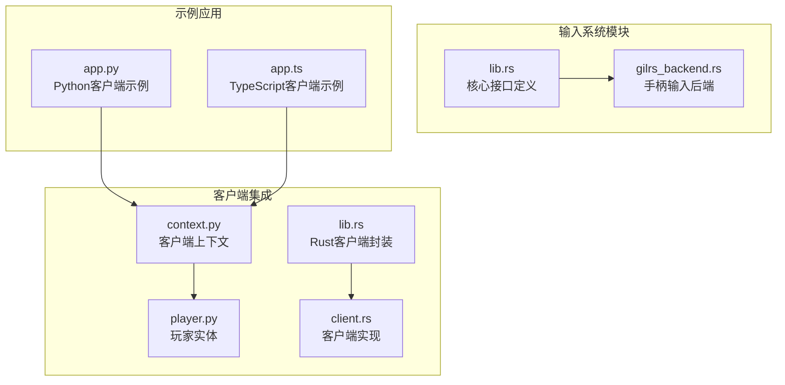
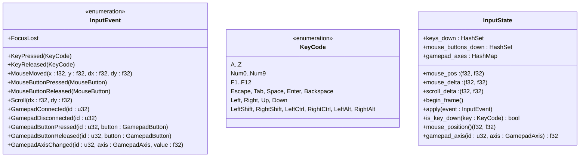
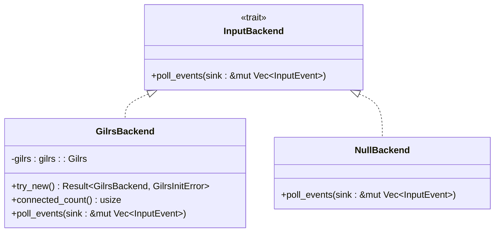
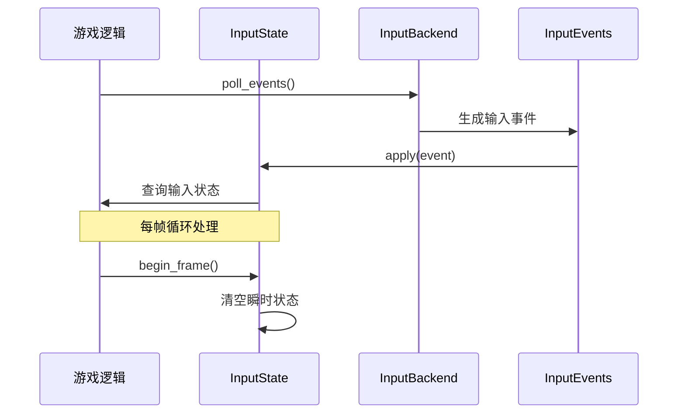
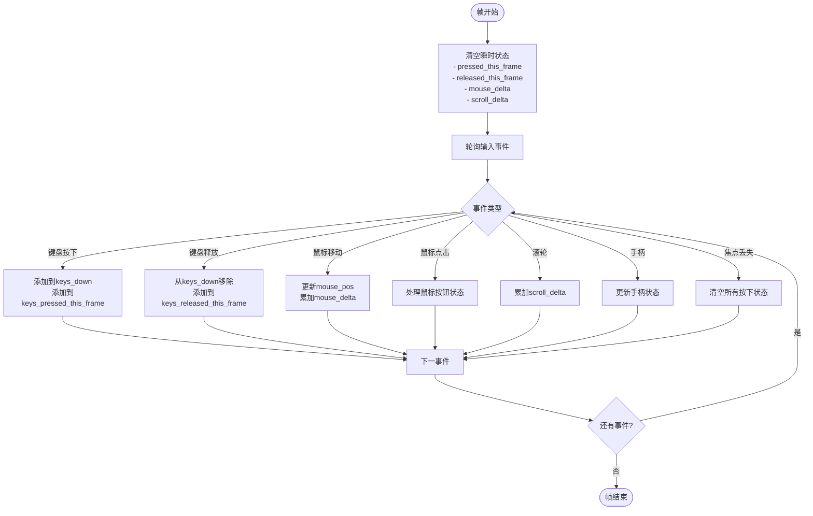
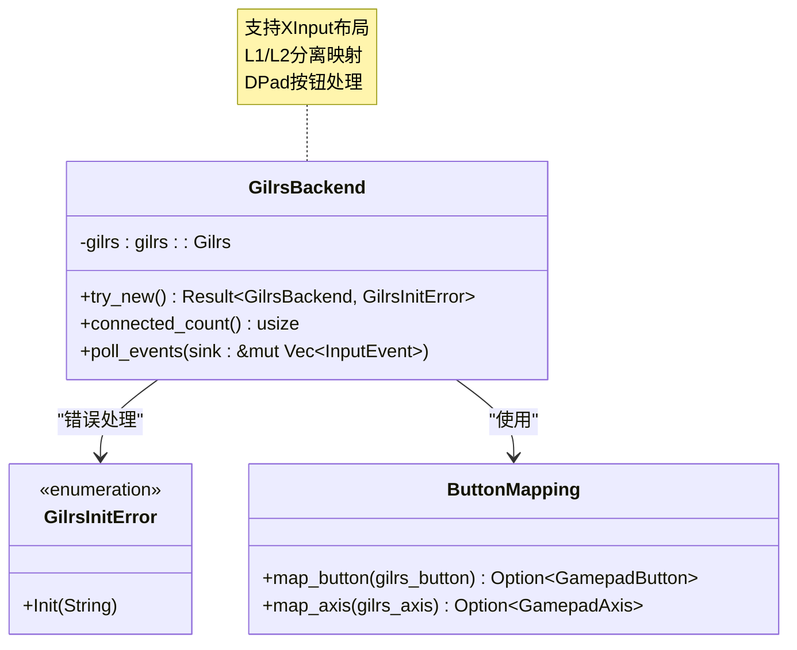
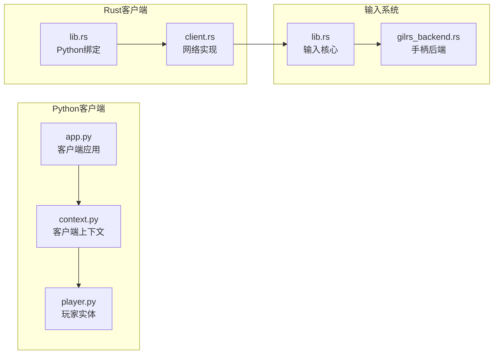
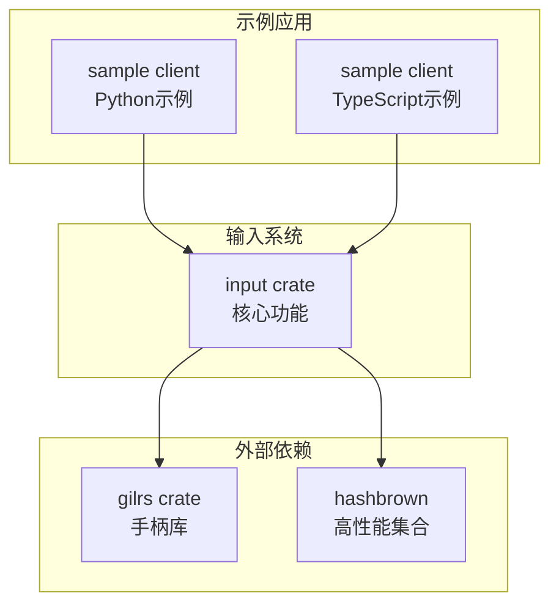

# 输入系统

<cite>
**本文档引用的文件**
- [lib.rs](file://crates/input/src/lib.rs)
- [gilrs_backend.rs](file://crates/input/src/gilrs_backend.rs)
- [app.py](file://sample/client/py/app.py)
- [app.ts](file://sample/client/ts/app.ts)
- [context.py](file://client/engine/context.py)
- [player.py](file://client/engine/player.py)
- [lib.rs](file://client/lib/client/src/lib.rs)
- [client.rs](file://client/lib/client/src/client.rs)
</cite>

## 目录
1. [简介](#简介)
2. [项目结构](#项目结构)
3. [核心组件](#核心组件)
4. [架构概览](#架构概览)
5. [详细组件分析](#详细组件分析)
6. [依赖分析](#依赖分析)
7. [性能考虑](#性能考虑)
8. [故障排除指南](#故障排除指南)
9. [结论](#结论)

## 简介

输入系统是游戏引擎中的关键基础设施，负责统一管理键盘、鼠标和手柄等输入设备。该系统提供了抽象化的输入事件处理机制，通过标准化的事件格式和状态管理，为上层游戏逻辑提供一致的输入接口。

本系统采用模块化设计，包含以下主要特性：
- 统一的输入事件抽象，支持多种输入设备
- 帧状态管理，提供精确的输入状态跟踪
- 可扩展的后端架构，支持不同平台的输入设备
- 动作映射系统，实现输入到游戏行为的解耦

## 项目结构

输入系统主要位于 `crates/input` 目录下，采用清晰的模块化组织：

**图表来源**
- [lib.rs:1-395](file://crates/input/src/lib.rs#L1-L395)
- [gilrs_backend.rs:1-165](file://crates/input/src/gilrs_backend.rs#L1-L165)

**章节来源**
- [lib.rs:1-395](file://crates/input/src/lib.rs#L1-L395)
- [gilrs_backend.rs:1-165](file://crates/input/src/gilrs_backend.rs#L1-L165)

## 核心组件

输入系统的核心组件包括事件类型、状态管理和后端接口三个主要部分：

### 输入事件类型

系统定义了统一的输入事件枚举，涵盖所有支持的输入设备：

**图表来源**
- [lib.rs:24-130](file://crates/input/src/lib.rs#L24-L130)

### 后端接口

系统提供了可扩展的后端接口，支持不同的输入设备实现：

**图表来源**
- [lib.rs:252-263](file://crates/input/src/lib.rs#L252-L263)
- [gilrs_backend.rs:19-43](file://crates/input/src/gilrs_backend.rs#L19-L43)

**章节来源**
- [lib.rs:24-263](file://crates/input/src/lib.rs#L24-L263)
- [gilrs_backend.rs:19-126](file://crates/input/src/gilrs_backend.rs#L19-L126)

## 架构概览

输入系统采用分层架构设计，实现了输入设备与游戏逻辑的解耦：

**图表来源**
- [lib.rs:137-145](file://crates/input/src/lib.rs#L137-L145)
- [lib.rs:147-198](file://crates/input/src/lib.rs#L147-L198)

系统架构的关键特点：
- **抽象层**：通过 `InputBackend` trait 抽象不同输入设备
- **状态层**：`InputState` 提供帧级别的状态管理
- **事件层**：统一的 `InputEvent` 枚举处理所有输入类型
- **映射层**：`ActionMap` 将输入映射到游戏动作

## 详细组件分析

### 输入状态管理

输入状态管理系统是整个系统的核心，负责跟踪和管理所有输入状态：

**图表来源**
- [lib.rs:137-198](file://crates/input/src/lib.rs#L137-L198)

### 手柄输入后端

手柄输入后端基于 gilrs 库实现，提供了跨平台的手柄支持：

**图表来源**
- [gilrs_backend.rs:24-96](file://crates/input/src/gilrs_backend.rs#L24-L96)

**章节来源**
- [gilrs_backend.rs:24-126](file://crates/input/src/gilrs_backend.rs#L24-L126)

### 客户端集成

输入系统与客户端的集成通过 Python 和 TypeScript 示例展示：

**图表来源**
- [app.py:1-71](file://sample/client/py/app.py#L1-L71)
- [context.py:1-39](file://client/engine/context.py#L1-L39)
- [lib.rs:28-95](file://client/lib/client/src/lib.rs#L28-L95)

**章节来源**
- [app.py:1-71](file://sample/client/py/app.py#L1-L71)
- [context.py:1-39](file://client/engine/context.py#L1-L39)
- [lib.rs:28-95](file://client/lib/client/src/lib.rs#L28-L95)

## 依赖分析

输入系统与其他模块的依赖关系相对简单，主要依赖关系如下：

**图表来源**
- [lib.rs:15-18](file://crates/input/src/lib.rs#L15-L18)
- [gilrs_backend.rs:1-17](file://crates/input/src/gilrs_backend.rs#L1-L17)

**章节来源**
- [lib.rs:15-18](file://crates/input/src/lib.rs#L15-L18)
- [gilrs_backend.rs:1-17](file://crates/input/src/gilrs_backend.rs#L1-L17)

## 性能考虑

输入系统在设计时充分考虑了性能优化：

### 状态管理优化
- 使用 HashSet 和 HashMap 实现 O(1) 的状态查找
- 帧开始时批量清空瞬时状态，避免逐帧检查
- 事件累积处理，减少状态查询次数

### 内存管理
- 使用默认实现的零成本抽象
- 避免不必要的内存分配
- 合理的数据结构选择

### 并发安全
- 提供线程安全的状态访问
- 支持异步事件处理
- 最小化锁竞争

## 故障排除指南

### 常见问题及解决方案

**手柄初始化失败**
- 检查系统权限和 HID 驱动
- 验证 gilrs 库的兼容性
- 使用软失败策略处理无头环境

**输入状态异常**
- 确保每帧正确调用 `begin_frame()`
- 检查事件处理的完整性
- 验证焦点状态管理

**性能问题**
- 优化事件处理频率
- 减少不必要的状态查询
- 考虑批处理事件处理

**章节来源**
- [gilrs_backend.rs:132-142](file://crates/input/src/gilrs_backend.rs#L132-L142)
- [lib.rs:137-145](file://crates/input/src/lib.rs#L137-L145)

## 结论

输入系统通过其模块化设计和抽象接口，成功实现了输入设备与游戏逻辑的解耦。系统的主要优势包括：

1. **统一抽象**：通过标准化的事件格式和状态管理，简化了多输入设备的支持
2. **可扩展性**：灵活的后端架构支持新的输入设备类型
3. **性能优化**：高效的内存管理和状态查询机制
4. **易用性**：简单的 API 设计，便于上层游戏逻辑集成

该系统为游戏开发提供了坚实的基础，能够支持从简单到复杂的各种输入需求。通过持续的优化和扩展，输入系统将继续为游戏开发提供可靠的技术支撑。