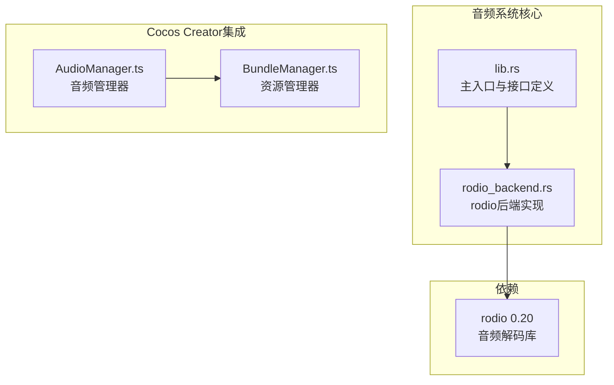
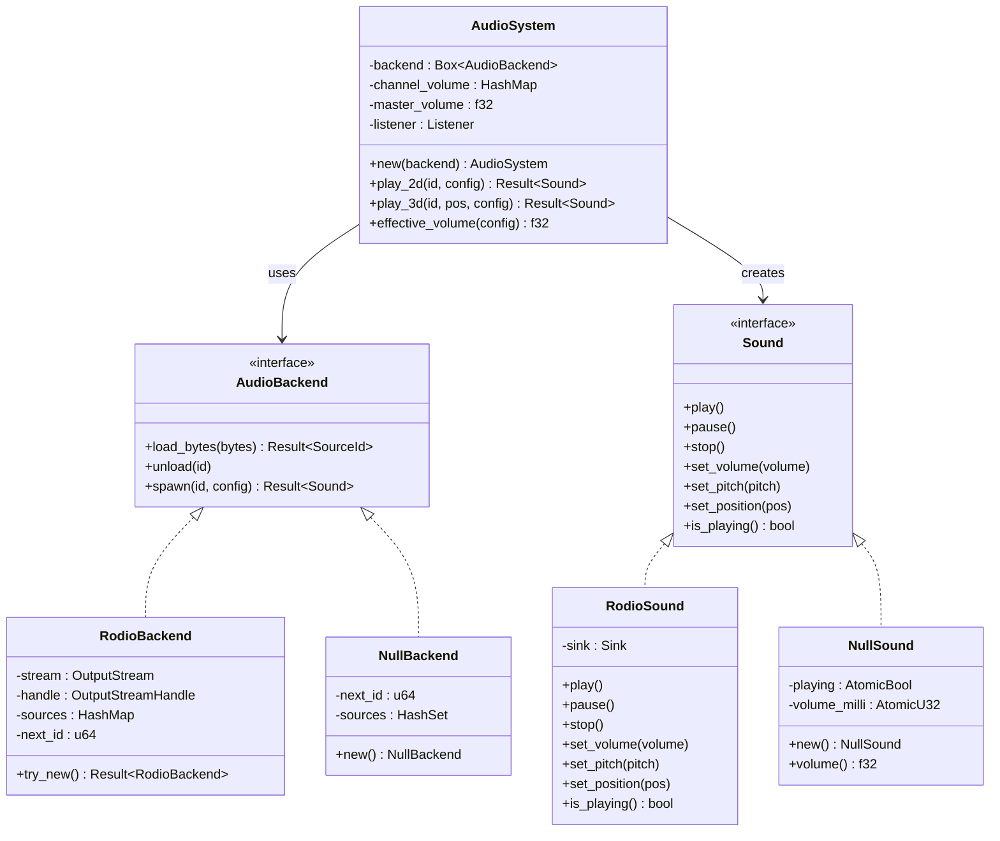
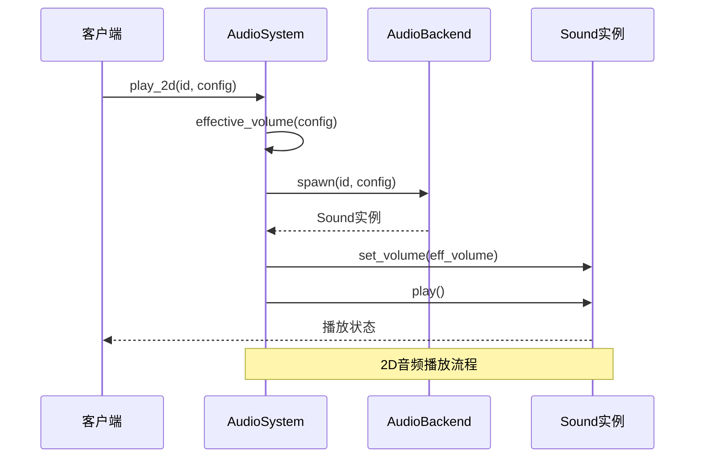
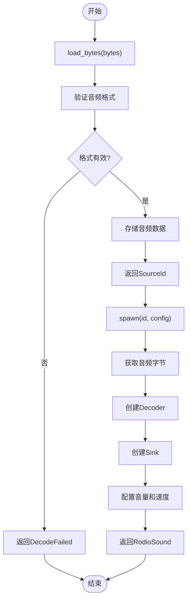
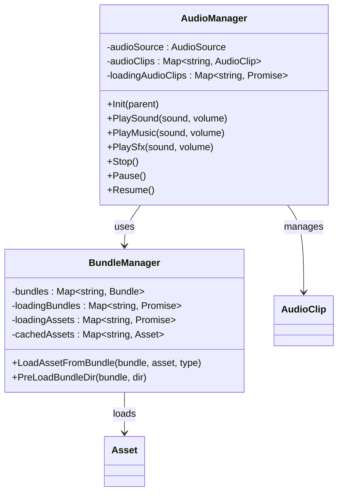
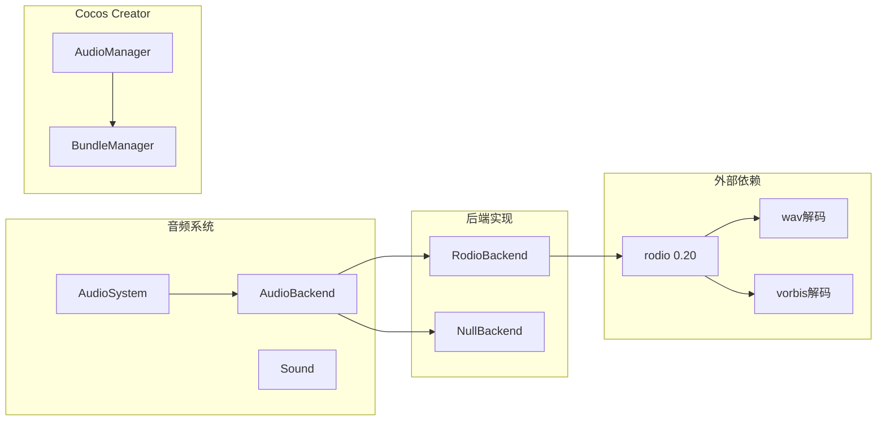

# 音频系统

<cite>
**本文档引用的文件**
- [lib.rs](file://crates/audio/src/lib.rs)
- [rodio_backend.rs](file://crates/audio/src/rodio_backend.rs)
- [Cargo.toml](file://crates/audio/Cargo.toml)
- [AudioManager.ts](file://gem/ccc/assets/script/tools/AudioManager/AudioManager.ts)
- [BundleManager.ts](file://gem/ccc/assets/script/tools/BundleManager/BundleManager.ts)
</cite>

## 目录
1. [简介](#简介)
2. [项目结构](#项目结构)
3. [核心组件](#核心组件)
4. [架构概览](#架构概览)
5. [详细组件分析](#详细组件分析)
6. [依赖分析](#依赖分析)
7. [性能考虑](#性能考虑)
8. [故障排除指南](#故障排除指南)
9. [结论](#结论)

## 简介

音频系统是游戏引擎中的重要组成部分，负责处理2D/3D音效与背景音乐的播放。本系统采用抽象设计，提供统一的音频接口，支持多种后端实现，包括基于rodio的音频播放和空实现用于测试。

系统的核心设计理念是通过trait抽象将业务逻辑与具体音频实现解耦，使得可以在不同平台上灵活切换音频后端，同时保持一致的API接口。

## 项目结构

音频系统主要包含以下核心文件：

**图表来源**
- [lib.rs:1-408](file://crates/audio/src/lib.rs#L1-L408)
- [rodio_backend.rs:1-189](file://crates/audio/src/rodio_backend.rs#L1-L189)
- [Cargo.toml:1-8](file://crates/audio/Cargo.toml#L1-L8)

**章节来源**
- [lib.rs:1-408](file://crates/audio/src/lib.rs#L1-L408)
- [rodio_backend.rs:1-189](file://crates/audio/src/rodio_backend.rs#L1-L189)
- [Cargo.toml:1-8](file://crates/audio/Cargo.toml#L1-L8)

## 核心组件

音频系统包含以下核心组件：

### 音频后端接口
系统定义了统一的音频后端接口，支持多种实现方式：
- **RodioBackend**: 基于rodio的完整音频播放实现
- **NullBackend**: 用于测试和无声模式的空实现

### 音频系统门面
AudioSystem作为门面模式的实现，提供统一的音频播放接口：
- 混音通道管理（Master/Music/SFX/Voice/UI）
- 全局音量控制
- 监听者（Listener）设置
- 2D/3D音频播放

### 声源接口
Sound trait定义了音频播放的基本操作：
- 播放/暂停/停止
- 音量/音调控制
- 位置设置（用于3D音频）

**章节来源**
- [lib.rs:24-156](file://crates/audio/src/lib.rs#L24-L156)
- [lib.rs:247-344](file://crates/audio/src/lib.rs#L247-L344)

## 架构概览

**图表来源**
- [lib.rs:105-156](file://crates/audio/src/lib.rs#L105-L156)
- [lib.rs:247-344](file://crates/audio/src/lib.rs#L247-L344)
- [rodio_backend.rs:16-112](file://crates/audio/src/rodio_backend.rs#L16-L112)

## 详细组件分析

### AudioSystem 门面模式

AudioSystem是音频系统的中央控制器，负责协调各个组件的工作：

**图表来源**
- [lib.rs:324-332](file://crates/audio/src/lib.rs#L324-L332)
- [lib.rs:320-322](file://crates/audio/src/lib.rs#L320-L322)

AudioSystem的主要职责包括：
- 计算最终音量（考虑源音量、通道音量和主音量）
- 管理混音通道
- 处理监听者信息
- 统一的播放接口

**章节来源**
- [lib.rs:247-344](file://crates/audio/src/lib.rs#L247-L344)

### RodioBackend 实现

RodioBackend提供了完整的音频播放功能：

**图表来源**
- [rodio_backend.rs:40-82](file://crates/audio/src/rodio_backend.rs#L40-L82)

RodioBackend的关键特性：
- 支持WAV和Vorbis格式解码
- 使用rodio::Sink进行音频播放
- 支持循环播放
- 默认暂停状态，由AudioSystem显式控制

**章节来源**
- [rodio_backend.rs:1-189](file://crates/audio/src/rodio_backend.rs#L1-L189)

### Cocos Creator 集成

系统还提供了Cocos Creator的音频管理集成：

**图表来源**
- [AudioManager.ts:9-141](file://gem/ccc/assets/script/tools/AudioManager/AudioManager.ts#L9-L141)
- [BundleManager.ts:4-200](file://gem/ccc/assets/script/tools/BundleManager/BundleManager.ts#L4-L200)

**章节来源**
- [AudioManager.ts:1-141](file://gem/ccc/assets/script/tools/AudioManager/AudioManager.ts#L1-L141)
- [BundleManager.ts:1-200](file://gem/ccc/assets/script/tools/BundleManager/BundleManager.ts#L1-L200)

## 依赖分析

音频系统的主要依赖关系：

**图表来源**
- [Cargo.toml:6-8](file://crates/audio/Cargo.toml#L6-L8)
- [lib.rs:1-408](file://crates/audio/src/lib.rs#L1-L408)

**章节来源**
- [Cargo.toml:1-8](file://crates/audio/Cargo.toml#L1-L8)

## 性能考虑

音频系统在设计时考虑了以下性能因素：

### 内存管理
- 使用Arc智能指针管理音频数据的生命周期
- 音频数据以字节数组形式存储，避免重复解码
- 提供卸载接口释放不再使用的音频资源

### 线程安全
- 使用原子操作处理音量等状态变量
- 后端实现考虑了线程安全性问题
- 建议在主线程或专用音频线程中使用AudioSystem

### 解码优化
- 预解码验证音频格式有效性
- 支持流式解码减少内存占用
- 缓存已加载的音频片段

## 故障排除指南

### 常见问题及解决方案

**音频后端不可用**
- 症状：初始化AudioSystem时返回BackendUnavailable
- 原因：系统缺少音频输出设备或处于无头环境
- 解决方案：检查系统音频配置或使用NullBackend进行测试

**音频解码失败**
- 症状：load_bytes返回DecodeFailed错误
- 原因：音频文件格式不受支持或文件损坏
- 解决方案：确认音频格式支持列表（WAV/Vorbis），检查文件完整性

**音量控制异常**
- 症状：音量超出预期范围或控制无效
- 原因：音量值超出允许范围或后端限制
- 解决方案：确保音量值在0.0-8.0范围内，检查后端支持情况

**章节来源**
- [lib.rs:136-156](file://crates/audio/src/lib.rs#L136-L156)
- [rodio_backend.rs:27-36](file://crates/audio/src/rodio_backend.rs#L27-L36)

## 结论

音频系统通过抽象设计实现了良好的可扩展性和可维护性。其核心优势包括：

1. **接口抽象**：统一的trait接口使得可以轻松切换不同的音频后端
2. **灵活的混音系统**：支持多通道管理和独立音量控制
3. **完整的功能覆盖**：从基础播放到3D音频的空间化处理
4. **跨平台兼容**：支持多种音频格式和后端实现
5. **Cocos Creator集成**：提供了完整的前端音频管理解决方案

系统的设计为未来的功能扩展奠定了良好基础，可以根据具体需求添加更多音频效果和处理能力。