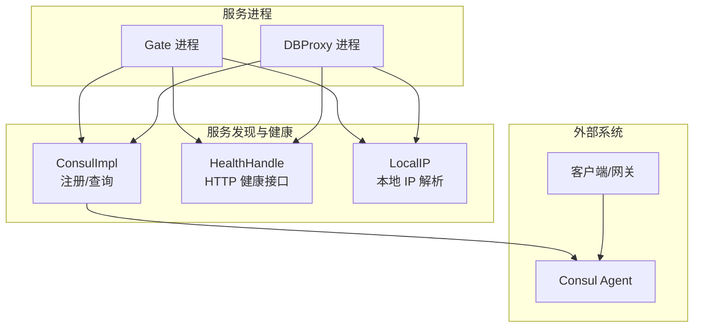
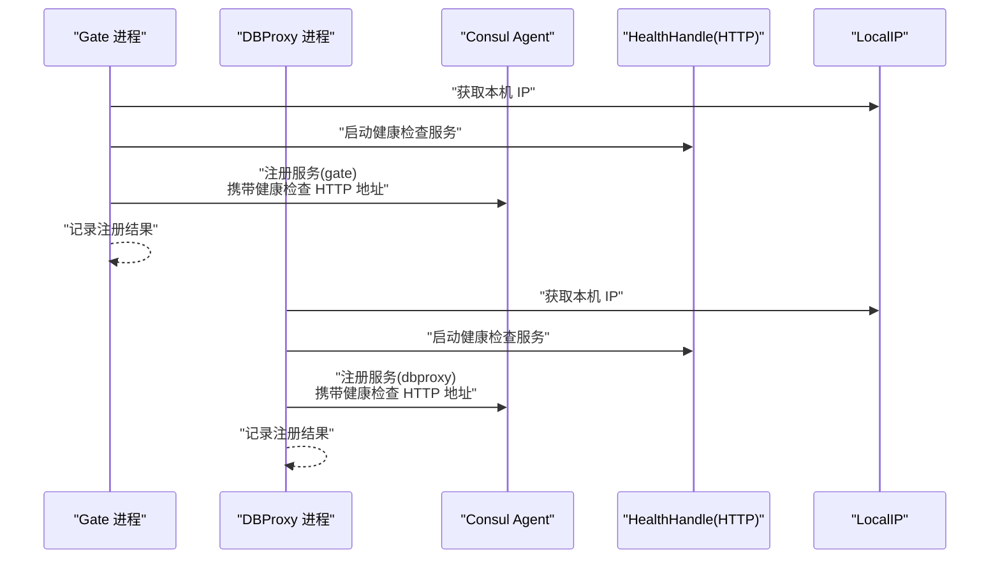
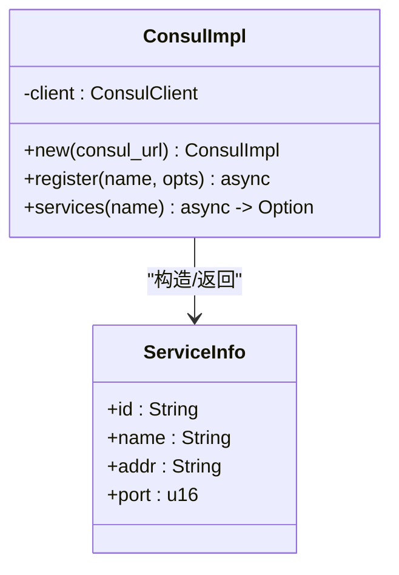
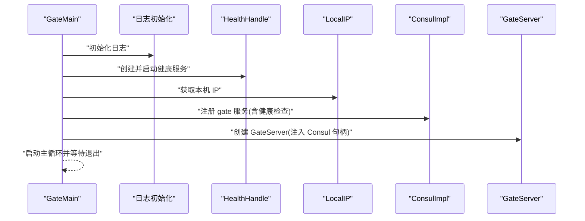
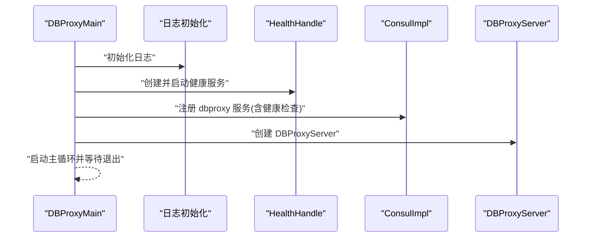
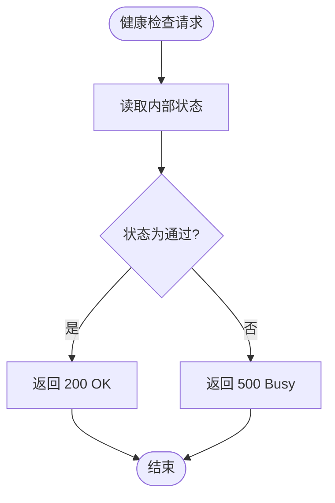
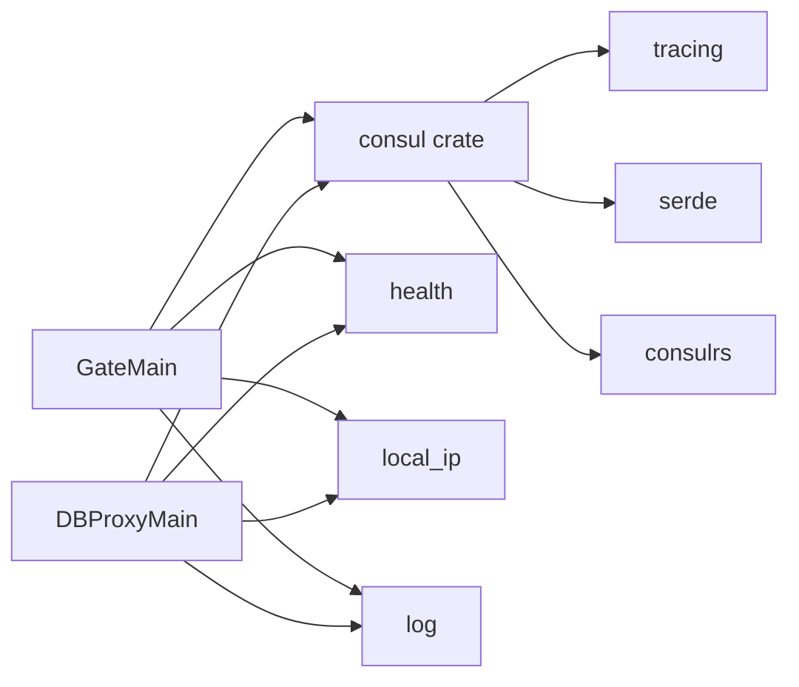

# Consul 服务发现

<cite>
**本文引用的文件**
- [crates/consul/src/lib.rs](file://crates/consul/src/lib.rs)
- [crates/consul/Cargo.toml](file://crates/consul/Cargo.toml)
- [server/src/gate_main.rs](file://server/src/gate_main.rs)
- [server/src/dbproxy_main.rs](file://server/src/dbproxy_main.rs)
- [crates/health/src/lib.rs](file://crates/health/src/lib.rs)
- [crates/local_ip/src/lib.rs](file://crates/local_ip/src/lib.rs)
- [crates/log/src/lib.rs](file://crates/log/src/lib.rs)
- [sample/server/config/gate.cfg](file://sample/server/config/gate.cfg)
- [sample/server/config/dbproxy.cfg](file://sample/server/config/dbproxy.cfg)
- [crates/proto/src/hub.rs](file://crates/proto/src/hub.rs)
- [crates/proto/src/gate.rs](file://crates/proto/src/gate.rs)
</cite>

## 目录
1. [简介](#简介)
2. [项目结构](#项目结构)
3. [核心组件](#核心组件)
4. [架构总览](#架构总览)
5. [详细组件分析](#详细组件分析)
6. [依赖关系分析](#依赖关系分析)
7. [性能考量](#性能考量)
8. [故障排查指南](#故障排查指南)
9. [结论](#结论)
10. [附录](#附录)

## 简介
本文件面向使用 Consul 进行服务注册与发现的开发者，系统性梳理基于 consulrs 库的实现：服务注册、服务列表查询、健康状态监控与日志记录策略；详解 ServiceInfo 数据模型与字段语义；给出在 Gate、Hub、DBProxy 服务中的集成范式；并总结服务发现的最佳实践（命名规范、标签与元数据）、性能优化与故障恢复策略。

## 项目结构
围绕 Consul 服务发现的关键代码分布在以下模块：
- consul 实现层：封装 consulrs 客户端，提供注册与查询能力
- 服务入口：Gate、DBProxy 启动时完成服务注册与健康检查暴露
- 健康检查：内置 HTTP 健康接口，供 Consul 探针调用
- 本地 IP 获取：兼容容器环境下的 IP 解析
- 日志与链路追踪：统一初始化与输出
- 配置样例：Gate、DBProxy 的配置文件示例

图表来源
- [crates/consul/src/lib.rs:1-66](file://crates/consul/src/lib.rs#L1-L66)
- [server/src/gate_main.rs:1-117](file://server/src/gate_main.rs#L1-L117)
- [server/src/dbproxy_main.rs:1-78](file://server/src/dbproxy_main.rs#L1-L78)
- [crates/health/src/lib.rs:1-51](file://crates/health/src/lib.rs#L1-L51)
- [crates/local_ip/src/lib.rs:1-9](file://crates/local_ip/src/lib.rs#L1-L9)

章节来源
- [crates/consul/src/lib.rs:1-66](file://crates/consul/src/lib.rs#L1-L66)
- [server/src/gate_main.rs:1-117](file://server/src/gate_main.rs#L1-L117)
- [server/src/dbproxy_main.rs:1-78](file://server/src/dbproxy_main.rs#L1-L78)
- [crates/health/src/lib.rs:1-51](file://crates/health/src/lib.rs#L1-L51)
- [crates/local_ip/src/lib.rs:1-9](file://crates/local_ip/src/lib.rs#L1-L9)

## 核心组件
- ConsulImpl：封装 consulrs 客户端，提供服务注册与服务列表查询能力
- ServiceInfo：服务实例信息的数据模型，包含 id、name、addr、port
- HealthHandle：内置健康检查 HTTP 服务，供 Consul 探针访问
- LocalIP：获取本机 IP，支持 K8S 环境变量覆盖
- 日志与链路追踪：统一初始化，支持文件落盘与 Jaeger

章节来源
- [crates/consul/src/lib.rs:8-18](file://crates/consul/src/lib.rs#L8-L18)
- [crates/health/src/lib.rs:12-15](file://crates/health/src/lib.rs#L12-L15)
- [crates/local_ip/src/lib.rs:4-8](file://crates/local_ip/src/lib.rs#L4-L8)
- [crates/log/src/lib.rs:8-35](file://crates/log/src/lib.rs#L8-L35)

## 架构总览
下图展示了 Gate 与 DBProxy 在启动阶段如何完成服务注册与健康检查暴露，并通过 Consul 进行服务发现。

图表来源
- [server/src/gate_main.rs:68-86](file://server/src/gate_main.rs#L68-L86)
- [server/src/dbproxy_main.rs:52-68](file://server/src/dbproxy_main.rs#L52-L68)
- [crates/health/src/lib.rs:34-44](file://crates/health/src/lib.rs#L34-L44)
- [crates/local_ip/src/lib.rs:4-8](file://crates/local_ip/src/lib.rs#L4-L8)

## 详细组件分析

### ConsulImpl 组件
- 职责
  - 初始化 Consul 客户端
  - 提供服务注册接口，支持自定义注册请求构建器
  - 提供服务列表查询接口，返回 ServiceInfo 列表
- 关键点
  - 使用 tracing 记录注册与查询的日志级别（info/error/trace）
  - 查询失败时返回 None，成功时构造 ServiceInfo 列表
  - 注册请求可选地包含健康检查配置

图表来源
- [crates/consul/src/lib.rs:8-18](file://crates/consul/src/lib.rs#L8-L18)
- [crates/consul/src/lib.rs:20-66](file://crates/consul/src/lib.rs#L20-L66)

章节来源
- [crates/consul/src/lib.rs:1-66](file://crates/consul/src/lib.rs#L1-L66)

### ServiceInfo 数据模型
- 字段含义
  - id：服务实例唯一标识
  - name：服务名称
  - addr：服务地址
  - port：服务端口
- 复杂度与性能
  - 查询返回的列表遍历为 O(n)，n 为当前服务实例数
  - 建议结合缓存与定期刷新策略降低频繁查询开销

章节来源
- [crates/consul/src/lib.rs:12-18](file://crates/consul/src/lib.rs#L12-L18)

### Gate 服务集成
- 启动流程要点
  - 加载配置文件，初始化日志
  - 创建 HealthHandle 并启动健康检查 HTTP 服务
  - 获取本地 IP，构造健康检查 HTTP 地址
  - 通过 ConsulImpl 注册 gate 服务，设置健康检查探针
  - 将 ConsulImpl 包装为共享句柄传入业务服务器
- 错误处理
  - 配置加载失败直接退出
  - 服务器创建失败记录错误并退出
  - 注册失败通过日志记录但不阻断启动

图表来源
- [server/src/gate_main.rs:33-117](file://server/src/gate_main.rs#L33-L117)
- [crates/health/src/lib.rs:34-44](file://crates/health/src/lib.rs#L34-L44)
- [crates/local_ip/src/lib.rs:4-8](file://crates/local_ip/src/lib.rs#L4-L8)
- [crates/consul/src/lib.rs:30-39](file://crates/consul/src/lib.rs#L30-L39)

章节来源
- [server/src/gate_main.rs:1-117](file://server/src/gate_main.rs#L1-L117)

### DBProxy 服务集成
- 启动流程要点
  - 加载配置文件，初始化日志
  - 创建 HealthHandle 并启动健康检查 HTTP 服务
  - 通过 ConsulImpl 注册 dbproxy 服务，设置健康检查探针
  - 启动 DBProxyServer 主循环
- 错误处理
  - 配置加载失败直接退出
  - 服务器创建失败记录错误并退出
  - 注册失败通过日志记录但不阻断启动

图表来源
- [server/src/dbproxy_main.rs:15-78](file://server/src/dbproxy_main.rs#L15-L78)
- [crates/health/src/lib.rs:34-44](file://crates/health/src/lib.rs#L34-L44)
- [crates/consul/src/lib.rs:30-39](file://crates/consul/src/lib.rs#L30-L39)

章节来源
- [server/src/dbproxy_main.rs:1-78](file://server/src/dbproxy_main.rs#L1-L78)

### 健康检查与日志记录
- 健康检查
  - HealthHandle 暴露 /health 路由，返回 OK 或内部错误
  - 支持运行时切换健康状态（通过 set_health_status）
- 日志记录
  - 统一通过 tracing 初始化，支持文件滚动与可选 Jaeger 链路追踪
  - ConsulImpl 在注册与查询时按级别输出 trace/info/error

图表来源
- [crates/health/src/lib.rs:22-32](file://crates/health/src/lib.rs#L22-L32)

章节来源
- [crates/health/src/lib.rs:1-51](file://crates/health/src/lib.rs#L1-L51)
- [crates/log/src/lib.rs:8-35](file://crates/log/src/lib.rs#L8-L35)
- [crates/consul/src/lib.rs:30-39](file://crates/consul/src/lib.rs#L30-L39)

### 服务发现最佳实践
- 服务命名规范
  - 使用清晰、稳定的名称（如 gate、dbproxy），避免动态后缀干扰查询
  - 在多环境部署时建议加上前缀或后缀区分（例如 namespace）
- 标签与元数据
  - 可通过注册请求扩展标签与元数据字段（参考注册请求构建器）
  - 建议在服务实例上标注版本、区域、机房等维度信息，便于灰度与路由
- 健康检查
  - 健康检查路径应轻量、快速，避免成为性能瓶颈
  - 合理设置检查间隔与超时，避免误杀
- 配置与环境
  - 优先从环境变量或配置中心读取 Consul 地址
  - 在容器环境中使用 K8S_POD_IP 等变量确保正确的服务地址

章节来源
- [server/src/gate_main.rs:68-86](file://server/src/gate_main.rs#L68-L86)
- [server/src/dbproxy_main.rs:52-68](file://server/src/dbproxy_main.rs#L52-L68)
- [crates/local_ip/src/lib.rs:4-8](file://crates/local_ip/src/lib.rs#L4-L8)

## 依赖关系分析
- 内部依赖
  - consul crate 依赖 tracing、consulrs、serde
  - Gate/DBProxy 依赖 consul、health、local_ip、config、log
- 外部依赖
  - Consul Agent 作为服务注册与发现中心
  - 可选：Jaeger 用于链路追踪

图表来源
- [crates/consul/Cargo.toml:8-12](file://crates/consul/Cargo.toml#L8-L12)
- [server/src/gate_main.rs:1-17](file://server/src/gate_main.rs#L1-L17)
- [server/src/dbproxy_main.rs:1-14](file://server/src/dbproxy_main.rs#L1-L14)

章节来源
- [crates/consul/Cargo.toml:1-12](file://crates/consul/Cargo.toml#L1-L12)
- [server/src/gate_main.rs:1-17](file://server/src/gate_main.rs#L1-L17)
- [server/src/dbproxy_main.rs:1-14](file://server/src/dbproxy_main.rs#L1-L14)

## 性能考量
- 查询频率控制
  - 服务列表查询为 O(n)，建议引入缓存与定期刷新策略
  - 对于高频场景，可在应用层维护本地服务表并周期同步
- 健康检查开销
  - 健康检查路径应尽量无锁、无 IO 密集操作
  - 合理设置检查间隔，避免对业务造成抖动
- 注册与注销
  - 注册时一次性完成，避免重复注册
  - 优雅退出时可考虑注销服务，减少脏数据
- 网络与序列化
  - 使用高效的序列化与网络栈，减少注册/查询时延

## 故障排查指南
- 注册失败
  - 检查 Consul 地址是否可达
  - 查看日志中注册错误信息，确认注册请求参数（名称、ID、地址、端口、健康检查）
- 查询为空
  - 确认服务是否已正确注册
  - 检查服务名是否一致，注意大小写与命名空间
- 健康检查异常
  - 确认 HealthHandle 已启动且监听端口可用
  - 检查健康检查 HTTP 地址是否可达
  - 若状态被置为非通过，调用 set_health_status 切换回正常
- 日志与链路
  - 检查日志级别与输出位置，必要时开启 Jaeger 观察调用链

章节来源
- [crates/consul/src/lib.rs:30-39](file://crates/consul/src/lib.rs#L30-L39)
- [crates/consul/src/lib.rs:41-65](file://crates/consul/src/lib.rs#L41-L65)
- [crates/health/src/lib.rs:18-49](file://crates/health/src/lib.rs#L18-L49)
- [crates/log/src/lib.rs:8-35](file://crates/log/src/lib.rs#L8-L35)

## 结论
通过 Consul 与 consulrs 的组合，Gate 与 DBProxy 在启动阶段完成服务注册与健康检查暴露，配合 HealthHandle 与日志体系，实现了稳定的服务发现与可观测性。建议在生产环境中遵循命名规范、合理配置健康检查与缓存策略，并结合链路追踪进行持续优化。

## 附录

### Gate/DBProxy 配置示例
- Gate 配置关键项
  - consul_url：Consul 地址
  - health_port：健康检查端口
  - service_port：业务端口
  - log_*：日志级别、文件与目录
- DBProxy 配置关键项
  - consul_url：Consul 地址
  - health_port：健康检查端口
  - mongo_url：数据库连接
  - guid/index：全局 ID 与索引配置
  - log_*：日志级别、文件与目录

章节来源
- [sample/server/config/gate.cfg:1-12](file://sample/server/config/gate.cfg#L1-L12)
- [sample/server/config/dbproxy.cfg:1-13](file://sample/server/config/dbproxy.cfg#L1-L13)

### 服务发现协议与 Hub 协作
- Hub 侧协议结构
  - RegServer：服务注册请求结构
  - QueryServiceEntity：查询服务实体请求结构
  - HubForwardClientRequestService：转发客户端请求到服务结构
- Gate 侧协议结构
  - ClientRequestHubService：客户端请求 Hub 的结构
  - GateHubService：Gate 与 Hub 交互的消息结构

章节来源
- [crates/proto/src/hub.rs:335-395](file://crates/proto/src/hub.rs#L335-L395)
- [crates/proto/src/hub.rs:931-990](file://crates/proto/src/hub.rs#L931-L990)
- [crates/proto/src/hub.rs:1097-1120](file://crates/proto/src/hub.rs#L1097-L1120)
- [crates/proto/src/gate.rs:1629-1646](file://crates/proto/src/gate.rs#L1629-L1646)
- [crates/proto/src/gate.rs:1233-1270](file://crates/proto/src/gate.rs#L1233-L1270)