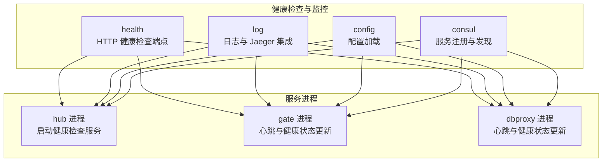
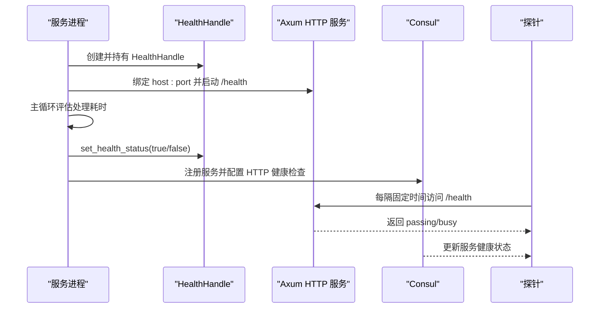
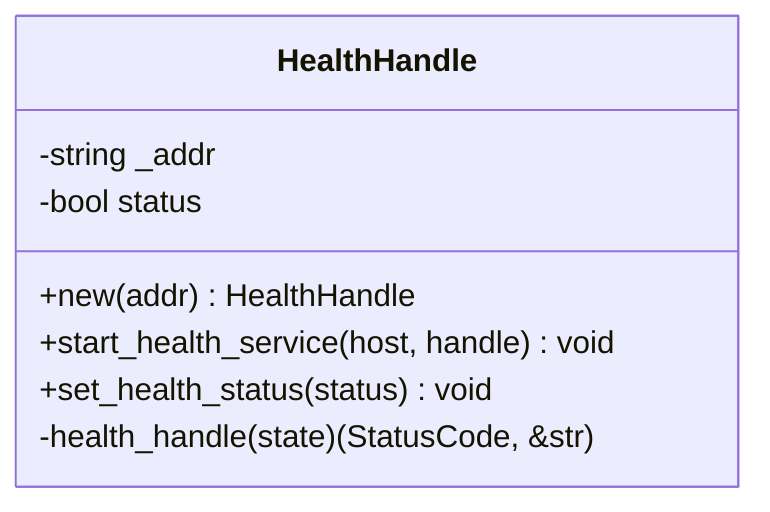
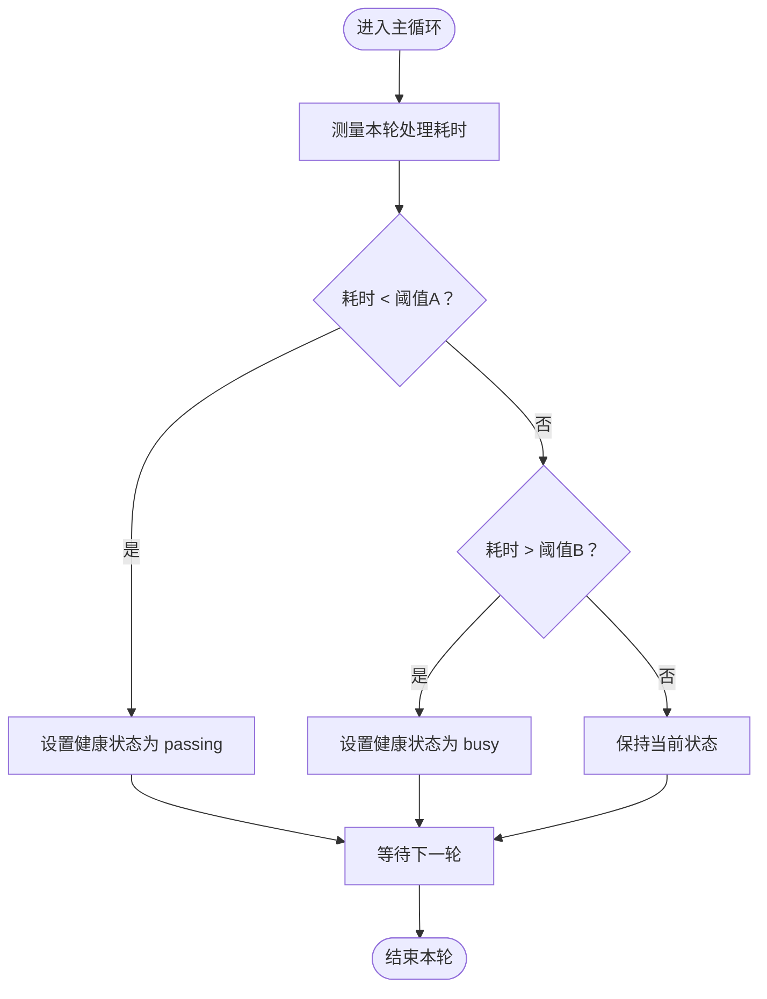
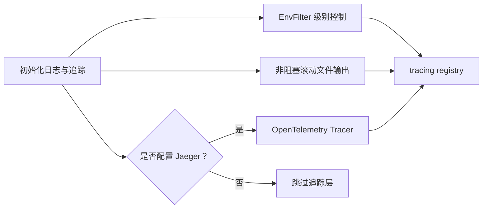
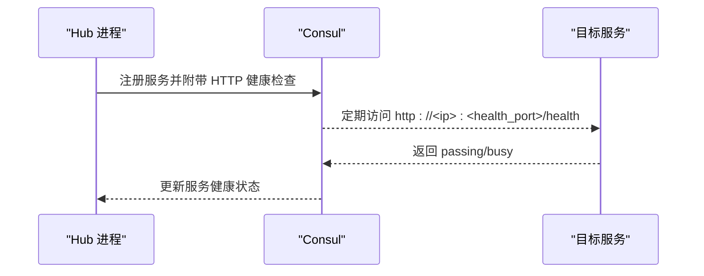
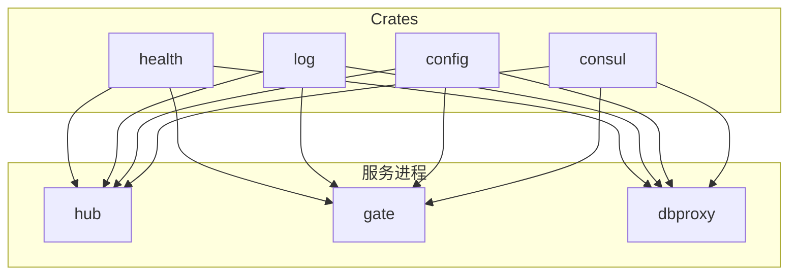

# 健康检查与监控

<cite>
**本文引用的文件**   
- [crates/health/src/lib.rs](file://crates/health/src/lib.rs)
- [crates/log/src/lib.rs](file://crates/log/src/lib.rs)
- [crates/config/src/lib.rs](file://crates/config/src/lib.rs)
- [crates/consul/src/lib.rs](file://crates/consul/src/lib.rs)
- [server/lib/hub/src/lib.rs](file://server/lib/hub/src/lib.rs)
- [server/lib/gate/src/lib.rs](file://server/lib/gate/src/lib.rs)
- [server/lib/dbproxy/src/lib.rs](file://server/lib/dbproxy/src/lib.rs)
- [server/lib/gate/src/client_proxy_manager.rs](file://server/lib/gate/src/client_proxy_manager.rs)
- [crates/log/Cargo.toml](file://crates/log/Cargo.toml)
- [crates/health/Cargo.toml](file://crates/health/Cargo.toml)
- [crates/config/Cargo.toml](file://crates/config/Cargo.toml)
</cite>

## 目录
1. [简介](#简介)
2. [项目结构](#项目结构)
3. [核心组件](#核心组件)
4. [架构总览](#架构总览)
5. [详细组件分析](#详细组件分析)
6. [依赖关系分析](#依赖关系分析)
7. [性能考量](#性能考量)
8. [故障排查指南](#故障排查指南)
9. [结论](#结论)
10. [附录](#附录)

## 简介
本文件面向运维与开发团队，系统化阐述健康检查与监控体系的设计与实现，覆盖以下关键主题：
- HTTP 健康检查端点与服务状态报告
- 健康检查触发机制、检查间隔与失败重试策略
- 监控数据采集、存储与可视化方案
- 日志系统集成与日志级别管理
- 性能监控关键指标与阈值建议
- 健康检查告警机制与故障通知流程
- 在服务网格中的作用与与外部监控系统（如 Consul、Jaeger）的集成

## 项目结构
该仓库采用多 Crate 的模块化组织，健康检查与监控相关能力主要分布在以下模块：
- health：提供 HTTP 健康检查端点与状态管理
- log：统一日志初始化与 OpenTelemetry Jaeger 集成
- config：配置加载工具
- consul：服务注册与发现（用于健康检查探针）
- hub/gate/dbproxy：各服务进程内运行健康检查服务并上报状态

**图表来源**
- [crates/health/src/lib.rs:1-51](file://crates/health/src/lib.rs#L1-L51)
- [crates/log/src/lib.rs:1-35](file://crates/log/src/lib.rs#L1-L35)
- [crates/config/src/lib.rs:1-13](file://crates/config/src/lib.rs#L1-L13)
- [crates/consul/src/lib.rs:1-120](file://crates/consul/src/lib.rs#L1-L120)
- [server/lib/hub/src/lib.rs:140-170](file://server/lib/hub/src/lib.rs#L140-L170)
- [server/lib/gate/src/lib.rs:156-200](file://server/lib/gate/src/lib.rs#L156-L200)
- [server/lib/dbproxy/src/lib.rs:156-178](file://server/lib/dbproxy/src/lib.rs#L156-L178)

**章节来源**
- [crates/health/src/lib.rs:1-51](file://crates/health/src/lib.rs#L1-L51)
- [crates/log/src/lib.rs:1-35](file://crates/log/src/lib.rs#L1-L35)
- [crates/config/src/lib.rs:1-13](file://crates/config/src/lib.rs#L1-L13)
- [crates/consul/src/lib.rs:1-120](file://crates/consul/src/lib.rs#L1-L120)
- [server/lib/hub/src/lib.rs:140-170](file://server/lib/hub/src/lib.rs#L140-L170)
- [server/lib/gate/src/lib.rs:156-200](file://server/lib/gate/src/lib.rs#L156-L200)
- [server/lib/dbproxy/src/lib.rs:156-178](file://server/lib/dbproxy/src/lib.rs#L156-L178)

## 核心组件
- 健康检查处理器（HealthHandle）
  - 提供 /health GET 接口，返回 passing 或 busy，并记录日志
  - 支持通过 set_health_status 主动设置健康状态
- 健康检查服务（Axum 路由）
  - 绑定 TCP 监听地址，启动 HTTP 服务
- 日志与链路追踪（log）
  - 初始化日志、滚动文件输出、可选 Jaeger OpenTelemetry 集成
- 配置加载（config）
  - 从 JSON 文件读取并反序列化为结构化配置
- 服务注册与发现（consul）
  - 将服务注册到 Consul，配置 HTTP 健康检查探针
- 服务进程中的健康状态更新
  - hub/gate/dbproxy 在主循环中根据处理耗时动态设置健康状态

**章节来源**
- [crates/health/src/lib.rs:12-51](file://crates/health/src/lib.rs#L12-L51)
- [crates/log/src/lib.rs:8-35](file://crates/log/src/lib.rs#L8-L35)
- [crates/config/src/lib.rs:5-13](file://crates/config/src/lib.rs#L5-L13)
- [crates/consul/src/lib.rs:1-120](file://crates/consul/src/lib.rs#L1-L120)
- [server/lib/hub/src/lib.rs:140-170](file://server/lib/hub/src/lib.rs#L140-L170)
- [server/lib/gate/src/lib.rs:156-200](file://server/lib/gate/src/lib.rs#L156-L200)
- [server/lib/dbproxy/src/lib.rs:156-178](file://server/lib/dbproxy/src/lib.rs#L156-L178)

## 架构总览
健康检查与监控的整体流程如下：
- 各服务进程启动时，初始化日志与 Jaeger（可选），并创建 HealthHandle 实例
- 在独立线程/任务中启动 Axum HTTP 服务，监听 /health 端点
- 服务主循环周期性评估自身处理耗时，动态更新健康状态
- Hub 进程将服务注册到 Consul，配置 HTTP 健康检查探针（如每 10 秒一次）

**图表来源**
- [server/lib/hub/src/lib.rs:140-170](file://server/lib/hub/src/lib.rs#L140-L170)
- [server/lib/hub/src/lib.rs:246-266](file://server/lib/hub/src/lib.rs#L246-L266)
- [crates/health/src/lib.rs:34-44](file://crates/health/src/lib.rs#L34-L44)
- [crates/health/src/lib.rs:22-32](file://crates/health/src/lib.rs#L22-L32)

**章节来源**
- [server/lib/hub/src/lib.rs:140-170](file://server/lib/hub/src/lib.rs#L140-L170)
- [server/lib/hub/src/lib.rs:246-266](file://server/lib/hub/src/lib.rs#L246-L266)
- [crates/health/src/lib.rs:22-44](file://crates/health/src/lib.rs#L22-L44)

## 详细组件分析

### 健康检查处理器（HealthHandle）
- 结构与职责
  - 持有监听地址与布尔型健康状态
  - 提供 /health 路由处理函数，按状态返回不同 HTTP 状态码
  - 提供 set_health_status 接口以主动更新状态
- 启动流程
  - 通过 Router::new().route(...) 注册 /health
  - 使用 TcpListener 绑定 host 并启动服务
- 线程模型
  - 服务端使用 tokio::net::TcpListener
  - 处理函数通过 Mutex 包裹共享状态，保证并发安全

**图表来源**
- [crates/health/src/lib.rs:12-51](file://crates/health/src/lib.rs#L12-L51)

**章节来源**
- [crates/health/src/lib.rs:12-51](file://crates/health/src/lib.rs#L12-L51)

### 服务进程中的健康状态更新
- Hub 进程
  - 启动独立 Tokio Runtime 执行健康检查服务
  - 注册服务时配置 HTTP 健康检查探针（例如 10s 间隔）
- Gate 进程
  - 主循环中根据单次处理耗时动态设置健康状态
  - 采用阈值策略：快速路径设为 passing，超时路径设为 busy
- DBProxy 进程
  - 逻辑与 Gate 类似，依据处理耗时更新健康状态

**图表来源**
- [server/lib/gate/src/lib.rs:156-200](file://server/lib/gate/src/lib.rs#L156-L200)
- [server/lib/dbproxy/src/lib.rs:156-178](file://server/lib/dbproxy/src/lib.rs#L156-L178)

**章节来源**
- [server/lib/hub/src/lib.rs:140-170](file://server/lib/hub/src/lib.rs#L140-L170)
- [server/lib/gate/src/lib.rs:156-200](file://server/lib/gate/src/lib.rs#L156-L200)
- [server/lib/dbproxy/src/lib.rs:156-178](file://server/lib/dbproxy/src/lib.rs#L156-L178)

### 日志系统与链路追踪集成
- 日志初始化
  - 支持基于环境变量的过滤级别
  - 使用非阻塞滚动文件输出，每日轮转
- 链路追踪
  - 可选 Jaeger Agent 批量导出
  - 通过 tracing-opentelemetry 将日志与追踪打通
- 服务命名
  - 可选传入服务名，便于在 Jaeger 中识别

**图表来源**
- [crates/log/src/lib.rs:8-35](file://crates/log/src/lib.rs#L8-L35)

**章节来源**
- [crates/log/src/lib.rs:8-35](file://crates/log/src/lib.rs#L8-L35)

### 服务注册与健康检查探针
- Hub 进程在注册服务时，为每个服务配置 HTTP 健康检查探针
- 探针使用服务本地 IP 与健康检查端口，定期访问 /health
- Consul 根据探针结果更新服务健康状态，影响服务发现与负载均衡

**图表来源**
- [server/lib/hub/src/lib.rs:246-266](file://server/lib/hub/src/lib.rs#L246-L266)

**章节来源**
- [server/lib/hub/src/lib.rs:246-266](file://server/lib/hub/src/lib.rs#L246-L266)

### 配置加载与服务启动
- 配置文件采用 JSON 格式，包含日志级别、日志目录/文件、Jaeger 地址、健康检查端口等
- 服务启动时加载配置并初始化日志、健康检查服务与 Consul 注册

**章节来源**
- [crates/config/src/lib.rs:5-13](file://crates/config/src/lib.rs#L5-L13)
- [server/lib/hub/src/lib.rs:126-141](file://server/lib/hub/src/lib.rs#L126-L141)
- [server/lib/gate/src/lib.rs:74-90](file://server/lib/gate/src/lib.rs#L74-L90)
- [server/lib/dbproxy/src/lib.rs:108-114](file://server/lib/dbproxy/src/lib.rs#L108-L114)

## 依赖关系分析
- 语言与运行时
  - Rust 生态：tokio、axum、tracing、opentelemetry
- 关键依赖
  - health：axum、tokio、tracing
  - log：tracing-subscriber、tracing-appender、opentelemetry-jaeger、tracing-opentelemetry
  - config：serde、serde_json
- 服务间耦合
  - hub/gate/dbproxy 通过 HealthHandle 共享健康状态
  - hub 通过 consul 将服务注册到服务网格

**图表来源**
- [crates/health/Cargo.toml:8-11](file://crates/health/Cargo.toml#L8-L11)
- [crates/log/Cargo.toml:8-15](file://crates/log/Cargo.toml#L8-L15)
- [crates/config/Cargo.toml:8-10](file://crates/config/Cargo.toml#L8-L10)
- [server/lib/hub/src/lib.rs:140-170](file://server/lib/hub/src/lib.rs#L140-L170)
- [server/lib/gate/src/lib.rs:156-200](file://server/lib/gate/src/lib.rs#L156-L200)
- [server/lib/dbproxy/src/lib.rs:156-178](file://server/lib/dbproxy/src/lib.rs#L156-L178)

**章节来源**
- [crates/health/Cargo.toml:8-11](file://crates/health/Cargo.toml#L8-L11)
- [crates/log/Cargo.toml:8-15](file://crates/log/Cargo.toml#L8-L15)
- [crates/config/Cargo.toml:8-10](file://crates/config/Cargo.toml#L8-L10)

## 性能考量
- 健康检查触发机制
  - 服务主循环周期性评估处理耗时，动态设置健康状态
  - Gate 与 DBProxy 使用阈值策略：快速路径（< 33ms）设为 passing；超时路径（> 100ms 或 256ms）设为 busy
- 检查间隔与失败重试
  - Consul 探针默认 10s 间隔访问 /health
  - 失败重试策略由 Consul 内部实现决定，通常为指数退避
- 日志与追踪开销
  - 非阻塞滚动文件输出降低 IO 压力
  - Jaeger 批量导出减少网络往返开销
- 建议
  - 将阈值与业务 SLA 对齐，避免误报或漏报
  - 在高负载场景下适当放宽阈值，避免频繁切换状态

**章节来源**
- [server/lib/gate/src/lib.rs:184-192](file://server/lib/gate/src/lib.rs#L184-L192)
- [server/lib/dbproxy/src/lib.rs:168-176](file://server/lib/dbproxy/src/lib.rs#L168-L176)
- [server/lib/hub/src/lib.rs:256-262](file://server/lib/hub/src/lib.rs#L256-L262)
- [crates/log/src/lib.rs:8-35](file://crates/log/src/lib.rs#L8-L35)

## 故障排查指南
- 健康检查端点不可用
  - 检查健康检查服务是否启动（端口占用、绑定地址）
  - 查看 /health 返回状态（passing/busy），结合日志定位问题
- Consul 健康检查失败
  - 确认探针 URL 正确（本地 IP 与健康端口）
  - 检查服务进程是否正常运行且未被限流
- 日志与追踪异常
  - 检查日志级别与文件路径配置
  - 若启用 Jaeger，确认 Agent 地址可达且服务名正确
- 服务迁移与连接断开
  - Gate 进程在客户端断连后清理 Hub 连接，确保无悬挂连接
  - 检查锁与缓存键过期逻辑，避免资源泄漏

**章节来源**
- [crates/health/src/lib.rs:22-44](file://crates/health/src/lib.rs#L22-L44)
- [server/lib/hub/src/lib.rs:246-266](file://server/lib/hub/src/lib.rs#L246-L266)
- [crates/log/src/lib.rs:8-35](file://crates/log/src/lib.rs#L8-L35)
- [server/lib/gate/src/client_proxy_manager.rs:189-203](file://server/lib/gate/src/client_proxy_manager.rs#L189-L203)

## 结论
本健康检查与监控方案以轻量、可插拔为核心设计原则：
- 通过 HealthHandle 提供统一的 HTTP 健康检查接口
- 服务进程内动态评估健康状态，结合 Consul 探针形成闭环
- 日志与 Jaeger 集成满足可观测性需求
- 阈值策略与检查间隔可根据业务 SLA 调整，兼顾准确性与稳定性

## 附录

### 关键指标与阈值建议
- 处理耗时（毫秒）
  - passing：< 33 ms（快速路径）
  - busy：> 100 ms 或 > 256 ms（超时路径）
- 探针间隔
  - Consul 探针：10s（可按需调整）
- 健康状态切换
  - 避免频繁抖动，可在状态变更前引入短时窗口判断

### 告警机制与故障通知流程
- 告警规则
  - 连续 N 次 /health 返回 busy
  - 探针超时或连接失败
  - 服务实例健康状态持续不通过
- 通知渠道
  - 邮件、IM、电话等（结合现有运维平台）
- 自动恢复
  - 服务恢复后自动回切至 passing 状态

### 服务网格中的作用
- 作为服务网格的健康探针，Consul 将健康状态纳入服务发现与路由决策
- 与 Jaeger 集成后，健康事件可与链路追踪关联，辅助根因分析