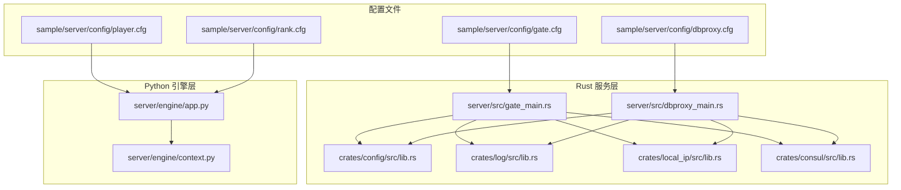
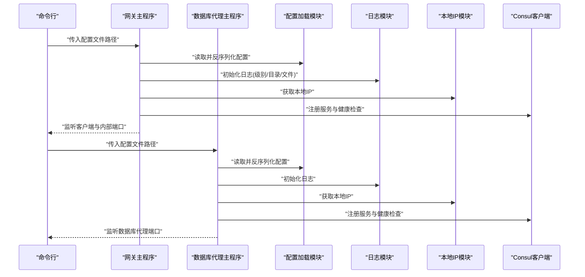
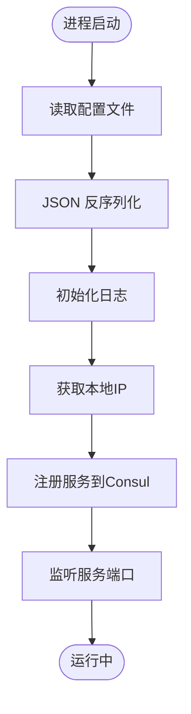
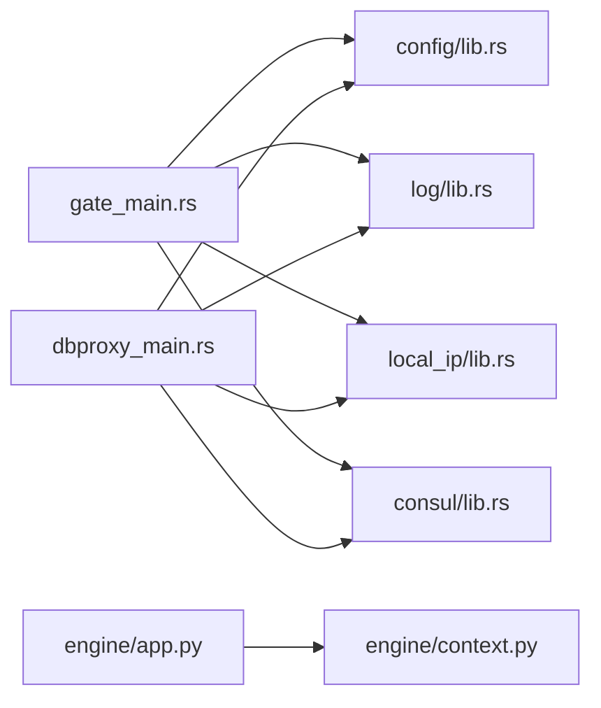

# 动态配置管理系统

<cite>
**本文引用的文件**
- [crates/config/src/lib.rs](file://crates/config/src/lib.rs)
- [server/src/gate_main.rs](file://server/src/gate_main.rs)
- [server/src/dbproxy_main.rs](file://server/src/dbproxy_main.rs)
- [sample/server/config/gate.cfg](file://sample/server/config/gate.cfg)
- [sample/server/config/dbproxy.cfg](file://sample/server/config/dbproxy.cfg)
- [sample/server/config/player.cfg](file://sample/server/config/player.cfg)
- [sample/server/config/rank.cfg](file://sample/server/config/rank.cfg)
- [server/engine/app.py](file://server/engine/app.py)
- [server/engine/context.py](file://server/engine/context.py)
- [crates/log/src/lib.rs](file://crates/log/src/lib.rs)
- [crates/local_ip/src/lib.rs](file://crates/local_ip/src/lib.rs)
- [crates/consul/src/lib.rs](file://crates/consul/src/lib.rs)
</cite>

## 目录
1. [简介](#简介)
2. [项目结构](#项目结构)
3. [核心组件](#核心组件)
4. [架构总览](#架构总览)
5. [详细组件分析](#详细组件分析)
6. [依赖关系分析](#依赖关系分析)
7. [性能考量](#性能考量)
8. [故障排查指南](#故障排查指南)
9. [结论](#结论)
10. [附录](#附录)

## 简介
本技术文档面向动态配置管理系统，系统支持多种服务类型（网关、数据库代理、玩家服务、排行榜服务）的配置加载、热更新与版本控制，并提供配置验证、默认值与合并策略、模板使用与最佳实践、环境隔离与多环境部署、配置继承、审计与回滚建议，以及配置热加载、同步与一致性的保障方案。本文档在不直接展示代码内容的前提下，通过源码路径与图示帮助开发者快速理解并正确使用该系统。

## 项目结构
系统采用多语言混合架构：Rust 实现的服务主程序负责配置加载与注册；Python 引擎用于业务逻辑与运行时管理；共享的配置模块提供通用 JSON 配置读取能力；日志与本地 IP 模块提供运行期支撑；Consul 客户端模块负责服务注册与发现。

**图表来源**
- [server/src/gate_main.rs:1-117](file://server/src/gate_main.rs#L1-L117)
- [server/src/dbproxy_main.rs:1-78](file://server/src/dbproxy_main.rs#L1-L78)
- [crates/config/src/lib.rs:1-13](file://crates/config/src/lib.rs#L1-L13)
- [crates/log/src/lib.rs:1-35](file://crates/log/src/lib.rs#L1-L35)
- [crates/local_ip/src/lib.rs:1-9](file://crates/local_ip/src/lib.rs#L1-L9)
- [crates/consul/src/lib.rs:1-66](file://crates/consul/src/lib.rs#L1-L66)
- [server/engine/app.py:1-233](file://server/engine/app.py#L1-L233)
- [server/engine/context.py:1-173](file://server/engine/context.py#L1-L173)
- [sample/server/config/gate.cfg:1-12](file://sample/server/config/gate.cfg#L1-L12)
- [sample/server/config/dbproxy.cfg:1-13](file://sample/server/config/dbproxy.cfg#L1-L13)
- [sample/server/config/player.cfg:1-12](file://sample/server/config/player.cfg#L1-L12)
- [sample/server/config/rank.cfg:1-12](file://sample/server/config/rank.cfg#L1-L12)

**章节来源**
- [server/src/gate_main.rs:1-117](file://server/src/gate_main.rs#L1-L117)
- [server/src/dbproxy_main.rs:1-78](file://server/src/dbproxy_main.rs#L1-L78)
- [crates/config/src/lib.rs:1-13](file://crates/config/src/lib.rs#L1-L13)
- [crates/log/src/lib.rs:1-35](file://crates/log/src/lib.rs#L1-L35)
- [crates/local_ip/src/lib.rs:1-9](file://crates/local_ip/src/lib.rs#L1-L9)
- [crates/consul/src/lib.rs:1-66](file://crates/consul/src/lib.rs#L1-L66)
- [server/engine/app.py:1-233](file://server/engine/app.py#L1-L233)
- [server/engine/context.py:1-173](file://server/engine/context.py#L1-L173)
- [sample/server/config/gate.cfg:1-12](file://sample/server/config/gate.cfg#L1-L12)
- [sample/server/config/dbproxy.cfg:1-13](file://sample/server/config/dbproxy.cfg#L1-L13)
- [sample/server/config/player.cfg:1-12](file://sample/server/config/player.cfg#L1-L12)
- [sample/server/config/rank.cfg:1-12](file://sample/server/config/rank.cfg#L1-L12)

## 核心组件
- 配置加载模块（Rust）
  - 提供从文件读取配置文本与基于 serde 的 JSON 反序列化能力，作为所有 Rust 服务的统一配置入口。
  - 关键函数路径：[crates/config/src/lib.rs:5-12](file://crates/config/src/lib.rs#L5-L12)
- 服务主程序（Rust）
  - 网关服务与数据库代理服务均通过命令行参数接收配置文件路径，调用配置加载模块解析后初始化日志、健康检查、Consul 注册与服务实例。
  - 关键路径：
    - [server/src/gate_main.rs:34-54](file://server/src/gate_main.rs#L34-L54)
    - [server/src/dbproxy_main.rs:15-36](file://server/src/dbproxy_main.rs#L15-L36)
- Python 引擎
  - 应用启动时加载配置字典，初始化上下文、连接池与各类管理器，提供分布式锁、消息泵轮询等运行时能力。
  - 关键路径：[server/engine/app.py:83-100](file://server/engine/app.py#L83-L100)
- 日志模块（Rust）
  - 基于 tracing 与 rolling 文件输出，支持按级别过滤与可选 Jaeger 追踪注入。
  - 关键路径：[crates/log/src/lib.rs:8-35](file://crates/log/src/lib.rs#L8-L35)
- 本地 IP 获取（Rust）
  - 支持容器环境变量覆盖，兼容 K8s Pod IP 场景。
  - 关键路径：[crates/local_ip/src/lib.rs:4-8](file://crates/local_ip/src/lib.rs#L4-L8)
- Consul 客户端（Rust）
  - 提供服务注册与服务列表查询能力，用于服务发现与健康检查。
  - 关键路径：[crates/consul/src/lib.rs:30-65](file://crates/consul/src/lib.rs#L30-L65)

**章节来源**
- [crates/config/src/lib.rs:1-13](file://crates/config/src/lib.rs#L1-L13)
- [server/src/gate_main.rs:1-117](file://server/src/gate_main.rs#L1-L117)
- [server/src/dbproxy_main.rs:1-78](file://server/src/dbproxy_main.rs#L1-L78)
- [server/engine/app.py:1-233](file://server/engine/app.py#L1-L233)
- [crates/log/src/lib.rs:1-35](file://crates/log/src/lib.rs#L1-L35)
- [crates/local_ip/src/lib.rs:1-9](file://crates/local_ip/src/lib.rs#L1-L9)
- [crates/consul/src/lib.rs:1-66](file://crates/consul/src/lib.rs#L1-L66)

## 架构总览
系统采用“配置即契约”的设计：各服务启动时读取本地 JSON 配置，完成日志、健康检查、服务注册与监听端口初始化。Python 引擎在运行期负责业务实体生命周期与消息处理，同时通过上下文与服务管理器协调跨服务交互。

**图表来源**
- [server/src/gate_main.rs:34-86](file://server/src/gate_main.rs#L34-L86)
- [server/src/dbproxy_main.rs:15-68](file://server/src/dbproxy_main.rs#L15-L68)
- [crates/config/src/lib.rs:5-12](file://crates/config/src/lib.rs#L5-L12)
- [crates/log/src/lib.rs:8-35](file://crates/log/src/lib.rs#L8-L35)
- [crates/local_ip/src/lib.rs:4-8](file://crates/local_ip/src/lib.rs#L4-L8)
- [crates/consul/src/lib.rs:30-65](file://crates/consul/src/lib.rs#L30-L65)

## 详细组件分析

### 配置文件格式与参数说明
- 通用字段
  - namespace: 服务命名空间，用于区分环境或租户
  - consul_url: Consul 地址，用于服务注册与发现
  - health_port: 健康检查端口
  - log_level: 日志级别
  - log_file: 日志文件名
  - log_dir: 日志目录
- 网关服务（gate.cfg）
  - redis_url: Redis 连接地址
  - service_port: 网关对外服务端口
  - client_tcp_port: 客户端 TCP 端口
  - client_ws_port: 客户端 WebSocket 端口
  - 参考路径：[sample/server/config/gate.cfg:1-12](file://sample/server/config/gate.cfg#L1-L12)
- 数据库代理（dbproxy.cfg）
  - redis_url: Redis 连接地址
  - mongo_url: MongoDB 连接地址
  - guid: GUID 分配集合定义
  - index: 索引定义列表
  - service_port: 代理服务端口
  - 参考路径：[sample/server/config/dbproxy.cfg:1-13](file://sample/server/config/dbproxy.cfg#L1-L13)
- 玩家服务（player.cfg）
  - redis_url: Redis 连接地址
  - save_time_interval: 存档间隔
  - migrate_time_interval: 迁移间隔
  - service_port: 服务端口
  - 参考路径：[sample/server/config/player.cfg:1-12](file://sample/server/config/player.cfg#L1-L12)
- 排行榜服务（rank.cfg）
  - redis_url: Redis 连接地址
  - save_time_interval: 存档间隔
  - migrate_time_interval: 迁移间隔
  - service_port: 服务端口
  - 参考路径：[sample/server/config/rank.cfg:1-12](file://sample/server/config/rank.cfg#L1-L12)

**章节来源**
- [sample/server/config/gate.cfg:1-12](file://sample/server/config/gate.cfg#L1-L12)
- [sample/server/config/dbproxy.cfg:1-13](file://sample/server/config/dbproxy.cfg#L1-L13)
- [sample/server/config/player.cfg:1-12](file://sample/server/config/player.cfg#L1-L12)
- [sample/server/config/rank.cfg:1-12](file://sample/server/config/rank.cfg#L1-L12)

### 配置加载机制
- Rust 侧
  - 通过命令行参数接收配置文件路径，调用配置加载模块读取并反序列化为强类型结构体，随后初始化日志、健康检查与服务注册。
  - 关键路径：
    - [server/src/gate_main.rs:34-54](file://server/src/gate_main.rs#L34-L54)
    - [server/src/dbproxy_main.rs:15-36](file://server/src/dbproxy_main.rs#L15-L36)
    - [crates/config/src/lib.rs:5-12](file://crates/config/src/lib.rs#L5-L12)
- Python 侧
  - 启动时直接读取 JSON 配置为字典，初始化上下文与 Redis 连接池。
  - 关键路径：[server/engine/app.py:83-100](file://server/engine/app.py#L83-L100)

**图表来源**
- [server/src/gate_main.rs:34-86](file://server/src/gate_main.rs#L34-L86)
- [server/src/dbproxy_main.rs:15-68](file://server/src/dbproxy_main.rs#L15-L68)
- [crates/config/src/lib.rs:5-12](file://crates/config/src/lib.rs#L5-L12)
- [crates/local_ip/src/lib.rs:4-8](file://crates/local_ip/src/lib.rs#L4-L8)
- [crates/consul/src/lib.rs:30-65](file://crates/consul/src/lib.rs#L30-L65)

**章节来源**
- [server/src/gate_main.rs:1-117](file://server/src/gate_main.rs#L1-L117)
- [server/src/dbproxy_main.rs:1-78](file://server/src/dbproxy_main.rs#L1-L78)
- [crates/config/src/lib.rs:1-13](file://crates/config/src/lib.rs#L1-L13)
- [server/engine/app.py:1-233](file://server/engine/app.py#L1-L233)

### 热更新策略与版本控制
- 当前实现
  - Rust 服务在启动时一次性读取配置并注册服务；未见内置的配置热重载或版本控制逻辑。
  - Python 引擎未见配置热更新实现。
- 建议方案
  - 版本控制：在配置文件中增加 version 字段，配合外部存储（如 Consul KV 或 GitOps）进行版本追踪。
  - 热更新：引入定时轮询或事件订阅（如 Consul Watch/Kubernetes ConfigMap）触发配置重新加载；对关键配置变更采用渐进式生效与回滚。
  - 一致性：通过分布式锁与原子替换确保配置切换期间的读写一致性。

[本节为概念性建议，不直接分析具体文件，故无章节来源]

### 验证、默认值与合并逻辑
- 验证
  - Rust 使用 serde 对 JSON 结构进行强类型反序列化，字段缺失或类型不匹配会直接失败，起到基础验证作用。
  - 参考路径：[crates/config/src/lib.rs:10-12](file://crates/config/src/lib.rs#L10-L12)
- 默认值
  - 当前未见显式的默认值设置逻辑；建议在结构体上使用 serde 的 default 属性或自定义构造函数提供默认值。
- 合并
  - 未见配置合并实现；建议在应用启动阶段对基础配置与环境覆盖配置进行合并，避免硬编码覆盖。

**章节来源**
- [crates/config/src/lib.rs:1-13](file://crates/config/src/lib.rs#L1-L13)

### 配置模板与最佳实践
- 模板建议
  - 为每类服务提供最小可用模板，包含必填字段与推荐默认值。
  - 将环境相关字段（如 consul_url、redis_url、mongo_url）通过环境变量注入，减少硬编码。
- 最佳实践
  - 使用 namespace 区分环境（dev/staging/prod），并在 Consul 中按命名空间隔离。
  - 将日志目录与文件名分离，便于集中采集与轮转。
  - 为每个服务分配独立的 health_port 并启用健康检查。
  - 在容器环境中优先使用 K8S_POD_IP 环境变量，确保服务注册地址正确。

[本节为通用指导，不直接分析具体文件，故无章节来源]

### 环境隔离、多环境部署与继承
- 环境隔离
  - 通过 namespace 与 Consul 命名空间结合，实现服务与配置的逻辑隔离。
- 多环境部署
  - 不同环境使用不同配置文件或同一模板的不同实例；通过 CI/CD 自动注入环境变量。
- 继承机制
  - 建议在应用层实现“基础配置 + 环境覆盖”的叠加策略，避免重复配置。

[本节为通用指导，不直接分析具体文件，故无章节来源]

### 审计日志与回滚策略
- 审计日志
  - 建议记录配置变更时间、操作者、变更前后对比与生效状态。
- 回滚策略
  - 保留最近 N 个配置版本；变更失败时自动回退至上一版本；支持人工干预强制回滚。

[本节为通用指导，不直接分析具体文件，故无章节来源]

### 配置热加载、同步与一致性保障
- 热加载
  - 引入配置中心（如 Consul KV）与 Watch 机制，变更时触发重新加载。
- 同步
  - 通过分布式锁在多副本间串行化配置更新，避免脑裂。
- 一致性
  - 更新采用原子替换与校验（如校验配置哈希），确保所有节点最终一致。

[本节为通用指导，不直接分析具体文件，故无章节来源]

## 依赖关系分析
- Rust 服务依赖链
  - gate_main/dbproxy_main 依赖 config、log、local_ip、consul 模块。
  - Consul 依赖 serde 与 consulrs。
- Python 引擎依赖链
  - app.py 依赖 context.py 与各类业务模块；通过 Redis 连接池访问缓存。

**图表来源**
- [server/src/gate_main.rs:13-16](file://server/src/gate_main.rs#L13-L16)
- [server/src/dbproxy_main.rs:10-13](file://server/src/dbproxy_main.rs#L10-L13)
- [crates/config/src/lib.rs:1-13](file://crates/config/src/lib.rs#L1-L13)
- [crates/log/src/lib.rs:1-35](file://crates/log/src/lib.rs#L1-L35)
- [crates/local_ip/src/lib.rs:1-9](file://crates/local_ip/src/lib.rs#L1-L9)
- [crates/consul/src/lib.rs:1-66](file://crates/consul/src/lib.rs#L1-L66)
- [server/engine/app.py:1-233](file://server/engine/app.py#L1-L233)
- [server/engine/context.py:1-173](file://server/engine/context.py#L1-L173)

**章节来源**
- [server/src/gate_main.rs:1-117](file://server/src/gate_main.rs#L1-L117)
- [server/src/dbproxy_main.rs:1-78](file://server/src/dbproxy_main.rs#L1-L78)
- [crates/config/src/lib.rs:1-13](file://crates/config/src/lib.rs#L1-L13)
- [crates/log/src/lib.rs:1-35](file://crates/log/src/lib.rs#L1-L35)
- [crates/local_ip/src/lib.rs:1-9](file://crates/local_ip/src/lib.rs#L1-L9)
- [crates/consul/src/lib.rs:1-66](file://crates/consul/src/lib.rs#L1-L66)
- [server/engine/app.py:1-233](file://server/engine/app.py#L1-L233)
- [server/engine/context.py:1-173](file://server/engine/context.py#L1-L173)

## 性能考量
- 配置读取
  - JSON 解析与文件 IO 成本较低，建议在启动阶段完成，避免频繁磁盘访问。
- 日志
  - 使用非阻塞滚动文件输出，避免 I/O 影响服务性能。
- 服务注册
  - Consul 注册与健康检查采用异步任务，不影响主线程处理。

[本节为通用指导，不直接分析具体文件，故无章节来源]

## 故障排查指南
- 配置加载失败
  - 检查配置文件路径与权限；确认 JSON 格式与字段类型正确。
  - 参考路径：[crates/config/src/lib.rs:5-12](file://crates/config/src/lib.rs#L5-L12)
- 日志无法输出
  - 检查 log_level、log_dir、log_file 是否有效；确认目录存在且可写。
  - 参考路径：[crates/log/src/lib.rs:8-35](file://crates/log/src/lib.rs#L8-L35)
- 服务未注册到 Consul
  - 检查 consul_url 与网络连通性；确认健康检查端口可达。
  - 参考路径：[crates/consul/src/lib.rs:30-65](file://crates/consul/src/lib.rs#L30-L65)
- Python 引擎异常
  - 关注 app.py 中的异常捕获与日志输出，定位业务逻辑问题。
  - 参考路径：[server/engine/app.py:32-34](file://server/engine/app.py#L32-L34)

**章节来源**
- [crates/config/src/lib.rs:1-13](file://crates/config/src/lib.rs#L1-L13)
- [crates/log/src/lib.rs:1-35](file://crates/log/src/lib.rs#L1-L35)
- [crates/consul/src/lib.rs:1-66](file://crates/consul/src/lib.rs#L1-L66)
- [server/engine/app.py:1-233](file://server/engine/app.py#L1-L233)

## 结论
本系统已具备完善的配置加载与服务注册能力，满足多服务场景下的基本需求。为进一步提升运维效率与可靠性，建议补充配置热更新、版本控制、审计与回滚机制，并在应用层实现配置合并与默认值策略，以实现更灵活、安全与可观测的配置管理。

## 附录
- 配置文件示例路径
  - [sample/server/config/gate.cfg:1-12](file://sample/server/config/gate.cfg#L1-L12)
  - [sample/server/config/dbproxy.cfg:1-13](file://sample/server/config/dbproxy.cfg#L1-L13)
  - [sample/server/config/player.cfg:1-12](file://sample/server/config/player.cfg#L1-L12)
  - [sample/server/config/rank.cfg:1-12](file://sample/server/config/rank.cfg#L1-L12)
- 关键实现路径
  - [crates/config/src/lib.rs:1-13](file://crates/config/src/lib.rs#L1-L13)
  - [server/src/gate_main.rs:1-117](file://server/src/gate_main.rs#L1-L117)
  - [server/src/dbproxy_main.rs:1-78](file://server/src/dbproxy_main.rs#L1-L78)
  - [server/engine/app.py:1-233](file://server/engine/app.py#L1-L233)
  - [server/engine/context.py:1-173](file://server/engine/context.py#L1-L173)
  - [crates/log/src/lib.rs:1-35](file://crates/log/src/lib.rs#L1-L35)
  - [crates/local_ip/src/lib.rs:1-9](file://crates/local_ip/src/lib.rs#L1-L9)
  - [crates/consul/src/lib.rs:1-66](file://crates/consul/src/lib.rs#L1-L66)