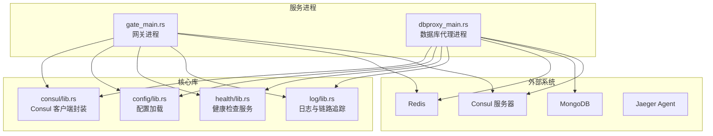
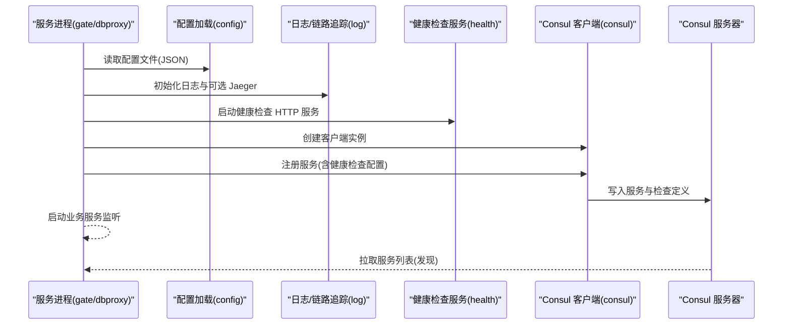
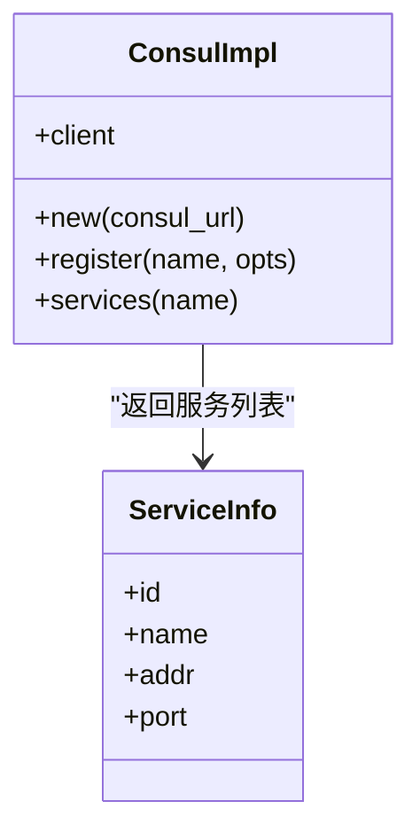
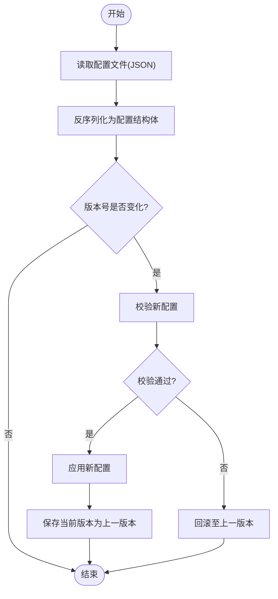
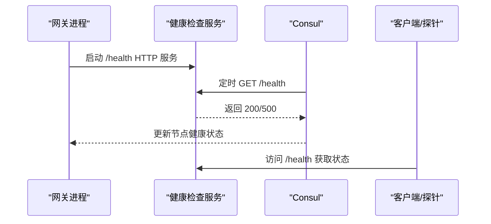
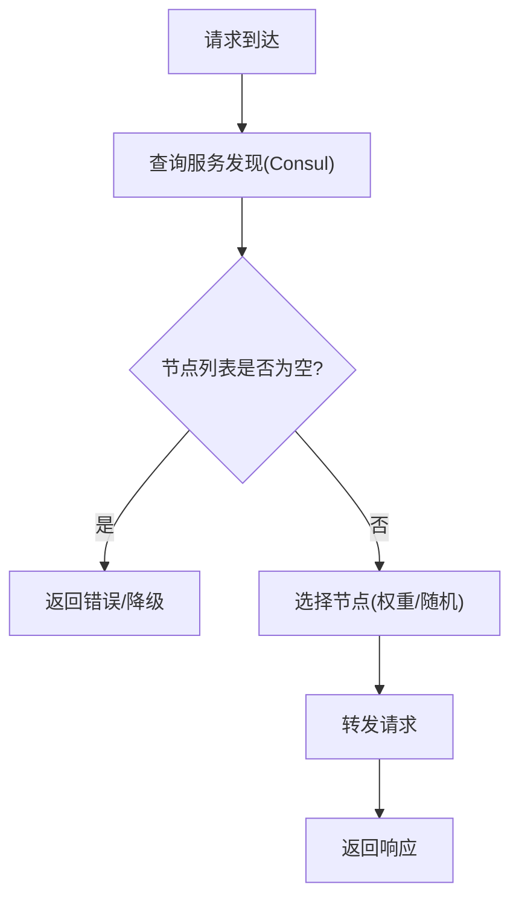
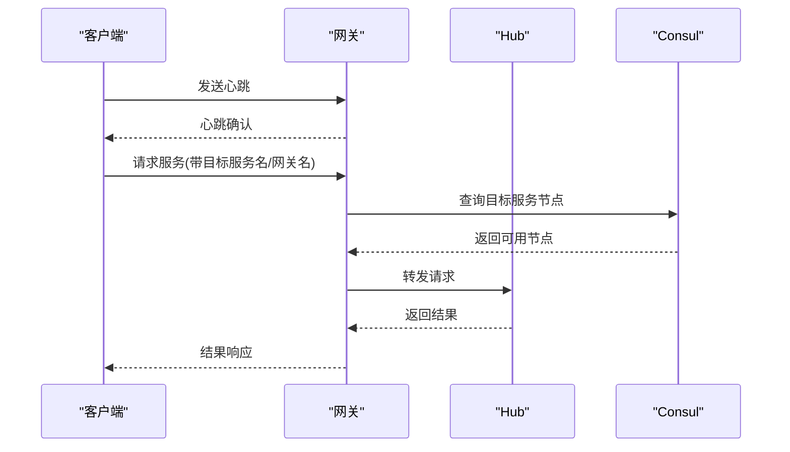
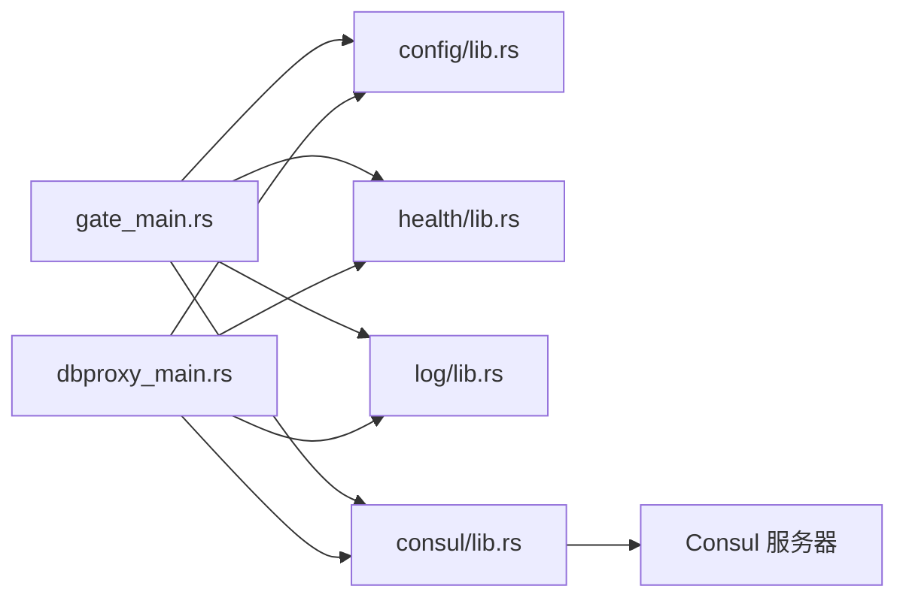

# 服务发现与配置

<cite>
**本文引用的文件**
- [crates/consul/src/lib.rs](file://crates/consul/src/lib.rs)
- [crates/config/src/lib.rs](file://crates/config/src/lib.rs)
- [crates/health/src/lib.rs](file://crates/health/src/lib.rs)
- [crates/log/src/lib.rs](file://crates/log/src/lib.rs)
- [server/src/gate_main.rs](file://server/src/gate_main.rs)
- [server/src/dbproxy_main.rs](file://server/src/dbproxy_main.rs)
- [sample/server/config/gate.cfg](file://sample/server/config/gate.cfg)
- [sample/server/config/dbproxy.cfg](file://sample/server/config/dbproxy.cfg)
- [crates/proto/src/hub.rs](file://crates/proto/src/hub.rs)
- [crates/proto/src/client.rs](file://crates/proto/src/client.rs)
</cite>

## 目录
1. [引言](#引言)
2. [项目结构](#项目结构)
3. [核心组件](#核心组件)
4. [架构总览](#架构总览)
5. [详细组件分析](#详细组件分析)
6. [依赖关系分析](#依赖关系分析)
7. [性能考量](#性能考量)
8. [故障排查指南](#故障排查指南)
9. [结论](#结论)
10. [附录](#附录)

## 引言
本技术文档面向运维工程师与系统管理员，系统性阐述 geese 的服务发现与配置体系：基于 Consul 的服务注册与发现、健康检查与故障剔除策略、动态配置加载与热更新路径、健康检查服务设计与监控指标、服务网格与负载均衡的配置建议、以及安全配置与访问控制要点。文档以代码为依据，结合可视化图示，帮助读者快速理解并落地服务治理方案。

## 项目结构
本项目采用多 crate 的模块化组织，围绕“服务发现”“配置管理”“健康检查”“日志与链路追踪”等主题拆分核心能力，并通过服务进程入口统一编排。关键目录与职责概览：
- crates/consul：封装 Consul 客户端，提供服务注册与服务列表查询能力
- crates/config：提供从文件加载配置数据与反序列化为具体配置结构的能力
- crates/health：提供健康检查 HTTP 服务与状态切换接口
- crates/log：初始化日志与可选 Jaeger 链路追踪
- server/src：各服务进程入口（如 gate、dbproxy），负责读取配置、注册服务、启动健康检查服务与业务服务
- sample/server/config：示例配置文件，展示 Consul 地址、健康端口、日志级别等关键参数

**图表来源**
- [server/src/gate_main.rs:33-117](file://server/src/gate_main.rs#L33-L117)
- [server/src/dbproxy_main.rs:15-78](file://server/src/dbproxy_main.rs#L15-L78)
- [crates/consul/src/lib.rs:1-66](file://crates/consul/src/lib.rs#L1-L66)
- [crates/config/src/lib.rs:1-13](file://crates/config/src/lib.rs#L1-L13)
- [crates/health/src/lib.rs:1-51](file://crates/health/src/lib.rs#L1-L51)
- [crates/log/src/lib.rs:1-35](file://crates/log/src/lib.rs#L1-L35)

**章节来源**
- [server/src/gate_main.rs:33-117](file://server/src/gate_main.rs#L33-L117)
- [server/src/dbproxy_main.rs:15-78](file://server/src/dbproxy_main.rs#L15-L78)
- [crates/consul/src/lib.rs:1-66](file://crates/consul/src/lib.rs#L1-L66)
- [crates/config/src/lib.rs:1-13](file://crates/config/src/lib.rs#L1-L13)
- [crates/health/src/lib.rs:1-51](file://crates/health/src/lib.rs#L1-L51)
- [crates/log/src/lib.rs:1-35](file://crates/log/src/lib.rs#L1-L35)

## 核心组件
- Consul 服务发现封装：提供服务注册与按服务名查询节点列表的能力，用于服务发现与故障剔除
- 动态配置加载：从文件读取 JSON 配置并反序列化为具体结构体，支撑运行时配置读取
- 健康检查服务：提供 HTTP 接口返回服务健康状态，供 Consul 健康检查任务调用
- 日志与链路追踪：支持按环境变量过滤日志级别、滚动写入文件，并可选启用 Jaeger 追踪

**章节来源**
- [crates/consul/src/lib.rs:1-66](file://crates/consul/src/lib.rs#L1-L66)
- [crates/config/src/lib.rs:1-13](file://crates/config/src/lib.rs#L1-L13)
- [crates/health/src/lib.rs:1-51](file://crates/health/src/lib.rs#L1-L51)
- [crates/log/src/lib.rs:1-35](file://crates/log/src/lib.rs#L1-L35)

## 架构总览
下图展示了服务启动到注册、健康检查与对外提供服务的关键流程：

**图表来源**
- [server/src/gate_main.rs:33-117](file://server/src/gate_main.rs#L33-L117)
- [server/src/dbproxy_main.rs:15-78](file://server/src/dbproxy_main.rs#L15-L78)
- [crates/config/src/lib.rs:1-13](file://crates/config/src/lib.rs#L1-L13)
- [crates/health/src/lib.rs:1-51](file://crates/health/src/lib.rs#L1-L51)
- [crates/consul/src/lib.rs:1-66](file://crates/consul/src/lib.rs#L1-L66)

## 详细组件分析

### 组件一：Consul 服务发现与健康检查
- 服务注册
  - 使用 Consul 客户端设置地址后创建客户端实例
  - 通过注册请求构建器注册服务，支持为服务附加健康检查（HTTP 检查、检查间隔、初始状态）
- 服务发现
  - 通过服务名查询具备该服务的所有节点信息，便于后续负载均衡或故障剔除
- 故障剔除策略
  - 健康检查失败将导致 Consul 将节点标记为不健康，从而在服务发现时被剔除

**图表来源**
- [crates/consul/src/lib.rs:1-66](file://crates/consul/src/lib.rs#L1-L66)

**章节来源**
- [crates/consul/src/lib.rs:1-66](file://crates/consul/src/lib.rs#L1-L66)
- [server/src/gate_main.rs:70-86](file://server/src/gate_main.rs#L70-L86)
- [server/src/dbproxy_main.rs:54-68](file://server/src/dbproxy_main.rs#L54-L68)

### 组件二：动态配置管理（热更新与版本控制）
- 配置加载
  - 从文件读取配置文本，再反序列化为具体配置结构体
- 热更新与版本控制
  - 当前实现仅提供静态配置加载；若需热更新与版本控制，建议引入以下机制：
    - 文件变更监控：使用文件系统事件或轮询检测配置文件变更
    - 版本号字段：在配置中增加版本号，服务在加载新配置时对比版本号
    - 回滚机制：保留上一个版本配置，在新配置校验失败时回退
    - 幂等应用：确保配置更新过程对业务无副作用（如连接池重配、缓存刷新）

**图表来源**
- [crates/config/src/lib.rs:1-13](file://crates/config/src/lib.rs#L1-L13)

**章节来源**
- [crates/config/src/lib.rs:1-13](file://crates/config/src/lib.rs#L1-L13)
- [sample/server/config/gate.cfg:1-12](file://sample/server/config/gate.cfg#L1-L12)
- [sample/server/config/dbproxy.cfg:1-13](file://sample/server/config/dbproxy.cfg#L1-L13)

### 组件三：健康检查服务与监控指标
- 健康检查服务
  - 提供 /health 路由，返回 OK 或错误状态码，状态可由业务逻辑切换
  - 服务进程在启动时绑定健康端口并启动 HTTP 服务
- Consul 健康检查
  - 在服务注册时配置 HTTP 健康检查，指定检查间隔与初始状态
  - Consul 定期拉取 /health 接口，根据返回状态决定节点健康与否
- 监控指标建议
  - 健康状态：passing/busing/error
  - 响应时间：/health 延迟
  - 错误率：/health 返回非 200 的次数
  - 重启次数与存活时间：结合进程生命周期统计

**图表来源**
- [crates/health/src/lib.rs:1-51](file://crates/health/src/lib.rs#L1-L51)
- [server/src/gate_main.rs:60-86](file://server/src/gate_main.rs#L60-L86)

**章节来源**
- [crates/health/src/lib.rs:1-51](file://crates/health/src/lib.rs#L1-L51)
- [server/src/gate_main.rs:60-86](file://server/src/gate_main.rs#L60-L86)
- [server/src/dbproxy_main.rs:40-68](file://server/src/dbproxy_main.rs#L40-L68)

### 组件四：服务网格、负载均衡与故障转移
- 服务网格
  - 在服务注册时为服务附加健康检查，使上游网关或路由层能感知节点健康状态
- 负载均衡
  - 通过服务发现获取可用节点列表，结合权重或随机策略进行请求转发
- 故障转移
  - 当节点健康状态异常时，由服务发现返回的节点列表自动剔除该节点，避免流量命中故障节点

**图表来源**
- [crates/consul/src/lib.rs:41-65](file://crates/consul/src/lib.rs#L41-L65)

**章节来源**
- [crates/consul/src/lib.rs:41-65](file://crates/consul/src/lib.rs#L41-L65)

### 组件五：心跳检测与迁移协议（RPC/消息）
- 心跳检测
  - 协议中包含心跳结构体，用于客户端与网关之间的保活通信
- 迁移与转发
  - 协议定义了客户端请求服务、服务转发给 Hub、以及迁移/转移相关的通知与完成消息，支撑跨节点迁移与故障转移场景

**图表来源**
- [crates/proto/src/client.rs:794-853](file://crates/proto/src/client.rs#L794-L853)
- [crates/proto/src/hub.rs:249-318](file://crates/proto/src/hub.rs#L249-L318)
- [crates/proto/src/hub.rs:1097-1120](file://crates/proto/src/hub.rs#L1097-L1120)

**章节来源**
- [crates/proto/src/client.rs:794-853](file://crates/proto/src/client.rs#L794-L853)
- [crates/proto/src/hub.rs:249-318](file://crates/proto/src/hub.rs#L249-L318)
- [crates/proto/src/hub.rs:1097-1120](file://crates/proto/src/hub.rs#L1097-L1120)

### 组件六：安全配置、权限管理与访问控制
- 当前仓库未提供专用的安全模块或鉴权中间件
- 建议在服务边界引入如下机制：
  - 认证与授权：在网关层对接统一认证中心，校验令牌与权限
  - 传输加密：TLS/HTTPS/WSS，结合证书与密钥管理
  - 访问控制：基于角色的权限模型（RBAC）与资源级授权
  - 审计日志：记录关键操作与异常行为
- 与服务发现的结合：仅允许受信服务注册与发现，限制注册白名单与 ACL

[本节为通用实践建议，不直接分析具体文件，故不附“章节来源”]

## 依赖关系分析
- 服务进程依赖配置加载、健康检查、日志与 Consul 客户端
- Consul 客户端依赖外部 Consul 服务器
- 健康检查服务依赖 HTTP 服务器（Axum/Tokio）
- 日志与链路追踪依赖文件系统与可选 Jaeger Agent

**图表来源**
- [server/src/gate_main.rs:1-117](file://server/src/gate_main.rs#L1-L117)
- [server/src/dbproxy_main.rs:1-78](file://server/src/dbproxy_main.rs#L1-L78)
- [crates/config/src/lib.rs:1-13](file://crates/config/src/lib.rs#L1-L13)
- [crates/health/src/lib.rs:1-51](file://crates/health/src/lib.rs#L1-L51)
- [crates/log/src/lib.rs:1-35](file://crates/log/src/lib.rs#L1-L35)
- [crates/consul/src/lib.rs:1-66](file://crates/consul/src/lib.rs#L1-L66)

**章节来源**
- [server/src/gate_main.rs:1-117](file://server/src/gate_main.rs#L1-L117)
- [server/src/dbproxy_main.rs:1-78](file://server/src/dbproxy_main.rs#L1-L78)

## 性能考量
- 健康检查频率与超时：过短的检查间隔会增加服务压力，过长的超时会导致故障感知延迟
- 服务发现缓存：在客户端或网关层缓存服务列表，减少频繁查询 Consul 的开销
- 日志与追踪：生产环境建议降低日志级别与采样率，避免 I/O 与网络放大
- 连接池与并发：合理配置 Redis/MongoDB 连接池大小与超时，避免阻塞与抖动

[本节提供通用指导，不直接分析具体文件，故不附“章节来源”]

## 故障排查指南
- 服务无法注册到 Consul
  - 检查 Consul 地址与网络连通性
  - 查看服务注册日志与错误输出
- 健康检查持续失败
  - 确认健康检查端口与路由正确
  - 检查健康服务状态切换逻辑
- 配置加载失败
  - 校验配置文件格式与字段类型
  - 关注配置加载函数的错误返回
- 链路追踪未生效
  - 检查 Jaeger 地址与服务名配置
  - 确认日志初始化顺序与返回值

**章节来源**
- [crates/consul/src/lib.rs:30-39](file://crates/consul/src/lib.rs#L30-L39)
- [crates/health/src/lib.rs:22-32](file://crates/health/src/lib.rs#L22-L32)
- [crates/config/src/lib.rs:5-12](file://crates/config/src/lib.rs#L5-L12)
- [crates/log/src/lib.rs:8-35](file://crates/log/src/lib.rs#L8-L35)

## 结论
geese 已具备服务发现、健康检查与配置加载的基础能力，能够满足基本的服务治理需求。为进一步完善，建议补充配置热更新与版本控制、引入统一的安全与访问控制机制，并在生产环境中优化健康检查策略与日志/追踪配置，以获得更稳健的服务治理体验。

## 附录
- 示例配置文件位置与关键字段
  - 网关配置：包含 Consul 地址、健康端口、Redis 地址、服务端口、客户端 TCP/WS 端口、日志级别与文件等
  - 数据库代理配置：包含 Consul 地址、健康端口、Redis/MongoDB 地址、GUID/索引配置、服务端口与日志配置

**章节来源**
- [sample/server/config/gate.cfg:1-12](file://sample/server/config/gate.cfg#L1-L12)
- [sample/server/config/dbproxy.cfg:1-13](file://sample/server/config/dbproxy.cfg#L1-L13)