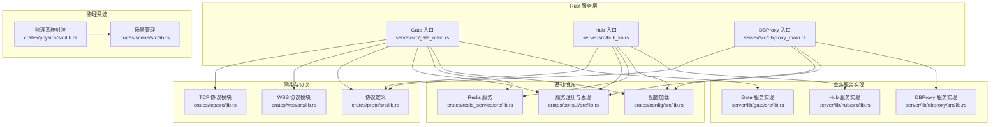
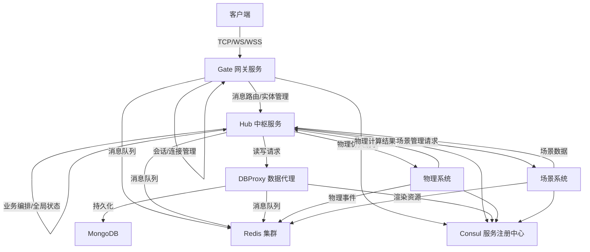
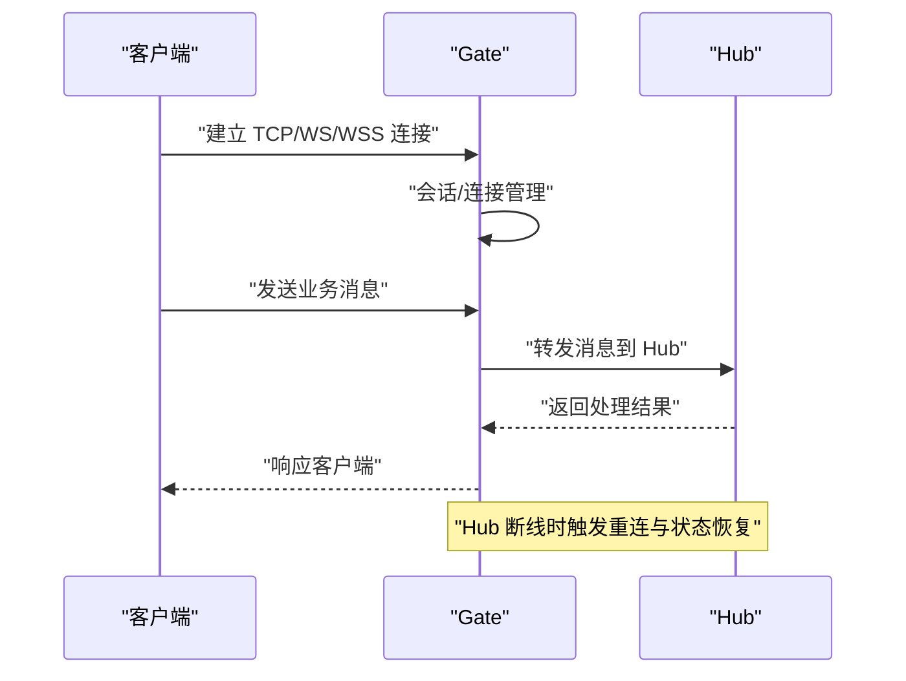
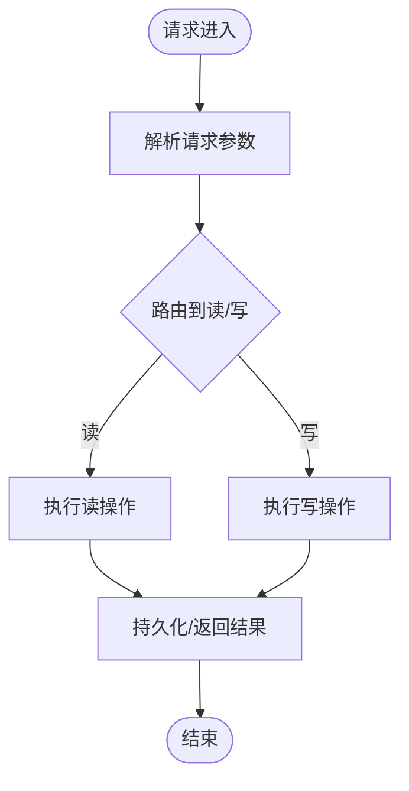
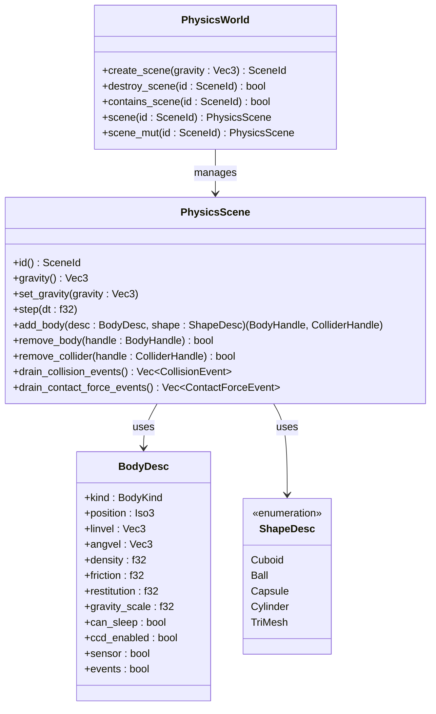
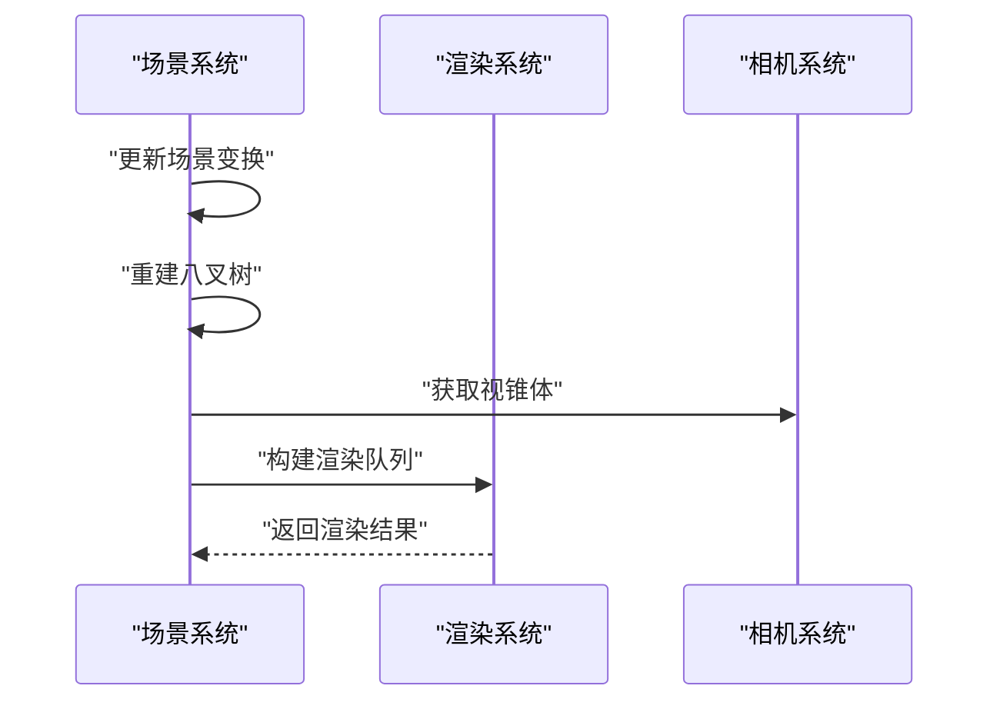
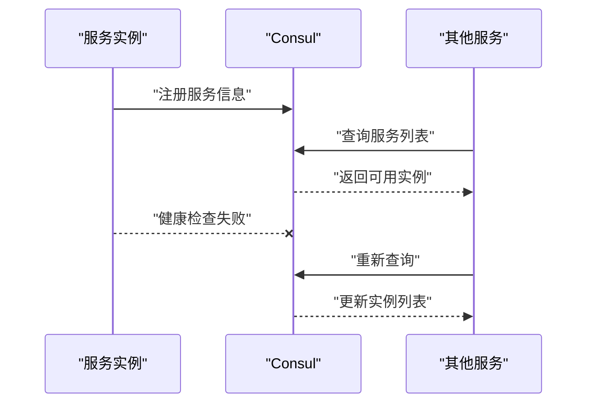
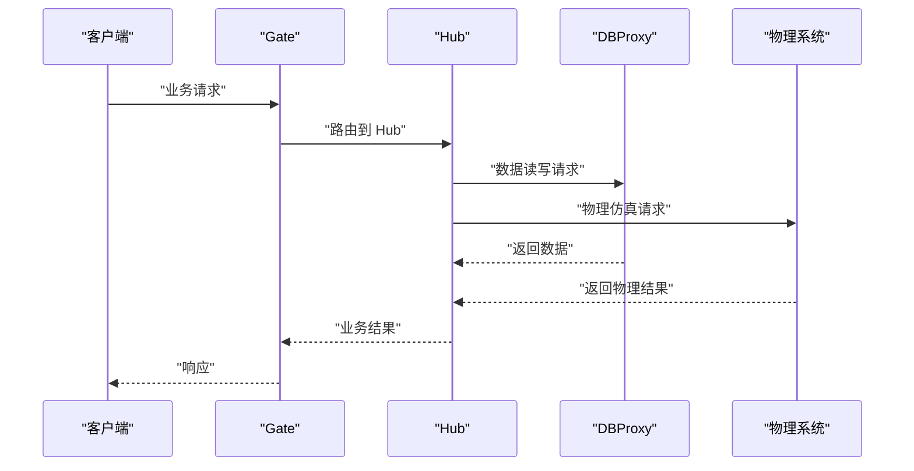
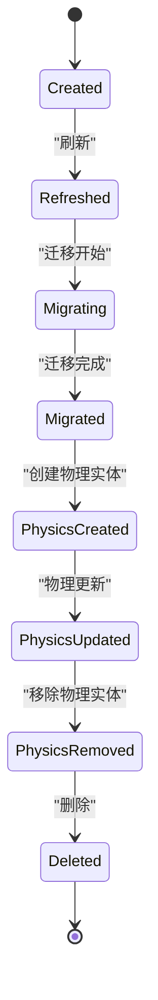
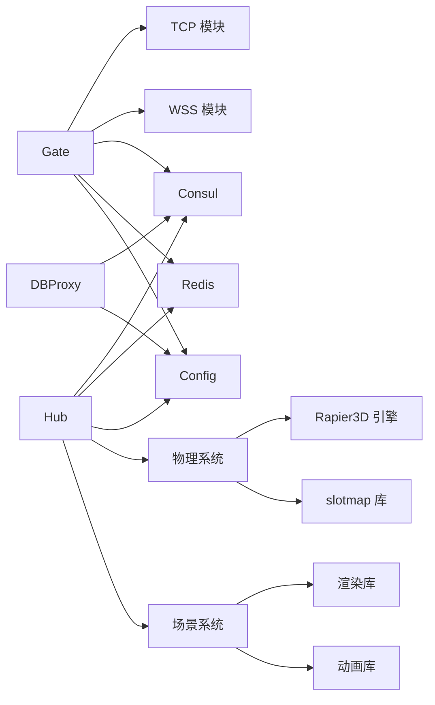

# 服务器架构

<cite>
**本文引用的文件**
- [gate_main.rs](file://server/src/gate_main.rs)
- [hub_lib.rs](file://server/src/hub_lib.rs)
- [dbproxy_main.rs](file://server/src/dbproxy_main.rs)
- [lib.rs（proto）](file://crates/proto/src/lib.rs)
- [lib.rs（tcp）](file://crates/tcp/src/lib.rs)
- [lib.rs（wss）](file://crates/wss/src/lib.rs)
- [lib.rs（config）](file://crates/config/src/lib.rs)
- [lib.rs（consul）](file://crates/consul/src/lib.rs)
- [lib.rs（redis_service）](file://crates/redis_service/src/lib.rs)
- [lib.rs（gate）](file://server/lib/gate/src/lib.rs)
- [client_msg_handle.rs（gate）](file://server/lib/gate/src/client_msg_handle.rs)
- [client_proxy_manager.rs（gate）](file://server/lib/gate/src/client_proxy_manager.rs)
- [conn_manager.rs（gate）](file://server/lib/gate/src/conn_manager.rs)
- [entity_manager.rs（gate）](file://server/lib/gate/src/entity_manager.rs)
- [hub_msg_handle.rs（gate）](file://server/lib/gate/src/hub_msg_handle.rs)
- [hub_proxy_manager.rs（gate）](file://server/lib/gate/src/hub_proxy_manager.rs)
- [lib.rs（hub）](file://server/lib/hub/src/lib.rs)
- [conn_manager.rs（hub）](file://server/lib/hub/src/conn_manager.rs)
- [dbproxy_manager.rs（hub）](file://server/lib/hub/src/dbproxy_manager.rs)
- [dbproxy_msg_handle.rs（hub）](file://server/lib/hub/src/dbproxy_msg_handle.rs)
- [gate_msg_handle.rs（hub）](file://server/lib/hub/src/gate_msg_handle.rs)
- [hub_proxy_manager.rs（hub）](file://server/lib/hub/src/hub_proxy_manager.rs)
- [hub_server.rs（hub）](file://server/lib/hub/src/hub_server.rs)
- [hub_service_manager.rs（hub）](file://server/lib/hub/src/hub_service_manager.rs)
- [lib.rs（dbproxy）](file://server/lib/dbproxy/src/lib.rs)
- [db.rs（dbproxy）](file://server/lib/dbproxy/src/db.rs)
- [handle.rs（dbproxy）](file://server/lib/dbproxy/src/handle.rs)
- [lib.rs（physics）](file://crates/physics/src/lib.rs)
- [world.rs（physics）](file://crates/physics/src/world.rs)
- [scene.rs（physics）](file://crates/physics/src/scene.rs)
- [shapes.rs（physics）](file://crates/physics/src/shapes.rs)
- [math.rs（physics）](file://crates/physics/src/math.rs)
- [handles.rs（physics）](file://crates/physics/src/handles.rs)
- [mod.rs（physics py）](file://crates/physics/src/py/mod.rs)
- [world.rs（physics py）](file://crates/physics/src/py/world.rs)
- [body.rs（physics py）](file://crates/physics/src/py/body.rs)
- [shape.rs（physics py）](file://crates/physics/src/py/shape.rs)
- [lib.rs（scene）](file://crates/scene/src/lib.rs)
- [scene.rs（scene）](file://crates/scene/src/scene.rs)
- [scene_object.rs（scene）](file://crates/scene/src/scene_object.rs)
</cite>

## 目录
1. [引言](#引言)
2. [项目结构](#项目结构)
3. [核心组件](#核心组件)
4. [架构总览](#架构总览)
5. [详细组件分析](#详细组件分析)
6. [依赖关系分析](#依赖关系分析)
7. [性能考量](#性能考量)
8. [故障排查指南](#故障排查指南)
9. [结论](#结论)
10. [附录](#附录)

## 引言
本技术文档面向系统架构师与高级开发者，系统化阐述 geese 微服务架构的设计与实现，重点覆盖以下方面：
- 微服务职责与协作：Gate 网关服务、Hub 中枢服务、DBProxy 数据代理
- 通信协议：TCP、WebSocket、WSS 的实现与适用场景
- 服务发现、负载均衡与故障转移
- 消息路由、实体管理与数据持久化
- 物理系统架构：物理世界管理、场景系统、刚体与碰撞器管理
- 系统边界、组件交互与数据流
- 性能优化与扩展性建议

## 项目结构
geese 采用多语言混合架构：
- Rust 实现的服务主程序入口与核心网络库
- Python 提供业务逻辑与持久化能力
- TypeScript/JavaScript 提供前端引擎与示例客户端
- Thrift 定义跨语言通信契约
- Redis 用于消息队列与服务间通信
- Consul 用于服务注册与健康检查
- 新增物理系统：Rapier3D 物理引擎封装与场景管理



**图表来源**
- [gate_main.rs:33-116](file://server/src/gate_main.rs#L33-L116)
- [hub_lib.rs:1-10](file://server/src/hub_lib.rs#L1-L10)
- [dbproxy_main.rs:15-77](file://server/src/dbproxy_main.rs#L15-L77)
- [lib.rs（tcp）:1-3](file://crates/tcp/src/lib.rs#L1-L3)
- [lib.rs（wss）:1-4](file://crates/wss/src/lib.rs#L1-L4)
- [lib.rs（proto）:1-5](file://crates/proto/src/lib.rs#L1-L5)
- [lib.rs（consul）:1-66](file://crates/consul/src/lib.rs#L1-L66)
- [lib.rs（redis_service）:1-3](file://crates/redis_service/src/lib.rs#L1-L3)
- [lib.rs（config）:1-13](file://crates/config/src/lib.rs#L1-L13)
- [lib.rs（gate）](file://server/lib/gate/src/lib.rs)
- [lib.rs（hub）](file://server/lib/hub/src/lib.rs)
- [lib.rs（dbproxy）](file://server/lib/dbproxy/src/lib.rs)
- [lib.rs（physics）](file://crates/physics/src/lib.rs)
- [lib.rs（scene）](file://crates/scene/src/lib.rs)

**章节来源**
- [gate_main.rs:33-116](file://server/src/gate_main.rs#L33-L116)
- [hub_lib.rs:1-10](file://server/src/hub_lib.rs#L1-L10)
- [dbproxy_main.rs:15-77](file://server/src/dbproxy_main.rs#L15-L77)
- [lib.rs（tcp）:1-3](file://crates/tcp/src/lib.rs#L1-L3)
- [lib.rs（wss）:1-4](file://crates/wss/src/lib.rs#L1-L4)
- [lib.rs（proto）:1-5](file://crates/proto/src/lib.rs#L1-L5)
- [lib.rs（consul）:1-66](file://crates/consul/src/lib.rs#L1-L66)
- [lib.rs（redis_service）:1-3](file://crates/redis_service/src/lib.rs#L1-L3)
- [lib.rs（config）:1-13](file://crates/config/src/lib.rs#L1-L13)

## 核心组件
- Gate 网关服务
  - 职责：对外提供 TCP/WebSocket/WSS 接入，作为客户端与 Hub 的网关；负责会话、连接管理、消息转发与实体生命周期协调。
  - 关键模块：客户端消息处理、Hub 连接管理、实体管理、连接管理等。
- Hub 中枢服务
  - 职责：聚合业务逻辑，协调 Gate 与 DBProxy，实现消息路由、实体管理、全局状态与服务编排。
- DBProxy 数据代理
  - 职责：统一数据库访问，处理读写请求，维护 GUID/GUID 序列，提供数据持久化与一致性保障。
- 物理系统
  - 职责：提供 3D 物理仿真，管理物理场景、刚体与碰撞器，支持多种形状与物理属性。
- 场景系统
  - 职责：管理 3D 场景、节点层次结构、动画与渲染资源，支持场景导入与优化。

**章节来源**
- [client_msg_handle.rs（gate）](file://server/lib/gate/src/client_msg_handle.rs)
- [hub_msg_handle.rs（gate）](file://server/lib/gate/src/hub_msg_handle.rs)
- [entity_manager.rs（gate）](file://server/lib/gate/src/entity_manager.rs)
- [conn_manager.rs（gate）](file://server/lib/gate/src/conn_manager.rs)
- [hub_proxy_manager.rs（gate）](file://server/lib/gate/src/hub_proxy_manager.rs)
- [client_proxy_manager.rs（gate）](file://server/lib/gate/src/client_proxy_manager.rs)
- [hub_server.rs（hub）](file://server/lib/hub/src/hub_server.rs)
- [hub_service_manager.rs（hub）](file://server/lib/hub/src/hub_service_manager.rs)
- [dbproxy_msg_handle.rs（hub）](file://server/lib/hub/src/dbproxy_msg_handle.rs)
- [gate_msg_handle.rs（hub）](file://server/lib/hub/src/gate_msg_handle.rs)
- [dbproxy_manager.rs（hub）](file://server/lib/hub/src/dbproxy_manager.rs)
- [handle.rs（dbproxy）](file://server/lib/dbproxy/src/handle.rs)
- [db.rs（dbproxy）](file://server/lib/dbproxy/src/db.rs)
- [lib.rs（physics）](file://crates/physics/src/lib.rs)
- [lib.rs（scene）](file://crates/scene/src/lib.rs)

## 架构总览
下图展示系统边界、服务角色与交互路径，包括新增的物理系统组件：



**图表来源**
- [gate_main.rs:64-111](file://server/src/gate_main.rs#L64-L111)
- [dbproxy_main.rs:44-74](file://server/src/dbproxy_main.rs#L44-L74)
- [lib.rs（consul）:30-65](file://crates/consul/src/lib.rs#L30-L65)
- [lib.rs（redis_service）:1-3](file://crates/redis_service/src/lib.rs#L1-L3)
- [lib.rs（dbproxy）](file://server/lib/dbproxy/src/lib.rs)
- [lib.rs（hub）](file://server/lib/hub/src/lib.rs)
- [lib.rs（physics）](file://crates/physics/src/lib.rs)
- [lib.rs（scene）](file://crates/scene/src/lib.rs)

## 详细组件分析

### Gate 网关服务
- 启动流程与服务注册
  - 解析配置、初始化日志与健康检查端口
  - 注册到 Consul，暴露健康检查接口
  - 启动 TCP/WS/WSS 服务监听
- 连接与会话管理
  - 维护客户端连接集合，按会话维度管理
  - 支持多协议接入，协议适配由 tcp/wss 子模块提供
- 消息路由与实体管理
  - 将客户端消息转发至 Hub
  - 维护实体生命周期，协调迁移与刷新
- 与 Hub 的协作
  - 通过 HubProxy 管理与 Hub 的连接
  - 在 Hub 断线或迁移时进行重连与状态恢复



**图表来源**
- [gate_main.rs:64-111](file://server/src/gate_main.rs#L64-L111)
- [client_msg_handle.rs（gate）](file://server/lib/gate/src/client_msg_handle.rs)
- [hub_msg_handle.rs（gate）](file://server/lib/gate/src/hub_msg_handle.rs)
- [hub_proxy_manager.rs（gate）](file://server/lib/gate/src/hub_proxy_manager.rs)
- [conn_manager.rs（gate）](file://server/lib/gate/src/conn_manager.rs)

**章节来源**
- [gate_main.rs:33-116](file://server/src/gate_main.rs#L33-L116)
- [lib.rs（tcp）:1-3](file://crates/tcp/src/lib.rs#L1-L3)
- [lib.rs（wss）:1-4](file://crates/wss/src/lib.rs#L1-L4)
- [lib.rs（consul）:30-65](file://crates/consul/src/lib.rs#L30-L65)
- [conn_manager.rs（gate）](file://server/lib/gate/src/conn_manager.rs)
- [client_msg_handle.rs（gate）](file://server/lib/gate/src/client_msg_handle.rs)
- [hub_msg_handle.rs（gate）](file://server/lib/gate/src/hub_msg_handle.rs)
- [hub_proxy_manager.rs（gate）](file://server/lib/gate/src/hub_proxy_manager.rs)

### Hub 中枢服务
- 服务编排与消息路由
  - 维护 Gate 与 DBProxy 的连接
  - 负责跨服务消息分发与业务逻辑编排
  - 协调物理系统与场景系统的请求
- 实体管理与全局状态
  - 维护实体生命周期、迁移与刷新
  - 管理全局状态与服务编排
- 与 DBProxy 的协作
  - 发起读写请求，接收持久化结果
  - 处理迁移过程中的数据一致性
- 与物理系统的协作
  - 接收物理仿真请求并返回结果
  - 管理物理事件与碰撞检测

```mermaid
sequenceDiagram
participant G as "Gate"
participant H as "Hub"
participant D as "DBProxy"
participant P as "物理系统"
G->>H : "请求业务处理"
H->>D : "发起数据读写"
D-->>H : "返回数据结果"
H->>P : "发起物理仿真"
P-->>H : "返回物理结果"
H-->>G : "返回业务结果"
Note over H,D,P : "DBProxy 负责数据持久化<br/>物理系统负责物理计算"
```

**图表来源**
- [hub_server.rs（hub）](file://server/lib/hub/src/hub_server.rs)
- [hub_service_manager.rs（hub）](file://server/lib/hub/src/hub_service_manager.rs)
- [dbproxy_msg_handle.rs（hub）](file://server/lib/hub/src/dbproxy_msg_handle.rs)
- [gate_msg_handle.rs（hub）](file://server/lib/hub/src/gate_msg_handle.rs)
- [dbproxy_manager.rs（hub）](file://server/lib/hub/src/dbproxy_manager.rs)

**章节来源**
- [hub_lib.rs:1-10](file://server/src/hub_lib.rs#L1-L10)
- [lib.rs（hub）](file://server/lib/hub/src/lib.rs)
- [hub_server.rs（hub）](file://server/lib/hub/src/hub_server.rs)
- [hub_service_manager.rs（hub）](file://server/lib/hub/src/hub_service_manager.rs)
- [dbproxy_msg_handle.rs（hub）](file://server/lib/hub/src/dbproxy_msg_handle.rs)
- [gate_msg_handle.rs（hub）](file://server/lib/hub/src/gate_msg_handle.rs)
- [dbproxy_manager.rs（hub）](file://server/lib/hub/src/dbproxy_manager.rs)

### DBProxy 数据代理
- 数据访问与持久化
  - 统一处理读写请求，维护 GUID/GUID 序列
  - 与 MongoDB 交互，保证数据一致性
- 与 Hub 的协作
  - 响应 Hub 的数据请求，返回结果
  - 参与实体迁移与状态同步



**图表来源**
- [dbproxy_main.rs:44-74](file://server/src/dbproxy_main.rs#L44-L74)
- [handle.rs（dbproxy）](file://server/lib/dbproxy/src/handle.rs)
- [db.rs（dbproxy）](file://server/lib/dbproxy/src/db.rs)

**章节来源**
- [dbproxy_main.rs:15-77](file://server/src/dbproxy_main.rs#L15-L77)
- [lib.rs（dbproxy）](file://server/lib/dbproxy/src/lib.rs)
- [handle.rs（dbproxy）](file://server/lib/dbproxy/src/handle.rs)
- [db.rs（dbproxy）](file://server/lib/dbproxy/src/db.rs)

### 物理系统架构
- 物理世界管理
  - 提供 PhysicsWorld 顶层管理器，管理多个物理场景
  - 支持场景创建、销毁与查询
  - 统一物理参数配置与事件收集
- 场景系统
  - 封装 Rapier3D 的完整物理状态：刚体集、碰撞器集、关节集
  - 提供物理步进、碰撞检测与射线投射
  - 支持多种形状描述：立方体、球体、胶囊、圆柱体、三角网格
- 刚体与碰撞器管理
  - 支持四种刚体类型：动态、固定、运动学位置、运动学速度
  - 提供完整的物理属性配置：密度、摩擦、弹性、重力系数
  - 支持碰撞事件与接触力事件收集
- Python 绑定
  - 提供完整的 Python API：PhysicsWorld、PhysicsBody、PhysicsShape
  - 支持场景级物理操作与实体级物理控制
  - 提供碰撞事件处理与物理查询功能



**图表来源**
- [world.rs（physics）:139-181](file://crates/physics/src/world.rs#L139-L181)
- [scene.rs（physics）:42-92](file://crates/physics/src/scene.rs#L42-L92)
- [world.rs（physics）:22-136](file://crates/physics/src/world.rs#L22-L136)
- [shapes.rs（physics）:8-54](file://crates/physics/src/shapes.rs#L8-L54)

**章节来源**
- [lib.rs（physics）:1-20](file://crates/physics/src/lib.rs#L1-L20)
- [world.rs（physics）:1-181](file://crates/physics/src/world.rs#L1-L181)
- [scene.rs（physics）:1-394](file://crates/physics/src/scene.rs#L1-L394)
- [shapes.rs（physics）:1-90](file://crates/physics/src/shapes.rs#L1-L90)
- [math.rs（physics）:1-36](file://crates/physics/src/math.rs#L1-L36)
- [handles.rs（physics）:1-52](file://crates/physics/src/handles.rs#L1-L52)
- [mod.rs（physics py）:1-28](file://crates/physics/src/py/mod.rs#L1-L28)
- [world.rs（physics py）:1-144](file://crates/physics/src/py/world.rs#L1-L144)
- [body.rs（physics py）:1-346](file://crates/physics/src/py/body.rs#L1-L346)
- [shape.rs（physics py）:1-87](file://crates/physics/src/py/shape.rs#L1-L87)

### 场景系统
- 场景管理
  - 提供 Scene 结构体管理场景节点、对象、材质、动画和骨骼
  - 支持八叉树空间分割优化渲染性能
  - 管理场景边界与对象层次结构
- 动画系统
  - 支持 GLTF 动画导入与播放
  - 提供动画状态机与混合树
  - 支持骨骼动画与顶点动画
- 渲染集成
  - 与渲染系统集成，提供渲染队列构建
  - 支持视锥体裁剪与可见性检测
  - 管理材质库与渲染资源



**图表来源**
- [scene.rs（scene）:16-100](file://crates/scene/src/scene.rs#L16-L100)
- [scene.rs（scene）:190-255](file://crates/scene/src/scene.rs#L190-L255)

**章节来源**
- [lib.rs（scene）:1-440](file://crates/scene/src/lib.rs#L1-L440)
- [scene.rs（scene）:1-285](file://crates/scene/src/scene.rs#L1-L285)
- [scene_object.rs（scene）:1-42](file://crates/scene/src/scene_object.rs#L1-L42)

### 通信协议实现与使用场景
- TCP
  - 低开销、高吞吐，适用于对延迟敏感的实时业务
  - Gate 通过 tcp_server 模块提供 TCP 服务
- WebSocket
  - 在浏览器/移动端支持良好，适合需要双向长连接的场景
  - Gate 通过 tcp_server 提供 WS 服务
- WSS
  - 基于 TLS 的安全 WebSocket，适用于生产环境的安全通信
  - Gate 通过 wss_server 模块提供 WSS 服务

**章节来源**
- [lib.rs（tcp）:1-3](file://crates/tcp/src/lib.rs#L1-L3)
- [lib.rs（wss）:1-4](file://crates/wss/src/lib.rs#L1-L4)
- [gate_main.rs:64-111](file://server/src/gate_main.rs#L64-L111)

### 服务发现、负载均衡与故障转移
- 服务注册与发现
  - Gate/Hub/DBProxy/物理系统启动后向 Consul 注册自身信息
  - 通过 catalog 查询可用实例列表，实现动态发现
- 健康检查
  - 每个服务启动独立健康检查端口，定期上报健康状态
- 故障转移
  - Gate 与 Hub 通过 HubProxy/GateProxy 管理连接，断线自动重连
  - 通过 Redis 通道进行消息中继，降低单点风险



**图表来源**
- [lib.rs（consul）:30-65](file://crates/consul/src/lib.rs#L30-L65)
- [gate_main.rs:68-86](file://server/src/gate_main.rs#L68-L86)
- [dbproxy_main.rs:52-68](file://server/src/dbproxy_main.rs#L52-L68)

**章节来源**
- [lib.rs（consul）:1-66](file://crates/consul/src/lib.rs#L1-L66)
- [gate_main.rs:68-86](file://server/src/gate_main.rs#L68-L86)
- [dbproxy_main.rs:52-68](file://server/src/dbproxy_main.rs#L52-L68)

### 消息路由系统
- Gate 层
  - 将客户端消息路由至 Hub，并维护会话上下文
- Hub 层
  - 负责跨服务消息分发，协调 Gate 与 DBProxy
  - 协调物理系统与场景系统的请求
- DBProxy 层
  - 执行具体的数据读写，返回结果给 Hub
- 物理系统层
  - 处理物理仿真请求，返回物理计算结果
  - 收集并传播物理事件



**图表来源**
- [client_msg_handle.rs（gate）](file://server/lib/gate/src/client_msg_handle.rs)
- [hub_msg_handle.rs（hub）](file://server/lib/hub/src/hub_msg_handle.rs)
- [dbproxy_msg_handle.rs（hub）](file://server/lib/hub/src/dbproxy_msg_handle.rs)

**章节来源**
- [client_msg_handle.rs（gate）](file://server/lib/gate/src/client_msg_handle.rs)
- [hub_msg_handle.rs（hub）](file://server/lib/hub/src/hub_msg_handle.rs)
- [dbproxy_msg_handle.rs（hub）](file://server/lib/hub/src/dbproxy_msg_handle.rs)

### 实体管理系统
- 生命周期管理
  - 创建、刷新、删除远程实体
  - 协调迁移过程中的状态同步
- 与 Hub 的协作
  - 通过 Hub 的实体管理接口完成生命周期操作
- 物理实体管理
  - 支持物理刚体的创建、配置与销毁
  - 管理物理属性与碰撞器设置
  - 处理物理事件与碰撞检测



**图表来源**
- [entity_manager.rs（gate）](file://server/lib/gate/src/entity_manager.rs)
- [hub_msg_handle.rs（hub）](file://server/lib/hub/src/hub_msg_handle.rs)
- [body.rs（physics py）:1-346](file://crates/physics/src/py/body.rs#L1-L346)

**章节来源**
- [entity_manager.rs（gate）](file://server/lib/gate/src/entity_manager.rs)
- [hub_msg_handle.rs（hub）](file://server/lib/hub/src/hub_msg_handle.rs)

### 数据持久化架构
- 数据访问层
  - DBProxy 统一处理读写请求，维护 GUID/GUID 序列
- 存储介质
  - 使用 MongoDB 进行数据持久化
- 一致性与可靠性
  - 通过 Hub 编排与 DBProxy 协作，确保数据一致性

**章节来源**
- [handle.rs（dbproxy）](file://server/lib/dbproxy/src/handle.rs)
- [db.rs（dbproxy）](file://server/lib/dbproxy/src/db.rs)

## 依赖关系分析
- 模块耦合
  - Gate 依赖 tcp/wss 协议模块与 consul/redis/config
  - Hub 依赖协议定义与 consul/redis/config，新增物理系统与场景系统依赖
  - DBProxy 依赖协议定义与 consul/config
  - 物理系统依赖 Rapier3D 引擎与 slotmap 库
  - 场景系统依赖渲染与动画库
- 外部依赖
  - Consul：服务注册与发现
  - Redis：消息队列与服务间通信
  - MongoDB：数据持久化
  - Rapier3D：3D 物理引擎



**图表来源**
- [lib.rs（tcp）:1-3](file://crates/tcp/src/lib.rs#L1-L3)
- [lib.rs（wss）:1-4](file://crates/wss/src/lib.rs#L1-L4)
- [lib.rs（consul）:1-66](file://crates/consul/src/lib.rs#L1-L66)
- [lib.rs（redis_service）:1-3](file://crates/redis_service/src/lib.rs#L1-L3)
- [lib.rs（config）:1-13](file://crates/config/src/lib.rs#L1-L13)
- [lib.rs（gate）](file://server/lib/gate/src/lib.rs)
- [lib.rs（hub）](file://server/lib/hub/src/lib.rs)
- [lib.rs（dbproxy）](file://server/lib/dbproxy/src/lib.rs)
- [lib.rs（physics）](file://crates/physics/src/lib.rs)
- [lib.rs（scene）](file://crates/scene/src/lib.rs)

**章节来源**
- [lib.rs（tcp）:1-3](file://crates/tcp/src/lib.rs#L1-L3)
- [lib.rs（wss）:1-4](file://crates/wss/src/lib.rs#L1-L4)
- [lib.rs（consul）:1-66](file://crates/consul/src/lib.rs#L1-L66)
- [lib.rs（redis_service）:1-3](file://crates/redis_service/src/lib.rs#L1-L3)
- [lib.rs（config）:1-13](file://crates/config/src/lib.rs#L1-L13)
- [lib.rs（gate）](file://server/lib/gate/src/lib.rs)
- [lib.rs（hub）](file://server/lib/hub/src/lib.rs)
- [lib.rs（dbproxy）](file://server/lib/dbproxy/src/lib.rs)
- [lib.rs（physics）](file://crates/physics/src/lib.rs)
- [lib.rs（scene）](file://crates/scene/src/lib.rs)

## 性能考量
- 连接与会话
  - 使用连接池与异步 I/O，减少阻塞
  - 合理设置心跳与超时，避免僵尸连接
- 消息路由
  - 优先本地路由，减少跨服务调用
  - 对高频消息进行批处理与压缩
- 数据持久化
  - 写操作批量提交，读写分离
  - 合理索引与分片，避免热点
- 服务发现与负载均衡
  - 结合 Consul 健康检查，剔除不健康节点
  - 使用就近原则选择服务实例
- 物理系统性能
  - 合理设置物理步进频率与时间步长
  - 使用八叉树优化物理查询性能
  - 控制碰撞器数量与复杂度
- 场景系统优化
  - 八叉树参数调优：最大对象数与深度限制
  - 动画采样缓存与混合树优化
  - 材质与纹理资源管理

## 故障排查指南
- 服务不可达
  - 检查 Consul 注册状态与健康检查端口
  - 确认防火墙与端口开放
- 连接异常
  - 查看 Gate/Hub 的连接管理日志
  - 核对 TCP/WS/WSS 监听配置
- 数据异常
  - 检查 DBProxy 的读写日志
  - 核对 MongoDB 连接与权限
- 物理系统问题
  - 检查物理场景创建与销毁日志
  - 验证物理参数配置与碰撞器设置
  - 监控物理事件收集与处理
- 场景系统问题
  - 检查场景导入与资源加载
  - 验证动画播放与骨骼绑定
  - 监控渲染性能与内存使用

**章节来源**
- [lib.rs（consul）:30-65](file://crates/consul/src/lib.rs#L30-L65)
- [gate_main.rs:68-86](file://server/src/gate_main.rs#L68-L86)
- [dbproxy_main.rs:52-68](file://server/src/dbproxy_main.rs#L52-L68)

## 结论
geese 通过 Gate、Hub、DBProxy 的清晰职责划分与协议抽象，构建了可扩展、可观测、可维护的微服务体系。新增的物理系统与场景系统进一步增强了系统的综合能力，支持复杂的 3D 交互与渲染需求。结合 Consul 的服务治理与 Redis 的消息中继，系统在高并发与复杂业务场景下具备良好的稳定性与扩展性。建议在生产环境中进一步完善监控告警、限流熔断与灰度发布策略，以提升整体韧性。

## 附录
- 配置加载
  - 通过 JSON 配置文件加载服务参数
- 协议定义
  - 使用 Thrift 定义跨语言通信契约
- 示例与工具
  - 提供 TypeScript/Python 客户端与示例工程
- 物理系统特性
  - 支持多种刚体类型与物理属性
  - 提供完整的 Python API 绑定
  - 集成八叉树空间优化
- 场景系统特性
  - 支持 GLTF 动画导入
  - 提供动画状态机与混合树
  - 集成渲染队列构建

**章节来源**
- [lib.rs（config）:1-13](file://crates/config/src/lib.rs#L1-L13)
- [lib.rs（proto）:1-5](file://crates/proto/src/lib.rs#L1-L5)
- [sample/](file://sample/)
- [expand/ts/](file://expand/ts/)
- [lib.rs（physics）:1-20](file://crates/physics/src/lib.rs#L1-L20)
- [lib.rs（scene）:1-440](file://crates/scene/src/lib.rs#L1-L440)