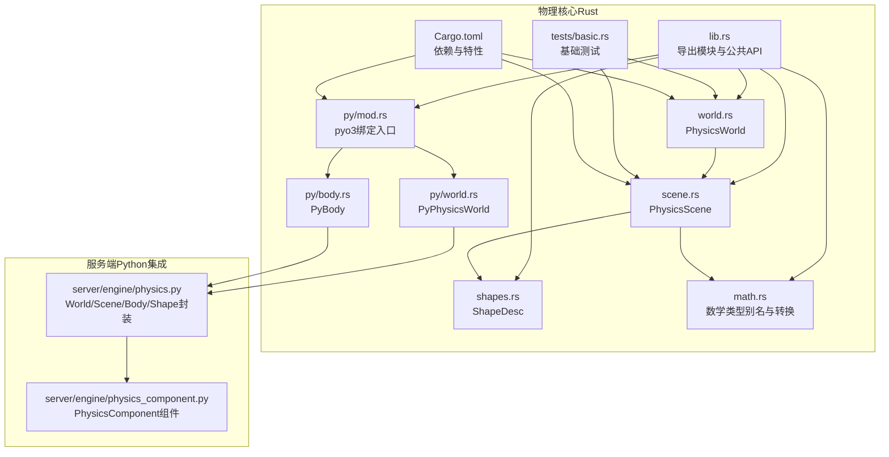
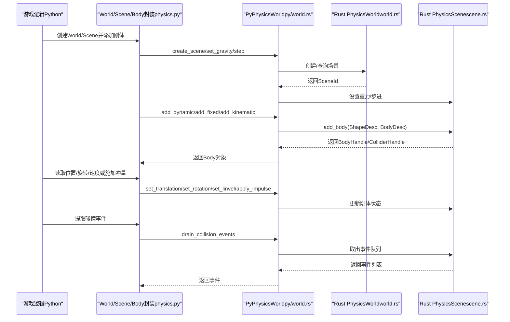
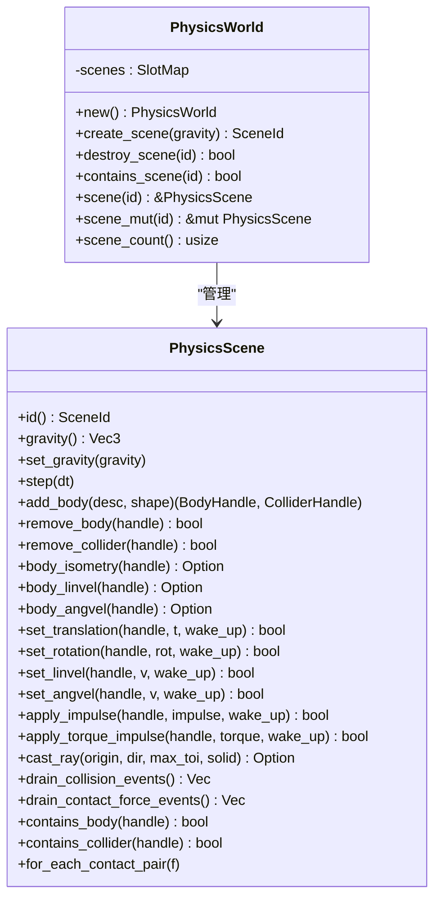
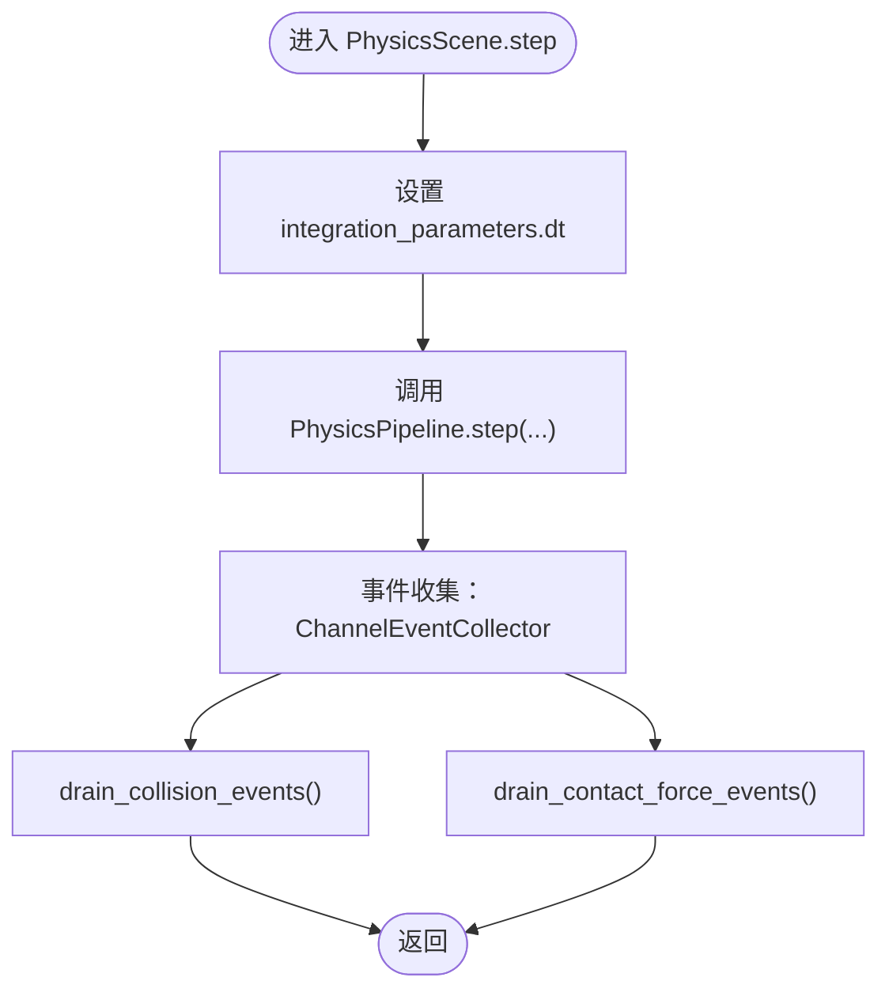
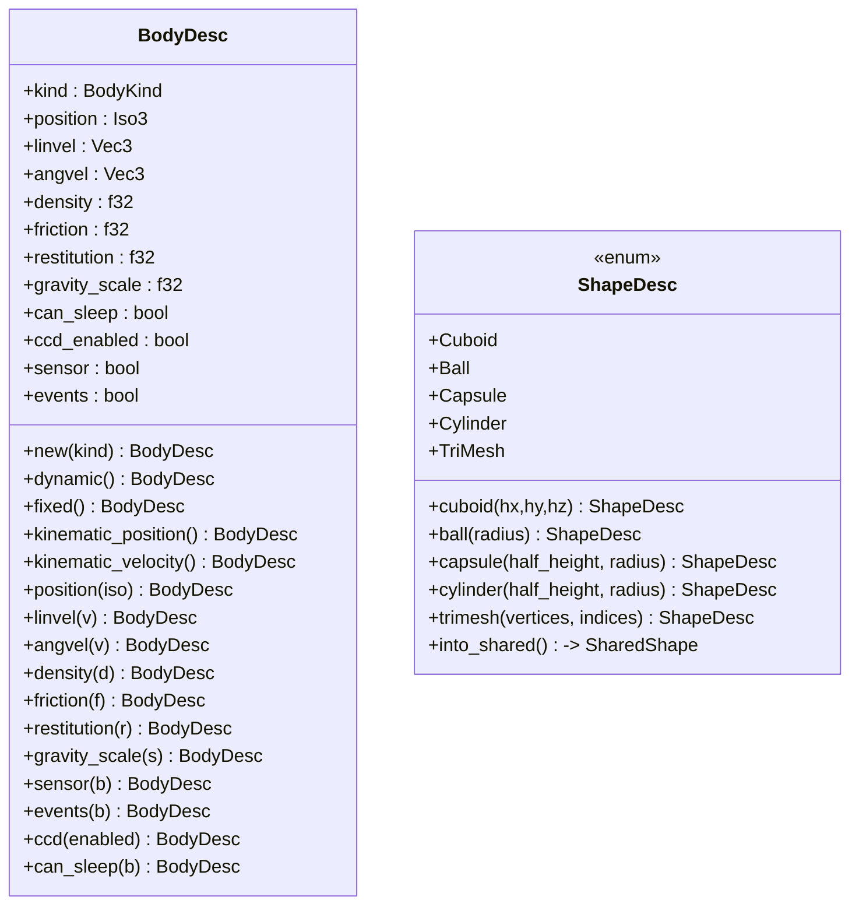
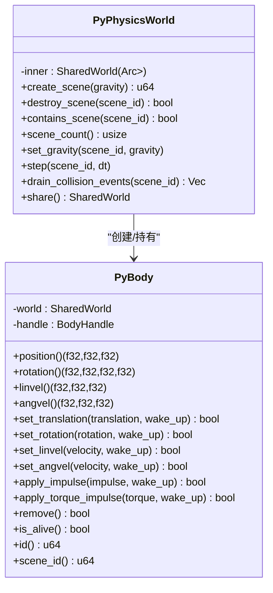
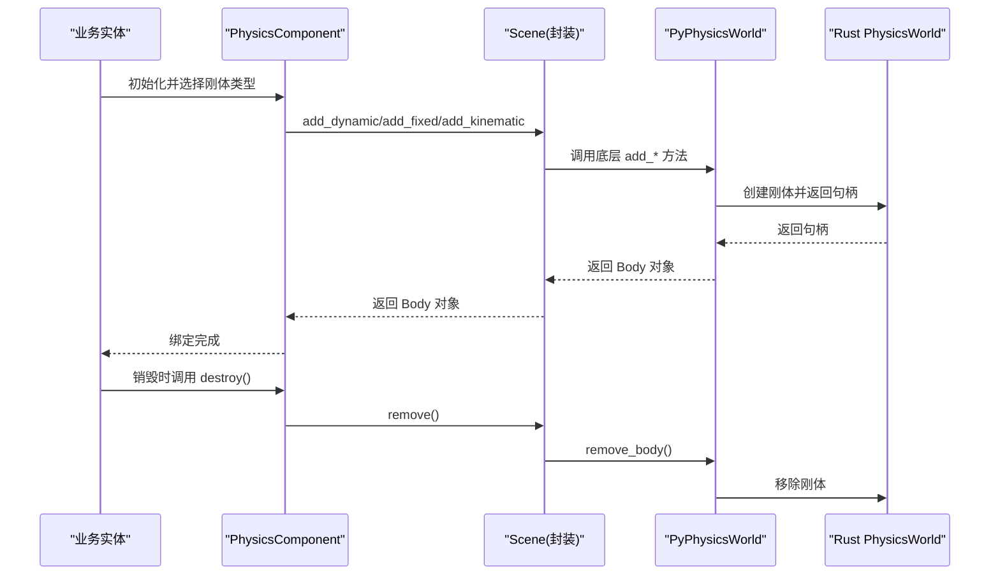
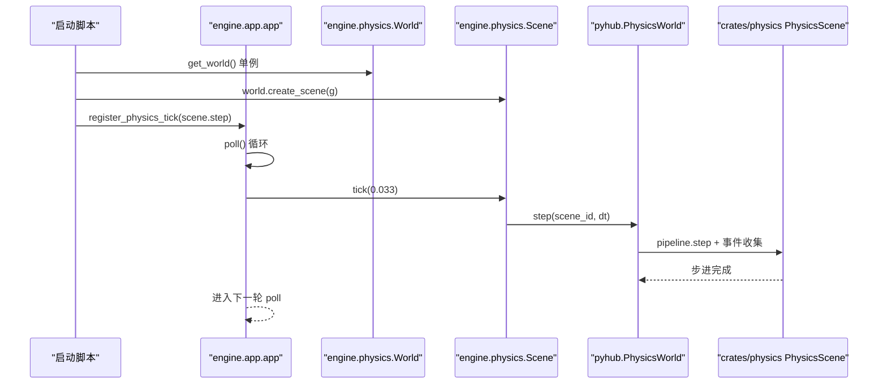
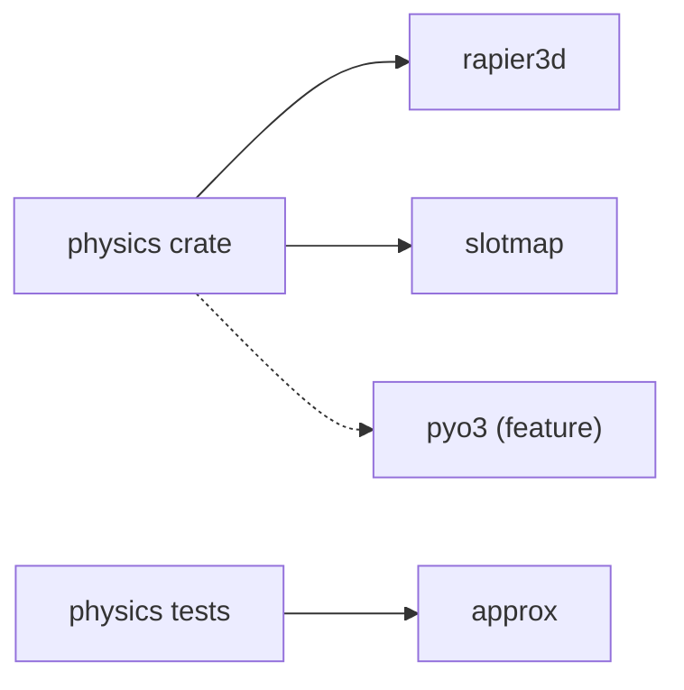

# 物理系统

<cite>
**本文档引用的文件**
- [lib.rs](file://crates/physics/src/lib.rs)
- [world.rs](file://crates/physics/src/world.rs)
- [scene.rs](file://crates/physics/src/scene.rs)
- [shapes.rs](file://crates/physics/src/shapes.rs)
- [math.rs](file://crates/physics/src/math.rs)
- [mod.rs](file://crates/physics/src/py/mod.rs)
- [body.rs](file://crates/physics/src/py/body.rs)
- [world.rs](file://crates/physics/src/py/world.rs)
- [basic.rs](file://crates/physics/tests/basic.rs)
- [Cargo.toml](file://crates/physics/Cargo.toml)
- [physics.py](file://server/engine/physics.py)
- [physics_component.py](file://server/engine/physics_component.py)
- [Cargo.toml（hub）](file://server/lib/hub/Cargo.toml)
- [hub_lib.rs](file://server/src/hub_lib.rs)
- [app.py](file://server/engine/app.py)
</cite>

## 目录
1. [简介](#简介)
2. [项目结构](#项目结构)
3. [核心组件](#核心组件)
4. [架构总览](#架构总览)
5. [详细组件分析](#详细组件分析)
6. [依赖关系分析](#依赖关系分析)
7. [性能考虑](#性能考虑)
8. [故障排查指南](#故障排查指南)
9. [结论](#结论)

## 简介
本仓库提供了一个基于 rapier3d 的多场景物理系统实现，支持 Rust 原生使用以及通过 pyo3 暴露的 Python 绑定。系统围绕「物理世界」和「物理场景」两个核心概念组织，前者负责管理多个场景，后者封装了 rapier 的完整求解管线（刚体、碰撞体、关节、查询等），并提供事件收集、射线查询、步进推进等功能。同时，系统还提供了 Python 侧薄封装与组件化接入方式，便于服务端业务快速集成。

## 项目结构
- 物理核心（Rust）位于 crates/physics，包含：
  - lib.rs：导出模块与公共 API
  - world.rs：物理世界顶层管理器，管理多个场景
  - scene.rs：单场景物理封装，包含刚体、碰撞体、步进、事件、射线查询等
  - shapes.rs：形状描述与 rapier SharedShape 构造
  - math.rs：数学类型别名与转换工具
  - py/：pyo3 绑定层（feature = "pyo3"）
- 服务端 Python 集成：
  - server/engine/physics.py：对底层 pyhub 物理类进行友好封装，提供 World/Scene/Body/Shape 等高层 API
  - server/engine/physics_component.py：以组件风格绑定实体与物理刚体
- 测试：
  - crates/physics/tests/basic.rs：基础行为测试（自由落体、静态地面、射线、销毁循环）



**图表来源**
- [lib.rs:1-20](file://crates/physics/src/lib.rs#L1-L20)
- [world.rs:1-181](file://crates/physics/src/world.rs#L1-L181)
- [scene.rs:1-394](file://crates/physics/src/scene.rs#L1-L394)
- [shapes.rs:1-90](file://crates/physics/src/shapes.rs#L1-L90)
- [math.rs:1-36](file://crates/physics/src/math.rs#L1-L36)
- [mod.rs:1-28](file://crates/physics/src/py/mod.rs#L1-L28)
- [world.rs:1-144](file://crates/physics/src/py/world.rs#L1-L144)
- [body.rs:1-346](file://crates/physics/src/py/body.rs#L1-L346)
- [basic.rs:1-122](file://crates/physics/tests/basic.rs#L1-L122)
- [Cargo.toml:1-17](file://crates/physics/Cargo.toml#L1-L17)
- [physics.py:1-275](file://server/engine/physics.py#L1-L275)
- [physics_component.py:1-96](file://server/engine/physics_component.py#L1-L96)

**章节来源**
- [lib.rs:1-20](file://crates/physics/src/lib.rs#L1-L20)
- [Cargo.toml:1-17](file://crates/physics/Cargo.toml#L1-L17)

## 核心组件
- 物理世界（PhysicsWorld）
  - 管理多个场景（SceneId），提供创建/销毁/查询场景的能力
  - 场景采用 SlotMap 存储，保证稳定句柄与高效查找
- 物理场景（PhysicsScene）
  - 封装 rapier3d 的刚体集合、碰撞体集合、关节集合、求解管线与事件收集
  - 提供步进（step）、添加/移除刚体、射线查询、碰撞事件提取等接口
- 刚体描述（BodyDesc）与刚体类型（BodyKind）
  - 支持动态、固定、运动学（按位置/速度）四类刚体
  - 提供密度、摩擦、弹性、重力系数、睡眠、连续碰撞检测、传感器、事件开关等参数
- 形状描述（ShapeDesc）
  - 支持立方体、球体、胶囊、圆柱、三角网格等
  - 内部转换为 rapier 的 SharedShape，并进行参数有效性校验
- 数学工具（math.rs）
  - 暴露 Vec3/Iso3/Quat 类型别名，统一与 rapier3d 的 glamx 类型交互
  - 提供元组与向量/四元数之间的互转函数
- Python 绑定（py/）
  - PyPhysicsWorld：串行化访问（Arc<Mutex<...>>），提供场景创建/销毁、步进、事件提取
  - PyBody：持有共享 world 引用与 BodyHandle，提供位置/旋转/速度设置与冲量施加等
  - 通过 add_to_module 将类挂载到现有 Python 模块命名空间
- 服务端 Python 封装
  - physics.py：World/Scene/Body/Shape 的高层封装，便于业务直接使用
  - physics_component.py：以组件风格将实体与物理刚体绑定，简化生命周期管理

**章节来源**
- [world.rs:138-181](file://crates/physics/src/world.rs#L138-L181)
- [scene.rs:42-394](file://crates/physics/src/scene.rs#L42-L394)
- [shapes.rs:8-90](file://crates/physics/src/shapes.rs#L8-L90)
- [math.rs:1-36](file://crates/physics/src/math.rs#L1-L36)
- [mod.rs:1-28](file://crates/physics/src/py/mod.rs#L1-L28)
- [world.rs:18-144](file://crates/physics/src/py/world.rs#L18-L144)
- [body.rs:15-346](file://crates/physics/src/py/body.rs#L15-L346)
- [physics.py:25-275](file://server/engine/physics.py#L25-L275)
- [physics_component.py:17-96](file://server/engine/physics_component.py#L17-L96)

## 架构总览
下图展示了从服务端 Python 业务到 Rust 物理核心的整体调用链路与数据流：



**图表来源**
- [physics.py:53-170](file://server/engine/physics.py#L53-L170)
- [world.rs:37-109](file://crates/physics/src/py/world.rs#L37-L109)
- [world.rs:138-181](file://crates/physics/src/world.rs#L138-L181)
- [scene.rs:127-167](file://crates/physics/src/scene.rs#L127-L167)

## 详细组件分析

### 物理世界（PhysicsWorld）
- 职责
  - 管理场景集合（SlotMap<SceneId, PhysicsScene>）
  - 提供创建/销毁/查询场景的方法
- 关键点
  - 使用 insert_with_key 生成稳定的 SceneId
  - contains_scene/scene/scene_mut 提供安全访问
- 复杂度
  - 创建/销毁/查询均为 O(1) 平均时间



**图表来源**
- [world.rs:138-181](file://crates/physics/src/world.rs#L138-L181)
- [scene.rs:42-394](file://crates/physics/src/scene.rs#L42-L394)

**章节来源**
- [world.rs:138-181](file://crates/physics/src/world.rs#L138-L181)

### 物理场景（PhysicsScene）
- 职责
  - 封装 rapier 的求解管线：RigidBodySet/ColliderSet/ImpulseJointSet/MultibodyJointSet
  - 提供步进、刚体操作、射线查询、事件收集
- 关键点
  - 步进时设置 dt（最小阈值保护）
  - 通过 ChannelEventCollector 收集碰撞与接触力事件
  - 射线查询使用 BroadPhase + NarrowPhase 的 QueryPipeline
- 性能
  - 事件收集使用非阻塞 try_recv 循环 drain，避免阻塞



**图表来源**
- [scene.rs:106-125](file://crates/physics/src/scene.rs#L106-L125)
- [scene.rs:317-355](file://crates/physics/src/scene.rs#L317-L355)

**章节来源**
- [scene.rs:106-125](file://crates/physics/src/scene.rs#L106-L125)
- [scene.rs:317-355](file://crates/physics/src/scene.rs#L317-L355)

### 刚体描述与形状（BodyDesc/ShapeDesc）
- BodyDesc
  - 支持多种刚体类型与参数配置
  - 提供 fluent builder 风格的链式设置
- ShapeDesc
  - 支持常见几何体与三角网格
  - 内部转换为 rapier 的 SharedShape，并进行参数校验（如半轴/半径必须大于阈值）



**图表来源**
- [world.rs:22-136](file://crates/physics/src/world.rs#L22-L136)
- [shapes.rs:8-90](file://crates/physics/src/shapes.rs#L8-L90)

**章节来源**
- [world.rs:22-136](file://crates/physics/src/world.rs#L22-L136)
- [shapes.rs:8-90](file://crates/physics/src/shapes.rs#L8-L90)

### 数学工具（math.rs）
- 类型别名
  - Vec3/Iso3/Quat 直接来自 rapier3d 的 glamx 类型
- 转换函数
  - 元组与向量/四元数互转
  - Pose3 分解为平移+旋转

**章节来源**
- [math.rs:1-36](file://crates/physics/src/math.rs#L1-L36)

### Python 绑定（py/）
- PyPhysicsWorld
  - 通过 Arc<Mutex<PhysicsWorld>> 串行化访问
  - 提供场景创建/销毁、重力设置、步进、事件提取
- PyBody
  - 持有 SharedWorld 与 BodyHandle
  - 提供位置/旋转/速度读写与冲量施加
  - 支持静态工厂方法在 Python 端直接创建刚体



**图表来源**
- [world.rs:18-144](file://crates/physics/src/py/world.rs#L18-L144)
- [body.rs:15-346](file://crates/physics/src/py/body.rs#L15-L346)

**章节来源**
- [mod.rs:1-28](file://crates/physics/src/py/mod.rs#L1-L28)
- [world.rs:18-144](file://crates/physics/src/py/world.rs#L18-L144)
- [body.rs:15-346](file://crates/physics/src/py/body.rs#L15-L346)

### 服务端 Python 封装与组件化
- physics.py
  - World/Scene/Body/Shape 的高层封装，提供默认参数与便捷方法
  - 与底层 PyPhysicsWorld/PyBody 进行映射
- physics_component.py
  - 以组件风格将实体与物理刚体绑定，支持动态/固定/运动学等类型
  - 生命周期管理：在实体销毁时调用 destroy()



**图表来源**
- [physics.py:229-275](file://server/engine/physics.py#L229-L275)
- [physics_component.py:17-96](file://server/engine/physics_component.py#L17-L96)
- [world.rs:37-109](file://crates/physics/src/py/world.rs#L37-L109)

**章节来源**
- [physics.py:229-275](file://server/engine/physics.py#L229-L275)
- [physics_component.py:17-96](file://server/engine/physics_component.py#L17-L96)

## 服务端集成与 Tick 接入
本次落地在 Rust 侧不新增 cdylib，而是复用现有的 `pyhub` 模块入口：
- `crates/physics` 启用 `pyo3` feature 后，提供 `physics::py::add_to_module(m)`，不自身声明 `#[pymodule]`。
- [server/lib/hub/Cargo.toml](file://server/lib/hub/Cargo.toml) 引入 `physics = { path = "../../../crates/physics", features = ["pyo3"] }`。
- [server/src/hub_lib.rs](file://server/src/hub_lib.rs) 的 `#[pymodule] pyhub` 调用 `physics::py::add_to_module(m)?`，将 `PhysicsWorld`/`PhysicsShape`/`PhysicsBody`/`PhysicsRayHit`/`PhysicsCollisionEvent` 以及模块级 `cast_ray` 函数挂到 `pyhub` 命名空间。

Python 侧推进点以“可选钩子”方式接入主循环，不侵入 [base_entity.py](file://server/engine/base_entity.py)：
- [server/engine/app.py](file://server/engine/app.py) 新增 `register_physics_tick(tick: Callable[[float], None])`，在 `poll(update)` 主循环中以默认 `dt = 0.033` 调用。奇异会被 `error` 日志捎住，不会中断其他 poll 逻辑。
- 业务侧可以在启动时写入：
  ```python
  from engine.physics import get_world
  scene = get_world().create_scene((0.0, -9.81, 0.0))
  app().register_physics_tick(lambda dt: scene.step(dt))
  ```
- `entity` 推荐通过 [physics_component.py](file://server/engine/physics_component.py) 的 `PhysicsComponent` 持有刚体，生命周期与业务 entity 对齐（在销毁时调用 `destroy()`）。



## 依赖关系分析
- 物理核心依赖
  - rapier3d：3D 物理引擎核心
  - slotmap：稳定键值与高效存储
  - pyo3（可选）：Python 绑定
- 测试依赖
  - approx：近似断言，用于验证物理结果



**图表来源**
- [Cargo.toml:10-17](file://crates/physics/Cargo.toml#L10-L17)

**章节来源**
- [Cargo.toml:10-17](file://crates/physics/Cargo.toml#L10-L17)

## 性能考虑
- 步进参数
  - dt 最小阈值保护，避免过小步长时间导致不稳定
- 事件收集
  - 使用非阻塞 try_recv 循环 drain，避免阻塞主线程
- 查询管线
  - 射线查询使用 BroadPhase + NarrowPhase 的 QueryPipeline，适合频繁查询场景
- 场景管理
  - SlotMap 提供 O(1) 插入/删除/查找，适合动态场景创建/销毁
- Python 绑定
  - 通过 Arc<Mutex<...>> 串行化访问，避免多线程竞争带来的复杂性

## 故障排查指南
- 场景不存在
  - 现象：调用 scene_mut 或 set_gravity 时报错
  - 排查：确认 scene_id 是否正确，是否已被 destroy
- 刚体移除后仍尝试访问
  - 现象：position/rotation/linvel/angvel 返回错误或 is_alive 为 False
  - 排查：确保 remove() 成功且后续不再使用该句柄
- 形状参数非法
  - 现象：创建形状时报错
  - 排查：检查半轴/半径等参数是否满足最小阈值要求
- 事件未出现
  - 现象：drain_collision_events 返回空
  - 排查：确认 collider 已启用事件（events=true），并至少执行一次 step
- Python 线程安全
  - 现象：锁异常或数据竞争
  - 排查：确认通过 PyPhysicsWorld 的方法访问，避免直接跨线程共享内部状态
- rapier 0.32 API 适配
  - 现象：从 nalgebra 样例迁移时遇到 `Vec3::zeros()`/`v.norm()` 未找到
  - 排查：rapier 0.32 已迁到 glamx，使用 `Vec3::ZERO` / `length()`；`PhysicsPipeline::step` 去除 `query_pipeline` 参数，采用 `BroadPhaseBvh` + 临时 `as_query_pipeline(...)` 组合；事件通道改为 `std::sync::mpsc`。`RigidBodyBuilder::position` 已重命名为 `pose`

**章节来源**
- [scene.rs:169-199](file://crates/physics/src/scene.rs#L169-L199)
- [scene.rs:317-355](file://crates/physics/src/scene.rs#L317-L355)
- [shapes.rs:55-89](file://crates/physics/src/shapes.rs#L55-L89)
- [world.rs:111-115](file://crates/physics/src/py/world.rs#L111-L115)

## 结论
本物理系统以清晰的分层设计实现了从 Rust 核心到 Python 绑定的完整链路，既满足高性能需求，又提供友好的业务封装与组件化接入方式。通过多场景管理、完善的刚体与形状抽象、事件与射线查询能力，系统能够覆盖大多数游戏与仿真场景中的物理需求。建议在实际项目中结合业务 Tick 驱动与事件驱动模式，合理设置步进频率与事件处理策略，以获得最佳性能与一致性。