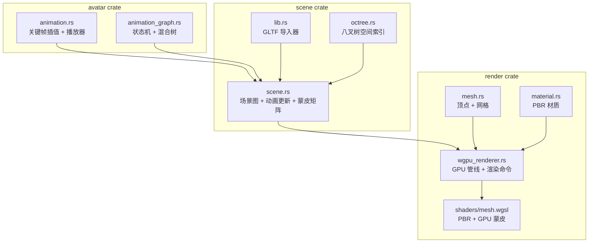
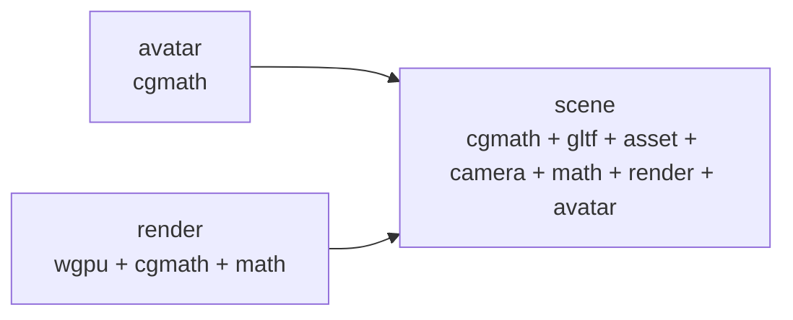

# 渲染与动画系统

<cite>
**本文引用的文件**
- [avatar/Cargo.toml](file://crates/avatar/Cargo.toml)
- [avatar/src/lib.rs](file://crates/avatar/src/lib.rs)
- [avatar/src/animation.rs](file://crates/avatar/src/animation.rs)
- [avatar/src/animation_graph.rs](file://crates/avatar/src/animation_graph.rs)
- [scene/Cargo.toml](file://crates/scene/Cargo.toml)
- [scene/src/lib.rs](file://crates/scene/src/lib.rs)
- [scene/src/scene.rs](file://crates/scene/src/scene.rs)
- [render/Cargo.toml](file://crates/render/Cargo.toml)
- [render/src/mesh.rs](file://crates/render/src/mesh.rs)
- [render/src/wgpu_renderer.rs](file://crates/render/src/wgpu_renderer.rs)
- [render/shaders/mesh.wgsl](file://crates/render/shaders/mesh.wgsl)
</cite>

## 目录
1. [简介](#简介)
2. [项目结构](#项目结构)
3. [核心组件](#核心组件)
4. [架构总览](#架构总览)
5. [avatar crate：动画系统](#avatar-crate动画系统)
6. [scene crate：场景管理](#scene-crate场景管理)
7. [render crate：GPU 渲染](#render-crategpu-渲染)
8. [依赖关系](#依赖关系)

## 简介
渲染与动画系统是 geese 项目中的 3D 客户端能力，由三个紧密协作的 Rust crate 组成：`render`（GPU 渲染）、`scene`（场景管理与 GLTF 导入）和 `avatar`（骨骼动画）。整个管线支持 GLTF 模型加载、PBR 材质渲染、GPU 蒙皮动画和动画状态机混合。

- render：基于 wgpu 的跨平台 GPU 渲染器，支持 PBR 光照、GPU 蒙皮、材质系统
- scene：场景图管理、八叉树空间索引、GLTF 导入、视锥剔除
- avatar：骨骼动画核心，包含关键帧插值、动画状态机与混合系统

## 项目结构
```
crates/
├── avatar/              （骨骼动画系统）
│   ├── Cargo.toml       （依赖 cgmath = "0.18"）
│   └── src/
│       ├── lib.rs        （统一导出）
│       ├── animation.rs  （Transform、SceneNode、Skin、AnimationClip、
│       │                  AnimationPlayer、插值函数、单元测试 ×12）
│       └── animation_graph.rs（BlendTree、AnimationState、状态机、
│                              跨状态过渡、参数系统）
├── scene/               （场景管理 & GLTF 导入）
│   ├── Cargo.toml       （依赖 render、avatar、gltf、cgmath 等）
│   └── src/
│       ├── lib.rs        （GLTF 导入：网格、骨骼、动画、材质）
│       ├── scene.rs      （Scene：场景图、八叉树、视锥剔除、
│       │                  动画更新、GPU 蒙皮矩阵）
│       ├── octree.rs     （八叉树空间划分）
│       ├── scene_object.rs（渲染对象：网格 + AABB + 蒙皮矩阵）
│       └── material.rs   （GLTF 材质加载）
└── render/              （GPU 渲染器）
    ├── Cargo.toml        （依赖 wgpu、cgmath 等）
    ├── shaders/mesh.wgsl （PBR 着色器 + GPU 蒙皮）
    └── src/
        ├── lib.rs         （统一导出）
        ├── mesh.rs        （顶点、网格、蒙皮句柄）
        ├── material.rs    （材质、纹理、采样器）
        ├── scene.rs       （渲染命令、队列、统计）
        └── wgpu_renderer.rs（wgpu 渲染管线、缓冲区管理）
```

## 核心组件

### avatar crate：动画系统
独立于 scene 的动画逻辑层，仅依赖 cgmath，不依赖任何渲染或场景模块。

**核心类型**（`avatar/src/animation.rs`）：
- `Transform`：位置 + 旋转（四元数）+ 缩放，支持 `from_gltf` 转换
- `SceneNode`：带父子层级关系的场景节点，维护 `base_transform`（GLTF 原始）与 `local_transform`（动画覆盖）
- `Skin`：骨骼关节列表与逆绑定矩阵（inverse bind matrices）
- `AnimationClip`：包含多个 `AnimationChannel`
- `AnimationChannel`：target_node + property + 插值类型 + 关键帧时间 + 输出值
- `Interpolation`：Linear / Step / CubicSpline
- `AnimationPlayer`：播放器（clip 索引、时间、速度、循环、暂停）

**插值函数**：
- `sample_indices`：二分查找关键帧区间，返回 (left, right, factor, interval)
- `sample_vec3`：Linear 线性、Step 阶梯、CubicSpline 三次 Hermite 样条插值
- `sample_quat`：Linear slerp、Step、CubicSpline 分量 Hermite + 归一化
- `quat_dot` / `quat_log` / `quat_exp`：四元数对数和指数映射，用于 Lie 代数混合

**动画状态机**（`avatar/src/animation_graph.rs`）：
- `BlendTree`：Single（单动画）或 Blend1D（基于 float 参数的一维混合）
- `AnimationState`：状态名 + 混合树 + 播放速度
- `AnimationStateMachine`：
  - `add_state(name, tree, speed)` 添加状态
  - `add_transition(from, target, duration, condition)` 添加过渡
  - `trigger(name)` / `set_float(name, value)` / `set_bool(name, value)` 设置参数
  - `update(dt, clips) -> Vec<ActiveAnimation>` 驱动状态机并返回混合结果

**过渡条件**：Always / Trigger / FloatGreater / FloatLess / Bool

### scene crate：场景管理
场景图与 GLTF 导入器，作为 avatar 和 render 的桥梁。

**核心功能**：
- **GLTF 导入**（`lib.rs`）：加载网格（顶点 + 索引 + 材质）、骨骼（关节 + 逆绑定矩阵）、动画（Linear/Step/CubicSpline），生成切线空间
- **场景图**（`scene.rs`）：
  - `Scene`：nodes + objects + octree + materials + animations + skins
  - `animation_index(name)`：按名称查找动画索引
  - `animation_duration(index)`：查询动画时长
  - `update_animation(player, dt)`：底层 API，驱动单个 AnimationPlayer
  - `update_animation_graph(graph, dt)`：高层 API，驱动状态机并执行多动画混合
  - `update_world_transforms()`：递归计算节点世界矩阵
  - `compute_joint_matrices(skin)`：计算 GPU 蒙皮所需矩阵
  - `rebuild_octree()`：重建八叉树
  - `visible_objects(frustum)`：视锥剔除
- **八叉树**（`octree.rs`）：空间划分与 AABB 查询
- **材质**（`material.rs`）：GLTF PBR 材质加载映射

**动画混合逻辑**（`scene.rs` `update_animation_graph`）：
- 单动画且权重为 1.0 → 回退到 `sample_clip` 高效路径
- 多动画混合 → translation/scale 做加权线性叠加，rotation 基于 Lie 代数（log-space）做球面混合，避免万向节问题

### render crate：GPU 渲染器
基于 wgpu（WebGPU 原生实现）的跨平台渲染后端。

**核心类型**：
- `Vertex`：position + normal + uv + tangent + joints(4) + weights(4)
- `ModelMesh`：vertices + indices + material + skin handle
- `Material`：base_color + metallic_roughness + normal + occlusion + emissive 纹理
- `SceneRenderer`：渲染管线管理（PBR shader + bind groups）
- `WgpuSceneRenderer`：wgpu 实现，管理 device、queue、pipelines、uniform buffers

**PBR 着色器**（`shaders/mesh.wgsl`）：
- Cook-Torrance BRDF + Lambertian 漫反射
- 法线贴图、金属/粗糙度、自发光、遮挡
- GPU 蒙皮：vertex 中读取 `joints` 和 `weights`，从 `joint_matrices` uniform 做加权变形

**渲染管线**：
1. `Scene::render_queue(renderer, frustum)` → 视锥剔除 + 构建 `RenderQueue`
2. `WgpuSceneRenderer::render(render_queue)` → 录制 command buffer → submit

## 架构总览



数据流：
1. GLTF 文件 → `scene::import_scene` 解析 → `Scene`（nodes + objects + animations + skins + materials）
2. 每帧：`Scene::update_animation_graph(graph, dt)` → 状态机驱动 → `sample_clip` / 混合采样 → `update_world_transforms` → `compute_joint_matrices`
3. 渲染：`Scene::render_queue(renderer, frustum)` → `WgpuSceneRenderer::render(queue)` → GPU draw

## 依赖关系



- **avatar**：仅依赖 `cgmath`，无渲染或场景依赖
- **render**：依赖 `wgpu` + `cgmath` + `math`，纯渲染层
- **scene**：依赖 `render` + `avatar` + `gltf` + `camera` + `math` + `asset`，衔接层

scene 通过 `pub use avatar::...` 将动画类型重导出，外部代码可通过 `scene::AnimationPlayer` 直接访问，保持向后兼容。

## 测试覆盖

| Crate | 测试文件 | 测试数 | 覆盖内容 |
|-------|----------|--------|----------|
| avatar | `src/animation.rs`（内置） | 12 | AnimationPlayer 边界、sample_indices、sample_vec3/ sample_quat Linear/Step/CubicSpline |
| scene | `tests/animation_graph_tests.rs` | 4 | 状态机单状态、过渡、Blend1D 混合、多条件触发 |