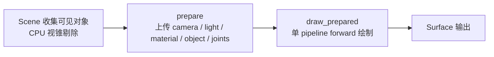
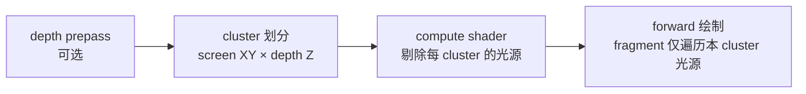
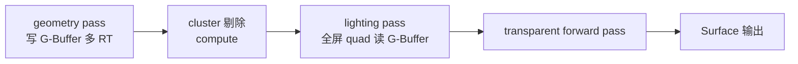

# 渲染管线分级方案：Forward+ / Deferred+ 预研

> 本文档为预研报告，**不包含任何代码实现**。目的是在引入 Forward+ / Deferred+ 之前，先评估它们在本项目当前规模（**5–6 个光源**）下的成本与收益，并给出建议的渐进落地路径。

## 1. 现状梳理

### 1.1 当前渲染流程

当前由 [WgpuSceneRenderer](file:///Users/qianqians/Documents/geese/crates/render/src/wgpu_renderer.rs) 驱动一条单一的 forward pass：



- **可见性剔除**：在 [Scene](file:///Users/qianqians/Documents/geese/crates/scene/src/scene.rs) 层做 CPU 视锥剔除，再交给渲染器。
- **资源准备**：`prepare` 阶段一次性把相机、光照、材质、对象矩阵、骨骼矩阵全部上传到 uniform buffer。
- **绘制**：`draw_prepared` 内只有一条 pipeline，按对象循环 `set_bind_group + draw`。

### 1.2 Bind Group 布局

| Group | Binding | 内容 |
|-------|---------|------|
| 0 | 0 | `Camera`（view-projection + camera_position） |
| 0 | 1 | `Light`（单 directional：direction / color / ambient） |
| 1 | 0 | `Material`（base_color_factor + params） |
| 1 | 1–2 | `normal_texture` + `normal_sampler` |
| 2 | 0 | `Object`（model + normal_matrix + skin flag + 128 个 joint 矩阵） |

### 1.3 Shader 现状

[mesh.wgsl](file:///Users/qianqians/Documents/geese/crates/render/shaders/mesh.wgsl) 的 fragment 阶段是 **Blinn-Phong**，非 PBR：

- `diffuse = max(dot(N, L), 0) · light.color · base_color`
- `specular = pow(max(dot(N, H), 0), shininess) · light.color`
- 仅支持 **1 个 directional 光**，无法直接扩展为多光源。

### 1.4 现状限制小结

| 维度 | 当前状态 | 影响 |
|------|---------|------|
| 光源数量 | 1（directional） | 无法表达室内点光源/聚光 |
| 着色模型 | Blinn-Phong | 视觉天花板低，金属/粗糙度无法物理一致地表达 |
| 光照剔除 | 仅 CPU 视锥剔除 | 多光源时每个 fragment 都要遍历所有光源 |
| z-prepass | 无 | overdraw 完全靠 GPU early-Z |
| Pass 数 | 1 | 无 G-Buffer / 无延迟解耦 |

## 2. Forward+ 原理与本项目适配

### 2.1 原理

Forward+（亦称 Tiled / Clustered Forward）在传统 forward 基础上增加一个 **GPU 光照剔除** 步骤：



- 屏幕被划分为 `tile_x × tile_y × depth_slice` 个 cluster（典型 16×9×24 = 3456）。
- compute shader 用包围盒/球体测试把全局光源列表压成每 cluster 的索引列表。
- fragment 只读自己所在 cluster 的光源 → 复杂度从 `O(L)` 变为 `O(L_local)`。

### 2.2 本项目适配点

| 改造项 | 内容 |
|--------|------|
| 光源结构 | 引入 `PointLight` / `SpotLight`，使用 storage buffer 存全局光源数组 |
| Cluster 数据 | `cluster_light_offsets` + `cluster_light_indices`（storage buffer 或 storage texture） |
| 新增 shader | `cluster_culling.wgsl`（compute） |
| mesh.wgsl 改造 | 升级为 PBR（Cook-Torrance + GGX + Lambertian），按 cluster 索引循环本 tile 光源 |
| Bind group | 在 group0 增加 `LightStorage` / cluster 数据 |
| renderer 流程 | `prepare` → `dispatch cluster_culling` → `draw_prepared`（forward） |

### 2.3 5–6 光源场景的实际效果

- **剔除收益**：cluster 内最多 6 个光源，每个 fragment 多花的索引解引用甚至比直接遍历 6 个还慢，**剔除收益 ≈ 0**。
- **架构收益**：cluster 框架本身可作为未来扩展锚点，但当前不需要立即引入。
- **真正的视觉收益来源**：从 Blinn-Phong 升级到 PBR，与 Forward+ 与否无关。

## 3. Deferred+ 原理与本项目适配

### 3.1 原理

Deferred+（Clustered Deferred）把着色拆分为两阶段：



- geometry pass 输出几何/材质属性到多张 render target（G-Buffer）。
- lighting pass 在屏幕空间把每个像素的属性 + cluster 光源列表合并成最终颜色。
- 透明物体**无法走 deferred**，必须额外 forward pass。

### 3.2 G-Buffer 槽位草案（4 RT 方案）

| Slot | 格式 | 内容 |
|------|------|------|
| RT0 | RGBA8 | base_color.rgb + occlusion |
| RT1 | RGB10A2 | 法线（八面体编码占 RGB10）+ material_id（A2） |
| RT2 | RG8 | metallic + roughness |
| Depth | Depth32Float | 深度（隐式作为 RT3） |

### 3.3 本项目适配代价

| 维度 | 影响 |
|------|------|
| renderer 重写 | 必须新增 geometry pipeline / lighting pipeline / transparent pipeline 三套 |
| Bind group | G-Buffer 采样、storage 数据全部要重新设计 |
| MSAA | Deferred+ 与 MSAA 根本性冲突，需要 sample 化 G-Buffer，带宽爆炸 |
| 透明物体 | 必须维护一条独立 forward 路径作为 fallback |
| WebGPU 兼容 | 多 RT 与 storage texture 在不同后端的支持差异需要逐一验证 |

## 4. 5–6 光源下的成本/收益分析

| 维度 | Forward+ | Deferred+ |
|------|----------|-----------|
| 剔除收益（5–6 光源） | ≈ 0 | ≈ 0 |
| 视觉提升来源 | PBR 着色器升级 | PBR 着色器升级 |
| 实现复杂度 | 中（新增 1 compute + storage buffer 结构） | 高（多 pipeline + 多 RT + 透明 fallback） |
| 带宽开销 | 与 forward 接近 | 显著增加（G-Buffer 写入 + 全屏读取） |
| MSAA 兼容 | 容易 | 困难（sample 化 G-Buffer 不可接受） |
| 透明物体 | 原生支持 | 需独立 forward 路径 |
| 未来扩展锚点 | 自然演进到大规模光源 | 适合超大场景 / 大量动态光源 |

**结论**：在 5–6 光源规模下，Forward+ 与 Deferred+ **均属于 over-engineering**。当前最划算的视觉/成本比来自于把着色器从 Blinn-Phong 升级到 PBR 多光源，而不是引入哪一种 + 类管线。

## 5. 推荐落地路径（渐进三阶段）


### 5.1 阶段 A（建议立即执行）

- 升级 [mesh.wgsl](file:///Users/qianqians/Documents/geese/crates/render/shaders/mesh.wgsl) 为 PBR：Cook-Torrance + GGX + Schlick Fresnel + Lambertian。
- `Light` uniform 扩展为定长数组（建议 `MAX_LIGHTS = 16`），支持 directional / point / spot 三类。
- 不引入 cluster、不改 bind group 数量、不重写 renderer 主流程。
- **此阶段即可完整解决 5–6 光源的实际需求**。

### 5.2 阶段 B（光源数突破 64 后再启动）

- 在阶段 A 之上，把光源 uniform 改为 storage buffer。
- 引入 cluster 划分 + compute culling。
- 自然演进为 Forward+，无需推翻阶段 A 的 shader 与材质系统。

### 5.3 阶段 C（场景规模成倍增长后）

- 评估是否引入 Deferred+ 作为 Forward+ 之外的可切换路径。
- 必要前置：
  - 透明物体已有明确分流策略
  - 美术资源对 MSAA 让位于 TAA / FXAA 没有疑义
  - 项目中存在大量动态点光源（数百级别）

## 6. 抽象接口设计草案（不在本预研中实现）

为后续阶段 B/C 降低改造成本，建议未来引入 `ScenePipeline` trait，把渲染路径作为可替换策略：

```rust
// 仅为设计草案，不在当前阶段落地
pub enum RenderingPath {
    Forward,        // 当前
    ForwardPlus,    // 阶段 B
    DeferredPlus,   // 阶段 C
}

pub struct PreparedFrame {
    // 视图、裁剪结果、上传完成的 buffer 句柄等
}

pub trait ScenePipeline {
    fn prepare(&mut self, scene: &Scene, ctx: &FrameContext) -> PreparedFrame;
    fn render(&self, encoder: &mut CommandEncoder, frame: &PreparedFrame, target: &TextureView);
    fn path(&self) -> RenderingPath;
}
```

- 当前的 [WgpuSceneRenderer](file:///Users/qianqians/Documents/geese/crates/render/src/wgpu_renderer.rs) 重构为该 trait 的 `Forward` 实现。
- 阶段 B 增加 `ForwardPlusPipeline`，复用阶段 A 的 PBR shader 模块。
- 阶段 C 再增加 `DeferredPlusPipeline`，并提供 `transparent forward` 子 pass。

## 7. 风险与开放问题

| 风险 | 描述 | 缓解 |
|------|------|------|
| WebGPU storage texture 兼容性 | 不同后端对 storage texture / atomics 支持差异较大 | Forward+/Deferred+ 实现前先做平台兼容矩阵验证 |
| MSAA 与 Deferred+ 冲突 | sample 化 G-Buffer 带宽不可接受 | 阶段 C 启动前确认抗锯齿策略可让位于 TAA/FXAA |
| 透明物体 fallback | Deferred+ 无法处理半透明 | 维持独立 forward 透明路径，材质系统需标记 `is_transparent` |
| PBR 视觉变更 | 升级着色后既有资源外观会变 | 美术 review；保留 `unlit` 材质标记作为兼容退路 |
| 光源数据归一化 | point/spot/directional 在数学上需要统一表达 | 阶段 A 设计 uniform 时即按"通用光源"建模，避免阶段 B 重构 |

## 8. 附录

### 8.1 Forward+ Cluster 划分参数建议

| 参数 | 建议值 | 说明 |
|------|--------|------|
| tile 大小 | 屏幕 16×9（或 16×16 像素） | 与典型 GPU warp 尺寸对齐 |
| depth slice | 24 | 指数分布 `z_n = z_near · (z_far/z_near)^(n/N)` |
| 单 cluster 最大光源 | 64–128 | 受 uniform/storage 容量限制 |

### 8.2 Deferred+ G-Buffer 编码参考

- **法线**：八面体编码（octahedron），可压到 RGB10 而几乎无损。
- **材质 ID**：8-bit 索引到一张材质参数 storage buffer，避免在 G-Buffer 中重复存放罕用属性。
- **emissive / clearcoat**：作为可选 RT4，仅在场景需要时启用。

### 8.3 公开实践参考

- DOOM 2016 / Eternal：Forward+ + cluster culling 大规模动态光源
- Detroit: Become Human：Deferred+ + 透明 forward 分流
- Granite SDK / Filament 文档：跨平台 PBR + tiled 实现细节
- Aras Pranckevičius 博客：tiled vs clustered 对比基准

---

**结论速览**：5–6 光源下，**先做阶段 A（PBR forward + 多光源 uniform）**；Forward+ 留作未来锚点；Deferred+ 在可见的将来都不必引入。
