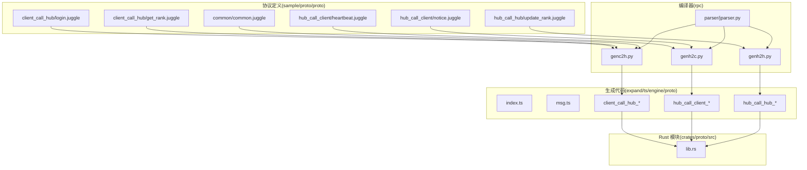
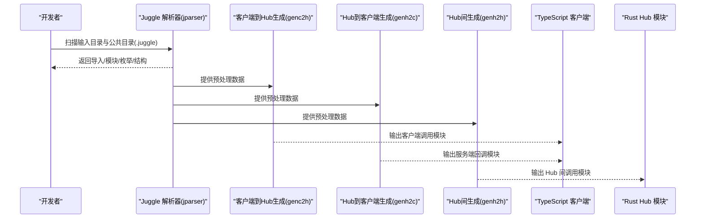
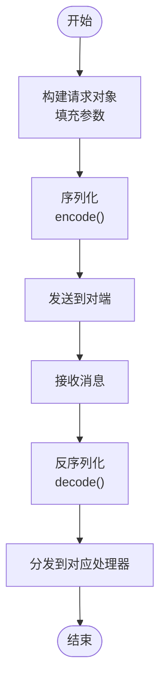
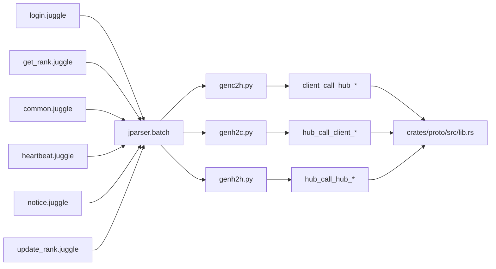

# 协议示例

<cite>
**本文引用的文件**
- [sample/proto/proto/client_call_hub/login.juggle](file://sample/proto/proto/client_call_hub/login.juggle)
- [sample/proto/proto/client_call_hub/get_rank.juggle](file://sample/proto/proto/client_call_hub/get_rank.juggle)
- [sample/proto/proto/common/common.juggle](file://sample/proto/proto/common/common.juggle)
- [sample/proto/proto/hub_call_client/heartbeat.juggle](file://sample/proto/proto/hub_call_client/heartbeat.juggle)
- [sample/proto/proto/hub_call_client/notice.juggle](file://sample/proto/proto/hub_call_client/notice.juggle)
- [sample/proto/proto/hub_call_hub/update_rank.juggle](file://sample/proto/proto/hub_call_hub/update_rank.juggle)
- [rpc/genc2h.py](file://rpc/genc2h.py)
- [rpc/genh2c.py](file://rpc/genh2c.py)
- [rpc/genh2h.py](file://rpc/genh2h.py)
- [rpc/parser/jparser.py](file://rpc/parser/jparser.py)
- [crates/proto/src/lib.rs](file://crates/proto/src/lib.rs)
- [expand/ts/engine/proto/index.ts](file://expand/ts/engine/proto/index.ts)
- [expand/ts/engine/proto/msg.ts](file://expand/ts/engine/proto/msg.ts)
- [expand/ts/engine/proto/client_call_hub_err.ts](file://expand/ts/engine/proto/client_call_hub_err.ts)
- [expand/ts/engine/proto/client_call_hub_ntf.ts](file://expand/ts/engine/proto/client_call_hub_ntf.ts)
- [expand/ts/engine/proto/client_call_hub_rpc.ts](file://expand/ts/engine/proto/client_call_hub_rpc.ts)
- [expand/ts/engine/proto/client_call_hub_rsp.ts](file://expand/ts/engine/proto/client_call_hub_rsp.ts)
- [expand/ts/engine/proto/hub_call_client_err.ts](file://expand/ts/engine/proto/hub_call_client_err.ts)
- [expand/ts/engine/proto/hub_call_client_global.ts](file://expand/ts/engine/proto/hub_call_client_global.ts)
- [expand/ts/engine/proto/hub_call_client_ntf.ts](file://expand/ts/engine/proto/hub_call_client_ntf.ts)
- [expand/ts/engine/proto/hub_call_client_rpc.ts](file://expand/ts/engine/proto/hub_call_client_rpc.ts)
- [expand/ts/engine/proto/hub_call_client_rsp.ts](file://expand/ts/engine/proto/hub_call_client_rsp.ts)
- [expand/ts/engine/proto/hub_call_hub_err.ts](file://expand/ts/engine/proto/hub_call_hub_err.ts)
- [expand/ts/engine/proto/hub_call_hub_rpc.ts](file://expand/ts/engine/proto/hub_call_hub_rpc.ts)
- [expand/ts/engine/proto/hub_call_hub_rsp.ts](file://expand/ts/engine/proto/hub_call_hub_rsp.ts)
</cite>

## 目录
1. [引言](#引言)
2. [项目结构](#项目结构)
3. [核心组件](#核心组件)
4. [架构总览](#架构总览)
5. [详细组件分析](#详细组件分析)
6. [依赖分析](#依赖分析)
7. [性能考虑](#性能考虑)
8. [故障排查指南](#故障排查指南)
9. [结论](#结论)
10. [附录](#附录)

## 引言
本文件面向开发者，系统性解析 geese 协议示例中的 Juggle 协议文件结构与语法规则，并结合协议编译器与生成代码，给出客户端到 Hub、Hub 到客户端、Hub 间通信的消息格式与字段定义说明。文档还涵盖协议版本管理、向后兼容性与扩展方法建议，以及消息序列化/反序列化与错误处理的最佳实践与参考模板。

## 项目结构
本仓库采用按功能域划分的模块化组织方式：协议定义位于 sample/proto/proto 下，编译器位于 rpc/ 目录，生成的 TypeScript 客户端代码位于 expand/ts/engine/proto，Rust 模块入口位于 crates/proto/src/lib.rs。下图展示与协议示例相关的目录与文件关系：

图表来源
- [sample/proto/proto/client_call_hub/login.juggle:1-5](file://sample/proto/proto/client_call_hub/login.juggle#L1-L5)
- [sample/proto/proto/client_call_hub/get_rank.juggle:1-6](file://sample/proto/proto/client_call_hub/get_rank.juggle#L1-L6)
- [sample/proto/proto/common/common.juggle:1-14](file://sample/proto/proto/common/common.juggle#L1-L14)
- [sample/proto/proto/hub_call_client/heartbeat.juggle:1-5](file://sample/proto/proto/hub_call_client/heartbeat.juggle#L1-L5)
- [sample/proto/proto/hub_call_client/notice.juggle:1-5](file://sample/proto/proto/hub_call_client/notice.juggle#L1-L5)
- [sample/proto/proto/hub_call_hub/update_rank.juggle:1-5](file://sample/proto/proto/hub_call_hub/update_rank.juggle#L1-L5)
- [rpc/genc2h.py:40-101](file://rpc/genc2h.py#L40-L101)
- [rpc/genh2c.py:40-101](file://rpc/genh2c.py#L40-L101)
- [rpc/genh2h.py:22-51](file://rpc/genh2h.py#L22-L51)
- [rpc/parser/jparser.py:27-65](file://rpc/parser/jparser.py#L27-L65)
- [expand/ts/engine/proto/index.ts](file://expand/ts/engine/proto/index.ts)
- [expand/ts/engine/proto/msg.ts](file://expand/ts/engine/proto/msg.ts)
- [crates/proto/src/lib.rs:1-5](file://crates/proto/src/lib.rs#L1-L5)

章节来源
- [sample/proto/proto/client_call_hub/login.juggle:1-5](file://sample/proto/proto/client_call_hub/login.juggle#L1-L5)
- [sample/proto/proto/client_call_hub/get_rank.juggle:1-6](file://sample/proto/proto/client_call_hub/get_rank.juggle#L1-L6)
- [sample/proto/proto/common/common.juggle:1-14](file://sample/proto/proto/common/common.juggle#L1-L14)
- [sample/proto/proto/hub_call_client/heartbeat.juggle:1-5](file://sample/proto/proto/hub_call_client/heartbeat.juggle#L1-L5)
- [sample/proto/proto/hub_call_client/notice.juggle:1-5](file://sample/proto/proto/hub_call_client/notice.juggle#L1-L5)
- [sample/proto/proto/hub_call_hub/update_rank.juggle:1-5](file://sample/proto/proto/hub_call_hub/update_rank.juggle#L1-L5)
- [rpc/genc2h.py:40-101](file://rpc/genc2h.py#L40-L101)
- [rpc/genh2c.py:40-101](file://rpc/genh2c.py#L40-L101)
- [rpc/genh2h.py:22-51](file://rpc/genh2h.py#L22-L51)
- [rpc/parser/jparser.py:27-65](file://rpc/parser/jparser.py#L27-L65)
- [crates/proto/src/lib.rs:1-5](file://crates/proto/src/lib.rs#L1-L5)

## 核心组件
- 协议定义层：以 .juggle 文件描述服务接口、请求/响应/通知/错误类型及通用数据结构。
- 编译器层：解析 .juggle，生成客户端/服务端代码（Python/TypeScript），并支持 Hub 间通信生成。
- 生成代码层：TypeScript 客户端侧包含统一的消息封装与各类 RPC/通知/错误模块；Rust 模块入口导出各子模块。
- 运行时序列化：TypeScript 使用 @msgpack/msgpack 的 encode/decode；Python 使用 engine.msgpack。

章节来源
- [rpc/parser/jparser.py:22-25](file://rpc/parser/jparser.py#L22-L25)
- [rpc/genc2h.py:40-75](file://rpc/genc2h.py#L40-L75)
- [rpc/genh2c.py:40-75](file://rpc/genh2c.py#L40-L75)
- [rpc/genh2h.py:22-45](file://rpc/genh2h.py#L22-L45)
- [expand/ts/engine/proto/msg.ts](file://expand/ts/engine/proto/msg.ts)
- [crates/proto/src/lib.rs:1-5](file://crates/proto/src/lib.rs#L1-L5)

## 架构总览
下图展示从协议定义到生成代码与运行时调用的整体流程：

图表来源
- [rpc/parser/jparser.py:27-65](file://rpc/parser/jparser.py#L27-L65)
- [rpc/genc2h.py:49-74](file://rpc/genc2h.py#L49-L74)
- [rpc/genh2c.py:49-74](file://rpc/genh2c.py#L49-L74)
- [rpc/genh2h.py:29-45](file://rpc/genh2h.py#L29-L45)

## 详细组件分析

### 协议语法与结构
- 导入与模块
  - 通过 import 引入公共模块，避免重复定义。
  - 支持 entity_service（实体级服务）与 global_service（全局服务）两类服务声明。
- 请求/响应/通知/错误
  - req(...) 定义请求参数列表。
  - rsp(...) 定义成功响应参数列表。
  - ntf(...) 定义服务器向客户端推送的通知。
  - err(...) 定义错误码类型。
- 基本类型与复合类型
  - 基本类型：string、int32 等。
  - 复合类型：struct（结构体）、enum（枚举）、数组（如 T[]）。

示例文件路径
- [login.juggle:1-5](file://sample/proto/proto/client_call_hub/login.juggle#L1-L5)
- [get_rank.juggle:1-6](file://sample/proto/proto/client_call_hub/get_rank.juggle#L1-L6)
- [common.juggle:1-14](file://sample/proto/proto/common/common.juggle#L1-L14)
- [heartbeat.juggle:1-5](file://sample/proto/proto/hub_call_client/heartbeat.juggle#L1-L5)
- [notice.juggle:1-5](file://sample/proto/proto/hub_call_client/notice.juggle#L1-L5)
- [update_rank.juggle:1-5](file://sample/proto/proto/hub_call_hub/update_rank.juggle#L1-L5)

章节来源
- [sample/proto/proto/client_call_hub/login.juggle:1-5](file://sample/proto/proto/client_call_hub/login.juggle#L1-L5)
- [sample/proto/proto/client_call_hub/get_rank.juggle:1-6](file://sample/proto/proto/client_call_hub/get_rank.juggle#L1-L6)
- [sample/proto/proto/common/common.juggle:1-14](file://sample/proto/proto/common/common.juggle#L1-L14)
- [sample/proto/proto/hub_call_client/heartbeat.juggle:1-5](file://sample/proto/proto/hub_call_client/heartbeat.juggle#L1-L5)
- [sample/proto/proto/hub_call_client/notice.juggle:1-5](file://sample/proto/proto/hub_call_client/notice.juggle#L1-L5)
- [sample/proto/proto/hub_call_hub/update_rank.juggle:1-5](file://sample/proto/proto/hub_call_hub/update_rank.juggle#L1-L5)

### 客户端到 Hub 的消息格式与字段
- 登录流程
  - 服务：entity_service login
  - 请求：req(string sdk_uuid)
  - 响应：rsp(bool is_displace)
  - 错误：err(error_code err)
- 查询排行榜
  - 服务：entity_service get_rank
  - 自身排名查询：req(string entity_id) -> rsp(role_rank_info rank)
  - 排行区间查询：req(int32 start, int32 end) -> rsp(role_rank_info[] rank_list)
  - 错误：err(error_code err)

字段定义参考
- error_code：枚举，包含 success=0 等。
- role_rank_info：包含 role_name、entity_id、rank 字段。
- client_time_info：包含 entity_id、timetmp 字段。

章节来源
- [sample/proto/proto/client_call_hub/login.juggle:1-5](file://sample/proto/proto/client_call_hub/login.juggle#L1-L5)
- [sample/proto/proto/client_call_hub/get_rank.juggle:1-6](file://sample/proto/proto/client_call_hub/get_rank.juggle#L1-L6)
- [sample/proto/proto/common/common.juggle:1-14](file://sample/proto/proto/common/common.juggle#L1-L14)

### Hub 到客户端的消息格式与字段
- 心跳校时
  - 服务：entity_service heartbeat
  - 请求：req(string entity_id)
  - 响应：rsp(client_time_info time_info)
  - 错误：err(error_code err)
- 全局通知
  - 服务：global_service notice
  - 通知：ntf(string msg)

字段定义参考
- client_time_info：包含 entity_id、timetmp 字段。
- error_code：枚举，包含 success=0 等。

章节来源
- [sample/proto/proto/hub_call_client/heartbeat.juggle:1-5](file://sample/proto/proto/hub_call_client/heartbeat.juggle#L1-L5)
- [sample/proto/proto/hub_call_client/notice.juggle:1-5](file://sample/proto/proto/hub_call_client/notice.juggle#L1-L5)
- [sample/proto/proto/common/common.juggle:1-14](file://sample/proto/proto/common/common.juggle#L1-L14)

### Hub 间通信的消息格式与字段
- 更新排行
  - 服务：entity_service update_rank
  - 请求：req(string entity_id)
  - 响应：rsp()
  - 错误：err(error_code err)

章节来源
- [sample/proto/proto/hub_call_hub/update_rank.juggle:1-5](file://sample/proto/proto/hub_call_hub/update_rank.juggle#L1-L5)
- [sample/proto/proto/common/common.juggle:1-14](file://sample/proto/proto/common/common.juggle#L1-L14)

### 协议版本管理、向后兼容与扩展
- 版本管理
  - 建议在 .juggle 中通过注释或独立版本文件维护协议版本号，便于编译器与运行时识别。
- 向后兼容
  - 新增字段时保持可选性（例如默认值），避免破坏旧客户端。
  - 避免删除或重命名已存在字段；如需变更，引入新版本接口并保留旧接口一段时间。
- 扩展方法
  - 通过新增 .juggle 文件并在 import 中引用公共模块，实现功能扩展而不影响既有接口。
  - 对于 Hub 间通信，使用 hub_call_hub 命名空间新增实体/全局服务。

[本节为通用指导，不直接分析具体文件，故无“章节来源”]

### 协议编译与生成代码使用指南
- Python 生成
  - 客户端到 Hub：genc2h.py 负责生成客户端调用模块与服务端模块。
  - Hub 到客户端：genh2c.py 负责生成客户端模块与服务端调用模块。
  - Hub 间：genh2h.py 负责生成 Hub 间调用模块。
- TypeScript 生成
  - 编译器会生成 index.ts、msg.ts 以及各类 *_cli.ts/*_svr.ts 模块，客户端通过 @msgpack/msgpack 进行编码解码。
- Rust 集成
  - crates/proto/src/lib.rs 统一导出 common、client、gate、hub、dbproxy 子模块，便于 Hub 服务集成。

章节来源
- [rpc/genc2h.py:40-101](file://rpc/genc2h.py#L40-L101)
- [rpc/genh2c.py:40-101](file://rpc/genh2c.py#L40-L101)
- [rpc/genh2h.py:22-51](file://rpc/genh2h.py#L22-L51)
- [expand/ts/engine/proto/index.ts](file://expand/ts/engine/proto/index.ts)
- [expand/ts/engine/proto/msg.ts](file://expand/ts/engine/proto/msg.ts)
- [crates/proto/src/lib.rs:1-5](file://crates/proto/src/lib.rs#L1-L5)

### 序列化与反序列化示例（基于生成代码）
- TypeScript
  - 使用 @msgpack/msgpack 的 encode/decode 对消息进行编解码。
  - 客户端调用模块负责构造请求、发送并等待响应；服务端模块负责接收请求、执行业务逻辑并返回响应或错误。
- Python
  - 通过 engine.msgpack 提供的编解码工具完成消息传输。
- Rust
  - 通过 crates/proto 子模块提供的类型与接口进行消息处理。

章节来源
- [expand/ts/engine/proto/msg.ts](file://expand/ts/engine/proto/msg.ts)
- [rpc/genc2h.py:33-38](file://rpc/genc2h.py#L33-L38)
- [rpc/genh2c.py:33-38](file://rpc/genh2c.py#L33-L38)
- [crates/proto/src/lib.rs:1-5](file://crates/proto/src/lib.rs#L1-L5)

### 错误处理机制
- 错误模型
  - 所有 RPC 均提供 err(...) 定义错误码类型，客户端与服务端均需遵循该约定。
- 常见错误场景
  - 参数校验失败、业务逻辑异常、网络中断等。
- 处理建议
  - 在客户端捕获错误并提示用户或自动重试；在服务端记录日志并返回标准化错误码。

章节来源
- [sample/proto/proto/client_call_hub/login.juggle:1-5](file://sample/proto/proto/client_call_hub/login.juggle#L1-L5)
- [sample/proto/proto/client_call_hub/get_rank.juggle:1-6](file://sample/proto/proto/client_call_hub/get_rank.juggle#L1-L6)
- [sample/proto/proto/hub_call_client/heartbeat.juggle:1-5](file://sample/proto/proto/hub_call_client/heartbeat.juggle#L1-L5)
- [sample/proto/proto/hub_call_client/notice.juggle:1-5](file://sample/proto/proto/hub_call_client/notice.juggle#L1-L5)
- [sample/proto/proto/hub_call_hub/update_rank.juggle:1-5](file://sample/proto/proto/hub_call_hub/update_rank.juggle#L1-L5)
- [sample/proto/proto/common/common.juggle:1-14](file://sample/proto/proto/common/common.juggle#L1-L14)

### 消息序列化流程（概念图）

[本图为概念流程，不直接映射具体源码，故无“图表来源”]

## 依赖分析
- 协议定义依赖
  - 各 .juggle 文件通过 import 引用公共模块 common.juggle，确保枚举与结构体复用。
- 编译器依赖
  - genc2h.py、genh2c.py、genh2h.py 均依赖 jparser.batch 解析输入目录与公共目录，生成对应语言的模块。
- 生成代码依赖
  - TypeScript 客户端依赖 index.ts、msg.ts 与各类 *_cli.ts/*_svr.ts 模块；Rust Hub 依赖 crates/proto/src/lib.rs 导出的子模块。

图表来源
- [rpc/parser/jparser.py:27-65](file://rpc/parser/jparser.py#L27-L65)
- [rpc/genc2h.py:49-74](file://rpc/genc2h.py#L49-L74)
- [rpc/genh2c.py:49-74](file://rpc/genh2c.py#L49-L74)
- [rpc/genh2h.py:29-45](file://rpc/genh2h.py#L29-L45)
- [crates/proto/src/lib.rs:1-5](file://crates/proto/src/lib.rs#L1-L5)

章节来源
- [rpc/parser/jparser.py:27-65](file://rpc/parser/jparser.py#L27-L65)
- [rpc/genc2h.py:49-74](file://rpc/genc2h.py#L49-L74)
- [rpc/genh2c.py:49-74](file://rpc/genh2c.py#L49-L74)
- [rpc/genh2h.py:29-45](file://rpc/genh2h.py#L29-L45)
- [crates/proto/src/lib.rs:1-5](file://crates/proto/src/lib.rs#L1-L5)

## 性能考虑
- 序列化开销
  - 优先使用二进制编码（如 @msgpack/msgpack）以降低带宽与 CPU 开销。
- 消息大小控制
  - 合理拆分大对象，避免一次性传输过多数据；必要时采用分页/批量策略。
- 错误快速返回
  - 在服务端尽早校验参数与状态，减少无效计算与网络往返。
- 并发与连接池
  - 客户端与 Hub 建立稳定连接池，避免频繁建连断连带来的额外开销。

[本节为通用指导，不直接分析具体文件，故无“章节来源”]

## 故障排查指南
- 常见问题
  - 编译失败：检查 .juggle 文件语法与 import 路径是否正确。
  - 类型不匹配：确认请求/响应字段与公共模块一致。
  - 运行时错误：检查错误码定义与处理分支。
- 建议步骤
  - 使用最小化协议片段复现问题。
  - 对照生成代码中的消息封装与编解码逻辑。
  - 在 Hub 与客户端分别打印原始字节流，定位序列化/反序列化问题。

[本节为通用指导，不直接分析具体文件，故无“章节来源”]

## 结论
本协议示例通过清晰的 .juggle 定义与完善的编译器链路，实现了跨语言的协议生成与运行时交互。借助统一的错误模型与消息封装，开发者可以快速扩展客户端到 Hub、Hub 到客户端以及 Hub 间的通信能力，并在保证向后兼容的前提下平滑演进协议版本。

[本节为总结性内容，不直接分析具体文件，故无“章节来源”]

## 附录
- 参考模板
  - 客户端到 Hub：参考 [login.juggle:1-5](file://sample/proto/proto/client_call_hub/login.juggle#L1-L5) 与 [get_rank.juggle:1-6](file://sample/proto/proto/client_call_hub/get_rank.juggle#L1-L6)，结合生成的 *_cli.ts 模块进行调用。
  - Hub 到客户端：参考 [heartbeat.juggle:1-5](file://sample/proto/proto/hub_call_client/heartbeat.juggle#L1-L5) 与 [notice.juggle:1-5](file://sample/proto/proto/hub_call_client/notice.juggle#L1-L5)，结合生成的 *_svr.ts 模块进行处理。
  - Hub 间通信：参考 [update_rank.juggle:1-5](file://sample/proto/proto/hub_call_hub/update_rank.juggle#L1-L5)，结合生成的 *_svr.ts 模块进行迁移/同步。

章节来源
- [sample/proto/proto/client_call_hub/login.juggle:1-5](file://sample/proto/proto/client_call_hub/login.juggle#L1-L5)
- [sample/proto/proto/client_call_hub/get_rank.juggle:1-6](file://sample/proto/proto/client_call_hub/get_rank.juggle#L1-L6)
- [sample/proto/proto/hub_call_client/heartbeat.juggle:1-5](file://sample/proto/proto/hub_call_client/heartbeat.juggle#L1-L5)
- [sample/proto/proto/hub_call_client/notice.juggle:1-5](file://sample/proto/proto/hub_call_client/notice.juggle#L1-L5)
- [sample/proto/proto/hub_call_hub/update_rank.juggle:1-5](file://sample/proto/proto/hub_call_hub/update_rank.juggle#L1-L5)