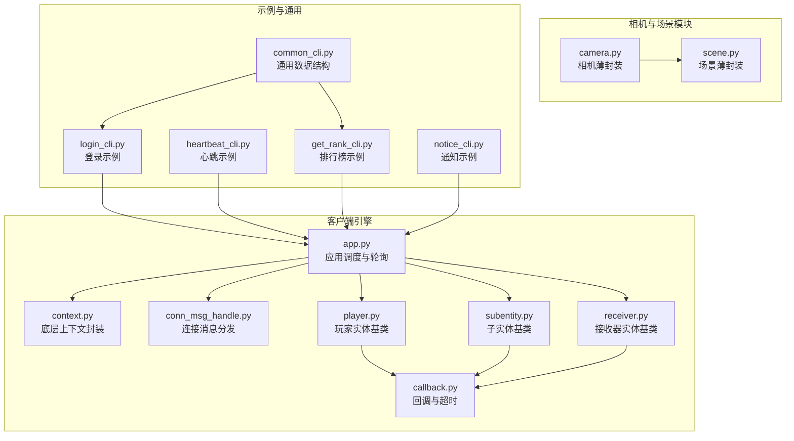
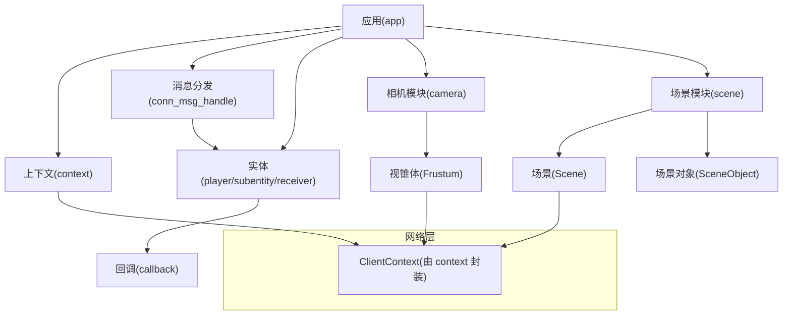
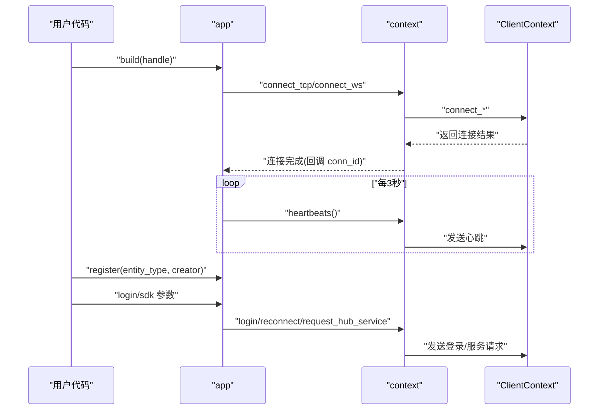
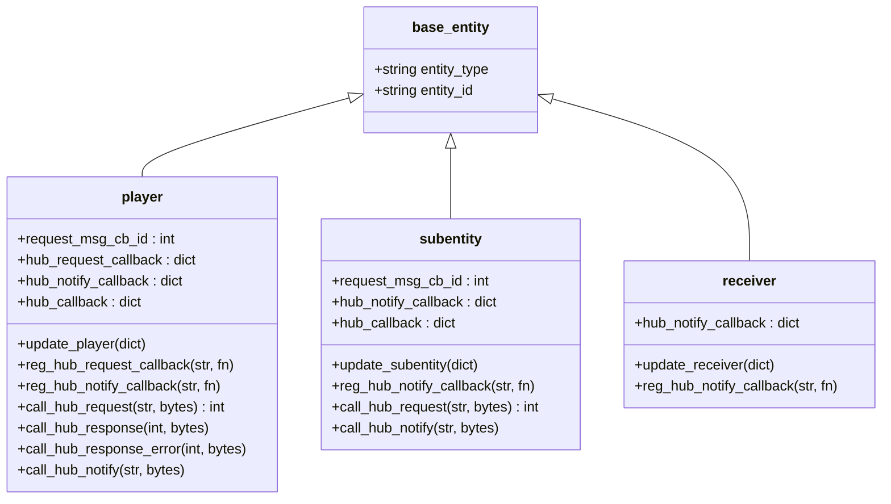
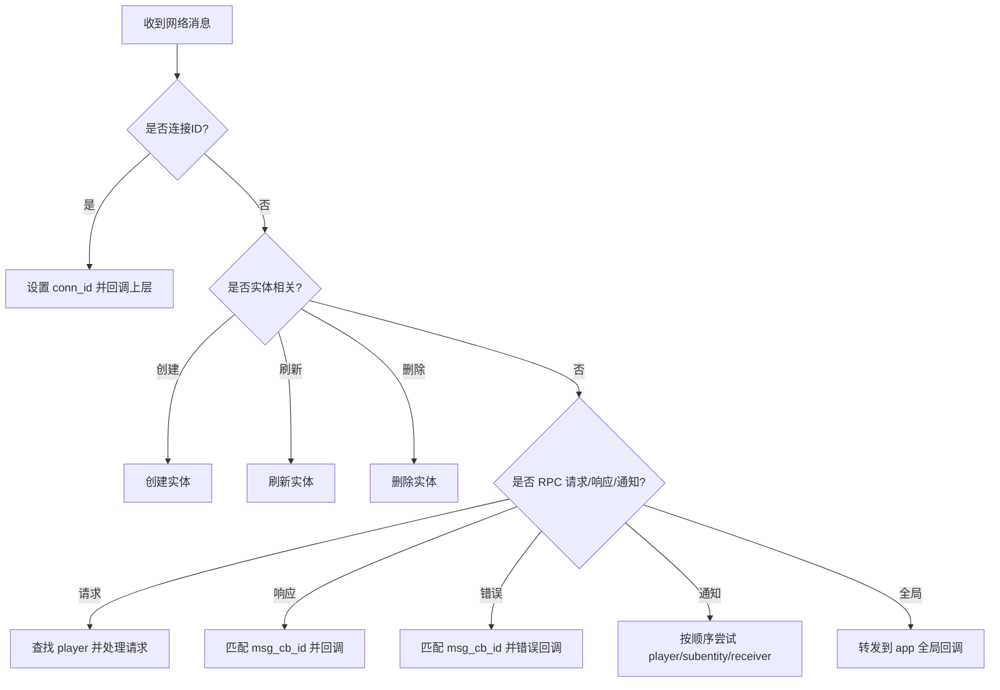
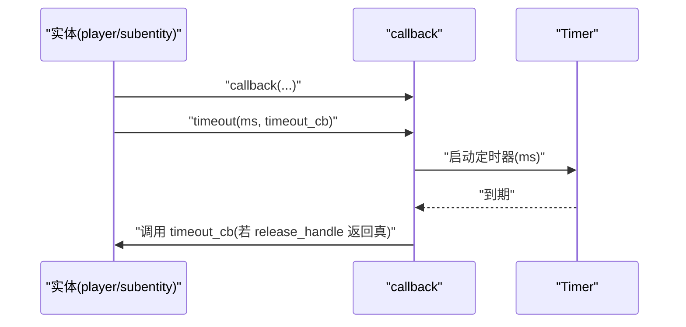
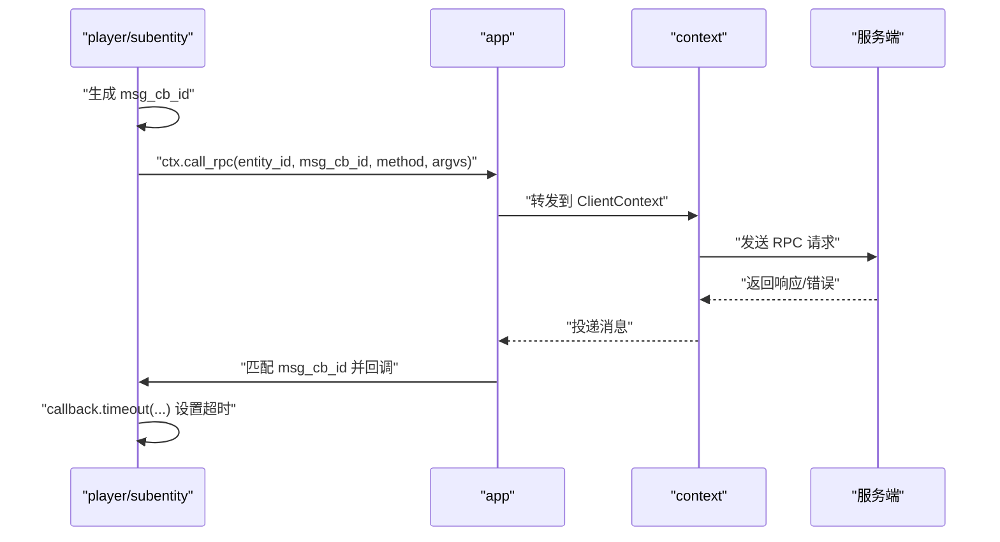
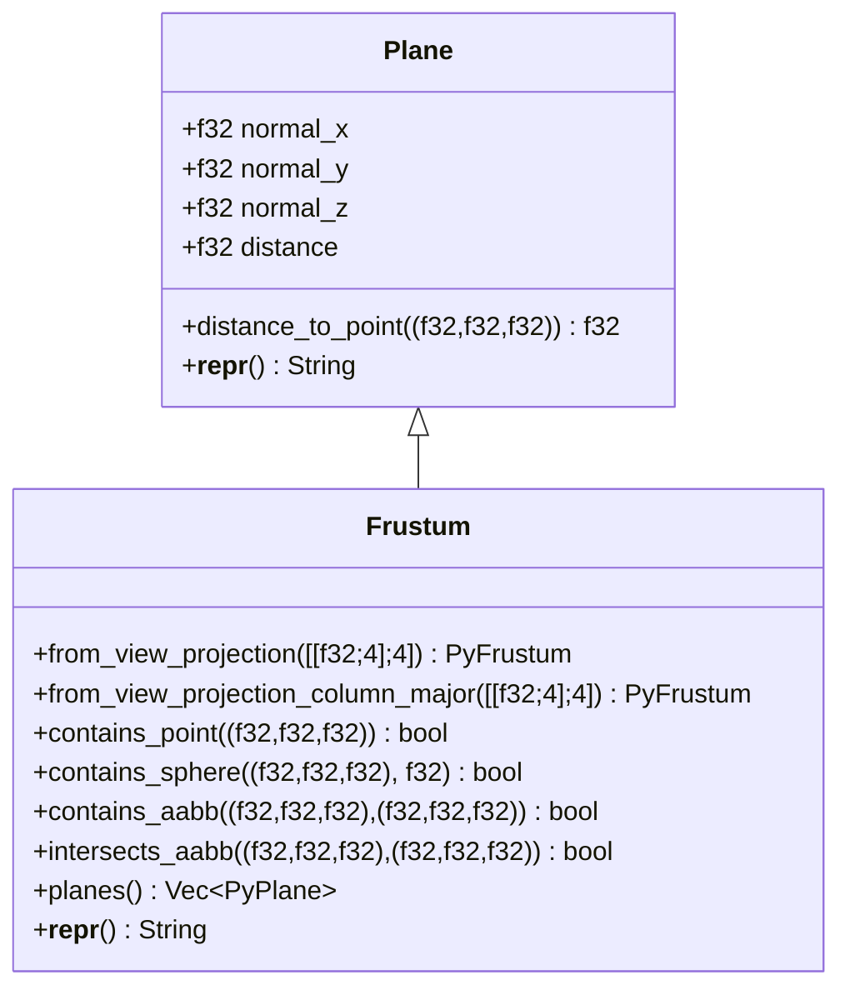
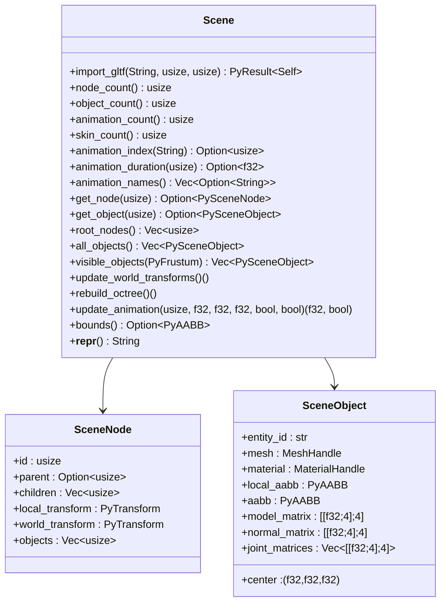
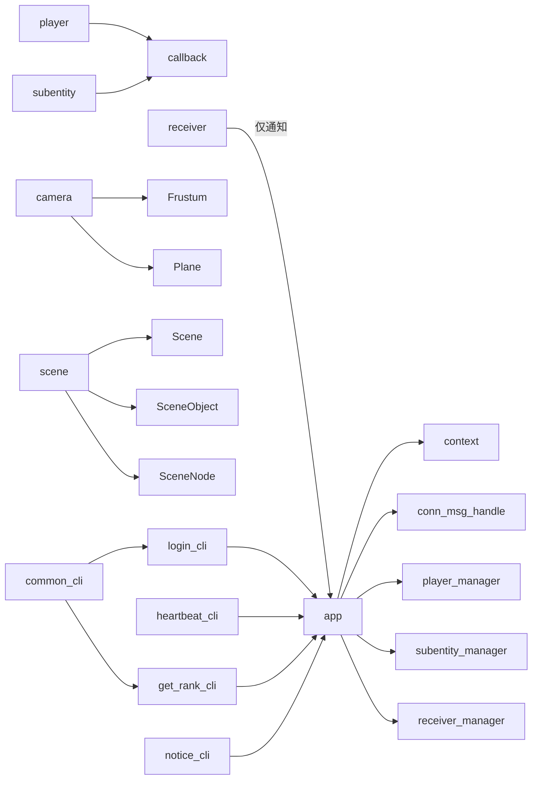

# Python 客户端示例

<cite>
**本文引用的文件**
- [app.py](file://sample/client/py/engine/engine/app.py)
- [player.py](file://sample/client/py/engine/engine/player.py)
- [subentity.py](file://sample/client/py/engine/engine/subentity.py)
- [receiver.py](file://sample/client/py/engine/engine/receiver.py)
- [context.py](file://sample/client/py/engine/engine/context.py)
- [conn_msg_handle.py](file://sample/client/py/engine/engine/conn_msg_handle.py)
- [callback.py](file://sample/client/py/engine/engine/callback.py)
- [common_cli.py](file://sample/client/py/engine/common_cli.py)
- [login_cli.py](file://sample/client/py/engine/engine/login_cli.py)
- [heartbeat_cli.py](file://sample/client/py/engine/engine/heartbeat_cli.py)
- [get_rank_cli.py](file://sample/client/py/engine/engine/get_rank_cli.py)
- [notice_cli.py](file://sample/client/py/engine/engine/notice_cli.py)
- [camera.py](file://client/engine/camera.py)
- [scene.py](file://client/engine/scene.py)
- [frustum.rs](file://crates/camera/src/frustum.rs)
- [scene.rs](file://client/lib/client/src/py/scene.rs)
- [camera.rs](file://client/lib/client/src/py/camera.rs)
</cite>

## 目录
1. [简介](#简介)
2. [项目结构](#项目结构)
3. [核心组件](#核心组件)
4. [架构总览](#架构总览)
5. [详细组件分析](#详细组件分析)
6. [相机与场景使用示例](#相机与场景使用示例)
7. [依赖分析](#依赖分析)
8. [性能考虑](#性能考虑)
9. [故障排查指南](#故障排查指南)
10. [结论](#结论)
11. [附录](#附录)

## 简介
本文件面向 Python 客户端 SDK 的使用者与集成者，提供从初始化、连接建立、实体注册到消息处理的完整使用示例与最佳实践。重点解析 SamplePlayer 与 RankSubEntity 的实现模式，说明回调函数与超时处理机制，并给出登录、心跳、排行榜查询与通知处理的可操作示例。同时，展示如何使用 login_caller、get_rank_caller 等 RPC 调用器进行远程过程调用。

**新增** 本版本增加了相机与场景模块的完整使用示例，包括 GLTF 文件导入、视锥体测试和场景对象查询的典型用法。

## 项目结构
客户端引擎位于 sample/client/py/engine/engine 下，围绕 app、player、subentity、receiver、context、conn_msg_handle、callback 等模块构建；sample/client/py/engine 提供通用数据结构与 CLI 示例（如登录、心跳、排行榜、通知）。



**图表来源**
- [app.py:1-157](file://sample/client/py/engine/engine/app.py#L1-L157)
- [context.py:1-39](file://sample/client/py/engine/engine/context.py#L1-L39)
- [conn_msg_handle.py:1-86](file://sample/client/py/engine/engine/conn_msg_handle.py#L1-L86)
- [player.py:1-108](file://sample/client/py/engine/engine/player.py#L1-L108)
- [subentity.py:1-89](file://sample/client/py/engine/engine/subentity.py#L1-L89)
- [receiver.py:1-48](file://sample/client/py/engine/engine/receiver.py#L1-L48)
- [callback.py:1-23](file://sample/client/py/engine/engine/callback.py#L1-L23)
- [camera.py:1-12](file://client/engine/camera.py#L1-L12)
- [scene.py:1-35](file://client/engine/scene.py#L1-L35)
- [login_cli.py](file://sample/client/py/engine/engine/login_cli.py)
- [heartbeat_cli.py](file://sample/client/py/engine/engine/heartbeat_cli.py)
- [get_rank_cli.py](file://sample/client/py/engine/engine/get_rank_cli.py)
- [notice_cli.py](file://sample/client/py/engine/engine/notice_cli.py)
- [common_cli.py:1-67](file://sample/client/py/engine/common_cli.py#L1-L67)

**章节来源**
- [app.py:1-157](file://sample/client/py/engine/engine/app.py#L1-L157)
- [context.py:1-39](file://sample/client/py/engine/engine/context.py#L1-L39)
- [conn_msg_handle.py:1-86](file://sample/client/py/engine/engine/conn_msg_handle.py#L1-L86)
- [player.py:1-108](file://sample/client/py/engine/engine/player.py#L1-L108)
- [subentity.py:1-89](file://sample/client/py/engine/engine/subentity.py#L1-L89)
- [receiver.py:1-48](file://sample/client/py/engine/engine/receiver.py#L1-L48)
- [callback.py:1-23](file://sample/client/py/engine/engine/callback.py#L1-L23)
- [camera.py:1-12](file://client/engine/camera.py#L1-L12)
- [scene.py:1-35](file://client/engine/scene.py#L1-L35)
- [common_cli.py:1-67](file://sample/client/py/engine/common_cli.py#L1-L67)

## 核心组件
- 应用层 app：负责初始化、连接、心跳、实体注册与更新、消息轮询、协程调度与事件派发。
- 实体层 player/subentity/receiver：统一抽象实体类型，提供 RPC 请求/响应、通知处理与回调管理。
- 上下文层 context：对底层 ClientContext 的薄封装，暴露连接、登录、RPC、通知等接口。
- 消息分发 conn_msg_handle：将底层消息映射到实体侧的回调处理。
- 回调与超时 callback：提供请求回调注册、错误回调与定时超时触发。
- 相机与场景模块：提供视锥体构造、平面操作和场景导入、查询功能。
- 示例模块：login_cli、heartbeat_cli、get_rank_cli、notice_cli 展示典型业务流程。

**章节来源**
- [app.py:40-157](file://sample/client/py/engine/engine/app.py#L40-L157)
- [player.py:9-108](file://sample/client/py/engine/engine/player.py#L9-L108)
- [subentity.py:9-89](file://sample/client/py/engine/engine/subentity.py#L9-L89)
- [receiver.py:7-48](file://sample/client/py/engine/engine/receiver.py#L7-L48)
- [context.py:4-39](file://sample/client/py/engine/engine/context.py#L4-L39)
- [conn_msg_handle.py:6-86](file://sample/client/py/engine/engine/conn_msg_handle.py#L6-L86)
- [callback.py:5-23](file://sample/client/py/engine/engine/callback.py#L5-L23)
- [camera.py:1-12](file://client/engine/camera.py#L1-L12)
- [scene.py:1-35](file://client/engine/scene.py#L1-L35)

## 架构总览
客户端采用"应用调度 + 实体抽象 + 消息分发 + 回调超时"的分层设计。应用层维护事件循环与轮询，实体层负责 RPC 生命周期与通知处理，消息分发器将底层消息路由至对应实体，回调对象承载响应与错误处理及超时逻辑。相机与场景模块通过 pyo3 暴露底层 Rust 实现，提供高效的图形学计算能力。



**图表来源**
- [app.py:60-157](file://sample/client/py/engine/engine/app.py#L60-L157)
- [context.py:4-39](file://sample/client/py/engine/engine/context.py#L4-L39)
- [conn_msg_handle.py:6-86](file://sample/client/py/engine/engine/conn_msg_handle.py#L6-L86)
- [player.py:9-108](file://sample/client/py/engine/engine/player.py#L9-L108)
- [subentity.py:9-89](file://sample/client/py/engine/engine/subentity.py#L9-L89)
- [receiver.py:7-48](file://sample/client/py/engine/engine/receiver.py#L7-L48)
- [callback.py:5-23](file://sample/client/py/engine/engine/callback.py#L5-L23)
- [camera.py:1-12](file://client/engine/camera.py#L1-L12)
- [scene.py:1-35](file://client/engine/scene.py#L1-L35)

## 详细组件分析

### 应用层 app：初始化、连接、心跳与轮询
- 初始化：构建 context、ClientPump、实体管理器与消息处理器，启动心跳定时器。
- 连接：支持 TCP 与 WebSocket，设置连接成功回调以获取 conn_id。
- 心跳：周期性触发心跳请求。
- 实体管理：注册实体类型、创建/更新/删除实体。
- 轮询：持续拉取连接消息并处理，保证帧时间控制。
- 协程：在独立线程中运行 asyncio 事件循环，支持异步任务提交。



**图表来源**
- [app.py:60-157](file://sample/client/py/engine/engine/app.py#L60-L157)
- [context.py:8-21](file://sample/client/py/engine/engine/context.py#L8-L21)

**章节来源**
- [app.py:60-157](file://sample/client/py/engine/engine/app.py#L60-L157)
- [context.py:8-21](file://sample/client/py/engine/engine/context.py#L8-L21)

### 实体层：player、subentity、receiver
- 统一基类 base_entity：记录实体类型与 ID。
- player：面向玩家侧的实体，支持注册请求回调、通知回调、RPC 请求/响应/错误处理、注册回调并分配 msg_cb_id。
- subentity：面向子实体，支持通知回调与 RPC 请求/响应/错误处理。
- receiver：面向接收器实体，仅处理通知。
- 回调管理：每个实体维护 hub_callback 映射，按 msg_cb_id 匹配响应或错误。



**图表来源**
- [base_entity.py:3-6](file://sample/client/py/engine/engine/base_entity.py#L3-L6)
- [player.py:9-108](file://sample/client/py/engine/engine/player.py#L9-L108)
- [subentity.py:9-89](file://sample/client/py/engine/engine/subentity.py#L9-L89)
- [receiver.py:7-48](file://sample/client/py/engine/engine/receiver.py#L7-L48)

**章节来源**
- [base_entity.py:3-6](file://sample/client/py/engine/engine/base_entity.py#L3-L6)
- [player.py:9-108](file://sample/client/py/engine/engine/player.py#L9-L108)
- [subentity.py:9-89](file://sample/client/py/engine/engine/subentity.py#L9-L89)
- [receiver.py:7-48](file://sample/client/py/engine/engine/receiver.py#L7-L48)

### 消息分发 conn_msg_handle：从网络到实体
- 连接事件：on_conn_id 设置全局 conn_id 并回调上层。
- 实体生命周期：on_create_remote_entity/on_refresh_entity/on_delete_remote_entity 触发实体注册/更新/删除。
- RPC 请求：on_call_rpc 查找对应 player 并交由其处理请求。
- RPC 响应/错误：on_call_rsp/on_call_err 分别匹配 player 或 subentity 的回调。
- 通知：on_call_ntf 依次尝试 player、subentity、receiver。
- 全局方法：on_call_global 转发到 app 的全局回调表。



**图表来源**
- [conn_msg_handle.py:6-86](file://sample/client/py/engine/engine/conn_msg_handle.py#L6-L86)

**章节来源**
- [conn_msg_handle.py:6-86](file://sample/client/py/engine/engine/conn_msg_handle.py#L6-L86)

### 回调与超时 callback：请求生命周期管理
- 回调注册：callback.callback(rsp, err) 注册成功与错误回调。
- 超时机制：callback.timeout(ms, timeout_cb) 启动定时器，在释放条件满足时触发超时回调。
- 释放策略：release_handle 决定是否允许超时触发，避免重复释放。



**图表来源**
- [callback.py:5-23](file://sample/client/py/engine/engine/callback.py#L5-L23)

**章节来源**
- [callback.py:5-23](file://sample/client/py/engine/engine/callback.py#L5-L23)

### 示例：登录 login_cli
- 使用 app.connect_tcp/connect_ws 建立连接。
- 在连接回调中调用 app.login 发送登录请求。
- 可结合 context.login/sd参数进行登录。
- 登录成功后进入游戏主循环，处理心跳与业务。

**章节来源**
- [app.py:94-106](file://sample/client/py/engine/engine/app.py#L94-L106)
- [context.py:14-15](file://sample/client/py/engine/engine/context.py#L14-L15)

### 示例：心跳 heartbeat_cli
- app.heartbeats 每3秒自动触发一次心跳。
- 心跳由 context.heartbeats 发送，保持长连活跃。

**章节来源**
- [app.py:73-76](file://sample/client/py/engine/engine/app.py#L73-L76)
- [context.py:23-24](file://sample/client/py/engine/engine/context.py#L23-L24)

### 示例：排行榜查询 get_rank_cli
- 通过 player/subentity 的 call_hub_request 发起 RPC 请求。
- 使用 callback 注册响应与错误回调，并设置超时。
- 使用 common_cli 中的数据结构进行序列化/反序列化。



**图表来源**
- [player.py:68-84](file://sample/client/py/engine/engine/player.py#L68-L84)
- [subentity.py:57-69](file://sample/client/py/engine/engine/subentity.py#L57-L69)
- [callback.py:17-23](file://sample/client/py/engine/engine/callback.py#L17-L23)
- [common_cli.py:14-62](file://sample/client/py/engine/common_cli.py#L14-L62)

**章节来源**
- [player.py:68-84](file://sample/client/py/engine/engine/player.py#L68-L84)
- [subentity.py:57-69](file://sample/client/py/engine/engine/subentity.py#L57-L69)
- [callback.py:17-23](file://sample/client/py/engine/engine/callback.py#L17-L23)
- [common_cli.py:14-62](file://sample/client/py/engine/common_cli.py#L14-L62)

### 示例：通知处理 notice_cli
- 通过 reg_hub_notify_callback 注册通知回调。
- 在 conn_msg_handle.on_call_ntf 到达时，按 player → subentity → receiver 顺序分发。

**章节来源**
- [player.py:62-66](file://sample/client/py/engine/engine/player.py#L62-L66)
- [subentity.py:54-55](file://sample/client/py/engine/engine/subentity.py#L54-L55)
- [receiver.py:27-28](file://sample/client/py/engine/engine/receiver.py#L27-L28)
- [conn_msg_handle.py:68-82](file://sample/client/py/engine/engine/conn_msg_handle.py#L68-L82)

## 相机与场景使用示例

### 相机模块：视锥体与平面操作
相机模块提供高效的视锥体构造和几何测试功能，支持从视图投影矩阵创建视锥体，并进行点、球体和包围盒的包含关系测试。



**图表来源**
- [camera.rs:8-127](file://client/lib/client/src/py/camera.rs#L8-L127)
- [frustum.rs:6-148](file://crates/camera/src/frustum.rs#L6-L148)

### 场景模块：GLTF导入与可见性查询
场景模块提供完整的场景管理功能，支持从 GLTF/GLB 文件导入场景，查询场景信息，执行视锥体可见性测试，并管理场景动画。



**图表来源**
- [scene.rs:19-210](file://client/lib/client/src/py/scene.rs#L19-L210)

### 典型使用流程
以下展示了相机和场景模块的完整使用示例：

```python
# 导入模块
from client.engine.scene import Scene
from client.engine.camera import Frustum

# 导入场景
scene = Scene.import_gltf("assets/level.glb", max_objects=8, max_depth=6)
print(scene)  # Scene(nodes=..., objects=..., animations=..., skins=...)

# 构造视锥体
vp = build_view_projection_matrix(...)        # row-major 4x4 list
frustum = Frustum.from_view_projection(vp)

# 查询可见对象
visible = scene.visible_objects(frustum)
for obj in visible:
    print(obj.entity_id, obj.center, obj.aabb.min, obj.aabb.max)

# 动画播放示例
time = 0.0
while running:
    time, playing = scene.update_animation(
        clip_index=0, 
        time=time, 
        dt=delta_time, 
        speed=1.0, 
        looping=True, 
        playing=True
    )
```

**章节来源**
- [camera.py:1-12](file://client/engine/camera.py#L1-L12)
- [scene.py:12-29](file://client/engine/scene.py#L12-L29)
- [camera.rs:45-127](file://client/lib/client/src/py/camera.rs#L45-L127)
- [scene.rs:38-176](file://client/lib/client/src/py/scene.rs#L38-L176)

## 依赖分析
- app 依赖 context、conn_msg_handle、各实体管理器与 ClientPump。
- 实体层依赖 app 以访问 context 与全局调度。
- callback 独立于实体，但被实体持有以管理请求生命周期。
- 相机与场景模块通过 pyo3 暴露底层 Rust 实现，提供高性能图形学计算。
- 示例模块依赖 app 与通用数据结构 common_cli。



**图表来源**
- [app.py:60-157](file://sample/client/py/engine/engine/app.py#L60-L157)
- [player.py:9-108](file://sample/client/py/engine/engine/player.py#L9-L108)
- [subentity.py:9-89](file://sample/client/py/engine/engine/subentity.py#L9-L89)
- [receiver.py:7-48](file://sample/client/py/engine/engine/receiver.py#L7-L48)
- [callback.py:5-23](file://sample/client/py/engine/engine/callback.py#L5-L23)
- [camera.py:1-12](file://client/engine/camera.py#L1-L12)
- [scene.py:1-35](file://client/engine/scene.py#L1-L35)
- [login_cli.py](file://sample/client/py/engine/engine/login_cli.py)
- [heartbeat_cli.py](file://sample/client/py/engine/engine/heartbeat_cli.py)
- [get_rank_cli.py](file://sample/client/py/engine/engine/get_rank_cli.py)
- [notice_cli.py](file://sample/client/py/engine/engine/notice_cli.py)
- [common_cli.py:14-62](file://sample/client/py/engine/common_cli.py#L14-L62)

**章节来源**
- [app.py:60-157](file://sample/client/py/engine/engine/app.py#L60-L157)
- [player.py:9-108](file://sample/client/py/engine/engine/player.py#L9-L108)
- [subentity.py:9-89](file://sample/client/py/engine/engine/subentity.py#L9-L89)
- [receiver.py:7-48](file://sample/client/py/engine/engine/receiver.py#L7-L48)
- [callback.py:5-23](file://sample/client/py/engine/engine/callback.py#L5-L23)
- [camera.py:1-12](file://client/engine/camera.py#L1-L12)
- [scene.py:1-35](file://client/engine/scene.py#L1-L35)
- [common_cli.py:14-62](file://sample/client/py/engine/common_cli.py#L14-L62)

## 性能考虑
- 轮询节流：app.poll 中限制单帧处理时间并进行短睡眠，避免 CPU 飙高。
- 心跳频率：固定周期的心跳减少网络空闲开销，同时维持连接活性。
- 回调释放：callback.timeout 依赖 release_handle 控制超时触发时机，防止重复释放。
- 异步调度：协程线程独立运行，避免阻塞主轮询线程。
- 场景优化：八叉树空间分割减少可见性查询复杂度，支持大场景高效渲染。
- 相机计算：视锥体平面标准化避免数值不稳定，提高几何测试精度。

**章节来源**
- [app.py:146-157](file://sample/client/py/engine/engine/app.py#L146-L157)
- [app.py:73-76](file://sample/client/py/engine/engine/app.py#L73-L76)
- [callback.py:17-23](file://sample/client/py/engine/engine/callback.py#L17-L23)
- [scene.rs:190-209](file://client/lib/client/src/py/scene.rs#L190-L209)
- [frustum.rs:34-82](file://crates/camera/src/frustum.rs#L34-L82)

## 故障排查指南
- 连接失败
  - 检查 connect_tcp/connect_ws 返回值与回调是否触发。
  - 确认 on_conn_id 是否正确设置并传递 conn_id。
- 登录无响应
  - 确认 login 调用参数与序列化格式。
  - 检查服务端是否返回响应或错误。
- RPC 未回调
  - 确认 msg_cb_id 是否正确分配与匹配。
  - 检查实体是否已注册并处于可用状态。
- 通知未到达
  - 确认 reg_hub_notify_callback 是否注册。
  - 检查实体类型与实体 ID 是否匹配。
- 超时未触发
  - 确认 callback.timeout 的 ms 参数与 release_handle 条件。
  - 检查是否提前释放或重复释放。
- 相机视锥体问题
  - 确认视图投影矩阵格式（行主序 vs 列主序）。
  - 检查矩阵元素是否为有效数值。
- 场景导入失败
  - 确认 GLTF 文件路径和格式正确。
  - 检查 max_objects 和 max_depth 参数是否合理。
- 可见性查询异常
  - 确认场景对象的 AABB 是否正确更新。
  - 检查视锥体平面是否标准化。

**章节来源**
- [app.py:94-106](file://sample/client/py/engine/engine/app.py#L94-L106)
- [conn_msg_handle.py:6-86](file://sample/client/py/engine/engine/conn_msg_handle.py#L6-L86)
- [player.py:39-53](file://sample/client/py/engine/engine/player.py#L39-L53)
- [subentity.py:31-45](file://sample/client/py/engine/engine/subentity.py#L31-L45)
- [callback.py:17-23](file://sample/client/py/engine/engine/callback.py#L17-L23)
- [camera.rs:62-89](file://client/lib/client/src/py/camera.rs#L62-L89)
- [scene.rs:44-50](file://client/lib/client/src/py/scene.rs#L44-L50)

## 结论
该 Python 客户端 SDK 通过清晰的分层与统一的实体抽象，提供了稳定的消息处理与 RPC 生命周期管理。结合示例模块，开发者可以快速完成登录、心跳、排行榜查询与通知处理等常见业务场景，并通过回调与超时机制实现可靠的错误处理与资源释放。

**新增** 相机与场景模块的引入进一步增强了客户端的图形学处理能力，通过 pyo3 暴露底层 Rust 实现，提供了高效的视锥体计算和场景管理功能。GLTF 文件导入、视锥体可见性查询和动画播放等功能为游戏开发提供了完整的解决方案。

## 附录
- 数据结构与序列化
  - common_cli 提供角色排行信息与客户端时间信息的结构定义与转换函数，便于 RPC 参数与响应的编解码。
- 相机与场景 API
  - 相机模块提供 Plane 和 Frustum 类，支持视锥体构造和几何测试。
  - 场景模块提供 Scene、SceneNode、SceneObject 类，支持场景导入、查询和动画管理。

**章节来源**
- [common_cli.py:14-62](file://sample/client/py/engine/common_cli.py#L14-L62)
- [camera.rs:8-127](file://client/lib/client/src/py/camera.rs#L8-L127)
- [scene.rs:19-210](file://client/lib/client/src/py/scene.rs#L19-L210)